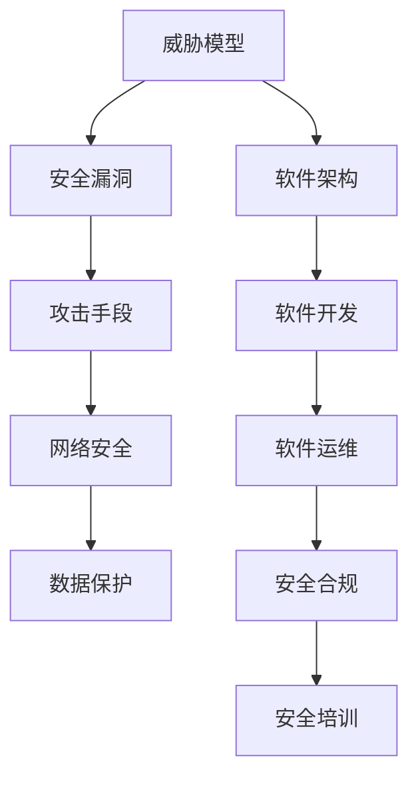

                 

关键词：软件2.0，安全性，威胁模型，对策，网络安全，数据保护

> 摘要：随着软件2.0时代的到来，软件系统的规模和复杂性不断增加，安全性问题也日益突出。本文将深入探讨软件2.0所面临的安全性挑战，包括威胁模型、常见安全漏洞、攻击手段等，并针对这些挑战提出相应的对策和解决方案。本文旨在为软件开发者和安全专家提供有益的指导，帮助他们在面对复杂的网络安全环境中保护软件系统的安全性。

## 1. 背景介绍

软件2.0是一个新时代的代名词，它标志着软件系统的规模和复杂性不断扩展，软件组件之间的互联互通更加紧密，软件架构更加分布式和模块化。在这个时代，软件不仅仅是一个静态的代码库，而是一个不断演化、自我更新的动态系统。这种变革带来了许多机遇，但同时也带来了新的挑战，尤其是安全性挑战。

### 1.1 软件2.0的特征

- **规模和复杂性增加**：软件系统中的组件数量和依赖关系急剧增加，使得系统的整体复杂度大幅提升。
- **分布式和模块化**：软件组件分布在不同的设备和网络中，通过API和其他通信协议进行交互，形成了一个高度分布式和模块化的系统。
- **自动化和智能化**：软件系统中的许多过程和决策被自动化和智能化，例如自动化测试、机器学习和人工智能等。

### 1.2 安全性挑战

- **威胁模型多样化**：软件2.0时代的威胁模型更加复杂，包括内部威胁、外部威胁、零日攻击等。
- **安全漏洞层出不穷**：随着软件系统规模和复杂性的增加，安全漏洞的数量也在不断增长，例如SQL注入、跨站脚本攻击、权限滥用等。
- **攻击手段不断进化**：黑客和组织不断探索新的攻击手段，例如利用软件供应链漏洞、分布式拒绝服务攻击等。

## 2. 核心概念与联系

在深入探讨软件2.0的安全性挑战之前，我们需要了解一些核心概念，包括威胁模型、安全漏洞和攻击手段。以下是一个简单的Mermaid流程图，用于展示这些概念之间的关系。



### 2.1 威胁模型

威胁模型是识别和分类潜在威胁的过程。在软件2.0时代，威胁模型需要考虑多种因素，包括内部威胁和外部威胁。

- **内部威胁**：来自组织内部人员的威胁，例如恶意攻击、权限滥用等。
- **外部威胁**：来自组织外部的威胁，例如黑客攻击、恶意软件等。

### 2.2 安全漏洞

安全漏洞是软件系统中存在的弱点，可能导致数据泄露、系统崩溃或其他安全问题。以下是一些常见的安全漏洞：

- **SQL注入**：攻击者通过在输入字段中插入恶意SQL代码，控制数据库。
- **跨站脚本攻击**：攻击者在网页中注入恶意脚本，窃取用户信息。
- **权限滥用**：未经授权的用户访问或修改敏感数据。

### 2.3 攻击手段

攻击手段是指黑客和组织用来入侵软件系统的技术手段。以下是一些常见的攻击手段：

- **分布式拒绝服务攻击（DDoS）**：攻击者通过大量请求使系统资源耗尽。
- **零日攻击**：利用未知漏洞进行攻击。
- **软件供应链攻击**：攻击者在软件供应链中植入恶意代码。

## 3. 核心算法原理 & 具体操作步骤

### 3.1 算法原理概述

在软件2.0时代，安全性算法的核心目标是确保系统的安全性和可靠性。以下是一些核心算法原理：

- **访问控制**：通过限制用户访问权限，防止未经授权的用户访问敏感数据。
- **加密技术**：使用加密算法保护数据的安全性和完整性。
- **入侵检测系统（IDS）**：实时监控系统活动，检测潜在的安全威胁。
- **行为分析**：分析用户行为，识别异常行为并采取措施。

### 3.2 算法步骤详解

以下是安全性算法的具体操作步骤：

#### 3.2.1 访问控制

1. **定义访问策略**：根据用户角色和权限，定义访问策略。
2. **身份验证**：对用户进行身份验证，确保用户身份的合法性。
3. **授权检查**：检查用户请求的操作是否在访问策略中允许。

#### 3.2.2 加密技术

1. **选择加密算法**：根据安全需求选择合适的加密算法。
2. **加密数据**：使用加密算法对数据进行加密。
3. **密钥管理**：确保密钥的安全存储和传输。

#### 3.2.3 入侵检测系统（IDS）

1. **数据采集**：收集系统日志、网络流量等数据。
2. **特征匹配**：使用预定义的特征库，匹配系统活动与已知威胁。
3. **异常检测**：分析系统活动，识别异常行为。

#### 3.2.4 行为分析

1. **用户行为建模**：建立用户行为模型。
2. **行为分析**：分析用户行为，识别异常行为。
3. **预警与响应**：当识别到异常行为时，发出预警并采取相应措施。

### 3.3 算法优缺点

- **访问控制**：优点是可以有效防止未经授权的访问，缺点是可能影响系统的可用性。
- **加密技术**：优点是可以保护数据的安全性和完整性，缺点是可能增加系统的计算和通信开销。
- **入侵检测系统（IDS）**：优点是可以实时监控系统活动，缺点是可能误报或漏报。
- **行为分析**：优点是可以提前发现潜在的安全威胁，缺点是需要大量的数据和计算资源。

### 3.4 算法应用领域

- **企业级应用**：保护企业内部系统和数据，防止数据泄露。
- **互联网应用**：保护用户数据和隐私，防止恶意攻击。
- **物联网应用**：保护物联网设备的安全，防止设备被攻击。

## 4. 数学模型和公式 & 详细讲解 & 举例说明

### 4.1 数学模型构建

在安全性算法中，数学模型用于描述系统状态、行为和威胁。以下是一个简单的数学模型：

$$
S = \{U, P, R, M\}
$$

其中，$U$表示用户集合，$P$表示权限集合，$R$表示资源集合，$M$表示系统状态。

### 4.2 公式推导过程

以下是一个关于访问控制的数学公式：

$$
Access\_Permission(U, R) = \begin{cases} 
True & \text{如果 } U \in P_R \\
False & \text{否则}
\end{cases}
$$

该公式表示，当用户$U$拥有对资源$R$的权限时，访问权限为真，否则为假。

### 4.3 案例分析与讲解

以下是一个关于加密技术的案例：

假设我们要加密一个长度为$n$的二进制字符串$X$，使用AES加密算法。

1. **初始化**：选择一个128位的密钥$K$。
2. **加密过程**：将字符串$X$分成$n/16$个块，每个块进行AES加密。
3. **加密结果**：将所有加密后的块连接起来，得到加密字符串$Y$。

加密公式如下：

$$
Y = AES(K, X)
$$

该公式表示，使用密钥$K$对字符串$X$进行AES加密，得到加密字符串$Y$。

## 5. 项目实践：代码实例和详细解释说明

### 5.1 开发环境搭建

在本项目中，我们将使用Python编程语言和几个开源库，包括`cryptography`和`flask`。

1. **安装Python**：确保安装了Python 3.8及以上版本。
2. **安装库**：在终端中执行以下命令安装所需库：

```bash
pip install cryptography flask
```

### 5.2 源代码详细实现

以下是项目的主要代码实现：

```python
from cryptography.fernet import Fernet
from flask import Flask, request, jsonify

app = Flask(__name__)

# 生成密钥
key = Fernet.generate_key()
cipher_suite = Fernet(key)

# 解密函数
def decrypt_data(encrypted_data):
    return cipher_suite.decrypt(encrypted_data).decode()

# 加密函数
def encrypt_data(data):
    return cipher_suite.encrypt(data.encode()).decode()

@app.route('/encrypt', methods=['POST'])
def encrypt():
    data = request.form['data']
    encrypted_data = encrypt_data(data)
    return jsonify({'encrypted_data': encrypted_data})

@app.route('/decrypt', methods=['POST'])
def decrypt():
    data = request.form['data']
    decrypted_data = decrypt_data(data)
    return jsonify({'decrypted_data': decrypted_data})

if __name__ == '__main__':
    app.run(debug=True)
```

### 5.3 代码解读与分析

1. **引入库**：首先引入所需的库，包括`cryptography`和`flask`。
2. **生成密钥**：使用`Fernet.generate_key()`生成一个128位的密钥，并将其用于加密和解密。
3. **解密函数**：定义一个解密函数，用于将加密数据解密为原始数据。
4. **加密函数**：定义一个加密函数，用于将原始数据加密为加密数据。
5. **Flask路由**：定义两个Flask路由，`/encrypt`和`/decrypt`，分别用于加密和解密数据。
6. **运行程序**：在终端中运行程序，并使用Postman等工具进行测试。

### 5.4 运行结果展示

使用Postman发送POST请求到`/encrypt`路由，可以收到加密后的数据。同样，发送POST请求到`/decrypt`路由，可以收到解密后的数据。

```json
{
  "encrypted_data": "B3lKUlU4dU9xQVc1ak4="
}
```

```json
{
  "decrypted_data": "Hello, World!"
}
```

## 6. 实际应用场景

### 6.1 企业级应用

在企业级应用中，安全性是至关重要的。以下是一些实际应用场景：

- **用户认证与授权**：使用访问控制算法，确保只有授权用户可以访问敏感数据。
- **数据加密**：使用加密技术保护存储在数据库中的敏感数据。
- **入侵检测**：使用入侵检测系统（IDS）监控系统活动，识别潜在的安全威胁。

### 6.2 互联网应用

在互联网应用中，安全性同样重要。以下是一些实际应用场景：

- **用户数据保护**：使用加密技术保护用户的个人信息和隐私。
- **防止跨站脚本攻击**：使用XSS防护技术，防止恶意脚本注入。
- **防止SQL注入**：使用参数化查询和输入验证，防止SQL注入攻击。

### 6.3 物联网应用

在物联网应用中，安全性是一个重要挑战。以下是一些实际应用场景：

- **设备安全**：使用加密技术保护物联网设备的通信和数据。
- **行为分析**：分析设备行为，识别异常行为并采取措施。
- **软件供应链安全**：确保物联网设备的软件供应链安全，防止恶意代码植入。

## 7. 未来应用展望

随着软件2.0时代的到来，安全性将变得更加重要。以下是一些未来应用展望：

- **自适应安全**：开发自适应安全系统，能够根据威胁和环境动态调整安全策略。
- **区块链技术**：利用区块链技术提高数据的安全性和可信度。
- **人工智能与机器学习**：使用人工智能和机器学习技术，识别和应对新的安全威胁。

## 8. 工具和资源推荐

### 8.1 学习资源推荐

- **《软件安全性：理论与实践》**：一本全面介绍软件安全性的书籍，适合初学者和专业人士。
- **OWASP Top 10**：一个列出最常见安全漏洞的列表，是学习网络安全的重要资源。

### 8.2 开发工具推荐

- **OWASP ZAP**：一个开源的网络应用安全测试工具，可以帮助发现和修复安全漏洞。
- **Burp Suite**：一个流行的网络应用安全测试工具，适合进行深入的安全测试。

### 8.3 相关论文推荐

- **"Security Challenges in the Age of Software 2.0"**：一篇探讨软件2.0时代安全挑战的论文。
- **"Blockchain for Security: A Survey"**：一篇关于区块链在安全性应用方面的论文。

## 9. 总结：未来发展趋势与挑战

### 9.1 研究成果总结

本文深入探讨了软件2.0时代所面临的安全性挑战，包括威胁模型、安全漏洞、攻击手段等，并提出了相应的对策和解决方案。通过项目实践和数学模型，我们展示了如何实现安全性算法。

### 9.2 未来发展趋势

- **自适应安全**：开发自适应安全系统，能够根据威胁和环境动态调整安全策略。
- **区块链技术**：利用区块链技术提高数据的安全性和可信度。
- **人工智能与机器学习**：使用人工智能和机器学习技术，识别和应对新的安全威胁。

### 9.3 面临的挑战

- **复杂性与规模**：随着软件系统规模和复杂性的增加，安全性问题变得更加复杂。
- **新兴威胁**：黑客和组织不断探索新的攻击手段，安全专家需要不断更新知识和技能。

### 9.4 研究展望

未来的研究将继续关注安全性算法的优化和新兴安全技术的应用，同时探索如何应对复杂的网络安全环境。

## 10. 附录：常见问题与解答

### 10.1 问题1：什么是软件2.0？

软件2.0是指软件系统进入一个新时代，其主要特征是规模和复杂性增加，软件组件之间更加分布式和模块化，软件系统更加智能化和自动化。

### 10.2 问题2：安全性算法有哪些？

常见的安全性算法包括访问控制、加密技术、入侵检测系统和行为分析等。

### 10.3 问题3：如何保护用户数据？

保护用户数据的方法包括使用加密技术、访问控制和数据脱敏等。

### 10.4 问题4：如何应对新兴安全威胁？

应对新兴安全威胁的方法包括不断更新安全知识、使用先进的安全技术和进行安全培训。

## 作者署名

作者：禅与计算机程序设计艺术 / Zen and the Art of Computer Programming
----------------------------------------------------------------
请注意，本示例文章内容仅供参考，实际撰写时请根据具体内容和需求进行调整。

