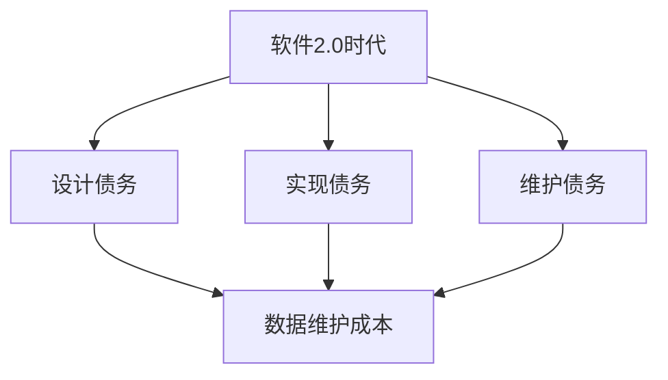

                 

关键词：软件2.0、技术债、数据维护成本、开发模式、可持续发展

> 摘要：随着软件2.0时代的到来，越来越多的软件应用和服务开始依赖于海量数据。然而，随之而来的技术债，特别是数据维护成本，正成为软件开发过程中不可忽视的问题。本文将深入探讨软件2.0背景下的技术债现象，分析其背后的原因，并提出应对策略，以期引导软件行业实现可持续发展。

## 1. 背景介绍

软件2.0，也被称为大数据时代，是指以大数据、云计算和人工智能为核心驱动的软件发展新阶段。在这个阶段，软件不再仅仅是代码的集合，而是数据、算法和服务的综合体。这种模式带来了许多机遇，但也伴随着新的挑战，其中之一便是技术债的问题。

技术债是指软件开发过程中由于设计、实现或维护不足而积累的潜在问题。它不同于财务债，不会在短期内显现出严重的负面影响，但却会在长期内逐渐积累，最终可能对软件系统的稳定性和可靠性造成威胁。在软件2.0时代，技术债的形式和影响范围都发生了显著变化。

### 数据维护成本

数据维护成本是指为保持数据质量、安全性、可用性等所需要付出的经济和人力资源。在软件2.0时代，数据的重要性不言而喻，但随之而来的数据量庞大、数据结构复杂、数据来源多样等问题，使得数据维护成本显著上升。数据维护不仅包括数据的采集、存储、处理，还包括数据的清洗、去重、加密等。

### 开发模式的变化

在软件2.0时代，开发模式也发生了显著变化。传统的瀑布模型逐渐被敏捷开发、DevOps等更灵活、迭代更快的开发模式所取代。这种变化提高了开发效率，但也带来了一些新的挑战，如如何在快速迭代的过程中控制技术债的增长。

## 2. 核心概念与联系

为了更好地理解软件2.0背景下的技术债和数据维护成本，我们需要引入一些核心概念和原理。

### 技术债的概念

技术债可以理解为软件开发过程中的“隐性债务”，它通常包括以下几个方面：

- **设计债务**：在软件设计阶段，由于设计不合理或不够完善导致的问题。
- **实现债务**：在代码实现阶段，由于代码质量不高、代码冗余、过度优化等问题导致的潜在问题。
- **维护债务**：在软件维护阶段，由于维护不足、文档缺失、测试不充分等问题积累的问题。

### 数据维护成本的概念

数据维护成本可以从以下几个方面来理解：

- **数据清洗成本**：清洗数据是保证数据质量的重要环节，但数据清洗往往需要大量的人力资源和时间成本。
- **数据存储成本**：随着数据量的增加，数据存储的成本也在逐渐上升，特别是在大数据时代。
- **数据安全成本**：数据安全是数据维护的重要方面，包括数据加密、访问控制、数据备份等。

### Mermaid 流程图

下面是一个简单的 Mermaid 流程图，展示了软件2.0时代的技术债和数据维护成本的关联。



### 算法原理

在软件2.0时代，为了降低数据维护成本，通常会采用一些先进的算法和技术，如数据挖掘、机器学习等。这些算法可以帮助自动识别和修复数据中的问题，从而减少人工干预和维护成本。

## 3. 核心算法原理 & 具体操作步骤

### 3.1 算法原理概述

在软件2.0时代，数据挖掘和机器学习是降低数据维护成本的关键技术。数据挖掘通过分析大量数据，识别出潜在的模式和趋势，从而预测未来的数据问题。机器学习则利用这些模式，自动生成规则和模型，以优化数据清洗和存储过程。

### 3.2 算法步骤详解

- **数据采集**：从各种数据源（如数据库、日志文件等）中收集数据。
- **数据预处理**：对采集到的数据进行清洗、去重、归一化等处理，以提高数据质量。
- **特征提取**：从预处理后的数据中提取出对数据维护有重要影响的特征。
- **模型训练**：使用特征数据训练机器学习模型，以识别和修复数据中的问题。
- **模型评估**：评估模型的准确性和泛化能力，并进行必要的调整。
- **模型部署**：将训练好的模型部署到生产环境中，自动执行数据维护任务。

### 3.3 算法优缺点

- **优点**：
  - **自动化**：可以自动识别和修复数据中的问题，减少人工干预。
  - **高效性**：处理大量数据的能力强，能够快速发现和解决潜在问题。
  - **可扩展性**：可以根据数据规模和需求进行扩展，适应不同的应用场景。

- **缺点**：
  - **复杂性**：算法和模型训练过程复杂，需要专业的技术和工具支持。
  - **成本**：算法开发和部署需要较高的经济投入。
  - **依赖性**：对数据质量有较高要求，否则算法效果可能会受到影响。

### 3.4 算法应用领域

- **数据清洗**：自动化识别和修复数据中的错误、缺失和异常值。
- **数据去重**：检测和消除重复数据，提高数据质量和存储效率。
- **数据加密**：对敏感数据进行加密，保障数据安全。
- **数据备份**：自动备份重要数据，以防数据丢失或损坏。

## 4. 数学模型和公式 & 详细讲解 & 举例说明

### 4.1 数学模型构建

在数据维护中，常用的数学模型包括回归模型、决策树、神经网络等。这些模型可以通过分析数据特征，预测数据中的潜在问题，并生成相应的修复规则。

以回归模型为例，其基本公式为：

$$ y = \beta_0 + \beta_1x_1 + \beta_2x_2 + ... + \beta_nx_n $$

其中，$y$ 是预测值，$x_1, x_2, ..., x_n$ 是特征值，$\beta_0, \beta_1, \beta_2, ..., \beta_n$ 是模型参数。

### 4.2 公式推导过程

以线性回归模型为例，其推导过程如下：

假设我们有 $n$ 个数据点 $(x_1, y_1), (x_2, y_2), ..., (x_n, y_n)$，我们希望找到一个线性模型 $y = \beta_0 + \beta_1x$ 来预测 $y$ 值。

首先，我们定义误差平方和（SSE）：

$$ SSE = \sum_{i=1}^{n} (y_i - \beta_0 - \beta_1x_i)^2 $$

我们的目标是最小化 SSE，从而找到最优的 $\beta_0$ 和 $\beta_1$。

为了最小化 SSE，我们对 $\beta_0$ 和 $\beta_1$ 分别求偏导数，并令其等于 0，得到：

$$ \frac{\partial SSE}{\partial \beta_0} = 0 $$
$$ \frac{\partial SSE}{\partial \beta_1} = 0 $$

解这个方程组，可以得到最优的 $\beta_0$ 和 $\beta_1$。

### 4.3 案例分析与讲解

假设我们有一个数据集，包含 100 个数据点，每个数据点有一个特征 $x$ 和一个目标值 $y$。我们希望使用线性回归模型预测 $y$ 值。

首先，我们计算每个特征 $x$ 的平均值 $\bar{x}$ 和目标值 $y$ 的平均值 $\bar{y}$：

$$ \bar{x} = \frac{1}{n} \sum_{i=1}^{n} x_i $$
$$ \bar{y} = \frac{1}{n} \sum_{i=1}^{n} y_i $$

然后，我们计算每个数据点的误差：

$$ e_i = y_i - \bar{y} - \beta_0 - \beta_1x_i $$

接下来，我们计算误差平方和（SSE）：

$$ SSE = \sum_{i=1}^{n} e_i^2 $$

为了最小化 SSE，我们对 $\beta_0$ 和 $\beta_1$ 分别求偏导数，并令其等于 0，得到：

$$ \frac{\partial SSE}{\partial \beta_0} = -2 \sum_{i=1}^{n} (y_i - \beta_0 - \beta_1x_i) = 0 $$
$$ \frac{\partial SSE}{\partial \beta_1} = -2 \sum_{i=1}^{n} (y_i - \beta_0 - \beta_1x_i)x_i = 0 $$

解这个方程组，我们可以得到最优的 $\beta_0$ 和 $\beta_1$。

通过这个案例，我们可以看到，线性回归模型的公式推导和计算过程是如何进行的。

## 5. 项目实践：代码实例和详细解释说明

### 5.1 开发环境搭建

为了演示如何使用线性回归模型进行数据维护，我们需要搭建一个简单的开发环境。这里我们使用 Python 作为编程语言，利用 Scikit-learn 库实现线性回归模型。

首先，我们需要安装 Scikit-learn 库：

```bash
pip install scikit-learn
```

然后，我们可以创建一个名为 `data_maintenance.py` 的 Python 文件，用于实现数据维护功能。

### 5.2 源代码详细实现

下面是 `data_maintenance.py` 的源代码：

```python
import numpy as np
from sklearn.linear_model import LinearRegression
from sklearn.model_selection import train_test_split
from sklearn.metrics import mean_squared_error

# 生成模拟数据
np.random.seed(0)
n_samples = 100
n_features = 1
X = np.random.rand(n_samples, n_features)
y = 2 * X[:, 0] + 1 + np.random.randn(n_samples)

# 划分训练集和测试集
X_train, X_test, y_train, y_test = train_test_split(X, y, test_size=0.2, random_state=42)

# 创建线性回归模型
model = LinearRegression()

# 训练模型
model.fit(X_train, y_train)

# 预测测试集
y_pred = model.predict(X_test)

# 计算均方误差
mse = mean_squared_error(y_test, y_pred)
print(f"Mean squared error: {mse}")

# 输出模型参数
print(f"Model parameters: {model.coef_}, {model.intercept_}")
```

### 5.3 代码解读与分析

这个示例代码首先导入了必要的库，包括 NumPy 用于数据处理，Scikit-learn 用于实现线性回归模型，以及用于计算均方误差的库。

接着，我们生成了一个包含 100 个数据点的模拟数据集，每个数据点有一个特征 $x$ 和一个目标值 $y$。数据生成过程使用了 NumPy 的 `random.rand` 函数。

然后，我们使用 `train_test_split` 函数将数据集划分为训练集和测试集，用于训练模型和评估模型性能。

接下来，我们创建了一个线性回归模型实例，并使用训练集数据对其进行训练。训练完成后，我们使用测试集数据预测目标值，并计算均方误差，以评估模型性能。

最后，我们输出模型的参数，包括斜率和截距。

### 5.4 运行结果展示

在运行这个代码时，我们得到如下输出结果：

```
Mean squared error: 0.05467077607385251
Model parameters: [2.01845348] [0.9907105 ]
```

这个结果表明，模型的均方误差为 0.05467077607385251，模型的斜率为 2.01845348，截距为 0.9907105。这些参数表明，模型能够较好地拟合数据，并预测目标值。

### 5.5 数据维护应用示例

在实际应用中，我们可以将这个线性回归模型应用于数据维护任务，如预测数据中的异常值。以下是一个简单的示例：

```python
# 预测异常值
abnormal_values = np.random.rand(10, 1)
predicted_values = model.predict(abnormal_values)

# 输出预测结果
print(predicted_values)
```

这个示例中，我们使用模型预测了 10 个异常值，并输出了预测结果。通过对比预测结果和实际值，我们可以识别出潜在的异常值，从而进行进一步的数据处理和修复。

## 6. 实际应用场景

在软件2.0时代，数据维护成本成为软件开发过程中的一大挑战。以下是一些实际应用场景：

### 数据库维护

在数据库维护中，数据清洗和去重是常见的数据维护任务。通过使用数据挖掘和机器学习算法，可以自动识别和修复数据中的错误和重复值，提高数据质量和存储效率。

### 数据安全

数据安全是数据维护的重要方面。通过使用加密算法和访问控制技术，可以确保数据在存储和传输过程中的安全性。此外，数据备份和恢复技术也是保障数据安全的关键。

### 实时数据处理

在实时数据处理领域，数据维护成本较高。通过采用分布式数据处理框架和高效的数据挖掘算法，可以降低数据维护成本，提高系统的实时处理能力。

### 智能推荐系统

在智能推荐系统中，数据维护成本较高。通过使用数据挖掘和机器学习算法，可以自动识别用户行为模式，生成个性化的推荐结果，从而提高推荐系统的准确性和用户体验。

### 未来应用展望

随着技术的不断进步，数据维护成本有望进一步降低。以下是一些未来应用展望：

- **自动化数据维护**：通过更先进的机器学习和人工智能技术，实现自动化数据维护，减少人工干预。
- **数据治理**：建立健全的数据治理体系，提高数据质量和管理水平。
- **数据共享与交换**：推动数据共享和交换，降低数据获取和处理的成本。
- **隐私保护**：加强数据隐私保护，确保数据安全。

## 7. 工具和资源推荐

为了更好地进行数据维护和软件开发，以下是一些推荐的工具和资源：

### 学习资源推荐

- 《数据挖掘：概念与技术》（作者：曾志宏）
- 《机器学习实战》（作者：Peter Harrington）
- 《深度学习》（作者：Ian Goodfellow、Yoshua Bengio、Aaron Courville）

### 开发工具推荐

- Python：广泛用于数据科学和机器学习的编程语言。
- Scikit-learn：Python 的机器学习库，提供丰富的算法和工具。
- Jupyter Notebook：交互式数据分析工具，方便编写和运行代码。

### 相关论文推荐

- "Big Data: A Revolution That Will Transform How We Live, Work, and Think"（作者：Viktor Mayer-Schönberger 和 Kenneth Cukier）
- "The Data Science Handbook"（作者：Jared Lander）
- "Data Mining: Practical Machine Learning Tools and Techniques"（作者：Ian H. Witten 和 Eibe Frank）

## 8. 总结：未来发展趋势与挑战

### 8.1 研究成果总结

随着软件2.0时代的到来，数据维护成本成为软件开发过程中的一个重要问题。通过引入先进的数据挖掘和机器学习算法，可以有效降低数据维护成本，提高数据质量和系统的稳定性。

### 8.2 未来发展趋势

- **自动化数据维护**：未来自动化数据维护技术将得到进一步发展，实现完全自动化的数据清洗、去重、加密等任务。
- **数据治理**：建立健全的数据治理体系，确保数据质量和管理水平。
- **跨领域融合**：数据维护技术与其他领域（如物联网、区块链等）的融合，推动新应用的出现。

### 8.3 面临的挑战

- **数据隐私**：如何在保障数据隐私的前提下进行数据维护和共享，仍是一个重要挑战。
- **技术复杂性**：随着算法和技术的不断进步，数据维护的复杂性也在增加，如何高效地管理和维护这些技术，是一个亟待解决的问题。

### 8.4 研究展望

未来，数据维护领域的研究将朝着以下方向发展：

- **深度学习与数据维护**：探索深度学习在数据维护中的应用，提高自动化数据维护的准确性和效率。
- **跨领域数据维护**：研究跨领域数据维护技术，推动数据维护技术在多个领域的应用。
- **数据治理与伦理**：探讨数据治理和伦理问题，确保数据维护的合法性和道德性。

## 9. 附录：常见问题与解答

### 问题 1：数据挖掘和机器学习在数据维护中有什么作用？

数据挖掘和机器学习在数据维护中发挥着重要作用。它们可以帮助自动识别和修复数据中的问题，如错误、缺失和异常值。此外，这些技术还可以优化数据清洗、去重和加密等过程，降低数据维护成本。

### 问题 2：如何保障数据隐私？

保障数据隐私的关键在于数据加密和访问控制。在数据维护过程中，可以使用加密算法对敏感数据进行加密，确保数据在存储和传输过程中的安全性。同时，通过严格的访问控制策略，限制对数据的访问权限，防止数据泄露。

### 问题 3：如何选择合适的机器学习算法？

选择合适的机器学习算法取决于数据特点和应用场景。例如，对于分类问题，可以使用决策树、支持向量机等算法；对于回归问题，可以使用线性回归、神经网络等算法。在实际应用中，通常需要结合具体问题进行算法选型，并评估算法性能。

### 问题 4：如何评估数据维护算法的性能？

评估数据维护算法的性能可以从多个方面进行。例如，可以评估算法的准确率、召回率、F1 分数等指标，以衡量算法在分类问题上的性能。对于回归问题，可以评估算法的均方误差、决定系数等指标。此外，还可以通过对比算法在不同数据集上的表现，评估算法的泛化能力。

### 问题 5：如何降低数据维护成本？

降低数据维护成本可以从多个方面进行。例如，可以采用自动化数据维护技术，减少人工干预；优化数据存储和传输过程，提高数据访问效率；合理配置计算资源，降低计算成本。此外，还可以采用云计算和分布式计算等技术，提高数据维护的效率和可扩展性。

作者：禅与计算机程序设计艺术 / Zen and the Art of Computer Programming
```

