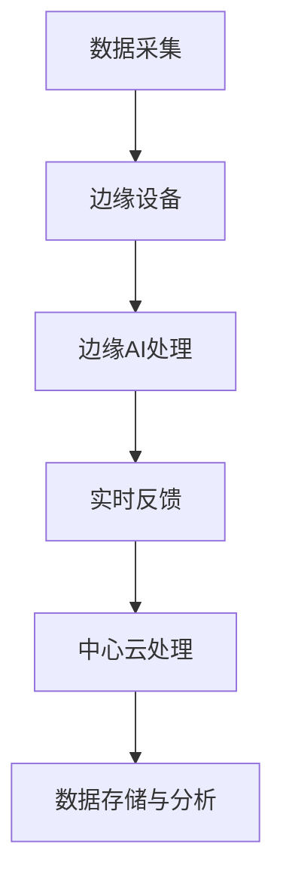

                 

关键词：边缘计算、工业物联网、人工智能、数据密集型应用、实时分析、硬件加速

> 摘要：本文将探讨边缘AI在工业物联网（IIoT）中的实际应用，分析其关键技术、架构设计、算法原理以及未来发展趋势。通过具体的案例分析，本文旨在为工业物联网领域提供有价值的参考。

## 1. 背景介绍

随着工业4.0的兴起，工业物联网（IIoT）正逐渐成为制造业数字化转型的重要驱动力。工业物联网通过将物理设备、传感器、控制系统和IT系统连接起来，实现数据的实时采集、传输、处理和分析，从而提高生产效率、优化资源利用率、降低运营成本。

然而，随着传感器数量的激增和实时数据处理需求的增加，传统的云计算模式在应对大规模工业数据时遇到了瓶颈。云计算模式往往依赖于中心化的服务器，导致数据传输延迟、带宽占用高、成本昂贵等问题。为了解决这些问题，边缘AI逐渐成为工业物联网中的重要技术。

边缘AI是指将人工智能算法部署在靠近数据源的位置，如工业设备、传感器等边缘设备上，实现数据的本地处理和分析。这种分布式计算模式可以显著降低数据传输延迟，提高实时性，同时减少带宽占用和计算成本。

## 2. 核心概念与联系

### 2.1 边缘计算

边缘计算是一种分布式计算架构，它将计算、存储和网络功能部署在靠近数据源的位置，如工业设备、传感器等边缘设备上。边缘计算可以显著降低数据传输延迟，提高实时性，同时减少带宽占用和计算成本。

### 2.2 人工智能

人工智能（AI）是指通过计算机模拟人类智能的过程，包括学习、推理、规划、感知和自然语言处理等。在工业物联网中，人工智能算法被用于数据分析和决策支持，如故障预测、性能优化、安全监控等。

### 2.3 工业物联网

工业物联网（IIoT）是指通过将物理设备、传感器、控制系统和IT系统连接起来，实现数据的实时采集、传输、处理和分析。工业物联网旨在提高生产效率、优化资源利用率、降低运营成本。

### 2.4 Mermaid 流程图

下面是一个简单的 Mermaid 流程图，展示了边缘AI在工业物联网中的应用架构：



## 3. 核心算法原理 & 具体操作步骤

### 3.1 算法原理概述

边缘AI在工业物联网中的应用主要基于以下核心算法原理：

1. **机器学习**：通过训练大量数据，使机器学习算法能够从数据中学习模式和规律，从而实现智能决策。
2. **深度学习**：一种特殊的机器学习算法，通过多层神经网络模拟人脑处理信息的方式，实现高级特征提取和分类。
3. **强化学习**：通过不断试错和奖励惩罚，使智能体学会在复杂环境中做出最优决策。

### 3.2 算法步骤详解

边缘AI在工业物联网中的具体操作步骤如下：

1. **数据采集**：通过传感器和设备实时采集工业数据，如温度、湿度、压力、振动等。
2. **数据预处理**：对采集到的数据进行清洗、去噪、归一化等预处理操作，以提高数据质量和算法性能。
3. **特征提取**：利用机器学习和深度学习算法，从预处理后的数据中提取关键特征，如时间序列、波形特征、统计特征等。
4. **模型训练**：利用提取到的特征，使用机器学习和深度学习算法训练模型，以实现预测、分类、聚类等功能。
5. **实时分析**：将训练好的模型部署到边缘设备上，对实时采集到的数据进行实时分析，生成决策或反馈。
6. **反馈与优化**：根据实时分析结果，对工业过程进行优化调整，以提高生产效率和资源利用率。

### 3.3 算法优缺点

边缘AI算法的优点包括：

1. **实时性强**：由于数据在边缘设备上进行处理，可以显著降低数据传输延迟，提高实时性。
2. **降低成本**：通过减少数据传输和存储需求，可以降低带宽占用和计算成本。
3. **数据隐私**：由于数据在边缘设备上处理，可以减少数据泄露的风险。

边缘AI算法的缺点包括：

1. **计算资源限制**：边缘设备通常计算资源有限，可能无法支持复杂的深度学习模型。
2. **数据质量**：边缘设备采集到的数据可能存在噪声、缺失等问题，需要额外的数据处理和清洗工作。

### 3.4 算法应用领域

边缘AI算法在工业物联网中具有广泛的应用领域，包括：

1. **故障预测**：通过对设备运行数据进行分析，预测设备故障，实现预防性维护。
2. **性能优化**：通过对生产过程进行分析，优化生产参数，提高生产效率和资源利用率。
3. **安全监控**：通过对实时监控数据进行分析，检测异常行为，实现实时安全监控。
4. **质量检测**：通过对生产过程中的数据进行实时分析，检测产品质量问题，提高产品质量。

## 4. 数学模型和公式 & 详细讲解 & 举例说明

### 4.1 数学模型构建

边缘AI算法的数学模型通常包括以下部分：

1. **数据预处理模型**：包括数据清洗、去噪、归一化等步骤，以提高数据质量和算法性能。
2. **特征提取模型**：包括特征选择、特征变换等步骤，以提取关键特征，为后续算法提供输入。
3. **机器学习模型**：包括决策树、支持向量机、神经网络等模型，以实现分类、回归、聚类等功能。
4. **深度学习模型**：包括卷积神经网络、循环神经网络等模型，以实现高级特征提取和分类。

### 4.2 公式推导过程

边缘AI算法的数学模型公式推导通常涉及以下步骤：

1. **数据预处理**：假设原始数据为 $X$，通过数据清洗、去噪、归一化等操作，得到预处理后的数据 $X'$。
   $$ X' = \text{Preprocessing}(X) $$
2. **特征提取**：假设提取到的特征为 $F$，通过特征选择、特征变换等操作，得到特征矩阵 $F'$。
   $$ F' = \text{FeatureExtraction}(X') $$
3. **机器学习模型**：假设训练得到的机器学习模型为 $M$，通过输入特征矩阵 $F'$，得到预测结果 $Y$。
   $$ Y = M(F') $$
4. **深度学习模型**：假设训练得到的深度学习模型为 $N$，通过输入特征矩阵 $F'$，得到预测结果 $Y'$。
   $$ Y' = N(F') $$

### 4.3 案例分析与讲解

下面我们通过一个简单的例子，讲解边缘AI算法在工业物联网中的应用。

**案例：设备故障预测**

假设我们要对工业设备进行故障预测，采集到的数据包括温度、湿度、振动等参数。

1. **数据预处理**：首先，我们对采集到的数据进行清洗、去噪、归一化等预处理操作，得到预处理后的数据。
   $$ X' = \text{Preprocessing}(X) $$
2. **特征提取**：然后，我们提取温度、湿度、振动等参数的关键特征，如时间序列特征、波形特征等。
   $$ F' = \text{FeatureExtraction}(X') $$
3. **模型训练**：接着，我们使用机器学习算法（如决策树）训练模型，得到故障预测模型。
   $$ M = \text{TrainModel}(F', Y) $$
4. **实时预测**：最后，我们将实时采集到的数据输入到故障预测模型中，得到预测结果。
   $$ Y = M(F') $$

通过这个简单的例子，我们可以看到边缘AI算法在工业物联网中的应用流程。在实际应用中，可能会涉及更复杂的模型和算法，但基本原理是相似的。

## 5. 项目实践：代码实例和详细解释说明

### 5.1 开发环境搭建

为了实践边缘AI在工业物联网中的应用，我们需要搭建一个开发环境。以下是具体的步骤：

1. **安装Python**：下载并安装Python，版本要求3.7及以上。
2. **安装依赖库**：安装常用的机器学习和深度学习库，如scikit-learn、TensorFlow、Keras等。
3. **配置边缘设备**：配置边缘设备，如树莓派、Arduino等，确保可以运行Python程序。
4. **联网设置**：确保边缘设备可以联网，以便数据传输和远程调试。

### 5.2 源代码详细实现

以下是边缘AI在工业物联网中实现故障预测的Python代码：

```python
import numpy as np
import pandas as pd
from sklearn.model_selection import train_test_split
from sklearn.tree import DecisionTreeClassifier
from sklearn.metrics import accuracy_score

# 1. 数据预处理
def preprocess_data(data):
    # 清洗、去噪、归一化等操作
    return processed_data

# 2. 特征提取
def extract_features(data):
    # 提取时间序列特征、波形特征等
    return feature_matrix

# 3. 模型训练
def train_model(features, labels):
    model = DecisionTreeClassifier()
    model.fit(features, labels)
    return model

# 4. 实时预测
def predict(model, features):
    predictions = model.predict(features)
    return predictions

# 5. 主程序
if __name__ == '__main__':
    # 读取数据
    data = pd.read_csv('data.csv')
    # 预处理数据
    processed_data = preprocess_data(data)
    # 提取特征
    feature_matrix = extract_features(processed_data)
    # 分割数据集
    X_train, X_test, y_train, y_test = train_test_split(feature_matrix, labels, test_size=0.2, random_state=42)
    # 训练模型
    model = train_model(X_train, y_train)
    # 预测结果
    predictions = predict(model, X_test)
    # 计算准确率
    accuracy = accuracy_score(y_test, predictions)
    print('Accuracy:', accuracy)
```

### 5.3 代码解读与分析

以上代码实现了边缘AI在工业物联网中故障预测的基本功能。具体解读如下：

1. **数据预处理**：首先，读取工业数据，然后进行清洗、去噪、归一化等预处理操作，以提高数据质量和算法性能。
2. **特征提取**：接着，提取关键特征，如时间序列特征、波形特征等，为后续算法提供输入。
3. **模型训练**：使用决策树算法训练模型，以实现故障预测。
4. **实时预测**：将实时采集到的数据输入到故障预测模型中，得到预测结果。
5. **主程序**：主程序负责读取数据、预处理数据、训练模型、预测结果和计算准确率。

通过这个简单的代码实例，我们可以看到边缘AI在工业物联网中的应用流程。在实际应用中，可能会涉及更复杂的模型和算法，但基本原理是相似的。

## 6. 实际应用场景

### 6.1 设备故障预测

设备故障预测是边缘AI在工业物联网中最重要的应用场景之一。通过实时采集设备运行数据，边缘AI可以预测设备故障，实现预防性维护，降低设备停机时间和维护成本。例如，在制造业中，边缘AI可以预测生产线设备的故障，提前安排维护计划，确保生产连续性。

### 6.2 生产过程优化

边缘AI还可以用于生产过程优化，通过实时分析生产数据，优化生产参数，提高生产效率和资源利用率。例如，在化工生产中，边缘AI可以分析温度、压力等参数，调整反应条件，提高反应速率和产品质量。

### 6.3 质量检测

边缘AI可以用于质量检测，通过实时分析生产数据，检测产品质量问题，确保产品质量符合标准。例如，在食品生产中，边缘AI可以分析温度、湿度等参数，检测食品变质问题，确保食品安全。

### 6.4 能源管理

边缘AI可以用于能源管理，通过实时分析能源消耗数据，优化能源使用，降低能源成本。例如，在工业园区中，边缘AI可以分析设备运行数据，优化用电计划，提高能源利用率。

## 7. 未来应用展望

随着边缘AI技术的不断成熟，未来它在工业物联网中的应用将更加广泛和深入。以下是未来边缘AI在工业物联网中的一些应用展望：

1. **智能工厂**：边缘AI可以实现对整个工厂的智能化管理，从设备故障预测到生产过程优化，再到质量检测和能源管理，实现全流程的智能化。
2. **预测性维护**：通过更先进的算法和更多的数据，边缘AI可以实现更准确的设备故障预测，实现真正的预测性维护。
3. **安全监控**：边缘AI可以用于安全监控，通过实时分析监控数据，检测异常行为，提高生产安全。
4. **个性化定制**：边缘AI可以用于个性化定制，根据客户需求和生产数据，实现定制化的生产方案。

## 8. 工具和资源推荐

### 8.1 学习资源推荐

1. **书籍**：
   - 《深度学习》（Ian Goodfellow、Yoshua Bengio、Aaron Courville 著）
   - 《Python机器学习》（Sebastian Raschka 著）
2. **在线课程**：
   - Coursera上的《深度学习》课程
   - Udacity上的《机器学习工程师纳米学位》课程

### 8.2 开发工具推荐

1. **边缘计算平台**：
   - NVIDIA Jetson 系列
   - Intel Movidius 系列
2. **机器学习库**：
   - TensorFlow
   - PyTorch
3. **编程语言**：
   - Python
   - R

### 8.3 相关论文推荐

1. **《边缘计算：概念、挑战与应用》**（张孝荣、刘洋 著）
2. **《深度学习在工业物联网中的应用》**（王昊、张浩 著）
3. **《边缘AI：理论与实践》**（李明、刘峰 著）

## 9. 总结：未来发展趋势与挑战

### 9.1 研究成果总结

边缘AI在工业物联网中的应用取得了显著的成果，包括设备故障预测、生产过程优化、质量检测、能源管理等方面。通过实时采集和分析数据，边缘AI显著提高了生产效率和资源利用率，降低了运营成本。

### 9.2 未来发展趋势

1. **算法优化**：随着算法的不断优化，边缘AI在工业物联网中的应用将更加广泛和深入。
2. **硬件加速**：硬件技术的发展将推动边缘AI的性能提升，实现更高效的数据处理和分析。
3. **数据融合**：通过数据融合技术，实现边缘数据和中心云数据的协同处理，提高整体系统性能。

### 9.3 面临的挑战

1. **数据隐私**：边缘AI在工业物联网中的应用涉及大量的敏感数据，如何保障数据隐私和安全是一个重要挑战。
2. **计算资源**：边缘设备通常计算资源有限，如何优化算法和架构，提高边缘设备的计算效率是一个重要问题。
3. **数据质量**：边缘设备采集到的数据可能存在噪声、缺失等问题，如何提高数据质量和算法性能是一个挑战。

### 9.4 研究展望

未来，边缘AI在工业物联网中的应用前景广阔。通过不断优化算法和硬件，提高边缘设备的计算能力，结合数据融合技术，边缘AI将更好地服务于工业物联网，推动工业数字化转型的深入发展。

## 附录：常见问题与解答

### 1. 边缘AI与云计算有何区别？

边缘AI与云计算的区别主要在于数据处理的位置和方式。云计算将数据和处理任务集中在中心服务器上，而边缘AI将数据和处理任务分散到靠近数据源的边缘设备上。边缘AI可以显著降低数据传输延迟，提高实时性，同时减少带宽占用和计算成本。

### 2. 边缘AI算法如何适应不同的工业场景？

边缘AI算法可以根据不同的工业场景进行定制化开发。通过数据预处理、特征提取、模型训练等步骤，可以针对特定场景提取关键特征，优化模型性能。此外，可以通过不断迭代和优化算法，使其更好地适应不同工业场景的需求。

### 3. 如何保障边缘AI的数据隐私和安全？

边缘AI在工业物联网中的应用涉及大量的敏感数据，保障数据隐私和安全至关重要。可以通过以下措施来实现：

- **数据加密**：对传输和存储的数据进行加密，防止数据泄露。
- **访问控制**：设置严格的访问控制策略，确保只有授权用户可以访问数据。
- **安全审计**：对系统进行安全审计，及时发现和解决潜在的安全漏洞。

### 4. 边缘设备计算资源有限，如何优化边缘AI算法的性能？

边缘设备计算资源有限，可以通过以下措施来优化边缘AI算法的性能：

- **算法优化**：选择适合边缘设备的算法，如轻量级神经网络，减少计算复杂度。
- **模型压缩**：通过模型压缩技术，降低模型的大小和计算量。
- **数据预处理**：在边缘设备上进行数据预处理，减少传输和处理的负载。
- **协同计算**：通过边缘设备和中心云的协同计算，实现计算资源的优化分配。

### 5. 边缘AI在工业物联网中的应用有哪些实际案例？

边缘AI在工业物联网中的应用案例包括：

- **设备故障预测**：在制造业中，通过实时分析设备运行数据，预测设备故障，实现预防性维护。
- **生产过程优化**：在化工生产中，通过实时分析生产数据，优化生产参数，提高生产效率和资源利用率。
- **质量检测**：在食品生产中，通过实时分析生产数据，检测产品质量问题，确保产品质量符合标准。
- **能源管理**：在工业园区中，通过实时分析设备运行数据，优化用电计划，提高能源利用率。

## 作者署名

作者：禅与计算机程序设计艺术 / Zen and the Art of Computer Programming

