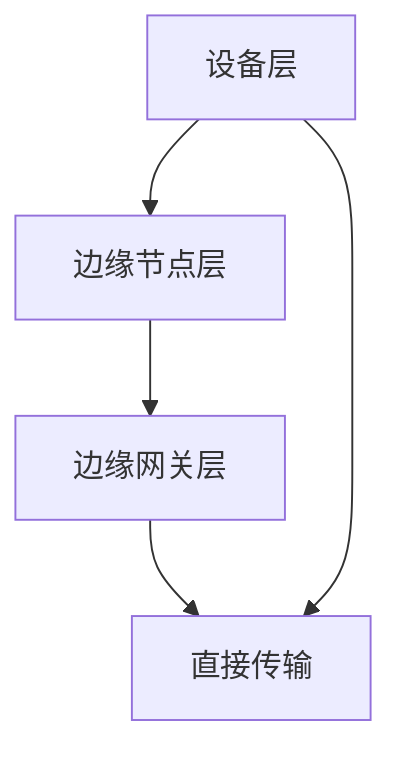

                 

关键词：边缘计算，云计算，分布式系统，物联网，5G，数据处理，实时响应，智能设备

> 摘要：本文将深入探讨边缘计算这一新兴技术，分析其背景、核心概念、算法原理、数学模型、实际应用场景，并展望其未来发展趋势与挑战。通过全面的分析，我们希望能够帮助读者更好地理解边缘计算的重要性及其在当前技术环境中的地位。

## 1. 背景介绍

边缘计算（Edge Computing）是一种分布式计算模型，其核心思想是将数据处理、存储和分析任务从中心化的数据中心转移到网络的边缘，即靠近数据源或者最终用户的位置。这种模式的兴起主要受到以下几个因素的驱动：

- **物联网（IoT）的普及**：随着物联网设备的爆炸式增长，大量的数据需要在靠近设备的地方进行处理，以降低延迟和带宽占用。
- **5G技术的推广**：5G网络的高速度、低延迟特性为边缘计算提供了坚实的技术基础，使得实时数据处理成为可能。
- **实时响应需求**：现代应用对于实时性要求越来越高，边缘计算能够显著减少数据传输延迟，满足实时响应的需求。
- **数据处理成本**：中心化的数据处理需要大量的计算资源和能源，而边缘计算通过在靠近数据源的地方处理数据，可以有效降低成本。

## 2. 核心概念与联系

### 2.1 定义

边缘计算可以定义为一种分布式计算架构，其中计算、存储、网络功能分散在网络的边缘，接近数据源或终端用户。与云计算不同，边缘计算并不是将所有任务都转移到远程数据中心，而是将计算任务分散到多个边缘节点，从而实现更高效的数据处理。

### 2.2 原理

边缘计算的核心原理在于充分利用边缘节点的计算能力，减少数据传输距离，降低网络拥堵，提高数据处理速度。边缘节点可以是各种设备，如路由器、交换机、智能手机、嵌入式系统等。这些节点不仅能够处理本地数据，还可以与远程数据中心协同工作，实现数据的集中处理和分析。

### 2.3 架构

边缘计算架构通常包括以下几个关键层次：

1. **设备层**：包括各种物联网设备和传感器，它们产生数据并将其发送到边缘节点。
2. **边缘节点层**：负责初步的数据处理，如过滤、聚合和初步分析。
3. **边缘网关层**：负责将数据从边缘节点传输到远程数据中心，同时进行更复杂的处理。
4. **云层**：负责处理边缘网关传输上来的数据，进行深度分析和存储。

### 2.4 Mermaid 流程图



## 3. 核心算法原理 & 具体操作步骤

### 3.1 算法原理概述

边缘计算算法的设计需要考虑数据处理的实时性、效率和安全性。核心算法通常包括数据预处理、边缘节点间的通信协议、任务调度和资源管理。

### 3.2 算法步骤详解

1. **数据预处理**：在边缘节点上对原始数据进行清洗、转换和格式化，以便后续处理。
2. **任务调度**：根据节点资源的可用性和任务的重要性，将计算任务分配到各个边缘节点。
3. **通信协议**：边缘节点之间使用特定的通信协议进行数据交换和协作，如MQTT、CoAP等。
4. **资源管理**：边缘节点需要管理自身的计算、存储和网络资源，确保任务的高效执行。
5. **数据聚合**：将边缘节点处理后的数据聚合到边缘网关，并进行进一步的深度分析。

### 3.3 算法优缺点

**优点**：

- **降低延迟**：数据在本地处理，显著减少了传输延迟。
- **提高效率**：避免了中心化处理的数据传输瓶颈。
- **节约成本**：减少了对中心数据中心的依赖，降低了运营成本。

**缺点**：

- **复杂性**：边缘节点数量庞大，管理复杂。
- **安全性**：边缘节点可能成为攻击目标，需要加强安全措施。
- **标准化**：目前缺乏统一的边缘计算标准和协议。

### 3.4 算法应用领域

边缘计算广泛应用于物联网、自动驾驶、智慧城市、工业自动化等领域，为实时数据处理提供了强有力的支持。

## 4. 数学模型和公式

### 4.1 数学模型构建

边缘计算中的数学模型通常涉及数据处理速率、延迟、带宽和资源利用率等参数。以下是一个简化的模型：

$$
R(t) = f(D, B, T)
$$

其中，$R(t)$ 是在时间 $t$ 内的数据处理速率，$D$ 是数据量，$B$ 是带宽，$T$ 是延迟。

### 4.2 公式推导过程

$$
R(t) = \frac{D}{T \cdot B}
$$

其中，$D$ 表示数据量，$T$ 表示处理时间，$B$ 表示带宽。

### 4.3 案例分析与讲解

假设一个物联网设备每秒产生 1MB 的数据，带宽为 1Mbps，处理延迟为 1秒。根据上述公式，该设备的处理速率为：

$$
R(t) = \frac{1MB}{1s \cdot 1Mbps} = 0.1MB/s
$$

## 5. 项目实践：代码实例

### 5.1 开发环境搭建

在边缘计算项目中，开发环境通常包括边缘节点、边缘网关和远程数据中心。以下是一个简化的搭建步骤：

1. **边缘节点**：选择适合的硬件设备，如树莓派或ESP8266。
2. **边缘网关**：选择具有较高带宽和处理能力的设备，如PC或服务器。
3. **远程数据中心**：配置云计算服务，如AWS、Azure或Google Cloud。

### 5.2 源代码详细实现

以下是一个使用Python编写的边缘计算示例，实现了数据采集、预处理和传输的功能：

```python
import time
import serial
import paho.mqtt.client as mqtt

# 配置串口参数
ser = serial.Serial('/dev/ttyUSB0', 9600)

# MQTT客户端配置
client = mqtt.Client()
client.connect("mqtt.example.com", 1883, 60)

while True:
    # 读取串口数据
    data = ser.readline()
    
    # 数据预处理
    processed_data = preprocess_data(data)
    
    # 发布数据到MQTT服务器
    client.publish("sensor/data", processed_data)
    
    # 等待一秒钟
    time.sleep(1)
```

### 5.3 代码解读与分析

这段代码首先配置了串口参数，用于读取来自传感器的数据。然后，使用Paho MQTT库连接到MQTT服务器，并定义了一个预处理函数 `preprocess_data`。在主循环中，代码不断读取串口数据，预处理后通过MQTT服务器发布出去。

## 6. 实际应用场景

边缘计算在许多实际应用场景中都发挥着重要作用。以下是一些典型的应用：

- **智慧城市**：通过边缘计算实现交通流量监控、环境监测和公共安全监控。
- **工业自动化**：实时监控生产线上的设备状态，提高生产效率和产品质量。
- **医疗健康**：实现远程医疗监控，如智能健康监测设备。
- **自动驾驶**：边缘计算用于自动驾驶车辆的实时数据处理和决策。

## 7. 工具和资源推荐

### 7.1 学习资源推荐

- 《边缘计算：理论与实践》
- 《边缘计算架构设计与实现》
- 《边缘智能：技术与应用》

### 7.2 开发工具推荐

- **边缘计算框架**：Kubernetes、EdgeX Foundry、OpenFog
- **编程语言**：Python、Java、C++
- **开发环境**：Ubuntu、Docker、Kubernetes

### 7.3 相关论文推荐

- "Edge Computing: Vision and Challenges"
- "A Comprehensive Survey on Edge Computing"
- "Edge Computing for IoT Applications: A Survey"

## 8. 总结：未来发展趋势与挑战

### 8.1 研究成果总结

边缘计算已经在物联网、自动驾驶、智慧城市等领域取得了显著的应用成果。随着5G网络的普及和人工智能技术的进步，边缘计算将继续发挥重要作用。

### 8.2 未来发展趋势

- **标准化和规范化**：边缘计算需要统一的架构和协议标准，以确保不同厂商和系统的互操作性。
- **安全性和隐私保护**：随着边缘节点的增加，安全性和隐私保护将成为重要挑战。
- **智能化和自动化**：未来边缘计算将更加智能化和自动化，实现更高效的数据处理和决策。

### 8.3 面临的挑战

- **资源管理**：如何高效管理边缘节点的计算、存储和网络资源，以实现最优性能。
- **可靠性**：边缘节点数量庞大，如何确保系统的可靠性和稳定性。
- **网络安全**：边缘计算系统容易成为网络攻击的目标，需要加强安全防护措施。

### 8.4 研究展望

边缘计算在未来将继续发展，成为云计算的重要补充。通过技术创新和标准化，边缘计算将为物联网、自动驾驶、智慧城市等领域带来更多可能性。

## 9. 附录：常见问题与解答

### 9.1 边缘计算和云计算有什么区别？

边缘计算和云计算的主要区别在于数据处理的位置。云计算将数据处理集中在远程数据中心，而边缘计算将数据处理转移到网络的边缘，靠近数据源或用户。

### 9.2 边缘计算的优势是什么？

边缘计算的主要优势包括降低延迟、提高效率、节约成本和增强实时性。

### 9.3 边缘计算的安全性问题如何解决？

边缘计算的安全性问题可以通过加强网络安全、使用加密技术和制定安全协议来解决。

### 9.4 边缘计算适用于哪些场景？

边缘计算适用于物联网、自动驾驶、智慧城市、工业自动化等需要实时数据处理和低延迟的场景。

