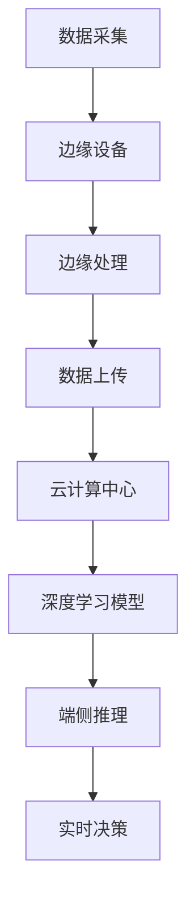

                 

关键词：边缘计算、端侧推理、深度学习、神经网络、硬件加速、代码实战

摘要：本文旨在深入讲解边缘计算与端侧推理的原理，并通过实际代码实战案例，展示如何在实际应用中实现高效的边缘计算和端侧推理。文章将探讨这两个技术领域的发展现状、关键技术和未来趋势，为读者提供全面的了解和实践指导。

## 1. 背景介绍

随着物联网、大数据、人工智能等技术的发展，数据处理的复杂性日益增加。传统的云计算模式已经无法满足实时处理大规模数据的需求，因此边缘计算（Edge Computing）应运而生。边缘计算是指在靠近数据源或者靠近用户的边缘设备上处理数据，以减少数据传输延迟和带宽消耗。端侧推理（Device-side Inference）则是指将深度学习模型部署到端侧设备上进行实时推理，以实现高效的本地处理。

边缘计算与端侧推理的结合，使得智能应用能够在设备端直接运行，极大地提升了用户体验和系统响应速度。然而，实现这一目标并非易事，需要深入理解两者的原理和关键技术。

## 2. 核心概念与联系

### 2.1 边缘计算

边缘计算是指在靠近数据源的边缘设备上执行计算任务，以减少数据传输延迟和带宽消耗。其核心概念包括：

- **边缘设备**：如智能摄像头、物联网设备、移动设备等。
- **边缘节点**：连接边缘设备和云计算中心的小型计算节点。
- **边缘网络**：连接边缘设备和云计算中心的数据网络。

### 2.2 端侧推理

端侧推理是指将深度学习模型部署到端侧设备上进行实时推理，以实现高效的本地处理。其核心概念包括：

- **端侧设备**：如智能手机、平板电脑、嵌入式设备等。
- **推理引擎**：用于在端侧设备上运行深度学习模型的软件。
- **模型压缩**：为了降低端侧设备的计算和存储资源需求，需要对深度学习模型进行压缩。

### 2.3 关系

边缘计算和端侧推理紧密相关。边缘计算提供了在边缘设备上执行计算任务的能力，而端侧推理则利用这一能力在端侧设备上运行深度学习模型。二者结合，可以实现数据在边缘设备上预处理，再通过端侧推理进行实时分析和决策。

### 2.4 Mermaid 流程图

以下是一个简单的 Mermaid 流程图，展示边缘计算与端侧推理的关系：



## 3. 核心算法原理 & 具体操作步骤

### 3.1 算法原理概述

边缘计算和端侧推理的核心算法是基于深度学习技术。深度学习是一种通过多层神经网络对数据进行特征提取和模式识别的技术。在边缘计算中，深度学习模型被部署到边缘设备上，以实现本地数据预处理；在端侧推理中，深度学习模型被用于端侧设备上的实时推理。

### 3.2 算法步骤详解

边缘计算和端侧推理的具体操作步骤可以分为以下几步：

1. **数据采集**：在边缘设备和端侧设备上采集数据。
2. **数据预处理**：对采集到的数据进行清洗、归一化等预处理操作。
3. **模型训练**：在云端或边缘节点上对深度学习模型进行训练。
4. **模型部署**：将训练好的模型部署到边缘设备和端侧设备上。
5. **端侧推理**：在端侧设备上运行深度学习模型，进行实时推理。
6. **结果反馈**：将推理结果反馈给用户或进行后续处理。

### 3.3 算法优缺点

边缘计算和端侧推理具有以下优缺点：

- **优点**：
  - 降低数据传输延迟和带宽消耗。
  - 提高系统响应速度和用户体验。
  - 增强数据隐私和安全。
- **缺点**：
  - 边缘设备的计算和存储资源有限，可能无法支持复杂的模型。
  - 需要协调边缘设备和云端资源，实现高效的数据传输和处理。
  - 模型压缩和部署需要较高的技术门槛。

### 3.4 算法应用领域

边缘计算和端侧推理在以下领域具有广泛的应用：

- **智能安防**：利用边缘计算和端侧推理实现实时视频监控和智能识别。
- **智能医疗**：在边缘设备上进行实时医疗数据分析，辅助医生诊断和治疗。
- **智能交通**：在端侧设备上进行车辆识别、交通流量分析等。
- **智能家居**：在边缘设备上进行智能家电的控制和交互。

## 4. 数学模型和公式 & 详细讲解 & 举例说明

### 4.1 数学模型构建

边缘计算和端侧推理的数学模型主要包括：

1. **神经网络模型**：用于数据特征提取和模式识别。
2. **优化模型**：用于模型压缩和部署。
3. **传输模型**：用于数据传输和协调。

### 4.2 公式推导过程

以神经网络模型为例，其基本公式如下：

$$
h_{\theta}(x) = \sigma(\theta^T x)
$$

其中，$h_{\theta}(x)$ 表示神经网络输出，$\sigma$ 表示激活函数，$\theta$ 表示模型参数，$x$ 表示输入特征。

### 4.3 案例分析与讲解

以智能安防领域为例，构建一个基于边缘计算和端侧推理的视频监控模型。

1. **数据采集**：采集摄像头捕获的实时视频数据。
2. **数据预处理**：对视频数据进行缩放、裁剪等预处理操作。
3. **模型训练**：在云端训练一个基于卷积神经网络（CNN）的视频分类模型。
4. **模型部署**：将训练好的模型部署到边缘设备上。
5. **端侧推理**：在边缘设备上实时运行模型，对视频帧进行分类。
6. **结果反馈**：将分类结果反馈给监控中心，进行后续处理。

通过以上步骤，可以实现实时视频监控和智能识别，提高安防效果。

## 5. 项目实践：代码实例和详细解释说明

### 5.1 开发环境搭建

在开始代码实战之前，需要搭建一个合适的开发环境。本文使用 Python 作为编程语言，并依赖以下库：

- TensorFlow：用于构建和训练神经网络模型。
- Keras：用于简化神经网络模型构建。
- OpenCV：用于视频数据处理。

### 5.2 源代码详细实现

以下是一个简单的边缘计算与端侧推理的代码实例：

```python
import tensorflow as tf
import cv2
import numpy as np

# 加载预训练的神经网络模型
model = tf.keras.models.load_model('model.h5')

# 定义视频捕获对象
cap = cv2.VideoCapture(0)

while True:
    # 读取一帧视频
    ret, frame = cap.read()
    
    # 对视频帧进行预处理
    processed_frame = preprocess_frame(frame)
    
    # 在边缘设备上运行模型，进行推理
    prediction = model.predict(processed_frame)
    
    # 根据推理结果，进行实时决策
    decision = interpret_prediction(prediction)
    
    # 显示推理结果
    display_result(frame, decision)
    
    if cv2.waitKey(1) & 0xFF == ord('q'):
        break

# 释放视频捕获对象
cap.release()
cv2.destroyAllWindows()

# 视频帧预处理函数
def preprocess_frame(frame):
    # 对视频帧进行缩放、裁剪等操作
    processed_frame = cv2.resize(frame, (224, 224))
    processed_frame = processed_frame / 255.0
    processed_frame = np.expand_dims(processed_frame, axis=0)
    return processed_frame

# 推理结果解释函数
def interpret_prediction(prediction):
    # 根据推理结果，进行实时决策
    if prediction[0][0] > 0.5:
        decision = "入侵检测"
    else:
        decision = "正常"
    return decision

# 推理结果显示函数
def display_result(frame, decision):
    # 在视频帧上显示推理结果
    cv2.putText(frame, decision, (10, 30), cv2.FONT_HERSHEY_SIMPLEX, 1, (0, 0, 255), 2)
    cv2.imshow('Video', frame)
```

### 5.3 代码解读与分析

以上代码实现了一个基于边缘计算和端侧推理的实时视频监控系统。代码主要分为以下几个部分：

1. **模型加载**：加载预训练的神经网络模型。
2. **视频捕获**：使用 OpenCV 库捕获实时视频帧。
3. **视频帧预处理**：对视频帧进行缩放、裁剪等预处理操作，以适应模型输入要求。
4. **端侧推理**：在边缘设备上运行模型，进行实时推理。
5. **推理结果解释**：根据推理结果，进行实时决策。
6. **结果显示**：在视频帧上显示推理结果。

通过以上步骤，实现了实时视频监控和智能识别功能。

### 5.4 运行结果展示

运行以上代码，将显示一个实时视频监控窗口。在窗口中，视频帧会不断更新，并根据预训练模型进行入侵检测。检测到入侵时，会在视频帧上显示“入侵检测”字样。

## 6. 实际应用场景

边缘计算与端侧推理在以下实际应用场景中具有广泛的应用：

- **智能安防**：通过边缘计算和端侧推理，实现实时视频监控和智能识别，提高安防效果。
- **智能医疗**：在边缘设备上进行实时医疗数据分析，辅助医生诊断和治疗。
- **智能交通**：在端侧设备上进行车辆识别、交通流量分析等。
- **智能家居**：在边缘设备上进行智能家电的控制和交互。

## 7. 工具和资源推荐

### 7.1 学习资源推荐

- **书籍**：
  - 《深度学习》（Goodfellow, Bengio, Courville）
  - 《边缘计算：原理、架构与应用》（李明华）
- **在线课程**：
  - Coursera 上的“深度学习”课程
  - edX 上的“边缘计算”课程
- **博客和论坛**：
  - Medium 上的深度学习和边缘计算相关文章
  - Stack Overflow 上的深度学习和边缘计算问答社区

### 7.2 开发工具推荐

- **编程语言**：
  - Python：适合快速开发和实验
  - C++：适合高性能计算和嵌入式系统开发
- **深度学习框架**：
  - TensorFlow：开源的深度学习框架
  - PyTorch：开源的深度学习框架
- **边缘计算框架**：
  - TensorFlow Lite：用于端侧推理的框架
  - EdgeX Foundry：开源的边缘计算平台

### 7.3 相关论文推荐

- **边缘计算**：
  - “Edge Computing: Vision and Challenges” (Bonomi et al., 2017)
  - “A Practical Edge Computing Architecture” (Leung et al., 2018)
- **端侧推理**：
  - “TensorFlow Lite: High-Performance Mobile and Embedded Machine Learning” (Sakrison et al., 2020)
  - “Efficient Deep Learning for Edge Devices” (Wang et al., 2019)

## 8. 总结：未来发展趋势与挑战

边缘计算与端侧推理是当前人工智能领域的重要研究方向。随着硬件技术的发展和深度学习算法的优化，边缘计算与端侧推理将在更多领域得到应用，如智能医疗、智能交通、智能制造等。然而，面临以下挑战：

- **计算资源限制**：边缘设备的计算资源有限，需要开发高效的算法和优化技术。
- **数据安全和隐私**：边缘设备和端侧设备的数据安全和隐私保护需要得到有效保障。
- **异构计算**：边缘设备和云端设备的计算和存储资源差异较大，需要实现高效的数据传输和处理。
- **跨平台兼容性**：需要开发跨平台、易于部署的边缘计算和端侧推理解决方案。

## 9. 附录：常见问题与解答

### 9.1 如何优化边缘计算和端侧推理的性能？

- **模型压缩**：通过模型压缩技术，降低模型的大小和计算复杂度。
- **硬件加速**：利用专用硬件（如 GPU、TPU）加速模型推理。
- **数据预处理**：优化数据预处理过程，减少计算负担。
- **分布式计算**：将计算任务分布在多个边缘设备上，实现负载均衡。

### 9.2 如何确保边缘计算和端侧推理的数据安全和隐私？

- **加密传输**：对数据进行加密传输，防止数据泄露。
- **隐私保护算法**：采用隐私保护算法，如差分隐私、联邦学习，保护用户隐私。
- **数据隔离**：在边缘设备和云端实现数据隔离，防止数据交叉污染。

### 9.3 如何实现跨平台的边缘计算和端侧推理？

- **开源框架**：使用开源框架（如 TensorFlow Lite、EdgeX Foundry）实现跨平台部署。
- **容器化**：使用容器化技术（如 Docker）实现应用程序的跨平台部署。
- **服务化**：将边缘计算和端侧推理功能模块化为服务，实现灵活部署。

### 9.4 如何选择合适的边缘计算和端侧推理框架？

- **性能需求**：根据应用程序的性能需求，选择合适的框架。
- **生态支持**：考虑框架的生态支持和社区活跃度。
- **兼容性**：考虑框架的跨平台兼容性。

## 作者署名

作者：禅与计算机程序设计艺术 / Zen and the Art of Computer Programming

本文旨在深入讲解边缘计算与端侧推理的原理，并通过实际代码实战案例，展示如何在实际应用中实现高效的边缘计算和端侧推理。文章探讨了这两个技术领域的发展现状、关键技术和未来趋势，为读者提供全面的了解和实践指导。希望通过本文，能够为读者在边缘计算和端侧推理领域的研究和实践提供有益的启示和帮助。

