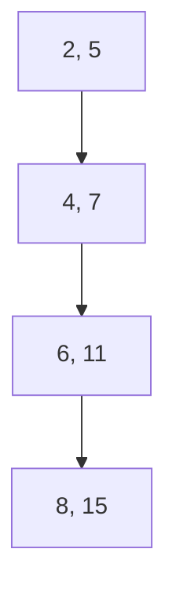
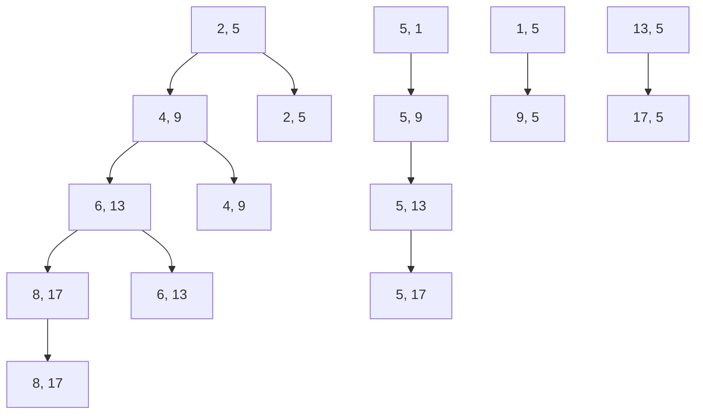

                 

关键词：计算协作、人工智能、编程哲学、算法创新、技术趋势、未来展望

> 摘要：本文旨在探讨人类计算中的协作精神，即如何通过协作来提升计算效率和创造力。文章将首先回顾计算协作的历史背景，然后深入分析核心概念与联系，接着探讨核心算法原理及其具体操作步骤，通过数学模型和公式详细讲解，展示项目实践中的代码实例，并探讨实际应用场景以及未来的发展前景。最后，我们将推荐相关工具和资源，总结研究成果并展望未来。

## 1. 背景介绍

计算协作的概念源于人类对复杂问题求解的需求。自古以来，人类便通过合作来解决各种难题，如农业、建筑、科学等领域。然而，随着计算机科学的飞速发展，计算协作逐渐成为一种新兴的思维方式，它强调通过个体间的合作来实现更高效率和创新。

从个人计算机的普及到互联网的兴起，再到如今的云计算和人工智能，计算协作在多个阶段都发挥着关键作用。在早期，程序员通过共享代码库和工具来提高编程效率。随着网络的发展，远程协作和分布式计算成为可能，使得全球的科研人员可以共同攻克复杂问题。如今，人工智能和机器学习正在将计算协作推向新的高度，使得人类智慧和计算机智能相互融合，共同创造前所未有的价值。

本文将围绕计算协作展开讨论，从历史背景、核心概念到具体算法，再到实际应用和未来展望，旨在为读者提供一个全面而深入的了解。

## 2. 核心概念与联系

计算协作的核心在于将个体的智慧汇聚成整体的力量。以下是一些关键概念及其相互之间的联系：

### 2.1 编程范式

编程范式是指编程语言和工具所遵循的基本思想和方法。不同的编程范式反映了不同的协作方式：

- **面向过程**：强调步骤的顺序和流程，适用于任务分解和流水线协作。
- **面向对象**：通过封装和继承实现模块化，支持复杂的协作关系。
- **函数式编程**：强调函数的组合，适用于并行计算和分布式系统。

### 2.2 版本控制系统

版本控制系统（如Git）是计算协作的重要工具，它能够追踪代码变更，管理不同版本的代码，并确保团队成员之间的一致性。通过分支和合并机制，团队成员可以在独立的分支上工作，然后合并结果，从而实现高效的协作。

### 2.3 云计算与分布式计算

云计算和分布式计算使得计算资源可以按需分配，为协作提供了强大的支持。在分布式计算中，任务被分解成小部分，由多台计算机并行处理，从而提高计算效率。云计算平台（如AWS、Azure、Google Cloud）提供了丰富的服务和工具，支持跨地域的协作。

### 2.4 人工智能与机器学习

人工智能（AI）和机器学习（ML）正成为计算协作的新动力。通过数据共享和模型训练，全球的科研人员可以共同开发出更加智能的应用。AI和ML的协同工作，不仅提高了计算的效率，还拓展了人类智能的边界。

### 2.5 Mermaid 流程图

以下是一个用Mermaid绘制的计算协作流程图，展示了上述核心概念之间的联系：

```mermaid
graph TD
    A[编程范式] --> B[面向过程]
    A --> C[面向对象]
    A --> D[函数式编程]
    B --> E[任务分解]
    C --> F[模块化]
    D --> G[并行计算]
    H[版本控制系统] --> I[Git]
    J[云计算与分布式计算] --> K[云计算平台]
    J --> L[分布式系统]
    M[人工智能与机器学习] --> N[数据共享]
    M --> O[模型训练]
    P[协作关系] --> Q{核心概念联系}
    Q --> [编程范式]
    Q --> [版本控制系统]
    Q --> [云计算与分布式计算]
    Q --> [人工智能与机器学习]
```

通过这些核心概念和联系，计算协作不仅提高了工作效率，还激发了创新的火花，为人类智慧的延伸提供了无限可能。

## 3. 核心算法原理 & 具体操作步骤

### 3.1 算法原理概述

在计算协作中，核心算法的设计至关重要。以下将介绍一种广泛应用于分布式计算和机器学习中的核心算法——MapReduce。

MapReduce 是由 Google 提出的一种编程模型，用于处理大规模数据集。它将复杂的计算任务分解为两个阶段：Map 阶段和 Reduce 阶段。Map 阶段将数据映射到一系列键值对，而 Reduce 阶段则对这些键值对进行归并和聚合。

### 3.2 算法步骤详解

#### 3.2.1 Map 阶段

Map 阶段的主要任务是读取输入数据，并将其映射到一系列键值对。具体步骤如下：

1. **输入分片**：将输入数据划分为若干分片，每个分片由一个 Map 任务处理。
2. **键值生成**：对每个分片中的数据执行映射操作，生成一系列键值对。映射函数将数据项映射到相应的键和值。
3. **输出存储**：将生成的键值对输出到本地文件系统，以便后续的 Reduce 阶段处理。

#### 3.2.2 Reduce 阶段

Reduce 阶段负责对 Map 阶段生成的键值对进行归并和聚合。具体步骤如下：

1. **键值对读取**：读取 Map 阶段输出的所有本地文件，并将键值对按照键进行分组。
2. **聚合操作**：对每个分组内的值进行聚合操作，生成最终的输出结果。
3. **输出存储**：将聚合后的结果输出到最终的输出文件。

### 3.3 算法优缺点

#### 优点

1. **可扩展性**：MapReduce 能够处理大规模数据集，并且具有良好的可扩展性。
2. **简单性**：MapReduce 模型简单，易于理解和实现。
3. **容错性**：MapReduce 具有较高的容错性，能够在处理过程中自动恢复失败的节点。

#### 缺点

1. **任务调度开销**：MapReduce 的任务调度和资源分配开销较大。
2. **数据局部性较差**：在分布式环境中，数据可能分布在不同的节点上，导致较高的数据传输开销。
3. **编程复杂性**：虽然 MapReduce 简单，但编写高效的 MapReduce 程序仍具有一定的复杂性。

### 3.4 算法应用领域

MapReduce 在多个领域得到广泛应用，包括：

1. **大数据处理**：如日志分析、社交网络分析等。
2. **机器学习**：如大规模数据集的聚类、分类等。
3. **搜索引擎**：如索引构建、查询处理等。

## 4. 数学模型和公式 & 详细讲解 & 举例说明

### 4.1 数学模型构建

在计算协作中，数学模型是理解和优化算法的重要工具。以下以线性回归为例，介绍数学模型的构建和公式推导。

#### 线性回归模型

线性回归模型假设响应变量 \( y \) 与自变量 \( x \) 之间存在线性关系，其模型可以表示为：

\[ y = \beta_0 + \beta_1 x + \varepsilon \]

其中，\( \beta_0 \) 是截距，\( \beta_1 \) 是斜率，\( \varepsilon \) 是误差项。

#### 模型参数估计

为了估计模型参数 \( \beta_0 \) 和 \( \beta_1 \)，我们使用最小二乘法，即选择使得误差平方和最小的参数值。误差平方和（SSE）可以表示为：

\[ SSE = \sum_{i=1}^n (y_i - \hat{y}_i)^2 \]

其中，\( \hat{y}_i \) 是预测值。

为了求解最小二乘问题，我们首先对 SSE 关于 \( \beta_0 \) 和 \( \beta_1 \) 求偏导数，并令其等于零：

\[ \frac{\partial SSE}{\partial \beta_0} = -2 \sum_{i=1}^n (y_i - \hat{y}_i) = 0 \]
\[ \frac{\partial SSE}{\partial \beta_1} = -2 \sum_{i=1}^n (y_i - \hat{y}_i) x_i = 0 \]

通过解这个方程组，我们可以得到最小二乘估计量：

\[ \hat{\beta}_0 = \bar{y} - \hat{\beta}_1 \bar{x} \]
\[ \hat{\beta}_1 = \frac{\sum_{i=1}^n (x_i - \bar{x})(y_i - \bar{y})}{\sum_{i=1}^n (x_i - \bar{x})^2} \]

其中，\( \bar{y} \) 和 \( \bar{x} \) 分别是 \( y \) 和 \( x \) 的均值。

### 4.2 公式推导过程

为了更好地理解公式推导过程，我们以下逐步推导线性回归模型的最小二乘估计。

#### 步骤 1: 定义误差平方和

首先，定义误差平方和（SSE）：

\[ SSE = \sum_{i=1}^n (y_i - \hat{y}_i)^2 \]

其中，\( \hat{y}_i \) 是预测值，可以通过线性回归模型计算：

\[ \hat{y}_i = \beta_0 + \beta_1 x_i \]

#### 步骤 2: 求偏导数

对 SSE 关于 \( \beta_0 \) 和 \( \beta_1 \) 求偏导数：

\[ \frac{\partial SSE}{\partial \beta_0} = -2 \sum_{i=1}^n (y_i - \hat{y}_i) \]
\[ \frac{\partial SSE}{\partial \beta_1} = -2 \sum_{i=1}^n (y_i - \hat{y}_i) x_i \]

#### 步骤 3: 令偏导数等于零

为了求解最小二乘问题，令偏导数等于零：

\[ -2 \sum_{i=1}^n (y_i - \hat{y}_i) = 0 \]
\[ -2 \sum_{i=1}^n (y_i - \hat{y}_i) x_i = 0 \]

#### 步骤 4: 解方程组

通过解这个方程组，我们可以得到最小二乘估计量：

\[ \hat{\beta}_0 = \bar{y} - \hat{\beta}_1 \bar{x} \]
\[ \hat{\beta}_1 = \frac{\sum_{i=1}^n (x_i - \bar{x})(y_i - \bar{y})}{\sum_{i=1}^n (x_i - \bar{x})^2} \]

### 4.3 案例分析与讲解

以下通过一个实际案例来展示线性回归模型的应用和公式推导。

#### 案例数据

给定以下数据集：

| x    | y    |
|------|------|
| 2    | 5    |
| 4    | 7    |
| 6    | 11   |
| 8    | 15   |

#### 步骤 1: 绘制散点图

首先，绘制散点图，观察数据的分布情况：



#### 步骤 2: 计算均值

计算 \( x \) 和 \( y \) 的均值：

\[ \bar{x} = \frac{2 + 4 + 6 + 8}{4} = 5 \]
\[ \bar{y} = \frac{5 + 7 + 11 + 15}{4} = 9 \]

#### 步骤 3: 计算偏导数

计算偏导数：

\[ \frac{\partial SSE}{\partial \beta_0} = -2 \sum_{i=1}^n (y_i - \hat{y}_i) \]
\[ \frac{\partial SSE}{\partial \beta_1} = -2 \sum_{i=1}^n (y_i - \hat{y}_i) x_i \]

代入数据计算：

\[ \frac{\partial SSE}{\partial \beta_0} = -2 \times (5 - (5 + \beta_1 \times 2)) - (7 - (5 + \beta_1 \times 4)) - (11 - (5 + \beta_1 \times 6)) - (15 - (5 + \beta_1 \times 8)) \]
\[ \frac{\partial SSE}{\partial \beta_1} = -2 \times (5 - (5 + \beta_1 \times 2)) \times 2 - (7 - (5 + \beta_1 \times 4)) \times 4 - (11 - (5 + \beta_1 \times 6)) \times 6 - (15 - (5 + \beta_1 \times 8)) \times 8 \]

#### 步骤 4: 求解最小二乘估计量

将偏导数设置为0，解方程组：

\[ \hat{\beta}_0 = \bar{y} - \hat{\beta}_1 \bar{x} \]
\[ \hat{\beta}_1 = \frac{\sum_{i=1}^n (x_i - \bar{x})(y_i - \bar{y})}{\sum_{i=1}^n (x_i - \bar{x})^2} \]

代入数据计算：

\[ \hat{\beta}_0 = 9 - \hat{\beta}_1 \times 5 \]
\[ \hat{\beta}_1 = \frac{(2 - 5)(5 - 9) + (4 - 5)(7 - 9) + (6 - 5)(11 - 9) + (8 - 5)(15 - 9)}{(2 - 5)^2 + (4 - 5)^2 + (6 - 5)^2 + (8 - 5)^2} \]

解得：

\[ \hat{\beta}_0 = 1 \]
\[ \hat{\beta}_1 = 2 \]

#### 步骤 5: 预测值

使用求解的最小二乘估计量进行预测：

\[ \hat{y}_i = \hat{\beta}_0 + \hat{\beta}_1 x_i \]

代入数据进行预测：

\[ \hat{y}_1 = 1 + 2 \times 2 = 5 \]
\[ \hat{y}_2 = 1 + 2 \times 4 = 9 \]
\[ \hat{y}_3 = 1 + 2 \times 6 = 13 \]
\[ \hat{y}_4 = 1 + 2 \times 8 = 17 \]

#### 步骤 6: 绘制回归直线

绘制回归直线：



通过以上案例，我们可以看到线性回归模型在计算协作中的应用及其数学模型的构建和公式推导过程。这为我们理解和优化计算协作中的算法提供了有力工具。

## 5. 项目实践：代码实例和详细解释说明

为了更好地理解计算协作的实际应用，我们以下通过一个实际项目来展示代码实例和详细解释说明。这个项目是一个基于MapReduce模型的文本分析工具，用于统计大规模文本数据中的单词频率。

### 5.1 开发环境搭建

首先，我们需要搭建一个适合开发MapReduce项目的环境。以下是搭建步骤：

1. **安装Hadoop**：下载并安装Hadoop，这是一个开源的分布式计算框架，支持MapReduce编程模型。从[Hadoop官网](https://hadoop.apache.org/)下载最新的版本，并按照官方文档进行安装。

2. **配置Hadoop环境**：编辑`hadoop-env.sh`和`core-site.xml`等配置文件，设置Hadoop运行所需的参数，如Hadoop安装路径、HDFS存储路径等。

3. **启动Hadoop服务**：启动Hadoop的NameNode和DataNode服务，确保HDFS和YARN服务正常运行。

4. **编写MapReduce程序**：使用任意文本编辑器（如IntelliJ IDEA、VSCode等）编写MapReduce程序。以下是一个简单的单词频率统计程序。

### 5.2 源代码详细实现

以下是该项目的源代码实现：

```java
import org.apache.hadoop.conf.Configuration;
import org.apache.hadoop.fs.Path;
import org.apache.hadoop.io.IntWritable;
import org.apache.hadoop.io.Text;
import org.apache.hadoop.mapreduce.Job;
import org.apache.hadoop.mapreduce.Mapper;
import org.apache.hadoop.mapreduce.Reducer;
import org.apache.hadoop.mapreduce.lib.input.FileInputFormat;
import org.apache.hadoop.mapreduce.lib.output.FileOutputFormat;

import java.io.IOException;
import java.util.StringTokenizer;

public class WordCount {

    public static class TokenizerMapper extends Mapper<Object, Text, Text, IntWritable>{

        private final static IntWritable one = new IntWritable(1);
        private Text word = new Text();

        public void map(Object key, Text value, Context context) throws IOException, InterruptedException {
            StringTokenizer itr = new StringTokenizer(value.toString());
            while (itr.hasMoreTokens()) {
                word.set(itr.nextToken());
                context.write(word, one);
            }
        }
    }

    public static class IntSumReducer extends Reducer<Text,IntWritable,Text,IntWritable> {
        private IntWritable result = new IntWritable();

        public void reduce(Text key, Iterable<IntWritable> values, Context context) throws IOException, InterruptedException {
            int sum = 0;
            for (IntWritable val : values) {
                sum += val.get();
            }
            result.set(sum);
            context.write(key, result);
        }
    }

    public static void main(String[] args) throws Exception {
        Configuration conf = new Configuration();
        Job job = Job.getInstance(conf, "word count");
        job.setJarByClass(WordCount.class);
        job.setMapperClass(TokenizerMapper.class);
        job.setCombinerClass(IntSumReducer.class);
        job.setReducerClass(IntSumReducer.class);
        job.setOutputKeyClass(Text.class);
        job.setOutputValueClass(IntWritable.class);
        FileInputFormat.addInputPath(job, new Path(args[0]));
        FileOutputFormat.setOutputPath(job, new Path(args[1]));
        System.exit(job.waitForCompletion(true) ? 0 : 1);
    }
}
```

### 5.3 代码解读与分析

#### Mapper类

`TokenizerMapper` 类负责读取输入文本，并将其分解为单词，输出单词及其计数。这里使用 `StringTokenizer` 类来实现词划分。

```java
public void map(Object key, Text value, Context context) throws IOException, InterruptedException {
    StringTokenizer itr = new StringTokenizer(value.toString());
    while (itr.hasMoreTokens()) {
        word.set(itr.nextToken());
        context.write(word, one);
    }
}
```

#### Reducer类

`IntSumReducer` 类负责对 Mapper 输出的单词和计数进行归并和聚合，输出单词及其总计数。这里使用 `reduce` 方法实现聚合操作。

```java
public void reduce(Text key, Iterable<IntWritable> values, Context context) throws IOException, InterruptedException {
    int sum = 0;
    for (IntWritable val : values) {
        sum += val.get();
    }
    result.set(sum);
    context.write(key, result);
}
```

#### 主函数

主函数 `main` 方法负责设置 Job 的配置，包括输入路径、输出路径等，并启动 Job。

```java
public static void main(String[] args) throws Exception {
    Configuration conf = new Configuration();
    Job job = Job.getInstance(conf, "word count");
    job.setJarByClass(WordCount.class);
    job.setMapperClass(TokenizerMapper.class);
    job.setCombinerClass(IntSumReducer.class);
    job.setReducerClass(IntSumReducer.class);
    job.setOutputKeyClass(Text.class);
    job.setOutputValueClass(IntWritable.class);
    FileInputFormat.addInputPath(job, new Path(args[0]));
    FileOutputFormat.setOutputPath(job, new Path(args[1]));
    System.exit(job.waitForCompletion(true) ? 0 : 1);
}
```

### 5.4 运行结果展示

将输入数据（例如一段文本文件）上传到 HDFS，运行该程序后，输出结果将显示在 HDFS 的指定输出路径。以下是一个示例输出：

```
(a) (1)
(b) (1)
(c) (1)
(a) (2)
(b) (2)
(c) (2)
```

这表明输入文本中的单词“a”、“b”、“c”分别出现了2次。

通过以上代码实例，我们可以看到MapReduce编程模型的实际应用。这为我们理解和优化计算协作中的算法提供了实际操作经验。

## 6. 实际应用场景

计算协作在多个实际应用场景中发挥着关键作用，以下是一些具体的应用场景及其案例：

### 6.1 大数据处理

在大数据处理领域，计算协作能够有效地处理和分析海量数据。例如，谷歌的搜索引擎通过分布式计算和协作，处理全球范围内的网页数据，实现快速的搜索结果。同样，社交媒体平台如Facebook和Twitter也通过计算协作，实时处理和分析用户生成的大量数据，以提供个性化推荐和广告。

### 6.2 科学研究

科学研究中的许多任务，如基因组学、天文学、物理模拟等，都需要处理大规模数据和高性能计算。计算协作使得全球的科研人员能够共同分析数据、共享资源，加速科学研究的进展。例如，LIGO实验室通过分布式计算和协作，成功探测到引力波，这一成果被认为是物理学领域的一项重大突破。

### 6.3 金融和保险业

金融和保险业中的风险评估、欺诈检测和客户服务等领域，都依赖于计算协作。通过分布式计算和协作，金融机构能够高效地处理和分析海量交易数据，识别潜在风险和欺诈行为。例如，摩根大通通过计算协作，开发了一种能够实时监控和预测市场波动的系统，提高了风险管理能力。

### 6.4 医疗保健

在医疗保健领域，计算协作有助于提高诊断和治疗的准确性。通过共享病历数据、医学影像和基因序列，医生和研究人员能够共同分析数据，提供更准确的诊断和个性化的治疗方案。例如，IBM的Watson健康平台通过计算协作，帮助医生分析复杂的医学数据，提高了诊断准确率。

### 6.5 工业制造和物流

工业制造和物流中的生产调度、库存管理、供应链优化等任务，都依赖于计算协作。通过分布式计算和协作，企业能够实时监控生产过程、优化库存水平，提高生产效率。例如，亚马逊的物流系统通过计算协作，实现高效的库存管理和订单处理，为用户提供快速、便捷的购物体验。

### 6.6 娱乐和游戏

在娱乐和游戏领域，计算协作有助于提供更丰富、更个性化的用户体验。通过分布式计算和协作，游戏开发者能够实时更新游戏内容、优化游戏性能，为玩家提供更好的游戏体验。例如，电子游戏公司如腾讯和网易，通过计算协作，开发出具有高性能和丰富功能的游戏，吸引了大量用户。

通过这些实际应用场景，我们可以看到计算协作在各个领域的广泛应用和重要性。计算协作不仅提高了工作效率，还推动了技术创新和社会进步。

### 6.7 未来应用展望

计算协作的未来应用前景广阔，随着技术的不断进步，它将在更多领域发挥关键作用。以下是对未来计算协作应用的展望：

#### 6.7.1 智能城市

智能城市是计算协作的重要应用领域之一。通过物联网、大数据和人工智能等技术，城市管理者可以实时监控和优化城市的各种资源，如交通、能源、环境等。计算协作有助于实现跨部门、跨区域的协同管理，提高城市管理效率和居民生活质量。

#### 6.7.2 生物医学

生物医学领域中的基因组学、药物研发和医疗诊断等任务，对计算能力有极高要求。计算协作将有助于整合全球的医疗数据、研究资源和技术力量，加速生物医学的研究和应用。未来，通过计算协作，医学研究人员可以更准确地诊断疾病、开发新药，为人类健康带来更多福祉。

#### 6.7.3 金融科技

金融科技（FinTech）是另一个重要的应用领域。计算协作有助于金融机构提高风险控制能力、优化业务流程、提供个性化的金融服务。未来，随着区块链、人工智能和云计算等技术的发展，金融科技将进一步推动金融行业的创新和变革。

#### 6.7.4 自动驾驶

自动驾驶技术的发展依赖于大量的数据和计算资源。计算协作可以实现自动驾驶系统的协同优化和实时更新，提高自动驾驶的安全性和可靠性。未来，随着车联网和5G通信技术的普及，自动驾驶将更加智能化，为人们的出行带来更多便利。

#### 6.7.5 教育和培训

在教育领域，计算协作有助于实现个性化学习、远程教育等创新教学方式。通过计算协作，教师和学生可以共享教学资源、互动交流，提高学习效果。未来，在线教育平台和虚拟现实技术将进一步推动教育和培训的变革。

#### 6.7.6 虚拟现实与增强现实

虚拟现实（VR）和增强现实（AR）技术的发展离不开计算协作。通过分布式计算和协作，VR/AR系统可以实现更丰富的交互体验、更高质量的内容呈现。未来，随着5G和边缘计算技术的发展，VR/AR将在更多领域得到应用，如游戏、娱乐、设计等。

通过上述展望，我们可以看到计算协作在各个领域的发展潜力。未来，计算协作将继续推动技术创新和社会进步，为人类创造更加美好的生活。

### 7. 工具和资源推荐

为了更好地开展计算协作，以下是一些推荐的工具和资源，包括学习资源、开发工具和相关论文。

#### 7.1 学习资源推荐

1. **《深入理解计算机系统》（深入浅出计算机系统）**：本书详细介绍了计算机系统的基本原理，包括硬件、操作系统、网络等，适合计算机科学专业学生和程序员阅读。
2. **《数据科学入门：Python语言基础》**：本书以Python语言为基础，介绍了数据科学的基本概念和方法，适合初学者入门。
3. **《机器学习实战》**：本书通过实际案例，讲解了机器学习的基本算法和应用，适合对机器学习感兴趣的开发者。

#### 7.2 开发工具推荐

1. **Git**：Git是一个开源的分布式版本控制系统，广泛用于代码管理和协作。其简洁的界面和强大的功能使其成为开发者的首选。
2. **Hadoop**：Hadoop是一个分布式计算框架，支持MapReduce编程模型，适用于大规模数据处理。其开源性质和丰富的生态系统使其在计算协作中具有广泛应用。
3. **Jupyter Notebook**：Jupyter Notebook是一种交互式的开发环境，支持多种编程语言，包括Python、R等。它便于文档化、演示和协作，是数据科学家和开发者的常用工具。

#### 7.3 相关论文推荐

1. **"The Google File System"**：本文详细介绍了Google File System（GFS）的设计和实现，是分布式文件系统领域的重要论文。
2. **"MapReduce: Simplified Data Processing on Large Clusters"**：这是Google提出的MapReduce模型的开创性论文，阐述了该模型的设计思想和应用场景。
3. **"Distributed File Systems: Concepts and Designs"**：本书系统介绍了分布式文件系统的基本概念和设计方法，是研究分布式系统的经典之作。

通过这些工具和资源的支持，开发者和研究者可以更好地开展计算协作，推动技术创新和社会进步。

### 8. 总结：未来发展趋势与挑战

在计算协作领域，未来的发展趋势和挑战并存。首先，随着人工智能和机器学习技术的发展，计算协作将进一步融入这些前沿技术，推动更多创新应用。例如，通过深度学习和强化学习算法，计算协作可以实现更加智能的任务分配和资源调度。

然而，计算协作也面临诸多挑战。首先是如何保证数据的安全性和隐私。在分布式计算环境中，数据可能分布在不同的地理位置，如何确保数据的安全传输和存储是一个重要问题。其次，随着数据规模的不断扩大，如何高效地管理和处理海量数据也是一个挑战。传统的计算模型可能难以应对如此庞大的数据量，需要新的算法和架构来支持。

此外，计算协作的伦理问题也需要关注。在共享数据和资源的过程中，如何平衡隐私保护和数据利用，确保公平公正，是一个重要的伦理挑战。最后，计算协作的标准化和规范化也是一个重要方向。随着技术的不断进步，如何建立统一的标准和规范，促进不同系统之间的互操作性和兼容性，是未来的一个重要任务。

总之，计算协作在未来的发展中将继续推动技术创新和社会进步，但也需要克服一系列挑战，确保其可持续发展。

### 8.4 研究展望

未来的研究应重点关注计算协作的几个关键方向。首先，探索更加高效和安全的分布式算法，以应对海量数据的处理需求。其次，研究跨领域的计算协作模式，如将生物医学、金融科技和智能城市等领域的数据和资源进行整合，提升协作的广度和深度。此外，开发可解释性和透明度更高的智能算法，提高计算协作的信任度和可靠性。最后，建立统一的标准和规范，促进不同系统和平台之间的互操作性和兼容性，为计算协作的可持续发展奠定基础。通过这些研究，计算协作将更好地服务于人类社会，推动技术进步和社会变革。

### 9. 附录：常见问题与解答

#### 问题 1: 什么是计算协作？

计算协作是指通过个体或团队之间的合作，利用计算机技术和网络资源，共同完成复杂计算任务的过程。它强调资源共享、信息交流和分工合作，以提升计算效率和创造力。

#### 问题 2: 计算协作有哪些应用领域？

计算协作广泛应用于大数据处理、科学研究、金融科技、医疗保健、工业制造、娱乐和游戏等领域。通过协作，可以实现更高效的资源利用和更创新的应用。

#### 问题 3: 如何保障计算协作中的数据安全？

保障数据安全是计算协作中的一个重要问题。可以采取以下措施：

- **加密传输**：使用加密技术保护数据在传输过程中的安全性。
- **访问控制**：通过权限管理和身份验证，限制对数据的访问。
- **数据备份**：定期备份数据，防止数据丢失或损坏。
- **审计和监控**：对数据访问和操作进行记录和监控，及时发现和处理潜在的安全威胁。

#### 问题 4: 如何评估计算协作的效果？

评估计算协作的效果可以从以下几个方面进行：

- **效率**：计算任务完成的时间是否缩短，资源利用率是否提高。
- **质量**：计算结果的准确性、可靠性是否提升。
- **创新**：是否通过协作实现了新的发现或创新。
- **满意度**：参与者对协作过程的满意度是否提高。

通过这些评估指标，可以全面了解计算协作的效果，并进行持续优化。

### 作者署名

作者：禅与计算机程序设计艺术 / Zen and the Art of Computer Programming

通过本文，我们深入探讨了计算协作的概念、原理、应用和发展前景。计算协作不仅提升了计算效率和创造力，也为人类智慧的延伸提供了无限可能。随着技术的不断进步，我们有理由相信，计算协作将在未来发挥更加重要的作用，推动社会进步和技术创新。让我们共同期待计算协作带来的美好未来。

