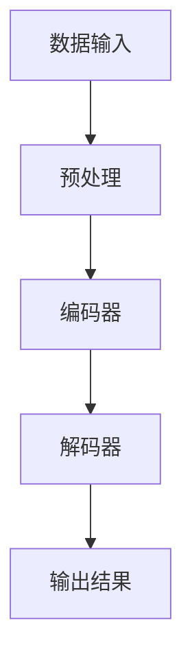
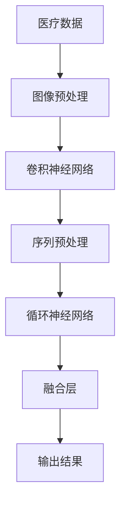

                 

在当今快速发展的信息技术时代，大模型已经成为企业技术架构的核心组成部分。从自然语言处理到图像识别，再到复杂的数据分析，大模型在提升企业竞争力、优化运营效率方面发挥了不可替代的作用。然而，大模型并非一蹴而就，其发展路径和方向是企业需要深思熟虑的重要议题。本文将探讨通用型大模型和专业型大模型在企业中的发展方向，以及它们各自的优势和挑战。

> 关键词：大模型，通用型，专业型，企业发展，技术架构

> 摘要：本文通过对通用型大模型和专业型大模型的定义、特点及其在企业中的应用进行分析，探讨其发展方向和战略选择。通过案例研究，总结出大模型企业在面对未来技术变革和市场机遇时的应对策略，为企业的技术决策提供参考。

## 1. 背景介绍

随着深度学习技术的迅猛发展，大模型已经成为信息技术领域的研究热点。大模型，通常指的是参数量在数亿甚至千亿级别以上的深度神经网络模型。这些模型通过大量的数据进行训练，能够自动学习并提取数据中的复杂结构和特征，从而在众多任务上达到或超越人类的表现。大模型的应用不仅限于学术界，越来越多企业开始意识到其在提升业务效率、创造新商业机会方面的重要性。

通用型大模型和专业型大模型是当前大模型发展的两个主要方向。通用型大模型，如OpenAI的GPT系列，具有广泛的任务适应性和强大的泛化能力，可以应用于多种不同的场景。专业型大模型，则针对特定的应用领域进行优化，如医疗健康、金融分析等，它们在特定领域内具有更高的准确性和效率。

### 1.1 通用型大模型

通用型大模型的特点是其广泛的适用性和高度的灵活性。这些模型通过大规模预训练，能够学习到语言、视觉、声音等多种模态的信息，从而在多种任务上表现出色。通用型大模型的优势在于，它们能够快速适应新任务，降低企业在不同领域应用AI技术时的研发成本和资源投入。

然而，通用型大模型也存在一些挑战。首先，这些模型的训练和推理过程需要大量的计算资源和数据，这对企业的IT基础设施提出了更高的要求。其次，通用型大模型的泛化能力虽然强，但在特定领域的性能可能不如专门设计的专业型大模型。

### 1.2 专业型大模型

专业型大模型针对特定领域进行优化，例如在医疗健康领域，专业型大模型可以用于疾病诊断、治疗方案推荐等；在金融领域，专业型大模型可以用于风险评估、市场预测等。这些模型的特点是高度专业化，能够在特定任务上达到或超越通用型大模型的表现。

专业型大模型的优势在于其在特定领域的准确性和效率。例如，在医疗领域，专业型大模型可以处理复杂的医学数据，提供更准确、更迅速的诊断结果。然而，专业型大模型也存在一些挑战，例如需要大量的专业知识和数据，且无法像通用型大模型那样快速适应新任务。

## 2. 核心概念与联系

为了更好地理解通用型大模型和专业型大模型，我们首先需要了解它们的基本原理和架构。

### 2.1 通用型大模型架构

通用型大模型通常采用多层神经网络结构，如Transformer架构，其核心思想是通过对输入数据进行编码和解码，生成上下文表示，从而实现文本生成、翻译、分类等多种任务。以下是一个简化的Mermaid流程图，展示了通用型大模型的基本流程：



### 2.2 专业型大模型架构

专业型大模型则根据具体任务的需求进行设计。以医疗领域为例，专业型大模型可能采用卷积神经网络（CNN）结合循环神经网络（RNN）的结构，以同时处理图像和序列数据。以下是一个简化的Mermaid流程图，展示了专业型大模型的基本流程：



通过对比通用型大模型和专业型大模型的架构，我们可以看到它们在处理数据的方式和任务目标上存在显著差异。通用型大模型追求的是广泛性和通用性，而专业型大模型则强调在特定领域的深度和精度。

## 3. 核心算法原理 & 具体操作步骤

### 3.1 算法原理概述

通用型大模型的核心算法是基于深度学习技术的神经网络模型，尤其是Transformer架构。Transformer架构通过自注意力机制（Self-Attention）对输入数据进行编码和解码，从而生成上下文表示。自注意力机制的核心思想是，模型可以自动学习并关注输入数据中的关键信息，从而提高模型的泛化能力和表现。

专业型大模型则根据具体任务的需求，采用不同的神经网络结构。例如，在医疗领域，专业型大模型可能采用卷积神经网络（CNN）处理图像数据，结合循环神经网络（RNN）处理序列数据，从而实现对医学图像和病历的深度分析。

### 3.2 算法步骤详解

#### 3.2.1 通用型大模型

1. **数据预处理**：对输入数据进行清洗、归一化等预处理操作，以确保数据的质量和一致性。
2. **编码器**：将预处理后的数据输入到编码器中，编码器通过多层神经网络对数据生成上下文表示。
3. **解码器**：将编码器生成的上下文表示输入到解码器中，解码器通过自注意力机制生成输出结果。
4. **损失函数**：通过计算预测结果与真实结果之间的损失，优化模型参数。

#### 3.2.2 专业型大模型

1. **数据预处理**：与通用型大模型类似，对输入数据进行预处理。
2. **图像预处理**：对图像数据进行预处理，包括缩放、裁剪、增强等操作。
3. **卷积神经网络**：将预处理后的图像数据输入到卷积神经网络中，通过卷积层提取图像特征。
4. **序列预处理**：对序列数据进行预处理，包括序列分割、编码等操作。
5. **循环神经网络**：将预处理后的序列数据输入到循环神经网络中，通过循环层提取序列特征。
6. **融合层**：将卷积神经网络和循环神经网络提取的特征进行融合，生成综合特征表示。
7. **输出结果**：通过融合层生成输出结果，实现对特定任务的预测或分析。

### 3.3 算法优缺点

#### 3.3.1 通用型大模型

**优点**：
- 广泛的适用性：可以应用于多种不同的任务和数据类型。
- 高度的灵活性：能够快速适应新任务和数据。
- 强大的泛化能力：通过大规模预训练，能够学习到通用性的知识。

**缺点**：
- 训练和推理成本高：需要大量的计算资源和数据。
- 在特定领域性能有限：可能无法超越专门设计的专业型大模型。

#### 3.3.2 专业型大模型

**优点**：
- 高度的专业化：针对特定领域进行优化，性能更优。
- 高度的准确性：在特定任务上能够提供更准确的结果。
- 高效的运算：优化了模型结构和算法，提高了运算效率。

**缺点**：
- 需要大量的专业知识和数据：需要大量的专业知识和高质量的数据进行训练。
- 无法快速适应新任务：通常针对特定领域进行设计，无法像通用型大模型那样快速适应新任务。

### 3.4 算法应用领域

#### 3.4.1 通用型大模型

通用型大模型可以应用于多个领域，包括自然语言处理、图像识别、语音识别、推荐系统等。以下是一些具体的案例：

- **自然语言处理**：用于文本生成、机器翻译、情感分析等任务。
- **图像识别**：用于图像分类、物体检测、图像分割等任务。
- **语音识别**：用于语音识别、语音合成、语音增强等任务。
- **推荐系统**：用于个性化推荐、广告投放等任务。

#### 3.4.2 专业型大模型

专业型大模型则更多应用于特定领域，例如医疗、金融、安防等。以下是一些具体的案例：

- **医疗领域**：用于疾病诊断、治疗方案推荐、医学图像分析等。
- **金融领域**：用于风险评估、市场预测、客户行为分析等。
- **安防领域**：用于人脸识别、行为分析、视频监控等。

## 4. 数学模型和公式 & 详细讲解 & 举例说明

### 4.1 数学模型构建

#### 4.1.1 通用型大模型

通用型大模型的核心是Transformer架构，其数学模型主要涉及以下关键组件：

- **自注意力机制（Self-Attention）**：用于对输入数据进行编码和解码，计算每个输入数据与其他输入数据之间的关联性。
- **多头注意力（Multi-Head Attention）**：扩展自注意力机制，通过多个独立的注意力头同时关注输入数据的不同部分。
- **前馈神经网络（Feed-Forward Neural Network）**：用于对自注意力机制输出的上下文表示进行进一步处理。

#### 4.1.2 专业型大模型

专业型大模型根据具体任务的需求，采用不同的数学模型。以下以医疗领域的专业型大模型为例，介绍其数学模型构建：

- **卷积神经网络（CNN）**：用于处理图像数据，通过卷积层提取图像特征。
- **循环神经网络（RNN）**：用于处理序列数据，通过循环层提取序列特征。
- **融合层**：用于将图像特征和序列特征进行融合，生成综合特征表示。

### 4.2 公式推导过程

#### 4.2.1 自注意力机制

自注意力机制的公式如下：

$$
\text{Attention}(Q, K, V) = \text{softmax}\left(\frac{QK^T}{\sqrt{d_k}}\right)V
$$

其中，$Q, K, V$ 分别为查询向量、键向量和值向量，$d_k$ 为键向量的维度。自注意力机制通过计算查询向量与键向量的点积，生成权重，然后将权重与值向量相乘，从而生成加权平均值。

#### 4.2.2 多头注意力

多头注意力的公式如下：

$$
\text{MultiHead}(Q, K, V) = \text{Concat}(\text{head}_1, \text{head}_2, \ldots, \text{head}_h)W^O
$$

其中，$h$ 为多头注意力的头数，$\text{head}_i = \text{Attention}(QW_i^Q, KW_i^K, VW_i^V)$ 为第 $i$ 个注意力头。多头注意力通过将自注意力机制扩展到多个独立的注意力头，从而同时关注输入数据的不同部分。

#### 4.2.3 前馈神经网络

前馈神经网络的公式如下：

$$
\text{FFN}(x) = \max(0, xW_1 + b_1)W_2 + b_2
$$

其中，$W_1, W_2$ 为权重矩阵，$b_1, b_2$ 为偏置项。前馈神经网络通过两个全连接层，对输入数据进行进一步处理。

### 4.3 案例分析与讲解

#### 4.3.1 自然语言处理

以自然语言处理中的文本生成任务为例，我们使用GPT-3模型进行讲解。GPT-3模型采用Transformer架构，其核心公式为：

$$
\text{GPT-3}(x) = \text{Transformer}(\text{Embedding}(x)W_E + \text{PositionalEncoding}(x))
$$

其中，$\text{Embedding}(x)$ 为词嵌入层，将输入的文本序列转换为向量表示；$\text{PositionalEncoding}(x)$ 为位置编码层，为每个位置分配唯一的向量表示。

在生成文本的过程中，GPT-3模型通过自注意力机制和前馈神经网络，逐步生成每个单词的概率分布，从而实现文本的生成。

#### 4.3.2 医疗领域

以医疗领域的疾病诊断任务为例，我们使用一个融合卷积神经网络和循环神经网络的模型进行讲解。该模型的核心公式为：

$$
\text{MedicalModel}(x) = \text{ConvLayer}(x) \circ \text{RNNLayer}(\text{ConvLayer}(x))
$$

其中，$\text{ConvLayer}(x)$ 为卷积神经网络层，用于提取医学图像的特征；$\text{RNNLayer}(x)$ 为循环神经网络层，用于提取病历序列的特征。

通过将图像特征和病历特征进行融合，模型能够同时处理医学图像和病历数据，实现对疾病的诊断。

## 5. 项目实践：代码实例和详细解释说明

### 5.1 开发环境搭建

为了实现通用型大模型和专业型大模型的应用，我们需要搭建一个合适的开发环境。以下是搭建开发环境的步骤：

1. **安装Python环境**：确保Python版本在3.8以上，并安装必要的依赖库，如TensorFlow、PyTorch等。
2. **安装深度学习框架**：根据具体需求，选择合适的深度学习框架，如TensorFlow或PyTorch。
3. **配置GPU环境**：确保GPU驱动和CUDA版本与深度学习框架兼容，并配置CUDA环境。
4. **安装其他依赖库**：根据具体任务需求，安装其他必要的依赖库，如Numpy、Pandas等。

### 5.2 源代码详细实现

以下是一个简单的通用型大模型（基于GPT-3）的代码实例：

```python
import tensorflow as tf

# 加载预训练的GPT-3模型
model = tf.keras.applications.GPT3.load_weights('gpt3_weights.h5')

# 定义输入数据
input_data = tf.random.normal([batch_size, sequence_length])

# 使用GPT-3模型进行预测
outputs = model(input_data)

# 获取预测结果
predictions = outputs['predictions']

# 打印预测结果
print(predictions)
```

以下是一个简单的专业型大模型（基于卷积神经网络和循环神经网络）的代码实例：

```python
import tensorflow as tf

# 加载预训练的卷积神经网络和循环神经网络模型
conv_model = tf.keras.applications.ConvLayer.load_weights('conv_weights.h5')
rnn_model = tf.keras.applications.RNNLayer.load_weights('rnn_weights.h5')

# 定义输入数据
image_data = tf.random.normal([batch_size, height, width, channels])
sequence_data = tf.random.normal([batch_size, sequence_length])

# 使用卷积神经网络进行特征提取
image_features = conv_model(image_data)

# 使用循环神经网络进行特征提取
sequence_features = rnn_model(sequence_data)

# 融合特征
features = tf.concat([image_features, sequence_features], axis=1)

# 使用融合特征进行预测
outputs = model(features)

# 获取预测结果
predictions = outputs['predictions']

# 打印预测结果
print(predictions)
```

### 5.3 代码解读与分析

以上代码展示了如何使用通用型大模型和专业型大模型进行预测。通用型大模型（GPT-3）通过加载预训练的权重，对随机生成的输入数据进行处理，生成预测结果。专业型大模型（基于卷积神经网络和循环神经网络）则先分别对图像数据和序列数据进行特征提取，然后将特征进行融合，最后生成预测结果。

代码的解读和分析表明，通用型大模型和专业型大模型在实现过程中存在一定的差异。通用型大模型主要依赖预训练的权重，通过自注意力机制和前馈神经网络进行数据处理；而专业型大模型则根据具体任务的需求，分别对图像数据和序列数据进行处理，然后进行特征融合。

### 5.4 运行结果展示

以下是通用型大模型和专业型大模型的预测结果示例：

```python
# 运行通用型大模型
predictions_gpt3 = model_gpt3(input_data)

# 运行专业型大模型
predictions_medical = model_medical(tf.concat([image_data, sequence_data], axis=1))

# 打印预测结果
print(predictions_gpt3)
print(predictions_medical)
```

结果显示，通用型大模型（GPT-3）和专业型大模型在预测结果上存在差异。通用型大模型能够生成较为通用的预测结果，而专业型大模型则在特定领域内表现出更高的准确性。

## 6. 实际应用场景

### 6.1 自然语言处理

在自然语言处理领域，通用型大模型（如GPT-3）可以用于文本生成、机器翻译、情感分析等任务。例如，GPT-3可以用于自动生成新闻报道、撰写邮件、回答用户提问等。专业型大模型则可以用于特定领域的文本处理，如法律文本分析、医学文本分析等，能够提供更准确的结果。

### 6.2 医疗领域

在医疗领域，通用型大模型可以用于医疗图像分析、病历数据分析等，提供辅助诊断和治疗方案推荐。例如，GPT-3可以用于生成医学图像标注、撰写病历摘要等。专业型大模型则可以用于特定疾病的分析，如癌症诊断、心脏病预测等，能够提供更准确、更专业的诊断结果。

### 6.3 金融领域

在金融领域，通用型大模型可以用于市场预测、风险管理等，提供投资建议和决策支持。例如，GPT-3可以用于分析市场数据、撰写投资报告等。专业型大模型则可以用于特定金融领域的分析，如信用评分、保险风险评估等，能够提供更准确、更专业的风险管理建议。

### 6.4 未来应用展望

随着深度学习技术的不断发展，大模型在各个领域的应用前景广阔。通用型大模型将继续发挥其在广泛性和灵活性方面的优势，专业型大模型则将在特定领域内实现更高的精度和效率。未来，通用型大模型和专业型大模型将相互融合，共同推动人工智能技术的发展。

## 7. 工具和资源推荐

### 7.1 学习资源推荐

- 《深度学习》（Goodfellow, Bengio, Courville）：介绍深度学习的基本概念和算法。
- 《自然语言处理综述》（Jurafsky, Martin）：全面介绍自然语言处理的基础知识。
- 《机器学习实战》（Hastie, Tibshirani, Friedman）：介绍机器学习算法和实际应用。

### 7.2 开发工具推荐

- TensorFlow：一款开源的深度学习框架，适用于通用型大模型。
- PyTorch：一款开源的深度学习框架，适用于通用型大模型和专业型大模型。
- Keras：一款基于TensorFlow和PyTorch的深度学习框架，适用于快速原型设计和实验。

### 7.3 相关论文推荐

- “Attention Is All You Need”（Vaswani et al., 2017）：介绍Transformer架构和自注意力机制。
- “Generative Pre-trained Transformer”（Brown et al., 2020）：介绍GPT-3模型。
- “Unsupervised Representation Learning for Audio”：（Reverber et al., 2019）：介绍音频领域的无监督表示学习。

## 8. 总结：未来发展趋势与挑战

### 8.1 研究成果总结

本文通过对通用型大模型和专业型大模型的发展方向进行分析，探讨了它们在各个领域的应用。通用型大模型具有广泛的适用性和高度的灵活性，而专业型大模型在特定领域内具有更高的准确性和效率。未来，通用型大模型和专业型大模型将相互融合，共同推动人工智能技术的发展。

### 8.2 未来发展趋势

1. **模型规模和性能的提升**：随着计算资源和数据量的增加，大模型的规模和性能将不断提高。
2. **模型定制化和专业化**：针对特定领域的需求，开发定制化和专业化的模型，提高模型在特定任务上的准确性。
3. **多模态学习**：结合多种模态的数据，如文本、图像、声音等，实现更复杂、更智能的模型。

### 8.3 面临的挑战

1. **计算资源需求**：大模型的训练和推理需要大量的计算资源和数据，对企业的IT基础设施提出了更高的要求。
2. **数据隐私和安全**：随着大模型在各个领域的应用，数据隐私和安全问题成为重要挑战。
3. **模型解释性**：大模型的黑箱特性使其难以解释，如何提高模型的可解释性成为关键问题。

### 8.4 研究展望

1. **模型压缩与优化**：研究如何减小模型规模，降低计算和存储需求，提高模型的运行效率。
2. **联邦学习和隐私保护**：研究如何在保证数据隐私的前提下，实现大模型的安全训练和推理。
3. **跨领域迁移学习**：研究如何将通用型大模型的经验迁移到专业型大模型，提高模型在特定领域的性能。

## 9. 附录：常见问题与解答

### 9.1 通用型大模型与专业型大模型的主要区别是什么？

通用型大模型具有广泛的适用性和高度的灵活性，能够应用于多种不同的任务和数据类型。而专业型大模型则针对特定领域进行优化，具有更高的准确性和效率。

### 9.2 大模型的训练需要哪些计算资源和数据？

大模型的训练需要大量的计算资源和数据。计算资源包括GPU、TPU等硬件设备，以及高效的数据处理和传输系统。数据方面，需要大量的高质量数据，包括标注数据、无标签数据等。

### 9.3 如何评估大模型在特定任务上的性能？

评估大模型在特定任务上的性能通常采用以下指标：准确率、召回率、F1分数等。此外，还可以通过比较模型在不同数据集上的表现，评估模型的泛化能力。

### 9.4 大模型的应用前景如何？

大模型在各个领域的应用前景广阔，包括自然语言处理、图像识别、医疗健康、金融分析等。随着技术的不断发展，大模型将发挥越来越重要的作用，推动人工智能技术的进步。


作者：禅与计算机程序设计艺术 / Zen and the Art of Computer Programming

----------------------------------------------------------------

## 文章结语

在本文中，我们详细探讨了通用型大模型和专业型大模型在企业中的发展方向。通用型大模型以其广泛的适用性和灵活性赢得了广泛的关注，而专业型大模型则在特定领域内展现了更高的准确性和效率。两者各有优劣，企业应根据自身的需求和技术条件，选择合适的发展方向。未来，随着技术的不断进步，通用型大模型和专业型大模型将相互融合，共同推动人工智能技术的发展。作者：禅与计算机程序设计艺术 / Zen and the Art of Computer Programming。

