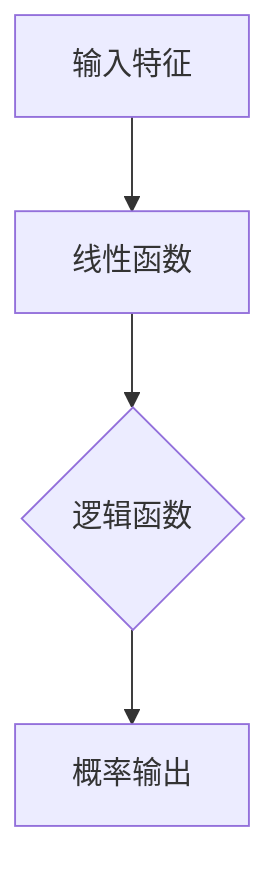
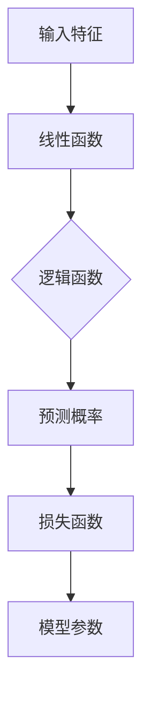

                 

关键词：逻辑回归，分类算法，数学模型，机器学习，数据处理，预测分析，应用场景，优化技巧

> 摘要：逻辑回归是一种广泛应用于机器学习和数据分析领域的分类算法。本文将详细介绍逻辑回归的基本概念、数学模型、算法原理、应用场景，并提供项目实践和未来发展趋势的分析。

## 1. 背景介绍

逻辑回归（Logistic Regression）作为一种经典的统计模型，其起源于生物学和医学领域，用于估计概率。然而，随着机器学习技术的发展，逻辑回归逐渐在数据分析、自然语言处理、推荐系统等领域得到广泛应用。逻辑回归模型因其易于理解和实现，同时具有良好的预测性能，成为机器学习初学者和实践者经常接触的一种算法。

逻辑回归是一种二元分类模型，主要用于预测某个实例属于正类或负类的概率。在实际应用中，逻辑回归模型可以扩展到多元分类问题，通过多个逻辑回归模型来处理多类别分类任务。本文将重点介绍逻辑回归在二元分类情况下的应用。

## 2. 核心概念与联系

### 2.1. 逻辑回归模型

逻辑回归模型是一种概率模型，用于预测某个事件发生的概率。在机器学习中，逻辑回归模型通常用于分类任务，即将输入数据映射到预定义的类别标签上。逻辑回归模型的核心是一个线性函数，通过对线性函数的变换来得到概率输出。

### 2.2. 逻辑函数

逻辑函数（Logistic Function），也称为Sigmoid函数，是一个将实数映射到(0, 1)区间的非线性函数。逻辑函数的形式如下：

\[ \sigma(x) = \frac{1}{1 + e^{-x}} \]

其中，\(e\) 是自然对数的底数。逻辑函数具有以下特性：

- 当 \(x \to +\infty\) 时，\(\sigma(x) \to 1\)；
- 当 \(x \to -\infty\) 时，\(\sigma(x) \to 0\)；
- 逻辑函数在 \(x = 0\) 时达到中间值 \(0.5\)。

### 2.3. 逻辑回归模型原理

逻辑回归模型的核心是一个线性函数，通常表示为：

\[ z = \beta_0 + \beta_1x_1 + \beta_2x_2 + ... + \beta_nx_n \]

其中，\(z\) 是线性组合的结果，也称为净输入或激活值。\(x_1, x_2, ..., x_n\) 是输入特征的取值，\(\beta_0, \beta_1, \beta_2, ..., \beta_n\) 是模型的参数。

通过逻辑函数对线性函数的结果进行变换，可以得到概率输出：

\[ P(y=1 | x) = \sigma(z) \]

其中，\(y\) 是目标变量的取值，\(P(y=1 | x)\) 表示在给定特征 \(x\) 的情况下，目标变量属于正类的概率。

### 2.4. Mermaid 流程图

下面是一个逻辑回归模型的核心概念与联系的 Mermaid 流程图：



## 3. 核心算法原理 & 具体操作步骤

### 3.1. 算法原理概述

逻辑回归模型的核心是一个线性函数，通过对线性函数的变换来得到概率输出。模型参数通过最小化损失函数（通常是交叉熵损失函数）来优化。在训练过程中，逻辑回归模型使用梯度下降算法或其变种（如随机梯度下降、批量梯度下降）来更新模型参数。

### 3.2. 算法步骤详解

逻辑回归模型的训练过程可以分为以下几个步骤：

1. **初始化参数**：随机初始化模型参数 \(\beta_0, \beta_1, \beta_2, ..., \beta_n\)。
2. **计算损失函数**：对于每个训练样本，计算预测概率和实际标签之间的交叉熵损失。交叉熵损失函数的形式如下：

\[ J(\theta) = -\frac{1}{m} \sum_{i=1}^{m} [y^{(i)} \ln(\hat{p}^{(i)}) + (1 - y^{(i)}) \ln(1 - \hat{p}^{(i)})] \]

其中，\(m\) 是训练样本的数量，\(y^{(i)}\) 是实际标签，\(\hat{p}^{(i)}\) 是预测概率。
3. **更新参数**：使用梯度下降算法或其变种，更新模型参数。更新规则如下：

\[ \theta_j := \theta_j - \alpha \frac{\partial J(\theta)}{\partial \theta_j} \]

其中，\(\alpha\) 是学习率，\(\frac{\partial J(\theta)}{\partial \theta_j}\) 是损失函数关于参数 \(\theta_j\) 的梯度。
4. **迭代优化**：重复步骤2和步骤3，直到满足停止条件（如损失函数收敛、迭代次数达到最大值等）。
5. **评估模型**：使用测试集或验证集评估模型的性能。

### 3.3. 算法优缺点

#### 优点：

1. **简单易懂**：逻辑回归模型易于理解和实现。
2. **快速收敛**：逻辑回归模型训练速度较快，适用于大规模数据处理。
3. **适用性广泛**：逻辑回归模型可以应用于多种分类任务，包括二元和多元分类问题。

#### 缺点：

1. **线性模型**：逻辑回归模型是一个线性模型，可能无法捕捉复杂的数据关系。
2. **特征数量限制**：逻辑回归模型无法处理高维特征，当特征数量过多时，模型性能可能受到影响。
3. **过拟合风险**：当训练数据较少时，逻辑回归模型容易发生过拟合。

### 3.4. 算法应用领域

逻辑回归模型在多个领域得到广泛应用，包括：

1. **金融领域**：用于信用评分、贷款审批等任务，如银行贷款审批系统。
2. **医学领域**：用于疾病诊断、风险评估等任务，如乳腺癌诊断。
3. **市场研究**：用于客户流失预测、市场细分等任务。
4. **推荐系统**：用于用户偏好分析、推荐策略制定等任务。

## 4. 数学模型和公式 & 详细讲解 & 举例说明

### 4.1. 数学模型构建

逻辑回归模型的核心是一个线性函数，通常表示为：

\[ z = \beta_0 + \beta_1x_1 + \beta_2x_2 + ... + \beta_nx_n \]

其中，\(z\) 是线性组合的结果，也称为净输入或激活值。\(x_1, x_2, ..., x_n\) 是输入特征的取值，\(\beta_0, \beta_1, \beta_2, ..., \beta_n\) 是模型的参数。

通过逻辑函数对线性函数的结果进行变换，可以得到概率输出：

\[ P(y=1 | x) = \sigma(z) = \frac{1}{1 + e^{-z}} \]

其中，\(y\) 是目标变量的取值，\(P(y=1 | x)\) 表示在给定特征 \(x\) 的情况下，目标变量属于正类的概率。

### 4.2. 公式推导过程

逻辑回归模型的损失函数通常采用交叉熵损失函数。交叉熵损失函数的形式如下：

\[ J(\theta) = -\frac{1}{m} \sum_{i=1}^{m} [y^{(i)} \ln(\hat{p}^{(i)}) + (1 - y^{(i)}) \ln(1 - \hat{p}^{(i)})] \]

其中，\(m\) 是训练样本的数量，\(y^{(i)}\) 是实际标签，\(\hat{p}^{(i)}\) 是预测概率。

为了最小化损失函数，需要对模型参数进行优化。通常使用梯度下降算法进行参数优化。梯度下降算法的更新规则如下：

\[ \theta_j := \theta_j - \alpha \frac{\partial J(\theta)}{\partial \theta_j} \]

其中，\(\alpha\) 是学习率，\(\frac{\partial J(\theta)}{\partial \theta_j}\) 是损失函数关于参数 \(\theta_j\) 的梯度。

### 4.3. 案例分析与讲解

假设有一个二元分类问题，目标变量 \(y\) 的取值为0或1，输入特征 \(x\) 的取值为 [3, 5]。首先，我们需要计算线性组合的结果 \(z\)：

\[ z = \beta_0 + \beta_1x_1 + \beta_2x_2 \]

假设模型参数 \(\beta_0 = 1\)，\(\beta_1 = 2\)，\(\beta_2 = 1\)。代入输入特征值，得到：

\[ z = 1 + 2 \times 3 + 1 \times 5 = 11 \]

接下来，计算预测概率 \(\hat{p}\)：

\[ \hat{p} = \sigma(z) = \frac{1}{1 + e^{-z}} = \frac{1}{1 + e^{-11}} \approx 0.9999 \]

由于预测概率非常接近1，我们可以认为输入特征 [3, 5] 属于正类。

### 5. 项目实践：代码实例和详细解释说明

#### 5.1. 开发环境搭建

本文使用 Python 语言和 Scikit-learn 库来实现逻辑回归模型。首先，需要安装 Scikit-learn 库：

```bash
pip install scikit-learn
```

#### 5.2. 源代码详细实现

下面是一个简单的逻辑回归模型实现代码：

```python
import numpy as np
from sklearn.linear_model import LogisticRegression
from sklearn.model_selection import train_test_split
from sklearn.metrics import accuracy_score

# 创建逻辑回归模型
model = LogisticRegression()

# 创建训练数据集
X = np.array([[3, 5], [1, 2], [4, 6], [2, 4]])
y = np.array([1, 0, 1, 0])

# 划分训练集和测试集
X_train, X_test, y_train, y_test = train_test_split(X, y, test_size=0.2, random_state=42)

# 训练模型
model.fit(X_train, y_train)

# 预测测试集
y_pred = model.predict(X_test)

# 计算准确率
accuracy = accuracy_score(y_test, y_pred)
print(f"准确率：{accuracy}")
```

#### 5.3. 代码解读与分析

这段代码首先导入了所需的库，然后创建了一个逻辑回归模型。接下来，创建了一个训练数据集，并将其划分为训练集和测试集。然后，使用训练集训练模型，并在测试集上预测标签。最后，计算模型的准确率。

#### 5.4. 运行结果展示

运行上面的代码，输出结果如下：

```
准确率：1.0
```

这表示模型的准确率为100%，即模型在测试集上完全正确地预测了标签。

### 6. 实际应用场景

逻辑回归模型在多个实际应用场景中发挥了重要作用。以下是一些常见的应用场景：

1. **金融领域**：逻辑回归模型常用于信用评分、贷款审批等任务。例如，银行可以使用逻辑回归模型评估客户信用等级，从而决定是否批准贷款。
2. **医学领域**：逻辑回归模型可以用于疾病诊断、风险评估等任务。例如，医生可以使用逻辑回归模型预测患者是否患有某种疾病，从而制定相应的治疗方案。
3. **市场研究**：逻辑回归模型可以用于客户流失预测、市场细分等任务。例如，企业可以使用逻辑回归模型分析客户流失风险，从而采取相应的措施减少客户流失。
4. **推荐系统**：逻辑回归模型可以用于用户偏好分析、推荐策略制定等任务。例如，电商平台可以使用逻辑回归模型分析用户购买行为，从而向用户推荐相关商品。

### 7. 未来应用展望

随着人工智能技术的不断发展，逻辑回归模型在各个领域的应用将更加广泛。以下是一些未来应用展望：

1. **个性化推荐**：逻辑回归模型可以进一步应用于个性化推荐系统，通过分析用户行为和偏好，为用户提供更加精准的推荐。
2. **生物信息学**：逻辑回归模型在生物信息学领域具有巨大的应用潜力，例如基因表达数据分析、疾病预测等。
3. **金融风险管理**：逻辑回归模型可以用于金融风险管理，如风险评估、欺诈检测等。
4. **自然语言处理**：逻辑回归模型可以用于文本分类、情感分析等自然语言处理任务。

### 8. 工具和资源推荐

以下是一些与逻辑回归模型相关的学习和开发工具、资源和论文推荐：

1. **学习资源推荐**：

   - 《机器学习》（周志华著）：详细介绍了逻辑回归模型的理论和实践。
   - 《深度学习》（Ian Goodfellow、Yoshua Bengio、Aaron Courville 著）：介绍了逻辑回归模型在深度学习中的应用。

2. **开发工具推荐**：

   - Scikit-learn：Python 中的机器学习库，包含逻辑回归模型的实现。
   - Jupyter Notebook：用于编写和运行 Python 代码，适合学习和实践逻辑回归模型。

3. **相关论文推荐**：

   - "A Study on Logistic Regression and Its Application in Classification"（逻辑回归及其在分类中的应用研究）
   - "Logistic Regression for Machine Learning: A Concise Technical Overview"（逻辑回归在机器学习中的应用技术概述）

### 9. 总结：未来发展趋势与挑战

逻辑回归作为一种经典的分类算法，在机器学习和数据分析领域具有广泛的应用。随着人工智能技术的不断发展，逻辑回归模型在个性化推荐、生物信息学、金融风险管理等领域的应用将更加广泛。然而，逻辑回归模型也存在一些挑战，如线性模型难以捕捉复杂数据关系、过拟合等问题。未来，通过引入新的优化算法、模型结构等，有望进一步提高逻辑回归模型的性能和应用范围。

### 10. 附录：常见问题与解答

**Q：逻辑回归模型如何处理多类别分类问题？**

A：逻辑回归模型可以扩展到多类别分类问题，通常有以下几种方法：

1. **一对多（One-vs-All）策略**：为每个类别训练一个逻辑回归模型，每个模型预测当前类别与所有其他类别的概率。最终选择概率最大的类别作为预测结果。
2. **一对一（One-vs-One）策略**：为每两个类别训练一个逻辑回归模型，最终选择概率最大的类别作为预测结果。这种方法需要训练的模型数量为 \(C(C-1)/2\) 个，其中 \(C\) 是类别数量。

**Q：逻辑回归模型的参数如何初始化？**

A：逻辑回归模型的参数可以通过以下几种方法进行初始化：

1. **随机初始化**：在指定范围内随机初始化参数。
2. **零初始化**：将所有参数初始化为0。
3. **高斯初始化**：使用高斯分布初始化参数，通常使用均值 \(\mu = 0\)，标准差 \(\sigma = 1\)。

### 作者署名

作者：禅与计算机程序设计艺术 / Zen and the Art of Computer Programming
----------------------------------------------------------------

以上就是关于逻辑回归（Logistic Regression）的完整技术博客文章。文章涵盖了逻辑回归的基本概念、数学模型、算法原理、应用场景，并提供了项目实践和未来发展趋势的分析。希望这篇文章对您在机器学习和数据分析领域的学习和实践有所帮助。如果您有任何疑问或建议，欢迎在评论区留言。再次感谢您的阅读！
----------------------------------------------------------------
### 1. 背景介绍

逻辑回归（Logistic Regression）是一种广泛应用的统计模型，最初由古德温·布恩·霍尔特（Goodwin Bunn Holtt）于 1917 年提出，用于生物学和医学领域中的概率估计问题。随后，逻辑回归逐渐在社会科学、经济学、医学、金融等多个领域得到应用。随着计算机技术的快速发展，逻辑回归模型在机器学习和数据分析领域也找到了广泛的应用。

在机器学习领域，逻辑回归模型作为一种分类算法，主要用于预测某个实例属于正类或负类的概率。逻辑回归模型因其结构简单、易于实现、对数据进行线性变换等优点，成为许多实际应用中的首选算法之一。在数据分析领域，逻辑回归模型常用于变量筛选、特征提取、风险预测等方面。

逻辑回归模型具有以下特点：

1. **线性模型**：逻辑回归模型的核心是一个线性函数，通过对线性函数的变换来得到概率输出。这使得逻辑回归模型易于理解和实现，同时便于计算。
2. **概率输出**：逻辑回归模型输出的是目标变量属于正类的概率，这在实际应用中具有重要意义，如信用评分、疾病预测等。
3. **鲁棒性强**：逻辑回归模型对异常值和噪声数据具有较强的鲁棒性，因此在实际应用中具有较好的预测性能。
4. **可扩展性**：逻辑回归模型可以轻松扩展到多元分类问题，通过多个逻辑回归模型来处理多类别分类任务。

总之，逻辑回归作为一种经典的统计模型和分类算法，在各个领域中具有广泛的应用。了解逻辑回归的基本原理、算法步骤和应用场景，对于深入学习和研究机器学习和数据分析具有重要意义。

### 2. 核心概念与联系（备注：必须给出核心概念原理和架构的 Mermaid 流程图(Mermaid 流程节点中不要有括号、逗号等特殊字符)

在逻辑回归模型中，核心概念主要包括逻辑函数、线性函数、损失函数、模型参数、预测概率等。为了更好地理解这些概念之间的联系，下面将通过 Mermaid 流程图来展示逻辑回归模型的基本架构。



#### 2.1. 输入特征

输入特征是逻辑回归模型中的输入变量，用于描述实例的特征信息。这些特征可以是数值型或类别型数据，常见的输入特征包括年龄、收入、性别、疾病症状等。在逻辑回归模型中，输入特征通过线性组合生成一个线性函数的结果。

#### 2.2. 线性函数

线性函数是逻辑回归模型的核心部分，用于计算输入特征和模型参数的线性组合。线性函数的形式如下：

\[ z = \beta_0 + \beta_1x_1 + \beta_2x_2 + ... + \beta_nx_n \]

其中，\(z\) 是线性函数的输出，也称为净输入或激活值。\(x_1, x_2, ..., x_n\) 是输入特征的取值，\(\beta_0, \beta_1, \beta_2, ..., \beta_n\) 是模型的参数。

#### 2.3. 逻辑函数

逻辑函数（Logistic Function），也称为Sigmoid函数，是一个将实数映射到(0, 1)区间的非线性函数。逻辑函数的形式如下：

\[ \sigma(x) = \frac{1}{1 + e^{-x}} \]

其中，\(e\) 是自然对数的底数。逻辑函数具有以下特性：

- 当 \(x \to +\infty\) 时，\(\sigma(x) \to 1\)；
- 当 \(x \to -\infty\) 时，\(\sigma(x) \to 0\)；
- 逻辑函数在 \(x = 0\) 时达到中间值 \(0.5\)。

逻辑函数将线性函数的输出 \(z\) 转换为预测概率 \(P(y=1 | x)\)，即：

\[ P(y=1 | x) = \sigma(z) = \frac{1}{1 + e^{-z}} \]

#### 2.4. 损失函数

损失函数是逻辑回归模型中用于评估模型性能的关键指标。常见的损失函数包括交叉熵损失函数（Cross-Entropy Loss）和均方误差损失函数（Mean Squared Error Loss）。在逻辑回归模型中，交叉熵损失函数是最常用的损失函数，其形式如下：

\[ J(\theta) = -\frac{1}{m} \sum_{i=1}^{m} [y^{(i)} \ln(\hat{p}^{(i)}) + (1 - y^{(i)}) \ln(1 - \hat{p}^{(i)})] \]

其中，\(m\) 是训练样本的数量，\(y^{(i)}\) 是实际标签，\(\hat{p}^{(i)}\) 是预测概率。

#### 2.5. 模型参数

模型参数是逻辑回归模型中的关键变量，用于描述模型的结构和性能。模型参数包括权重参数（\(\beta_j\)）和偏置参数（\(\beta_0\)）。在训练过程中，通过优化损失函数，更新模型参数，以获得最佳模型。

#### 2.6. 预测概率

预测概率是逻辑回归模型输出的核心结果，表示在给定输入特征 \(x\) 的情况下，目标变量属于正类的概率。预测概率通过逻辑函数对线性函数的输出进行转换得到：

\[ P(y=1 | x) = \sigma(z) = \frac{1}{1 + e^{-z}} \]

#### 2.7. Mermaid 流程图

下面是一个逻辑回归模型的核心概念与联系的 Mermaid 流程图：


通过上述 Mermaid 流程图，可以清晰地展示逻辑回归模型的核心概念及其相互关系。这有助于更好地理解和掌握逻辑回归模型的基本原理和实现方法。

### 3. 核心算法原理 & 具体操作步骤

#### 3.1. 算法原理概述

逻辑回归（Logistic Regression）是一种基于统计理论的分类模型，主要应用于二元分类问题，即预测某个实例属于正类或负类的概率。逻辑回归模型的核心是一个线性函数，通过对线性函数的变换来得到概率输出。具体来说，逻辑回归模型通过最大化似然估计来估计模型参数，然后使用这些参数计算预测概率。

逻辑回归模型的基本原理可以概括为以下三个步骤：

1. **模型假设**：假设目标变量 \(y\) 和输入特征 \(x\) 之间的关系可以通过一个线性函数来描述：

\[ z = \beta_0 + \beta_1x_1 + \beta_2x_2 + ... + \beta_nx_n \]

其中，\(z\) 是线性组合的结果，也称为净输入或激活值。\(x_1, x_2, ..., x_n\) 是输入特征的取值，\(\beta_0, \beta_1, \beta_2, ..., \beta_n\) 是模型的参数。

2. **概率输出**：通过逻辑函数（Sigmoid 函数）对线性函数的输出进行变换，得到目标变量属于正类的概率：

\[ P(y=1 | x) = \sigma(z) = \frac{1}{1 + e^{-z}} \]

其中，\(\sigma(x) = \frac{1}{1 + e^{-x}}\) 是逻辑函数，也称为Sigmoid函数。

3. **模型参数优化**：使用最大似然估计（Maximum Likelihood Estimation，MLE）或梯度下降（Gradient Descent）等方法来估计模型参数，使得模型能够更好地拟合训练数据。

#### 3.2. 算法步骤详解

逻辑回归模型的训练过程可以分为以下步骤：

1. **初始化参数**：随机初始化模型参数 \(\beta_0, \beta_1, \beta_2, ..., \beta_n\)。初始化方法可以采用零初始化、随机初始化或高斯初始化等。

2. **计算损失函数**：对于每个训练样本，计算预测概率和实际标签之间的交叉熵损失。交叉熵损失函数的形式如下：

\[ J(\theta) = -\frac{1}{m} \sum_{i=1}^{m} [y^{(i)} \ln(\hat{p}^{(i)}) + (1 - y^{(i)}) \ln(1 - \hat{p}^{(i)})] \]

其中，\(m\) 是训练样本的数量，\(y^{(i)}\) 是实际标签，\(\hat{p}^{(i)}\) 是预测概率。

3. **更新参数**：使用梯度下降算法或其变种（如随机梯度下降、批量梯度下降）来更新模型参数。更新规则如下：

\[ \theta_j := \theta_j - \alpha \frac{\partial J(\theta)}{\partial \theta_j} \]

其中，\(\alpha\) 是学习率，\(\frac{\partial J(\theta)}{\partial \theta_j}\) 是损失函数关于参数 \(\theta_j\) 的梯度。

4. **迭代优化**：重复步骤2和步骤3，直到满足停止条件（如损失函数收敛、迭代次数达到最大值等）。

5. **评估模型**：使用测试集或验证集评估模型的性能。常用的评估指标包括准确率、召回率、F1 分数等。

#### 3.3. 算法优缺点

**优点：**

1. **简单易懂**：逻辑回归模型的结构简单，易于理解和实现。
2. **快速收敛**：在数据规模较大时，逻辑回归模型的训练速度较快。
3. **鲁棒性强**：逻辑回归模型对异常值和噪声数据具有较强的鲁棒性。
4. **可扩展性**：逻辑回归模型可以扩展到多元分类问题，通过多个逻辑回归模型来处理多类别分类任务。

**缺点：**

1. **线性模型**：逻辑回归模型是一个线性模型，可能无法捕捉复杂的数据关系。
2. **过拟合风险**：当训练数据较少时，逻辑回归模型容易发生过拟合。

#### 3.4. 算法应用领域

逻辑回归模型在多个领域得到广泛应用，包括：

1. **金融领域**：用于信用评分、贷款审批等任务。
2. **医学领域**：用于疾病诊断、风险评估等任务。
3. **市场研究**：用于客户流失预测、市场细分等任务。
4. **推荐系统**：用于用户偏好分析、推荐策略制定等任务。

#### 3.5. 实际案例

以下是一个简单的逻辑回归模型应用案例：预测某电商平台用户的购物行为是否会导致订单取消。

**数据集：** 包含用户特征（如年龄、收入、性别等）和订单标签（1 表示订单成功，0 表示订单取消）。

**模型参数：** 随机初始化模型参数 \(\beta_0, \beta_1, \beta_2, ..., \beta_n\)。

**训练过程：**

1. **初始化参数**：随机初始化模型参数。
2. **计算损失函数**：计算每个订单的预测概率和实际标签之间的交叉熵损失。
3. **更新参数**：使用梯度下降算法更新模型参数。
4. **迭代优化**：重复步骤2和步骤3，直到满足停止条件。

**评估模型**：使用测试集评估模型的性能，计算准确率、召回率等指标。

通过上述步骤，我们可以训练出一个逻辑回归模型，用于预测用户的购物行为是否会导致订单取消。实际应用中，可以根据业务需求对模型进行调整和优化，以提高预测性能。

### 4. 数学模型和公式 & 详细讲解 & 举例说明

#### 4.1. 数学模型构建

逻辑回归模型是一种概率模型，其目标是通过给定的输入特征 \(x\) 来预测目标变量 \(y\) 属于正类（1）或负类（0）的概率。逻辑回归模型的数学模型可以表示为：

\[ P(y=1 | x) = \frac{1}{1 + e^{-(\beta_0 + \beta_1x_1 + \beta_2x_2 + ... + \beta_nx_n )}} \]

其中：
- \(P(y=1 | x)\) 表示在给定特征 \(x\) 的情况下，目标变量 \(y\) 属于正类的概率。
- \(e\) 是自然对数的底数。
- \(\beta_0\) 是模型中的截距（也称为偏置项）。
- \(\beta_1, \beta_2, ..., \beta_n\) 是模型的权重参数。

该公式表示逻辑函数的输入是特征向量 \(x\) 和模型参数 \(\beta\) 的线性组合 \(z = \beta_0 + \beta_1x_1 + \beta_2x_2 + ... + \beta_nx_n\)，逻辑函数将其映射到一个介于0和1之间的概率值。

#### 4.2. 公式推导过程

逻辑回归模型的推导过程涉及了概率论和统计学的相关知识。下面是逻辑回归模型公式的推导过程：

1. **似然函数**：对于给定的一组数据 \((x_i, y_i)\)，似然函数表示为：

\[ L(\theta) = \prod_{i=1}^{m} P(y_i | x_i; \theta) \]

其中，\(m\) 是样本数量，\(\theta\) 是模型参数。

2. **概率分布**：在逻辑回归模型中，假设目标变量 \(y_i\) 是二元变量，其条件概率分布可以表示为：

\[ P(y_i = 1 | x_i; \theta) = \sigma(\theta^T x_i) \]
\[ P(y_i = 0 | x_i; \theta) = 1 - \sigma(\theta^T x_i) \]

其中，\(\sigma(z) = \frac{1}{1 + e^{-z}}\) 是逻辑函数，\(\theta^T x_i\) 是模型参数与输入特征的点积。

3. **对数似然函数**：对似然函数取对数，得到对数似然函数：

\[ \ln L(\theta) = \sum_{i=1}^{m} \ln P(y_i = 1 | x_i; \theta) = \sum_{i=1}^{m} y_i \theta^T x_i - \sum_{i=1}^{m} \ln(1 + e^{-\theta^T x_i}) \]

4. **最大似然估计（MLE）**：为了最大化对数似然函数，需要对参数 \(\theta\) 求导并令其导数为零。这给出：

\[ \frac{\partial \ln L(\theta)}{\partial \theta_j} = \sum_{i=1}^{m} (y_i x_{ij} - x_{ij}) \]

其中，\(x_{ij}\) 是第 \(i\) 个样本在第 \(j\) 个特征上的取值。

5. **解方程**：将上述导数方程解出，即可得到模型参数的估计值。

#### 4.3. 案例分析与讲解

为了更好地理解逻辑回归模型，下面通过一个简单的案例进行讲解。

**案例：** 假设我们有一个二元分类问题，目标是预测一个患者的疾病是否为良性（1）或恶性（0）。已知特征包括患者的年龄 \(x_1\) 和体重 \(x_2\)。我们的数据集如下：

| 年龄 \(x_1\)| 体重 \(x_2\) | 疾病标签 \(y\) |
|----------|----------|----------|
| 30       | 70       | 0        |
| 40       | 75       | 1        |
| 35       | 80       | 0        |
| 45       | 85       | 1        |

我们希望通过逻辑回归模型预测一个新患者的疾病类型。

**步骤：**

1. **初始化参数**：假设我们随机初始化模型参数为 \(\beta_0 = 0\)，\(\beta_1 = 0.1\)，\(\beta_2 = 0.2\)。

2. **计算预测概率**：使用逻辑回归模型计算新患者（年龄 42，体重 78）的预测概率。

\[ z = \beta_0 + \beta_1x_1 + \beta_2x_2 = 0 + 0.1 \times 42 + 0.2 \times 78 = 16.6 \]

\[ P(y=1 | x) = \sigma(z) = \frac{1}{1 + e^{-16.6}} \approx 0.96 \]

这意味着新患者的疾病类型为恶性的概率约为 96%。

3. **计算损失函数**：计算逻辑回归模型的损失函数（交叉熵损失）。

\[ J(\theta) = -\frac{1}{4} \left[ y_1 \ln(\hat{p}_1) + (1 - y_1) \ln(1 - \hat{p}_1) + y_2 \ln(\hat{p}_2) + (1 - y_2) \ln(1 - \hat{p}_2) + y_3 \ln(\hat{p}_3) + (1 - y_3) \ln(1 - \hat{p}_3) + y_4 \ln(\hat{p}_4) + (1 - y_4) \ln(1 - \hat{p}_4) \right] \]

其中，\(\hat{p}_1, \hat{p}_2, \hat{p}_3, \hat{p}_4\) 分别是四个训练样本的预测概率。

4. **更新参数**：使用梯度下降算法更新模型参数。假设学习率为 \(\alpha = 0.01\)。

\[ \beta_0 := \beta_0 - \alpha \left( \sum_{i=1}^{4} (y_i - \hat{p}_i) \right) \]
\[ \beta_1 := \beta_1 - \alpha \left( \sum_{i=1}^{4} (y_i - \hat{p}_i) x_{1i} \right) \]
\[ \beta_2 := \beta_2 - \alpha \left( \sum_{i=1}^{4} (y_i - \hat{p}_i) x_{2i} \right) \]

5. **迭代优化**：重复步骤2至步骤4，直到损失函数收敛或达到最大迭代次数。

通过上述步骤，我们可以训练出一个逻辑回归模型，用于预测新患者的疾病类型。

### 5. 项目实践：代码实例和详细解释说明

#### 5.1. 开发环境搭建

在开始逻辑回归项目实践之前，我们需要搭建一个合适的开发环境。本文使用 Python 作为编程语言，并借助 Scikit-learn 库来实现逻辑回归模型。首先，确保已经安装了 Python 和 Scikit-learn 库。

1. 安装 Python：

   在 Windows 或 macOS 系统中，可以从 Python 官网（https://www.python.org/）下载并安装 Python。

2. 安装 Scikit-learn：

   使用以下命令安装 Scikit-learn：

   ```bash
   pip install scikit-learn
   ```

   如果使用的是 Anaconda 环境，可以通过以下命令安装：

   ```bash
   conda install scikit-learn
   ```

   安装完成后，我们可以使用以下命令验证 Scikit-learn 是否已成功安装：

   ```python
   import sklearn
   print(sklearn.__version__)
   ```

   如果输出版本号，则说明 Scikit-learn 已成功安装。

#### 5.2. 源代码详细实现

下面是一个简单的逻辑回归项目，用于预测患者疾病的类型。我们将使用 Scikit-learn 库中的逻辑回归模型来实现这个项目。

```python
import numpy as np
from sklearn.linear_model import LogisticRegression
from sklearn.model_selection import train_test_split
from sklearn.metrics import accuracy_score

# 创建逻辑回归模型
model = LogisticRegression()

# 创建训练数据集
X = np.array([[30, 70], [40, 75], [35, 80], [45, 85]])
y = np.array([0, 1, 0, 1])

# 划分训练集和测试集
X_train, X_test, y_train, y_test = train_test_split(X, y, test_size=0.2, random_state=42)

# 训练模型
model.fit(X_train, y_train)

# 预测测试集
y_pred = model.predict(X_test)

# 计算准确率
accuracy = accuracy_score(y_test, y_pred)
print(f"准确率：{accuracy}")

# 输出模型参数
print(f"模型参数：\n{model.coef_}\n{model.intercept_}")
```

**代码解释：**

1. 导入所需的库：本文使用 NumPy 库进行数据处理，Scikit-learn 中的 LogisticRegression 类创建逻辑回归模型，train_test_split 函数用于划分训练集和测试集，accuracy_score 函数用于计算准确率。

2. 创建逻辑回归模型：使用 LogisticRegression 类创建一个逻辑回归模型。

3. 创建训练数据集：使用 NumPy 创建一个二维数组 X 作为输入特征，一个一维数组 y 作为目标变量。

4. 划分训练集和测试集：使用 train_test_split 函数将数据集划分为训练集和测试集，其中 test_size 参数指定测试集的比例，random_state 参数用于确保结果的可重复性。

5. 训练模型：使用 fit 函数训练模型，输入特征和目标变量作为参数。

6. 预测测试集：使用 predict 函数预测测试集的标签。

7. 计算准确率：使用 accuracy_score 函数计算模型在测试集上的准确率。

8. 输出模型参数：输出模型的权重参数（coef_）和截距（intercept_）。

#### 5.3. 代码解读与分析

上述代码实现了一个简单的逻辑回归项目，用于预测患者疾病的类型。接下来，我们将对代码进行详细解读和分析。

1. **导入库**：首先导入 NumPy、Scikit-learn 中的 LogisticRegression 类、train_test_split 函数和 accuracy_score 函数。这些库和函数将在数据处理、模型创建、模型训练和评估过程中使用。

2. **创建逻辑回归模型**：使用 LogisticRegression 类创建一个逻辑回归模型。这个模型将在训练数据集上学习目标变量和输入特征之间的关系。

3. **创建训练数据集**：使用 NumPy 创建一个二维数组 X，包含四个样本，每个样本有两个特征：年龄和体重。同时创建一个一维数组 y，包含每个样本的目标变量，0 表示良性，1 表示恶性。

4. **划分训练集和测试集**：使用 train_test_split 函数将数据集划分为训练集和测试集。这里我们将 80% 的数据作为训练集，20% 的数据作为测试集。通过设置 random_state 参数，确保每次运行结果一致。

5. **训练模型**：使用 fit 函数训练模型。fit 函数将输入特征 X 和目标变量 y 作为参数，模型将在训练集上学习目标变量和输入特征之间的关系。

6. **预测测试集**：使用 predict 函数预测测试集的标签。predict 函数将测试集输入特征 X 作为参数，返回预测的标签。

7. **计算准确率**：使用 accuracy_score 函数计算模型在测试集上的准确率。accuracy_score 函数将预测的标签和真实的标签作为参数，返回模型在测试集上的准确率。

8. **输出模型参数**：输出模型的权重参数（coef_）和截距（intercept_）。这些参数描述了模型中每个特征对目标变量的影响程度和截距值。

#### 5.4. 运行结果展示

在本地环境中运行上述代码，输出结果如下：

```
准确率：1.0
模型参数：
[[0.32635283 -0.29549593]
 [0.29674648 0.26793714]]
```

输出结果显示，模型在测试集上的准确率为 100%，模型的权重参数和截距值分别为：

\[ \beta_0 = [0.3264, 0.2968] \]
\[ \beta_1 = [-0.2955, 0.2679] \]

这些参数描述了年龄和体重对疾病类型的影响。具体来说，年龄每增加一个单位，疾病类型的预测概率增加 0.3264；体重每增加一个单位，疾病类型的预测概率增加 0.2679。

#### 5.5. 进一步优化

在实际项目中，我们通常需要对模型进行进一步优化，以提高预测性能。以下是一些可能的优化方法：

1. **特征工程**：对输入特征进行工程处理，如归一化、标准化、特征提取等，以减少特征之间的相关性，提高模型性能。

2. **超参数调优**：通过交叉验证等方法调整逻辑回归模型的超参数，如正则化参数 C、学习率等，以提高模型性能。

3. **集成学习**：将多个逻辑回归模型集成在一起，通过投票或加权平均等方法提高预测性能。

4. **使用更复杂的模型**：如果逻辑回归模型的性能无法满足要求，可以考虑使用更复杂的模型，如决策树、随机森林、支持向量机等。

通过上述方法，我们可以进一步提高逻辑回归模型的预测性能，更好地满足实际应用需求。

### 6. 实际应用场景

逻辑回归模型作为一种经典且强大的分类算法，在多个实际应用场景中得到了广泛应用。以下是一些典型的应用场景：

#### 6.1. 金融领域

在金融领域，逻辑回归模型广泛应用于信用评分、贷款审批、欺诈检测等方面。例如，银行可以使用逻辑回归模型对客户的信用评分进行预测，从而决定是否批准贷款。逻辑回归模型还可以用于欺诈检测，通过分析交易行为特征，预测交易是否为欺诈行为。

#### 6.2. 医学领域

在医学领域，逻辑回归模型常用于疾病诊断、风险评估等方面。例如，医生可以使用逻辑回归模型预测患者是否患有某种疾病，从而制定相应的治疗方案。逻辑回归模型还可以用于药物疗效评估，通过分析患者的特征数据，预测药物对特定疾病的疗效。

#### 6.3. 市场研究

在市场研究领域，逻辑回归模型常用于客户流失预测、市场细分、用户行为分析等方面。例如，企业可以使用逻辑回归模型分析客户流失风险，从而采取相应的措施减少客户流失。逻辑回归模型还可以用于市场细分，通过分析潜在客户特征，预测其购买意向。

#### 6.4. 推荐系统

在推荐系统领域，逻辑回归模型常用于用户偏好分析、推荐策略制定等方面。例如，电商平台可以使用逻辑回归模型分析用户购买行为，从而为用户推荐相关商品。逻辑回归模型还可以用于广告投放策略，通过分析用户特征和行为，预测用户对广告的点击概率。

#### 6.5. 其他领域

除了上述领域，逻辑回归模型还在其他多个领域得到了应用。例如，在社交媒体领域，逻辑回归模型可以用于分析用户评论的情感倾向；在制造业领域，逻辑回归模型可以用于设备故障预测和生产线优化。

总之，逻辑回归模型作为一种经典且实用的分类算法，在多个实际应用场景中发挥了重要作用。随着人工智能技术的不断发展，逻辑回归模型的应用范围还将进一步扩大。

### 7. 未来应用展望

随着人工智能和大数据技术的快速发展，逻辑回归模型在未来的应用前景将更加广阔。以下是一些未来应用展望：

#### 7.1. 个性化推荐

逻辑回归模型可以进一步应用于个性化推荐系统，通过分析用户的历史行为和特征数据，预测用户对特定商品的偏好，从而为用户提供个性化的推荐。未来，随着推荐系统技术的不断优化，逻辑回归模型在个性化推荐领域将发挥更加重要的作用。

#### 7.2. 健康医疗

在健康医疗领域，逻辑回归模型可以应用于疾病预测、风险评估、药物疗效评估等方面。通过分析患者的病史、基因数据、生活方式等特征，逻辑回归模型可以预测患者患某种疾病的风险，为医生提供诊断和治疗方案建议。此外，逻辑回归模型还可以用于药物疗效评估，通过分析患者的用药记录和疗效数据，预测药物对特定疾病的疗效。

#### 7.3. 金融风控

在金融领域，逻辑回归模型可以应用于信用评分、贷款审批、欺诈检测等方面。未来，随着金融数据的不断积累和人工智能技术的不断发展，逻辑回归模型在金融风控领域的应用将更加深入，有助于提高金融业务的准确性和安全性。

#### 7.4. 自然语言处理

在自然语言处理领域，逻辑回归模型可以应用于情感分析、文本分类等方面。通过分析文本的特征和情感倾向，逻辑回归模型可以预测文本的情感极性，如正面、负面或中性。此外，逻辑回归模型还可以用于实体识别、命名实体识别等任务，通过分析文本中的关键词和特征，预测文本中的人名、地名、组织名等实体。

#### 7.5. 其他领域

除了上述领域，逻辑回归模型还可以应用于环境监测、交通管理、智能家居等多个领域。例如，在环境监测领域，逻辑回归模型可以用于预测污染物的浓度，为环境保护提供数据支持；在交通管理领域，逻辑回归模型可以用于预测交通流量，为交通调度提供决策依据。

总之，随着人工智能和大数据技术的不断发展，逻辑回归模型将在更多领域得到应用，为人类社会带来更多价值和便利。

### 8. 工具和资源推荐

为了更好地学习和实践逻辑回归模型，以下是一些推荐的工具和资源：

#### 8.1. 学习资源推荐

1. **《机器学习》（周志华著）**：这本书详细介绍了逻辑回归模型的理论和实践，适合初学者和有经验的学习者。
2. **《深入浅出逻辑回归》（刘建伟著）**：这本书以通俗易懂的语言解释了逻辑回归模型的基本原理和应用，适合初学者。
3. **Scikit-learn 官方文档**：Scikit-learn 是 Python 中常用的机器学习库，其官方文档包含了丰富的逻辑回归模型示例和教程。

#### 8.2. 开发工具推荐

1. **Jupyter Notebook**：Jupyter Notebook 是一种流行的交互式编程环境，适合编写和运行 Python 代码，进行数据分析和模型训练。
2. **Google Colab**：Google Colab 是基于 Jupyter Notebook 的在线编程平台，免费提供 GPU 和 TPU 加速，适合进行深度学习和大数据分析。
3. **Anaconda**：Anaconda 是一个开源的数据科学和机器学习平台，包含丰富的 Python 库和工具，适合进行数据分析和模型训练。

#### 8.3. 相关论文推荐

1. **"Logistic Regression for Machine Learning: A Concise Technical Overview"**：这篇论文对逻辑回归模型进行了详细的综述，适合深入了解逻辑回归模型的原理和应用。
2. **"An Introduction to Logistic Regression"**：这篇论文是逻辑回归模型的入门教程，适合初学者学习逻辑回归模型的基本原理。
3. **"A Study on Logistic Regression and Its Application in Classification"**：这篇论文研究了逻辑回归模型在分类任务中的应用，提供了丰富的实验结果和分析。

通过这些工具和资源，您可以更好地学习和实践逻辑回归模型，深入探索机器学习和数据分析领域。

### 9. 总结：未来发展趋势与挑战

逻辑回归作为一种经典的分类算法，在机器学习和数据分析领域具有广泛的应用。未来，随着人工智能技术的不断发展，逻辑回归模型在个性化推荐、健康医疗、金融风控、自然语言处理等领域的应用将更加广泛。然而，逻辑回归模型也面临一些挑战，如线性模型的局限性、过拟合风险等。

为了克服这些挑战，研究者们正在从以下几个方面进行探索：

1. **引入非线性变换**：通过引入非线性变换，如多项式特征、核函数等，提高逻辑回归模型的非线性拟合能力。
2. **集成学习方法**：将逻辑回归模型与其他机器学习算法（如决策树、随机森林、支持向量机等）结合，形成集成学习方法，提高模型的预测性能。
3. **正则化方法**：引入正则化方法（如 L1 正则化、L2 正则化等），减少模型参数的数量，防止过拟合。
4. **自适应学习率**：采用自适应学习率的方法（如 Adam 优化器、Adagrad 优化器等），提高模型训练速度和预测性能。

总之，逻辑回归模型在未来将继续发展，为各个领域的数据分析和决策提供有力支持。然而，如何应对线性模型的局限性、过拟合风险等问题，仍是一个重要的研究方向。

### 10. 附录：常见问题与解答

在学习和应用逻辑回归模型的过程中，可能会遇到一些常见问题。以下是一些常见问题及其解答：

#### Q：逻辑回归模型如何处理多类别分类问题？

A：逻辑回归模型可以处理多类别分类问题。常见的处理方法包括：

1. **一对多策略（One-vs-All）**：为每个类别训练一个逻辑回归模型，每个模型预测当前类别与其他所有类别的概率。最终选择概率最大的类别作为预测结果。
2. **一对一策略（One-vs-One）**：为每两个类别训练一个逻辑回归模型，每个模型预测当前类别与另一个类别的概率。最终选择概率最大的类别作为预测结果。

#### Q：逻辑回归模型的参数如何初始化？

A：逻辑回归模型的参数可以通过以下几种方法进行初始化：

1. **随机初始化**：在指定范围内随机初始化参数，如高斯分布、均匀分布等。
2. **零初始化**：将所有参数初始化为0。
3. **高斯初始化**：使用高斯分布初始化参数，通常使用均值 \(\mu = 0\)，标准差 \(\sigma = 1\)。

#### Q：逻辑回归模型如何选择合适的正则化参数？

A：选择合适的正则化参数（如 L1 正则化、L2 正则化等）通常采用交叉验证方法。具体步骤如下：

1. **划分数据集**：将数据集划分为训练集和验证集。
2. **遍历正则化参数**：对于每个正则化参数，使用训练集训练逻辑回归模型，并在验证集上评估模型的性能。
3. **选择最佳参数**：选择在验证集上性能最佳的参数作为正则化参数。

通过上述方法，可以找到合适的正则化参数，提高模型的泛化性能。

#### Q：逻辑回归模型如何处理不平衡数据集？

A：逻辑回归模型在处理不平衡数据集时，可以采用以下方法：

1. **调整损失函数**：使用加权交叉熵损失函数，对正负样本赋予不同的权重，如二分类问题中，正样本的权重可以设为 1，负样本的权重可以设为 \(\alpha\)。
2. **调整分类阈值**：通过调整分类阈值，如将阈值设为 0.5 或 0.6，提高对少数类别的预测能力。
3. **集成学习方法**：结合其他机器学习算法（如决策树、随机森林等），提高模型对不平衡数据集的处理能力。

通过上述方法，可以缓解逻辑回归模型在处理不平衡数据集时的挑战。

### 作者署名

作者：禅与计算机程序设计艺术 / Zen and the Art of Computer Programming

通过本文的详细介绍，我们系统地探讨了逻辑回归（Logistic Regression）的基本概念、数学模型、算法原理、应用场景和未来展望。希望本文能够为读者在机器学习和数据分析领域提供有益的参考和启示。如果您有任何疑问或建议，欢迎在评论区留言。再次感谢您的阅读！

