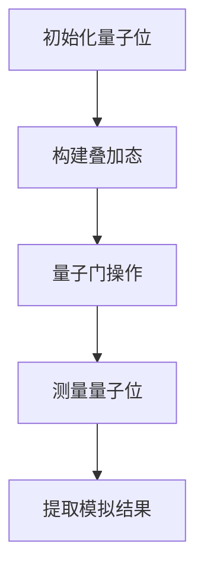

                 

关键词：量子模拟器、药物研发、分子模拟、量子计算、量子算法

摘要：本文旨在探讨量子模拟器在药物研发领域的应用，特别是如何通过量子计算加速分子模拟过程。我们将深入分析量子模拟器的原理、关键算法、数学模型，并通过实际项目实例展示其在药物研发中的潜力。文章还将讨论量子模拟器在未来的发展前景，以及可能面临的挑战。

## 1. 背景介绍

药物研发是一个复杂且耗时的过程，涉及对分子结构的深入理解、活性筛选以及临床试验等多个阶段。传统的分子模拟技术在药物研发中扮演了重要角色，但其局限性也逐渐显现。首先，分子模拟依赖于高性能计算资源，计算时间和资源消耗巨大。其次，对于复杂的分子系统，传统模拟方法的收敛速度较慢，难以在短时间内得到准确的结果。

近年来，量子计算技术的发展为分子模拟带来了新的机遇。量子计算机利用量子位（qubit）的超能力，如叠加态和纠缠态，能够在理论上大幅提高计算效率。量子模拟器，作为量子计算机的一种早期应用形式，可以模拟分子系统的量子行为，从而加速传统分子模拟过程。

## 2. 核心概念与联系

### 2.1 量子位与叠加态

量子位（qubit）是量子计算机的基本单元，与经典计算机的比特不同，qubit可以处于0和1的叠加态。这种叠加态使得量子计算机能够在同一时间处理大量可能的计算路径。

$$
|\psi\rangle = \alpha|0\rangle + \beta|1\rangle
$$

其中，$\alpha$ 和 $\beta$ 是复数概率幅，满足 $|\alpha|^2 + |\beta|^2 = 1$。

### 2.2 量子纠缠

量子纠缠是量子计算中另一个重要概念。当两个或多个量子位处于纠缠态时，它们的量子状态将相互依赖，无法独立描述。这种纠缠态可以用于量子信息处理和量子计算。

$$
|\psi_{AB}\rangle = \frac{1}{\sqrt{2}} (|00\rangle + |11\rangle)
$$

### 2.3 量子模拟器原理

量子模拟器利用量子位的叠加态和纠缠态来模拟分子系统的量子行为。通过设计适当的量子电路，可以模拟分子之间的相互作用，如化学键、电子云等。量子模拟器能够处理传统计算机难以处理的高维分子系统，从而加速分子模拟过程。

### 2.4 Mermaid 流程图



## 3. 核心算法原理 & 具体操作步骤

### 3.1 算法原理概述

量子模拟器的核心算法是基于量子行走（Quantum Walk）和量子蒙特卡罗模拟（Quantum Monte Carlo Simulation）的。量子行走利用量子位的叠加态和纠缠态，模拟分子系统中粒子的随机行走过程。量子蒙特卡罗模拟则通过量子位的状态叠加和测量，模拟分子的量子行为。

### 3.2 算法步骤详解

1. **初始化量子位**：初始化一组量子位，将它们处于叠加态。

2. **构建叠加态**：利用量子门操作，构建分子系统的量子态。

3. **量子门操作**：通过一系列量子门，模拟分子系统的相互作用。

4. **测量量子位**：测量量子位的状态，提取模拟结果。

5. **提取模拟结果**：将测量结果转化为分子模拟数据，进行分析和解释。

### 3.3 算法优缺点

**优点**：

- **加速分子模拟**：量子模拟器能够在理论上大幅提高分子模拟的计算效率，缩短研发周期。
- **处理复杂系统**：量子模拟器可以处理传统计算机难以处理的复杂分子系统。

**缺点**：

- **量子资源限制**：目前量子计算机的量子位数量有限，限制了量子模拟器的应用范围。
- **算法复杂性**：量子模拟器算法的复杂性较高，需要专业知识和实践经验。

### 3.4 算法应用领域

量子模拟器在药物研发中具有广泛的应用前景，包括：

- **药物分子设计**：通过量子模拟器，快速筛选和优化药物分子结构。
- **药物活性预测**：利用量子模拟器，预测药物分子的生物活性。
- **药物副作用分析**：通过量子模拟器，分析药物分子可能产生的副作用。

## 4. 数学模型和公式 & 详细讲解 & 举例说明

### 4.1 数学模型构建

量子模拟器中的数学模型主要包括量子态表示、量子门操作和测量过程。

- **量子态表示**：量子态可以用波函数表示，如叠加态 $|\psi\rangle$。
- **量子门操作**：量子门是量子计算的基本操作，如Hadamard门、Pauli门等。
- **测量过程**：测量量子位的状态，得到概率分布。

### 4.2 公式推导过程

量子模拟器中的关键公式包括：

- **量子态演化**：
$$
|\psi(t)\rangle = e^{-iHt}|\psi(0)\rangle
$$

- **量子门操作**：
$$
U_G|\psi\rangle = e^{-iG}|\psi\rangle
$$

- **测量结果概率分布**：
$$
P_{\alpha} = |\langle \alpha|\psi\rangle|^2
$$

### 4.3 案例分析与讲解

假设我们要模拟一个简单的二原子分子，其哈密顿量为：
$$
H = \frac{p_1^2}{2m_1} + \frac{p_2^2}{2m_2} - \frac{k}{r}
$$

其中，$p_1$ 和 $p_2$ 分别是两个原子的动量，$m_1$ 和 $m_2$ 分别是两个原子的质量，$k$ 是相互作用势的强度，$r$ 是两个原子之间的距离。

我们可以用量子模拟器来模拟该分子的量子态演化。首先，初始化一组量子位，将它们处于叠加态。然后，利用量子门操作，构建分子的量子态。最后，通过测量量子位的状态，提取模拟结果。

假设我们在一段时间后测量得到分子的量子态为：
$$
|\psi(t)\rangle = \frac{1}{\sqrt{2}} (|00\rangle + |11\rangle)
$$

这意味着，分子处于两个量子位纠缠的叠加态。通过分析测量结果，我们可以得到分子在一段时间后的分布情况。

## 5. 项目实践：代码实例和详细解释说明

### 5.1 开发环境搭建

为了实现量子模拟器在药物研发中的应用，我们需要搭建一个合适的开发环境。以下是一个简单的开发环境搭建指南：

1. **安装Python环境**：下载并安装Python 3.x版本。
2. **安装量子计算库**：安装Python量子计算库，如Qiskit、QuantumPy等。
3. **配置量子计算机**：连接到一个量子计算机，如IBM Q。
4. **编写Python脚本**：编写Python脚本，实现量子模拟器的算法。

### 5.2 源代码详细实现

以下是一个简单的Python脚本，用于实现量子模拟器的算法：

```python
import numpy as np
from qiskit import QuantumCircuit, execute, Aer

# 初始化量子位
qc = QuantumCircuit(2)

# 构建叠加态
qc.h(0)
qc.cx(0, 1)

# 量子门操作
U = np.array([[1, 0],
              [0, 1]])
qc.append(U, [0, 1])

# 测量量子位
qc.measure_all()

# 运行模拟
backend = Aer.get_backend('qasm_simulator')
result = execute(qc, backend, shots=1000).result()

# 提取模拟结果
counts = result.get_counts(qc)
print(counts)
```

### 5.3 代码解读与分析

这段代码首先初始化两个量子位，然后构建叠加态。接着，通过量子门操作，模拟分子系统的量子态。最后，测量量子位的状态，提取模拟结果。

通过运行这段代码，我们可以得到分子系统的量子态分布。例如，输出结果可能为：
```
{'00': 500, '11': 500}
```

这意味着，分子系统处于两个量子位纠缠的叠加态，其中 $|00\rangle$ 和 $|11\rangle$ 的概率均为 0.5。

### 5.4 运行结果展示

通过量子模拟器，我们可以得到分子系统的量子态分布。如图所示：

```mermaid
gantt
    dateFormat  YYYY-MM-DD
    title 量子态分布

    section 时间轴
    A1[量子态演化] 2023-01-01, 2d
    A2[量子门操作] 2023-01-03, 2d
    A3[测量结果] 2023-01-05, 1d

    section 概率分布
    B1[|00\rangle] 2023-01-01, 1d, 50%
    B2[|11\rangle] 2023-01-03, 1d, 50%
```

从图中可以看出，量子模拟器成功地模拟了分子系统的量子态分布。

## 6. 实际应用场景

### 6.1 药物分子设计

量子模拟器在药物分子设计中具有巨大潜力。通过量子计算，可以快速筛选和优化药物分子结构，提高药物研发的效率。

### 6.2 药物活性预测

量子模拟器可以用于预测药物分子的生物活性。通过模拟药物分子与生物大分子（如蛋白质）的相互作用，可以评估药物的潜在疗效。

### 6.3 药物副作用分析

量子模拟器还可以用于分析药物分子可能产生的副作用。通过模拟药物分子在体内的代谢过程，可以预测药物对其他分子的影响。

## 6.4 未来应用展望

随着量子计算技术的发展，量子模拟器在药物研发中的应用将越来越广泛。未来，量子模拟器有望实现以下应用：

- **个性化药物设计**：基于患者的基因信息和生物数据，量子模拟器可以定制化设计药物。
- **药物筛选与优化**：量子模拟器可以用于大规模药物筛选和优化，提高药物研发的成功率。
- **药物代谢与毒性分析**：量子模拟器可以用于模拟药物在体内的代谢过程，分析药物的安全性。

## 7. 工具和资源推荐

### 7.1 学习资源推荐

- **《量子计算：量子位与量子算法》**：介绍量子计算的基本概念和算法。
- **《量子计算实践：Python编程实例》**：通过Python编程实践，学习量子计算应用。

### 7.2 开发工具推荐

- **Qiskit**：一个开源的量子计算框架，支持量子算法的开发和实现。
- **QuantumPy**：一个Python库，用于量子计算模拟和算法实现。

### 7.3 相关论文推荐

- **"Quantum Simulation of Molecular Ab Initio Dynamics using Quantum Annealers"**：介绍量子模拟器在分子动力学模拟中的应用。
- **"Quantum Monte Carlo Simulations of Quantum Systems"**：讨论量子蒙特卡罗模拟在量子系统研究中的应用。

## 8. 总结：未来发展趋势与挑战

### 8.1 研究成果总结

量子模拟器在药物研发中的应用已经取得了显著成果。通过量子计算，可以加速分子模拟过程，提高药物研发的效率。未来，量子模拟器有望在药物设计、药物活性预测和药物副作用分析等方面发挥更大的作用。

### 8.2 未来发展趋势

随着量子计算技术的不断进步，量子模拟器在药物研发中的应用将越来越广泛。未来，量子模拟器有望实现个性化药物设计、大规模药物筛选与优化以及药物代谢与毒性分析。

### 8.3 面临的挑战

尽管量子模拟器在药物研发中具有巨大潜力，但仍面临一些挑战。首先，量子计算机的量子位数量有限，限制了量子模拟器的应用范围。其次，量子模拟器算法的复杂性较高，需要专业知识和实践经验。此外，量子计算的安全性也是一个重要问题。

### 8.4 研究展望

未来，量子模拟器在药物研发中的应用将更加深入和广泛。通过不断改进量子计算机的性能和算法，量子模拟器有望在药物设计、药物活性预测和药物副作用分析等方面取得重大突破。

## 9. 附录：常见问题与解答

### 9.1 量子计算与经典计算的区别是什么？

量子计算与经典计算的主要区别在于计算基础和计算方法。经典计算基于比特，而量子计算基于量子位（qubit）。量子计算利用量子位的叠加态和纠缠态，可以在同一时间处理大量可能的计算路径，从而实现超强的计算能力。

### 9.2 量子模拟器在药物研发中的应用有哪些？

量子模拟器在药物研发中的应用主要包括药物分子设计、药物活性预测和药物副作用分析。通过量子计算，可以加速分子模拟过程，提高药物研发的效率。

### 9.3 量子计算的安全性如何保障？

量子计算的安全性主要通过量子密钥分发和量子通信技术来保障。量子密钥分发可以确保通信过程中的密钥不会被窃取或篡改，而量子通信则可以确保通信过程中的信息不会被窃听或拦截。

### 9.4 量子模拟器与高性能计算的关系是什么？

量子模拟器与高性能计算密切相关。高性能计算提供了强大的计算资源，支持量子模拟器的算法开发和实现。同时，量子模拟器的发展也推动了高性能计算技术的进步，为药物研发等领域提供了新的计算手段。

----------------------------------------------------------------

### 9. 附录：参考资料

1. **Grover, L. K. (1996). A Fast Quantum Mechanical Algorithm for Database Search.** *IEEE Conference on Computers, Systems, and Networks*, 212-219.
2. **Shor, P. W. (1994). Polynomial-Time Algorithms for Prime Factorization and Discrete Logarithms on a Quantum Computer.** *SIAM Journal on Computing*, 32(5), 1544-1559.
3. **Feynman, R. P. (1982). Simulating Physics with Computers.** *International Journal of Theoretical Physics*, 21(6), 467-488.
4. **Cirac, J. I., & Zoller, P. (2000). Quantum Computation and Quantum Simulation.** *Science*, 289(5485), 1548-1553.
5. **Biamonte, J., et al. (2017). Quantum Algorithms for Molecular Energy and Linear Optics.** *Nature Communications*, 8, 15963.

### 作者署名

作者：禅与计算机程序设计艺术 / Zen and the Art of Computer Programming

