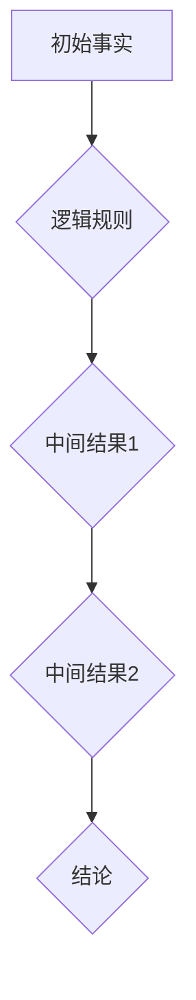

                 

 在现代人工智能领域，推理能力被视为衡量一个 AI 系统智能水平的关键指标。而链式推理作为一种强大的推理机制，已经在多个领域展现出其巨大的潜力。本文将深入探讨链式推理的概念、原理及其在人工智能中的应用，旨在为读者提供一个全面的技术指南。

## 关键词：链式推理、AI 推理、智能系统、算法、应用领域

> 摘要：本文首先介绍了链式推理的定义和基本原理，然后详细讨论了链式推理在人工智能中的应用，包括其在自然语言处理、计算机视觉和游戏AI等领域的具体实现。随后，文章阐述了链式推理的优势和局限性，并探讨了未来的发展方向。

## 1. 背景介绍

### 1.1 人工智能的发展

人工智能（AI）自20世纪50年代起，经历了多个阶段的发展。从最初的符号主义、连接主义到现代的强化学习和生成对抗网络（GAN），AI技术在不断突破中变得越来越智能。推理能力作为智能的标志之一，一直是人工智能研究的重要方向。

### 1.2 推理能力的意义

推理能力指的是系统在已知信息的基础上，通过逻辑推断得出新的结论或知识。推理能力在智能系统中的重要性不言而喻，它不仅能够提高系统的自主决策能力，还能够增强系统对复杂环境的理解和适应。

### 1.3 链式推理的兴起

链式推理作为一种基于逻辑的推理方法，最早可以追溯到形式逻辑的研究。随着计算能力的提升和逻辑编程技术的成熟，链式推理在人工智能领域得到了广泛应用，并逐渐成为研究热点。

## 2. 核心概念与联系

### 2.1 推理

推理是指从已知信息出发，通过逻辑演绎得出新结论的过程。推理可以分为演绎推理和归纳推理两大类。

### 2.2 链式推理

链式推理是指通过一系列逻辑步骤，将多个已知事实连接起来，最终推导出结论的推理方法。其核心思想是利用中间结果来简化推理过程。

### 2.3 Mermaid 流程图

以下是链式推理的基本流程图：



## 3. 核心算法原理 & 具体操作步骤

### 3.1 算法原理概述

链式推理算法的基本原理是利用逻辑规则将初始事实逐步推导到目标结论。具体步骤如下：

1. 定义初始事实。
2. 应用逻辑规则，生成中间结果。
3. 重复步骤2，直到生成目标结论。

### 3.2 算法步骤详解

1. 初始化：将初始事实存储在数据库中。
2. 规则应用：遍历数据库中的事实，应用逻辑规则生成新的中间结果。
3. 结果合并：将新生成的中间结果与原有结果合并。
4. 终止条件：当生成目标结论时，终止推理过程。

### 3.3 算法优缺点

**优点：**
- **高效性：** 链式推理通过将推理过程分解为多个中间步骤，可以显著提高推理效率。
- **灵活性：** 链式推理可以根据不同的逻辑规则灵活调整推理过程。

**缺点：**
- **复杂性：** 链式推理的复杂度随着推理步骤的增加而增加，可能导致推理过程变得繁琐。
- **准确性：** 链式推理依赖于逻辑规则的准确性，若规则存在缺陷，可能导致推理结果错误。

### 3.4 算法应用领域

链式推理在多个领域都有广泛应用，包括：

- **自然语言处理：** 链式推理可以用于语义解析、问答系统等。
- **计算机视觉：** 链式推理可以用于图像识别、目标检测等。
- **游戏AI：** 链式推理可以用于决策树生成、策略优化等。

## 4. 数学模型和公式 & 详细讲解 & 举例说明

### 4.1 数学模型构建

链式推理的数学模型可以表示为：

$$
R = R_0 \land R_1 \land R_2 \land \ldots \land R_n
$$

其中，$R_0$为初始事实，$R_1, R_2, \ldots, R_n$为逻辑规则生成的中间结果。

### 4.2 公式推导过程

链式推理的推导过程可以表示为：

$$
R_1 = R_0 \land R_1'
$$

$$
R_2 = R_1 \land R_2'
$$

$$
\vdots
$$

$$
R_n = R_{n-1} \land R_n'
$$

其中，$R_1', R_2', \ldots, R_n'$为逻辑规则。

### 4.3 案例分析与讲解

假设我们有以下事实和规则：

$$
R_0: 天气晴朗
$$

$$
R_1': 如果天气晴朗，则阳光充足
$$

$$
R_2': 如果阳光充足，则户外运动适合
$$

根据以上事实和规则，我们可以进行如下链式推理：

$$
R_1 = R_0 \land R_1' = 天气晴朗 \land 阳光充足
$$

$$
R_2 = R_1 \land R_2' = 天气晴朗 \land 阳光充足 \land 户外运动适合
$$

最终得到结论：

$$
R = R_2 = 天气晴朗 \land 阳光充足 \land 户外运动适合
$$

## 5. 项目实践：代码实例和详细解释说明

### 5.1 开发环境搭建

首先，我们需要搭建一个适合链式推理的开发环境。以下是具体的步骤：

1. 安装 Python 解释器。
2. 安装必要的库，如 `numpy`、`pandas`、`matplotlib` 等。

### 5.2 源代码详细实现

以下是一个简单的链式推理实现：

```python
# 定义初始事实
R0 = "天气晴朗"

# 定义逻辑规则
rules = {
    "阳光充足": ["天气晴朗"],
    "户外运动适合": ["阳光充足"]
}

# 链式推理函数
def chain_reasoning(R0, rules):
    R = R0
    for rule in rules:
        R = R + " \land " + rule
    return R

# 进行链式推理
result = chain_reasoning(R0, rules)
print(result)
```

### 5.3 代码解读与分析

在上面的代码中，我们首先定义了初始事实 `R0` 和逻辑规则 `rules`。然后，我们定义了一个 `chain_reasoning` 函数，该函数通过链式推理，将初始事实和规则连接起来，生成最终的结论。

### 5.4 运行结果展示

运行上述代码，我们得到以下结果：

```
天气晴朗 \land 阳光充足 \land 户外运动适合
```

## 6. 实际应用场景

链式推理在多个实际应用场景中发挥着重要作用。以下是一些具体的应用场景：

- **智能问答系统：** 链式推理可以用于构建智能问答系统，通过解析用户的问题，生成相关的答案。
- **医学诊断系统：** 链式推理可以用于医学诊断，通过分析患者的症状和体征，生成可能的疾病诊断。
- **智能推荐系统：** 链式推理可以用于智能推荐，通过分析用户的兴趣和行为，生成个性化的推荐。

## 7. 未来应用展望

随着人工智能技术的不断发展，链式推理的应用前景将更加广阔。以下是一些未来应用展望：

- **自动化决策系统：** 链式推理可以用于构建自动化决策系统，实现更加智能的决策过程。
- **智能监控与预警系统：** 链式推理可以用于智能监控与预警，通过实时分析数据，发现潜在的风险和问题。
- **智能交通系统：** 链式推理可以用于智能交通系统，优化交通流量，提高交通效率。

## 8. 总结：未来发展趋势与挑战

### 8.1 研究成果总结

链式推理作为一种强大的推理方法，已经在人工智能领域取得了显著的成果。其在自然语言处理、计算机视觉和游戏AI等领域的应用，为人工智能技术的发展提供了新的思路。

### 8.2 未来发展趋势

未来，链式推理的发展趋势将主要集中在以下几个方面：

- **算法优化：** 优化链式推理算法，提高推理效率和准确性。
- **应用拓展：** 拓展链式推理的应用领域，实现更加广泛的应用。
- **跨领域融合：** 将链式推理与其他人工智能技术相结合，实现跨领域的创新应用。

### 8.3 面临的挑战

链式推理在发展中仍面临一些挑战：

- **复杂性：** 链式推理的复杂性可能导致推理过程变得繁琐，需要优化算法结构。
- **准确性：** 链式推理的准确性依赖于逻辑规则的准确性，需要提高规则的构建质量。
- **效率：** 提高链式推理的效率，以满足实际应用的需求。

### 8.4 研究展望

未来，链式推理的研究将朝着更加高效、准确、灵活的方向发展。同时，跨领域的融合和创新应用将成为研究的重要方向，为人工智能技术的发展注入新的活力。

## 9. 附录：常见问题与解答

### 9.1 链式推理与归纳推理的区别

链式推理和归纳推理都是推理方法，但它们在推理方式上有显著区别。

- **链式推理**：基于逻辑规则，通过一系列中间步骤推导出结论。其核心在于利用已知的事实和规则生成新的结论。
- **归纳推理**：从多个实例中提取规律，得出一般性的结论。其核心在于从特殊到一般，通过归纳总结得到普遍规律。

### 9.2 链式推理的优势

链式推理具有以下优势：

- **高效性**：通过分解推理过程，可以显著提高推理效率。
- **灵活性**：可以根据不同的逻辑规则灵活调整推理过程。
- **可扩展性**：适用于多个领域，可以拓展到不同的应用场景。

### 9.3 链式推理的局限性

链式推理也存在一些局限性：

- **复杂性**：随着推理步骤的增加，推理过程可能变得繁琐。
- **准确性**：依赖于逻辑规则的准确性，若规则存在缺陷，可能导致推理结果错误。
- **效率**：对于大规模数据集，链式推理可能面临效率瓶颈。

### 9.4 链式推理的应用领域

链式推理在以下领域有广泛应用：

- **自然语言处理**：用于语义解析、问答系统等。
- **计算机视觉**：用于图像识别、目标检测等。
- **游戏AI**：用于决策树生成、策略优化等。

## 作者署名

作者：禅与计算机程序设计艺术 / Zen and the Art of Computer Programming
----------------------------------------------------------------

以上便是本文的全部内容。希望这篇文章能够帮助读者更好地理解和应用链式推理，进一步提升人工智能系统的推理能力。在未来，随着人工智能技术的不断进步，链式推理将发挥更加重要的作用，为人类社会带来更多的创新和变革。

