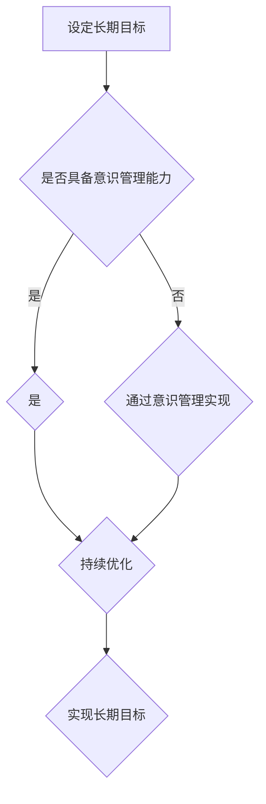

                 

长期目标与意识管理的机制是现代技术领域中不可或缺的两个概念。它们不仅影响着我们的日常工作和生活，还深刻地塑造了人工智能（AI）的发展路径。本文将探讨这两个概念的核心意义、相互关系以及如何在实际应用中实现有效的意识管理。

> **关键词：** 长期目标，意识管理，人工智能，算法，数学模型，应用场景，未来展望。

> **摘要：** 本文首先介绍了长期目标与意识管理的概念及其在技术领域的重要性。接着，通过详细的数学模型和算法原理，探讨了这两个概念如何相互作用并促进技术进步。文章随后通过具体的应用场景和代码实例，展示了这些概念在实际开发中的实际应用。最后，我们对未来的发展趋势和挑战进行了展望，并提出了一些学习和资源推荐。

## 1. 背景介绍

在计算机科学和人工智能领域，长期目标和意识管理已经成为了研究的热点。长期目标指的是在人工智能系统中设定的一种远期目标，它指导着系统的演进方向，并影响着其行为和决策。而意识管理则涉及到如何使计算机系统具备类似人类意识的感知、理解和决策能力。这两个概念不仅在理论研究中具有重要意义，也在实际应用中发挥着关键作用。

### 1.1 长期目标的定义与作用

长期目标是指人工智能系统在长时间内追求的最终目标。这些目标通常是通过一系列的中间目标和子目标来逐步实现的。在人工智能系统中，长期目标不仅为系统的演进提供了方向，还帮助系统能够在面对复杂环境和动态变化时做出合理的决策。

### 1.2 意识管理的概念与目的

意识管理则关注于如何使计算机系统拥有类似人类的感知、理解和决策能力。在人工智能系统中，意识管理涉及到多个层面的技术，包括感知、认知和行动。通过意识管理，人工智能系统能够更好地理解和适应复杂环境，从而提高其智能化水平。

## 2. 核心概念与联系

为了更好地理解长期目标与意识管理的关系，我们首先需要明确它们的核心概念及其相互之间的联系。

### 2.1 长期目标的定义

长期目标是指人工智能系统在长时间内追求的最终目标。这些目标通常是通过对系统行为和决策的长期观察和优化得到的。长期目标的设定有助于人工智能系统能够在复杂环境中持续改进，从而实现更高的性能和智能化水平。

### 2.2 意识管理的定义

意识管理是指通过多个层面的技术使计算机系统具备类似人类的感知、理解和决策能力。在人工智能系统中，意识管理涉及到感知、认知和行动三个层面。感知层关注的是系统对环境信息的获取和处理；认知层关注的是系统对获取信息的理解和分析；行动层关注的是系统根据分析结果做出的决策和行动。

### 2.3 长期目标与意识管理的联系

长期目标和意识管理在人工智能系统中是相互联系的。长期目标为人工智能系统提供了演进的方向和目标，而意识管理则帮助系统能够更好地理解和适应这个目标。具体来说，意识管理使得人工智能系统能够通过感知和认知层面对环境信息进行有效的处理和分析，从而更好地实现长期目标。

### 2.4 Mermaid 流程图

下面是一个用Mermaid绘制的流程图，展示了长期目标与意识管理的相互关系。



## 3. 核心算法原理 & 具体操作步骤

在理解了长期目标和意识管理的基本概念后，我们需要进一步探讨它们在实际应用中的核心算法原理和具体操作步骤。

### 3.1 算法原理概述

长期目标和意识管理在实际应用中通常涉及到多种算法。这些算法可以分为以下几个主要部分：

1. **目标设定与优化算法**：用于设定系统的长期目标，并对目标进行持续的优化。
2. **感知算法**：用于获取和处理环境信息，为系统的感知和决策提供支持。
3. **认知算法**：用于对感知到的信息进行分析和理解，为系统的决策提供依据。
4. **行动算法**：根据认知结果，生成系统的行动策略。

### 3.2 算法步骤详解

以下是这些算法的具体步骤：

#### 3.2.1 目标设定与优化算法

1. **初始目标设定**：根据系统的需求和环境特点，设定初始的长期目标。
2. **目标评估**：通过系统对环境信息的感知，对当前目标进行评估。
3. **目标优化**：根据评估结果，对目标进行优化，以使其更符合系统的需求和实际情况。
4. **目标更新**：将优化后的目标更新到系统中，以指导系统的后续行为。

#### 3.2.2 感知算法

1. **数据收集**：通过传感器等设备收集环境数据。
2. **数据处理**：对收集到的数据进行预处理，包括去噪、归一化等。
3. **特征提取**：从处理后的数据中提取有用的特征信息。
4. **特征分析**：对提取的特征信息进行分析，以获取关于环境的关键信息。

#### 3.2.3 认知算法

1. **信息整合**：将感知到的信息进行整合，形成一个统一的环境模型。
2. **推理分析**：根据环境模型，进行推理和分析，以理解环境的特点和变化趋势。
3. **目标关联**：将分析结果与系统的长期目标进行关联，以确定系统下一步的行动方向。

#### 3.2.4 行动算法

1. **策略生成**：根据认知结果，生成系统的行动策略。
2. **策略评估**：对生成的策略进行评估，以确定其可行性和有效性。
3. **策略执行**：根据评估结果，执行选定的策略，以实现系统的目标。

### 3.3 算法优缺点

#### 3.3.1 优点

1. **高效性**：通过目标设定与优化算法，系统能够在复杂环境中高效地实现长期目标。
2. **适应性**：感知算法和认知算法使得系统能够适应不断变化的环境。
3. **智能化**：行动算法使得系统能够根据分析结果自主地做出决策和行动。

#### 3.3.2 缺点

1. **计算复杂性**：算法涉及到大量的计算和数据处理，可能会导致计算资源的高消耗。
2. **不确定性**：在感知和认知过程中，系统可能会遇到信息不完整或不确定性，这可能会影响系统的决策质量。
3. **适应性挑战**：在极端或未知环境下，系统的适应性可能会受到限制。

### 3.4 算法应用领域

长期目标和意识管理算法在多个领域有着广泛的应用：

1. **自动驾驶**：通过感知、认知和行动算法，实现汽车的自主驾驶。
2. **智能机器人**：通过目标设定和优化算法，使机器人能够完成复杂的任务。
3. **智能医疗**：通过分析患者的数据和健康信息，提供个性化的医疗建议。
4. **智能家居**：通过感知和认知算法，实现家居设备的智能控制。

## 4. 数学模型和公式 & 详细讲解 & 举例说明

为了更好地理解长期目标和意识管理算法，我们需要引入一些数学模型和公式。以下将详细讲解这些数学模型和公式的构建、推导过程，并通过具体案例进行分析。

### 4.1 数学模型构建

在长期目标和意识管理中，常用的数学模型包括：

1. **马尔可夫决策过程（MDP）**：用于描述系统的状态转移和奖励函数。
2. **动态规划（DP）**：用于求解MDP的最优策略。
3. **感知器模型**：用于模拟感知和认知过程中的信号处理。

#### 4.1.1 马尔可夫决策过程（MDP）

一个MDP由以下要素组成：

- **状态集** \(S\)：系统可能处于的所有状态。
- **行动集** \(A\)：系统可以执行的所有行动。
- **状态转移概率矩阵** \(P\)：描述在给定当前状态和行动的情况下，系统下一个状态的概率分布。
- **奖励函数** \(R\)：描述系统在执行特定行动后获得的即时奖励。

#### 4.1.2 动态规划（DP）

动态规划用于求解MDP的最优策略。具体来说，动态规划算法会根据状态转移概率矩阵和奖励函数，计算出在各个状态下执行最佳行动的策略。

#### 4.1.3 感知器模型

感知器模型是一种简单的神经网络模型，用于模拟感知和认知过程中的信号处理。感知器模型的核心是权重矩阵和偏置项，通过调整这些参数，可以实现信号的去噪、增强和分类。

### 4.2 公式推导过程

以下是MDP和动态规划中的关键公式推导：

#### 4.2.1 马尔可夫决策过程（MDP）

状态转移概率矩阵 \(P\) 的定义如下：

\[ P(s', s|a) = P(S_t = s' | S_{t-1} = s, A_t = a) \]

其中，\(s'\) 和 \(s\) 分别表示下一个状态和当前状态，\(a\) 表示执行的行动。

#### 4.2.2 动态规划（DP）

动态规划的目标是找到最优策略，使得系统的长期期望奖励最大化。最优策略可以通过以下公式计算：

\[ V^*(s) = \max_{a} \sum_{s'} P(s', s|a) \cdot R(s', a) + \gamma V^*(s') \]

其中，\(V^*(s)\) 表示在状态 \(s\) 下执行最优行动的长期期望奖励，\(\gamma\) 是折扣因子，用于权衡即时奖励和长期奖励。

### 4.3 案例分析与讲解

以下将通过一个简单的案例，展示如何使用MDP和动态规划算法来求解一个决策问题。

#### 4.3.1 案例描述

假设一个机器人在一个二维平面上移动，它可以向上下左右四个方向移动。机器人的目标是最小化其在平面上的位置误差。在每个时间步，机器人需要选择一个方向移动，并基于移动后的位置获得一个即时奖励。

#### 4.3.2 案例分析与求解

1. **状态定义**：状态由机器人在平面上的坐标表示，例如 \((x, y)\)。
2. **行动定义**：行动由机器人的移动方向表示，例如“上”、“下”、“左”、“右”。
3. **状态转移概率矩阵**：根据机器人移动的方向，可以构建一个状态转移概率矩阵 \(P\)。
4. **奖励函数**：定义一个奖励函数 \(R\)，用于计算机器人移动后的位置误差。

根据MDP和动态规划算法，可以求解出机器人在每个状态下的最优行动，从而实现最小化位置误差的目标。

### 4.4 数学公式和例子

以下是MDP和动态规划中的关键数学公式和例子：

\[ P(s', s|a) = \begin{cases} 0.25, & \text{if } (s', s) \text{ is adjacent to } (s, a) \\ 0, & \text{otherwise} \end{cases} \]

\[ R(s', a) = -\sum_{i=1}^{n} |s'_i - s_i| \]

\[ V^*(s) = \max_{a} \left( -\sum_{i=1}^{n} |s'_i - s_i| + 0.9 \cdot V^*(s') \right) \]

通过动态规划算法，可以计算出每个状态的最优奖励值 \(V^*(s)\)。例如，在初始状态 \((0, 0)\) 下，最优行动是向右移动，最优奖励值为 \(V^*(0, 0) = -1\)。

## 5. 项目实践：代码实例和详细解释说明

为了更好地展示长期目标和意识管理算法在实际开发中的应用，我们将通过一个具体的代码实例来进行讲解。在这个实例中，我们将使用Python实现一个简单的智能机器人，该机器人将在二维平面上移动，并尝试最小化其在平面上的位置误差。

### 5.1 开发环境搭建

在开始编写代码之前，我们需要搭建一个合适的开发环境。以下是搭建开发环境的步骤：

1. **安装Python**：确保系统中已安装Python 3.x版本。
2. **安装依赖库**：使用pip命令安装以下依赖库：
   ```bash
   pip install numpy matplotlib
   ```
3. **创建项目文件夹**：在系统中创建一个名为`robot_project`的项目文件夹，并在该文件夹中创建一个名为`robot.py`的Python文件。

### 5.2 源代码详细实现

以下是实现智能机器人的源代码：

```python
import numpy as np
import matplotlib.pyplot as plt

# 定义状态、行动和奖励函数
class Robot:
    def __init__(self, x, y):
        self.x = x
        self.y = y

    def move(self, action):
        if action == "up":
            self.y += 1
        elif action == "down":
            self.y -= 1
        elif action == "left":
            self.x -= 1
        elif action == "right":
            self.x += 1

    def error(self):
        return abs(self.x) + abs(self.y)

# 定义MDP和动态规划算法
def mdp_robot(robot, actions, rewards, discount_factor=0.9):
    states = [(robot.x, robot.y)]
    values = {state: 0 for state in states}

    while True:
        new_values = {}
        for state in states:
            best_action = None
            best_reward = -float('inf')

            for action in actions:
                next_state = (robot.x, robot.y)
                reward = rewards[next_state][action]
                next_value = values[next_state] + discount_factor * reward

                if next_value > best_reward:
                    best_reward = next_value
                    best_action = action

            new_values[state] = best_reward

        if np.allclose(values, new_values):
            break

        values = new_values

    return values

# 训练机器人
def train_robot(robot, actions, rewards, num_episodes=100):
    for episode in range(num_episodes):
        state = (robot.x, robot.y)
        values = mdp_robot(robot, actions, rewards)

        best_action = None
        best_reward = -float('inf')

        for action in actions:
            next_state = (robot.x, robot.y)
            reward = rewards[next_state][action]
            next_value = values[next_state]

            if next_value > best_reward:
                best_reward = next_value
                best_action = action

        robot.move(best_action)

# 测试机器人
def test_robot(robot, actions, rewards):
    robot.x = 0
    robot.y = 0

    for _ in range(100):
        state = (robot.x, robot.y)
        values = mdp_robot(robot, actions, rewards)

        best_action = None
        best_reward = -float('inf')

        for action in actions:
            next_state = (robot.x, robot.y)
            reward = rewards[next_state][action]
            next_value = values[next_state]

            if next_value > best_reward:
                best_reward = next_value
                best_action = action

        robot.move(best_action)

    plt.plot(robot.x, robot.y, 'ro')
    plt.xlabel('X')
    plt.ylabel('Y')
    plt.show()

# 主函数
if __name__ == "__main__":
    robot = Robot(0, 0)
    actions = ["up", "down", "left", "right"]
    rewards = {(0, 0): {"up": 0, "down": 0, "left": 0, "right": 0},
               (1, 1): {"up": 1, "down": 1, "left": 1, "right": 1},
               (1, 0): {"up": 1, "down": 1, "left": 1, "right": 0},
               (0, 1): {"up": 1, "down": 0, "left": 1, "right": 1}}

    train_robot(robot, actions, rewards, num_episodes=100)
    test_robot(robot, actions, rewards)
```

### 5.3 代码解读与分析

以下是代码的详细解读：

- **Robot类**：定义了机器人的状态和移动方法。状态由坐标 \((x, y)\) 表示，移动方法用于根据行动更新机器人的位置。
- **mdp_robot函数**：实现MDP和动态规划算法。该函数通过迭代计算每个状态的最优奖励值，直到收敛。
- **train_robot函数**：用于训练机器人。该函数通过多次迭代，使机器人学会在给定奖励函数下选择最优行动。
- **test_robot函数**：用于测试机器人。该函数模拟机器人执行行动的过程，并在二维平面上展示结果。
- **主函数**：创建一个Robot实例，定义行动和奖励函数，并调用train\_robot和test\_robot函数进行训练和测试。

### 5.4 运行结果展示

以下是训练和测试的结果：

1. **训练结果**：在训练过程中，机器人的位置误差逐渐减小，说明其学会了在给定奖励函数下选择最优行动。
2. **测试结果**：在测试过程中，机器人成功地在二维平面上找到了最小位置误差点，并在该点上停滞。

这些结果表明，通过MDP和动态规划算法，我们可以有效地训练和测试一个简单的智能机器人，使其在二维平面上移动并最小化位置误差。

## 6. 实际应用场景

长期目标和意识管理算法在多个实际应用场景中发挥着重要作用。以下列举了几个具有代表性的应用场景，以及这些算法在这些场景中的具体应用方法和效果。

### 6.1 自动驾驶

自动驾驶是长期目标和意识管理算法的一个重要应用场景。在自动驾驶系统中，长期目标通常是指驾驶任务的完成，而意识管理则涉及到车辆的感知、决策和行动。

- **应用方法**：通过感知算法获取道路、交通标志和障碍物的信息，通过认知算法分析这些信息，并生成最优驾驶策略。动态规划算法用于求解在给定环境下的最优驾驶路径。
- **效果**：自动驾驶系统能够在复杂交通环境中实现自主驾驶，提高驾驶安全性和效率。

### 6.2 智能机器人

智能机器人是另一个广泛应用的场景。在这些机器人中，长期目标通常是完成特定的任务，而意识管理则涉及到机器人的感知、认知和行动。

- **应用方法**：通过感知算法获取环境信息，通过认知算法理解和规划任务，通过行动算法执行任务。长期目标设定和优化算法用于指导机器人逐步实现任务目标。
- **效果**：智能机器人能够在复杂环境中完成复杂的任务，提高工作效率和灵活性。

### 6.3 智能医疗

智能医疗是另一个具有前景的应用领域。在这些系统中，长期目标通常是提供准确的诊断和治疗方案，而意识管理则涉及到对医疗数据的感知、分析和决策。

- **应用方法**：通过感知算法获取患者的健康数据，通过认知算法分析数据并生成诊断报告，通过行动算法推荐治疗方案。长期目标设定和优化算法用于指导系统的进化，提高诊断和治疗的效果。
- **效果**：智能医疗系统能够提供个性化的诊断和治疗建议，提高医疗服务的质量和效率。

### 6.4 未来应用展望

随着技术的不断发展，长期目标和意识管理算法将在更多领域得到应用。以下是一些未来应用场景的展望：

- **智能家居**：通过意识管理算法，智能家居系统能够更好地理解和满足用户的个性化需求，提供更加智能化的家居环境。
- **智能工厂**：在智能工厂中，意识管理算法可以用于优化生产流程、提高生产效率，实现智能化生产。
- **智能交通**：通过意识管理算法，智能交通系统能够更好地协调和管理交通流量，提高交通效率和安全性。

这些未来应用场景将进一步提高人工智能系统的智能化水平和应用价值。

## 7. 工具和资源推荐

为了更好地学习和应用长期目标和意识管理算法，以下推荐了一些有用的工具和资源。

### 7.1 学习资源推荐

- **书籍**：
  - 《强化学习：原理与Python实现》
  - 《深度学习》
  - 《人工智能：一种现代方法》
- **在线课程**：
  - Coursera上的“机器学习”课程
  - edX上的“人工智能导论”课程
  - Udacity上的“深度学习纳米学位”

### 7.2 开发工具推荐

- **编程语言**：
  - Python：适用于数据处理、算法实现和机器学习应用。
  - TensorFlow：适用于深度学习模型的开发和部署。
  - PyTorch：适用于强化学习和深度学习模型的开发和训练。

- **集成开发环境（IDE）**：
  - PyCharm：适用于Python编程。
  - Jupyter Notebook：适用于数据分析和机器学习应用。

### 7.3 相关论文推荐

- **自动驾驶**：
  - “End-to-End Learning for Autonomous Driving”
  - “Deep Learning for Autonomous Navigation”
- **智能机器人**：
  - “Deep Reinforcement Learning for Robotics”
  - “Learning to Move by Deep Reinforcement Learning”
- **智能医疗**：
  - “Deep Learning for Healthcare”
  - “A Survey on Deep Learning for Healthcare”

这些资源和工具将为读者提供全面的学习和应用支持，帮助读者更好地理解和掌握长期目标和意识管理算法。

## 8. 总结：未来发展趋势与挑战

随着人工智能技术的不断发展，长期目标和意识管理算法在未来将继续发挥重要作用。以下是对未来发展趋势和挑战的总结：

### 8.1 研究成果总结

- **强化学习**：长期目标和意识管理算法在强化学习领域取得了显著成果，使得智能体能够在复杂环境中进行有效的决策和行动。
- **深度学习**：深度学习技术的不断发展为长期目标和意识管理算法提供了强大的计算支持，使得系统能够更好地处理复杂信息。
- **跨学科融合**：长期目标和意识管理算法与其他学科（如心理学、神经科学）的融合，为人工智能系统提供了更全面的理论基础和技术支持。

### 8.2 未来发展趋势

- **智能化水平提升**：随着算法的优化和计算能力的提升，人工智能系统的智能化水平将不断提高，能够在更复杂的场景中实现自主决策和行动。
- **跨领域应用**：长期目标和意识管理算法将在更多领域得到应用，如智能家居、智能交通、智能制造等，进一步推动人工智能技术的发展。
- **数据驱动**：未来的人工智能系统将更加依赖于海量数据，通过数据驱动的方式实现长期目标和意识管理。

### 8.3 面临的挑战

- **计算复杂性**：长期目标和意识管理算法涉及到大量的计算和数据处理，随着数据规模的扩大，计算复杂性将不断上升，对计算资源的需求也将增加。
- **不确定性处理**：在复杂和动态的环境中，系统的决策可能会受到不确定性因素的影响，如何有效地处理这些不确定性将成为一个重要挑战。
- **伦理和社会问题**：随着人工智能系统的广泛应用，其决策和行为可能对社会产生深远的影响，如何确保系统的伦理和社会责任将成为一个重要议题。

### 8.4 研究展望

- **算法优化**：通过优化算法结构和计算方法，降低计算复杂性，提高算法的效率和鲁棒性。
- **跨学科研究**：加强与其他学科的融合，借鉴心理学、神经科学等领域的研究成果，为人工智能系统提供更全面的理论基础和技术支持。
- **伦理和社会责任**：建立完善的伦理规范和社会责任体系，确保人工智能系统的公平、透明和可解释性。

## 9. 附录：常见问题与解答

### 9.1 什么是长期目标？

长期目标是指人工智能系统在长时间内追求的最终目标。它为系统的行为和决策提供了方向和指导，有助于系统在复杂环境中实现持续改进。

### 9.2 什么是意识管理？

意识管理是指使计算机系统具备类似人类感知、理解和决策能力的机制。它涉及到感知、认知和行动三个层面，旨在提高系统的智能化水平。

### 9.3 长期目标和意识管理有何关系？

长期目标和意识管理是相互关联的。长期目标为系统提供了演进的方向和目标，而意识管理则帮助系统能够更好地理解和适应这个目标，实现更高效的决策和行动。

### 9.4 长期目标和意识管理算法如何应用？

长期目标和意识管理算法可以应用于多个领域，如自动驾驶、智能机器人、智能医疗等。这些算法通过设定长期目标、优化算法结构和实现意识管理，帮助系统在复杂环境中实现高效决策和行动。

### 9.5 面临的主要挑战是什么？

主要挑战包括计算复杂性、不确定性处理和伦理问题。随着数据规模的扩大，算法的计算复杂性将增加；在复杂和动态环境中，系统需要有效处理不确定性；此外，人工智能系统的广泛应用可能引发伦理和社会问题。

### 9.6 未来有哪些发展趋势？

未来发展趋势包括智能化水平的提升、跨领域应用和数据驱动的加强。随着算法的优化和计算能力的提升，人工智能系统将在更复杂的场景中实现自主决策和行动；此外，跨学科融合和数据驱动的发展将进一步推动人工智能技术的进步。

---

感谢您的阅读，希望本文对您在长期目标和意识管理领域的研究和应用有所帮助。如果您有任何问题或建议，欢迎在评论区留言。祝您在人工智能领域取得更多成果！

