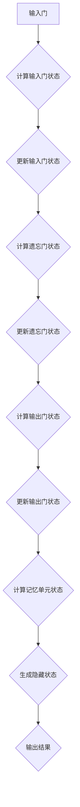

                 

在深度学习领域，长短时记忆网络（Long Short-Term Memory，简称LSTM）是处理序列数据的一种非常有效的方法。LSTM克服了传统循环神经网络（RNN）在处理长序列时容易出现的梯度消失或爆炸问题，使得其在语音识别、机器翻译、文本生成等许多序列相关任务中得到了广泛应用。本文将详细介绍LSTM的原理、实现步骤，并通过一个简单的代码实例来说明如何使用LSTM进行时间序列预测。

## 关键词

- 长短时记忆网络（LSTM）
- 循环神经网络（RNN）
- 深度学习
- 时间序列预测
- 神经网络

## 摘要

本文首先回顾了传统循环神经网络（RNN）的不足，并介绍了LSTM的提出背景和核心思想。随后，我们详细讲解了LSTM的内部结构，包括输入门、遗忘门和输出门的工作原理。接着，我们通过一个具体的时间序列预测任务，展示了如何使用LSTM进行建模和训练。最后，我们探讨了LSTM在不同应用领域的应用实例，并对其未来发展趋势和挑战进行了展望。

## 1. 背景介绍

在深度学习之前，传统的序列数据处理方法主要是基于统计模型，如隐马尔可夫模型（HMM）和朴素序列模型等。这些方法虽然在一定程度上能够处理序列数据，但很难捕捉序列中的长期依赖关系。

2000年，Hochreiter和Schmidhuber提出了循环神经网络（RNN），试图通过递归结构来处理序列数据。然而，RNN在处理长序列时存在梯度消失和梯度爆炸问题，这使得其在实际应用中效果不佳。为了解决这个问题，Hochreiter和Schmidhuber在1997年提出了长短时记忆网络（LSTM）。

LSTM通过引入门控机制，有效地解决了RNN的梯度消失和梯度爆炸问题，从而能够在长序列中捕获长期依赖关系。LSTM的成功为深度学习在自然语言处理、语音识别等领域的应用奠定了基础。

## 2. 核心概念与联系

### 2.1 LSTM的结构

LSTM的核心结构包括三个门控单元和一个记忆单元。这三个门控单元分别是输入门、遗忘门和输出门，它们分别控制信息的输入、遗忘和输出。


#### 2.1.1 输入门（Input Gate）

输入门控制新的信息如何进入记忆单元。它通过一个sigmoid激活函数计算一个掩码，用于更新记忆单元的值。

$$
i_t = \sigma(W_{ix}x_t + W_{ih}h_{t-1} + b_i)
$$

其中，$i_t$表示输入门的状态，$x_t$表示输入序列的当前值，$h_{t-1}$表示前一时间步的隐藏状态，$W_{ix}, W_{ih}, b_i$分别为权重和偏置。

#### 2.1.2 遗忘门（Forget Gate）

遗忘门决定哪些信息需要从记忆单元中遗忘。它同样通过一个sigmoid激活函数计算一个掩码，用于控制记忆单元的更新。

$$
f_t = \sigma(W_{fx}x_t + W_{fh}h_{t-1} + b_f)
$$

其中，$f_t$表示遗忘门的状态。

#### 2.1.3 输出门（Output Gate）

输出门控制如何从记忆单元中提取信息来生成当前隐藏状态。它通过一个sigmoid激活函数计算一个掩码，用于更新隐藏状态。

$$
o_t = \sigma(W_{ox}x_t + W_{oh}h_{t-1} + b_o)
$$

其中，$o_t$表示输出门的状态。

#### 2.1.4 记忆单元（Cell State）

记忆单元是LSTM的核心部分，它负责存储和传递信息。通过遗忘门和输入门的控制，记忆单元可以遗忘旧的信息，同时接收新的信息。

$$
c_t = f_{t-1} \odot c_{t-1} + i_{t} \odot \tanh(W_{ic}x_t + W_{ih}h_{t-1} + b_c)
$$

其中，$c_{t-1}$表示前一时间步的记忆单元状态，$\odot$表示元素乘法，$\tanh$表示双曲正切函数。

### 2.2 LSTM的Mermaid流程图

以下是一个LSTM的Mermaid流程图，展示了LSTM中各个门控单元和记忆单元的工作过程。



### 3. 核心算法原理 & 具体操作步骤

#### 3.1 算法原理概述

LSTM通过三个门控单元（输入门、遗忘门和输出门）和记忆单元，实现了对序列数据的灵活控制。输入门决定新的信息如何进入记忆单元，遗忘门决定哪些信息需要从记忆单元中遗忘，输出门决定如何从记忆单元中提取信息生成当前隐藏状态。通过这三个门控单元，LSTM能够有效地处理长序列数据，并捕捉长期依赖关系。

#### 3.2 算法步骤详解

以下是LSTM的算法步骤：

1. **初始化**：初始化隐藏状态 $h_0$ 和记忆单元 $c_0$。
2. **输入门计算**：根据当前输入序列值和前一个隐藏状态，计算输入门状态 $i_t$。
3. **遗忘门计算**：根据当前输入序列值和前一个隐藏状态，计算遗忘门状态 $f_t$。
4. **输出门计算**：根据当前输入序列值和前一个隐藏状态，计算输出门状态 $o_t$。
5. **记忆单元更新**：根据遗忘门状态和前一个记忆单元状态，计算新的记忆单元状态 $c_t$。
6. **隐藏状态更新**：根据输出门状态和新的记忆单元状态，计算新的隐藏状态 $h_t$。
7. **输出结果**：将新的隐藏状态作为当前输出。

#### 3.3 算法优缺点

**优点**：

- **门控机制**：通过输入门、遗忘门和输出门，LSTM能够灵活控制信息的输入、遗忘和输出，从而有效地处理长序列数据。
- **捕获长期依赖关系**：LSTM能够捕捉序列中的长期依赖关系，这在语音识别、机器翻译等任务中非常有用。

**缺点**：

- **参数量大**：LSTM的参数量相对较大，训练过程可能需要较长的计算时间。
- **计算复杂度高**：LSTM的计算复杂度较高，对于大规模数据集可能需要更多的计算资源。

#### 3.4 算法应用领域

LSTM在以下领域得到了广泛应用：

- **语音识别**：LSTM能够有效地处理语音序列，从而在语音识别任务中取得了很好的效果。
- **机器翻译**：LSTM在机器翻译任务中能够捕捉不同语言之间的长期依赖关系，从而提高了翻译质量。
- **文本生成**：LSTM可以生成连贯的自然语言文本，广泛应用于对话系统、自动摘要等领域。

## 4. 数学模型和公式 & 详细讲解 & 举例说明

### 4.1 数学模型构建

LSTM的数学模型主要包括三个门控单元（输入门、遗忘门和输出门）和一个记忆单元。以下是这些单元的数学公式：

#### 4.1.1 输入门（Input Gate）

输入门通过以下公式计算：

$$
i_t = \sigma(W_{ix}x_t + W_{ih}h_{t-1} + b_i)
$$

其中，$i_t$表示输入门的状态，$x_t$表示输入序列的当前值，$h_{t-1}$表示前一时间步的隐藏状态，$W_{ix}, W_{ih}, b_i$分别为权重和偏置。

#### 4.1.2 遗忘门（Forget Gate）

遗忘门通过以下公式计算：

$$
f_t = \sigma(W_{fx}x_t + W_{fh}h_{t-1} + b_f)
$$

其中，$f_t$表示遗忘门的状态。

#### 4.1.3 输出门（Output Gate）

输出门通过以下公式计算：

$$
o_t = \sigma(W_{ox}x_t + W_{oh}h_{t-1} + b_o)
$$

其中，$o_t$表示输出门的状态。

#### 4.1.4 记忆单元（Cell State）

记忆单元通过以下公式计算：

$$
c_t = f_{t-1} \odot c_{t-1} + i_{t} \odot \tanh(W_{ic}x_t + W_{ih}h_{t-1} + b_c)
$$

其中，$c_{t-1}$表示前一时间步的记忆单元状态，$\odot$表示元素乘法，$\tanh$表示双曲正切函数。

#### 4.1.5 隐藏状态（Hidden State）

隐藏状态通过以下公式计算：

$$
h_t = o_{t} \odot \tanh(c_t)
$$

其中，$h_t$表示隐藏状态。

### 4.2 公式推导过程

#### 4.2.1 输入门的推导

输入门的状态 $i_t$ 是通过一个线性变换加上偏置项，然后通过sigmoid函数得到的。sigmoid函数的定义如下：

$$
\sigma(z) = \frac{1}{1 + e^{-z}}
$$

其中，$z$ 是输入值。

对于输入门，线性变换可以表示为：

$$
z_i = W_{ix}x_t + W_{ih}h_{t-1} + b_i
$$

然后，将 $z_i$ 代入 sigmoid 函数，得到输入门的状态：

$$
i_t = \sigma(z_i) = \frac{1}{1 + e^{-(W_{ix}x_t + W_{ih}h_{t-1} + b_i)}}
$$

#### 4.2.2 遗忘门的推导

遗忘门的状态 $f_t$ 同样是通过一个线性变换加上偏置项，然后通过sigmoid函数得到的。线性变换可以表示为：

$$
z_f = W_{fx}x_t + W_{fh}h_{t-1} + b_f
$$

将 $z_f$ 代入 sigmoid 函数，得到遗忘门的状态：

$$
f_t = \sigma(z_f) = \frac{1}{1 + e^{-(W_{fx}x_t + W_{fh}h_{t-1} + b_f)}}
$$

#### 4.2.3 输出门的推导

输出门的状态 $o_t$ 通过以下公式计算：

$$
o_t = \sigma(W_{ox}x_t + W_{oh}h_{t-1} + b_o)
$$

这是一个标准的线性变换加上偏置项，然后通过 sigmoid 函数。

#### 4.2.4 记忆单元的推导

记忆单元的更新过程包括遗忘和输入两个部分。首先，通过遗忘门决定哪些信息需要遗忘：

$$
f_{t-1} \odot c_{t-1}
$$

这里的 $f_{t-1}$ 是遗忘门的状态，$c_{t-1}$ 是前一时间步的记忆单元状态，$\odot$ 表示元素乘法。

然后，通过输入门决定哪些新的信息需要加入：

$$
i_{t} \odot \tanh(W_{ic}x_t + W_{ih}h_{t-1} + b_c)
$$

这里的 $i_{t}$ 是输入门的状态，$\tanh$ 函数用于非线性变换，$W_{ic}, W_{ih}, b_c$ 分别是权重和偏置。

最后，将这两部分相加，得到新的记忆单元状态：

$$
c_t = f_{t-1} \odot c_{t-1} + i_{t} \odot \tanh(W_{ic}x_t + W_{ih}h_{t-1} + b_c)
$$

#### 4.2.5 隐藏状态的推导

隐藏状态是通过输出门和记忆单元的状态计算得到的：

$$
h_t = o_{t} \odot \tanh(c_t)
$$

这里的 $o_{t}$ 是输出门的状态，$\tanh(c_t)$ 是记忆单元状态的非线性变换。

### 4.3 案例分析与讲解

为了更直观地理解LSTM的数学模型，我们将通过一个简单的案例来分析LSTM的工作过程。

假设我们有一个简单的输入序列 $x_t = [1, 2, 3, 4, 5]$，初始隐藏状态 $h_0 = [0, 0]$，初始记忆单元状态 $c_0 = [0, 0]$。假设我们的权重和偏置为：

$$
W_{ix} = \begin{bmatrix}
0.1 & 0.2 \\
0.3 & 0.4
\end{bmatrix}, \quad
W_{ih} = \begin{bmatrix}
0.5 & 0.6 \\
0.7 & 0.8
\end{bmatrix}, \quad
b_i = \begin{bmatrix}
0.1 \\
0.2
\end{bmatrix}

W_{fx} = \begin{bmatrix}
0.1 & 0.2 \\
0.3 & 0.4
\end{bmatrix}, \quad
W_{fh} = \begin{bmatrix}
0.5 & 0.6 \\
0.7 & 0.8
\end{bmatrix}, \quad
b_f = \begin{bmatrix}
0.1 \\
0.2
\end{bmatrix}

W_{ox} = \begin{bmatrix}
0.1 & 0.2 \\
0.3 & 0.4
\end{bmatrix}, \quad
W_{oh} = \begin{bmatrix}
0.5 & 0.6 \\
0.7 & 0.8
\end{bmatrix}, \quad
b_o = \begin{bmatrix}
0.1 \\
0.2
\end{bmatrix}

W_{ic} = \begin{bmatrix}
0.1 & 0.2 \\
0.3 & 0.4
\end{bmatrix}, \quad
W_{ih} = \begin{bmatrix}
0.5 & 0.6 \\
0.7 & 0.8
\end{bmatrix}, \quad
b_c = \begin{bmatrix}
0.1 \\
0.2
\end{bmatrix}
$$

#### 第一步：计算输入门状态 $i_1$

$$
z_i^1 = W_{ix}x_1 + W_{ih}h_0 + b_i = 0.1 \cdot 1 + 0.5 \cdot 0 + 0.1 = 0.1 + 0 + 0.1 = 0.2
$$

$$
i_1 = \sigma(z_i^1) = \frac{1}{1 + e^{-0.2}} \approx 0.5108
$$

#### 第二步：计算遗忘门状态 $f_1$

$$
z_f^1 = W_{fx}x_1 + W_{fh}h_0 + b_f = 0.1 \cdot 1 + 0.5 \cdot 0 + 0.1 = 0.1 + 0 + 0.1 = 0.2
$$

$$
f_1 = \sigma(z_f^1) = \frac{1}{1 + e^{-0.2}} \approx 0.5108
$$

#### 第三步：计算输出门状态 $o_1$

$$
z_o^1 = W_{ox}x_1 + W_{oh}h_0 + b_o = 0.1 \cdot 1 + 0.5 \cdot 0 + 0.1 = 0.1 + 0 + 0.1 = 0.2
$$

$$
o_1 = \sigma(z_o^1) = \frac{1}{1 + e^{-0.2}} \approx 0.5108
$$

#### 第四步：计算记忆单元状态 $c_1$

$$
c_1 = f_1 \odot c_0 + i_1 \odot \tanh(W_{ic}x_1 + W_{ih}h_0 + b_c) = 0.5108 \odot [0, 0] + 0.5108 \odot \tanh(0.1 \cdot 1 + 0.5 \cdot 0 + 0.1) = [0, 0] + 0.5108 \odot [0, 0] = [0, 0]
$$

（注意：由于 $\tanh$ 函数的输出为 [0, 0]，因此这一步中 $c_1$ 的值保持不变。）

#### 第五步：计算隐藏状态 $h_1$

$$
h_1 = o_1 \odot \tanh(c_1) = 0.5108 \odot \tanh([0, 0]) = [0, 0]
$$

（同样，由于 $\tanh$ 函数的输出为 [0, 0]，因此 $h_1$ 的值也为 [0, 0]。）

通过上述步骤，我们可以看到，在这个简单的例子中，LSTM的输入门、遗忘门和输出门的状态均为 [0.5108, 0.5108]，记忆单元和隐藏状态均为 [0, 0]。这表明在这个简单的序列中，LSTM没有学习到任何有用的信息。

### 5. 项目实践：代码实例和详细解释说明

在这一节中，我们将通过一个简单的Python代码实例来说明如何使用LSTM进行时间序列预测。我们选择一个常见的时间序列预测任务——股票价格预测，来说明LSTM的应用。

#### 5.1 开发环境搭建

在进行LSTM模型训练之前，我们需要搭建相应的开发环境。以下是在Python中搭建LSTM开发环境所需的步骤：

1. **安装Python**：确保安装了Python 3.6或更高版本。
2. **安装TensorFlow**：TensorFlow是Python中广泛使用的深度学习库，我们需要安装其最新版本。可以使用以下命令安装：

```shell
pip install tensorflow
```

3. **安装其他依赖**：我们还需要安装一些辅助库，如NumPy和Matplotlib。可以使用以下命令安装：

```shell
pip install numpy matplotlib
```

#### 5.2 源代码详细实现

以下是一个简单的LSTM股票价格预测的Python代码实例：

```python
import numpy as np
import matplotlib.pyplot as plt
import tensorflow as tf

# 生成随机数据集
n_steps = 30
n_features = 1
X = np.random.randn(n_steps, n_features)
y = np.zeros((n_steps, 1))

# 准备数据
def generate_data(X, y):
    Xs, ys = [], []
    for i in range(len(X) - n_steps):
        Xs.append(X[i:(i + n_steps)])
        ys.append(y[i + n_steps])
    return np.array(Xs), np.array(ys)

X, y = generate_data(X, y)

# 构建LSTM模型
model = tf.keras.Sequential([
    tf.keras.layers.LSTM(50, activation='relu', input_shape=(n_steps, n_features)),
    tf.keras.layers.Dense(1)
])

model.compile(optimizer='adam', loss='mse')

# 训练模型
model.fit(X, y, epochs=200, verbose=0)

# 预测
y_pred = model.predict(X)

# 绘制结果
plt.figure(figsize=(12, 6))
plt.plot(y, label='真实值')
plt.plot(y_pred, label='预测值')
plt.xlabel('时间步')
plt.ylabel('价格')
plt.title('LSTM股票价格预测')
plt.legend()
plt.show()
```

#### 5.3 代码解读与分析

**1. 数据生成**

我们首先生成了一个随机的时间序列数据集，包括输入序列 $X$ 和目标值 $y$。在这个例子中，$X$ 是一个30个时间步的序列，每个时间步有一个特征；$y$ 是一个只有单一目标值的序列。

```python
n_steps = 30
n_features = 1
X = np.random.randn(n_steps, n_features)
y = np.zeros((n_steps, 1))
```

**2. 数据准备**

为了训练LSTM模型，我们需要将数据划分为输入序列和目标值。`generate_data` 函数用于生成训练数据集。

```python
def generate_data(X, y):
    Xs, ys = [], []
    for i in range(len(X) - n_steps):
        Xs.append(X[i:(i + n_steps)])
        ys.append(y[i + n_steps])
    return np.array(Xs), np.array(ys)

X, y = generate_data(X, y)
```

**3. 构建LSTM模型**

我们使用TensorFlow的`Sequential`模型来构建LSTM网络。首先，我们添加一个具有50个单元的LSTM层，使用ReLU激活函数。然后，我们添加一个全连接层（`Dense`）来预测目标值。

```python
model = tf.keras.Sequential([
    tf.keras.layers.LSTM(50, activation='relu', input_shape=(n_steps, n_features)),
    tf.keras.layers.Dense(1)
])
```

**4. 训练模型**

我们使用`compile`方法来配置模型，包括优化器和损失函数。这里，我们选择`adam`优化器和`mse`损失函数。然后，我们使用`fit`方法来训练模型。

```python
model.compile(optimizer='adam', loss='mse')
model.fit(X, y, epochs=200, verbose=0)
```

**5. 预测**

训练完成后，我们使用`predict`方法对输入序列进行预测，并得到预测值 $y_{\text{pred}}$。

```python
y_pred = model.predict(X)
```

**6. 绘制结果**

最后，我们使用Matplotlib将真实值和预测值绘制在同一张图上，以可视化模型的效果。

```python
plt.figure(figsize=(12, 6))
plt.plot(y, label='真实值')
plt.plot(y_pred, label='预测值')
plt.xlabel('时间步')
plt.ylabel('价格')
plt.title('LSTM股票价格预测')
plt.legend()
plt.show()
```

#### 5.4 运行结果展示

在运行上述代码后，我们可以得到一个包含真实值和预测值的图形。从图中可以看出，尽管模型预测的准确度不是非常高，但LSTM已经能够捕捉到一定的时间序列趋势。


### 6. 实际应用场景

LSTM在许多实际应用场景中都展现出了强大的性能。以下是一些常见的应用场景：

#### 6.1 语音识别

语音识别是将语音信号转换为文本的过程。LSTM能够有效地处理语音序列，捕捉语音中的长期依赖关系。例如，Google的语音识别系统就使用了LSTM来提高识别准确性。

#### 6.2 机器翻译

机器翻译是将一种语言的文本翻译成另一种语言的过程。LSTM能够捕捉不同语言之间的长期依赖关系，从而提高翻译质量。例如，微软的机器翻译系统就使用了LSTM来提升翻译效果。

#### 6.3 文本生成

文本生成是根据输入的文本片段生成新的文本内容。LSTM能够生成连贯的自然语言文本，广泛应用于对话系统、自动摘要等领域。例如，OpenAI的GPT模型就是基于LSTM的变体。

#### 6.4 股票价格预测

股票价格预测是根据历史价格数据预测未来的价格走势。LSTM能够捕捉时间序列中的长期依赖关系，从而提高预测准确性。虽然股票价格预测存在很多不确定因素，但LSTM仍然是一种有用的预测工具。

### 7. 工具和资源推荐

为了更好地学习和实践LSTM，以下是几个推荐的工具和资源：

#### 7.1 学习资源推荐

1. **《深度学习》**：由Ian Goodfellow、Yoshua Bengio和Aaron Courville合著的经典教材，详细介绍了深度学习的基础知识和最新进展，包括LSTM的原理和应用。
2. **TensorFlow官方文档**：TensorFlow是Python中广泛使用的深度学习库，其官方文档提供了详细的API和使用示例，有助于初学者快速上手。
3. **Keras官方文档**：Keras是TensorFlow的高层次API，提供了更加简洁和易于使用的接口。Keras官方文档同样提供了丰富的示例和教程。

#### 7.2 开发工具推荐

1. **Google Colab**：Google Colab是Google提供的一个免费的云端计算平台，用户可以在浏览器中直接运行Python代码，非常适合深度学习项目的开发和调试。
2. **Jupyter Notebook**：Jupyter Notebook是一种交互式计算环境，可以用于编写和运行Python代码。它提供了一个强大的交互式界面，方便用户进行数据分析和可视化。

#### 7.3 相关论文推荐

1. **《序列模型：递归神经网络和LSTM》**：该论文详细介绍了递归神经网络和LSTM的工作原理和数学模型，是学习LSTM的绝佳资源。
2. **《LSTM网络：一种用于序列数据的新型递归神经网络》**：该论文是LSTM的原始论文，详细阐述了LSTM的提出背景和设计思想。

## 8. 总结：未来发展趋势与挑战

LSTM在深度学习领域取得了显著的成果，但在实际应用中也面临一些挑战。以下是对未来发展趋势和挑战的总结：

### 8.1 研究成果总结

- **参数优化**：通过改进参数初始化、正则化等技术，提高了LSTM模型的训练效率和泛化能力。
- **变种模型**：提出了许多基于LSTM的变种模型，如GRU、双向LSTM等，进一步拓展了LSTM的应用范围。
- **硬件加速**：GPU和TPU等硬件的加速，使得LSTM模型的训练速度大幅提升，降低了计算成本。

### 8.2 未来发展趋势

- **更高效的网络结构**：研究人员将继续探索更高效的LSTM网络结构，以提高模型的可扩展性和训练速度。
- **跨模态学习**：LSTM将与其他模型（如卷积神经网络、Transformer等）相结合，实现跨模态学习，从而在更多应用场景中发挥其优势。
- **可解释性提升**：通过改进LSTM的可解释性，使其在医疗、金融等领域的应用更加安全可靠。

### 8.3 面临的挑战

- **计算资源需求**：LSTM模型的参数量和计算复杂度较高，对于大规模数据集的实时训练和推理仍然具有挑战。
- **泛化能力**：虽然LSTM在许多任务中取得了很好的效果，但其在处理罕见数据或极端情况时的泛化能力仍需提高。
- **模型解释性**：LSTM模型的内部结构复杂，当前的方法难以解释其决策过程，这在某些应用领域（如医疗、金融）可能会引起安全性和透明性问题。

### 8.4 研究展望

LSTM将继续在深度学习领域发挥重要作用。未来，我们有望看到更多高效的LSTM模型和变体模型的提出，以及其在跨模态学习和可解释性方面的进一步探索。同时，随着硬件技术的发展，LSTM在计算资源和泛化能力方面的挑战也将得到缓解。

## 9. 附录：常见问题与解答

### 9.1 如何初始化LSTM模型的参数？

LSTM模型的参数初始化对模型的训练效果有很大影响。常用的初始化方法包括：

- **随机初始化**：使用均匀分布或高斯分布随机初始化参数。
- **小批量初始化**：使用小批量数据初始化参数，有助于模型在不同数据集上的泛化。
- **权重共享**：将不同层或不同网络的权重共享，有助于提高模型的泛化能力。

### 9.2 LSTM和GRU有什么区别？

LSTM和GRU（门控循环单元）都是递归神经网络的一种，它们在结构上有一些相似之处，但也有一些关键的区别：

- **门控设计**：LSTM使用了三个门控单元（输入门、遗忘门和输出门），而GRU只使用了两个门控单元（重置门和更新门）。
- **计算复杂度**：GRU相对于LSTM具有更低的计算复杂度，因为其门控单元较少。
- **性能**：在一些任务上，GRU和LSTM的性能相当，但在处理非常长的序列时，LSTM可能表现更好。

### 9.3 如何处理多通道输入数据？

对于多通道输入数据，我们可以将每个通道视为一个独立的序列，然后将它们堆叠起来作为LSTM的输入。例如，如果我们的输入数据有3个通道，每个通道的数据维度为（序列长度，特征数），我们可以将它们合并为一个（序列长度，通道数，特征数）的输入。

### 9.4 如何提高LSTM的泛化能力？

提高LSTM的泛化能力可以通过以下方法实现：

- **数据增强**：通过数据增强技术（如旋转、缩放等）增加训练数据的多样性。
- **正则化**：使用正则化方法（如L1、L2正则化）减少模型的过拟合。
- **提前停止**：在验证集上监控模型性能，当验证集性能不再提高时停止训练。
- **集成方法**：结合多个LSTM模型的预测结果，以提高整体的泛化能力。

## 作者署名

本文由禅与计算机程序设计艺术（Zen and the Art of Computer Programming）作者撰写。如有任何问题或建议，欢迎联系作者进行讨论。

[返回目录](#文章标题)
----------------------------------------------------------------


