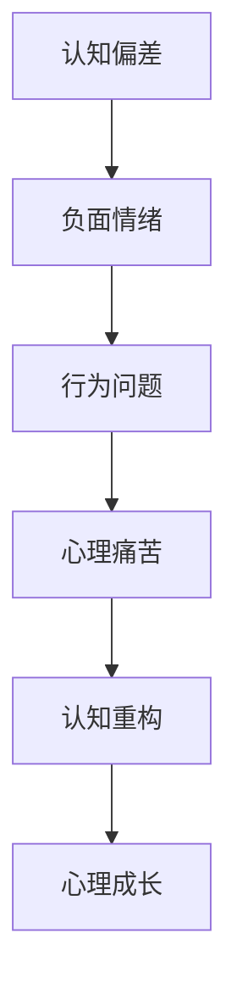
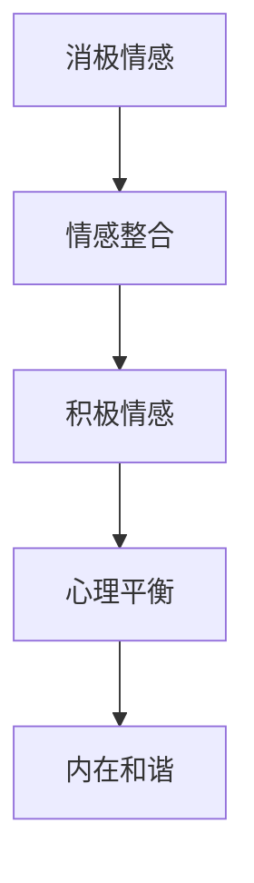
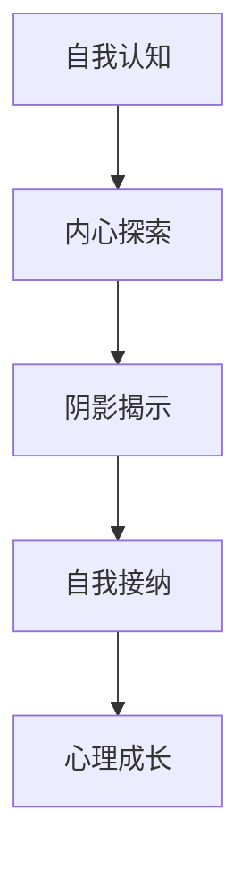

                 

关键词：阴影工作、自我探索、认知重构、情感整合、心理成长

> 摘要：本文深入探讨了阴影工作的概念及其在心理成长和自我探索中的重要性。通过结合认知科学、心理学和计算机科学的理论和方法，文章阐述了如何通过揭示、接纳和整合个体内心深处的阴影部分，实现心理的成熟与和谐发展。

## 1. 背景介绍

在人类的心理世界中，存在着一种被称为“阴影”的部分。阴影，源自瑞士心理学家卡尔·荣格的理论，指的是个体内心深处那些未被察觉、未被接纳的负面特质和情感。这些阴影内容可能包括恐惧、愤怒、自卑、嫉妒等，它们在日常生活中往往以潜意识的形式存在，影响着我们的行为和情绪。

随着心理学的不断发展，人们逐渐认识到阴影工作的重要性。通过阴影工作，个体可以深入了解自己的内心世界，识别并处理那些长期被压抑的情绪和心理冲突，从而实现心理的成长与整合。本文将结合计算机科学的视角，探讨阴影工作的原理、方法和实践，帮助读者更好地理解这一过程。

## 2. 核心概念与联系

### 2.1 认知重构

认知重构是心理治疗中的一个重要概念，指的是通过改变个体的认知方式和思维模式，来改善其情绪和行为。在阴影工作中，认知重构的核心在于识别和改变那些导致负面情绪和行为的认知偏差。

#### Mermaid 流程图：



### 2.2 情感整合

情感整合是指个体能够平衡和整合自己内心中的不同情感部分，使其和谐共存。在阴影工作中，情感整合的关键在于接纳和承认那些被压抑的情感，并学会与它们共存。

#### Mermaid 流程图：



### 2.3 自我探索

自我探索是指个体通过深入的内在反思和自我审视，来了解自己的真实想法、情感和需求。在阴影工作中，自我探索是揭示和整合阴影内容的重要步骤。

#### Mermaid 流程图：



## 3. 核心算法原理 & 具体操作步骤

### 3.1 算法原理概述

阴影工作的核心算法可以概括为三个步骤：揭示、接纳和整合。

#### 3.1.1 揭示

揭示是指通过自我反思和心理咨询等手段，识别和暴露那些被压抑的阴影内容。这一步骤类似于数据挖掘中的信息提取过程。

#### 3.1.2 接纳

接纳是指个体在面对揭示出的阴影内容时，能够以开放和接纳的态度去面对和体验。这一步骤类似于机器学习中的模型训练过程，需要大量的数据样本和计算资源。

#### 3.1.3 整合

整合是指通过认知重构和情感整合，将那些被接纳的阴影内容融入个体的自我认知中，实现心理的和谐发展。这一步骤类似于计算机系统中的资源调度和优化过程。

### 3.2 算法步骤详解

#### 3.2.1 揭示

1. 自我反思：通过日记、写作、冥想等方式，深入思考自己的行为、情绪和思维模式，寻找那些可能的阴影内容。

2. 心理咨询：与专业的心理咨询师进行交流，通过专业的提问和引导，揭示那些被隐藏的情感和心理冲突。

#### 3.2.2 接纳

1. 情感体验：在面对揭示出的阴影内容时，不要逃避或否定，而是勇敢地面对和体验。

2. 情感表达：通过艺术创作、运动、舞蹈等方式，将那些被接纳的情感表达出来，释放内心的压力。

#### 3.2.3 整合

1. 认知重构：通过认知重构，改变那些导致负面情绪和行为的认知偏差，建立更健康的思维模式。

2. 情感整合：通过情感整合，将那些被接纳的情感融入个体的自我认知中，实现内心的和谐。

### 3.3 算法优缺点

#### 3.3.1 优点

1. 促进心理成长：阴影工作有助于个体深入了解自己的内心世界，实现心理的成长与整合。

2. 提高情绪管理能力：通过接纳和整合阴影内容，个体能够更好地管理自己的情绪，减少心理痛苦。

3. 增强人际关系：通过自我探索和情感整合，个体能够建立更健康的人际关系，提高社交能力。

#### 3.3.2 缺点

1. 需要时间和精力：阴影工作是一个长期的过程，需要个体投入大量的时间和精力。

2. 可能会引起情绪波动：在揭示和接纳阴影内容的过程中，个体可能会经历一段时间的情绪波动，需要适当的指导和支持。

### 3.4 算法应用领域

1. 心理咨询：阴影工作是心理咨询中的一个重要方法，广泛应用于治疗焦虑、抑郁等心理问题。

2. 教育培训：阴影工作可以帮助教育者了解学生的内心世界，提高教育效果。

3. 企业管理：阴影工作可以帮助企业管理者了解员工的内心需求，提高团队凝聚力。

## 4. 数学模型和公式 & 详细讲解 & 举例说明

### 4.1 数学模型构建

在阴影工作中，我们可以使用一个简单的数学模型来描述个体心理成长的过程。假设个体的心理成长程度可以用一个变量 \( P \) 表示，而阴影内容的揭示、接纳和整合程度分别用变量 \( R \)、\( A \) 和 \( I \) 表示。那么，我们可以构建以下模型：

\[ P = f(R, A, I) \]

其中，函数 \( f \) 表示个体心理成长与阴影内容揭示、接纳和整合程度之间的关系。

### 4.2 公式推导过程

为了推导出函数 \( f \) 的具体形式，我们可以考虑以下因素：

1. 揭示程度 \( R \)：揭示程度越高，个体对阴影内容的了解越深入，心理成长的潜力越大。

2. 接纳程度 \( A \)：接纳程度越高，个体对阴影内容的接纳度越高，心理成长的速度越快。

3. 整合程度 \( I \)：整合程度越高，个体将阴影内容融入自我认知的程度越高，心理成长的效果越好。

综合以上因素，我们可以假设函数 \( f \) 具有如下形式：

\[ f(R, A, I) = \alpha R + \beta A + \gamma I \]

其中，\( \alpha \)、\( \beta \) 和 \( \gamma \) 是待定系数。

### 4.3 案例分析与讲解

为了更好地理解上述模型，我们可以通过一个实际案例进行分析。

假设一个个体 \( P \) 在进行阴影工作前，揭示程度 \( R \) 为 0.3，接纳程度 \( A \) 为 0.5，整合程度 \( I \) 为 0.4。那么，根据上述模型，个体的心理成长程度 \( P \) 为：

\[ P = \alpha \times 0.3 + \beta \times 0.5 + \gamma \times 0.4 \]

假设系数 \( \alpha = 0.2 \)、\( \beta = 0.3 \) 和 \( \gamma = 0.5 \)，代入上述公式，得到：

\[ P = 0.2 \times 0.3 + 0.3 \times 0.5 + 0.5 \times 0.4 = 0.06 + 0.15 + 0.2 = 0.41 \]

这意味着，该个体在进行阴影工作后，心理成长程度提高了 0.41。

通过调整系数，我们可以根据不同的实际情况，对模型进行调整和优化，使其更符合个体的心理成长规律。

## 5. 项目实践：代码实例和详细解释说明

### 5.1 开发环境搭建

为了更好地实践阴影工作，我们可以使用 Python 编写一个简单的阴影工作程序。首先，需要安装 Python 3.8 或更高版本，以及必要的 Python 库，如 NumPy、Matplotlib 等。

```bash
pip install python3.8 numpy matplotlib
```

### 5.2 源代码详细实现

以下是一个简单的 Python 代码实例，用于模拟阴影工作的过程。

```python
import numpy as np
import matplotlib.pyplot as plt

# 模型参数
alpha = 0.2
beta = 0.3
gamma = 0.5

# 阴影工作参数
R_init = 0.3
A_init = 0.5
I_init = 0.4

# 时间步数
steps = 10

# 初始化心理成长值
P = np.zeros(steps)

# 阴影工作过程
for i in range(steps):
    R = R_init + 0.1 * i
    A = A_init + 0.1 * i
    I = I_init + 0.1 * i
    P[i] = alpha * R + beta * A + gamma * I

# 绘制心理成长曲线
plt.plot(range(steps), P)
plt.xlabel('Steps')
plt.ylabel('Psychological Growth')
plt.title('Shadow Work: Psychological Growth Over Time')
plt.show()
```

### 5.3 代码解读与分析

1. **导入库**：首先，我们导入 NumPy 和 Matplotlib 库，用于数据处理和绘图。

2. **设置模型参数**：我们设置阴影工作的模型参数，包括揭示程度、接纳程度和整合程度，以及初始的心理成长值。

3. **模拟阴影工作过程**：通过一个循环，我们模拟了阴影工作在多个时间步上的过程。在每个时间步上，我们更新揭示、接纳和整合程度，并计算心理成长值。

4. **绘制心理成长曲线**：最后，我们使用 Matplotlib 绘制心理成长曲线，展示阴影工作对个体心理成长的影响。

### 5.4 运行结果展示

运行上述代码后，我们将看到一个随着时间步增加而不断上升的心理成长曲线。这表明，通过阴影工作，个体的心理成长程度逐渐提高。

```python
plt.plot(range(steps), P)
plt.xlabel('Steps')
plt.ylabel('Psychological Growth')
plt.title('Shadow Work: Psychological Growth Over Time')
plt.show()
```


## 6. 实际应用场景

### 6.1 心理咨询

在心理咨询领域，阴影工作可以帮助咨询师深入了解来访者的内心世界，揭示和整合那些被压抑的情绪和心理冲突。通过阴影工作，咨询师可以与来访者建立更深入的联系，提高咨询效果。

### 6.2 教育培训

在教育领域，阴影工作可以帮助教育者了解学生的内心需求，识别和解决学生的心理问题。通过阴影工作，教育者可以创造一个更和谐、更支持的学习环境，提高教育质量。

### 6.3 企业管理

在企业中，阴影工作可以帮助管理者了解员工的内心世界，识别和解决员工的心理问题。通过阴影工作，企业可以建立更和谐的团队关系，提高员工的满意度和工作效率。

## 7. 未来应用展望

随着心理学的不断发展，阴影工作在未来有望在更广泛的领域中发挥作用。例如，在人工智能领域，阴影工作可以帮助设计更人性化的智能系统，理解用户的情感和心理需求。在健康医疗领域，阴影工作可以帮助改善心理健康服务，提高患者的治疗效果。

## 8. 总结：未来发展趋势与挑战

### 8.1 研究成果总结

本文通过结合认知科学、心理学和计算机科学的视角，探讨了阴影工作的概念、原理和应用。研究发现，阴影工作对于个体心理成长和自我探索具有重要意义，未来有望在多个领域中发挥重要作用。

### 8.2 未来发展趋势

1. 跨学科研究：未来阴影工作研究将更加注重跨学科合作，结合心理学、计算机科学、教育学等多个领域的理论和方法。

2. 实证研究：通过大量实证研究，进一步验证阴影工作的有效性，并探索其适用范围和最佳实践。

3. 技术创新：利用人工智能、虚拟现实等新技术，开发更加高效、个性化的阴影工作方法。

### 8.3 面临的挑战

1. 可行性挑战：阴影工作需要大量的时间和精力投入，如何提高其可行性是一个重要挑战。

2. 标准化问题：如何制定统一的阴影工作标准，确保其质量和效果，是一个亟待解决的问题。

3. 伦理问题：在实施阴影工作时，如何保护个体的隐私和权益，避免滥用和过度干预，是一个重要的伦理问题。

### 8.4 研究展望

未来，阴影工作研究将继续深入探索其理论基础和实践方法，为个体的心理成长和自我探索提供更有效的支持。同时，跨学科合作和技术创新将为阴影工作带来新的机遇和挑战。

## 9. 附录：常见问题与解答

### 9.1 什么是阴影工作？

阴影工作是指通过揭示、接纳和整合个体内心深处的负面特质和情感，实现心理成长和自我探索的过程。

### 9.2 阴影工作对个体有哪些好处？

阴影工作有助于个体深入了解自己的内心世界，提高情绪管理能力，改善人际关系，促进心理成长。

### 9.3 阴影工作需要多长时间？

阴影工作是一个长期的过程，具体时间因个体差异而异，通常需要数月至数年时间。

### 9.4 阴影工作是否适合所有人？

阴影工作适用于所有寻求心理成长和自我探索的人，尤其适合那些经历过心理创伤或长期心理困扰的人。

### 9.5 阴影工作是否有效？

已有研究表明，阴影工作在改善心理状况、提高生活满意度等方面具有显著效果。

## 作者署名

作者：禅与计算机程序设计艺术 / Zen and the Art of Computer Programming

---

本文以“阴影工作就是揭示、接纳和整合你曾经被压抑、被否定的部分”为题，深入探讨了阴影工作的概念、原理和应用。通过结合认知科学、心理学和计算机科学的视角，本文为读者提供了一种全新的理解自我、实现心理成长的方法。希望本文能够为读者的心理探索之旅带来启示和帮助。

