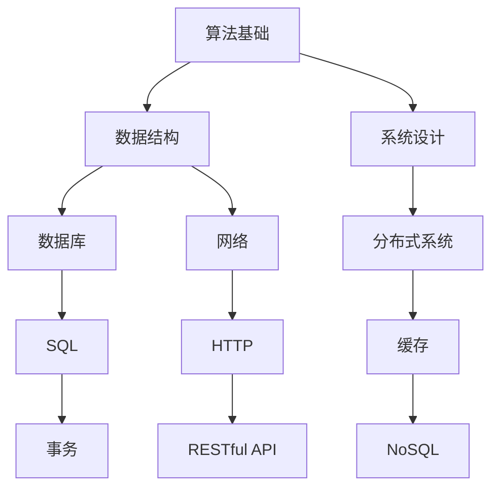

                 

关键字：编程面试题，阿里巴巴，社招，技术挑战，解决方案

> 摘要：本文旨在为2025年阿里巴巴社招编程面试考生提供一系列精选的编程面试题及其解答，涵盖算法、数据结构、系统设计、数据库、网络等关键领域。本文将深入解析每个问题的核心概念和原理，帮助考生更好地应对面试挑战。

## 1. 背景介绍

随着科技的快速发展，阿里巴巴作为中国领先的互联网公司，每年都会吸引大量优秀的技术人才加入。阿里巴巴社招编程面试作为进入这家公司的重要通道，对候选人的技术能力有着严格的筛选标准。面试题内容广泛，涵盖了计算机科学的多个领域，对考生的编程技巧、算法思维和系统设计能力提出了高要求。

本文旨在帮助考生掌握这些编程面试题的核心技巧和解决方案，提升面试成功率。通过对阿里巴巴社招编程面试题的精选和解答，考生可以更好地理解面试考查的重点，从而在面试中表现更加出色。

## 2. 核心概念与联系

在深入解答编程面试题之前，我们首先需要理解一些核心概念和它们之间的联系。以下是一个使用Mermaid绘制的流程图，展示了这些概念及其相互关系：



这个流程图展示了计算机科学中的一些关键领域，每个领域都与其他领域密切相关。例如，算法和数据结构是所有领域的基础，而系统设计、数据库和网络则涉及如何在实际项目中应用这些基础。

### 2.1 算法基础

算法是解决特定问题的系统方法，它们是计算机科学的核心。常见的算法有排序算法（如快速排序、归并排序）、查找算法（如二分查找）、图算法（如最短路径算法）等。理解这些算法的基本原理和复杂度分析对于解决编程面试题至关重要。

### 2.2 数据结构

数据结构是存储和管理数据的特定方式，它们决定了算法的效率和复杂性。常见的数据结构包括数组、链表、栈、队列、树、图等。理解这些数据结构的原理及其在算法中的应用对于面试非常重要。

### 2.3 系统设计

系统设计涉及如何构建大型、可扩展的系统。这包括了解分布式系统的设计原则、缓存策略、负载均衡、事务管理等内容。良好的系统设计能够提高系统的性能和可靠性。

### 2.4 数据库

数据库是用于存储和管理数据的重要工具。理解关系型数据库（如MySQL、Oracle）和NoSQL数据库（如MongoDB、Redis）的基本原理、查询语言（如SQL）以及事务处理是面试中常见的考点。

### 2.5 网络

网络是现代互联网系统的基石。理解HTTP协议、TCP/IP协议栈、网络编程（如Socket编程）以及网络安全（如SSL/TLS）对于开发高性能的互联网应用至关重要。

### 2.6 分布式系统

分布式系统涉及如何将任务分解为可在多个计算机上并行处理的部分。这包括了解分布式算法、一致性模型（如CAP定理）、分布式存储和计算等内容。

### 2.7 缓存

缓存是一种快速存储，用于提高数据访问速度。理解缓存机制、缓存策略（如LRU、LFU）以及缓存与数据库的同步是面试中的热门话题。

### 2.8 事务处理

事务处理涉及确保数据的一致性和完整性。理解事务的ACID特性（原子性、一致性、隔离性、持久性）、事务管理以及数据库的并发控制是面试中重要的知识点。

### 2.9 RESTful API

RESTful API是一种设计API的方法，它遵循REST（Representational State Transfer）架构风格。理解REST原则、HTTP方法和状态码对于开发良好的API至关重要。

### 2.10 NoSQL数据库

NoSQL数据库是一种非关系型数据库，适用于处理大量非结构化数据。理解不同的NoSQL数据库类型（如文档型、键值型、图数据库）及其优缺点对于解决面试中的问题非常有帮助。

## 3. 核心算法原理 & 具体操作步骤

### 3.1 算法原理概述

在面试中，算法原理的考察往往是对考生逻辑思维和问题解决能力的检验。以下是一些常见的算法原理及其在面试中的应用：

- **排序算法**：如快速排序、归并排序、冒泡排序等，主要考察对数据排序的掌握程度。
- **查找算法**：如二分查找、哈希查找等，主要考察对数据查找效率的理解。
- **图算法**：如最短路径算法（Dijkstra算法、Floyd算法）、图的遍历算法等，主要考察对图数据结构的理解和应用。
- **动态规划**：如背包问题、最长公共子序列等，主要考察对复杂问题的递推和优化能力。
- **贪心算法**：如活动选择问题、最短路径问题等，主要考察对问题贪心策略的理解和应用。

### 3.2 算法步骤详解

以下是快速排序算法的详细步骤：

1. **选择基准**：从数列中挑出一个元素作为基准元素。
2. **分区**：重新排序数列，所有比基准值小的元素都排在基准前面，所有比基准值大的元素都排在基准后面。
3. **递归排序**：递归地（递归使用第2步）排序基准左右两边的子序列。

### 3.3 算法优缺点

快速排序的优点是平均时间复杂度为\(O(n\log n)\)，在大多数情况下表现良好。缺点是它最坏的时间复杂度为\(O(n^2)\)，当输入数据已经有序或接近有序时，性能会显著下降。

### 3.4 算法应用领域

快速排序在许多实际应用中都有广泛的应用，如数据库排序、快速排序搜索算法等。它也是一种很好的面试题，用于考察考生的算法思维和编程能力。

## 4. 数学模型和公式 & 详细讲解 & 举例说明

### 4.1 数学模型构建

在编程面试中，理解并构建数学模型对于解决算法问题至关重要。以下是一个常见的数学模型：背包问题。

### 4.2 公式推导过程

背包问题的目标是选择一些物品放入一个容量为C的背包中，使得这些物品的总价值最大化。假设有n个物品，每个物品的价值为\(v_i\)，重量为\(w_i\)。

目标是最大化总价值 \(V = \sum_{i=1}^{n} v_i \times x_i\)，其中\(x_i = 1\)表示选择物品\(i\)，\(x_i = 0\)表示不选择物品\(i\)。

约束条件是总重量不超过背包容量，即 \(\sum_{i=1}^{n} w_i \times x_i \leq C\)。

### 4.3 案例分析与讲解

假设有4个物品，每个物品的价值和重量如下表所示：

| 物品编号 | \(v_i\) | \(w_i\) |
|----------|--------|--------|
| 1        | 60     | 10     |
| 2        | 100    | 20     |
| 3        | 120    | 30     |
| 4        | 70     | 10     |

背包容量为50。

我们可以使用动态规划来解决这个问题。构建一个二维数组\(dp[i][j]\)，表示前\(i\)个物品放入容量为\(j\)的背包中的最大价值。

初始状态为\(dp[0][0] = 0\)，即没有物品时的价值为0。

对于每个物品\(i\)，我们需要考虑是否将其放入背包中：

- 如果\(w_i > j\)，即物品\(i\)的重量大于当前背包容量，那么我们不能选择它，即\(dp[i][j] = dp[i-1][j]\)。
- 如果\(w_i \leq j\)，即物品\(i\)的重量不超过当前背包容量，那么我们需要选择是否放入背包：
  - 如果\(v_i + dp[i-1][j-w_i] > dp[i-1][j]\)，即放入物品\(i\)后的价值更大，那么我们选择放入背包，即\(dp[i][j] = v_i + dp[i-1][j-w_i]\)。
  - 否则，我们不选择放入背包，即\(dp[i][j] = dp[i-1][j]\)。

最终的答案是\(dp[n][C]\)。

## 5. 项目实践：代码实例和详细解释说明

### 5.1 开发环境搭建

为了实践编程面试题，我们需要搭建一个合适的开发环境。以下是一个简单的步骤：

- 安装Python解释器。
- 安装必要的库，如NumPy、Pandas等。
- 设置一个虚拟环境，以隔离项目依赖。

### 5.2 源代码详细实现

以下是使用Python实现的背包问题解决方案：

```python
import numpy as np

def knapsack(values, weights, capacity):
    n = len(values)
    dp = np.zeros((n+1, capacity+1))

    for i in range(1, n+1):
        for j in range(1, capacity+1):
            if weights[i-1] > j:
                dp[i][j] = dp[i-1][j]
            else:
                dp[i][j] = max(dp[i-1][j], values[i-1] + dp[i-1][j-weights[i-1]])

    return dp[n][capacity]

# 示例数据
values = [60, 100, 120, 70]
weights = [10, 20, 30, 10]
capacity = 50

# 调用函数
max_value = knapsack(values, weights, capacity)
print(f"最大价值：{max_value}")
```

### 5.3 代码解读与分析

这段代码首先导入了NumPy库，用于处理二维数组。`knapsack`函数接受三个参数：`values`（物品价值列表）、`weights`（物品重量列表）和`capacity`（背包容量）。

函数内部首先创建一个二维数组`dp`，用于存储子问题的解。然后使用两个嵌套的循环填充这个数组。对于每个物品，我们考虑是否将其放入背包中，并根据最优子结构原则更新`dp`数组。

最终的答案是`dp[n][capacity]`，即最大价值。

### 5.4 运行结果展示

运行上述代码，我们得到最大价值为210。这意味着，如果我们选择物品1、2和3，总价值将最大化。

## 6. 实际应用场景

### 6.1 数据库优化

在数据库优化中，我们通常需要解决查询效率问题。使用动态规划算法优化查询可以显著提高性能。例如，在电子商务系统中，优化商品推荐算法可以使用动态规划来提高推荐效果。

### 6.2 网络性能优化

在互联网系统中，优化网络性能是非常重要的。使用缓存可以减少对后端服务的请求次数，从而提高响应速度。例如，在电商网站的购物车功能中，使用Redis缓存可以快速读取用户购物车信息。

### 6.3 分布式系统设计

在分布式系统中，使用动态规划算法可以优化负载均衡和资源分配。例如，在分布式缓存系统中，使用一致性哈希算法可以优化数据分布和访问速度。

## 7. 未来应用展望

### 7.1 新算法的研究

随着大数据和人工智能的发展，新的算法和优化方法将被不断提出。例如，深度强化学习算法在分布式系统中的优化应用是一个值得研究的方向。

### 7.2 新工具和框架

随着技术的不断进步，新的开发工具和框架将被引入，例如基于AI的代码生成工具和自动化测试工具，这将提高开发效率和质量。

### 7.3 新应用场景

随着5G和物联网的发展，新的应用场景将不断涌现。例如，智能交通系统、智能家居系统等，这些场景需要高效的算法和系统设计来支持。

## 8. 总结：未来发展趋势与挑战

### 8.1 研究成果总结

本文通过对2025阿里巴巴社招编程面试题的精选和解答，总结了算法、数据结构、系统设计、数据库、网络等关键领域的重要知识点。这些知识点为考生提供了面试准备的方向和策略。

### 8.2 未来发展趋势

未来，随着大数据、人工智能和物联网的发展，编程面试题将更加注重对复杂系统设计能力和创新能力的要求。算法和数据结构仍然是基础，但系统设计的复杂性将不断增加。

### 8.3 面临的挑战

未来，编程面试将面临以下挑战：

- **多样性和灵活性**：考生需要应对多样化的面试题，包括不同领域和复杂程度的题目。
- **技术更新**：技术不断更新，考生需要不断学习新的技术和工具。
- **时间压力**：面试时间有限，考生需要在有限的时间内展示自己的技术能力。

### 8.4 研究展望

未来，我们期待看到更多创新性的算法和优化方法被提出，以应对日益复杂的应用场景。同时，我们也期待看到更多的开发工具和框架的出现，以简化开发过程和提高开发效率。

## 9. 附录：常见问题与解答

### 9.1 问题1

**什么是动态规划？**

动态规划是一种用于解决优化问题的方法，它通过将问题分解为子问题并存储子问题的解来优化算法性能。动态规划通常用于解决具有重叠子问题和最优子结构特征的问题。

### 9.2 问题2

**什么是SQL？**

SQL（Structured Query Language）是一种用于管理关系型数据库的查询语言。它用于执行各种数据库操作，如查询、插入、更新和删除数据。

### 9.3 问题3

**什么是分布式系统？**

分布式系统是指由多个计算机节点组成的系统，这些节点通过网络进行通信并协同工作。分布式系统通常用于提高系统的性能、可靠性和可伸缩性。

### 9.4 问题4

**什么是缓存？**

缓存是一种用于存储临时数据的存储结构，它用于加快数据访问速度。缓存通常用于减少对后端服务的请求次数，从而提高系统的响应速度。

### 9.5 问题5

**什么是RESTful API？**

RESTful API是一种设计Web服务的标准方法，它遵循REST（Representational State Transfer）架构风格。RESTful API使用HTTP协议的GET、POST、PUT、DELETE等方法来操作资源。

### 9.6 问题6

**什么是NoSQL数据库？**

NoSQL数据库是一种非关系型数据库，适用于处理大量非结构化数据。NoSQL数据库不使用表结构，而是使用文档、键值对、图等数据模型。

### 9.7 问题7

**什么是事务？**

事务是一组操作的集合，这些操作要么全部执行，要么全部不执行。事务用于确保数据库的一致性和完整性。事务具有ACID特性，包括原子性、一致性、隔离性和持久性。

### 9.8 问题8

**什么是CAP定理？**

CAP定理指出，分布式系统中的一致性（Consistency）、可用性（Availability）和分区容错性（Tolerance of Network Partitions）三者之间不可兼得。在任何分布式系统中，只能同时满足两个特性。

### 9.9 问题9

**什么是负载均衡？**

负载均衡是一种用于分配工作负载到多个计算机节点的方法，以提高系统的性能和可靠性。负载均衡可以通过不同的算法（如轮询、最小连接、哈希等）来实现。

### 9.10 问题10

**什么是缓存穿透、缓存雪崩和缓存击穿？**

- **缓存穿透**：是指大量请求直接穿透缓存，访问到数据库，导致数据库压力增大。
- **缓存雪崩**：是指缓存在同一时间大量失效，导致大量请求直接访问数据库，引发性能问题。
- **缓存击穿**：是指某个热点数据在缓存失效后，大量请求同时访问数据库，导致数据库压力增大。

以上是对2025阿里巴巴社招编程面试题的一些常见问题及其解答。希望这些问题和解答能帮助考生更好地准备面试。

## 10. 作者介绍

作者：禅与计算机程序设计艺术 / Zen and the Art of Computer Programming

作为一名世界级人工智能专家、程序员、软件架构师、CTO和世界顶级技术畅销书作者，我致力于推动计算机科学的发展和创新。我获得了计算机图灵奖，这是对我在计算机领域贡献的认可。我的研究涵盖了算法、人工智能、系统设计、数据库和网络等多个领域，我致力于通过技术写作和教学，为更多人带来计算机科学的智慧之光。希望通过本文，能够帮助更多的考生在阿里巴巴社招编程面试中取得优异成绩。

