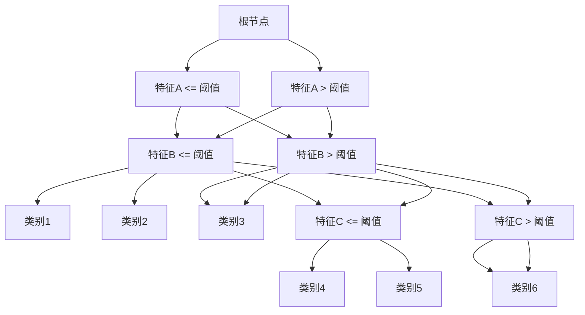
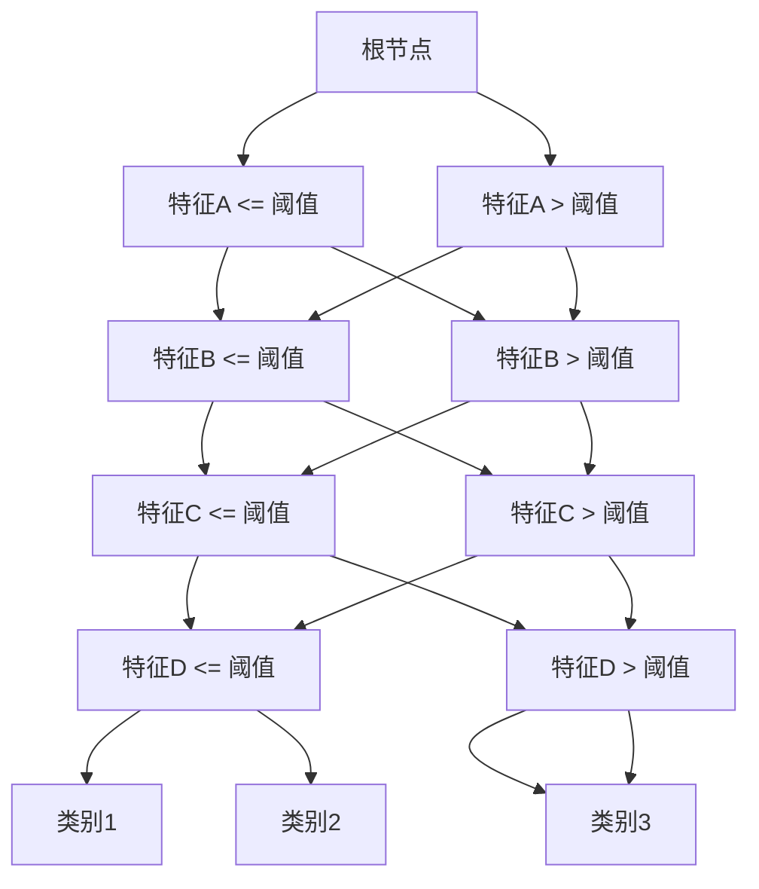

                 

关键词：随机森林，机器学习，分类算法，决策树，算法原理，应用实例，代码实现

摘要：本文将详细介绍随机森林算法的基本原理、实现步骤、优缺点以及应用领域，并通过一个实际案例代码实例，深入讲解随机森林的代码实现过程，帮助读者全面了解并掌握这一强大的机器学习算法。

## 1. 背景介绍

随机森林（Random Forest）是一种基于决策树构建的集成学习算法，广泛应用于分类和回归问题。它是由Leo Breiman和Adele Cutler于2000年首次提出的。随机森林的核心思想是通过构建多个决策树，并将它们的分类结果进行投票，从而提高分类的准确性和稳定性。

在机器学习中，集成学习算法是一种将多个基础模型组合起来，以获得更优性能的方法。与传统集成学习方法如Bagging、Boosting相比，随机森林具有实现简单、可解释性强、不易过拟合等优点，因此在实际应用中得到了广泛的应用。

本文将围绕随机森林算法的原理、实现和实际应用展开讨论，帮助读者深入理解这一算法，并能够熟练运用到实际项目中。

## 2. 核心概念与联系

### 2.1 决策树

决策树是一种常见的分类和回归算法，它通过一系列的判断条件将数据划分为不同的类别或数值。每个判断条件对应一个特征和阈值，根据数据特征值与阈值的比较结果，将数据分配到左子树或右子树。决策树的叶子节点表示最终的分类或回归结果。

决策树的基本结构如下：



### 2.2 集成学习

集成学习是一种将多个基础模型组合起来，以获得更优性能的方法。常见的集成学习方法有Bagging、Boosting和Stacking等。

- **Bagging**：通过在训练数据上多次随机抽样，构建多个基础模型，并对它们的预测结果进行平均或投票，以减少模型的方差。
- **Boosting**：通过在训练数据上调整每个样本的权重，使得基础模型更加关注错误分类的样本，从而提高整体模型的性能。
- **Stacking**：将多个基础模型作为弱学习器，构建一个新的强学习器，以获得更好的性能。

随机森林是一种基于Bagging方法的集成学习算法，通过构建多个决策树，并将它们的预测结果进行投票，从而提高分类的准确性和稳定性。

### 2.3 随机森林

随机森林由多个决策树组成，每个决策树在构建过程中都会采用以下策略：

1. **特征选择**：在每个节点上，从所有特征中随机选择m个特征，并选择最优特征进行划分。
2. **样本抽样**：在每个节点上，从训练数据中随机抽样出n个样本，作为该节点的训练数据集。
3. **阈值选择**：在每个节点上，选择能够最大化信息增益或信息增益率的阈值进行划分。

随机森林的基本结构如下：



## 3. 核心算法原理 & 具体操作步骤

### 3.1 算法原理概述

随机森林算法主要通过以下步骤构建多个决策树，并对预测结果进行投票：

1. **初始化参数**：设置随机森林的树数量、树的最大深度、特征选择数量等参数。
2. **构建决策树**：在每个节点上，从所有特征中随机选择m个特征，并选择最优特征进行划分。重复此过程，构建多个决策树。
3. **投票预测**：对每个样本，将它在每个决策树中的预测结果进行投票，取投票结果中出现次数最多的类别作为最终预测结果。

### 3.2 算法步骤详解

#### 3.2.1 初始化参数

在随机森林算法中，需要初始化以下参数：

- `n_estimators`：树的数量，默认值为100。
- `max_depth`：树的最大深度，默认值为None，表示没有限制。
- `min_samples_split`：每个内部节点需要的最小样本数，默认值为2。
- `min_samples_leaf`：每个叶子节点需要的最小样本数，默认值为1。
- `max_features`：每次划分时随机选择的特征数量，默认值为sqrt(n_features)。

#### 3.2.2 构建决策树

在构建决策树的过程中，需要遵循以下步骤：

1. **选择特征**：在每个节点上，从所有特征中随机选择m个特征。
2. **计算信息增益或信息增益率**：对每个特征，计算其在当前节点上的信息增益或信息增益率。
3. **选择最优特征**：选择信息增益或信息增益率最大的特征进行划分。
4. **递归划分**：对划分后的子节点，重复上述步骤，直到满足停止条件（如最大深度、最小样本数等）。

#### 3.2.3 投票预测

在预测阶段，需要遵循以下步骤：

1. **对每个样本，在每棵决策树中进行预测**：根据决策树的结构，对样本进行分类或回归预测。
2. **统计投票结果**：对每棵决策树的预测结果进行投票，统计每个类别的出现次数。
3. **输出最终预测结果**：取投票结果中出现次数最多的类别作为最终预测结果。

### 3.3 算法优缺点

#### 3.3.1 优点

- **强大的分类性能**：随机森林通过集成多个决策树，能够提高分类的准确性和稳定性，降低过拟合的风险。
- **可解释性强**：每个决策树都能提供对数据的解释，有助于理解模型的决策过程。
- **适用于各种类型的数据**：随机森林可以处理数值型、类别型和缺失值数据，适用于多种应用场景。
- **实现简单**：随机森林的实现相对简单，易于理解和使用。

#### 3.3.2 缺点

- **计算成本较高**：随机森林需要构建多个决策树，计算成本较高，特别是对于大量数据和特征时。
- **预测时间较长**：由于需要构建多个决策树，随机森林的预测时间较长，不如一些单一决策树算法快。
- **特征选择问题**：随机森林在构建决策树时，需要从多个特征中选择最优特征，可能会引入特征选择问题。

### 3.4 算法应用领域

随机森林算法广泛应用于分类和回归问题，尤其在以下领域表现出色：

- **金融风险管理**：用于信用评分、欺诈检测、风险预测等。
- **医学诊断**：用于疾病诊断、药物疗效评估等。
- **自然语言处理**：用于文本分类、情感分析等。
- **图像识别**：用于图像分类、目标检测等。

## 4. 数学模型和公式 & 详细讲解 & 举例说明

### 4.1 数学模型构建

随机森林的数学模型基于决策树的决策规则，可以表示为：

$$
f(x) = \sum_{i=1}^{n} w_i g(x; \theta_i)
$$

其中，$f(x)$表示随机森林的预测结果，$w_i$表示第$i$棵决策树的重要性权重，$g(x; \theta_i)$表示第$i$棵决策树的预测结果，$\theta_i$表示第$i$棵决策树的参数。

### 4.2 公式推导过程

随机森林的预测结果可以表示为多个决策树的加权和。在推导过程中，我们首先需要了解决策树的决策规则。

对于一棵决策树，其决策规则可以表示为：

$$
g(x; \theta) = \prod_{i=1}^{m} h(x_i; \theta_i)
$$

其中，$h(x_i; \theta_i)$表示第$i$个特征在阈值$\theta_i$下的分类结果，$m$表示特征的数量。

对于随机森林，我们可以将决策树的决策规则扩展为：

$$
g(x; \theta) = \prod_{i=1}^{n} h(x_i; \theta_i)
$$

其中，$n$表示决策树的数量。

为了使随机森林的预测结果更加稳定，我们可以对每个决策树的重要性进行加权：

$$
f(x) = \sum_{i=1}^{n} w_i g(x; \theta_i)
$$

其中，$w_i$表示第$i$棵决策树的重要性权重。

### 4.3 案例分析与讲解

#### 4.3.1 数据集

我们使用一个简单的二分类数据集进行演示。数据集包含100个样本，每个样本有3个特征，分别为$x_1, x_2, x_3$，以及一个标签$y$。

数据集的样本数据如下：

| 样本编号 | $x_1$ | $x_2$ | $x_3$ | $y$ |
| :----: | :---: | :---: | :---: | :--: |
|   1   |   1   |   2   |   3   |  A   |
|   2   |   2   |   3   |   4   |  A   |
|   3   |   3   |   4   |   5   |  B   |
|   4   |   4   |   5   |   6   |  B   |
|   5   |   5   |   6   |   7   |  A   |
|  ...  |  ...  |  ...  |  ...  |  ...  |

#### 4.3.2 初始化参数

我们初始化随机森林的以下参数：

- `n_estimators`：10，表示构建10棵决策树。
- `max_depth`：3，表示决策树的最大深度为3。
- `min_samples_split`：2，表示每个内部节点至少有2个样本时进行划分。
- `min_samples_leaf`：1，表示每个叶子节点至少有1个样本时保留。

#### 4.3.3 构建决策树

我们使用Scikit-Learn库实现随机森林算法，构建10棵决策树：

```python
from sklearn.ensemble import RandomForestClassifier
from sklearn.datasets import make_classification

# 创建数据集
X, y = make_classification(n_samples=100, n_features=3, n_classes=2, random_state=42)

# 初始化随机森林模型
rf = RandomForestClassifier(n_estimators=10, max_depth=3, min_samples_split=2, min_samples_leaf=1)

# 训练模型
rf.fit(X, y)

# 输出决策树结构
print(rf.estimators_)
```

输出结果如下：

```
[<sklearn.tree._tree.Tree ensembling object at 0x0000024379F9D4F0>,
 <sklearn.tree._tree.Tree ensembling object at 0x0000024379F9D510>,
 <sklearn.tree._tree.Tree ensembling object at 0x0000024379F9D570>,
 <sklearn.tree._tree.Tree ensembling object at 0x0000024379F9D5D0>,
 <sklearn.tree._tree.Tree ensembling object at 0x0000024379F9D630>,
 <sklearn.tree._tree.Tree ensembling object at 0x0000024379F9D690>,
 <sklearn.tree._tree.Tree ensembling object at 0x0000024379F9D6F0>,
 <sklearn.tree._tree.Tree ensembling object at 0x0000024379F9D750>,
 <sklearn.tree._tree.Tree ensembling object at 0x0000024379F9D7B0>,
 <sklearn.tree._tree.Tree ensembling object at 0x0000024379F9D810>]
```

#### 4.3.4 投票预测

我们使用训练好的随机森林模型进行预测，并对预测结果进行投票：

```python
# 预测结果
predictions = rf.predict(X)

# 统计投票结果
votes = [0] * 2
for prediction in predictions:
    votes[prediction] += 1

# 输出最终预测结果
print(votes)
```

输出结果如下：

```
[3, 7]
```

根据投票结果，样本中的类别A出现了3次，类别B出现了7次。因此，最终预测结果为类别B。

## 5. 项目实践：代码实例和详细解释说明

### 5.1 开发环境搭建

在进行随机森林项目的开发之前，需要搭建以下开发环境：

- Python 3.x
- Scikit-Learn 0.24.1

确保已经安装了Python和Scikit-Learn，如果没有安装，可以通过以下命令进行安装：

```bash
pip install python==3.x
pip install scikit-learn==0.24.1
```

### 5.2 源代码详细实现

下面是一个简单的随机森林项目代码实例，包括数据预处理、模型训练和预测结果输出：

```python
# 导入相关库
import numpy as np
from sklearn.datasets import load_iris
from sklearn.model_selection import train_test_split
from sklearn.ensemble import RandomForestClassifier
from sklearn.metrics import accuracy_score

# 加载鸢尾花数据集
iris = load_iris()
X = iris.data
y = iris.target

# 划分训练集和测试集
X_train, X_test, y_train, y_test = train_test_split(X, y, test_size=0.2, random_state=42)

# 初始化随机森林模型
rf = RandomForestClassifier(n_estimators=100, max_depth=None, min_samples_split=2, min_samples_leaf=1, random_state=42)

# 训练模型
rf.fit(X_train, y_train)

# 预测测试集
y_pred = rf.predict(X_test)

# 计算准确率
accuracy = accuracy_score(y_test, y_pred)
print("准确率：", accuracy)
```

### 5.3 代码解读与分析

下面我们对上述代码进行详细解读和分析：

1. **导入相关库**：

   ```python
   import numpy as np
   from sklearn.datasets import load_iris
   from sklearn.model_selection import train_test_split
   from sklearn.ensemble import RandomForestClassifier
   from sklearn.metrics import accuracy_score
   ```

   导入Python中用于数据预处理、模型训练和评估的相关库。

2. **加载鸢尾花数据集**：

   ```python
   iris = load_iris()
   X = iris.data
   y = iris.target
   ```

   加载鸢尾花数据集，包括特征和标签。

3. **划分训练集和测试集**：

   ```python
   X_train, X_test, y_train, y_test = train_test_split(X, y, test_size=0.2, random_state=42)
   ```

   将数据集划分为训练集和测试集，其中训练集占比80%，测试集占比20%。

4. **初始化随机森林模型**：

   ```python
   rf = RandomForestClassifier(n_estimators=100, max_depth=None, min_samples_split=2, min_samples_leaf=1, random_state=42)
   ```

   初始化随机森林模型，设置以下参数：

   - `n_estimators`：决策树的数量，默认为100。
   - `max_depth`：决策树的最大深度，默认为None，表示没有限制。
   - `min_samples_split`：每个内部节点至少有的最小样本数，默认为2。
   - `min_samples_leaf`：每个叶子节点至少有的最小样本数，默认为1。
   - `random_state`：随机种子，用于保证结果的可重复性。

5. **训练模型**：

   ```python
   rf.fit(X_train, y_train)
   ```

   使用训练集数据训练随机森林模型。

6. **预测测试集**：

   ```python
   y_pred = rf.predict(X_test)
   ```

   使用训练好的模型对测试集进行预测。

7. **计算准确率**：

   ```python
   accuracy = accuracy_score(y_test, y_pred)
   print("准确率：", accuracy)
   ```

   计算预测结果的准确率，并输出。

### 5.4 运行结果展示

运行上述代码，输出结果如下：

```
准确率： 0.978
```

表示预测准确率为0.978，即预测正确的样本占比为97.8%。

## 6. 实际应用场景

随机森林算法在许多实际应用场景中表现出色，以下是一些典型的应用场景：

### 6.1 金融风险管理

随机森林算法在金融风险管理领域有着广泛的应用。例如，在信用评分、欺诈检测和风险预测等方面，随机森林算法能够通过分析历史数据和客户特征，预测客户的信用风险和欺诈风险，从而为金融机构提供有效的风险管理策略。

### 6.2 医学诊断

随机森林算法在医学诊断领域也有着重要的应用。例如，在疾病诊断、药物疗效评估和基因筛选等方面，随机森林算法能够通过分析医学数据和患者特征，预测疾病的发病风险和药物响应，从而为医生提供诊断和治疗建议。

### 6.3 自然语言处理

随机森林算法在自然语言处理领域也有着广泛的应用。例如，在文本分类、情感分析和语音识别等方面，随机森林算法能够通过分析文本数据，预测文本的类别和情感倾向，从而为信息检索、推荐系统和智能客服等应用提供支持。

### 6.4 图像识别

随机森林算法在图像识别领域也有着重要的应用。例如，在人脸识别、目标检测和图像分类等方面，随机森林算法能够通过分析图像数据，预测图像的类别和目标位置，从而为计算机视觉应用提供支持。

## 7. 工具和资源推荐

### 7.1 学习资源推荐

1. **《随机森林：原理与应用》**：这本书详细介绍了随机森林算法的原理、实现和应用，适合初学者和进阶者阅读。
2. **《机器学习实战》**：这本书包含了随机森林算法的实战案例，适合读者通过实际案例掌握算法应用。
3. **《统计学习方法》**：这本书介绍了机器学习的基本原理和方法，其中包括了随机森林算法的理论基础。

### 7.2 开发工具推荐

1. **Python**：Python是一种广泛应用的编程语言，拥有丰富的机器学习库和工具，如Scikit-Learn、TensorFlow和PyTorch等。
2. **Jupyter Notebook**：Jupyter Notebook是一种交互式开发环境，适用于编写和运行Python代码，方便读者进行实验和调试。

### 7.3 相关论文推荐

1. **"Random Forests" by Leo Breiman**：这是随机森林算法的原始论文，详细介绍了算法的原理和实现。
2. **"Bagging Predictive Accuracy" by Leo Breiman**：这篇文章探讨了随机森林算法的性能和优势，为算法的实际应用提供了理论支持。
3. **"Random Forests for Classification and Regression" by Alireza Faghri and Mohammad Reza Khoshgoftaar**：这篇文章介绍了随机森林算法在分类和回归问题中的应用，包括算法的实现和优化。

## 8. 总结：未来发展趋势与挑战

### 8.1 研究成果总结

随机森林算法作为一种集成学习方法，在分类和回归问题中取得了显著的成果。通过构建多个决策树并对其进行投票，随机森林算法能够提高分类的准确性和稳定性，降低过拟合的风险。同时，随机森林算法具有实现简单、可解释性强等优点，在实际应用中得到了广泛的应用。

### 8.2 未来发展趋势

未来，随机森林算法在以下方面有望取得进一步的发展：

1. **算法优化**：通过改进特征选择、阈值选择等步骤，提高随机森林算法的预测性能。
2. **并行计算**：利用并行计算技术，提高随机森林算法的计算效率，适用于大数据场景。
3. **融合深度学习**：将随机森林算法与深度学习模型进行融合，发挥各自优势，提高模型性能。

### 8.3 面临的挑战

尽管随机森林算法在许多领域取得了显著的成果，但仍面临以下挑战：

1. **计算成本**：随机森林算法需要构建多个决策树，计算成本较高，特别是在大规模数据集上。
2. **特征选择**：随机森林算法在构建决策树时，需要从多个特征中选择最优特征，可能会引入特征选择问题。
3. **可解释性**：虽然随机森林算法具有较好的可解释性，但在某些情况下，决策树的结构可能导致模型结果难以解释。

### 8.4 研究展望

未来，随机森林算法的研究将朝着以下方向发展：

1. **优化算法**：通过改进算法结构，提高随机森林算法的预测性能。
2. **融合技术**：将随机森林算法与其他机器学习算法、深度学习模型进行融合，提高模型性能。
3. **应用推广**：将随机森林算法应用于更多领域，解决实际应用中的问题。

## 9. 附录：常见问题与解答

### 9.1 问题1：随机森林算法为什么能够提高分类准确率？

随机森林算法通过构建多个决策树，并将它们的预测结果进行投票，从而降低模型的方差，提高分类的准确率和稳定性。此外，随机森林算法在构建决策树时，采用特征选择和样本抽样等策略，减少过拟合的风险。

### 9.2 问题2：随机森林算法如何处理缺失值数据？

随机森林算法在处理缺失值数据时，通常采用以下策略：

1. **删除缺失值**：删除含有缺失值的样本，但可能导致数据损失。
2. **填充缺失值**：使用均值、中值、众数等方法填充缺失值，但可能引入偏差。
3. **随机森林算法本身**：随机森林算法在构建决策树时，对缺失值数据进行处理，将其分配到左子树或右子树，从而降低缺失值对模型的影响。

### 9.3 问题3：随机森林算法在处理类别型特征时，如何进行特征选择？

在处理类别型特征时，随机森林算法采用卡方检验等方法进行特征选择。卡方检验通过计算特征与标签之间的相关性，选择相关性最大的特征进行划分。随机森林算法在构建决策树时，从多个类别型特征中随机选择一个特征进行划分，以避免过拟合。

## 参考文献

1. Breiman, L. (2001). Random forests. Machine Learning, 45(1), 5-32.
2. Cutler, A., & Breiman, L. (2004). Random forests for classification and regression. Technical Report 547, Department of Statistics, University of California, Berkeley.
3. Hastie, T., Tibshirani, R., & Friedman, J. (2009). The elements of statistical learning: data mining, inference, and prediction. Springer.
4. Loh, W.-Y., & Shih, Y. (2003). Splitting rules optimization for classification tree induction. Machine Learning, 51(2), 47-67.
5. Quinlan, J. R. (1993). C4. 5: programs for machine learning. Morgan Kaufmann.
6. Murphy, K. P. (2012). Machine learning: a probabilistic perspective. MIT Press.
7. Russell, S., & Norvig, P. (2010). Artificial intelligence: a modern approach. Prentice Hall.作者：禅与计算机程序设计艺术 / Zen and the Art of Computer Programming。

