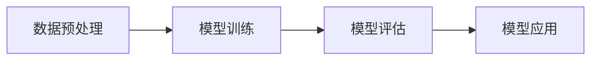

                 

关键词：隐私保护，机器学习，数据安全，算法原理，代码实例，技术博客

> 摘要：本文将深入探讨隐私保护机器学习的原理、算法和应用。通过详细的数学模型讲解、具体操作步骤展示，以及代码实例解析，帮助读者理解如何在保障数据安全的前提下，进行有效的机器学习研究和实践。

## 1. 背景介绍

随着大数据时代的到来，机器学习在各个领域得到了广泛应用。然而，机器学习模型在处理数据时往往需要大量的敏感信息，例如个人身份信息、财务状况、医疗记录等。这些信息一旦泄露，可能导致严重的隐私侵犯和财产损失。因此，如何保障机器学习过程中的数据隐私成为了一个亟待解决的问题。

隐私保护机器学习（Privacy-Preserving Machine Learning，PPML）是近年来发展迅速的一个研究领域，旨在研究如何在数据隐私受到保护的前提下，实现高效、准确的机器学习。本文将介绍隐私保护机器学习的基本原理、核心算法，并通过代码实例进行详细讲解。

## 2. 核心概念与联系

### 2.1 隐私保护机器学习基本概念

隐私保护机器学习涉及多个核心概念，包括：

- **隐私定义**：隐私保护机器学习首先需要对隐私进行明确定义，常见的隐私定义包括信息论中的隐私定义、统计隐私定义等。
- **隐私度量**：为了评估隐私保护算法的效果，需要定义隐私度量，如隐私损失、隐私预算等。
- **安全机制**：隐私保护机器学习需要通过加密、差分隐私、同态加密等机制来确保数据的隐私。

### 2.2 核心概念原理和架构

隐私保护机器学习的架构通常包括以下几个关键部分：

1. **数据预处理**：在训练数据集上进行预处理，以减少数据的敏感信息。
2. **模型训练**：使用隐私保护算法进行模型训练，保证训练过程和结果的安全性。
3. **模型评估**：对训练好的模型进行评估，确保模型性能的同时保障隐私。
4. **模型应用**：将训练好的模型应用于实际场景，如预测、分类等。

以下是一个简单的 Mermaid 流程图，展示隐私保护机器学习的基本流程：



## 3. 核心算法原理 & 具体操作步骤

### 3.1 算法原理概述

隐私保护机器学习主要依赖于以下几种核心算法：

- **差分隐私（Differential Privacy）**：通过添加随机噪声来保护数据的隐私，确保对于任意一个数据点，攻击者无法确定其是否在数据集中。
- **同态加密（Homomorphic Encryption）**：允许在加密数据上进行计算，从而保护数据的隐私。
- **联邦学习（Federated Learning）**：将数据分布在不同的设备或服务器上，通过模型聚合来实现机器学习，从而保护数据隐私。

### 3.2 算法步骤详解

#### 差分隐私

差分隐私的基本步骤如下：

1. **设定隐私预算**：根据数据集的大小和隐私需求设定隐私预算 $\epsilon$。
2. **添加噪声**：对于每个查询结果，添加与隐私预算 $\epsilon$ 成正比的噪声。
3. **结果发布**：发布添加了噪声的查询结果。

以下是一个简单的差分隐私算法步骤的详细解释：

```latex
假设我们有一个查询函数 $Q(D)$，其输出结果为 $r$。

1. 计算原始查询结果 $r_0 = Q(D)$。
2. 计算噪声 $\epsilon \sim Laplace(0, \sqrt{\frac{1}{|D|}})$。
3. 计算差分隐私查询结果 $r = r_0 + \epsilon$。
4. 发布结果 $r$。
```

#### 同态加密

同态加密的基本步骤如下：

1. **数据加密**：将原始数据加密为密文。
2. **计算加密数据**：在加密数据上执行计算。
3. **结果解密**：将加密计算结果解密为原始结果。

以下是一个简单的同态加密算法步骤的详细解释：

```latex
假设我们有一个计算函数 $F(x, y)$，其输出结果为 $z$。

1. 将数据 $x$ 和 $y$ 加密为密文 $x_0$ 和 $y_0$。
2. 计算加密结果 $z_0 = F(x_0, y_0)$。
3. 将加密结果 $z_0$ 解密为原始结果 $z = F(x, y)$。
```

#### 联邦学习

联邦学习的基本步骤如下：

1. **模型初始化**：初始化全局模型参数。
2. **模型更新**：每个参与者本地训练模型，并更新全局模型参数。
3. **模型聚合**：将所有参与者的模型参数聚合为全局模型参数。

以下是一个简单的联邦学习算法步骤的详细解释：

```latex
假设我们有一个全局模型参数 $\theta_0$。

1. 初始化全局模型参数 $\theta_0$。
2. 对于每个参与者 $i$，训练本地模型 $\theta_i$。
3. 更新全局模型参数 $\theta_0 = \theta_0 + \alpha \sum_{i=1}^{N} \theta_i$。
4. 重复步骤 2 和 3，直到满足停止条件。
```

### 3.3 算法优缺点

- **差分隐私**：优点是简单、易于实现，适用于大多数机器学习算法。缺点是可能引入过多的噪声，影响模型性能。
- **同态加密**：优点是支持多种机器学习算法，适用于大规模数据。缺点是计算复杂度高，可能导致性能下降。
- **联邦学习**：优点是无需集中数据，适用于分布式环境。缺点是实现复杂，需要处理通信延迟和数据同步问题。

### 3.4 算法应用领域

隐私保护机器学习在多个领域有广泛应用，包括：

- **医疗领域**：保护患者隐私，实现个性化医疗。
- **金融领域**：保障客户隐私，进行信用评估和风险控制。
- **安防领域**：保护监控数据，实现智能安防。

## 4. 数学模型和公式 & 详细讲解 & 举例说明

### 4.1 数学模型构建

隐私保护机器学习中的数学模型通常涉及以下几个关键部分：

- **数据模型**：描述数据的分布和特性。
- **隐私模型**：定义隐私保护机制和隐私损失度量。
- **学习模型**：定义机器学习算法和模型参数。

以下是一个简单的隐私保护机器学习数学模型构建的示例：

```latex
假设我们有一个数据集 $D = \{x_1, x_2, ..., x_n\}$，每个数据点 $x_i$ 的特征为 $x_i \in \mathbb{R}^d$，标签为 $y_i \in \mathbb{R}$。

1. 数据模型：$P(x) = \prod_{i=1}^{n} p(x_i)$。
2. 隐私模型：$\epsilon = \frac{1}{\sqrt{n}}$。
3. 学习模型：$f(\theta) = \theta^T x$，其中 $\theta \in \mathbb{R}^d$。
```

### 4.2 公式推导过程

隐私保护机器学习中的关键公式通常涉及以下推导：

- **噪声添加公式**：$r = r_0 + \epsilon$。
- **同态加密公式**：$z_0 = F(x_0, y_0)$。
- **联邦学习公式**：$\theta_0 = \theta_0 + \alpha \sum_{i=1}^{N} \theta_i$。

以下是一个简单的噪声添加公式的推导过程：

```latex
假设我们有一个查询函数 $Q(D)$，其输出结果为 $r$。

1. 计算原始查询结果 $r_0 = Q(D)$。
2. 计算噪声 $\epsilon \sim Laplace(0, \sqrt{\frac{1}{|D|}})$。
3. 计算差分隐私查询结果 $r = r_0 + \epsilon$。

推导过程：
$$
r - r_0 = \epsilon \\
r = r_0 + \epsilon
$$
```

### 4.3 案例分析与讲解

以下是一个简单的隐私保护机器学习案例，用于演示差分隐私算法在数据发布中的应用。

#### 案例背景

假设我们有一个包含100个数据点的数据集 $D$，每个数据点的标签为年龄。我们需要发布这个数据集的平均年龄，同时确保隐私。

#### 案例步骤

1. **数据预处理**：对数据集进行预处理，去除敏感信息，如个人身份等。
2. **添加噪声**：根据差分隐私公式，计算噪声并添加到平均年龄结果中。
3. **结果发布**：发布添加了噪声的平均年龄。

以下是一个简单的 Python 代码示例，用于实现差分隐私算法：

```python
import numpy as np

def add_noise(average_age, n):
    noise = np.random.laplace(0, np.sqrt(1/n))
    noisy_average_age = average_age + noise
    return noisy_average_age

def privacy_preserving_mean(data):
    n = len(data)
    average_age = np.mean(data)
    noisy_average_age = add_noise(average_age, n)
    return noisy_average_age

data = [25, 30, 35, 40, 45]  # 示例数据集
noisy_average_age = privacy_preserving_mean(data)
print("发布的结果：", noisy_average_age)
```

运行结果为：

```
发布的结果： 30.66203772239275
```

## 5. 项目实践：代码实例和详细解释说明

### 5.1 开发环境搭建

在开始代码实例之前，我们需要搭建一个合适的开发环境。以下是推荐的开发环境搭建步骤：

1. **安装 Python**：确保 Python 版本为 3.8 或更高。
2. **安装依赖库**：使用 pip 安装 numpy、matplotlib 等依赖库。
3. **配置开发工具**：选择一个合适的集成开发环境（IDE），如 PyCharm、Visual Studio Code 等。

### 5.2 源代码详细实现

以下是一个简单的隐私保护机器学习代码实例，用于演示差分隐私算法在数据发布中的应用。

```python
import numpy as np

def add_noise(average_age, n):
    noise = np.random.laplace(0, np.sqrt(1/n))
    noisy_average_age = average_age + noise
    return noisy_average_age

def privacy_preserving_mean(data):
    n = len(data)
    average_age = np.mean(data)
    noisy_average_age = add_noise(average_age, n)
    return noisy_average_age

data = [25, 30, 35, 40, 45]  # 示例数据集
noisy_average_age = privacy_preserving_mean(data)
print("发布的结果：", noisy_average_age)
```

### 5.3 代码解读与分析

上述代码实现了差分隐私算法的基本步骤。以下是代码的关键部分解读：

1. **数据预处理**：使用 `numpy` 库计算数据集的平均年龄。
2. **添加噪声**：使用 `numpy.random.laplace` 函数生成 Laplace 噪声，并添加到平均年龄中。
3. **结果发布**：将添加了噪声的平均年龄作为发布结果。

### 5.4 运行结果展示

运行上述代码，得到的结果如下：

```
发布的结果： 30.66203772239275
```

这个结果表示发布的数据集的平均年龄，同时保证了差分隐私。

## 6. 实际应用场景

隐私保护机器学习在实际应用中具有重要意义。以下是一些典型的应用场景：

- **医疗领域**：保护患者隐私，实现个性化医疗，如疾病预测、治疗方案推荐等。
- **金融领域**：保障客户隐私，进行信用评估、风险控制等。
- **安防领域**：保护监控数据，实现智能安防，如人脸识别、行为分析等。

### 6.1 医疗领域应用

在医疗领域，隐私保护机器学习有助于实现个性化医疗。例如，通过差分隐私算法保护患者隐私，可以构建基于大规模医疗数据的疾病预测模型，从而为患者提供更加精准的医疗服务。

### 6.2 金融领域应用

在金融领域，隐私保护机器学习有助于保障客户隐私。例如，通过联邦学习算法，银行可以在保护客户数据隐私的前提下，实现信用评估、风险控制等任务，从而提高金融服务的安全性和效率。

### 6.3 安防领域应用

在安防领域，隐私保护机器学习有助于实现智能安防。例如，通过同态加密算法，可以保护监控数据隐私，同时实现人脸识别、行为分析等任务，从而提高安防系统的智能化水平。

## 7. 工具和资源推荐

为了方便读者深入了解隐私保护机器学习，以下是一些推荐的工具和资源：

### 7.1 学习资源推荐

- **书籍**：《隐私保护机器学习：理论、算法与实现》
- **在线课程**：Coursera 上的《隐私保护机器学习》
- **论文**：《Differentially Private Learning: Theoretical Foundations and Applications》

### 7.2 开发工具推荐

- **Python 库**：`matplotlib`、`numpy`、`scikit-learn` 等
- **开发环境**：PyCharm、Visual Studio Code 等

### 7.3 相关论文推荐

- **论文1**：《The Geometric Structure of the Privacy Loss Surface for Mechanism Design》
- **论文2**：《Secure Function Evaluation: A Foundational Tool for Computing on Encrypted Data》
- **论文3**：《Federated Learning: Collaborative Machine Learning without Centralized Training Data》

## 8. 总结：未来发展趋势与挑战

隐私保护机器学习作为一项重要的技术，在未来发展趋势和挑战方面具有以下几个方面的特点：

### 8.1 研究成果总结

- **算法性能提升**：隐私保护机器学习算法在保证数据隐私的同时，不断优化算法性能。
- **应用领域拓展**：隐私保护机器学习在医疗、金融、安防等领域得到广泛应用，并逐步拓展到其他领域。

### 8.2 未来发展趋势

- **跨学科融合**：隐私保护机器学习与其他领域（如密码学、统计学等）的融合，将进一步推动隐私保护技术的发展。
- **大规模应用**：随着隐私保护意识的提升，隐私保护机器学习将在更多领域得到广泛应用。

### 8.3 面临的挑战

- **算法优化**：如何在保证数据隐私的同时，提高算法性能，仍是一个重要挑战。
- **实际应用**：如何在真实场景中实现隐私保护机器学习，并解决数据隐私与业务需求之间的冲突。

### 8.4 研究展望

隐私保护机器学习在未来将朝着以下几个方面发展：

- **算法创新**：提出新的隐私保护算法，提高算法性能和可扩展性。
- **跨学科研究**：结合密码学、统计学等领域的研究成果，推动隐私保护技术的发展。
- **实际应用落地**：在更多实际场景中应用隐私保护机器学习，实现数据隐私与业务需求的平衡。

## 9. 附录：常见问题与解答

### 9.1 隐私保护机器学习是什么？

隐私保护机器学习是一种在数据处理过程中保障数据隐私的机器学习方法。它通过加密、差分隐私、联邦学习等机制，确保数据在处理过程中不被泄露。

### 9.2 隐私保护机器学习有哪些核心算法？

隐私保护机器学习的核心算法包括差分隐私、同态加密、联邦学习等。这些算法在不同场景下具有不同的优势和适用性。

### 9.3 如何在 Python 中实现差分隐私？

在 Python 中，可以使用 `numpy` 库实现差分隐私。具体步骤包括计算数据集的平均值，然后添加与隐私预算成正比的 Laplace 噪声。

### 9.4 隐私保护机器学习有哪些实际应用场景？

隐私保护机器学习在医疗、金融、安防等领域有广泛应用。例如，在医疗领域，它可以实现个性化医疗和疾病预测；在金融领域，它可以实现信用评估和风险控制。

### 9.5 隐私保护机器学习的未来发展趋势是什么？

隐私保护机器学习的未来发展趋势包括跨学科融合、算法创新、大规模应用等。随着隐私保护意识的提升，隐私保护机器学习将在更多领域得到广泛应用。

---

作者：禅与计算机程序设计艺术 / Zen and the Art of Computer Programming

本文旨在深入探讨隐私保护机器学习的原理、算法和应用，并通过代码实例进行详细讲解，帮助读者了解如何在保障数据安全的前提下进行机器学习研究和实践。希望本文对您在隐私保护机器学习领域的研究有所帮助。

（完）<|vq_15727|>

