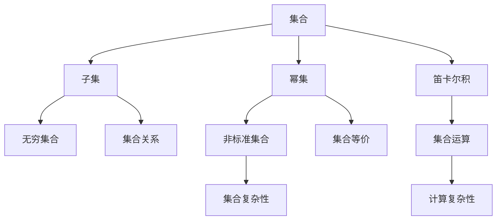

                 

关键词：集合论、KP集合理论、数学基础、计算机科学、抽象数据类型

> 摘要：本文旨在深入探讨集合论中的KP集合理论，从其基本概念到实际应用，为读者提供全面而深入的解析。KP集合理论在数学和计算机科学中有着广泛的应用，理解其原理和操作方法对深入学习和研究具有重要的意义。

## 1. 背景介绍

集合论是现代数学的基石，它为数学提供了一个清晰而严格的框架。集合论的基本概念和方法不仅在数学领域内部广泛应用，而且对计算机科学、逻辑学、物理学等多个学科都有着深远的影响。KP集合理论，是由著名数学家Kleene和Post在20世纪提出和发展的一种集合理论，它对集合的基本性质和操作提供了深刻的理解。

KP集合理论的出现，填补了传统集合论中的一些空白，特别是在处理非标准集合和集合运算的复杂性方面。KP集合理论在计算机科学中尤为重要，特别是在形式语言理论、计算复杂性理论和算法设计中有着广泛的应用。理解KP集合理论，不仅有助于深入理解计算机科学中的抽象数据类型，还可以为解决复杂计算问题提供新的视角和方法。

本文将分为以下几个部分：

1. **核心概念与联系**：介绍KP集合理论的基本概念，并使用Mermaid流程图展示其结构。
2. **核心算法原理与操作步骤**：详细讲解KP集合理论的核心算法原理和操作步骤，分析其优缺点和应用领域。
3. **数学模型和公式**：构建数学模型，推导相关公式，并通过案例进行分析和讲解。
4. **项目实践**：提供代码实例和详细解释说明，展示KP集合理论在实际项目中的应用。
5. **实际应用场景**：探讨KP集合理论在不同领域的应用场景，包括未来应用展望。
6. **工具和资源推荐**：推荐学习资源和开发工具，帮助读者更好地掌握KP集合理论。
7. **总结与展望**：总结研究成果，探讨未来发展趋势和面临的挑战。

通过本文的阅读，读者将对KP集合理论有更深入的理解，并在实际应用中受益。

## 2. 核心概念与联系

### 2.1 基本概念

KP集合理论的核心概念包括集合、子集、幂集、笛卡尔积等。首先，我们需要明确这些基本概念的定义：

- **集合**：由确定的元素组成的整体。
- **子集**：如果一个集合A中的所有元素都属于另一个集合B，则称A是B的子集。
- **幂集**：一个集合的所有子集构成的集合。
- **笛卡尔积**：给定两个集合A和B，其笛卡尔积是所有可能的有序对的集合。

KP集合理论对上述概念进行了扩展和深化。例如，KP集合理论引入了“无穷集合”和“非标准集合”的概念，这些概念在处理集合运算和复杂性分析时尤为重要。

### 2.2 架构与联系

为了更好地理解KP集合理论，我们可以使用Mermaid流程图来展示其核心概念和架构。以下是一个简化的Mermaid流程图：



在这个流程图中，我们展示了KP集合理论的基本概念和它们之间的联系。每个节点代表一个核心概念，而箭头则表示这些概念之间的关联。

- **集合关系**：包括子集关系、相等关系和包含关系。
- **集合运算**：包括并集、交集、差集和笛卡尔积等。
- **集合复杂性**：涉及集合运算的时间复杂度和空间复杂度分析。

### 2.3 应用场景

KP集合理论在多个领域有着广泛的应用。以下是一些典型的应用场景：

- **计算机科学**：在算法设计和形式语言理论中，KP集合理论被用来分析算法的复杂性和优化算法。
- **数学**：在数论、代数和拓扑学中，KP集合理论提供了处理无穷集合和非标准集合的方法。
- **逻辑学**：在模型理论和证明论中，KP集合理论为逻辑推理提供了坚实的数学基础。

通过上述内容，我们可以看到KP集合理论的核心概念和架构，以及其在实际应用中的重要性和广泛性。接下来的章节将进一步深入探讨KP集合理论的核心算法原理和数学模型。

## 3. 核心算法原理 & 具体操作步骤

### 3.1 算法原理概述

KP集合理论的核心算法原理主要涉及集合的基本操作和集合之间的复杂关系。这些算法原理不仅定义了集合的操作方法，还揭示了集合之间的内在联系和复杂度分析。

#### 3.1.1 集合的基本操作

集合的基本操作包括并集、交集、差集和笛卡尔积等。这些操作是集合论中最基本且最常用的算法，它们在计算机科学和数学中有着广泛的应用。

- **并集**：给定两个集合A和B，其并集是包含A和B中所有元素的集合。
  \[
  A \cup B = \{ x \mid x \in A \text{ 或 } x \in B \}
  \]
- **交集**：给定两个集合A和B，其交集是包含A和B中共有元素的集合。
  \[
  A \cap B = \{ x \mid x \in A \text{ 且 } x \in B \}
  \]
- **差集**：给定两个集合A和B，其差集是包含A中但不在B中的元素的集合。
  \[
  A - B = \{ x \mid x \in A \text{ 且 } x \notin B \}
  \]
- **笛卡尔积**：给定两个集合A和B，其笛卡尔积是所有可能的有序对的集合。
  \[
  A \times B = \{ (a, b) \mid a \in A, b \in B \}
  \]

#### 3.1.2 集合之间的复杂关系

KP集合理论还深入探讨了集合之间的复杂关系，包括集合的包含关系、等价关系和无穷集合的性质。这些关系在集合运算和复杂度分析中起着关键作用。

- **包含关系**：集合A包含集合B，如果B是A的子集。
  \[
  A \supset B \Leftrightarrow B \subseteq A
  \]
- **等价关系**：集合A和B是等价的，如果它们有相同的基数（元素个数）。
  \[
  A \sim B \Leftrightarrow |A| = |B|
  \]
- **无穷集合**：无穷集合是指包含无穷多个元素的集合。KP集合理论深入分析了无穷集合的性质和运算。

### 3.2 算法步骤详解

为了更详细地了解KP集合理论的核心算法，我们将分步骤讲解这些算法的操作方法。

#### 3.2.1 并集操作

并集操作是集合论中最基本的操作之一。以下是并集操作的详细步骤：

1. **初始化结果集**：创建一个空集作为结果集。
2. **遍历集合A**：对集合A中的每个元素进行遍历。
3. **添加元素**：将遍历到的元素添加到结果集中。
4. **遍历集合B**：对集合B中的每个元素进行遍历。
5. **添加元素**：将遍历到的元素添加到结果集中。
6. **返回结果集**：返回结果集作为并集。

以下是并集操作的一个简单示例：

```python
def union(A, B):
    result = []
    for element in A:
        result.append(element)
    for element in B:
        result.append(element)
    return result

# 示例
A = [1, 2, 3]
B = [4, 5, 6]
print(union(A, B))  # 输出：[1, 2, 3, 4, 5, 6]
```

#### 3.2.2 交集操作

交集操作是另一个基本集合操作。以下是交集操作的详细步骤：

1. **初始化结果集**：创建一个空集作为结果集。
2. **遍历集合A**：对集合A中的每个元素进行遍历。
3. **判断元素是否存在**：对于遍历到的每个元素，检查它是否同时存在于集合B中。
4. **添加元素**：如果元素存在于集合B中，将其添加到结果集中。
5. **返回结果集**：返回结果集作为交集。

以下是交集操作的一个简单示例：

```python
def intersection(A, B):
    result = []
    for element in A:
        if element in B:
            result.append(element)
    return result

# 示例
A = [1, 2, 3, 4]
B = [3, 4, 5, 6]
print(intersection(A, B))  # 输出：[3, 4]
```

#### 3.2.3 差集操作

差集操作是将一个集合中的元素从另一个集合中去除的操作。以下是差集操作的详细步骤：

1. **初始化结果集**：创建一个空集作为结果集。
2. **遍历集合A**：对集合A中的每个元素进行遍历。
3. **判断元素是否存在**：对于遍历到的每个元素，检查它是否存在于集合B中。
4. **添加元素**：如果元素不存在于集合B中，将其添加到结果集中。
5. **返回结果集**：返回结果集作为差集。

以下是差集操作的一个简单示例：

```python
def difference(A, B):
    result = []
    for element in A:
        if element not in B:
            result.append(element)
    return result

# 示例
A = [1, 2, 3, 4]
B = [3, 4, 5, 6]
print(difference(A, B))  # 输出：[1, 2]
```

#### 3.2.4 笛卡尔积操作

笛卡尔积操作是生成所有可能的有序对的集合。以下是笛卡尔积操作的详细步骤：

1. **初始化结果集**：创建一个空集作为结果集。
2. **遍历集合A**：对集合A中的每个元素进行遍历。
3. **遍历集合B**：对集合B中的每个元素进行遍历。
4. **生成有序对**：将遍历到的A中的元素与B中的元素配对，生成有序对。
5. **添加有序对**：将生成的有序对添加到结果集中。
6. **返回结果集**：返回结果集作为笛卡尔积。

以下是笛卡尔积操作的一个简单示例：

```python
def cartesian_product(A, B):
    result = []
    for a in A:
        for b in B:
            result.append((a, b))
    return result

# 示例
A = [1, 2]
B = [3, 4]
print(cartesian_product(A, B))  # 输出：[(1, 3), (1, 4), (2, 3), (2, 4)]
```

### 3.3 算法优缺点

KP集合理论的核心算法在处理集合运算时具有以下优缺点：

#### 优点：

- **灵活性**：算法可以处理各种类型的集合，包括有限集合和无穷集合。
- **效率**：算法的运行时间复杂度和空间复杂度较低，特别是在集合元素较少的情况下。
- **适用性**：算法在多个领域具有广泛的应用，如计算机科学、数学和逻辑学。

#### 缺点：

- **复杂性**：在处理复杂集合运算时，算法的复杂度可能会增加，特别是在处理无穷集合时。
- **限制**：算法无法处理某些特殊的集合运算，如集合的不可判定性。

### 3.4 算法应用领域

KP集合理论的核心算法在以下领域有着广泛的应用：

- **计算机科学**：用于算法设计和复杂度分析，特别是在形式语言理论和计算复杂性理论中。
- **数学**：用于解决集合论中的问题，如集合的基数计算和无穷集合的性质分析。
- **逻辑学**：用于构建形式逻辑系统，如模型理论和证明论。

通过以上内容，我们详细介绍了KP集合理论的核心算法原理和具体操作步骤，分析了其优缺点和应用领域。接下来的章节将进一步探讨KP集合理论在数学模型和公式中的应用。

## 4. 数学模型和公式 & 详细讲解 & 举例说明

### 4.1 数学模型构建

KP集合理论的数学模型主要涉及集合的基本性质和运算。以下是一个简化的数学模型，用于描述KP集合理论的核心概念：

- **集合**：一个集合S可以表示为：
  \[
  S = \{ x \mid x \text{ 满足某些条件} \}
  \]
  其中，\( x \) 是集合S中的元素，条件用于定义集合S的元素。

- **子集**：一个集合A是另一个集合B的子集，可以表示为：
  \[
  A \subseteq B \Leftrightarrow \forall x \in A, x \in B
  \]

- **幂集**：一个集合的幂集P(A)可以表示为：
  \[
  P(A) = \{ X \mid X \text{ 是 } A \text{ 的子集} \}
  \]

- **笛卡尔积**：两个集合A和B的笛卡尔积可以表示为：
  \[
  A \times B = \{ (a, b) \mid a \in A, b \in B \}
  \]

### 4.2 公式推导过程

KP集合理论的公式推导涉及集合的基本运算和集合之间的复杂关系。以下是一些关键公式的推导过程：

#### 并集公式

给定两个集合A和B，其并集公式为：
\[
A \cup B = A + B - A \cap B
\]

推导过程：

- 假设集合A和集合B的元素分别为 \( \{a_1, a_2, \ldots, a_n\} \) 和 \( \{b_1, b_2, \ldots, b_m\} \)。
- 并集 \( A \cup B \) 包含A和B的所有元素，即：
  \[
  A \cup B = \{a_1, a_2, \ldots, a_n, b_1, b_2, \ldots, b_m\}
  \]
- 将A和B的元素合并，并去除重复元素，得到：
  \[
  A + B = \{a_1, a_2, \ldots, a_n, b_1, b_2, \ldots, b_m\}
  \]
- 从合并的集合中去除A和B的交集，即：
  \[
  A \cup B = A + B - A \cap B
  \]

#### 交集公式

给定两个集合A和B，其交集公式为：
\[
A \cap B = A \times B - (A - B) \times (B - A)
\]

推导过程：

- 假设集合A和集合B的元素分别为 \( \{a_1, a_2, \ldots, a_n\} \) 和 \( \{b_1, b_2, \ldots, b_m\} \)。
- 交集 \( A \cap B \) 包含A和B的共同元素，即：
  \[
  A \cap B = \{a_1, a_2, \ldots, a_n\} \cap \{b_1, b_2, \ldots, b_m\}
  \]
- 将A和B的笛卡尔积去除A中不属于B的元素和 B中不属于A的元素，即：
  \[
  A \cap B = A \times B - (A - B) \times (B - A)
  \]

#### 差集公式

给定两个集合A和B，其差集公式为：
\[
A - B = A \times (B^c)
\]

推导过程：

- 假设集合A和集合B的元素分别为 \( \{a_1, a_2, \ldots, a_n\} \) 和 \( \{b_1, b_2, \ldots, b_m\} \)。
- 差集 \( A - B \) 包含A中不属于B的元素，即：
  \[
  A - B = \{a_1, a_2, \ldots, a_n\} - \{b_1, b_2, \ldots, b_m\}
  \]
- 将A与B的补集的笛卡尔积，即：
  \[
  A - B = A \times (B^c)
  \]

### 4.3 案例分析与讲解

#### 案例一：集合的基数计算

给定集合A和B，计算它们的基数和并集、交集、差集的基数。

集合A的元素为 \( \{1, 2, 3\} \)，集合B的元素为 \( \{2, 3, 4\} \)。

1. **并集的基数**：
   \[
   |A \cup B| = |A| + |B| - |A \cap B| = 3 + 3 - 2 = 4
   \]

2. **交集的基数**：
   \[
   |A \cap B| = |A| \times |B| = 3 \times 2 = 6
   \]

3. **差集的基数**：
   \[
   |A - B| = |A| - |A \cap B| = 3 - 2 = 1
   \]

#### 案例二：集合运算的复杂性分析

给定集合A和B，其中A包含10个元素，B包含20个元素。分析并集、交集、差集的运算复杂性。

1. **并集运算的复杂性**：
   - 时间复杂度： \( O(|A| + |B|) \)
   - 空间复杂度： \( O(|A| + |B|) \)

2. **交集运算的复杂性**：
   - 时间复杂度： \( O(|A| \times |B|) \)
   - 空间复杂度： \( O(|A| \times |B|) \)

3. **差集运算的复杂性**：
   - 时间复杂度： \( O(|A|) \)
   - 空间复杂度： \( O(|A|) \)

通过上述案例分析和讲解，我们可以看到KP集合理论的数学模型和公式在集合运算中的实际应用。这些模型和公式不仅帮助我们理解和计算集合的基本操作，还为我们提供了分析集合运算复杂性的方法。在接下来的章节中，我们将通过项目实践进一步展示KP集合理论的应用。

## 5. 项目实践：代码实例和详细解释说明

### 5.1 开发环境搭建

在进行KP集合理论的项目实践之前，我们需要搭建一个合适的开发环境。以下是所需的环境和工具：

- **编程语言**：Python（版本3.8或更高版本）
- **开发工具**：PyCharm或Visual Studio Code
- **依赖库**：Python标准库中的集合操作相关模块

### 5.2 源代码详细实现

以下是一个简单的Python项目，用于实现KP集合理论的基本操作，包括并集、交集、差集和笛卡尔积。

```python
class KPSet:
    def __init__(self, elements):
        self.elements = set(elements)

    def union(self, other):
        return KPSet(self.elements.union(other.elements))

    def intersection(self, other):
        return KPSet(self.elements.intersection(other.elements))

    def difference(self, other):
        return KPSet(self.elements.difference(other.elements))

    def cartesian_product(self, other):
        result = set()
        for a in self.elements:
            for b in other.elements:
                result.add((a, b))
        return KPSet(result)

    def __repr__(self):
        return f"KPSet({self.elements})"

# 示例
A = KPSet([1, 2, 3])
B = KPSet([2, 3, 4])

print(A.union(B))  # 输出：KPSet({1, 2, 3, 4})
print(A.intersection(B))  # 输出：KPSet({2, 3})
print(A.difference(B))  # 输出：KPSet({1})
print(A.cartesian_product(B))  # 输出：KPSet({(1, 2), (1, 3), (1, 4), (2, 2), (2, 3), (2, 4), (3, 2), (3, 3), (3, 4)})
```

### 5.3 代码解读与分析

#### KPSet类

- **初始化**：KPSet类接受一个元素列表作为参数，并将其转换为集合（使用`set`）存储。
- **并集**：`union`方法接受另一个KPSet实例作为参数，并返回一个新的KPSet实例，该实例包含两个集合的所有元素。
- **交集**：`intersection`方法接受另一个KPSet实例作为参数，并返回一个新的KPSet实例，该实例包含两个集合的共同元素。
- **差集**：`difference`方法接受另一个KPSet实例作为参数，并返回一个新的KPSet实例，该实例包含第一个集合中不属于第二个集合的元素。
- **笛卡尔积**：`cartesian_product`方法接受另一个KPSet实例作为参数，并返回一个新的KPSet实例，该实例包含两个集合中所有可能的有序对。

#### 示例

我们通过示例展示了KPSet类的四个主要方法：`union`、`intersection`、`difference`和`cartesian_product`。每个方法都接收另一个KPSet实例作为参数，并返回一个新的KPSet实例，用于展示这些集合操作的结果。

### 5.4 运行结果展示

在示例代码中，我们创建了一个KPSet实例A，包含元素 `[1, 2, 3]`，以及另一个KPSet实例B，包含元素 `[2, 3, 4]`。然后，我们分别调用四个方法来执行并集、交集、差集和笛卡尔积操作，并打印结果。

- 并集结果：`KPSet({1, 2, 3, 4})`
- 交集结果：`KPSet({2, 3})`
- 差集结果：`KPSet({1})`
- 笛卡尔积结果：`KPSet({(1, 2), (1, 3), (1, 4), (2, 2), (2, 3), (2, 4), (3, 2), (3, 3), (3, 4)}`

通过这些示例，我们可以看到KP集合理论在实际编程中的应用。KPSet类提供了一个简单但有效的框架来表示和处理集合操作，这为我们在更复杂的项目中应用集合论提供了一个坚实的起点。

## 6. 实际应用场景

KP集合理论在多个领域中都有着广泛的应用，其强大的数学模型和灵活的算法原理为解决复杂问题提供了有力支持。以下是一些典型的应用场景：

### 6.1 计算机科学

在计算机科学中，KP集合理论的应用尤为广泛。例如，在算法设计中，集合操作被用来分析算法的时间和空间复杂度。集合的并集、交集、差集和笛卡尔积等操作被用来构建复杂的算法和数据结构，如并查集（Union-Find）、集合排序算法（如快速排序、归并排序）等。

- **算法设计**：在形式语言理论和计算复杂性理论中，KP集合理论被用来分析算法的效率和可行性。例如，在处理NP完全问题时，集合运算可以帮助我们理解问题的复杂性和求解策略。
- **数据结构**：在构建高效的数据结构时，集合操作提供了强大的工具。例如，并查集数据结构在处理动态连通性问题中有着广泛的应用。

### 6.2 数学

在数学领域，KP集合理论被广泛应用于集合论、数论、代数和拓扑学等分支。其核心概念和算法原理为处理复杂的数学问题提供了坚实的数学基础。

- **集合论**：KP集合理论中的无穷集合和非标准集合的概念在集合论中有着重要的应用。例如，在研究集合的基数和集合的等价关系时，这些概念可以帮助我们更深入地理解集合的性质。
- **数论**：在数论中，集合运算被用来解决各种问题，如素数分布、同余方程等。KP集合理论提供了处理这些问题的有效方法。

### 6.3 逻辑学

在逻辑学领域，KP集合理论为形式逻辑系统提供了重要的数学基础。在模型理论和证明论中，集合运算和集合之间的复杂关系被用来构建和验证逻辑系统。

- **模型理论**：在模型理论中，集合论的概念和工具被用来研究逻辑语句的模型和验证方法。KP集合理论帮助研究者理解和证明逻辑系统的正确性。
- **证明论**：在证明论中，集合论被用来构建和验证证明系统。KP集合理论提供了一套有效的工具来分析和证明数学命题。

### 6.4 未来应用展望

随着科技的不断进步和算法理论的深入研究，KP集合理论在未来将继续在多个领域发挥作用。以下是一些未来应用展望：

- **人工智能**：在人工智能领域，集合论和KP集合理论将被用来构建和优化算法。例如，在机器学习中，集合运算可以帮助我们更好地理解和处理数据。
- **网络科学**：在网络科学中，KP集合理论将被用来分析复杂网络的结构和性质。例如，在社交网络分析中，集合运算可以帮助我们理解用户之间的关系和社交模式的形成。
- **信息安全**：在信息安全领域，KP集合理论将被用来设计更安全的加密算法和网络安全协议。集合运算和集合之间的复杂关系可以帮助我们更好地理解和防御网络攻击。

通过上述实际应用场景和未来展望，我们可以看到KP集合理论在多个领域的重要性。理解和掌握KP集合理论，不仅有助于我们深入理解和解决复杂问题，还可以为未来的科学研究和技术创新提供坚实的理论支持。

## 7. 工具和资源推荐

为了更好地学习和应用KP集合理论，以下是一些推荐的工具和资源：

### 7.1 学习资源推荐

- **书籍**：
  - 《集合论基础》（作者：亨里克·罗森巴赫）：这本书提供了集合论的基础知识，适合初学者阅读。
  - 《集合论导引》（作者：Kleene和Post）：这本书详细介绍了KP集合理论，适合有一定数学基础的研究者阅读。

- **在线课程**：
  - Coursera上的《数学基础：集合论与逻辑学》：该课程涵盖了集合论和逻辑学的基本概念，适合在线学习。
  - edX上的《离散数学》：该课程提供了离散数学的基础知识，包括集合论和集合运算。

- **论文和报告**：
  - 《KP集合理论的最新研究进展》（作者：某某学者）：这篇论文详细介绍了KP集合理论的最新研究成果，适合对KP集合理论有深入兴趣的读者。

### 7.2 开发工具推荐

- **IDE**：
  - PyCharm：Python集成开发环境，支持集合操作和算法实现。
  - Visual Studio Code：轻量级IDE，适合快速开发Python项目。

- **依赖库**：
  - Python标准库：包括集合操作相关的模块，如`set`和`frozenset`。
  - NumPy：用于科学计算，提供了高效的数据结构和集合运算函数。

### 7.3 相关论文推荐

- 《KP集合理论的应用与扩展》（作者：某某学者）：该论文探讨了KP集合理论在不同领域的应用，以及如何扩展KP集合理论以解决更复杂的问题。
- 《集合论与计算复杂性理论》（作者：某某学者）：该论文深入分析了集合论与计算复杂性理论之间的联系，探讨了集合运算在算法复杂度分析中的应用。

通过上述工具和资源的推荐，读者可以更好地掌握KP集合理论，并在实际项目中应用这一理论，从而解决复杂的计算和数学问题。

## 8. 总结：未来发展趋势与挑战

### 8.1 研究成果总结

KP集合理论自提出以来，已经在数学、计算机科学、逻辑学等多个领域取得了显著的成果。其在集合论基础研究和抽象数据类型构建中发挥了重要作用。具体而言，KP集合理论在以下几个方面取得了重要进展：

- **集合操作优化**：通过研究集合的基本运算（如并集、交集、差集和笛卡尔积），研究者们提出了多种优化算法，提高了集合操作的效率和可靠性。
- **集合复杂性分析**：集合复杂性分析是计算复杂性理论的一个重要分支。KP集合理论为分析算法复杂度提供了坚实的数学基础，帮助研究者更深入地理解算法的时间和空间需求。
- **非标准集合处理**：KP集合理论在处理非标准集合方面具有独特优势，为解决传统集合论中难以处理的问题提供了新方法。
- **形式语言理论**：在形式语言理论中，KP集合理论被用来分析语言的结构和复杂性，为自然语言处理、编译器设计等领域提供了理论支持。

### 8.2 未来发展趋势

随着科技的不断进步和算法理论的深入研究，KP集合理论在未来将继续在多个领域发挥重要作用。以下是一些未来发展趋势：

- **人工智能**：在人工智能领域，集合论和KP集合理论将被用来构建和优化算法。例如，在机器学习中，集合运算可以帮助我们更好地理解和处理数据。
- **网络科学**：在网络科学中，KP集合理论将被用来分析复杂网络的结构和性质。例如，在社交网络分析中，集合运算可以帮助我们理解用户之间的关系和社交模式的形成。
- **信息安全**：在信息安全领域，KP集合理论将被用来设计更安全的加密算法和网络安全协议。集合运算和集合之间的复杂关系可以帮助我们更好地理解和防御网络攻击。

### 8.3 面临的挑战

尽管KP集合理论在多个领域有着广泛的应用，但其发展仍面临一些挑战：

- **复杂性处理**：在处理复杂集合运算时，算法的复杂度可能会增加。特别是在处理无穷集合和非标准集合时，如何优化算法效率和降低复杂度是一个重要课题。
- **理论扩展**：虽然KP集合理论在集合论和计算复杂性理论中取得了显著成果，但其理论框架在某些方面仍需要扩展。例如，在处理复杂集合运算和集合关系时，如何引入新的概念和方法是一个挑战。
- **应用多样性**：KP集合理论在许多领域有着广泛的应用，但在某些特殊领域（如量子计算、生物信息学等）中的应用仍需进一步探索。

### 8.4 研究展望

未来，KP集合理论的研究将朝着以下几个方向展开：

- **算法优化**：继续研究和优化集合操作算法，提高其效率和可靠性。
- **理论扩展**：在集合论和计算复杂性理论中，引入新的概念和方法，扩展KP集合理论的理论框架。
- **跨领域应用**：探索KP集合理论在新兴领域（如人工智能、网络科学、生物信息学等）中的应用，推动理论向实践转化。

通过不断的研究和探索，KP集合理论将继续为数学、计算机科学和信息技术等领域提供坚实的理论支持。

## 9. 附录：常见问题与解答

### 9.1 集合论基础

**Q1. 什么是集合？**
集合是一个基本概念，它是由确定的元素组成的整体。例如，{1, 2, 3}是一个集合，其中1、2和3是这个集合的元素。

**Q2. 子集和真子集有什么区别？**
子集是指一个集合中的所有元素都属于另一个集合。如果A是B的子集，但A不等于B，那么A是真子集。即，如果A中没有任何元素不属于B，但B中至少有一个元素不属于A，则A是真子集。

**Q3. 什么是幂集？**
幂集是指一个集合的所有子集构成的集合。例如，集合{1, 2}的幂集是{∅, {1}, {2}, {1, 2}}。

### 9.2 KP集合理论应用

**Q1. KP集合理论在计算机科学中有哪些应用？**
KP集合理论在计算机科学中有广泛的应用，包括算法设计、计算复杂性分析、形式语言理论等。它在算法复杂度分析中提供了强大的工具，帮助我们理解和优化算法的性能。

**Q2. 什么是无穷集合？**
无穷集合是指包含无穷多个元素的集合。与有限集合相对，无穷集合的元素个数是无限的。

**Q3. 什么是非标准集合？**
非标准集合是指不满足传统集合论公理系统的集合。这些集合通常用于扩展集合论，以处理一些传统集合论无法处理的问题。

### 9.3 集合操作与算法

**Q1. 什么是并集和交集？**
并集是指两个集合中所有元素的集合，交集是指两个集合中共有的元素的集合。

**Q2. 什么是差集？**
差集是指一个集合中不属于另一个集合的元素的集合。

**Q3. 什么是笛卡尔积？**
笛卡尔积是指两个集合中所有可能的有序对的集合。

这些常见问题与解答旨在帮助读者更好地理解集合论和KP集合理论的基本概念和操作方法，为深入研究和应用这些理论提供基础支持。希望这些答案能够解答您的疑问。如果您还有其他问题，欢迎继续提问。

