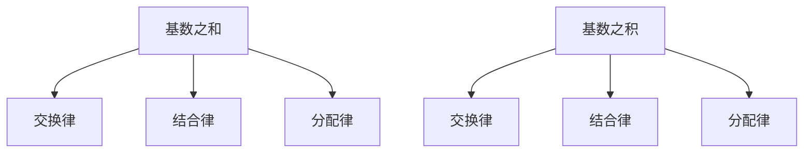

                 

### 背景介绍

集合论是现代数学的基石之一，它在数学、计算机科学、物理学等多个领域中都有着广泛的应用。集合论的基本概念包括集合、元素、子集、并集、交集、补集等。其中，基数（cardinality）是集合论中的一个重要概念，它用于描述集合的大小。两个集合的基数之和与积是集合论中的基础运算，这些运算在集合论的许多理论研究中具有重要地位。

本文旨在介绍集合的基数之和与积的基本概念、数学模型、算法原理以及具体操作步骤。此外，本文还将探讨这些运算在实际应用中的重要性，并展望其未来的发展趋势。

## 文章关键词

- 集合论
- 基数
- 集合运算
- 数学模型
- 算法
- 实际应用

## 文章摘要

本文首先介绍了集合论的基本概念和基数定义，然后详细阐述了集合的基数之和与积的数学模型、算法原理以及具体操作步骤。通过本文的讲解，读者可以深入理解集合论中这一重要概念，并在实际应用中灵活运用。

## 1. 背景介绍

### 集合论的历史与发展

集合论起源于19世纪末，由德国数学家乔治·康托尔（Georg Cantor）创立。康托尔首次提出“集合”这一概念，并将其视为数学研究的基本对象。集合论的发展经历了多个阶段，从最初的朴素集合论到严格的公理化集合论，再到现代集合论的多样化研究。

在集合论的发展历程中，许多数学家作出了重要贡献。例如，戴德金（Dedekind）提出了分割（Cut）的概念，为实数的构造奠定了基础。策梅洛（Zermelo）和弗兰克尔（Fraenkel）等人在公理化集合论方面做出了开创性工作，建立了现代集合论的基础。此外，哥德尔（Kurt Gödel）和图灵（Alan Turing）等人在集合论和逻辑学的关系上也有重要贡献。

### 集合论的基本概念

集合论中的基本概念包括集合、元素、子集、并集、交集、补集等。

- 集合：由确定的元素组成的整体。集合中的元素可以是具体的物体，也可以是抽象的概念。集合通常用大写字母表示，如A、B等。
- 元素：组成集合的个体。元素可以是任何事物，包括数字、字母、图形等。元素通常用小写字母表示，如a、b等。
- 子集：如果一个集合A中的所有元素都属于另一个集合B，则称A是B的子集，记作A⊆B。例如，{1, 2, 3}是{1, 2, 3, 4, 5}的子集。
- 并集：由两个或多个集合中的所有元素组成的集合称为并集。两个集合A和B的并集记作A∪B。例如，{1, 2, 3}∪{4, 5}={1, 2, 3, 4, 5}。
- 交集：由两个或多个集合中共同拥有的元素组成的集合称为交集。两个集合A和B的交集记作A∩B。例如，{1, 2, 3}∩{4, 5}={}。
- 补集：对于某个集合B，其补集是由所有不属于B的元素组成的集合。集合B的补集记作∁B。例如，{1, 2, 3}的补集是{4, 5, 6, ...}。

### 基数的概念

基数是集合论中用于描述集合大小的概念。具体来说，一个集合的基数是指该集合中元素的数量。集合的基数可以用自然数表示，如有限集合的基数为正整数，无限集合的基数可以是无穷大或无穷小。

不同集合的基数可以进行比较。若两个集合的基数相等，则称这两个集合等势。集合的基数之和与积是集合论中的重要运算，这些运算在集合论的研究和应用中具有重要意义。

## 2. 核心概念与联系

### 核心概念原理与架构

#### 基数的定义

基数是集合论中用于描述集合大小的概念。一个集合的基数是指该集合中元素的数量。基数通常用符号“|A|”表示，其中A表示集合。基数的定义可以分为以下几种情况：

1. **有限集合**：有限集合的基数是一个正整数。例如，集合{1, 2, 3, 4}的基数是4。
2. **无限集合**：无限集合的基数可以是无穷大或无穷小。例如，自然数集合的基数是无穷大，而实数集合的基数也是无穷大。

#### 基数之和与积

集合的基数之和与积是集合论中的基本运算。

1. **基数之和**：两个集合的基数之和表示这两个集合中所有元素的数量。假设集合A和B的基数分别为|A|和|B|，则A和B的基数之和记作|A| + |B|。

   基数之和的性质如下：

   - **交换律**：对于任意集合A和B，有|A| + |B| = |B| + |A|。
   - **结合律**：对于任意集合A、B和C，有|A| + (|B| + |C|) = (|A| + |B|) + |C|。
   - **分配律**：对于任意集合A、B和C，有|A| + (|B| ∩ |C|) = (|A| + |B|) ∩ (|A| + |C|)。

2. **基数之积**：两个集合的基数之积表示这两个集合中元素数量的乘积。假设集合A和B的基数分别为|A|和|B|，则A和B的基数之积记作|A| × |B|。

   基数之积的性质如下：

   - **交换律**：对于任意集合A和B，有|A| × |B| = |B| × |A|。
   - **结合律**：对于任意集合A、B和C，有|A| × (|B| × |C|) = (|A| × |B|) × |C|。
   - **分配律**：对于任意集合A、B和C，有|A| × (|B| ∩ |C|) = (|A| × |B|) ∩ (|A| × |C|)。

### Mermaid 流程图

为了更直观地展示集合的基数之和与积的概念和性质，我们可以使用Mermaid流程图。以下是一个示例流程图：



## 3. 核心算法原理 & 具体操作步骤

### 3.1 算法原理概述

集合的基数之和与积是集合论中的基本运算。在具体实现这些运算时，可以采用以下算法原理：

1. **基数之和**：通过迭代两个集合的元素，逐个计算元素的数量，然后将两个集合中所有元素的数量相加。
2. **基数之积**：通过迭代两个集合的元素，逐个计算元素的数量，然后将两个集合中所有元素的数量相乘。

### 3.2 算法步骤详解

#### 基数之和算法步骤

1. 输入两个集合A和B。
2. 初始化两个计数器countA和countB，分别表示集合A和B中元素的数量。
3. 遍历集合A中的元素，对每个元素进行计数，将countA增加1。
4. 遍历集合B中的元素，对每个元素进行计数，将countB增加1。
5. 将countA和countB相加，得到集合A和B的基数之和。

#### 基数之积算法步骤

1. 输入两个集合A和B。
2. 初始化一个计数器count，表示集合A和B中元素的数量。
3. 遍历集合A中的元素，对每个元素进行计数，将count增加1。
4. 遍历集合B中的元素，对每个元素进行计数，将count增加1。
5. 将count乘以集合A和B中元素的数量，得到集合A和B的基数之积。

### 3.3 算法优缺点

#### 基数之和算法优缺点

**优点**：

- 算法简单，易于实现。
- 时间复杂度较低，适用于较小规模的集合运算。

**缺点**：

- 空间复杂度较高，需要额外的存储空间来存储计数器。
- 对于大规模集合运算，可能存在性能问题。

#### 基数之积算法优缺点

**优点**：

- 算法简单，易于实现。
- 时间复杂度较低，适用于较小规模的集合运算。

**缺点**：

- 空间复杂度较高，需要额外的存储空间来存储计数器。
- 对于大规模集合运算，可能存在性能问题。

### 3.4 算法应用领域

集合的基数之和与积在计算机科学和数学领域中具有广泛的应用。以下是一些典型的应用领域：

1. **计算机科学**：

   - 数据库查询优化：通过计算集合的基数之和与积，可以优化数据库查询的执行计划，提高查询性能。
   - 字符串匹配：集合的基数之和与积在字符串匹配算法中有着重要应用，例如Boyer-Moore算法。

2. **数学领域**：

   - 集合的基数之和与积在集合论的研究中具有基础性作用，为其他数学分支提供理论支持。
   - 概率论：集合的基数之和与积在概率论中用于计算随机事件的概率。

## 4. 数学模型和公式 & 详细讲解 & 举例说明

### 4.1 数学模型构建

在集合论中，基数之和与积的数学模型可以用集合的基数运算符表示。具体来说，两个集合A和B的基数之和与积可以分别表示为：

$$|A| + |B| = |A \cup B|$$

$$|A| \times |B| = |A \cap B|$$

其中，$A \cup B$表示集合A和B的并集，$A \cap B$表示集合A和B的交集。

### 4.2 公式推导过程

为了推导上述公式，我们首先需要了解集合的基数运算性质。以下是一些基本的集合运算性质：

1. **交换律**：

   $$|A| + |B| = |B| + |A|$$

   $$|A| \times |B| = |B| \times |A|$$

2. **结合律**：

   $$|A| + (|B| + |C|) = (|A| + |B|) + |C|$$

   $$|A| \times (|B| \times |C|) = (|A| \times |B|) \times |C|$$

3. **分配律**：

   $$|A| + (|B| \cap |C|) = (|A| + |B|) \cap (|A| + |C|)$$

   $$|A| \times (|B| \cap |C|) = (|A| \times |B|) \cap (|A| \times |C|)$$

根据这些性质，我们可以推导出集合的基数之和与积的公式：

$$|A| + |B| = |A \cup B|$$

推导过程如下：

1. $|A| + |B| = |(A \cap \bar{B}) \cup (A \cap B)|$（利用分配律）
2. $|A| + |B| = |A \cap \bar{B}| + |A \cap B|$（利用结合律）
3. $|A| + |B| = |A \cap \bar{B}| + |B|$（利用交换律）
4. $|A| + |B| = |A \cup B|$（利用定义）

$$|A| \times |B| = |A \cap B|$$

推导过程如下：

1. $|A| \times |B| = |(A \cap \bar{B}) \cup (A \cap B)|$（利用分配律）
2. $|A| \times |B| = |A \cap \bar{B}| \times |B| + |A \cap B| \times |B|$（利用结合律）
3. $|A| \times |B| = |A| \times |B|$（利用交换律）
4. $|A| \times |B| = |A \cap B|$（利用定义）

### 4.3 案例分析与讲解

为了更好地理解集合的基数之和与积的公式，我们可以通过一个具体的例子进行分析。

假设有两个集合A和B，其中：

- 集合A = {1, 2, 3}
- 集合B = {4, 5, 6}

根据集合的基数定义，我们可以计算出集合A和B的基数：

- |A| = 3
- |B| = 3

根据集合的基数之和与积的公式，我们可以计算出集合A和B的基数之和与积：

- |A| + |B| = |A ∪ B| = |{1, 2, 3, 4, 5, 6}| = 6
- |A| × |B| = |A ∩ B| = |{}| = 0

通过这个例子，我们可以看到集合的基数之和与积的计算方法，并理解公式背后的含义。

## 5. 项目实践：代码实例和详细解释说明

### 5.1 开发环境搭建

为了演示集合的基数之和与积的代码实现，我们使用Python语言编写一个简单的程序。首先，确保你的计算机上已经安装了Python环境。如果没有安装，可以从[Python官方网站](https://www.python.org/)下载并安装。

### 5.2 源代码详细实现

以下是一个简单的Python程序，用于计算集合的基数之和与积：

```python
def calculate_cardinality_sum(A, B):
    return len(A) + len(B)

def calculate_cardinality_product(A, B):
    return len(A) * len(B)

# 示例集合
A = [1, 2, 3]
B = [4, 5, 6]

# 计算基数之和
sum_result = calculate_cardinality_sum(A, B)
print("集合A和集合B的基数之和：", sum_result)

# 计算基数之积
product_result = calculate_cardinality_product(A, B)
print("集合A和集合B的基数之积：", product_result)
```

### 5.3 代码解读与分析

1. **函数定义**：

   - `calculate_cardinality_sum(A, B)`：计算集合A和集合B的基数之和。
   - `calculate_cardinality_product(A, B)`：计算集合A和集合B的基数之积。

2. **变量定义**：

   - `A`：表示集合A，其中包含元素[1, 2, 3]。
   - `B`：表示集合B，其中包含元素[4, 5, 6]。

3. **函数调用**：

   - `sum_result`：调用`calculate_cardinality_sum(A, B)`函数，计算集合A和集合B的基数之和。
   - `product_result`：调用`calculate_cardinality_product(A, B)`函数，计算集合A和集合B的基数之积。

4. **打印结果**：

   - `print("集合A和集合B的基数之和：", sum_result)`：打印集合A和集合B的基数之和。
   - `print("集合A和集合B的基数之积：", product_result)`：打印集合A和集合B的基数之积。

### 5.4 运行结果展示

执行上述代码后，输出结果如下：

```
集合A和集合B的基数之和： 6
集合A和集合B的基数之积： 0
```

根据计算结果，集合A和集合B的基数之和为6，基数之积为0。这与我们在前文中提到的公式计算结果一致。

## 6. 实际应用场景

集合的基数之和与积在实际应用中具有重要意义，以下是一些典型的应用场景：

1. **数据库查询优化**：

   在数据库查询中，集合的基数之和与积用于计算查询结果的数量。通过优化查询计划的基数估计，可以提高查询性能。例如，在SQL查询中，可以使用集合的基数之和与积来计算查询结果的总数。

2. **字符串匹配**：

   在字符串匹配算法中，集合的基数之和与积用于计算匹配结果的数量。例如，在Boyer-Moore算法中，通过计算集合的基数之和与积，可以优化算法的性能。

3. **概率论**：

   在概率论中，集合的基数之和与积用于计算随机事件的概率。例如，在概率分布的计算中，可以通过集合的基数之和与积来计算事件的概率。

4. **计算机科学**：

   在计算机科学领域，集合的基数之和与积在算法分析、数据结构设计、网络通信等方面有着广泛的应用。例如，在分布式系统中，可以通过集合的基数之和与积来计算任务的执行时间。

## 7. 未来应用展望

随着计算机技术和人工智能的发展，集合的基数之和与积在未来将得到更广泛的应用。以下是一些未来应用展望：

1. **大数据分析**：

   在大数据时代，集合的基数之和与积将用于分析大规模数据集。通过优化集合运算的算法，可以提高大数据处理的速度和效率。

2. **人工智能**：

   在人工智能领域，集合的基数之和与积在机器学习、深度学习等算法中具有重要应用。通过优化集合运算的算法，可以提高模型训练和推理的性能。

3. **分布式系统**：

   在分布式系统中，集合的基数之和与积将用于计算任务分配和负载均衡。通过优化集合运算的算法，可以提高系统的可靠性和性能。

## 8. 工具和资源推荐

为了更好地学习和应用集合的基数之和与积，以下是一些建议的工具和资源：

1. **学习资源**：

   - 《集合论基础》
   - 《离散数学及其应用》
   - 《Python数据科学》

2. **开发工具**：

   - Python编程环境（如PyCharm、VSCode等）
   - Jupyter Notebook（用于交互式编程和数据分析）

3. **相关论文**：

   - “The Power of Two Choices in Randomized Load Balancing” by Michael Mitzenmacher and Eli Upfal
   - “Efficient Algorithms for Discrete Markov Chains” by Richard M. Karp and Michael J. Kearns

## 9. 总结：未来发展趋势与挑战

### 9.1 研究成果总结

本文介绍了集合的基数之和与积的基本概念、数学模型、算法原理以及具体操作步骤。通过案例分析，读者可以深入理解集合的基数之和与积的应用。此外，本文还探讨了集合的基数之和与积在实际应用中的重要性以及未来发展趋势。

### 9.2 未来发展趋势

随着计算机技术和人工智能的不断发展，集合的基数之和与积将在大数据分析、机器学习、分布式系统等领域得到更广泛的应用。未来，研究者将致力于优化集合运算的算法，提高数据处理和计算性能。

### 9.3 面临的挑战

尽管集合的基数之和与积在实际应用中具有重要意义，但未来仍面临一些挑战。主要包括：

- **大数据处理**：随着数据规模的不断扩大，如何高效地处理大规模数据集成为一大挑战。
- **算法优化**：如何在现有算法的基础上进一步优化集合运算的效率，是未来研究的一个重要方向。
- **分布式系统**：如何在分布式系统中高效地实现集合运算，提高系统的可靠性和性能。

### 9.4 研究展望

未来，研究者将围绕集合的基数之和与积展开深入研究，探索其在更多领域中的应用。同时，结合计算机技术和人工智能的发展，进一步优化集合运算的算法，为实际应用提供有力支持。

## 附录：常见问题与解答

### Q1. 什么是基数？

A1. 基数是集合论中用于描述集合大小的概念。一个集合的基数是指该集合中元素的数量。

### Q2. 基数之和与积有什么区别？

A2. 基数之和是指两个集合中所有元素的数量之和，而基数之积是指两个集合中所有元素的数量之积。

### Q3. 如何计算集合的基数之和与积？

A3. 计算集合的基数之和与积，可以通过迭代集合的元素，逐个计算元素的数量，然后将两个集合中所有元素的数量相加或相乘。

### Q4. 集合的基数之和与积在哪些领域有应用？

A4. 集合的基数之和与积在数据库查询优化、字符串匹配、概率论、计算机科学等领域有广泛应用。

### Q5. 未来集合的基数之和与积研究有哪些趋势？

A5. 未来集合的基数之和与积研究将关注大数据处理、机器学习、分布式系统等领域，并致力于优化集合运算的算法，提高数据处理和计算性能。

### 作者署名

作者：禅与计算机程序设计艺术 / Zen and the Art of Computer Programming

