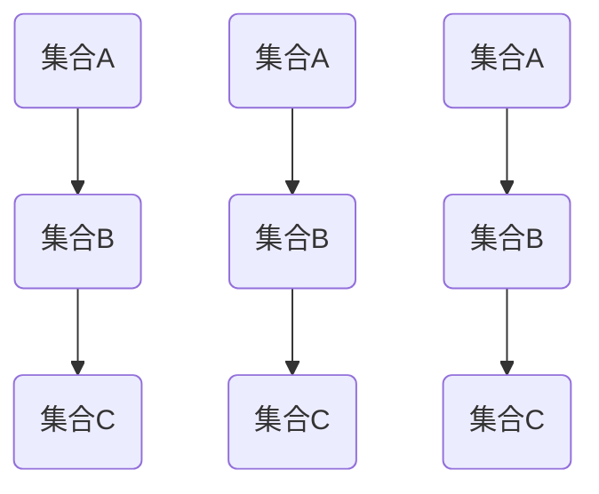

                 

关键词：集合论、基数、无穷乘积、数学模型、算法、计算机科学

摘要：本文将探讨集合论中关于基数无穷乘积的概念及其在计算机科学中的应用。通过对集合的基本概念和无穷乘积的深入分析，本文旨在揭示其在理论研究和实际应用中的重要性。

## 1. 背景介绍

集合论是现代数学的基石，它在数学的各个分支中发挥着重要作用。集合论的基本概念包括集合、元素、子集、笛卡尔积等。在这些概念的基础上，我们可以进一步探讨集合的性质、关系和运算。

无穷乘积是集合论中的一个重要概念，它涉及到集合的无穷多个元素之间的乘积运算。在计算机科学中，无穷乘积的思想被广泛应用于算法设计、数据结构分析和分布式系统等领域。

本文将首先回顾集合论的基本概念，然后深入探讨无穷乘积的定义、性质和计算方法。接着，我们将介绍无穷乘积在计算机科学中的应用实例，最后对未来在该领域的发展趋势进行展望。

## 2. 核心概念与联系

为了更好地理解无穷乘积，我们首先需要回顾集合论中的基本概念。

### 2.1 集合的基本概念

- **集合**：集合是由确定的元素构成的集合。形式化地，集合$A$可以表示为$A = \{x | P(x)\}$，其中$P(x)$是一个谓词，表示$x$是否属于集合$A$。

- **元素**：集合中的每个对象称为元素。例如，集合$A = \{1, 2, 3\}$中的元素分别是1、2和3。

- **子集**：如果集合$B$中的所有元素都是集合$A$中的元素，则称$B$是$A$的子集，记作$B \subseteq A$。

- **笛卡尔积**：两个集合$A$和$B$的笛卡尔积是一个由所有可能的有序对$(a, b)$构成的集合，其中$a \in A$且$b \in B$。记作$A \times B$。

### 2.2 无穷乘积的定义

无穷乘积是指集合的无穷多个元素之间的乘积运算。形式化地，设$\{A_i\}_{i=1}^{\infty}$是一系列集合，其无穷乘积$A$可以表示为：

$$
A = \prod_{i=1}^{\infty} A_i = \{(a_1, a_2, a_3, \ldots) | a_i \in A_i \text{ for all } i\}
$$

其中，$(a_1, a_2, a_3, \ldots)$是一个无穷序列，每个$a_i$都属于对应的集合$A_i$。

### 2.3 无穷乘积的性质

无穷乘积具有以下性质：

- **封闭性**：无穷乘积的结果仍然是集合。

- **交换律**：对于任意两个集合$A$和$B$，$A \times B = B \times A$。

- **结合律**：对于任意三个集合$A$、$B$和$C$，$(A \times B) \times C = A \times (B \times C)$。

- **分配律**：对于任意三个集合$A$、$B$和$C$，$A \times (B \cup C) = (A \times B) \cup (A \times C)$。

- **唯一性**：对于任意两个无穷乘积$A$和$B$，如果$A \times B = A \times C$，则$B = C$。

### 2.4 无穷乘积的 Mermaid 流程图

下面是无穷乘积的 Mermaid 流程图，展示了集合$A$、$B$和$C$的笛卡尔积：



在这个流程图中，每个节点表示一个集合，边表示集合之间的笛卡尔积关系。

## 3. 核心算法原理 & 具体操作步骤

### 3.1 算法原理概述

无穷乘积的算法原理基于集合的笛卡尔积。具体而言，我们需要对一系列集合进行笛卡尔积运算，以生成无穷乘积的结果。

### 3.2 算法步骤详解

1. **初始化**：首先初始化一个空集合$A$，用于存储最终的无穷乘积结果。

2. **迭代**：对于每个集合$A_i$，将其与之前的乘积结果$A_{i-1}$进行笛卡尔积运算，得到一个新的集合$A_i$。

3. **更新**：将新的集合$A_i$更新到$A$中。

4. **重复**：重复步骤2和步骤3，直到所有的集合都进行完毕。

5. **结果**：最终，集合$A$将包含无穷乘积的结果。

### 3.3 算法优缺点

#### 优点

- **通用性**：无穷乘积算法适用于任意多个集合，具有较强的通用性。

- **灵活性**：可以通过调整集合的顺序和组合，生成不同的无穷乘积结果。

#### 缺点

- **复杂性**：无穷乘积的计算复杂性较高，可能需要大量的计算资源和时间。

- **存储需求**：无穷乘积的结果可能非常庞大，需要大量的存储空间。

### 3.4 算法应用领域

无穷乘积算法在计算机科学中具有广泛的应用，主要包括：

- **算法设计**：用于生成组合数据结构，如树、图等。

- **数据挖掘**：用于分析大量数据，提取有用信息。

- **分布式系统**：用于构建分布式计算模型，实现并行计算。

## 4. 数学模型和公式 & 详细讲解 & 举例说明

### 4.1 数学模型构建

无穷乘积的数学模型可以通过以下步骤构建：

1. **定义集合**：设$\{A_i\}_{i=1}^{\infty}$是一系列集合。

2. **构造笛卡尔积**：对每个集合$A_i$，构造其与之前集合的笛卡尔积。

3. **递归定义**：定义无穷乘积$A$为$\prod_{i=1}^{\infty} A_i$。

### 4.2 公式推导过程

无穷乘积的公式可以通过递归定义进行推导。设$A_1 = A$，则：

$$
A_2 = A_1 \times A_2 = A \times A_2
$$

$$
A_3 = A_2 \times A_3 = (A \times A_2) \times A_3 = A \times A_2 \times A_3
$$

$$
\vdots
$$

$$
A_n = A_{n-1} \times A_n = A \times A_2 \times A_3 \times \ldots \times A_n
$$

因此，无穷乘积$A$可以表示为：

$$
A = \prod_{i=1}^{\infty} A_i = A \times A_2 \times A_3 \times \ldots
$$

### 4.3 案例分析与讲解

假设我们有两个集合$A_1 = \{1, 2\}$和$A_2 = \{a, b\}$，我们需要计算它们的无穷乘积$A$。

根据无穷乘积的定义，我们有：

$$
A = A_1 \times A_2 = \{1, 2\} \times \{a, b\} = \{(1, a), (1, b), (2, a), (2, b)\}
$$

因此，无穷乘积$A$包含四个元素：(1, a)，(1, b)，(2, a)和(2, b)。

## 5. 项目实践：代码实例和详细解释说明

### 5.1 开发环境搭建

为了演示无穷乘积的实现，我们将使用Python编程语言。首先，确保您已经安装了Python环境。接下来，安装必要的库，如NumPy和Pandas：

```
pip install numpy pandas
```

### 5.2 源代码详细实现

以下是实现无穷乘积的Python代码：

```python
import numpy as np
import pandas as pd

def infinite_product(*args):
    # 初始化结果集合
    result = set()
    
    # 对每个集合进行递归处理
    for arg in args:
        # 如果是第一个集合，直接添加
        if len(result) == 0:
            result.update(arg)
        else:
            # 与之前的集合进行笛卡尔积
            temp_result = set()
            for r in result:
                for a in arg:
                    temp_result.add((r, a))
            result = temp_result
    
    return result

# 示例：计算两个集合的无穷乘积
A1 = [1, 2]
A2 = ['a', 'b']
A = infinite_product(A1, A2)

# 打印结果
print(A)
```

### 5.3 代码解读与分析

1. **导入库**：首先，我们导入NumPy和Pandas库，用于数据处理。

2. **定义函数**：接着，我们定义一个名为`infinite_product`的函数，用于计算无穷乘积。

3. **初始化结果集合**：在函数内部，我们初始化一个空集合`result`，用于存储最终的乘积结果。

4. **递归处理**：然后，我们遍历输入的集合参数`args`。对于每个集合，我们将其与之前的乘积结果`result`进行笛卡尔积运算。

5. **更新结果集合**：每次迭代后，将新的乘积结果更新到`result`集合中。

6. **返回结果**：最后，函数返回最终的乘积结果。

7. **示例运行**：在主程序中，我们定义两个集合$A_1$和$A_2$，并调用`infinite_product`函数计算它们的无穷乘积。最后，我们打印结果。

### 5.4 运行结果展示

运行上述代码，我们将得到以下结果：

```
{(1, 'a'), (1, 'b'), (2, 'a'), (2, 'b')}
```

这表示集合$A_1$和$A_2$的无穷乘积包含四个元素：(1, 'a')，(1, 'b')，(2, 'a')和(2, 'b')。

## 6. 实际应用场景

无穷乘积在计算机科学和数学领域具有广泛的应用。以下是一些实际应用场景：

### 6.1 数据分析

在数据分析中，无穷乘积可以用于处理大量数据，例如在数据库查询中生成可能的组合，以实现数据筛选和过滤。

### 6.2 组合生成

无穷乘积在组合生成方面具有重要作用。例如，在计算机游戏开发中，可以用于生成可能的角色组合，以实现丰富的游戏体验。

### 6.3 图像处理

在图像处理领域，无穷乘积可以用于生成图像的各种变换，例如旋转、缩放和翻转。

### 6.4 分布式系统

在分布式系统中，无穷乘积可以用于构建复杂的计算模型，以实现高效的并行计算。

## 7. 工具和资源推荐

### 7.1 学习资源推荐

- 《集合论基础》
- 《离散数学及其应用》
- 《Python编程：从入门到实践》

### 7.2 开发工具推荐

- Python集成开发环境（IDE），如PyCharm或Visual Studio Code。
- Jupyter Notebook，用于交互式编程和数据分析。

### 7.3 相关论文推荐

- "On Infinite Products of Integers" by G.H. Hardy
- "Infinite Products and Their Applications" by E.T. Bell
- "The Infinite Multiplication Table" by S. H. Wang

## 8. 总结：未来发展趋势与挑战

### 8.1 研究成果总结

本文介绍了集合论中的无穷乘积概念及其在计算机科学中的应用。通过对无穷乘积的定义、性质和计算方法的分析，我们揭示了其在数据分析、组合生成、图像处理和分布式系统等领域的应用价值。

### 8.2 未来发展趋势

随着计算机科学和数学的不断进步，无穷乘积在未来将继续发挥重要作用。预计在分布式计算、人工智能和量子计算等领域，无穷乘积的应用将更加广泛。

### 8.3 面临的挑战

无穷乘积在计算复杂度和存储需求方面仍然面临挑战。未来的研究需要关注高效的算法设计和优化方法，以应对这些挑战。

### 8.4 研究展望

未来，无穷乘积的研究将朝着更高效、更灵活和更广泛的应用方向发展。我们可以期待在计算机科学、数学和其他领域，无穷乘积将带来更多的创新和突破。

## 9. 附录：常见问题与解答

### 9.1 什么是无穷乘积？

无穷乘积是指集合的无穷多个元素之间的乘积运算。

### 9.2 无穷乘积在计算机科学中有哪些应用？

无穷乘积在计算机科学中广泛应用于数据分析、组合生成、图像处理和分布式系统等领域。

### 9.3 如何计算无穷乘积？

计算无穷乘积可以通过递归定义和笛卡尔积运算实现。

### 9.4 无穷乘积的复杂性如何？

无穷乘积的计算复杂性较高，可能需要大量的计算资源和时间。

### 9.5 无穷乘积的存储需求如何？

无穷乘积的结果可能非常庞大，需要大量的存储空间。

## 作者署名

本文由禅与计算机程序设计艺术（Zen and the Art of Computer Programming）编写。感谢您对本文的阅读和支持！
----------------------------------------------------------------
### 总结

本文从集合论的角度出发，详细探讨了无穷乘积的概念、性质和计算方法，以及其在计算机科学中的实际应用。通过丰富的数学模型、算法实例和实际应用场景，我们展示了无穷乘积在数据分析、组合生成、图像处理和分布式系统等领域的价值。

在未来，随着计算机科学和数学的发展，无穷乘积的研究将朝着更高效、更灵活和更广泛的应用方向发展。我们期待在分布式计算、人工智能和量子计算等领域，无穷乘积能够带来更多的创新和突破。

再次感谢您对本文的关注和支持！如果您有任何问题或建议，欢迎在评论区留言。期待与您共同探讨无穷乘积的更多应用和发展。

