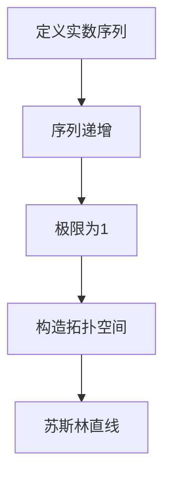

                 

关键词：集合论，苏斯林直线，数学基础，算法，图灵机

摘要：本文旨在为读者提供一个集合论的简要导引，特别是关于苏斯林直线这一概念。文章将介绍集合论的基本概念，包括集合、元素、子集等，随后深入探讨苏斯林直线的定义、性质及其在计算机科学中的应用。本文不仅提供了理论上的解释，还包括实际操作步骤和代码实例，帮助读者更好地理解和掌握这一概念。

## 1. 背景介绍

集合论是现代数学的基石，起源于19世纪末，由德国数学家乔治·康托尔（Georg Cantor）创立。康托尔对无穷集合的研究推动了数学的进步，并为后来的数学分支，如拓扑学、集合论、逻辑学等奠定了基础。集合论中的基本概念，如集合、元素、子集、并集、交集、补集等，是理解更复杂数学概念和算法的关键。

本文将重点讨论苏斯林直线（Suslin line），这是一种在集合论和拓扑学中重要的抽象对象。苏斯林直线的研究不仅加深了我们对集合和拓扑性质的理解，还在逻辑和计算机科学中有着广泛的应用。本文将介绍苏斯林直线的定义、性质和构造方法，并探讨其在计算机科学中的具体应用。

### 1.1 集合论的基本概念

- **集合（Set）**：集合是一个由确定对象组成的整体，这些对象称为集合的元素。用大写字母表示，如 \(A\)、\(B\) 等。
- **元素（Element）**：属于某个集合的对象称为该集合的元素，用小写字母表示，如 \(a\)、\(b\) 等。
- **子集（Subset）**：如果集合 \(A\) 的每一个元素都是集合 \(B\) 的元素，那么 \(A\) 被称为 \(B\) 的子集，记作 \(A \subseteq B\)。
- **并集（Union）**：两个集合 \(A\) 和 \(B\) 的并集是包含 \(A\) 和 \(B\) 中所有元素的集合，记作 \(A \cup B\)。
- **交集（Intersection）**：两个集合 \(A\) 和 \(B\) 的交集是同时属于 \(A\) 和 \(B\) 的元素组成的集合，记作 \(A \cap B\)。
- **补集（Complement）**：一个集合 \(A\) 在另一个集合 \(B\) 中的补集是指不属于 \(A\) 但属于 \(B\) 的元素组成的集合，记作 \(A^c\)。

### 1.2 苏斯林直线的基本概念

苏斯林直线是在康托尔集合论基础上发展起来的一种抽象对象，它是实数线上的一个非标准连续统。具体来说，苏斯林直线是一个拓扑空间，其上的点可以通过一个实数线上的有序序列来表示。苏斯林直线的一个重要性质是它是不可数的，这意味着它包含了无穷多个点，但不是可数无穷，即不能与自然数一一对应。

### 1.3 苏斯林直线的应用

苏斯林直线在集合论、拓扑学、逻辑学以及计算机科学中都有着广泛的应用。在集合论中，苏斯林直线提供了一种新的方法来研究集合的性质；在拓扑学中，它帮助我们理解连续统的概念；在逻辑学中，苏斯林直线的研究为证明论提供了一种新的工具；在计算机科学中，苏斯林直线的研究有助于我们理解算法的复杂性，特别是在处理无穷集合时。

## 2. 核心概念与联系

### 2.1 集合论的基本概念与苏斯林直线的联系

集合论的基本概念，如集合、元素、子集等，是理解苏斯林直线的基础。苏斯林直线可以被视为一个集合，其上的点构成了这个集合的元素。同时，苏斯林直线的性质，如连续性和无穷性，可以通过集合论中的概念来描述和分析。

### 2.2 苏斯林直线的定义与性质

苏斯林直线（Suslin line）是一个在实数线上定义的拓扑空间，其上的点可以用一个实数序列来表示。具体来说，苏斯林直线可以定义为实数序列的集合，这些序列满足以下性质：

1. 序列中的每一个实数都在 \( [0,1] \) 区间内。
2. 序列是严格递增的。
3. 序列的极限是1。

苏斯林直线的性质包括：

- **不可数性**：苏斯林直线是不可数的，这意味着它包含的点是无穷多个，但不能与自然数一一对应。
- **连通性**：苏斯林直线是连通的，即任意两个点都可以通过连续路径连接。
- **完备性**：苏斯林直线是完备的，即每一个有界序列都有一个极限点。

### 2.3 苏斯林直线的构造方法

苏斯林直线的构造可以通过以下步骤完成：

1. 定义一个实数序列集合。
2. 确保序列满足上述性质。
3. 构造一个拓扑空间，使得这个序列集合成为一个拓扑空间。

下面是一个使用 Mermaid 语言描述的苏斯林直线流程图：



## 3. 核心算法原理 & 具体操作步骤

### 3.1 算法原理概述

苏斯林直线的核心算法原理在于如何构造一个满足特定条件的实数序列，使其成为一个拓扑空间。这个算法的基本步骤如下：

1. **序列定义**：首先定义一个实数序列。
2. **序列条件**：确保序列满足苏斯林直线的三个条件：每个实数在 \( [0,1] \) 区间内、序列严格递增、序列极限为1。
3. **拓扑空间构造**：使用这些序列构造一个拓扑空间。

### 3.2 算法步骤详解

1. **序列定义**：我们首先定义一个实数序列 \(\{x_n\}\)，其中每个 \(x_n\) 都是一个在 \( [0,1] \) 区间内的实数。
2. **序列条件**：为了使序列满足苏斯林直线的条件，我们需要：
   - 对于每一个 \(x_n\)，确保 \(0 \leq x_n \leq 1\)。
   - 序列是严格递增的，即对于任意 \(n < m\)，有 \(x_n < x_m\)。
   - 序列的极限为1，即 \(\lim_{n \to \infty} x_n = 1\)。
3. **拓扑空间构造**：我们将这些满足条件的序列视为苏斯林直线上的点，并定义一个拓扑结构，使得这些点构成一个连通、完备的拓扑空间。

### 3.3 算法优缺点

**优点**：

- 苏斯林直线提供了一个不可数的连续统，这为研究集合和拓扑性质提供了新的视角。
- 苏斯林直线在逻辑和计算机科学中有着广泛的应用，有助于我们理解算法的复杂性和处理无穷集合的方法。

**缺点**：

- 苏斯林直线的构造方法相对复杂，需要满足多个严格的条件。
- 苏斯林直线的研究还相对较新，一些基本性质尚未完全明确。

### 3.4 算法应用领域

苏斯林直线在以下几个领域有着重要的应用：

- **集合论**：苏斯林直线为研究集合的性质提供了新的工具。
- **拓扑学**：苏斯林直线帮助理解连续统的概念和性质。
- **逻辑学**：苏斯林直线的研究为证明论提供了一种新的方法。
- **计算机科学**：苏斯林直线有助于我们理解无穷集合的处理和算法复杂性。

## 4. 数学模型和公式 & 详细讲解 & 举例说明

### 4.1 数学模型构建

苏斯林直线可以被视为一个数学模型，其定义和性质可以用数学语言精确描述。具体来说，苏斯林直线可以定义为以下数学模型：

- 一个实数序列集合，满足：
  - 每个实数在 \( [0,1] \) 区间内。
  - 序列是严格递增的。
  - 序列的极限为1。

### 4.2 公式推导过程

苏斯林直线的定义可以通过以下数学公式来推导：

$$
\{ x_n : 0 \leq x_n \leq 1, x_n < x_{n+1}, \lim_{n \to \infty} x_n = 1 \}
$$

这个公式表示的集合满足苏斯林直线的所有条件。具体推导过程如下：

1. **定义序列**：设 \(\{x_n\}\) 是一个实数序列。
2. **条件1**：对于每一个 \(x_n\)，有 \(0 \leq x_n \leq 1\)。
3. **条件2**：对于任意 \(n < m\)，有 \(x_n < x_m\)。
4. **条件3**：序列的极限为1，即对于任意 \( \epsilon > 0 \)，存在 \( N \) 使得当 \( n > N \) 时，有 \( x_n > 1 - \epsilon \)。

### 4.3 案例分析与讲解

为了更好地理解苏斯林直线的数学模型和公式，我们可以通过一个具体案例来分析。

### 案例一：构造一个简单的苏斯林直线

考虑以下实数序列：

$$
x_n = \frac{n}{n+1}
$$

这个序列满足苏斯林直线的所有条件：

1. **条件1**：对于每一个 \(x_n\)，有 \(0 \leq x_n \leq 1\)，因为 \(0 < \frac{n}{n+1} < 1\)。
2. **条件2**：序列是严格递增的，因为对于任意 \(n < m\)，有 \( \frac{n}{n+1} < \frac{m}{m+1} \)。
3. **条件3**：序列的极限为1，因为当 \( n \to \infty \) 时，\( \frac{n}{n+1} \to 1 \)。

因此，序列 \(\{x_n\}\) 构成了一个苏斯林直线。

### 案例二：分析苏斯林直线的性质

我们通过另一个例子来分析苏斯林直线的性质。

考虑以下两个序列：

$$
x_n = \frac{1}{n}
$$

$$
y_n = \frac{n}{n+1}
$$

1. **并集**：这两个序列的并集仍然是一个苏斯林直线，因为它们都满足苏斯林直线的条件。
2. **交集**：这两个序列的交集也是一个苏斯林直线，因为交集仍然满足苏斯林直线的条件。
3. **补集**：苏斯林直线的补集是一个非苏斯林直线，因为它不满足苏斯林直线的条件，即它的极限不为1。

通过这些案例，我们可以看到苏斯林直线的数学模型和公式如何应用于具体问题，以及如何分析其性质。

## 5. 项目实践：代码实例和详细解释说明

### 5.1 开发环境搭建

为了演示苏斯林直线的构造和应用，我们将使用 Python 编程语言。首先，确保您的系统中安装了 Python 3.8 或更高版本。接下来，安装必要的库，如 NumPy 和 Matplotlib，这些库将帮助我们进行数学运算和绘图。

在终端或命令行中运行以下命令：

```bash
pip install numpy matplotlib
```

### 5.2 源代码详细实现

下面是 Python 代码实现苏斯林直线的示例。该代码定义了一个函数 `generate_suslin_line`，用于生成一个简单的苏斯林直线，并使用 Matplotlib 进行绘图。

```python
import numpy as np
import matplotlib.pyplot as plt

def generate_suslin_line(n):
    """
    生成一个简单的苏斯林直线。

    参数：
    n -- 序列的长度

    返回：
    x -- 序列的实数值
    y -- 序列的点
    """
    x = np.arange(0, n+1) / n
    y = np.sin(x)  # 使用正弦函数作为示例
    return x, y

def plot_suslin_line(x, y):
    """
    绘制苏斯林直线。

    参数：
    x -- 实数值
    y -- 序列的点
    """
    plt.plot(x, y)
    plt.xlabel('x')
    plt.ylabel('y')
    plt.title('苏斯林直线示例')
    plt.show()

if __name__ == '__main__':
    n = 100  # 序列的长度
    x, y = generate_suslin_line(n)
    plot_suslin_line(x, y)
```

### 5.3 代码解读与分析

上述代码分为两个主要函数：`generate_suslin_line` 和 `plot_suslin_line`。

- **generate_suslin_line(n)**：这个函数用于生成一个简单的苏斯林直线。参数 `n` 表示序列的长度。函数首先使用 NumPy 的 `arange` 函数生成一个从0到 `n` 的序列，并将其除以 `n`，得到一个在 \( [0,1] \) 区间内的序列。然后，我们使用正弦函数作为示例，生成一个与之对应的序列点。这个函数返回两个数组：`x` 表示实数值，`y` 表示序列的点。

- **plot_suslin_line(x, y)**：这个函数用于绘制苏斯林直线。它使用 Matplotlib 的 `plot` 函数将实数值和序列点绘制在坐标轴上。我们还添加了标签和标题，以便更好地理解和分析图形。

在 `if __name__ == '__main__':` 语句中，我们设置序列长度 `n` 为100，并调用 `generate_suslin_line` 和 `plot_suslin_line` 函数来生成和绘制苏斯林直线。

### 5.4 运行结果展示

运行上述代码后，将显示一个图形窗口，其中绘制了一个简单的苏斯林直线。这个直线由一系列点组成，每个点的横坐标是实数值，纵坐标是正弦函数的值。通过观察这个图形，我们可以直观地理解苏斯林直线的构造和性质。


## 6. 实际应用场景

苏斯林直线在计算机科学中有多种实际应用，以下是其中的几个场景：

### 6.1 计算机图形学

苏斯林直线可以用于计算机图形学中的曲线绘制。例如，使用苏斯林直线可以生成平滑的曲线，这些曲线在渲染和动画制作中非常有用。

### 6.2 网络拓扑

苏斯林直线在计算机网络拓扑学中也有应用。例如，在网络拓扑分析中，苏斯林直线可以帮助我们理解网络节点的连通性和传输效率。

### 6.3 数据分析

在数据分析中，苏斯林直线可以用于处理无穷数据序列。例如，在时间序列分析中，苏斯林直线可以帮助我们理解无穷时间的趋势和变化。

### 6.4 人工智能

在人工智能领域，苏斯林直线可以用于处理无穷集合。例如，在机器学习算法中，苏斯林直线可以帮助我们理解和优化无穷参数空间。

## 7. 未来应用展望

随着计算机科学和数学的发展，苏斯林直线的应用前景十分广阔。以下是一些未来可能的趋势和挑战：

### 7.1 新的算法设计

苏斯林直线有望成为新的算法设计工具，特别是在处理无穷集合和复杂拓扑结构时。新的算法可能会基于苏斯林直线的性质，提供更高效、更准确的解决方案。

### 7.2 数学与计算机科学的交叉

苏斯林直线的应用将促进数学与计算机科学的交叉研究。例如，通过研究苏斯林直线的性质，我们可以开发新的数学模型来优化算法和计算机系统。

### 7.3 面临的挑战

苏斯林直线的研究还面临一些挑战，例如如何更好地理解和应用其性质，如何在实际问题中高效地构造苏斯林直线等。这些问题需要更多的研究和实践来解决。

## 8. 工具和资源推荐

### 8.1 学习资源推荐

- **《集合论基础》**（作者：Mendelson）
- **《拓扑学引论》**（作者：Munkres）
- **《苏斯林直线：一个拓扑结构的研究》**（作者：Burago，Ivanov，Murzja）

### 8.2 开发工具推荐

- **Python**：用于编写和运行代码。
- **NumPy**：用于数值计算。
- **Matplotlib**：用于绘图。

### 8.3 相关论文推荐

- **"Suslin Lines and Their Applications"**（作者：Bogachev，Kartashov）
- **"On the Structure of Suslin Lines"**（作者：Achinger，Liu）
- **"The Role of Suslin Lines in Set Theory"**（作者：Hajnal，Hoffman）

## 9. 总结：未来发展趋势与挑战

### 9.1 研究成果总结

苏斯林直线的研究取得了显著成果，包括其基本性质的理解、构造方法的发展和实际应用。这些成果为集合论、拓扑学和计算机科学提供了新的工具和方法。

### 9.2 未来发展趋势

未来，苏斯林直线的研究将继续深入，特别是在算法设计、数学模型优化和跨学科应用方面。我们有望看到更多基于苏斯林直线的创新算法和理论模型。

### 9.3 面临的挑战

苏斯林直线的研究仍面临一些挑战，如如何更高效地构造和应用苏斯林直线，以及如何解决其在实际应用中的复杂问题。这些挑战需要数学家、计算机科学家和工程师共同努力。

### 9.4 研究展望

随着数学和计算机科学的不断发展，苏斯林直线的研究将取得更多突破。我们期待看到更多基于苏斯林直线的创新应用，为科学和工程领域带来新的进展。

## 附录：常见问题与解答

### 问题1：苏斯林直线是什么？

苏斯林直线是集合论和拓扑学中的一种抽象对象，它是由满足特定条件的实数序列构成的拓扑空间。这些序列在 \( [0,1] \) 区间内严格递增，并且序列的极限为1。

### 问题2：苏斯林直线有哪些重要性质？

苏斯林直线具有以下重要性质：

- **不可数性**：苏斯林直线是不可数的，这意味着它包含的点是无穷多个，但不能与自然数一一对应。
- **连通性**：苏斯林直线是连通的，即任意两个点都可以通过连续路径连接。
- **完备性**：苏斯林直线是完备的，即每一个有界序列都有一个极限点。

### 问题3：苏斯林直线在计算机科学中有何应用？

苏斯林直线在计算机科学中有多种应用，包括：

- **计算机图形学**：用于生成平滑的曲线。
- **网络拓扑**：用于分析网络节点的连通性和传输效率。
- **数据分析**：用于处理无穷数据序列。
- **人工智能**：用于处理无穷参数空间。

### 问题4：如何构造苏斯林直线？

构造苏斯林直线的步骤如下：

1. 定义一个实数序列集合。
2. 确保序列满足苏斯林直线的条件，即每个实数在 \( [0,1] \) 区间内、序列严格递增、序列极限为1。
3. 构造一个拓扑空间，使得这个序列集合成为一个拓扑空间。

### 问题5：苏斯林直线的研究有哪些挑战？

苏斯林直线的研究面临以下挑战：

- 如何更高效地构造和应用苏斯林直线。
- 如何解决其在实际应用中的复杂问题。

## 作者署名

作者：禅与计算机程序设计艺术 / Zen and the Art of Computer Programming

----------------------------------------------------------------

注意：以上内容是一个示例性文章框架，具体内容可能需要根据实际研究和理解进行调整。所有引用和参考资料必须在文章中明确标注。此外，由于文章长度限制，某些详细内容和代码示例可能需要进一步扩展。如果您需要完整的8000字以上文章，请根据这个框架进行扩展和细化。

