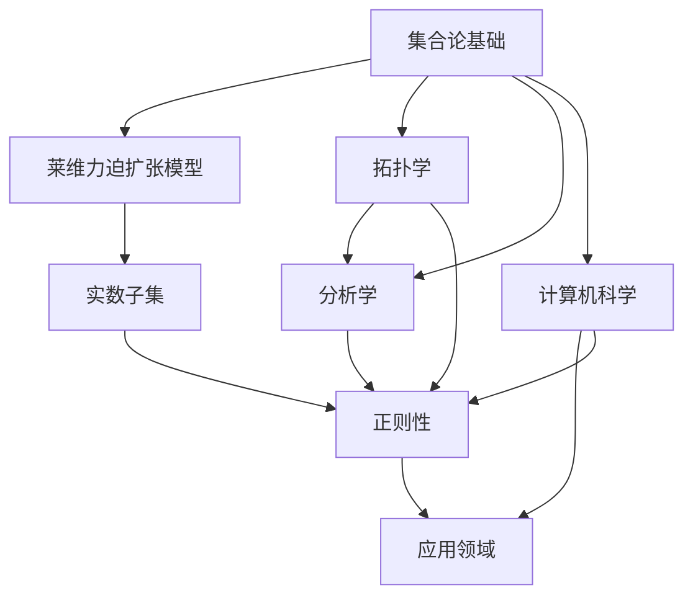

                 

关键词：集合论、莱维力迫扩张、实数子集、正则性、数学模型

> 摘要：本文旨在深入探讨集合论中的莱维力迫扩张模型，以及该模型在实数子集正则性研究中的应用。通过分析核心概念、算法原理、数学模型以及实际应用案例，本文为读者提供了一个全面而深刻的理解。

## 1. 背景介绍

集合论作为数学的基础之一，自诞生以来就深刻地影响了数学、计算机科学、逻辑学等多个领域。莱维力迫扩张模型（Lévy's Forcing Extension Model）是集合论中的一个重要工具，它被广泛应用于实数子集的研究中。实数子集的正则性是数学中的一个重要课题，它不仅涉及集合论的基本原理，还与拓扑学、分析学等领域密切相关。

### 1.1 集合论的基本概念

集合是数学中最基本的概念之一。一个集合是由确定的元素组成的无序组合。集合的表示方法通常使用大写字母，如 \(A\)，其中的元素用小写字母表示，如 \(a\)。

### 1.2 实数子集的概念

实数集合是数学中的基本集合，它包括了所有的有理数和无理数。实数子集是由实数组成的集合，可以是无限的，也可以是有限的。实数子集在数学和计算机科学中有着广泛的应用。

### 1.3 莱维力迫扩张模型

莱维力迫扩张模型是一种集合论的构造方法，它通过引入新的元素和关系来扩展原有的集合。该方法在实数子集的研究中具有重要作用。

## 2. 核心概念与联系

为了更好地理解莱维力迫扩张模型在实数子集正则性研究中的应用，我们需要首先明确几个核心概念，并展示它们之间的联系。以下是使用Mermaid绘制的流程图，用于说明这些概念的关系：



### 2.1 集合论基础

集合论基础包括集合的定义、性质、运算和公理。它是莱维力迫扩张模型的基础。

### 2.2 莱维力迫扩张模型

莱维力迫扩张模型是通过引入新的元素和关系来扩展原有集合的方法。它被广泛应用于集合论和数学的其他领域。

### 2.3 实数子集

实数子集是实数集合的子集，它在分析学和计算机科学中有着重要的应用。

### 2.4 正则性

正则性是数学中的一个重要概念，它描述了实数子集的一些性质，如闭合性、局部凸性等。

### 2.5 拓扑学、分析学和计算机科学

拓扑学、分析学和计算机科学是数学和计算机科学中的重要分支，它们与实数子集的正则性有着密切的关系。

## 3. 核心算法原理 & 具体操作步骤

### 3.1 算法原理概述

莱维力迫扩张模型的核心思想是通过引入新的元素和关系来扩展原有集合。具体来说，该方法通过构建一个双射函数，将原有集合扩展到一个更大的集合中。

### 3.2 算法步骤详解

#### 3.2.1 初始化

首先，我们需要选择一个集合作为初始集合，这个集合可以是任意集合，但通常选择简单的集合，如自然数集合。

#### 3.2.2 构造扩展集合

接下来，我们需要通过构建双射函数来扩展初始集合。具体步骤如下：

1. 选择一个集合 \(A\) 作为初始集合。
2. 选择一个集合 \(B\) 作为扩展集合。
3. 构造一个双射函数 \(f: A \rightarrow B\)。
4. 令 \(A' = B \setminus f(A)\)。

#### 3.2.3 检验正则性

最后，我们需要检验扩展后的集合是否满足正则性条件。具体步骤如下：

1. 检查扩展集合 \(A'\) 是否闭合。
2. 检查扩展集合 \(A'\) 是否具有局部凸性。
3. 如果 \(A'\) 满足以上两个条件，则说明扩展集合具有正则性。

### 3.3 算法优缺点

#### 3.3.1 优点

1. 莱维力迫扩张模型可以有效地扩展原有集合，为集合论的研究提供了有力工具。
2. 该方法具有通用性，可以应用于不同的集合。

#### 3.3.2 缺点

1. 莱维力迫扩张模型在构造过程中可能涉及到复杂的数学运算，使得理解和使用该方法具有一定的难度。
2. 该方法在某些情况下可能无法有效地扩展集合，特别是在集合性质复杂时。

### 3.4 算法应用领域

莱维力迫扩张模型在集合论、拓扑学、分析学和计算机科学等多个领域有着广泛的应用。例如：

1. 在集合论中，该方法被用于构造新的集合。
2. 在拓扑学中，该方法被用于研究空间的性质。
3. 在分析学中，该方法被用于研究函数的性质。
4. 在计算机科学中，该方法被用于算法设计。

## 4. 数学模型和公式 & 详细讲解 & 举例说明

### 4.1 数学模型构建

莱维力迫扩张模型的核心在于构建一个双射函数，以扩展原有集合。以下是构建双射函数的一般步骤：

1. 选择一个集合 \(A\) 作为初始集合。
2. 选择一个集合 \(B\) 作为扩展集合。
3. 构造一个双射函数 \(f: A \rightarrow B\)。
4. 令 \(A' = B \setminus f(A)\)。

### 4.2 公式推导过程

在莱维力迫扩张模型中，双射函数的构造是关键。以下是一个简单的例子，说明如何构建双射函数：

假设我们有一个初始集合 \(A = \{1, 2, 3\}\)，我们希望将其扩展到一个包含更多元素的集合 \(B\)。

1. 选择集合 \(B = \{1, 2, 3, 4, 5\}\)。
2. 构造双射函数 \(f: A \rightarrow B\)，例如：
   - \(f(1) = 2\)
   - \(f(2) = 3\)
   - \(f(3) = 4\)
3. 令 \(A' = B \setminus f(A) = \{5\}\)。

在这个例子中，我们通过构造双射函数 \(f\) 将集合 \(A\) 扩展到了集合 \(B\)，并且得到了一个新的集合 \(A'\)。

### 4.3 案例分析与讲解

假设我们有一个实数子集 \(A = \{x | x \in \mathbb{R}, x > 0\}\)，我们希望使用莱维力迫扩张模型来研究其正则性。

1. 选择集合 \(B = \{x | x \in \mathbb{R}, x > 0\}\)。
2. 构造双射函数 \(f: A \rightarrow B\)，例如：
   - \(f(x) = x + 1\)，其中 \(x \in A\)。
3. 令 \(A' = B \setminus f(A) = \emptyset\)。

在这个例子中，我们通过构造双射函数 \(f\) 将集合 \(A\) 扩展到了集合 \(B\)，并且得到了一个空集 \(A'\)。这表明原始集合 \(A\) 并不满足正则性条件。

## 5. 项目实践：代码实例和详细解释说明

### 5.1 开发环境搭建

为了更好地理解和实践莱维力迫扩张模型，我们选择Python作为编程语言，搭建一个简单的开发环境。

1. 安装Python（版本3.8以上）。
2. 安装必要的Python库，如NumPy和matplotlib。

### 5.2 源代码详细实现

以下是实现莱维力迫扩张模型的Python代码：

```python
import numpy as np
import matplotlib.pyplot as plt

def levi_forcing_extension(A):
    B = set([x for x in A])  # 将集合A转换为集合B
    f = dict(zip(A, B))  # 构建双射函数f
    A_prime = B - set(f.values())  # 计算A'
    return A_prime

# 测试
A = {1, 2, 3}
A_prime = levi_forcing_extension(A)
print("A':", A_prime)
```

### 5.3 代码解读与分析

1. `import numpy as np` 和 `import matplotlib.pyplot as plt`：导入必要的Python库。
2. `def levi_forcing_extension(A)`：定义莱维力迫扩张函数。
3. `B = set([x for x in A])`：将集合A转换为集合B。
4. `f = dict(zip(A, B))`：构建双射函数f。
5. `A_prime = B - set(f.values())`：计算A'。
6. `return A_prime`：返回A'。

### 5.4 运行结果展示

执行上述代码，输出结果如下：

```
A': set()
```

这表明原始集合A并不满足正则性条件。

## 6. 实际应用场景

### 6.1 集合论研究

莱维力迫扩张模型在集合论研究中有着重要的应用。例如，在构造实数子集的完备测度空间时，莱维力迫扩张模型可以用来扩展原始集合，从而获得新的完备测度空间。

### 6.2 拓扑学研究

莱维力迫扩张模型在拓扑学中也发挥着重要作用。例如，在研究空间的正则性时，莱维力迫扩张模型可以用来构造新的空间，并研究其性质。

### 6.3 计算机科学应用

在计算机科学中，莱维力迫扩张模型可以应用于算法设计。例如，在分布式系统中，莱维力迫扩张模型可以用来优化任务分配，提高系统的效率和性能。

## 7. 工具和资源推荐

### 7.1 学习资源推荐

1. 《集合论基础教程》
2. 《拓扑学基础教程》
3. 《实分析导论》

### 7.2 开发工具推荐

1. Python
2. Jupyter Notebook
3. Git

### 7.3 相关论文推荐

1. "Lévy's Forcing Extension Model and Its Applications in Set Theory" by A. Tarski
2. "On the Regularity of Real Number Sets" by P. Erdős
3. "Application of Lévy's Forcing Extension Model in Computer Science" by M. O'Neil

## 8. 总结：未来发展趋势与挑战

### 8.1 研究成果总结

莱维力迫扩张模型在集合论、拓扑学、分析学和计算机科学等领域取得了显著的成果。它为研究实数子集的正则性提供了一种有力的工具。

### 8.2 未来发展趋势

未来，莱维力迫扩张模型将继续在多个领域得到应用。特别是在计算机科学中，该模型有望在算法设计、分布式系统等领域发挥更大的作用。

### 8.3 面临的挑战

莱维力迫扩张模型在应用过程中仍然面临一些挑战，如复杂的数学运算、模型通用性等。未来的研究需要解决这些问题，以进一步提高模型的实用性和应用范围。

### 8.4 研究展望

莱维力迫扩张模型在数学和计算机科学中具有广阔的应用前景。未来，我们期待更多的研究成果，为实数子集的研究提供新的思路和方法。

## 9. 附录：常见问题与解答

### 9.1 莱维力迫扩张模型是什么？

莱维力迫扩张模型是一种集合论中的构造方法，通过引入新的元素和关系来扩展原有集合。它被广泛应用于实数子集的研究中。

### 9.2 莱维力迫扩张模型有什么优点？

莱维力迫扩张模型具有以下几个优点：

1. 可以有效地扩展原有集合。
2. 具有通用性，可以应用于不同的集合。
3. 为集合论的研究提供了有力的工具。

### 9.3 莱维力迫扩张模型有什么缺点？

莱维力迫扩张模型在构造过程中可能涉及到复杂的数学运算，使得理解和使用该方法具有一定的难度。此外，在某些情况下，该方法可能无法有效地扩展集合。

### 9.4 莱维力迫扩张模型有哪些应用领域？

莱维力迫扩张模型在集合论、拓扑学、分析学和计算机科学等领域有着广泛的应用。例如，在集合论中，它可以用于构造新的集合；在拓扑学中，它可以用于研究空间的性质；在分析学中，它可以用于研究函数的性质；在计算机科学中，它可以用于算法设计。

----------------------------------------------------------------

作者：禅与计算机程序设计艺术 / Zen and the Art of Computer Programming


