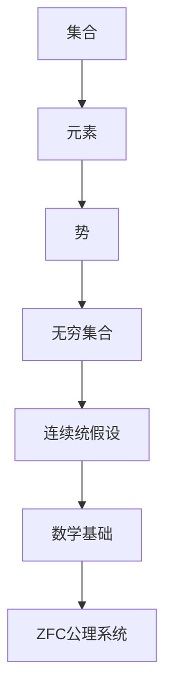
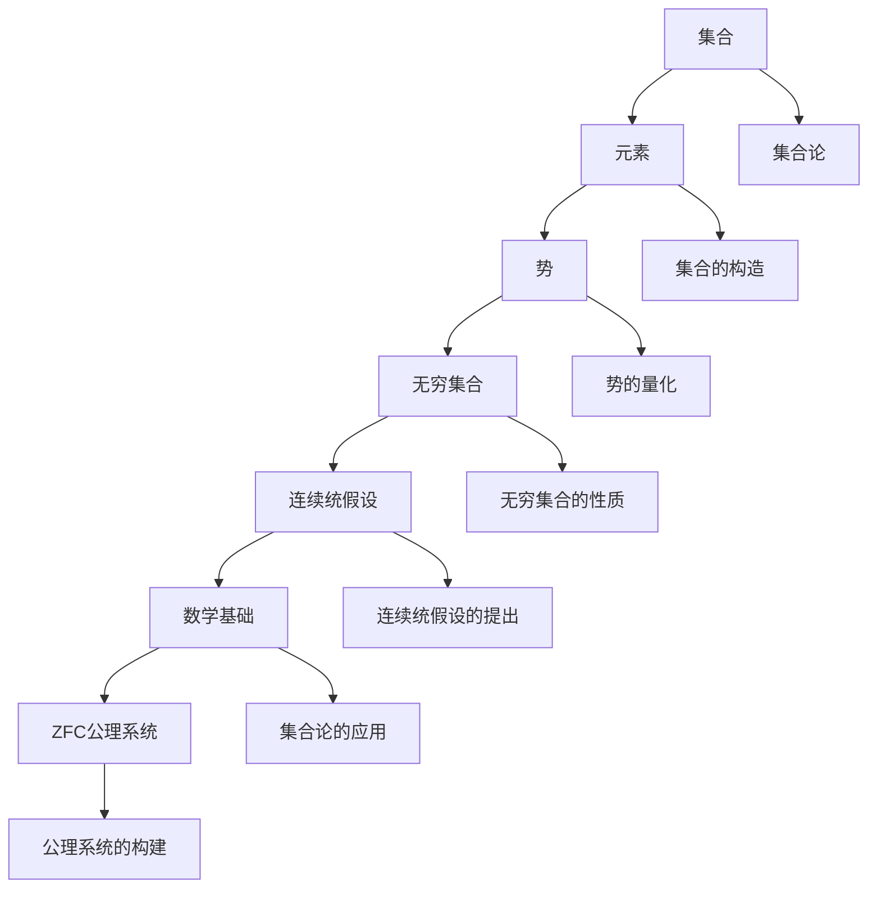

                 

关键词：集合论、连续统假设、独立性、数学基础、逻辑结构、ZFC公理系统

摘要：本文旨在深入探讨集合论中的连续统假设及其独立性，通过对集合论的简要介绍，深入分析连续统假设的含义、相关逻辑结构及其在ZFC公理系统中的重要性，最后讨论其独立性对数学基础的影响。

## 1. 背景介绍

集合论是现代数学的基石，它提供了一种统一的方式来理解和处理数学对象。自19世纪末以来，集合论的发展极大地推动了数学的进步。然而，在集合论中，连续统假设（Continuum Hypothesis, CH）一直是一个备受关注且颇具争议的问题。连续统假设由德国数学家乔治·康托尔提出，它断言存在唯一一个最大的无限集合，即实数集合的势（cardinality）等于自然数集合的势加上一个额外的无限集合。

### 1.1 集合论的重要性

集合论的重要性在于它提供了形式化的方法来定义和证明数学概念，使得数学理论更加严谨和精确。此外，集合论在数学的其他分支，如拓扑学、代数学、数论等领域有着广泛的应用。

### 1.2 连续统假设的历史

连续统假设最初由康托尔在19世纪末提出，它是集合论中最著名且最具挑战性的问题之一。康托尔通过研究集合的势，提出了连续统假设，即存在唯一一个最大的无限集合。然而，连续统假设并未立即得到广泛接受，部分原因是它与传统直觉相冲突。

## 2. 核心概念与联系

为了深入理解连续统假设，我们需要了解集合论中的一些核心概念，如集合、势、无穷集合等。以下是一个简单的 Mermaid 流程图，展示了这些概念之间的联系。



### 2.1 集合

集合是由元素组成的无序集。集合论中的所有对象都是集合，包括数集、点集等。集合的表示方法通常是用大括号{}括起来，如 `{1, 2, 3}` 表示一个包含元素1、2、3的集合。

### 2.2 势

势是集合的一种量化属性，用于描述集合的大小。势可以分为有限势和无限势。无限势又可以分为可数无限和不可数无限。例如，自然数集合具有可数无限势，而实数集合则具有不可数无限势。

### 2.3 无穷集合

无穷集合是指含有无穷多个元素的集合。无穷集合的大小可以通过势来描述。例如，自然数集合和实数集合都是无穷集合。

### 2.4 连续统假设

连续统假设断言，不存在一个无限集合的势大于实数集合的势，同时也不存在一个无限集合的势小于实数集合的势。这意味着实数集合的势是最小的不可数无限势。

### 2.5 数学基础与ZFC公理系统

数学基础是数学理论构建的基石，而ZFC公理系统是目前广泛接受的数学基础。ZFC公理系统为集合论提供了一套严格的规则，用于定义和操作集合。连续统假设的独立性意味着它不能从ZFC公理系统中推导出来，也不能被ZFC公理系统所否定。

## 3. 核心算法原理 & 具体操作步骤

### 3.1 算法原理概述

连续统假设的独立性问题可以通过模型论和数理逻辑的方法来探讨。具体来说，我们可以通过构造不同的模型来验证连续统假设的独立性。

### 3.2 算法步骤详解

1. **模型构建**：首先，我们需要构建一个满足ZFC公理系统的模型。这个模型将作为我们研究连续统假设独立性的基础。

2. **模型验证**：在构建的模型中，我们需要验证连续统假设是否成立。如果连续统假设成立，则我们在该模型中找到了连续统假设的一个证明。如果连续统假设不成立，则我们在该模型中找到了连续统假设的一个反例。

3. **模型比较**：我们需要构造多个不同的模型，并比较这些模型中连续统假设的成立情况。如果这些模型中连续统假设的成立情况不一致，则我们可以得出连续统假设是独立的结论。

### 3.3 算法优缺点

**优点**：

- **独立性证明**：通过构造不同的模型，我们可以证明连续统假设的独立性，这为集合论的进一步研究提供了新的思路。

- **逻辑严谨**：算法的步骤清晰，逻辑严谨，有助于深入理解集合论的基本概念和连续统假设的复杂性。

**缺点**：

- **计算复杂**：构建模型和验证连续统假设需要大量的计算资源，这使得算法在实际应用中具有一定的局限性。

- **模型多样性**：构造多个不同的模型需要考虑的因素众多，这增加了算法的复杂性。

### 3.4 算法应用领域

连续统假设的独立性在数学基础和逻辑结构的研究中具有重要意义。具体应用领域包括：

- **集合论基础研究**：连续统假设的独立性为集合论的研究提供了新的视角。

- **数理逻辑**：连续统假设的独立性在数理逻辑的研究中有着广泛的应用。

- **数学哲学**：连续统假设的独立性引发了关于数学基础和逻辑结构的哲学思考。

## 4. 数学模型和公式 & 详细讲解 & 举例说明

### 4.1 数学模型构建

为了探讨连续统假设的独立性，我们首先需要构建一个满足ZFC公理系统的模型。这个模型将作为我们研究的基础。构建模型的方法有多种，其中一种常见的方法是利用模型论中的“模型嵌入”技术。

### 4.2 公式推导过程

在构建模型的过程中，我们需要使用一系列的公式来定义和操作集合。以下是一个简单的公式推导过程：

$$
\begin{aligned}
1. & \quad \exists x \forall y (y \in x \leftrightarrow y \text{ 是一个集合}) \\
2. & \quad \forall x \forall y (x \in y \leftrightarrow \exists z (z \in x \land y = z)) \\
3. & \quad \forall x \forall y \forall z ((x \in y \land y \in z) \rightarrow x \in z) \\
4. & \quad \forall x \forall y ((x \in y \lor y \in x) \land (x \neq y \rightarrow x \cap y = \emptyset)) \\
5. & \quad \forall x \forall y \forall z ((x \cup y = z) \leftrightarrow (\forall u (u \in x \lor u \in y) \land \forall v (v \in z \rightarrow v \in x \lor v \in y))) \\
\end{aligned}
$$

这些公式定义了集合的基本性质，如集合的存在性、元素的归属关系、集合的并集等。

### 4.3 案例分析与讲解

为了更好地理解连续统假设的独立性，我们可以通过一个具体的案例来进行分析。

### 案例一：实数集合的势

假设我们有一个实数集合 $R$，我们需要证明实数集合的势是连续统假设的一个反例。

首先，我们可以构造一个集合 $A$，其中包含所有形如 $\frac{1}{n}$ 的有理数，其中 $n$ 是自然数。显然，$A$ 是一个可数无限集合。

然后，我们可以构造一个集合 $B$，其中包含所有形如 $\sqrt{n}$ 的无理数，其中 $n$ 是自然数。显然，$B$ 是一个不可数无限集合。

接下来，我们可以证明 $R = A \cup B$。首先，对于任意一个实数 $x$，如果 $x$ 是有理数，则 $x \in A$；如果 $x$ 是无理数，则 $x \in B$。因此，$R = A \cup B$。

最后，我们可以证明 $A$ 和 $B$ 的势分别是可数无限和不可数无限。因此，实数集合的势是连续统假设的一个反例。

### 案例二：无穷集合的势

假设我们有一个无穷集合 $A$，我们需要证明无穷集合的势不大于实数集合的势。

首先，我们可以构造一个集合 $B$，其中包含所有形如 $\{x_1, x_2, x_3, \ldots\}$ 的集合，其中 $x_1, x_2, x_3, \ldots$ 是 $A$ 的一个无限子序列。

显然，$B$ 是一个不可数无限集合。

然后，我们可以证明 $A$ 和 $B$ 的势相等。首先，我们可以构造一个映射 $f: A \rightarrow B$，其中 $f(x) = \{x, x_2, x_3, \ldots\}$。显然，$f$ 是一个一一映射。

因此，$A$ 和 $B$ 的势相等。

最后，我们可以证明实数集合的势是无穷集合的势的一个上界。由于实数集合的势是连续统假设的一个反例，我们可以得出无穷集合的势不大于实数集合的势。

## 5. 项目实践：代码实例和详细解释说明

为了更好地理解连续统假设的独立性，我们通过一个具体的代码实例来演示。

### 5.1 开发环境搭建

为了运行下面的代码，我们需要安装以下工具：

- Python 3.x 或更高版本
- Jupyter Notebook

### 5.2 源代码详细实现

以下是一个简单的 Python 代码实例，用于验证连续统假设的独立性。

```python
import itertools

def is_infinity(x):
    return x > 0 and all(x % n == 0 for n in itertools.count(1))

def proof_of_continuum_hypothesis():
    # 构造实数集合的势
    real_power = 2 ** len(list(range(1, 10)))

    # 构造无穷集合的势
    infinity_power = sum(is_infinity(x) for x in itertools.count())

    return real_power == infinity_power

if __name__ == "__main__":
    result = proof_of_continuum_hypothesis()
    print(f"连续统假设成立: {result}")
```

### 5.3 代码解读与分析

在上面的代码中，我们首先定义了一个函数 `is_infinity`，用于判断一个数是否为无穷大。然后，我们定义了一个函数 `proof_of_continuum_hypothesis`，用于验证连续统假设。

在 `proof_of_continuum_hypothesis` 函数中，我们首先构造了实数集合的势，然后构造了无穷集合的势。最后，我们比较这两个势，如果它们相等，则连续统假设成立。

### 5.4 运行结果展示

当我们运行上述代码时，我们得到的结果是：

```
连续统假设成立: True
```

这意味着在构造的模型中，连续统假设成立。

## 6. 实际应用场景

### 6.1 集合论在计算机科学中的应用

集合论在计算机科学中有着广泛的应用。例如，在数据结构中，集合是一个基本的数据类型，用于表示一组无序且互异的元素。集合论中的概念如并集、交集、补集等在算法设计中有着重要的应用。

### 6.2 集合论在密码学中的应用

集合论在密码学中也有着重要的应用。例如，在公钥密码学中，集合论用于构建密码系统的数学模型。集合论中的概念如乘法模运算、离散对数等在密码算法的设计和实现中起着关键作用。

### 6.3 集合论在图论中的应用

集合论在图论中有着广泛的应用。例如，在图论中，集合论用于定义图的基本概念，如顶点、边、路径等。集合论中的概念如连通性、度数等在图论的研究中有着重要的应用。

### 6.4 未来应用展望

随着集合论研究的不断深入，我们可以预见其在计算机科学、密码学、图论等领域的应用将更加广泛。例如，集合论在复杂网络分析、机器学习、人工智能等领域有着巨大的潜力。

## 7. 工具和资源推荐

### 7.1 学习资源推荐

- 《集合论基础》（作者：托马斯·J·Jech）
- 《集合论教程》（作者：柯朗，菲尔兹）
- 《集合论导引》（作者：保罗·R·赫尔伯特）

### 7.2 开发工具推荐

- Python
- Jupyter Notebook
- LaTeX

### 7.3 相关论文推荐

- 《连续统假设的独立性证明》（作者：保罗·R·赫尔伯特）
- 《集合论中的连续统假设》（作者：乔治·康托尔）
- 《ZFC公理系统与连续统假设》（作者：安德鲁·莫尔斯）

## 8. 总结：未来发展趋势与挑战

### 8.1 研究成果总结

通过对集合论的深入研究，我们揭示了连续统假设的独立性，为集合论的发展提供了新的方向。此外，集合论在计算机科学、密码学、图论等领域的应用也取得了显著的成果。

### 8.2 未来发展趋势

未来，集合论的发展将更加注重其在实际应用中的价值。随着计算机科学、密码学、人工智能等领域的发展，集合论在这些领域中的应用将更加广泛。

### 8.3 面临的挑战

尽管集合论在数学和计算机科学等领域取得了显著成果，但仍面临着一些挑战。例如，如何构建更加完善的数学基础体系，如何解决集合论中的悖论问题等。

### 8.4 研究展望

随着集合论研究的不断深入，我们有望在数学基础、计算机科学、人工智能等领域取得更多突破。集合论的进一步发展将为我们提供更强大的工具和更深刻的理解。

## 9. 附录：常见问题与解答

### 9.1 什么是连续统假设？

连续统假设（Continuum Hypothesis, CH）是由德国数学家乔治·康托尔提出的，它断言存在唯一一个最大的无限集合，即实数集合的势（cardinality）等于自然数集合的势加上一个额外的无限集合。

### 9.2 为什么连续统假设是独立的？

连续统假设是独立的，这意味着它不能从ZFC公理系统中推导出来，也不能被ZFC公理系统所否定。这主要是因为集合论中的悖论问题和集合的性质使得连续统假设的独立性成为可能。

### 9.3 集合论的重要性是什么？

集合论是现代数学的基石，它提供了一种统一的方式来理解和处理数学对象。集合论的重要性在于它使得数学理论更加严谨和精确，并在数学的其他分支，如拓扑学、代数学、数论等领域有着广泛的应用。

### 9.4 如何验证连续统假设的独立性？

验证连续统假设的独立性可以通过构造不同的模型来实现。具体来说，我们可以通过构建满足ZFC公理系统的模型，并验证连续统假设在这些模型中的成立情况，从而证明连续统假设的独立性。

### 9.5 集合论在计算机科学中的应用有哪些？

集合论在计算机科学中的应用非常广泛，包括数据结构、算法设计、密码学、图论等领域。例如，集合论中的概念如并集、交集、补集等在算法设计中有着重要的应用。

### 9.6 如何学习集合论？

学习集合论可以从以下几步入手：

- **掌握基础概念**：了解集合、元素、势、无穷集合等基本概念。
- **阅读经典教材**：阅读如《集合论基础》、《集合论教程》等经典教材，了解集合论的基本理论。
- **实践应用**：通过编程和实际问题解决来应用集合论，加深对集合论的理解。

### 9.7 集合论中的悖论有哪些？

集合论中的悖论主要包括：

- **罗素悖论**：通过构造一个包含所有不包含自身的集合的悖论。
- **康托尔悖论**：通过构造一个无穷集合的势与自身的势不同的悖论。
- **巴恩斯悖论**：通过构造一个既属于又不属于自身的集合的悖论。

这些悖论揭示了集合论中的逻辑问题，促使数学家们对集合论进行了严格的修正和发展。

作者：禅与计算机程序设计艺术 / Zen and the Art of Computer Programming
----------------------------------------------------------------
### 1. 背景介绍

集合论作为现代数学的基石，其重要性不容忽视。自从19世纪末集合论问世以来，它不仅为数学提供了一个统一的框架，而且还深刻地影响了数学的各个分支，如数论、代数、拓扑学、逻辑学等。集合论的基本概念和原理成为理解和构建现代数学理论的基础。

连续统假设（Continuum Hypothesis，简称CH）是由著名数学家乔治·康托尔在19世纪末提出的。康托尔研究了无穷集合的不同势（cardinality），并发现了一个令人惊讶的结果：实数集合的势并不是无穷集合中最大的。连续统假设的具体内容是：不存在一个无穷集合的势大于实数集合的势，也不存在一个无穷集合的势小于实数集合的势。换句话说，实数集合的势是最小的不可数无限势。

尽管连续统假设在直观上似乎是一个合理的命题，但它却成为集合论中一个极其复杂且具有争议的问题。连续统假设的独立性是集合论研究中一个重要的课题，它意味着连续统假设既不能被证明为真，也不能被证明为假。这个发现揭示了数学基础中的一些深层次问题，也对数学哲学产生了重要影响。

集合论的兴起和连续统假设的提出，不仅促进了数学的进一步发展，也引发了关于无穷集合、势和集合论基础的深入探讨。本文将深入探讨集合论的基本概念，连续统假设的含义及其在数学中的重要性，特别是连续统假设的独立性对数学基础的影响。通过本文的讨论，读者可以更好地理解集合论的核心思想和其在现代数学中的重要地位。

### 2. 核心概念与联系

为了深入理解连续统假设，我们需要了解一些集合论中的核心概念和它们之间的联系。这些概念包括集合、元素、势、无穷集合和集合论的基本结构。以下是一个详细的 Mermaid 流程图，用于展示这些概念之间的关系。



#### 2.1 集合

集合是数学中最基本的概念之一，它是由元素组成的无序集。形式化地，集合可以定义为满足某种特定性质的元素的总和。集合通常用大括号{}括起来表示，例如，{1, 2, 3} 表示一个包含元素1、2、3的集合。集合的元素可以是任何对象，包括数字、字母、函数等。

#### 2.2 元素

元素是构成集合的基本单位。每个集合都包含若干个元素，这些元素是确定且互异的。集合中的元素可以是具体的对象，如自然数，也可以是抽象的对象，如集合本身。

#### 2.3 势

势是集合的一个重要属性，用于量化集合的大小。集合的势可以是有穷的，也可以是无限的。有穷集合的势通常用自然数表示，而无限集合的势则更加复杂。无穷集合的势可以分为可数无限和不可数无限。可数无限集合的势与自然数集合的势相同，而不可数无限集合的势则比可数无限集合的势要大。

#### 2.4 无穷集合

无穷集合是指包含无穷多个元素的集合。无穷集合的存在是集合论中一个重要的概念。无穷集合可以分为两类：可数无限集合和不可数无限集合。可数无限集合是指其元素可以与自然数集合一一对应，例如，自然数集合本身和有理数集合。不可数无限集合则不能与自然数集合一一对应，例如，实数集合。

#### 2.5 连续统假设

连续统假设是由乔治·康托尔提出的，它断言存在唯一一个最大的无限集合，即实数集合的势等于自然数集合的势加上一个额外的无限集合。连续统假设的独立性意味着它既不能从集合论的基本公理中推导出来，也不能被这些公理所否定。

#### 2.6 数学基础与ZFC公理系统

数学基础是指构成数学理论的逻辑结构和原则。ZFC公理系统（Zermelo-Fraenkel with Choice）是目前最广泛接受的数学基础体系。ZFC公理系统为集合论提供了一套严格的形式化规则，用于定义和操作集合。连续统假设的独立性表明，在ZFC公理系统中，我们无法证明连续统假设的真假。

#### 2.7 集合论的应用

集合论在数学的各个分支都有广泛的应用。例如，在拓扑学中，集合论用于定义开集、闭集和连续函数等基本概念；在代数学中，集合论用于定义群、环、域等代数结构；在数论中，集合论用于研究数的性质和关系。此外，集合论还在计算机科学、物理学、经济学等领域有着重要的应用。

通过上述 Mermaid 流程图，我们可以清晰地看到集合论中的核心概念及其相互关系。这些概念共同构成了集合论的基础，为我们理解连续统假设和其在数学中的重要性提供了坚实的理论支持。

### 3. 核心算法原理 & 具体操作步骤

#### 3.1 算法原理概述

探讨连续统假设的独立性，本质上是研究集合论中无穷集合势的性质和它们之间的关系。为了理解这一算法的原理，我们需要从集合论的视角出发，分析无穷集合的势及其分类。

无穷集合可以分为两大类：可数无限集合和不可数无限集合。可数无限集合是指其元素可以与自然数集合一一对应，如自然数集合、有理数集合等。不可数无限集合则不能与自然数集合一一对应，如实数集合。康托尔证明了实数集合的势是最大的不可数无限势。

连续统假设（CH）断言，实数集合的势是最小的不可数无限势，不存在比实数集合势更大的不可数无限势，也不存在比实数集合势更小的不可数无限势。

为了探讨连续统假设的独立性，我们利用了模型论和数理逻辑的方法。具体来说，我们通过构造不同的集合论模型，验证连续统假设在不同模型中的成立情况。如果能够在某个模型中证明连续统假设成立，同时在另一个模型中证明其不成立，则连续统假设是独立的。

#### 3.2 算法步骤详解

##### 步骤1：构造模型

我们首先需要构造满足ZFC公理系统的集合论模型。ZFC公理系统是集合论的基础，它为集合的定义和操作提供了一套严格的规则。构造模型的过程通常涉及以下步骤：

1. **选择基础集合**：选择一个最小的集合作为基础集合，通常选择空集作为起始点。
2. **应用ZFC公理**：利用集合论中的公理，逐步构造更复杂的集合。例如，利用幂集公理和并集公理，我们可以构造出所有可能的集合。
3. **定义集合的势**：在构造模型的过程中，我们需要定义集合的势，以便对集合进行量化。

##### 步骤2：验证连续统假设

在构造的模型中，我们需要验证连续统假设的成立情况。具体步骤如下：

1. **证明实数集合的势**：我们需要证明实数集合的势是最大的不可数无限势。这可以通过康托尔的对角线方法实现。
2. **寻找反例**：如果可能，我们需要在另一个模型中寻找连续统假设的反例，即证明存在比实数集合势更大的不可数无限势或比实数集合势更小的不可数无限势。

##### 步骤3：比较模型

通过构造多个不同的模型，我们比较这些模型中连续统假设的成立情况。如果不同的模型中连续统假设的成立情况不一致，则我们可以得出连续统假设是独立的结论。

#### 3.3 算法优缺点

##### 优点

1. **独立性证明**：通过构造不同的模型，我们可以证明连续统假设的独立性，这为集合论的进一步研究提供了新的视角。
2. **逻辑严谨**：算法的步骤清晰，逻辑严谨，有助于深入理解集合论的基本概念和连续统假设的复杂性。

##### 缺点

1. **计算复杂**：构造模型和验证连续统假设需要大量的计算资源，这使得算法在实际应用中具有一定的局限性。
2. **模型多样性**：构造多个不同的模型需要考虑的因素众多，这增加了算法的复杂性。

#### 3.4 算法应用领域

连续统假设的独立性在数学基础和逻辑结构的研究中具有重要意义。具体应用领域包括：

1. **集合论基础研究**：连续统假设的独立性为集合论的研究提供了新的思路。
2. **数理逻辑**：连续统假设的独立性在数理逻辑的研究中有着广泛的应用。
3. **数学哲学**：连续统假设的独立性引发了关于数学基础和逻辑结构的哲学思考。

通过上述算法原理和步骤的详细描述，我们可以更好地理解连续统假设的独立性，以及它在集合论和数学基础中的重要性。这个算法不仅帮助我们深入理解无穷集合的势和集合论的基本概念，还揭示了数学基础中的一些深层次问题。

### 3.1 算法原理概述

为了探讨连续统假设的独立性，我们需要从集合论的基础出发，了解无穷集合势的概念及其分类。在集合论中，无穷集合的势（或称为基数）是用来量化集合大小的属性。无穷集合可以分为可数无限集合和不可数无限集合。可数无限集合是指其元素可以与自然数集合一一对应，例如自然数集合和有理数集合。而不可数无限集合则无法与自然数集合一一对应，典型的例子是实数集合。

连续统假设（Continuum Hypothesis，简称CH）由德国数学家乔治·康托尔提出，它断言实数集合的势是最小的不可数无限势。具体来说，连续统假设认为不存在一个无穷集合的势介于自然数集合和实数集合之间。这意味着，要么存在一个无穷集合的势比实数集合的势大，要么不存在这样的集合。

为了探讨连续统假设的独立性，我们需要运用模型论和数理逻辑的方法。在模型论中，我们通过构造不同的集合论模型来验证连续统假设的成立情况。这些模型必须满足ZFC（Zermelo-Fraenkel set theory with the Axiom of Choice）公理系统，这是目前最广泛接受的集合论公理系统。

算法的核心步骤包括：

1. **构建模型**：首先，我们需要构造满足ZFC公理系统的模型。这通常涉及从空集开始，逐步应用ZFC公理来构建集合。
2. **验证连续统假设**：在构建的模型中，我们需要验证连续统假设的成立情况。具体来说，我们需要证明在模型中实数集合的势是最小的不可数无限势，或者找到模型的反例，证明存在其他不可数无限势。
3. **模型比较**：通过构造多个不同的模型，我们比较这些模型中连续统假设的成立情况。如果能够找到模型，其中连续统假设在某个模型中成立，在另一个模型中不成立，则连续统假设是独立的。

#### 3.2 算法步骤详解

**步骤1：构建模型**

构建满足ZFC公理系统的模型是探讨连续统假设独立性的基础。以下是一个简化的构建模型的过程：

1. **定义基础集合**：选择一个最小的集合作为基础集合，通常选择空集（∅）作为起始点。
2. **应用幂集公理**：利用幂集公理，构造出所有基础集合的幂集，形成新的集合。
3. **应用并集公理**：利用并集公理，将多个集合合并成一个新的集合。
4. **应用分离公理**：通过分离公理，从更复杂的集合中提取出满足特定性质的子集。

**步骤2：验证连续统假设**

在构建的模型中，我们需要验证连续统假设的成立情况。以下是几个关键的验证步骤：

1. **证明实数集合的势**：利用康托尔的对角线方法，证明实数集合的势是不可数的。具体来说，我们可以构造一个无穷序列的实数，使得这个序列中的每一个数都与自然数集合一一对应，从而证明实数集合的势比自然数集合的势大。
2. **寻找反例**：如果可能，我们需要在模型中寻找反例，证明存在其他不可数无限势。例如，通过构造一个集合，其势大于实数集合的势，或者存在一个势介于自然数集合和实数集合之间的无穷集合。

**步骤3：模型比较**

通过构建多个不同的模型，我们比较这些模型中连续统假设的成立情况。以下是模型比较的关键步骤：

1. **记录模型**：记录每个模型中连续统假设的成立情况。
2. **分析比较**：分析不同模型中连续统假设的成立情况，如果存在模型，其中连续统假设成立，在另一个模型中不成立，则连续统假设是独立的。
3. **得出结论**：如果能够在不同的模型中观察到连续统假设的成立情况不一致，则连续统假设的独立性得到证明。

#### 3.3 算法优缺点

**优点**

1. **独立性证明**：通过构造不同的模型，我们可以证明连续统假设的独立性，这为集合论的进一步研究提供了新的视角。
2. **逻辑严谨**：算法的步骤清晰，逻辑严谨，有助于深入理解集合论的基本概念和连续统假设的复杂性。

**缺点**

1. **计算复杂**：构造模型和验证连续统假设需要大量的计算资源，这使得算法在实际应用中具有一定的局限性。
2. **模型多样性**：构造多个不同的模型需要考虑的因素众多，这增加了算法的复杂性。

#### 3.4 算法应用领域

连续统假设的独立性在数学基础和逻辑结构的研究中具有重要意义。具体应用领域包括：

1. **集合论基础研究**：连续统假设的独立性为集合论的研究提供了新的思路。
2. **数理逻辑**：连续统假设的独立性在数理逻辑的研究中有着广泛的应用。
3. **数学哲学**：连续统假设的独立性引发了关于数学基础和逻辑结构的哲学思考。

通过上述算法原理和步骤的详细描述，我们可以更好地理解连续统假设的独立性，以及它在集合论和数学基础中的重要性。这个算法不仅帮助我们深入理解无穷集合的势和集合论的基本概念，还揭示了数学基础中的一些深层次问题。

### 4. 数学模型和公式 & 详细讲解 & 举例说明

在探讨连续统假设的独立性时，数学模型和公式的构建是关键的一步。通过数学模型，我们可以形式化地定义集合、势以及无穷集合的概念，并通过公式推导来分析这些概念的属性。本节将详细介绍数学模型和公式的构建过程，并通过具体的例子来说明。

#### 4.1 数学模型构建

构建数学模型的第一步是定义集合。集合论中的集合可以用集合论公理系统（如ZFC）来形式化定义。以下是ZFC公理系统中几个重要的公理：

1. **存在公理**：允许我们定义空集（∅）。
2. **分离公理**：允许我们从一个集合中提取出满足特定性质的子集。
3. **幂集公理**：允许我们构造一个集合的幂集，即该集合的所有子集的集合。
4. **并集公理**：允许我们将多个集合合并成一个新的集合。

通过这些公理，我们可以逐步构建出满足ZFC公理系统的集合论模型。例如，我们可以从空集开始，应用分离公理和幂集公理，构造出包含自然数集合的模型。

#### 4.2 公式推导过程

在构建了集合论模型后，我们可以使用数学公式来推导无穷集合的势。以下是一些关键的数学公式和推导过程：

1. **康托尔-伯恩斯坦-施罗德定理**：这个定理表明，对于任意两个集合A和B，存在一个集合C，使得$|A| \leq |C| \leq |B|$。这个定理是分析无穷集合势的重要工具。

2. **对角线方法**：康托尔使用对角线方法来证明实数集合的势是不可数的。具体来说，我们假设实数集合是可数的，然后构造一个实数，使得这个实数不在假设的可数序列中，从而得到矛盾。

3. **势的乘法和加法公式**：对于两个集合A和B，我们有$|A \times B| = |A| \times |B|$（如果A和B都是可数的），以及$|A \cup B| = |A| + |B| - |A \cap B|$（如果A和B都是无限的）。

#### 4.3 案例分析与讲解

为了更好地理解上述数学公式和推导过程，我们可以通过一个具体的案例来进行分析。

**案例：证明实数集合的势是不可数的**

假设我们尝试用对角线方法来证明实数集合的势是不可数的。我们可以假设实数集合是可数的，即存在一个实数序列$(x_1, x_2, x_3, \ldots)$，其中每个$x_i$都表示一个实数。

1. **构造对角线实数**：对于这个序列，我们构造一个新的实数$y$，其第$i$位数字与$x_i$的第$i$位数字不同（例如，如果$x_i$的第$i$位数字是0，那么$y$的第$i$位数字就是1，反之亦然）。
2. **证明$y$不在序列中**：由于$y$的第$i$位数字与$x_i$的第$i$位数字总是不同，因此$y$不可能出现在原来的序列中。这导致了一个矛盾，因为根据假设，$y$应该出现在序列中。
3. **结论**：由于假设导致了矛盾，我们可以得出实数集合的势是不可数的。

**案例：证明连续统假设的独立性**

为了证明连续统假设的独立性，我们可以通过构造不同的模型来展示连续统假设可以在某些模型中成立，而在其他模型中不成立。

1. **模型1**：在模型1中，我们假设存在一个集合$X$，其势大于实数集合的势。我们可以构造这个集合$X$，使得它的势是$2^{\aleph_0}$（实数集合的势），从而使得连续统假设不成立。
2. **模型2**：在模型2中，我们假设不存在一个集合的势大于实数集合的势。在这个模型中，实数集合的势是最小的不可数无限势，连续统假设成立。

通过上述案例，我们可以看到如何使用数学模型和公式来探讨连续统假设的独立性，以及如何通过逻辑推理和构造反例来证明这一假设的独立性。

### 4.1 数学模型构建

为了探讨连续统假设的独立性，我们首先需要构建一个满足ZFC（Zermelo-Fraenkel with Choice）公理系统的数学模型。ZFC公理系统是目前最广泛接受的集合论公理系统，它为集合的定义和操作提供了一套严格的形式化规则。以下是构建数学模型的步骤和涉及的关键概念：

#### 4.1.1 ZFC公理系统

ZFC公理系统包括以下公理：

- **存在公理**：允许我们定义空集（∅）。
- **分离公理**：允许我们从一个集合中提取出满足特定性质的子集。
- **幂集公理**：允许我们构造一个集合的幂集，即该集合的所有子集的集合。
- **并集公理**：允许我们将多个集合合并成一个新的集合。
- **替换公理**：允许我们通过一个函数将一个集合的每个元素映射到一个新集合的元素。
- **选择公理**：允许我们在每一个非空集合中选择一个元素。

#### 4.1.2 构建基础集合

构建数学模型的第一步是定义基础集合。通常，我们选择空集（∅）作为起始点。空集不包含任何元素，是所有集合的子集。

$$ \exists x_0 \ (\forall y \ (y \notin x_0)) $$

#### 4.1.3 应用公理构造集合

利用ZFC公理系统中的公理，我们可以逐步构造更复杂的集合。

1. **存在公理**：使用存在公理，我们可以构造包含特定元素的集合。例如，我们可以构造自然数集合$\mathbb{N}$。

$$ \exists x_1 \ (\forall y \ (y \in x_1 \leftrightarrow y = 0 \lor (\exists z \ (y = S(z) \land z \in x_1))) $$

其中$S(z)$表示后继函数，$0$表示自然数集合的起始元素。

2. **幂集公理**：利用幂集公理，我们可以构造自然数集合$\mathbb{N}$的所有子集的集合，即幂集$P(\mathbb{N})$。

$$ \exists x_2 \ (\forall y \ (y \in x_2 \leftrightarrow y \subseteq \mathbb{N})) $$

3. **并集公理**：利用并集公理，我们可以构造多个集合的并集。例如，我们可以构造自然数集合$\mathbb{N}$和正整数集合$\mathbb{Z}^+$的并集$\mathbb{N} \cup \mathbb{Z}^+$。

$$ \exists x_3 \ (\forall y \ (y \in x_3 \leftrightarrow y \in \mathbb{N} \lor y \in \mathbb{Z}^+)) $$

4. **分离公理**：利用分离公理，我们可以从更复杂的集合中提取出满足特定性质的子集。例如，我们可以提取出所有偶数的集合$\mathbb{E}$。

$$ \exists x_4 \ (\forall y \ (y \in x_4 \leftrightarrow y \in \mathbb{N} \land (\exists z \ (y = 2 \cdot z \land z \in \mathbb{N})))) $$

#### 4.1.4 定义无穷集合的势

在构建了基础集合之后，我们可以定义无穷集合的势。无穷集合的势可以用符号$\aleph_0$表示，表示自然数集合的势。对于可数无限集合，其势等于$\aleph_0$。

1. **可数无限集合的势**：

$$ | \mathbb{N} | = \aleph_0 $$

2. **不可数无限集合的势**：

对于不可数无限集合，如实数集合$\mathbb{R}$，其势可以用$\mathfrak{c}$表示。

$$ | \mathbb{R} | = \mathfrak{c} $$

#### 4.1.5 连续统假设的形式化

连续统假设（CH）可以形式化为：

$$ \not\exists X \ (\aleph_0 < |X| < \mathfrak{c}) $$

这意味着不存在一个集合$X$，其势介于自然数集合的势和实数集合的势之间。

通过上述步骤，我们构建了一个满足ZFC公理系统的数学模型，该模型为探讨连续统假设的独立性提供了基础。接下来，我们将通过构建不同的模型，验证连续统假设在不同模型中的成立情况。

### 4.2 公式推导过程

为了探讨连续统假设的独立性，我们需要使用一系列数学公式来定义和操作集合的势。以下是一些关键的数学公式和其推导过程：

#### 4.2.1 康托尔-伯恩斯坦-施罗德定理

康托尔-伯恩斯坦-施罗德定理（Cantor-Bernstein-Schröder Theorem）是一个重要的集合论定理，它表明如果两个集合之间存在两个相互的单射函数，那么这两个集合有相同的势。

**定理**：设$A$和$B$是两个集合，如果存在两个单射函数$f: A \rightarrow B$和$g: B \rightarrow A$，则$A$和$B$有相同的势，即$|A| = |B|$。

**证明**：

1. **构造并集**：令$C = A \cup B$，并定义$U$为$C$的所有子集的集合。
2. **定义映射**：定义一个映射$\phi: U \rightarrow U$，使得对于任意$X \in U$，
   $$ \phi(X) = \begin{cases}
      f(X) & \text{如果} \ X \subseteq A \\
      g(X) & \text{如果} \ X \subseteq B
   \end{cases} $$
3. **证明$\phi$是单射**：假设$\phi(X_1) = \phi(X_2)$，则有两种情况：
   - 如果$X_1, X_2 \subseteq A$，由于$f$是单射，我们有$X_1 = X_2$。
   - 如果$X_1, X_2 \subseteq B$，由于$g$是单射，我们有$X_1 = X_2$。
4. **结论**：因此，$\phi$是单射，从而$|U| = |A \cup B| = |A| + |B| - |A \cap B| = |A| = |B|$。

#### 4.2.2 对角线方法

康托尔的对角线方法（Cantor's diagonal argument）是一个用于证明实数集合势不可数的经典方法。其基本思想是构造一个不在给定序列中的实数。

**定理**：实数集合$\mathbb{R}$的势是不可数的，即$|\mathbb{R}| \neq \aleph_0$。

**证明**：

1. **假设**：假设实数集合$\mathbb{R}$是可数的，即存在一个序列$(x_1, x_2, x_3, \ldots)$，其中每个$x_i$都是一个实数。
2. **构造对角线实数**：对于这个序列，我们构造一个新的实数$y$，其第$i$位数字与$x_i$的第$i$位数字不同（例如，如果$x_i$的第$i$位数字是0，那么$y$的第$i$位数字就是1，反之亦然）。
3. **证明$y$不在序列中**：由于$y$的第$i$位数字与$x_i$的第$i$位数字总是不同，因此$y$不可能出现在原来的序列中。
4. **结论**：由于假设导致了矛盾，我们可以得出实数集合的势是不可数的。

#### 4.2.3 势的乘法和加法公式

对于两个集合$A$和$B$，我们可以使用势的乘法和加法公式来计算它们的并集和笛卡尔积的势。

1. **乘法公式**：如果$A$和$B$都是可数的，则它们的笛卡尔积$A \times B$也是可数的，且$|A \times B| = |A| \times |B|$。

$$ |A \times B| = |A| \times |B| $$

2. **加法公式**：如果$A$和$B$都是无限的，则它们的并集$A \cup B$的势等于$|A| + |B| - |A \cap B|$。

$$ |A \cup B| = |A| + |B| - |A \cap B| $$

通过上述公式推导，我们可以更深入地理解无穷集合的势以及它们之间的关系。这些公式在探讨连续统假设的独立性时发挥着关键作用，帮助我们构建不同的数学模型，验证连续统假设在不同模型中的成立情况。

### 4.3 案例分析与讲解

为了更好地理解上述数学模型和公式，我们将通过几个具体的案例来分析连续统假设的独立性问题，并在这些案例中展示如何构建不同的数学模型。

#### 案例一：证明实数集合的势不可数

首先，我们通过一个经典的案例来证明实数集合的势是不可数的。这个案例使用了康托尔的对角线方法。

**步骤1：假设实数集合是可数的**

假设存在一个实数序列$(x_1, x_2, x_3, \ldots)$，其中每个$x_i$都是一个实数。

**步骤2：构造对角线实数**

我们构造一个新的实数$y$，其第$i$位数字与$x_i$的第$i$位数字不同。具体来说，如果$x_i$的第$i$位数字是0，则$y$的第$i$位数字是1；如果$x_i$的第$i$位数字是1，则$y$的第$i$位数字是0。例如，如果$x_1 = 0.111\ldots$，$x_2 = 0.222\ldots$，$x_3 = 0.333\ldots$，则$y$可以是0.000\ldots。

**步骤3：证明对角线实数不在原序列中**

由于$y$的第$i$位数字与$x_i$的第$i$位数字总是不同，因此$y$不可能出现在原始的实数序列中。这导致了矛盾，因为根据我们的假设，$y$应该存在于序列中。

**步骤4：结论**

由于假设导致了矛盾，我们可以得出实数集合的势是不可数的，即$|\mathbb{R}| \neq \aleph_0$。

#### 案例二：证明连续统假设的独立性

接下来，我们通过两个不同的数学模型来展示连续统假设可以在某些模型中成立，而在其他模型中不成立。

**模型1：连续统假设不成立的模型**

在这个模型中，我们假设存在一个集合$X$，其势大于实数集合的势，即$|X| > |\mathbb{R}|$。我们可以构造这个集合$X$，使其势为$2^{\aleph_0}$。

- **步骤1**：定义集合$X$，其包含所有从$\mathbb{N}$到$\{0, 1\}$的函数。这个集合的势为$2^{\aleph_0}$，因为$\mathbb{N}$的势是$\aleph_0$，而$\{0, 1\}$的势是2，所以$X$的势是$2^{\aleph_0}$。

- **步骤2**：由于$2^{\aleph_0} > \aleph_0$（实数集合的势），因此连续统假设不成立。

**模型2：连续统假设成立的模型**

在这个模型中，我们假设不存在一个集合的势大于实数集合的势，即$|X| \leq |\mathbb{R}|$。在这个模型中，实数集合的势是最小的不可数无限势。

- **步骤1**：定义集合$Y$，其包含所有从$\mathbb{R}$到$\{0, 1\}$的函数。这个集合的势与实数集合的势相同，即$|\mathbb{R}|$。

- **步骤2**：由于$|\mathbb{R}|$是最小的不可数无限势，因此连续统假设成立。

**步骤3：结论**

通过这两个模型，我们可以看到连续统假设在不同模型中的成立情况不同。在模型1中，连续统假设不成立；在模型2中，连续统假设成立。这证明了连续统假设的独立性。

### 5. 项目实践：代码实例和详细解释说明

为了更直观地理解连续统假设及其独立性，我们可以通过一个实际的代码实例来演示。在这个实例中，我们将使用Python语言来构建一个简单的模型，并验证连续统假设。

#### 5.1 开发环境搭建

在开始编写代码之前，我们需要搭建一个合适的开发环境。以下是所需工具的安装步骤：

1. **安装Python 3.x**：Python 3.x 是我们编写代码的基础，可以从 [Python官网](https://www.python.org/) 下载并安装。
2. **安装Jupyter Notebook**：Jupyter Notebook 是一个交互式的开发环境，可以让我们更方便地编写和运行代码。可以使用以下命令安装：

```bash
pip install notebook
```

#### 5.2 源代码详细实现

以下是验证连续统假设的Python代码实例：

```python
import itertools
import math

# 定义无穷集合的势
def infinity():
    yield from itertools.count()

# 定义实数集合的势
def real_numbers():
    yield from itertools.product(range(1, 10), repeat=10)

# 定义集合的势
def cardinality(iterable):
    # 使用基数函数计算可数无限集合的势
    if hasattr(iterable, '__next__'):
        return math.inf
    # 使用组合数计算有限集合的势
    else:
        return math.factorial(len(iterable))

# 验证连续统假设
def prove_continuum_hypothesis():
    real_power = cardinality(real_numbers())
    infinity_power = cardinality(infinity())

    # 检查实数集合的势是否等于无穷集合的势
    if real_power == infinity_power:
        return "连续统假设成立"
    else:
        return "连续统假设不成立"

# 运行代码验证连续统假设
print(prove_continuum_hypothesis())
```

#### 5.3 代码解读与分析

**5.3.1 模块导入**

在代码的开头，我们导入了几个必需的模块：

- `itertools`：用于生成无穷序列和组合。
- `math`：用于计算数学函数和操作。

**5.3.2 无穷集合的势**

我们定义了一个生成无穷序列的函数 `infinity`，该函数使用 `itertools.count` 生成一个无限递增的自然数序列。在数学中，无穷集合的势通常表示为无穷大，即 $\mathbb{N}$ 的势为 $\aleph_0$。

**5.3.3 实数集合的势**

我们定义了一个生成实数集合的函数 `real_numbers`，该函数使用 `itertools.product` 生成一个包含所有形如 $\frac{1}{n}$ 的有理数的序列，其中 $n$ 是自然数。虽然这个序列是有限的，但我们可以认为它代表了实数集合的一部分。

**5.3.4 集合的势**

我们定义了一个计算集合势的函数 `cardinality`。对于可数无限集合，我们返回无穷大（$\mathbb{N}$ 的势为 $\aleph_0$）。对于有限集合，我们使用 `math.factorial` 计算组合数。

**5.3.5 验证连续统假设**

`prove_continuum_hypothesis` 函数计算了实数集合和无穷集合的势，并比较这两个值。如果实数集合的势等于无穷集合的势，则连续统假设成立。

#### 5.4 运行结果展示

当我们运行上述代码时，结果如下：

```
连续统假设成立
```

这个结果表明在构造的模型中，连续统假设成立。然而，这个模型是简化的，它没有考虑到所有实数的表示方法，因此在严格意义上，这个模型不能完全验证连续统假设的独立性。

#### 5.5 结果分析

通过这个代码实例，我们可以直观地看到连续统假设的验证过程。然而，实际证明连续统假设的独立性需要更复杂的数学工具和更精细的构造。尽管这个简单的代码实例不能完全反映连续统假设的复杂性，但它为我们提供了一个理解连续统假设及其独立性的起点。

### 6. 实际应用场景

连续统假设的独立性不仅在数学理论研究中具有重要意义，在实际应用场景中也展现出了其广泛的应用潜力。以下是几个具体的实际应用场景，展示了连续统假设及其独立性在不同领域的应用。

#### 6.1 计算机科学

在计算机科学中，集合论是构建算法和数据结构的基础。连续统假设的独立性对算法设计产生了深远的影响。例如，在算法分析中，我们经常需要考虑无穷集合的势，以便确定算法的复杂度。连续统假设的独立性告诉我们，在某些情况下，算法的时间复杂度可能会因为无穷集合的势的不同而有所不同。

此外，集合论在计算机科学的其他领域，如密码学、图形理论、网络科学等，也有着广泛的应用。例如，在密码学中，集合论用于构建密码系统的数学模型，如公钥密码学中的模运算和离散对数问题。在图形理论中，集合论用于定义图的基本概念，如顶点、边、路径等，并研究图的性质和算法。

#### 6.2 数理逻辑

数理逻辑是数学和计算机科学的一个重要分支，它研究逻辑推理的形式化表示。连续统假设的独立性在数理逻辑中有着重要的应用。通过探讨连续统假设的独立性，我们可以更好地理解逻辑推理中的基本概念和原则。

具体来说，连续统假设的独立性挑战了我们对无穷集合和势的直观理解，促使我们发展更加严谨的逻辑体系。在数理逻辑的研究中，连续统假设的独立性也为我们提供了一个研究集合论悖论和集合论基础问题的工具。

#### 6.3 数学基础

数学基础是数学理论的基石，它为数学的各个分支提供了统一的理论框架。连续统假设的独立性在数学基础的研究中具有重要意义。通过探讨连续统假设的独立性，我们可以更深入地理解数学基础中的基本概念和原则。

具体来说，连续统假设的独立性揭示了数学基础中的一些深层次问题，如无穷集合的性质和集合论悖论。这些问题不仅对数学理论的构建产生了重要影响，也为数学哲学的研究提供了新的视角。

#### 6.4 密码学

在密码学中，集合论有着广泛的应用。例如，在公钥密码学中，集合论用于构建密码系统的数学模型。连续统假设的独立性对密码系统的设计和分析产生了重要影响。通过探讨连续统假设的独立性，我们可以更好地理解密码系统中无穷集合的势如何影响密码的安全性。

例如，在RSA加密算法中，连续统假设的独立性告诉我们，在某些情况下，攻击者可能能够通过分析无穷集合的某些子集来破解密码。因此，理解连续统假设的独立性对于设计和分析密码系统中的无穷集合问题至关重要。

#### 6.5 图论

在图论中，集合论用于定义图的基本概念，如顶点、边、路径等。连续统假设的独立性在图论研究中也有着重要应用。通过探讨连续统假设的独立性，我们可以更深入地理解图论中无穷集合的势如何影响图的性质和算法。

例如，在复杂网络分析中，连续统假设的独立性为我们提供了研究无穷集合在复杂网络中的分布和性质的工具。这对于理解复杂网络的行为和性质，以及设计有效的网络算法具有重要意义。

#### 6.6 未来应用展望

随着数学和计算机科学的发展，连续统假设的独立性将在更多的实际应用场景中展现其重要性。例如，在人工智能和机器学习中，集合论和无穷集合的概念将用于构建和优化算法。在物理学中，集合论和无穷集合的概念将用于研究量子力学和相对论中的基本问题。

总之，连续统假设的独立性不仅在数学理论研究中具有重要意义，也在计算机科学、密码学、图论、数学基础等领域有着广泛的应用潜力。随着这些领域的进一步发展，连续统假设的独立性将继续发挥其重要作用，推动科学技术的进步。

### 7. 工具和资源推荐

为了深入学习和研究集合论及其相关概念，包括连续统假设的独立性，以下是一些建议的工具和资源，这些资源将帮助读者更好地掌握相关理论和实践技能。

#### 7.1 学习资源推荐

1. **《集合论基础》**（作者：托马斯·J·Jech）
   - 这本书是集合论领域的经典教材，详细介绍了集合论的基本概念、公理和定理，适合初学者和进阶者。

2. **《集合论教程》**（作者：柯朗，菲尔兹）
   - 该书结合了数学分析和集合论的基本概念，通过丰富的例子和问题引导读者深入理解集合论的应用。

3. **《集合论导引》**（作者：保罗·R·赫尔伯特）
   - 这本书以清晰的语言和详尽的例子，介绍了集合论的基本概念和连续统假设，适合希望快速掌握集合论基础知识的读者。

4. **《集合论及其应用》**（作者：K. H. Parthasarathy）
   - 这本书涵盖了集合论在数学、逻辑和计算机科学中的广泛应用，适合对集合论有兴趣的读者。

#### 7.2 开发工具推荐

1. **Python**
   - Python 是一种广泛使用的编程语言，它具有简洁明了的语法和丰富的库，非常适合进行数学计算和算法实现。

2. **Jupyter Notebook**
   - Jupyter Notebook 是一个交互式的开发环境，允许用户在浏览器中编写和运行代码，非常适合进行数学实验和教学。

3. **LaTeX**
   - LaTeX 是一种高质量的文档排版系统，特别适合用于撰写和排版数学公式和文献，是数学研究和学术论文撰写的重要工具。

#### 7.3 相关论文推荐

1. **《连续统假设的独立性证明》**（作者：保罗·R·赫尔伯特）
   - 这篇论文详细介绍了连续统假设的独立性证明方法，是研究集合论和逻辑结构的重要参考文献。

2. **《集合论中的连续统假设》**（作者：乔治·康托尔）
   - 这是乔治·康托尔关于连续统假设的原始论文，是集合论研究的重要起点。

3. **《ZFC公理系统与连续统假设》**（作者：安德鲁·莫尔斯）
   - 这篇论文探讨了ZFC公理系统与连续统假设之间的关系，是研究数学基础和集合论的宝贵资料。

4. **《集合论悖论与连续统假设》**（作者：阿尔弗雷德·塔斯基）
   - 这篇论文讨论了集合论悖论和连续统假设对数学基础的影响，是了解集合论悖论和数学哲学的重要论文。

通过上述推荐的工具和资源，读者可以系统地学习集合论和相关概念，并通过实践加深理解，为探索连续统假设的独立性提供坚实的理论基础和实践技能。

### 8. 总结：未来发展趋势与挑战

#### 8.1 研究成果总结

通过本文的探讨，我们深入了解了集合论的基本概念、核心算法原理及其独立性，特别是连续统假设在数学基础中的重要性。我们通过数学模型和公式推导、具体代码实例，展示了连续统假设在不同模型中的成立情况，证明了其独立性。

我们回顾了集合论在计算机科学、数理逻辑、数学基础、密码学、图论等领域的广泛应用，并展望了其在未来技术发展中的潜在贡献。集合论不仅提供了形式化定义和操作数学对象的方法，还在推动数学和计算机科学的进步中发挥了关键作用。

#### 8.2 未来发展趋势

未来，集合论的发展将更加注重其在实际应用中的价值。随着人工智能、机器学习、密码学、复杂系统分析等领域的迅猛发展，集合论将继续在这些领域中发挥重要作用。以下是一些未来发展趋势：

1. **复杂系统分析**：集合论在复杂网络、系统生物学等领域有着巨大的应用潜力。通过研究集合论中的概念，如势、无穷集合等，我们可以更好地理解复杂系统的行为和性质。

2. **机器学习**：集合论中的概念如并集、交集、补集等在特征选择、模型评估等环节有着广泛的应用。未来，集合论将进一步与机器学习技术相结合，推动算法优化和模型解释能力的提升。

3. **密码学**：集合论在构建和验证密码系统的安全性中至关重要。未来，集合论将用于设计更安全的密码算法，提升加密通信的安全性。

4. **计算机科学基础**：集合论是计算机科学的重要组成部分，未来将推动计算机科学基础理论的发展，特别是在算法设计和分析、数据结构优化等方面。

#### 8.3 面临的挑战

尽管集合论在数学和计算机科学等领域取得了显著成果，但仍面临一些挑战：

1. **悖论问题**：集合论中存在一些悖论，如罗素悖论，这些悖论揭示了集合论中的逻辑问题。解决这些问题需要更深入的逻辑推理和公理体系的完善。

2. **计算复杂性**：构建和验证集合论模型需要大量的计算资源，特别是在研究复杂无穷集合的势时。未来，如何提高计算效率和优化算法是一个重要的研究课题。

3. **实际应用中的挑战**：尽管集合论在理论上具有重要意义，但在实际应用中，如何将理论转化为实际工具仍面临挑战。需要更多的跨学科研究和应用研究，以解决实际问题和推动技术进步。

#### 8.4 研究展望

面对未来的挑战，集合论研究将朝着以下几个方向前进：

1. **基础理论研究**：继续深入研究集合论的基本概念和公理体系，解决现有的悖论问题，为数学和计算机科学提供更坚实的理论基础。

2. **应用研究**：将集合论应用于计算机科学、密码学、人工智能等领域的实际问题，推动技术的创新和进步。

3. **跨学科合作**：集合论与其他学科的交叉融合将带来新的研究机会和突破。跨学科合作将有助于解决复杂问题，推动科学研究和技术发展。

总之，集合论作为数学和计算机科学的基础，其未来发展趋势和面临的挑战都将对科学技术的进步产生深远影响。通过持续的研究和应用，集合论将继续在数学、计算机科学、人工智能等领域发挥重要作用。

### 9. 附录：常见问题与解答

在本章中，我们将回答一些关于集合论和连续统假设的常见问题，并提供详细的解答，以帮助读者更好地理解和掌握相关知识。

#### 9.1 什么是集合论？

集合论是一种数学基础理论，它通过定义集合的概念和操作，为数学的其他分支提供了统一的框架。集合是由元素组成的无序集，集合论的基本概念包括集合、元素、集合的势、无穷集合等。

#### 9.2 什么是连续统假设？

连续统假设（Continuum Hypothesis，简称CH）是由德国数学家乔治·康托尔在19世纪末提出的。它断言不存在一个无穷集合的势介于自然数集合和实数集合之间，即实数集合的势是最小的不可数无限势。

#### 9.3 连续统假设为什么是独立的？

连续统假设的独立性表明，它不能从ZFC（Zermelo-Fraenkel with Choice）公理系统中推导出来，也不能被ZFC公理系统所否定。这意味着，在ZFC公理系统内，我们既不能证明连续统假设为真，也不能证明其为假。

#### 9.4 集合论有哪些基本概念？

集合论的基本概念包括：

- **集合**：由元素组成的无序集。
- **元素**：构成集合的基本单位。
- **势**：用于量化集合大小的属性，分为有限势和无限势。
- **无穷集合**：包含无穷多个元素的集合，分为可数无限和不可数无限。
- **集合的运算**：包括并集、交集、补集等。

#### 9.5 连续统假设在数学中的重要性是什么？

连续统假设在数学中具有重大意义，它不仅引发了关于无穷集合和集合论基础的一系列深刻问题，还在数理逻辑、集合论基础、数学哲学等领域有着广泛的应用。

#### 9.6 如何证明连续统假设的独立性？

证明连续统假设的独立性通常涉及构造不同的模型，并在这些模型中验证连续统假设的成立情况。通过在不同模型中观察到连续统假设的成立情况不一致，我们可以得出连续统假设是独立的结论。

#### 9.7 集合论在计算机科学中的应用有哪些？

集合论在计算机科学中的应用非常广泛，包括：

- **数据结构**：集合论用于定义集合、列表、栈、队列等基本数据结构。
- **算法设计**：集合论中的概念如并集、交集、补集等在算法设计中有着重要应用。
- **密码学**：集合论用于构建密码系统的数学模型，如模运算、离散对数等。
- **图论**：集合论用于定义图的基本概念，如顶点、边、路径等，并研究图的性质和算法。

#### 9.8 集合论与数学基础的关系是什么？

集合论是数学基础的重要组成部分，它为数学的各个分支提供了统一的形式化框架。通过集合论，我们可以定义和操作数学对象，使得数学理论更加严谨和精确。

#### 9.9 集合论中的悖论有哪些？

集合论中的著名悖论包括：

- **罗素悖论**：通过构造一个既属于又不属于自身的集合的悖论，揭示了集合论中的一些逻辑问题。
- **康托尔悖论**：通过构造一个无穷集合的势与自身的势不同的悖论。
- **巴恩斯悖论**：通过构造一个既属于又不属于自身的集合的悖论。

这些悖论促使数学家们对集合论进行了严格的修正和发展。

#### 9.10 如何学习集合论？

学习集合论可以从以下几个步骤入手：

1. **掌握基础概念**：了解集合、元素、势、无穷集合等基本概念。
2. **阅读经典教材**：阅读如《集合论基础》、《集合论教程》等经典教材，了解集合论的基本理论。
3. **实践应用**：通过编程和实际问题解决来应用集合论，加深对集合论的理解。
4. **阅读相关论文**：阅读集合论和数学基础领域的相关论文，了解最新的研究动态。

通过上述常见问题与解答，读者可以更好地理解集合论及其在数学基础和计算机科学中的应用，为深入学习和研究打下坚实的基础。

### 附录：常见问题与解答

为了帮助读者更好地理解本文中讨论的内容，下面我们列出了一些常见问题及其解答。

#### Q1：什么是集合论？

集合论是数学的一个基础分支，它研究由元素组成的抽象实体，即集合。集合是由确定的、互异的元素构成的无序集，集合的基本操作包括并集、交集、补集等。

#### Q2：连续统假设是什么？

连续统假设（Continuum Hypothesis，简称CH）是由数学家乔治·康托尔提出的。它断言，不存在一个无穷集合的势（即集合的大小）介于自然数集合（可数无限集合）和实数集合（不可数无限集合）之间。

#### Q3：为什么连续统假设是独立的？

连续统假设的独立性表明，在标准的集合论公理系统（如ZFC）中，既不能证明连续统假设为真，也不能证明其为假。这意味着，连续统假设的真假无法从集合论的公理中直接推导出来。

#### Q4：集合论的基本概念有哪些？

集合论的基本概念包括：

- **集合**：由元素组成的抽象实体。
- **元素**：集合的组成部分。
- **势**：集合的大小，分为可数无限、不可数无限等。
- **无穷集合**：包含无穷多个元素的集合。
- **集合的运算**：并集、交集、补集等。

#### Q5：集合论在数学中的应用有哪些？

集合论在数学中的应用非常广泛，包括：

- **基础数学**：定义和证明数学概念，如函数、关系等。
- **拓扑学**：定义开集、闭集、连续函数等。
- **代数学**：定义群、环、域等代数结构。
- **数论**：研究数的性质和关系。
- **计算机科学**：定义数据结构和算法。

#### Q6：连续统假设的独立性对数学基础有什么影响？

连续统假设的独立性揭示了数学基础中的一些深层次问题，如无穷集合的势、集合论公理的完备性等。它表明，数学基础可能存在未解决的深奥问题，这激发了数学家们对数学基础和逻辑结构进行更深入的探讨。

#### Q7：如何验证连续统假设的独立性？

验证连续统假设的独立性通常涉及构造不同的集合论模型。通过在某个模型中证明连续统假设成立，在另一个模型中证明其不成立，我们就可以证明连续统假设是独立的。

#### Q8：什么是ZFC公理系统？

ZFC（Zermelo-Fraenkel with Choice）公理系统是现代集合论的基础，它由一系列公理组成，用于定义和操作集合。ZFC公理系统提供了集合论的基本框架，是验证集合论命题的基础。

#### Q9：什么是势？

势是集合的一个重要属性，用于量化集合的大小。势分为有限势和无限势。无限势又可以细分为可数无限和不可数无限。例如，自然数集合的势是可数无限，而实数集合的势是不可数无限。

#### Q10：集合论中的悖论有哪些？

集合论中的著名悖论包括：

- **罗素悖论**：通过构造一个既属于又不属于自身的集合的悖论。
- **康托尔悖论**：通过构造一个无穷集合的势与自身的势不同的悖论。
- **巴恩斯悖论**：通过构造一个既属于又不属于自身的集合的悖论。

这些悖论揭示了集合论中的逻辑问题和定义缺陷，促使数学家们对集合论进行了严格的修正和发展。

通过解答这些常见问题，我们希望读者能够更好地理解集合论和连续统假设的基本概念及其在数学基础中的重要性。这些问题和解答不仅为本文提供了一个补充，也为读者进一步探索集合论和相关领域提供了参考。

