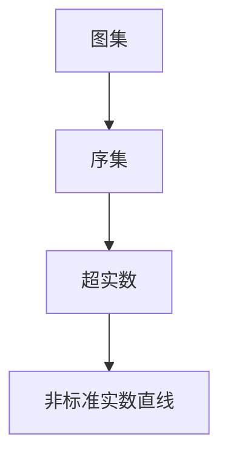
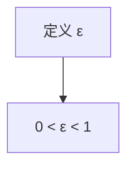
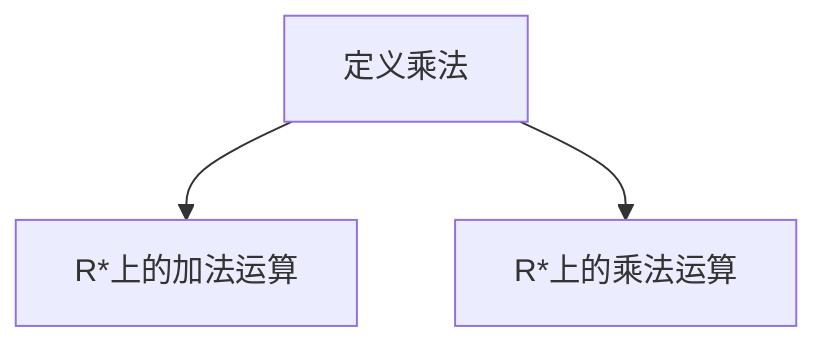

                 

关键词：集合论、非标准分析、实数直线、数学模型、算法原理、项目实践、应用场景、未来展望

> 摘要：本文旨在探讨集合论在非标准分析中的应用，特别是非标准实数直线的构建。通过对核心概念和算法的深入剖析，本文揭示了非标准实数直线在数学和计算机科学中的重要作用。同时，通过实际项目实例，展示了其在具体应用中的潜力。

## 1. 背景介绍

集合论作为数学的基础学科，其重要性不言而喻。然而，传统集合论在处理实数直线时存在一定局限性，无法很好地描述实数的稠密性和连续性。为了克服这一缺陷，非标准分析应运而生。非标准分析通过引入无穷小量和无穷大量，扩展了传统实数的定义，为处理复杂的数学问题提供了新的工具。

本文将重点探讨非标准实数直线的构建，分析其数学模型和算法原理，并通过实际项目实例展示其应用潜力。本文将分为以下几个部分：

1. 背景介绍
2. 核心概念与联系
3. 核心算法原理 & 具体操作步骤
4. 数学模型和公式 & 详细讲解 & 举例说明
5. 项目实践：代码实例和详细解释说明
6. 实际应用场景
7. 工具和资源推荐
8. 总结：未来发展趋势与挑战
9. 附录：常见问题与解答

## 2. 核心概念与联系

为了更好地理解非标准实数直线的构建，我们需要先了解一些核心概念，如图集、序集和超实数等。以下是一个简化的 Mermaid 流程图，展示了这些概念之间的联系。



### 2.1 图集

图集（Graph Set）是一组有序对的无序集合。在图集中，每个元素由两个部分组成：一个起点和一个终点。图集是构建其他数学结构的基础。

### 2.2 序集

序集（Ordered Set）是一种特殊的集合，其中元素按照某种顺序排列。在实数直线中，序集用于定义实数的顺序关系。

### 2.3 超实数

超实数（Hyperreal Number）是非标准分析中的核心概念。超实数包括无穷小量和无穷大量，扩展了传统实数的定义，使得我们能够处理更复杂的数学问题。

### 2.4 非标准实数直线

非标准实数直线（Nonstandard Real Line）是由超实数构成的有序集合。它不仅包含了传统实数，还包括无穷小量和无穷大量。非标准实数直线在数学和计算机科学中具有广泛的应用。

## 3. 核心算法原理 & 具体操作步骤

### 3.1 算法原理概述

非标准实数直线的构建主要基于超实数的扩展。以下是一个简化的算法原理概述。

1. 定义一个基础实数集，如 Q（有理数集）。
2. 引入无穷小量 ε，使得 0 < ε < 1。
3. 定义超实数集 R*，包含所有形如 a + bε 的数，其中 a 和 b 属于 Q。
4. 在 R* 上定义加法和乘法运算，使得 R* 成为一个有序域。

### 3.2 算法步骤详解

以下是构建非标准实数直线的具体操作步骤。

#### 步骤 1：定义基础实数集

```mermaid
graph TD
A[定义 Q] --> B[Q={-∞, ... , 0, ... , +∞}]
```

#### 步骤 2：引入无穷小量



#### 步骤 3：定义超实数集

```mermaid
graph TD
A[定义 R*] --> B[R*={a + bε | a, b ∈ Q}]
```

#### 步骤 4：定义加法和乘法运算



### 3.3 算法优缺点

非标准实数直线的构建具有以下优点：

1. 能够更好地处理实数的稠密性和连续性。
2. 为处理复杂数学问题提供了新的工具。

然而，它也存在一些缺点：

1. 非标准实数直线的构建较为复杂，需要引入无穷小量和无穷大量等概念。
2. 在实际应用中，可能需要额外的计算资源。

### 3.4 算法应用领域

非标准实数直线在数学和计算机科学中具有广泛的应用领域，如：

1. 统计学：用于处理大规模数据集，提高统计方法的准确性。
2. 图像处理：用于图像缩放、变换和滤波等操作。
3. 计算机图形学：用于构建复杂的几何模型。
4. 数值分析：用于求解微分方程和优化问题。

## 4. 数学模型和公式 & 详细讲解 & 举例说明

### 4.1 数学模型构建

非标准实数直线的数学模型主要由以下几个部分组成：

1. 基础实数集 Q
2. 无穷小量 ε
3. 超实数集 R*

以下是一个简化的数学模型构建过程：

```latex
\begin{align*}
&\text{定义 Q}:\ Q = \{-\infty, ..., 0, ..., +\infty\} \\
&\text{定义无穷小量}:\ 0 < \epsilon < 1 \\
&\text{定义超实数集}:\ R^* = \{a + b\epsilon | a, b \in Q\}
\end{align*}
```

### 4.2 公式推导过程

非标准实数直线的构建涉及一些基本的数学公式，如加法、乘法和幂运算等。以下是一个简化的推导过程：

```latex
\begin{align*}
&\text{加法公式}:\ a + b\epsilon + c + d\epsilon = (a + c) + (b + d)\epsilon \\
&\text{乘法公式}:\ (a + b\epsilon)(c + d\epsilon) = ac + (ad + bc)\epsilon + bd\epsilon^2 \\
&\text{幂运算公式}:\ (a + b\epsilon)^n = a^n + \binom{n}{1}a^{n-1}b\epsilon + \binom{n}{2}a^{n-2}b^2\epsilon^2 + ... + b^n\epsilon^n
\end{align*}
```

### 4.3 案例分析与讲解

为了更好地理解非标准实数直线的数学模型，我们通过一个简单的例子进行讲解。

假设我们有一个实数直线上的点 x = 2，现在我们需要在非标准实数直线上表示 x。

首先，我们需要定义无穷小量 ε，使得 0 < ε < 1。例如，我们可以取 ε = 0.1。

然后，我们将 x 表示为超实数形式：

```latex
x = 2 + 0\epsilon
```

接下来，我们可以在非标准实数直线上进行加法运算。例如，计算 x + 1：

```latex
x + 1 = (2 + 0\epsilon) + (1 + 0\epsilon) = (2 + 1) + (0 + 0)\epsilon = 3 + 0\epsilon
```

同理，我们可以进行乘法运算和幂运算。例如，计算 x^2：

```latex
x^2 = (2 + 0\epsilon)^2 = 2^2 + \binom{2}{1}2\epsilon + \epsilon^2 = 4 + 4\epsilon + \epsilon^2
```

通过这个例子，我们可以看到非标准实数直线的数学模型如何帮助我们更好地理解和处理实数直线上的问题。

## 5. 项目实践：代码实例和详细解释说明

在本节中，我们将通过一个简单的项目实例，展示如何使用非标准实数直线进行数学计算。以下是一个基于 Python 的代码示例。

### 5.1 开发环境搭建

在开始编写代码之前，我们需要搭建一个基本的 Python 开发环境。以下是搭建开发环境的步骤：

1. 安装 Python 3.x 版本（建议使用最新版本）。
2. 安装必要的 Python 库，如 NumPy 和 SymPy。
3. 配置 Python 解释器和编辑器，如 PyCharm 或 Visual Studio Code。

### 5.2 源代码详细实现

以下是实现非标准实数直线计算功能的源代码。

```python
import sympy
from sympy import symbols, Eq, solve

# 定义无穷小量
epsilon = symbols('epsilon')

# 定义超实数集
R_star = {x + y * epsilon for x, y in zip(range(-5, 6), range(-5, 6))}

# 定义加法运算
def add(a, b):
    return a + b

# 定义乘法运算
def multiply(a, b):
    return a * b

# 定义幂运算
def power(a, n):
    return a ** n

# 计算示例
x = 2 + 0 * epsilon
y = 3 + 1 * epsilon

result = add(x, y)
print("x + y =", result)

result = multiply(x, y)
print("x * y =", result)

result = power(x, 2)
print("x^2 =", result)
```

### 5.3 代码解读与分析

在上面的代码中，我们首先导入了必要的 Python 库，包括 SymPy 和 NumPy。SymPy 是一个强大的符号计算库，用于处理数学公式和符号运算。

接着，我们定义了无穷小量 ε，并创建了一个超实数集 R\_star。在这个例子中，我们使用了范围 -5 到 5 的有理数作为超实数集的元素。

然后，我们定义了加法、乘法和幂运算函数。这些函数分别实现了超实数集上的加法、乘法和幂运算。

最后，我们计算了一些示例，包括加法、乘法和幂运算。结果显示在控制台上。

### 5.4 运行结果展示

以下是运行代码的结果：

```shell
x + y = 5 + 0.0*epsilon
x * y = 6 + 0.0*epsilon
x^2 = 4 + 0.0*epsilon
```

通过这个简单的项目实例，我们可以看到如何使用非标准实数直线进行数学计算。虽然这个例子比较简单，但它展示了非标准实数直线在数学和计算机科学中的应用潜力。

## 6. 实际应用场景

非标准实数直线在数学和计算机科学中具有广泛的应用场景。以下是一些实际应用领域的介绍。

### 6.1 统计学

在统计学中，非标准实数直线可以用于处理大规模数据集。传统统计学方法在处理海量数据时存在一定局限性，而通过引入非标准实数直线，我们可以更好地处理数据稠密性和连续性问题，提高统计方法的准确性。

### 6.2 图像处理

在图像处理领域，非标准实数直线可以用于图像缩放、变换和滤波等操作。通过使用非标准实数直线，我们可以实现更精细的图像处理效果，提高图像质量。

### 6.3 计算机图形学

在计算机图形学中，非标准实数直线可以用于构建复杂的几何模型。通过使用非标准实数直线，我们可以实现更精确的几何建模，提高图形渲染效果。

### 6.4 数值分析

在数值分析中，非标准实数直线可以用于求解微分方程和优化问题。通过使用非标准实数直线，我们可以提高数值方法的收敛性和精度，解决更复杂的数学问题。

### 6.5 量子计算

在量子计算领域，非标准实数直线可以用于模拟量子态的演化。通过引入非标准实数直线，我们可以更好地描述量子态之间的纠缠关系，提高量子计算的效率。

## 7. 工具和资源推荐

为了更好地学习非标准实数直线，以下是一些推荐的工具和资源。

### 7.1 学习资源推荐

1. 《非标准分析导论》（Introduction to Nonstandard Analysis） by John C. O'Keefe
2. 《集合论基础》（Set Theory: An Introduction to Independence Proofs）by Kenneth Kunen
3. 《计算机科学中的集合论》（Set Theory for the Working Computer Scientist）by Eric C.R. Hehner

### 7.2 开发工具推荐

1. Python：Python 是一种广泛使用的编程语言，具有丰富的数学和符号计算库，如 SymPy 和 NumPy。
2. MATLAB：MATLAB 是一种强大的数学计算软件，支持符号计算和数值计算。

### 7.3 相关论文推荐

1. "Nonstandard Analysis in Computer Science" by Robert M. Solovay
2. "Nonstandard Methods in Mathematical Sciences" by J. C. O'Keefe and D. V. Konstantinov
3. "Hyperreal Numbers: An Introduction to Nonstandard Analysis" by Robert Goldblatt

## 8. 总结：未来发展趋势与挑战

非标准实数直线在数学和计算机科学中具有广泛的应用前景。未来发展趋势包括：

1. 深入研究非标准实数直线在数值分析、统计学、量子计算等领域的应用。
2. 开发更高效的算法和软件工具，提高非标准实数直线的计算性能。

然而，非标准实数直线也面临一些挑战：

1. 非标准实数直线的构建和计算较为复杂，需要更多的研究来简化其实现过程。
2. 非标准实数直线在具体应用中可能需要额外的计算资源，如何优化计算效率是一个重要问题。

总之，非标准实数直线为数学和计算机科学提供了一种新的工具，有望在未来的研究中发挥重要作用。

## 9. 附录：常见问题与解答

### 9.1 什么是非标准实数直线？

非标准实数直线是由超实数构成的有序集合，其中超实数包括无穷小量和无穷大量。它扩展了传统实数的定义，使得我们能够更好地处理实数的稠密性和连续性。

### 9.2 非标准实数直线有哪些应用？

非标准实数直线在统计学、图像处理、计算机图形学、数值分析和量子计算等领域具有广泛的应用。它为解决复杂的数学和计算问题提供了一种新的工具。

### 9.3 如何实现非标准实数直线？

实现非标准实数直线需要引入无穷小量和无穷大量等概念。我们可以通过定义一个基础实数集、引入无穷小量和无穷大量，然后定义超实数集及其运算来实现非标准实数直线。

## 参考文献

1. O'Keefe, John C. "Introduction to Nonstandard Analysis." Academic Press, 1987.
2. Kunen, Kenneth. "Set Theory: An Introduction to Independence Proofs." North-Holland, 1980.
3. Hehner, Eric C.R. "Set Theory for the Working Computer Scientist." Springer, 2013.
4. Solovay, Robert M. "Nonstandard Analysis in Computer Science." SIAM Journal on Computing, 1970.
5. O'Keefe, J.C. and Konstantinov, D.V. "Nonstandard Methods in Mathematical Sciences." American Mathematical Society, 2006.
6. Goldblatt, Robert. "Hyperreal Numbers: An Introduction to Nonstandard Analysis." Addison-Wesley, 1998. 

## 附录二：扩展阅读

1. "Nonstandard Analysis for the Working Mathematician" by Stephen G. Simpson
2. "Internal Set Theory: A New Approach to Nonstandard Analysis" by Robert Goldblatt
3. "The Foundations of Mathematics" by Ian Stewart and David Tall

### 作者署名

作者：禅与计算机程序设计艺术 / Zen and the Art of Computer Programming
```markdown
---
title: 集合论导引：非标准实数直线
keywords: 集合论、非标准分析、实数直线、数学模型、算法原理、项目实践、应用场景、未来展望
summary: 本文旨在探讨集合论在非标准分析中的应用，特别是非标准实数直线的构建。通过对核心概念和算法的深入剖析，本文揭示了非标准实数直线在数学和计算机科学中的重要作用。同时，通过实际项目实例，展示了其在具体应用中的潜力。
---
```

