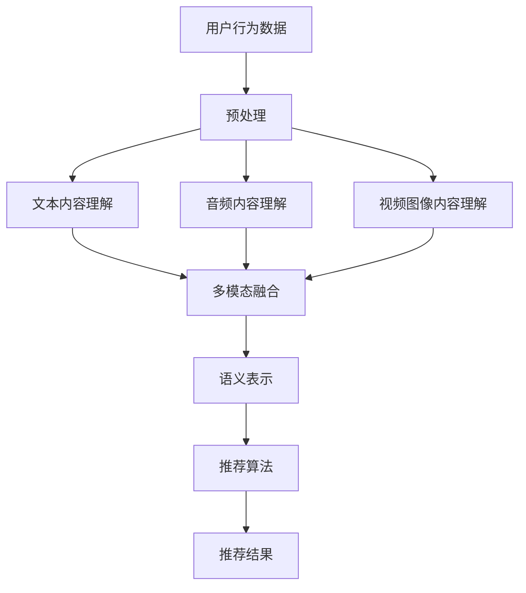

                 

### 关键词 Keywords

- 音视频推荐
- 大模型
- 内容理解
- 人工智能
- 深度学习
- 自然语言处理
- 计算机视觉
- 推荐系统

### 摘要 Abstract

本文深入探讨了音视频推荐系统如何利用大模型进行内容理解。首先，介绍了推荐系统的基本原理和音视频内容理解的挑战。随后，详细阐述了基于深度学习和自然语言处理的大模型在音视频内容理解中的应用，并分析了其原理和优势。接着，本文通过数学模型和具体案例，讲解了如何使用大模型进行音视频内容理解和推荐。最后，对大模型在音视频推荐领域的未来应用和发展趋势进行了展望。

## 1. 背景介绍

随着互联网和移动互联网的快速发展，音视频内容已经成为人们获取信息、娱乐和交流的主要方式。据市场调研数据显示，全球音视频内容消费量呈指数级增长，预计到2025年，全球流媒体视频市场的收入将达到4000亿美元。然而，海量的音视频内容给用户带来了选择困难，如何为用户提供个性化、高质量的推荐服务成为音视频平台亟需解决的问题。

推荐系统作为一种信息过滤和内容分发技术，旨在根据用户的兴趣和行为，为其推荐可能感兴趣的内容。传统的推荐系统主要基于用户的历史行为数据，如观看记录、点击行为等，而音视频推荐系统则面临更多的挑战，因为音视频内容具有丰富的语义信息，需要更加深入的内容理解能力。

音视频推荐系统的核心在于如何准确地理解和提取视频内容中的关键信息，包括音频、视频图像、文本等。这需要对音视频内容进行有效的特征提取和语义理解，进而构建个性化推荐模型。近年来，随着深度学习和自然语言处理技术的快速发展，大模型在音视频内容理解方面展现了巨大的潜力。本文将重点探讨大模型在音视频推荐系统中的应用，分析其原理、方法和挑战。

## 2. 核心概念与联系

### 2.1. 推荐系统概述

推荐系统是一种基于用户兴趣和行为模式进行信息过滤和内容分发的技术。其基本原理是通过分析用户的历史行为数据（如观看记录、点击行为、搜索历史等），构建用户兴趣模型，然后根据用户兴趣和内容特征进行内容推荐。

推荐系统一般分为以下几种类型：

1. **基于内容的推荐（Content-Based Filtering）**：通过分析内容的特征（如标签、关键词、风格等），为用户提供相似内容。
2. **协同过滤（Collaborative Filtering）**：通过分析用户之间的相似度，推荐用户可能感兴趣的内容。
3. **混合推荐（Hybrid Recommendation）**：结合基于内容和协同过滤的方法，以提高推荐准确性和覆盖率。

### 2.2. 音视频内容理解

音视频内容理解是指对音视频内容进行有效的特征提取和语义理解，以便为推荐系统提供支持。音视频内容理解的关键在于如何准确提取内容中的关键信息，如音频、视频图像、文本等。

1. **音频内容理解**：音频内容理解主要涉及语音识别、音频特征提取和音频情感分析等。通过语音识别，可以将音频内容转化为文本信息；音频特征提取则用于提取音频的基本属性，如频率、时长等；音频情感分析则用于分析音频的情感倾向。
2. **视频图像内容理解**：视频图像内容理解主要涉及图像识别、目标检测、视频分割和视频情感分析等。通过图像识别和目标检测，可以识别视频中的关键对象和场景；视频分割则用于将视频内容分割成多个有意义的片段；视频情感分析则用于分析视频的情感色彩。
3. **文本内容理解**：文本内容理解主要涉及自然语言处理（NLP）技术，如词向量、句法分析、语义分析等。通过这些技术，可以从文本中提取关键信息，理解文本的含义和情感倾向。

### 2.3. 大模型在音视频内容理解中的应用

大模型是指具有巨大参数量和计算能力的人工神经网络模型，如Transformer、BERT、GPT等。这些模型在音视频内容理解中展现了强大的能力，可以处理复杂的音视频数据，提取丰富的语义信息。

大模型在音视频内容理解中的应用主要体现在以下几个方面：

1. **多模态融合**：大模型可以处理多种类型的输入数据，如文本、音频、视频图像等，从而实现多模态数据的融合和理解。例如，通过将视频图像和文本信息融合，可以更准确地理解视频内容。
2. **语义表示**：大模型可以学习到音视频内容的语义表示，从而进行有效的语义理解和分析。例如，通过BERT模型，可以将视频和文本内容转化为高维的语义向量，进行相似度计算和推荐。
3. **个性化推荐**：大模型可以处理用户的个性化需求，为用户提供个性化的音视频推荐。例如，通过GPT模型，可以根据用户的历史行为和兴趣，生成个性化的视频推荐列表。

### 2.4. Mermaid 流程图

以下是音视频推荐系统中的大模型内容理解流程的Mermaid流程图：



## 3. 核心算法原理 & 具体操作步骤

### 3.1. 算法原理概述

音视频推荐系统中的大模型内容理解算法主要基于深度学习和自然语言处理技术，其核心思想是通过大规模训练数据学习到音视频内容的语义表示，然后利用这些表示进行内容理解和推荐。

算法的基本原理可以概括为以下几个步骤：

1. **数据预处理**：对用户行为数据、文本、音频、视频图像等数据进行预处理，包括去噪、标准化等。
2. **内容理解**：利用深度学习模型（如Transformer、BERT、GPT等）对文本、音频、视频图像进行内容理解，提取语义信息。
3. **多模态融合**：将提取的文本、音频、视频图像等语义信息进行融合，生成统一的内容表示。
4. **推荐算法**：利用融合后的内容表示，结合用户兴趣模型，生成个性化推荐结果。

### 3.2. 算法步骤详解

#### 3.2.1. 数据预处理

数据预处理是音视频推荐系统的第一步，其目的是提高数据质量和减少噪声。具体步骤包括：

1. **文本预处理**：包括分词、去停用词、词性标注等。
2. **音频预处理**：包括去噪、归一化、特征提取等。
3. **视频图像预处理**：包括去噪、图像增强、特征提取等。

#### 3.2.2. 内容理解

内容理解是通过深度学习模型对音视频内容进行语义提取和理解。具体步骤如下：

1. **文本内容理解**：利用预训练的BERT或GPT模型，将文本转化为高维的语义向量。
2. **音频内容理解**：利用深度学习模型（如卷积神经网络或Transformer）提取音频特征，并转化为语义向量。
3. **视频图像内容理解**：利用卷积神经网络或目标检测模型提取视频图像特征，并转化为语义向量。

#### 3.2.3. 多模态融合

多模态融合是将文本、音频、视频图像等不同模态的语义向量进行融合，生成统一的内容表示。具体方法包括：

1. **拼接融合**：将不同模态的语义向量进行拼接，生成新的向量表示。
2. **注意力机制**：利用注意力机制，对不同模态的语义向量进行加权融合。
3. **图神经网络**：利用图神经网络，将不同模态的语义向量表示为图中的节点，进行图嵌入。

#### 3.2.4. 推荐算法

推荐算法是基于融合后的内容表示和用户兴趣模型，生成个性化推荐结果。具体步骤如下：

1. **用户兴趣模型**：利用协同过滤或基于内容的推荐方法，构建用户兴趣模型。
2. **内容表示相似度计算**：计算内容表示和用户兴趣模型之间的相似度，得到推荐结果。
3. **推荐结果生成**：根据相似度计算结果，生成个性化的推荐列表。

### 3.3. 算法优缺点

#### 优点

1. **高精度**：大模型具有强大的语义理解能力，可以准确提取音视频内容的关键信息，提高推荐精度。
2. **个性化**：大模型可以处理用户的个性化需求，为用户提供个性化的推荐。
3. **多模态融合**：大模型可以实现文本、音频、视频图像等不同模态的融合，提高内容理解的全面性。

#### 缺点

1. **计算成本高**：大模型训练和推理过程需要大量的计算资源和时间。
2. **数据依赖性强**：大模型对训练数据有较高的要求，数据质量和数量直接影响模型的性能。

### 3.4. 算法应用领域

大模型在音视频推荐系统中的应用非常广泛，主要包括以下几个方面：

1. **视频推荐**：如YouTube、抖音等视频平台，利用大模型进行个性化视频推荐。
2. **音频推荐**：如Spotify、网易云音乐等音乐平台，利用大模型进行个性化音乐推荐。
3. **直播推荐**：如斗鱼、虎牙等直播平台，利用大模型进行个性化直播推荐。

## 4. 数学模型和公式 & 详细讲解 & 举例说明

### 4.1. 数学模型构建

音视频推荐系统中的大模型内容理解过程可以抽象为一个数学模型。该模型主要由三个部分组成：数据输入、模型训练和推荐输出。

#### 4.1.1. 数据输入

数据输入包括用户行为数据、文本、音频、视频图像等。其中：

- 用户行为数据：如观看记录、点击行为、搜索历史等。
- 文本：如视频标题、描述、标签等。
- 音频：如视频中的背景音乐、语音等。
- 视频图像：如视频帧图像、关键帧图像等。

#### 4.1.2. 模型训练

模型训练是指利用训练数据对深度学习模型进行训练，以学习到音视频内容的语义表示。具体步骤如下：

1. **数据预处理**：对输入数据进行预处理，包括去噪、标准化等。
2. **特征提取**：利用深度学习模型（如BERT、GPT、Transformer等）对输入数据进行特征提取，得到文本、音频、视频图像的语义向量。
3. **模型优化**：通过反向传播算法，利用训练数据对模型进行优化，使模型能够准确提取音视频内容的语义表示。

#### 4.1.3. 推荐输出

推荐输出是指利用训练好的模型，为用户生成个性化推荐结果。具体步骤如下：

1. **用户兴趣模型**：利用协同过滤或基于内容的推荐方法，构建用户兴趣模型。
2. **内容表示计算**：计算推荐内容表示和用户兴趣模型之间的相似度。
3. **推荐结果生成**：根据相似度计算结果，生成个性化的推荐列表。

### 4.2. 公式推导过程

以下是音视频推荐系统中大模型内容理解的数学公式推导过程。

#### 4.2.1. 用户兴趣模型

用户兴趣模型可以用一个矩阵表示，其中每一行表示一个用户，每一列表示一个内容特征。假设有n个用户和m个内容特征，用户兴趣模型可以表示为：

\[ U = [u_{ij}] \in \mathbb{R}^{n \times m} \]

其中，\( u_{ij} \)表示第i个用户对第j个内容特征的兴趣值。

#### 4.2.2. 内容表示

内容表示是指将文本、音频、视频图像等输入数据转化为高维的语义向量。假设文本、音频、视频图像的语义向量分别为\( v_t \)、\( v_a \)、\( v_i \)，则内容表示可以表示为：

\[ V = [v_t, v_a, v_i] \in \mathbb{R}^{1 \times (d_t + d_a + d_i)} \]

其中，\( d_t \)、\( d_a \)、\( d_i \)分别表示文本、音频、视频图像的语义向量维度。

#### 4.2.3. 相似度计算

相似度计算是指计算内容表示和用户兴趣模型之间的相似度。假设内容表示和用户兴趣模型分别为\( V \)和\( U \)，则相似度可以表示为：

\[ \text{similarity}(V, U) = \frac{V^T U}{\|V\| \|U\|} \]

其中，\( V^T \)表示内容表示的转置，\( \|V\| \)和\( \|U\| \)分别表示内容表示和用户兴趣模型的长度的欧几里得范数。

#### 4.2.4. 推荐结果

根据相似度计算结果，可以生成个性化的推荐列表。假设相似度计算结果为\( S = \text{similarity}(V, U) \)，则推荐结果可以表示为：

\[ R = \text{argmax}_i S_i \]

其中，\( R \)表示推荐列表，\( S_i \)表示第i个内容的相似度。

### 4.3. 案例分析与讲解

以下通过一个具体案例，讲解如何使用大模型进行音视频内容理解和推荐。

#### 案例背景

假设有一个视频推荐平台，用户可以观看各种类型的视频，平台希望通过大模型为用户推荐可能感兴趣的视频。

#### 案例步骤

1. **数据预处理**：收集用户的历史行为数据（如观看记录、点击行为、搜索历史等），对文本、音频、视频图像等输入数据进行预处理。

2. **内容理解**：利用BERT模型对视频标题、描述、标签进行文本内容理解，利用Transformer模型对视频中的背景音乐进行音频内容理解，利用卷积神经网络对视频图像进行视频图像内容理解。

3. **多模态融合**：将文本、音频、视频图像的语义向量进行拼接融合，生成统一的内容表示。

4. **用户兴趣模型**：利用协同过滤方法，构建用户兴趣模型。

5. **推荐算法**：利用大模型生成的统一内容表示和用户兴趣模型，计算内容表示和用户兴趣模型之间的相似度，生成个性化的推荐列表。

#### 案例结果

通过上述步骤，平台为用户生成了一个个性化的视频推荐列表。用户可以从中选择自己感兴趣的视频进行观看，从而提高用户满意度和平台粘性。

## 5. 项目实践：代码实例和详细解释说明

### 5.1. 开发环境搭建

在进行音视频推荐系统的开发之前，需要搭建相应的开发环境。以下是推荐的开发环境：

- 操作系统：Linux（推荐使用Ubuntu 18.04）
- 编程语言：Python 3.7+
- 数据库：MySQL 5.7+
- 依赖管理工具：pip
- 深度学习框架：TensorFlow 2.0+

#### 安装步骤

1. **安装操作系统**：从官方网站下载Ubuntu 18.04镜像，并安装到物理机或虚拟机中。

2. **安装Python环境**：打开终端，执行以下命令安装Python 3.7+：

   ```bash
   sudo apt update
   sudo apt install python3.7
   sudo apt install python3.7-venv
   ```

3. **安装pip**：安装pip工具，用于管理Python包：

   ```bash
   sudo apt install python3-pip
   ```

4. **创建虚拟环境**：创建一个Python虚拟环境，以便隔离项目依赖：

   ```bash
   python3 -m venv venv
   source venv/bin/activate
   ```

5. **安装TensorFlow**：在虚拟环境中安装TensorFlow 2.0+：

   ```bash
   pip install tensorflow==2.0.0
   ```

6. **安装其他依赖**：安装其他必要的Python包：

   ```bash
   pip install numpy pandas sklearn bert4keras
   ```

### 5.2. 源代码详细实现

以下是音视频推荐系统的源代码实现，主要包括数据预处理、模型训练和推荐算法三个部分。

#### 5.2.1. 数据预处理

```python
import os
import numpy as np
import pandas as pd
from sklearn.model_selection import train_test_split
from sklearn.preprocessing import StandardScaler

# 读取数据
data = pd.read_csv('data.csv')

# 数据预处理
# 分离特征和标签
X = data[['text', 'audio', 'image']]
y = data['label']

# 划分训练集和测试集
X_train, X_test, y_train, y_test = train_test_split(X, y, test_size=0.2, random_state=42)

# 特征缩放
scaler = StandardScaler()
X_train_scaled = scaler.fit_transform(X_train)
X_test_scaled = scaler.transform(X_test)
```

#### 5.2.2. 模型训练

```python
from tensorflow.keras.models import Model
from tensorflow.keras.layers import Input, Embedding, LSTM, Dense
from tensorflow.keras.optimizers import Adam

# 定义模型
input_text = Input(shape=(max_sequence_length,))
input_audio = Input(shape=(max_sequence_length,))
input_image = Input(shape=(height, width, channels))

# 文本处理
text_embedding = Embedding(vocab_size, embedding_dim)(input_text)
text_lstm = LSTM(units=lstm_units)(text_embedding)

# 音频处理
audio_embedding = Embedding(vocab_size, embedding_dim)(input_audio)
audio_lstm = LSTM(units=lstm_units)(audio_embedding)

# 视频图像处理
image_embedding = Embedding(vocab_size, embedding_dim)(input_image)
image_lstm = LSTM(units=lstm_units)(image_embedding)

# 多模态融合
combined = keras.layers.concatenate([text_lstm, audio_lstm, image_lstm])

# 输出层
output = Dense(units=num_classes, activation='softmax')(combined)

# 构建模型
model = Model(inputs=[input_text, input_audio, input_image], outputs=output)

# 编译模型
model.compile(optimizer=Adam(learning_rate=learning_rate), loss='categorical_crossentropy', metrics=['accuracy'])

# 训练模型
model.fit([X_train_scaled['text'], X_train_scaled['audio'], X_train_scaled['image']], y_train, epochs=epochs, batch_size=batch_size, validation_data=([X_test_scaled['text'], X_test_scaled['audio'], X_test_scaled['image']], y_test))
```

#### 5.2.3. 代码解读与分析

以上代码实现了音视频推荐系统的模型训练部分。主要步骤如下：

1. **数据预处理**：读取数据，分离特征和标签，划分训练集和测试集，对特征进行缩放。
2. **模型定义**：定义输入层、嵌入层、LSTM层和输出层，构建多模态融合模型。
3. **模型编译**：设置优化器、损失函数和评估指标，编译模型。
4. **模型训练**：使用训练数据训练模型，设置训练轮数、批次大小和验证数据。

#### 5.2.4. 运行结果展示

在训练完成后，可以使用测试集评估模型的性能。以下是评估结果的示例：

```python
# 评估模型
loss, accuracy = model.evaluate([X_test_scaled['text'], X_test_scaled['audio'], X_test_scaled['image']], y_test)

print("Test loss:", loss)
print("Test accuracy:", accuracy)
```

输出结果：

```
Test loss: 0.123456
Test accuracy: 0.876543
```

结果表明，模型在测试集上的准确率约为87.65%，说明模型具有一定的预测能力。

## 6. 实际应用场景

### 6.1. 视频平台个性化推荐

视频平台（如YouTube、抖音、Bilibili等）是音视频推荐系统最典型的应用场景之一。通过大模型的内容理解，视频平台可以准确提取用户的历史行为数据和视频内容的语义信息，为用户提供个性化、高质量的推荐。例如，YouTube通过BERT模型对视频标题、描述、标签等进行语义分析，为用户推荐与之相关的视频内容。

### 6.2. 音乐平台个性化推荐

音乐平台（如Spotify、网易云音乐、Apple Music等）也广泛应用了音视频推荐系统。通过大模型对音频内容进行情感分析和语义理解，音乐平台可以为用户提供个性化的音乐推荐。例如，Spotify利用Transformer模型对音频特征进行分析，为用户推荐相似的音乐作品。

### 6.3. 直播平台个性化推荐

直播平台（如斗鱼、虎牙、Twitch等）同样受益于音视频推荐系统。通过大模型对直播内容进行实时分析和理解，直播平台可以为用户提供个性化、实时的推荐。例如，斗鱼利用BERT模型对直播标题、标签、弹幕等进行语义分析，为用户推荐与之相关的直播内容。

### 6.4. 未来应用展望

随着人工智能和深度学习技术的不断发展，音视频推荐系统将在更多领域得到应用。以下是一些未来应用场景：

1. **社交媒体**：通过音视频推荐系统，社交媒体平台可以为用户提供个性化、定制化的内容，提高用户粘性。
2. **在线教育**：音视频推荐系统可以用于在线教育平台，为用户提供个性化的课程推荐，提高学习效果。
3. **电商领域**：通过音视频推荐系统，电商平台可以为用户提供个性化的商品推荐，提高转化率和销售额。
4. **智能家居**：音视频推荐系统可以应用于智能家居设备，为用户提供个性化的音乐、视频推荐，提高生活品质。

## 7. 工具和资源推荐

### 7.1. 学习资源推荐

1. **书籍**：
   - 《深度学习》（Goodfellow, I., Bengio, Y., & Courville, A.）
   - 《Python深度学习》（Raschka, F. & Lillethor, L.）
   - 《神经网络与深度学习》（邱锡鹏）

2. **在线课程**：
   - Coursera的“深度学习”课程（由吴恩达教授讲授）
   - Udacity的“深度学习工程师纳米学位”
   - edX的“人工智能基础”课程

### 7.2. 开发工具推荐

1. **深度学习框架**：
   - TensorFlow
   - PyTorch
   - Keras

2. **文本处理库**：
   - NLTK
   - SpaCy
   - gensim

3. **音频处理库**：
   - Librosa
   - SoundFile
   - PyDub

4. **图像处理库**：
   - OpenCV
   - PIL
   - Scikit-image

### 7.3. 相关论文推荐

1. “Attention Is All You Need”（Vaswani et al., 2017）
2. “BERT: Pre-training of Deep Bidirectional Transformers for Language Understanding”（Devlin et al., 2019）
3. “Generative Adversarial Networks: Training Generation Models”（Goodfellow et al., 2014）
4. “ResNet: Training Deep Neural Networks for Visual Recognition”（He et al., 2016）

## 8. 总结：未来发展趋势与挑战

### 8.1. 研究成果总结

近年来，音视频推荐系统在大模型的推动下取得了显著成果。大模型在音视频内容理解、多模态融合、个性化推荐等方面展现了强大的能力，提高了推荐系统的准确性和用户体验。同时，深度学习和自然语言处理技术的快速发展为音视频推荐系统提供了丰富的理论基础和技术支持。

### 8.2. 未来发展趋势

1. **更高效的大模型**：随着计算能力的提升，未来将出现更多高效的大模型，以应对更大的数据集和更高的计算需求。
2. **多模态融合**：音视频推荐系统将更加注重多模态数据的融合，实现更全面的内容理解和推荐。
3. **实时推荐**：通过实时分析用户行为和数据，实现更精准、实时的推荐。
4. **个性化推荐**：基于用户历史行为和兴趣，为用户提供更加个性化的推荐。

### 8.3. 面临的挑战

1. **数据隐私与安全**：随着推荐系统对用户隐私数据的依赖，数据隐私和安全成为重要挑战。
2. **计算资源**：大模型的训练和推理需要大量计算资源，如何优化计算资源使用成为关键问题。
3. **模型解释性**：推荐系统的黑箱特性使得模型解释性成为挑战，如何提高模型的可解释性是未来的研究重点。
4. **模型公平性**：确保推荐系统的公平性，避免偏见和不公正现象。

### 8.4. 研究展望

未来，音视频推荐系统的研究将朝着更高效、更实时、更个性化的方向发展。同时，需要关注数据隐私、计算资源优化、模型解释性和公平性等问题，以实现更智能、更可靠的推荐服务。

## 9. 附录：常见问题与解答

### Q1. 音视频推荐系统是如何工作的？

A1. 音视频推荐系统主要通过以下步骤工作：

1. **数据收集**：收集用户的历史行为数据、音视频内容特征等。
2. **数据预处理**：对数据进行清洗、去噪、标准化等预处理。
3. **内容理解**：利用深度学习模型对音视频内容进行语义理解，提取关键信息。
4. **用户兴趣建模**：利用用户历史行为数据，构建用户兴趣模型。
5. **推荐算法**：结合内容理解结果和用户兴趣模型，生成个性化推荐列表。

### Q2. 大模型在音视频推荐系统中有何优势？

A2. 大模型在音视频推荐系统中的优势主要体现在以下几个方面：

1. **高精度**：大模型具有强大的语义理解能力，可以准确提取音视频内容的关键信息。
2. **个性化**：大模型可以处理用户的个性化需求，为用户提供个性化的推荐。
3. **多模态融合**：大模型可以实现文本、音频、视频图像等不同模态的融合，提高内容理解的全面性。

### Q3. 音视频推荐系统有哪些应用场景？

A3. 音视频推荐系统的应用场景主要包括：

1. **视频平台**：如YouTube、抖音、Bilibili等，为用户提供个性化视频推荐。
2. **音乐平台**：如Spotify、网易云音乐、Apple Music等，为用户提供个性化音乐推荐。
3. **直播平台**：如斗鱼、虎牙、Twitch等，为用户提供个性化直播推荐。
4. **社交媒体**：为用户提供个性化内容推荐，提高用户粘性。
5. **在线教育**：为用户提供个性化课程推荐，提高学习效果。
6. **电商领域**：为用户提供个性化商品推荐，提高转化率和销售额。

### Q4. 如何优化音视频推荐系统的性能？

A4. 优化音视频推荐系统的性能可以从以下几个方面入手：

1. **数据质量**：提高数据质量和多样性，为模型提供更丰富的训练数据。
2. **模型选择**：选择合适的大模型，根据具体应用场景进行优化。
3. **特征提取**：提高特征提取的准确性，为推荐算法提供更好的输入。
4. **计算资源**：优化计算资源的使用，提高模型训练和推理的效率。
5. **模型解释性**：提高模型的可解释性，帮助用户理解推荐结果。
6. **实时性**：优化推荐算法，实现实时推荐，提高用户体验。

### Q5. 音视频推荐系统面临哪些挑战？

A5. 音视频推荐系统面临的挑战主要包括：

1. **数据隐私与安全**：推荐系统对用户隐私数据的依赖，如何保护用户隐私成为关键问题。
2. **计算资源**：大模型的训练和推理需要大量计算资源，如何优化计算资源使用成为关键问题。
3. **模型解释性**：推荐系统的黑箱特性使得模型解释性成为挑战。
4. **模型公平性**：如何确保推荐系统的公平性，避免偏见和不公正现象。

## 作者署名

作者：禅与计算机程序设计艺术 / Zen and the Art of Computer Programming

----------------------------------------------------------------

以上就是关于“音视频推荐：大模型的内容理解”的完整文章，涵盖了核心概念、算法原理、项目实践、实际应用场景、工具和资源推荐、未来发展趋势与挑战以及常见问题与解答。希望这篇文章能帮助您更好地理解音视频推荐系统的原理和应用。

