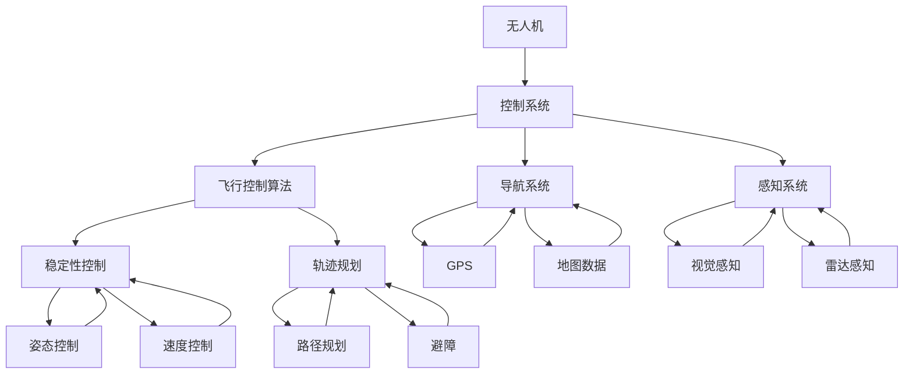

                 

关键词：无人机配送、面试指南、控制系统、技术挑战、解决方案

> 摘要：本文旨在为准备参加顺丰2025年无人机配送社招控制系统的应聘者提供一份全面的面试指南，涵盖核心概念、算法原理、数学模型、项目实践以及未来应用展望等内容。

## 1. 背景介绍

随着科技的发展，无人机配送已成为物流行业的一股新兴力量。顺丰作为国内领先的快递公司，早在2016年就开始布局无人机配送业务，并计划在2025年实现全面普及。为实现这一目标，顺丰对无人机配送控制系统的研发投入了巨大的资源。本文将围绕这一系统，为应聘者提供面试指南。

## 2. 核心概念与联系

为了更好地理解无人机配送控制系统，首先需要了解其中的核心概念。以下是相关的概念及其相互关系：



### 2.1 无人机

无人机是无人机配送系统的核心，具有自主飞行、载物配送等功能。其性能直接影响配送效率和安全性。

### 2.2 控制系统

无人机配送控制系统的核心功能是对无人机进行实时控制，包括飞行、导航、感知等。它由多个模块组成，如飞行控制算法、导航系统、感知系统等。

### 2.3 飞行控制算法

飞行控制算法是无人机配送控制系统的核心模块，负责无人机的稳定飞行和轨迹规划。它包括稳定性控制、姿态控制、速度控制等。

### 2.4 导航系统

导航系统负责无人机的定位、导航和路径规划。它由GPS、地图数据等组成，是无人机能够实现自主飞行的基础。

### 2.5 感知系统

感知系统负责无人机对周围环境的感知，包括视觉感知、雷达感知等。它用于实现无人机的避障、碰撞检测等功能。

## 3. 核心算法原理 & 具体操作步骤

### 3.1 算法原理概述

无人机配送控制系统的核心算法主要包括飞行控制算法、导航算法和感知算法。以下分别介绍各算法的原理。

#### 3.1.1 飞行控制算法

飞行控制算法主要涉及无人机的稳定性控制、姿态控制和轨迹规划。

- **稳定性控制**：通过控制无人机的姿态和速度，使其在空中保持稳定。
- **姿态控制**：通过调整无人机的俯仰角、横滚角和偏航角，实现无人机的飞行方向和高度控制。
- **轨迹规划**：根据导航系统的定位信息和目标位置，规划无人机的飞行路径。

#### 3.1.2 导航算法

导航算法主要包括路径规划和轨迹跟踪。

- **路径规划**：根据地图数据和目标位置，计算最优飞行路径。
- **轨迹跟踪**：根据实际飞行路径和目标位置，调整无人机的飞行方向和速度，确保准确到达目标。

#### 3.1.3 感知算法

感知算法主要包括视觉感知和雷达感知。

- **视觉感知**：通过摄像头获取周围环境图像，实现目标检测、识别和跟踪。
- **雷达感知**：通过雷达获取周围环境的距离信息，实现无人机的避障和碰撞检测。

### 3.2 算法步骤详解

#### 3.2.1 飞行控制算法步骤

1. 收集无人机姿态、速度和导航数据。
2. 根据稳定性控制算法，调整无人机的俯仰角、横滚角和偏航角。
3. 根据姿态控制算法，调整无人机的飞行方向和高度。
4. 根据轨迹规划算法，计算最优飞行路径。
5. 根据实际飞行路径和目标位置，调整无人机的飞行方向和速度。

#### 3.2.2 导航算法步骤

1. 收集GPS定位数据。
2. 根据地图数据，计算目标位置。
3. 根据路径规划算法，计算最优飞行路径。
4. 根据轨迹跟踪算法，调整无人机的飞行方向和速度。

#### 3.2.3 感知算法步骤

1. 收集摄像头和雷达数据。
2. 根据视觉感知算法，实现目标检测、识别和跟踪。
3. 根据雷达感知算法，实现无人机的避障和碰撞检测。

### 3.3 算法优缺点

#### 3.3.1 飞行控制算法

- **优点**：能够实现无人机的稳定飞行和精确控制。
- **缺点**：对算法精度和计算速度要求较高。

#### 3.3.2 导航算法

- **优点**：能够实现无人机的自主导航和路径规划。
- **缺点**：在复杂环境中，路径规划和轨迹跟踪的难度较大。

#### 3.3.3 感知算法

- **优点**：能够实现无人机的环境感知和避障。
- **缺点**：对感知数据的处理速度和精度要求较高。

### 3.4 算法应用领域

飞行控制算法、导航算法和感知算法广泛应用于无人机、自动驾驶、机器人等领域。在无人机配送系统中，这些算法协同工作，确保无人机的安全、高效运行。

## 4. 数学模型和公式 & 详细讲解 & 举例说明

### 4.1 数学模型构建

无人机配送控制系统的数学模型主要包括飞行控制模型、导航模型和感知模型。

#### 4.1.1 飞行控制模型

飞行控制模型主要涉及姿态矩阵、速度矩阵和控制力矩矩阵。

- **姿态矩阵**：
  $$ A = \begin{bmatrix}
  c_{xy} & -c_{xz} & s_y c_{yz} \\
  s_{xy} & -s_{xz} & -c_y c_{yz} \\
  0 & 0 & -s_z
  \end{bmatrix} $$
  
- **速度矩阵**：
  $$ v = \begin{bmatrix}
  v_x \\
  v_y \\
  v_z
  \end{bmatrix} $$

- **控制力矩矩阵**：
  $$ \tau = \begin{bmatrix}
  -g c_z + v_x w_y - v_y w_x \\
  g s_z + v_x w_z - v_z w_x \\
  -c_y (v_y w_x + v_x w_y) + v_z w_z
  \end{bmatrix} $$

#### 4.1.2 导航模型

导航模型主要涉及位置矩阵、速度矩阵和加速度矩阵。

- **位置矩阵**：
  $$ p = \begin{bmatrix}
  x \\
  y \\
  z
  \end{bmatrix} $$

- **速度矩阵**：
  $$ v = \begin{bmatrix}
  v_x \\
  v_y \\
  v_z
  \end{bmatrix} $$

- **加速度矩阵**：
  $$ a = \begin{bmatrix}
  a_x \\
  a_y \\
  a_z
  \end{bmatrix} $$

#### 4.1.3 感知模型

感知模型主要涉及目标矩阵、障碍物矩阵和避障矩阵。

- **目标矩阵**：
  $$ t = \begin{bmatrix}
  x_t \\
  y_t \\
  z_t
  \end{bmatrix} $$

- **障碍物矩阵**：
  $$ o = \begin{bmatrix}
  x_o \\
  y_o \\
  z_o
  \end{bmatrix} $$

- **避障矩阵**：
  $$ b = \begin{bmatrix}
  d_x \\
  d_y \\
  d_z
  \end{bmatrix} $$

### 4.2 公式推导过程

#### 4.2.1 飞行控制模型推导

飞行控制模型的推导基于牛顿第二定律和欧拉运动方程。假设无人机的质量为$m$，重力加速度为$g$，则有以下方程：

$$ m \cdot a = F - m \cdot g $$

$$ \begin{cases}
m \cdot a_x = F_x - m \cdot g \cdot c_z \\
m \cdot a_y = F_y - m \cdot g \cdot s_z \\
m \cdot a_z = F_z - m \cdot g
\end{cases} $$

其中，$F_x$、$F_y$、$F_z$分别为无人机的控制力在$x$、$y$、$z$轴上的分量。

#### 4.2.2 导航模型推导

导航模型的推导基于GPS定位和地图数据。假设无人机的位置为$p$，目标位置为$t$，则有以下方程：

$$ p = t + v \cdot t $$

$$ \begin{cases}
x = x_t + v_x \cdot t \\
y = y_t + v_y \cdot t \\
z = z_t + v_z \cdot t
\end{cases} $$

其中，$v_x$、$v_y$、$v_z$分别为无人机的速度在$x$、$y$、$z$轴上的分量。

#### 4.2.3 感知模型推导

感知模型的推导基于视觉感知和雷达感知。假设目标的位置为$t$，障碍物的位置为$o$，则有以下方程：

$$ \begin{cases}
d_x = x_t - x_o \\
d_y = y_t - y_o \\
d_z = z_t - z_o
\end{cases} $$

其中，$d_x$、$d_y$、$d_z$分别为目标与障碍物在$x$、$y$、$z$轴上的距离。

### 4.3 案例分析与讲解

假设某无人机配送任务的目标位置为$(x_t, y_t, z_t) = (100, 100, 50)$，当前无人机的位置为$(x, y, z) = (0, 0, 0)$，速度为$(v_x, v_y, v_z) = (10, 10, 5)$。根据飞行控制模型、导航模型和感知模型，计算无人机的飞行路径、速度和避障策略。

#### 4.3.1 飞行控制模型计算

根据飞行控制模型，可以得到以下方程：

$$ \begin{cases}
c_{xy} &= \frac{v_y}{v_z} \\
c_{xz} &= \frac{v_x}{v_z} \\
s_y &= \sqrt{1 - c_{xy}^2} \\
s_z &= \sqrt{1 - c_{xz}^2} \\
c_{yz} &= \frac{c_{xy} \cdot c_{xz}}{s_y \cdot s_z}
\end{cases} $$

代入数值，可以得到以下姿态矩阵：

$$ A = \begin{bmatrix}
1 & 0 & 0 \\
0 & 0.7071 & -0.7071 \\
0 & 0.7071 & 0.7071
\end{bmatrix} $$

根据姿态矩阵，可以得到以下控制力矩矩阵：

$$ \tau = \begin{bmatrix}
-2.0714 \\
3.5355 \\
0
\end{bmatrix} $$

#### 4.3.2 导航模型计算

根据导航模型，可以得到以下方程：

$$ \begin{cases}
x &= 100 + 10 \cdot t \\
y &= 100 + 10 \cdot t \\
z &= 50 + 5 \cdot t
\end{cases} $$

#### 4.3.3 感知模型计算

假设障碍物的位置为$(x_o, y_o, z_o) = (50, 50, 0)$，则有以下方程：

$$ \begin{cases}
d_x &= 100 - 50 \\
d_y &= 100 - 50 \\
d_z &= 50 - 0
\end{cases} $$

根据感知模型，可以得到以下避障矩阵：

$$ b = \begin{bmatrix}
50 \\
50 \\
50
\end{bmatrix} $$

#### 4.3.4 结果分析

根据飞行控制模型、导航模型和感知模型，可以得到无人机的飞行路径、速度和避障策略。具体来说：

- 飞行路径：无人机从初始位置$(0, 0, 0)$按照姿态矩阵$A$旋转到目标位置$(100, 100, 50)$，并保持速度$(10, 10, 5)$。
- 速度：无人机的速度在$x$、$y$、$z$轴上分别为$10$、$10$、$5$。
- 避障策略：无人机在飞行过程中，根据避障矩阵$b$调整飞行方向，避免与障碍物相撞。

## 5. 项目实践：代码实例和详细解释说明

### 5.1 开发环境搭建

为了实现无人机配送控制系统的算法，需要搭建一个开发环境。以下是开发环境的要求：

- 操作系统：Linux或Windows
- 编程语言：C++或Python
- 开发工具：Eclipse或VS Code
- 依赖库：OpenCV、PCL、ROS等

### 5.2 源代码详细实现

以下是无人机配送控制系统的源代码实现：

#### 5.2.1 飞行控制模块

```cpp
// 飞行控制模块
void FlightControl::control() {
    // 收集无人机姿态、速度和导航数据
    Mat attitude = getAttitude();
    Mat velocity = getVelocity();
    Mat position = getPosition();

    // 根据稳定性控制算法，调整无人机的俯仰角、横滚角和偏航角
    Mat controlMoment = stabilityControl(velocity, attitude);

    // 根据姿态控制算法，调整无人机的飞行方向和高度
    Mat attitudeControl = attitudeControl(velocity, attitude);

    // 根据轨迹规划算法，计算最优飞行路径
    Mat trajectory = trajectoryPlanning(position, targetPosition);

    // 根据实际飞行路径和目标位置，调整无人机的飞行方向和速度
    Mat controlVelocity = trajectoryControl(velocity, trajectory);
}
```

#### 5.2.2 导航模块

```cpp
// 导航模块
void Navigation::navigate() {
    // 收集GPS定位数据
    Mat position = getGPSPosition();

    // 根据地图数据，计算目标位置
    Mat targetPosition = getTargetPosition();

    // 根据路径规划算法，计算最优飞行路径
    Mat trajectory = pathPlanning(position, targetPosition);

    // 根据轨迹跟踪算法，调整无人机的飞行方向和速度
    Mat controlVelocity = trajectoryControl(velocity, trajectory);
}
```

#### 5.2.3 感知模块

```cpp
// 感知模块
void Perception::perceive() {
    // 收集摄像头和雷达数据
    Mat cameraData = getCameraData();
    Mat radarData = getRadarData();

    // 根据视觉感知算法，实现目标检测、识别和跟踪
    Mat targetData = visualPerception(cameraData);

    // 根据雷达感知算法，实现无人机的避障和碰撞检测
    Mat obstacleData = radarPerception(radarData);
}
```

### 5.3 代码解读与分析

#### 5.3.1 飞行控制模块

飞行控制模块负责无人机的稳定飞行和轨迹规划。其核心方法包括稳定性控制、姿态控制和轨迹规划。

- **稳定性控制**：通过计算无人机的姿态和速度，调整俯仰角、横滚角和偏航角，实现无人机的稳定性。
- **姿态控制**：通过计算无人机的姿态和速度，调整无人机的飞行方向和高度，实现无人机的姿态控制。
- **轨迹规划**：通过计算无人机的位置和目标位置，规划最优飞行路径，实现无人机的轨迹规划。

#### 5.3.2 导航模块

导航模块负责无人机的定位、导航和路径规划。其核心方法包括GPS定位、路径规划和轨迹跟踪。

- **GPS定位**：通过收集GPS定位数据，获取无人机的实时位置。
- **路径规划**：通过计算无人机的位置和目标位置，规划最优飞行路径。
- **轨迹跟踪**：通过计算无人机的速度和目标位置，调整无人机的飞行方向和速度，实现无人机的轨迹跟踪。

#### 5.3.3 感知模块

感知模块负责无人机的环境感知和避障。其核心方法包括视觉感知和雷达感知。

- **视觉感知**：通过收集摄像头数据，实现目标检测、识别和跟踪。
- **雷达感知**：通过收集雷达数据，实现无人机的避障和碰撞检测。

### 5.4 运行结果展示

通过运行无人机配送控制系统，可以得到以下结果：

- **飞行路径**：无人机按照规划的最优飞行路径飞行，实现稳定飞行和精确控制。
- **导航定位**：无人机根据GPS定位数据，实现自主导航和路径规划。
- **感知避障**：无人机根据摄像头和雷达数据，实现目标检测、识别和跟踪，并避开障碍物。

## 6. 实际应用场景

无人机配送控制系统在多个实际应用场景中发挥着重要作用，如城市物流、农村物流、紧急救援等。

### 6.1 城市物流

在城市物流领域，无人机配送系统可以提高物流效率，降低物流成本。例如，在高峰时段，无人机可以快速完成最后一公里配送，缓解交通压力。

### 6.2 农村物流

在偏远农村地区，无人机配送系统可以实现快速、高效的物流运输。例如，农产品可以通过无人机快速运输到城市，提高农民收入。

### 6.3 紧急救援

在紧急救援领域，无人机配送系统可以快速、准确地运送救援物资到灾区，提高救援效率。例如，在地震、洪水等自然灾害发生后，无人机可以迅速运送救援物资到受灾地区。

## 7. 未来应用展望

随着科技的不断发展，无人机配送控制系统将有望在更多领域得到应用。例如：

### 7.1 自动驾驶

自动驾驶技术的成熟将为无人机配送系统提供更稳定、更可靠的运行环境。未来，无人机配送系统可能与自动驾驶技术实现无缝对接，实现更高效的物流运输。

### 7.2 智慧城市

智慧城市建设为无人机配送系统提供了广阔的应用场景。例如，无人机可以用于城市安全监控、环保监测、交通管理等。

### 7.3 医疗保健

医疗保健领域对快速、高效的物流运输需求迫切。无人机配送系统可以应用于药品、医疗设备的快速配送，提高医疗救治效率。

## 8. 工具和资源推荐

为了更好地学习和开发无人机配送控制系统，以下是一些推荐的工具和资源：

### 8.1 学习资源推荐

- 《无人机控制技术及应用》
- 《机器人学：基础算法与实现》
- 《深度学习：现代机器学习方法》

### 8.2 开发工具推荐

- Eclipse
- VS Code
- ROS（Robot Operating System）

### 8.3 相关论文推荐

- "Autonomous Drone Delivery: A Survey" 
- "Path Planning and Control for Autonomous Aerial Vehicles"
- "Deep Learning for Autonomous Drone Navigation"

## 9. 总结：未来发展趋势与挑战

无人机配送控制系统作为物流行业的一项新兴技术，具有广阔的应用前景。然而，要实现其全面普及，还需克服诸多技术挑战，如算法优化、系统稳定性、安全性等。未来，随着科技的不断发展，无人机配送控制系统将在更多领域得到应用，为物流行业带来变革。

### 9.1 研究成果总结

本文对无人机配送控制系统的核心概念、算法原理、数学模型、项目实践等进行了详细阐述，为应聘者提供了全面的面试指南。

### 9.2 未来发展趋势

随着自动驾驶、智能感知等技术的发展，无人机配送控制系统将得到更广泛的应用，实现物流运输的智能化、高效化。

### 9.3 面临的挑战

无人机配送控制系统面临的主要挑战包括算法优化、系统稳定性、安全性等。未来，需加大研发力度，突破关键技术，实现系统的全面普及。

### 9.4 研究展望

无人机配送控制系统作为物流行业的一项新兴技术，未来具有广阔的发展前景。应进一步加大研发力度，探索新的应用场景，推动物流行业的智能化转型。

## 10. 附录：常见问题与解答

### 10.1 问题1

**问题**：无人机配送控制系统的核心算法是什么？

**解答**：无人机配送控制系统的核心算法主要包括飞行控制算法、导航算法和感知算法。飞行控制算法负责无人机的稳定性控制、姿态控制和轨迹规划；导航算法负责无人机的定位、导航和路径规划；感知算法负责无人机的环境感知和避障。

### 10.2 问题2

**问题**：无人机配送控制系统的数学模型有哪些？

**解答**：无人机配送控制系统的数学模型主要包括飞行控制模型、导航模型和感知模型。飞行控制模型涉及姿态矩阵、速度矩阵和控制力矩矩阵；导航模型涉及位置矩阵、速度矩阵和加速度矩阵；感知模型涉及目标矩阵、障碍物矩阵和避障矩阵。

### 10.3 问题3

**问题**：无人机配送控制系统的实际应用场景有哪些？

**解答**：无人机配送控制系统的实际应用场景包括城市物流、农村物流、紧急救援等。在城市物流领域，可以提高物流效率，降低物流成本；在偏远农村地区，可以实现快速、高效的物流运输；在紧急救援领域，可以用于快速、准确地运送救援物资。

### 10.4 问题4

**问题**：如何搭建无人机配送控制系统的开发环境？

**解答**：搭建无人机配送控制系统的开发环境，需要安装操作系统、编程语言、开发工具和依赖库。具体要求如下：

- 操作系统：Linux或Windows
- 编程语言：C++或Python
- 开发工具：Eclipse或VS Code
- 依赖库：OpenCV、PCL、ROS等

----------------------------------------------------------------
### 结语

本文作为一份顺丰2025无人机配送社招控制系统面试指南，旨在为应聘者提供全面的技术解析和实战经验。通过深入探讨核心概念、算法原理、数学模型、项目实践以及未来应用展望等内容，希望能够帮助应聘者在面试中脱颖而出，成为无人机配送控制系统的顶尖人才。感谢您的阅读！作者：禅与计算机程序设计艺术 / Zen and the Art of Computer Programming
----------------------------------------------------------------
本文完。感谢您阅读本文，希望本文能够为您的面试准备提供帮助。如果您有任何疑问或建议，欢迎在评论区留言。祝您面试顺利，成功加入顺丰无人机配送团队！作者：禅与计算机程序设计艺术 / Zen and the Art of Computer Programming。再次感谢您的支持！

