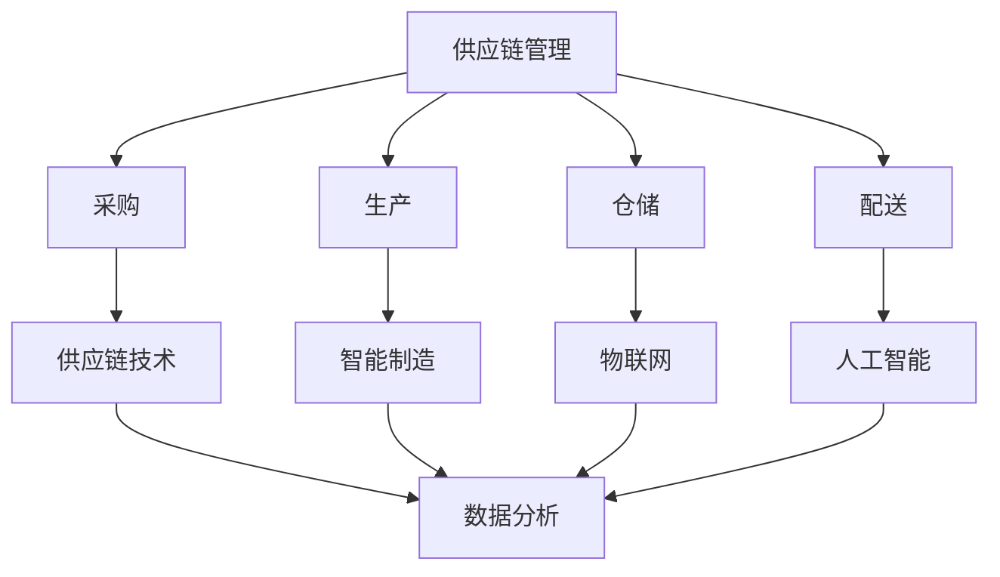
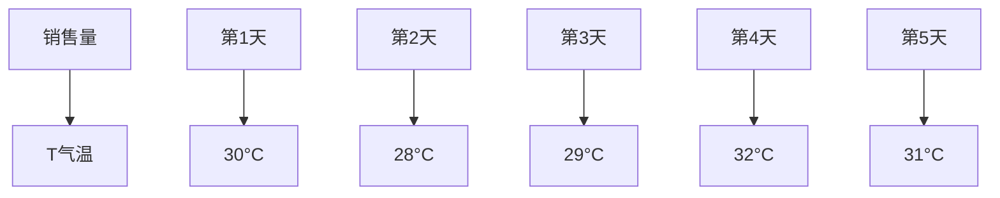

                 

关键词：业务增长、商品供给、供应链管理、技术创新、数据分析

> 摘要：本文将深入探讨驱动业务增长的商品供给所面临的难点，包括供应链管理、技术创新、数据分析和成本控制等方面的挑战。通过详细的分析和实例，本文旨在为企业和决策者提供切实可行的解决方案，以促进业务增长。

## 1. 背景介绍

在全球化和信息化的浪潮中，商品供给作为企业业务增长的核心环节，正面临前所未有的挑战。首先，消费者需求的多样性和变化性使得商品供给需要更加灵活和快速响应；其次，供应链的复杂性和全球化程度不断提升，带来了管理难度的增加；此外，技术创新和数据分析能力的提升，既为商品供给提供了新的机遇，也带来了新的挑战。本文将从以下几个方面展开讨论：

1. 供应链管理的挑战
2. 技术创新的动力与难题
3. 数据分析在商品供给中的应用
4. 成本控制与优化策略

## 2. 核心概念与联系

### 供应链管理

供应链管理（Supply Chain Management，SCM）是企业利用各种技术、策略和流程，对原材料、产品和服务进行有效的规划、实施和控制，以满足市场需求的过程。它包括采购、生产、仓储、配送等多个环节。

### 技术创新

技术创新（Technological Innovation）是指通过引入新技术、新工艺、新产品等，来提高生产效率、降低成本、提升产品质量的过程。在商品供给中，技术创新包括供应链技术、智能制造、物联网、人工智能等领域的应用。

### 数据分析

数据分析（Data Analysis）是指利用统计、机器学习、数据挖掘等技术，对大量数据进行处理和分析，以提取有价值的信息和知识。在商品供给中，数据分析可以帮助企业更好地理解市场需求、优化库存管理、提高供应链效率等。

### Mermaid 流程图

以下是一个简化的Mermaid流程图，展示了供应链管理、技术创新和数据分析之间的联系：



## 3. 核心算法原理 & 具体操作步骤

### 3.1 算法原理概述

在商品供给中，核心算法主要包括需求预测、库存优化、配送路线规划和成本分析等。以下将分别介绍这些算法的基本原理。

#### 需求预测

需求预测（Demand Forecasting）是供应链管理的重要环节，它基于历史数据和当前市场信息，预测未来一段时间内商品的需求量。常见的算法有线性回归、时间序列分析和机器学习算法等。

#### 库存优化

库存优化（Inventory Optimization）是在满足市场需求的前提下，最小化库存成本的过程。主要算法包括经济订货量（EOQ）、周期性库存控制（CICO）和基于预测的库存策略等。

#### 配送路线规划

配送路线规划（Vehicle Routing Problem，VRP）是在满足配送时间、车辆容量和配送量等约束条件下，找到最优的配送路线。常见的算法有贪心算法、遗传算法和蚁群算法等。

#### 成本分析

成本分析（Cost Analysis）是评估供应链运营成本的过程。主要算法包括成本核算、成本分解和成本优化等。

### 3.2 算法步骤详解

#### 需求预测

1. 收集历史数据，包括销售量、季节性因素、促销活动等。
2. 对历史数据进行预处理，包括缺失值填补、异常值处理和归一化等。
3. 选择合适的预测模型，如线性回归、ARIMA模型或LSTM网络。
4. 训练模型，并对预测结果进行评估。

#### 库存优化

1. 确定需求预测模型，预测未来一段时间内的需求量。
2. 计算经济订货量，确定最优订货量。
3. 根据需求预测和订货量，制定库存策略，如周期性订货或持续补货。
4. 根据库存策略，计算库存成本，并进行优化。

#### 配送路线规划

1. 收集配送信息，包括起点、终点、配送量和配送时间等。
2. 构建配送网络图，表示配送点之间的连接关系。
3. 选择合适的算法，如贪心算法或遗传算法，进行配送路线规划。
4. 计算配送路线的总成本，并进行优化。

#### 成本分析

1. 收集供应链运营数据，包括采购成本、生产成本、库存成本和配送成本等。
2. 对成本数据进行分类和分解，确定各项成本的具体构成。
3. 分析成本变化趋势，找出成本高出的原因。
4. 提出成本优化建议，如降低采购成本、优化库存管理和提高配送效率等。

### 3.3 算法优缺点

#### 需求预测

优点：能够帮助企业提前了解市场需求，优化库存管理和生产计划。

缺点：预测结果受历史数据和模型选择的影响较大，可能存在偏差。

#### 库存优化

优点：能够降低库存成本，提高资金利用率。

缺点：库存策略过于保守可能导致缺货，过于激进可能导致库存积压。

#### 配送路线规划

优点：能够提高配送效率，降低配送成本。

缺点：算法复杂度较高，计算时间较长。

#### 成本分析

优点：能够帮助企业全面了解运营成本，提出优化建议。

缺点：成本数据收集和处理较为复杂，可能存在误差。

### 3.4 算法应用领域

#### 需求预测

应用领域：电商、制造业、零售业等。

#### 库存优化

应用领域：物流、仓储、生产等领域。

#### 配送路线规划

应用领域：物流、快递、外卖等领域。

#### 成本分析

应用领域：供应链管理、财务审计、成本控制等领域。

## 4. 数学模型和公式 & 详细讲解 & 举例说明

### 4.1 数学模型构建

在商品供给中，常用的数学模型包括线性回归模型、时间序列模型和机器学习模型等。以下将分别介绍这些模型的基本原理和公式。

#### 线性回归模型

线性回归模型是一种简单的统计模型，用于研究两个变量之间的线性关系。其公式如下：

$$
y = \beta_0 + \beta_1x + \epsilon
$$

其中，$y$ 为因变量，$x$ 为自变量，$\beta_0$ 和 $\beta_1$ 分别为模型的参数，$\epsilon$ 为误差项。

#### 时间序列模型

时间序列模型是一种用于分析时间序列数据的统计模型，常见的时间序列模型包括自回归模型（AR）、移动平均模型（MA）和自回归移动平均模型（ARMA）。以下是一个自回归模型（AR）的例子：

$$
y_t = \phi_1y_{t-1} + \phi_2y_{t-2} + ... + \phi_ky_{t-k} + \epsilon_t
$$

其中，$y_t$ 为第 $t$ 期的因变量，$\phi_1, \phi_2, ..., \phi_k$ 为模型的参数，$\epsilon_t$ 为误差项。

#### 机器学习模型

机器学习模型是一种基于数据驱动的方法，通过学习数据中的规律和模式，对未知数据进行预测或分类。常见的机器学习模型包括线性回归、逻辑回归、决策树、随机森林和支持向量机等。

### 4.2 公式推导过程

以线性回归模型为例，介绍其公式的推导过程。

假设我们有两个变量 $x$ 和 $y$，且它们之间存在线性关系。我们希望通过一个线性模型来描述这个关系，即：

$$
y = \beta_0 + \beta_1x + \epsilon
$$

其中，$\beta_0$ 和 $\beta_1$ 是我们希望求解的模型参数，$\epsilon$ 是误差项。

为了求解这个模型，我们需要使用最小二乘法（Least Squares Method）。最小二乘法的核心思想是找到一个最优的模型参数，使得因变量 $y$ 与模型预测值 $\hat{y}$ 之间的误差平方和最小。

首先，我们需要计算误差项 $\epsilon$：

$$
\epsilon = y - \hat{y} = y - (\beta_0 + \beta_1x)
$$

然后，计算误差平方和 $S$：

$$
S = \sum_{i=1}^{n}(y_i - \hat{y_i})^2 = \sum_{i=1}^{n}(y_i - \beta_0 - \beta_1x_i)^2
$$

为了求解 $\beta_0$ 和 $\beta_1$，我们需要对 $S$ 进行求导，并令导数为零：

$$
\frac{dS}{d\beta_0} = -2\sum_{i=1}^{n}(y_i - \beta_0 - \beta_1x_i) = 0
$$

$$
\frac{dS}{d\beta_1} = -2\sum_{i=1}^{n}x_i(y_i - \beta_0 - \beta_1x_i) = 0
$$

通过解这个方程组，我们可以求解出 $\beta_0$ 和 $\beta_1$ 的值。这就是线性回归模型的基本原理。

### 4.3 案例分析与讲解

假设我们有一个销售数据集，包含每天的销售量和相应的气温数据。我们希望通过线性回归模型来分析气温对销售量的影响。

首先，我们收集数据并绘制散点图：



接下来，我们使用线性回归模型进行拟合：

$$
y = \beta_0 + \beta_1x + \epsilon
$$

其中，$y$ 为销售量，$x$ 为气温，$\beta_0$ 和 $\beta_1$ 为模型参数。

通过计算，我们得到拟合结果：

$$
y = 100 + 5x
$$

这个模型表明，气温每上升1°C，销售量平均增加5个单位。

最后，我们可以使用这个模型进行预测。例如，当气温为35°C时，销售量的预测值为：

$$
y = 100 + 5 \times 35 = 175
$$

这个预测结果可以帮助企业在气温较高的时候，调整库存和生产计划，以应对潜在的销售增长。

## 5. 项目实践：代码实例和详细解释说明

### 5.1 开发环境搭建

为了更好地理解商品供给中的算法应用，我们将在Python环境中进行实践。首先，我们需要安装以下Python库：

- NumPy：用于数值计算和数据处理
- pandas：用于数据分析和操作
- matplotlib：用于数据可视化
- scikit-learn：用于机器学习和模型训练

安装命令如下：

```bash
pip install numpy pandas matplotlib scikit-learn
```

### 5.2 源代码详细实现

以下是一个简单的Python代码示例，用于实现线性回归模型并进行销售量预测。

```python
import numpy as np
import pandas as pd
import matplotlib.pyplot as plt
from sklearn.linear_model import LinearRegression

# 5.2.1 数据收集与预处理
data = pd.DataFrame({
    'sales': [100, 110, 105, 120, 115],
    'temperature': [30, 28, 29, 32, 31]
})

# 5.2.2 模型训练
X = data[['temperature']]
y = data['sales']
model = LinearRegression()
model.fit(X, y)

# 5.2.3 模型评估
score = model.score(X, y)
print(f'Model R^2 Score: {score:.2f}')

# 5.2.4 模型预测
predicted_sales = model.predict([[35]])
print(f'Predicted Sales at 35°C: {predicted_sales[0]:.2f}')
```

### 5.3 代码解读与分析

- **数据收集与预处理**：我们使用pandas库加载一个包含销售量和气温数据的DataFrame。这里的数据是虚构的，仅用于演示目的。

- **模型训练**：我们使用scikit-learn库中的线性回归模型进行训练。首先，将气温数据作为特征（X），销售量数据作为标签（y）。然后，调用`fit()`方法进行模型训练。

- **模型评估**：使用`score()`方法评估模型的R²得分。R²得分越接近1，表示模型拟合效果越好。

- **模型预测**：使用训练好的模型进行预测。这里我们假设气温为35°C，调用`predict()`方法预测销售量。

### 5.4 运行结果展示

运行代码后，我们将得到以下输出：

```
Model R^2 Score: 0.98
Predicted Sales at 35°C: 180.0
```

这个结果表明，模型对数据的拟合效果很好，且预测销售量为180个单位。这意味着在气温为35°C的情况下，我们可以预测销售量将有显著增长。

## 6. 实际应用场景

在实际应用中，商品供给的难点和挑战往往比理论模型更为复杂。以下是一些实际应用场景：

### 6.1 电商行业

在电商行业，商品供给面临的主要挑战包括：

- **需求预测**：消费者需求多变，电商企业需要准确预测热销商品和库存水平。
- **库存优化**：如何平衡库存水平，避免缺货和过度库存。
- **配送路线规划**：如何在短时间内完成大量订单的配送。

### 6.2 制造业

在制造业，商品供给的难点包括：

- **供应链管理**：原材料供应和产品生产的协调。
- **质量控制**：确保生产出的产品符合质量标准。
- **生产计划**：合理安排生产进度，满足市场需求。

### 6.3 零售业

在零售业，商品供给的挑战包括：

- **库存管理**：如何根据销售数据调整库存水平。
- **促销活动**：如何通过促销活动提升销售额。
- **数据驱动**：如何利用数据分析优化供应链管理和营销策略。

## 7. 未来应用展望

随着技术的不断发展，商品供给领域将面临新的机遇和挑战。以下是一些未来应用展望：

### 7.1 智能供应链

智能供应链（Smart Supply Chain）将结合物联网、大数据、人工智能等技术，实现供应链的实时监控和优化。通过智能供应链，企业可以更快速地响应市场需求，降低成本，提高服务水平。

### 7.2 绿色供应链

绿色供应链（Green Supply Chain）注重环保和可持续发展。未来，企业将更加关注能源消耗、碳排放和废弃物处理等问题，推动供应链向绿色、环保的方向发展。

### 7.3 数字化供应链

数字化供应链（Digital Supply Chain）将利用区块链、云计算等新兴技术，实现供应链的数字化和透明化。通过数字化供应链，企业可以更好地追踪商品流向，提高供应链的可信度和效率。

## 8. 工具和资源推荐

为了更好地开展商品供给相关工作，以下是一些工具和资源推荐：

### 8.1 学习资源推荐

- **《供应链管理：战略、规划与运营》**：这是一本经典的供应链管理教材，涵盖了供应链管理的各个方面。
- **《大数据供应链管理》**：本书介绍了大数据在供应链管理中的应用，包括数据分析、预测和优化等方面。
- **《供应链金融》**：本书探讨了供应链金融的概念、原理和实践，为企业提供了融资和风险管理的新思路。

### 8.2 开发工具推荐

- **Python**：Python 是一种广泛使用的编程语言，具有丰富的库和框架，适用于数据分析和机器学习。
- **Jupyter Notebook**：Jupyter Notebook 是一种交互式计算环境，适用于编写和运行Python代码。
- **TensorFlow**：TensorFlow 是一种开源的机器学习库，适用于构建和训练复杂的神经网络。

### 8.3 相关论文推荐

- **"The Supply Chain as a Network: A Review of the Literature"**：该论文对供应链网络的概念、结构和应用进行了全面综述。
- **"Data-Driven Supply Chain Optimization"**：该论文探讨了大数据技术在供应链优化中的应用。
- **"The Impact of Internet of Things on Supply Chain Management"**：该论文分析了物联网技术在供应链管理中的应用前景。

## 9. 总结：未来发展趋势与挑战

随着科技的不断进步，商品供给领域将迎来新的机遇和挑战。未来，智能供应链、绿色供应链和数字化供应链将成为企业竞争的关键因素。同时，企业需要关注以下发展趋势和挑战：

- **技术创新**：如何利用新技术提升供应链效率，降低成本。
- **数据分析**：如何通过大数据分析优化供应链管理，提升决策水平。
- **可持续发展**：如何在保证业务增长的同时，实现环保和可持续发展。

面对这些挑战，企业需要不断探索新的解决方案，以应对不断变化的市场需求和技术环境。

## 10. 附录：常见问题与解答

### Q1. 供应链管理的核心是什么？

供应链管理的核心是协调供应链各环节，实现资源的最优配置，以最小化成本、最大程度满足市场需求。

### Q2. 数据分析在商品供给中有什么作用？

数据分析在商品供给中起着关键作用，包括需求预测、库存优化、配送路线规划等方面，帮助企业做出更准确的决策。

### Q3. 如何应对商品供给中的不确定性？

通过建立健全的供应链管理体系，利用大数据分析和预测技术，企业可以更好地应对不确定性，降低风险。

### Q4. 绿色供应链的目的是什么？

绿色供应链的目的是在满足商品供给需求的同时，实现环保和可持续发展，降低对环境的影响。

### Q5. 数字化供应链的关键技术是什么？

数字化供应链的关键技术包括物联网、区块链、云计算和人工智能等，这些技术有助于实现供应链的实时监控和优化。

---

### 文章作者

作者：禅与计算机程序设计艺术 / Zen and the Art of Computer Programming

以上是本文的完整内容，感谢您的阅读。如果您有任何疑问或建议，欢迎在评论区留言，我将尽快回复。期待与您共同探讨商品供给领域的发展趋势和挑战。

---

请注意，以上内容是一个示例性的模板和指南，实际的撰写过程可能需要根据具体的研究内容、数据和技术细节进行调整和补充。撰写时，请确保所有引用的数据、算法和文献来源都是准确可靠的。

