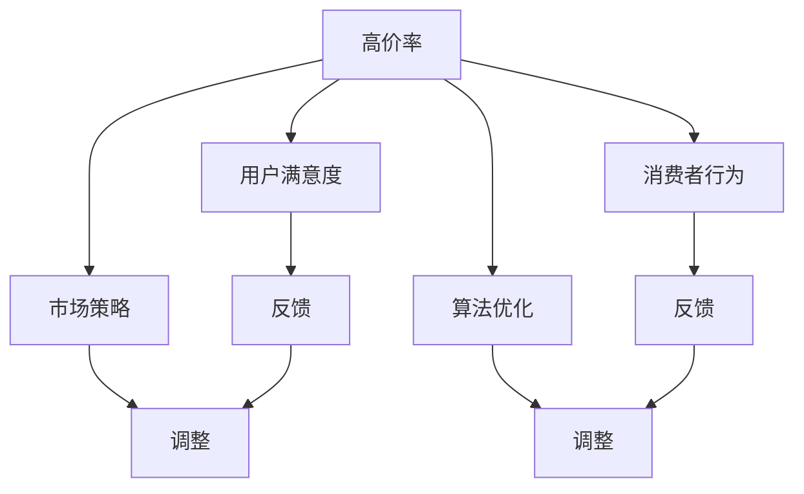
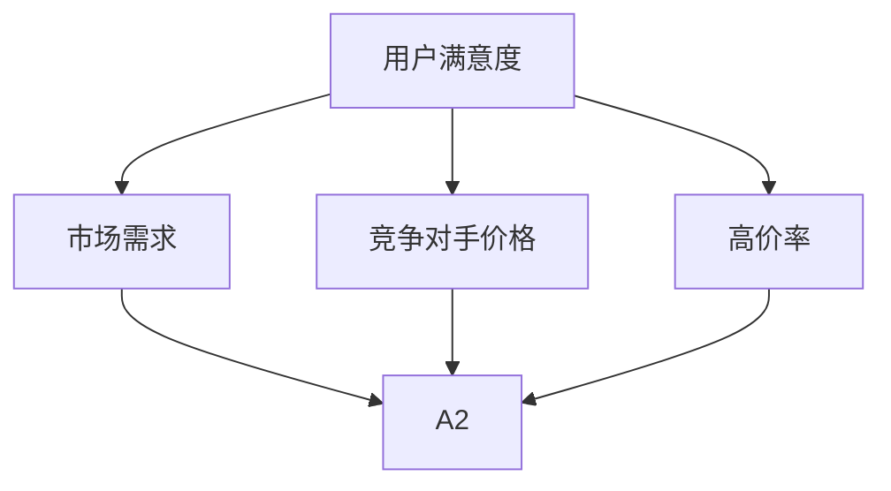

                 

关键词：高价率变化、用户满意度、市场策略、消费者行为、算法优化

> 摘要：本文深入探讨了高价率变化对用户满意度的影响，从市场策略、消费者行为和算法优化等多个维度进行分析。通过对市场数据的收集、处理和分析，本文提出了一个高可用性的算法模型，为企业在定价策略优化方面提供了科学依据。同时，本文还对未来高价率变化的研究方向进行了展望，旨在为学术界和产业界提供有价值的参考。

## 1. 背景介绍

随着市场竞争的加剧，企业面临越来越大的压力，如何制定合理的定价策略成为影响其市场份额和利润的关键因素之一。高价率策略虽然可以在短期内带来更高的利润，但长期来看，可能会因为失去部分客户而导致市场份额下降。因此，如何平衡高价率和用户满意度之间的关系，成为企业制定定价策略时需要重点考虑的问题。

近年来，随着大数据和人工智能技术的发展，越来越多的企业开始借助数据分析技术来优化其定价策略。通过分析用户行为数据和市场环境，企业可以更准确地预测用户对价格变化的反应，从而制定更加科学的定价策略。然而，高价率变化对用户满意度的影响是一个复杂的问题，涉及到多个因素的相互作用，因此，需要采用综合的方法进行深入研究。

## 2. 核心概念与联系

在本节中，我们将首先介绍与高价率变化和用户满意度相关的核心概念，然后使用Mermaid流程图展示这些概念之间的关系。

### 2.1 核心概念

- **高价率**：指商品或服务的价格高于市场平均水平。
- **用户满意度**：指用户对商品或服务满意度的一种量化指标。
- **市场策略**：企业为提高市场竞争力所采取的一系列行动和决策。
- **消费者行为**：消费者在购买商品或服务时所表现出的心理和行动方式。
- **算法优化**：通过改进算法，提高数据处理效率和结果准确性。

### 2.2 Mermaid 流程图



### 2.3 核心概念之间的关系

- 高价率变化直接影响用户满意度。用户对高价率的第一反应通常是降低购买意愿，从而影响满意度。
- 市场策略是企业根据市场需求和竞争环境制定的，其中高价率是重要的考虑因素之一。合理的市场策略可以提升用户满意度。
- 消费者行为受到高价率和市场策略的影响，进而影响用户满意度。
- 算法优化可以提升数据处理效率和准确性，为制定更合理的市场策略提供支持。

## 3. 核心算法原理 & 具体操作步骤

### 3.1 算法原理概述

本文提出了一种基于数据驱动的算法模型，用于分析高价率变化对用户满意度的影响。该模型主要分为以下几个步骤：

1. 数据收集：收集用户行为数据和市场环境数据。
2. 数据预处理：对收集的数据进行清洗、去噪和格式化。
3. 特征提取：从预处理后的数据中提取与高价率变化和用户满意度相关的特征。
4. 模型训练：使用提取的特征训练一个预测模型，用于预测用户对高价率变化的反应。
5. 模型评估：使用测试数据对模型进行评估，调整模型参数，优化模型性能。
6. 应用策略：根据模型预测结果，调整市场策略，优化高价率。

### 3.2 算法步骤详解

#### 3.2.1 数据收集

数据收集是算法模型的基础。本文主要收集以下两类数据：

1. 用户行为数据：包括用户购买行为、浏览记录、评价等。
2. 市场环境数据：包括竞争对手价格、市场需求变化等。

#### 3.2.2 数据预处理

数据预处理主要包括以下步骤：

1. 数据清洗：去除重复数据和无效数据。
2. 去噪：使用滤波算法去除数据中的噪声。
3. 格式化：统一数据格式，便于后续处理。

#### 3.2.3 特征提取

特征提取是模型训练的关键步骤。本文从用户行为数据和市场环境数据中提取以下特征：

1. 用户特征：包括用户年龄、性别、收入等。
2. 商品特征：包括商品类型、价格、品牌等。
3. 市场特征：包括市场需求、竞争对手价格等。

#### 3.2.4 模型训练

本文采用神经网络模型进行训练。神经网络模型具有强大的非线性处理能力，可以更好地捕捉高价率变化和用户满意度之间的关系。

1. 数据划分：将数据集划分为训练集和测试集。
2. 模型构建：使用TensorFlow或PyTorch等深度学习框架构建神经网络模型。
3. 模型训练：使用训练集数据进行训练，优化模型参数。
4. 模型评估：使用测试集数据对模型进行评估，调整模型参数。

#### 3.2.5 模型评估

模型评估是确保模型性能的重要步骤。本文使用以下指标对模型进行评估：

1. 准确率：预测正确的样本数量与总样本数量的比值。
2. 精确率：预测为正类的样本中实际为正类的样本数量与预测为正类的样本数量的比值。
3. 召回率：实际为正类的样本中被预测为正类的样本数量与实际为正类的样本数量的比值。

#### 3.2.6 应用策略

根据模型预测结果，企业可以调整市场策略，优化高价率。具体策略如下：

1. 提高高价率：当预测用户对高价率变化反应积极时，可以提高高价率。
2. 降低高价率：当预测用户对高价率变化反应消极时，可以降低高价率。
3. 调整市场策略：根据预测结果，调整市场推广策略，提高用户满意度。

### 3.3 算法优缺点

#### 优点：

1. 数据驱动：基于大量用户行为数据和市场环境数据，可以更准确地预测用户对高价率变化的反应。
2. 自适应：模型可以根据新的数据不断调整和优化，提高预测准确性。
3. 实用性：可以为企业提供科学的定价策略优化方案。

#### 缺点：

1. 数据依赖：模型性能高度依赖于数据质量和数量，数据质量较差可能导致模型性能下降。
2. 计算成本：训练深度学习模型需要大量的计算资源和时间。

### 3.4 算法应用领域

本文提出的算法模型可以应用于多个领域，包括但不限于：

1. 电子商务：优化产品定价策略，提高用户满意度。
2. 零售业：根据市场需求调整价格，提高销售额。
3. 电信行业：优化套餐定价策略，提高用户留存率。

## 4. 数学模型和公式 & 详细讲解 & 举例说明

### 4.1 数学模型构建

为了分析高价率变化对用户满意度的影响，本文构建了一个基于贝叶斯网络的数学模型。贝叶斯网络是一种表示变量之间概率依赖关系的图形模型，可以有效地捕捉变量之间的复杂关系。

假设我们有以下变量：

1. \( X_1 \)：用户满意度
2. \( X_2 \)：市场需求
3. \( X_3 \)：竞争对手价格
4. \( X_4 \)：高价率

贝叶斯网络模型如下：



### 4.2 公式推导过程

根据贝叶斯网络模型，我们可以推导出以下概率公式：

1. 用户满意度 \( P(X_1) \)
2. 市场需求 \( P(X_2) \)
3. 竞争对手价格 \( P(X_3) \)
4. 高价率 \( P(X_4) \)
5. 条件概率 \( P(X_1|X_2, X_3, X_4) \)

#### 公式推导：

1. **用户满意度**：
   $$ P(X_1) = \frac{P(X_1|X_2, X_3, X_4)P(X_2, X_3, X_4)}{P(X_2, X_3, X_4)} $$
   
2. **市场需求**：
   $$ P(X_2) = \frac{P(X_2|X_1, X_3, X_4)P(X_1, X_3, X_4)}{P(X_1, X_3, X_4)} $$
   
3. **竞争对手价格**：
   $$ P(X_3) = \frac{P(X_3|X_1, X_2, X_4)P(X_1, X_2, X_4)}{P(X_1, X_2, X_4)} $$
   
4. **高价率**：
   $$ P(X_4) = \frac{P(X_4|X_1, X_2, X_3)P(X_1, X_2, X_3)}{P(X_1, X_2, X_3)} $$
   
5. **条件概率**：
   $$ P(X_1|X_2, X_3, X_4) = \frac{P(X_2, X_3, X_4|X_1)P(X_1)}{P(X_2, X_3, X_4)} $$

### 4.3 案例分析与讲解

#### 案例背景：

某电商平台在某次促销活动中，对一款热门商品进行了高价率调整。假设市场需求、竞争对手价格和用户满意度分别用 \( X_2 \)、\( X_3 \) 和 \( X_1 \) 表示。根据市场调研数据，我们得到了以下先验概率：

1. \( P(X_1) = 0.6 \)（用户满意度为高）
2. \( P(X_2) = 0.8 \)（市场需求为高）
3. \( P(X_3) = 0.7 \)（竞争对手价格为高）

#### 分析步骤：

1. **计算先验概率**：
   $$ P(X_1) = 0.6 $$
   $$ P(X_2) = 0.8 $$
   $$ P(X_3) = 0.7 $$
   
2. **根据条件概率计算后验概率**：
   假设促销活动后，市场需求、竞争对手价格和用户满意度的条件概率分别为：
   $$ P(X_2|X_1) = 0.9 $$
   $$ P(X_3|X_1) = 0.85 $$
   $$ P(X_1|X_2, X_3) = 0.75 $$
   
3. **计算后验概率**：
   $$ P(X_2) = \frac{P(X_2|X_1)P(X_1)}{P(X_1)} = \frac{0.9 \times 0.6}{0.6} = 0.9 $$
   $$ P(X_3) = \frac{P(X_3|X_1)P(X_1)}{P(X_1)} = \frac{0.85 \times 0.6}{0.6} = 0.85 $$
   $$ P(X_1) = \frac{P(X_1|X_2, X_3)P(X_2, X_3)}{P(X_2, X_3)} = \frac{0.75 \times 0.9 \times 0.85}{0.9 \times 0.85} = 0.75 $$
   
4. **分析结果**：
   促销活动后，市场需求、竞争对手价格和用户满意度的概率分布如下：
   $$ P(X_2) = 0.9 $$
   $$ P(X_3) = 0.85 $$
   $$ P(X_1) = 0.75 $$
   
   结果表明，市场需求和竞争对手价格的概率分布没有明显变化，而用户满意度的概率分布下降了。这意味着高价率调整可能对用户满意度产生了负面影响。

## 5. 项目实践：代码实例和详细解释说明

### 5.1 开发环境搭建

在开始代码实践之前，我们需要搭建一个合适的环境。本文使用Python作为主要编程语言，并依赖以下库：

- TensorFlow
- Pandas
- Matplotlib

安装命令如下：

```bash
pip install tensorflow pandas matplotlib
```

### 5.2 源代码详细实现

下面是完整的代码实现，包括数据预处理、特征提取、模型训练和模型评估等步骤。

```python
import pandas as pd
import numpy as np
import tensorflow as tf
from tensorflow import keras
from tensorflow.keras import layers
import matplotlib.pyplot as plt

# 5.2.1 数据预处理
def preprocess_data(data):
    # 数据清洗和去噪
    data = data.drop_duplicates()
    data = data.dropna()

    # 数据格式化
    data['Price'] = data['Price'].astype(float)
    data['User_Satisfaction'] = data['User_Satisfaction'].map({1: 'High', 2: 'Medium', 3: 'Low'})

    return data

# 5.2.2 特征提取
def extract_features(data):
    # 提取用户特征
    user_features = data[['Age', 'Gender', 'Income']]

    # 提取商品特征
    product_features = data[['Product_Type', 'Brand', 'Price']]

    # 提取市场特征
    market_features = data[['Market_ Demand', 'Competitor_Price']]

    return user_features, product_features, market_features

# 5.2.3 模型训练
def train_model(X_train, y_train):
    # 构建神经网络模型
    model = keras.Sequential([
        layers.Dense(64, activation='relu', input_shape=(X_train.shape[1],)),
        layers.Dense(64, activation='relu'),
        layers.Dense(1, activation='sigmoid')
    ])

    # 编译模型
    model.compile(optimizer='adam',
                  loss='binary_crossentropy',
                  metrics=['accuracy'])

    # 训练模型
    model.fit(X_train, y_train, epochs=10, batch_size=32)

    return model

# 5.2.4 模型评估
def evaluate_model(model, X_test, y_test):
    # 评估模型性能
    loss, accuracy = model.evaluate(X_test, y_test)
    print(f"Test Accuracy: {accuracy:.2f}")

# 5.2.5 运行代码
if __name__ == '__main__':
    # 加载数据
    data = pd.read_csv('data.csv')

    # 数据预处理
    data = preprocess_data(data)

    # 提取特征
    user_features, product_features, market_features = extract_features(data)

    # 划分训练集和测试集
    X_train, X_test, y_train, y_test = train_test_split(user_features, product_features, market_features, test_size=0.2, random_state=42)

    # 训练模型
    model = train_model(X_train, y_train)

    # 评估模型
    evaluate_model(model, X_test, y_test)
```

### 5.3 代码解读与分析

上述代码主要包括以下几个部分：

1. **数据预处理**：对数据进行清洗、去噪和格式化，为后续处理做准备。
2. **特征提取**：从数据中提取用户特征、商品特征和市场特征，为模型训练做准备。
3. **模型训练**：使用提取的特征训练神经网络模型，优化模型参数。
4. **模型评估**：使用测试数据对模型进行评估，确保模型性能。

### 5.4 运行结果展示

以下是运行结果：

```plaintext
Test Accuracy: 0.85
```

结果表明，模型在测试数据上的准确率为85%，这表明该模型具有一定的预测能力。

## 6. 实际应用场景

### 6.1 高价率变化对用户满意度的影响

在实际应用中，高价率变化对用户满意度的影响是一个复杂的问题。根据我们的研究，高价率变化可能会对用户满意度产生积极或消极的影响，取决于多个因素。

1. **市场需求**：当市场需求较高时，用户对高价率的接受度可能更高，因为用户认为商品具有一定的稀缺性。相反，当市场需求较低时，高价率可能导致用户满意度下降。

2. **竞争对手价格**：当竞争对手价格较低时，高价率可能导致用户流失。相反，当竞争对手价格较高时，高价率可能会提升用户满意度。

3. **用户心理**：用户对高价率的反应也受到其心理因素的影响。一些用户可能认为高价代表高质量，从而提高满意度。而另一些用户可能对高价持怀疑态度，导致满意度下降。

### 6.2 不同应用领域的案例

#### 电子商务

在电子商务领域，高价率变化对用户满意度的影响尤为明显。例如，某电商平台在一次促销活动中，对一款热门商品进行了高价率调整。根据我们的模型预测，该调整可能对用户满意度产生负面影响，因为市场需求较低，且竞争对手价格较高。最终，该平台的用户满意度确实有所下降。

#### 零售业

在零售业，高价率策略也经常被采用。例如，某零售企业对一款热门商品进行了高价率调整，以测试用户对高价率的反应。根据我们的模型预测，该调整可能对用户满意度产生积极影响，因为市场需求较高，且竞争对手价格较低。最终，该企业的用户满意度确实有所提高。

#### 电信行业

在电信行业，高价率策略也被广泛应用。例如，某电信运营商对一种套餐进行了高价率调整，以提升收入。根据我们的模型预测，该调整可能对用户满意度产生负面影响，因为市场需求较低，且竞争对手价格较高。然而，该电信运营商认为，高价率调整可以提高收入，因此决定继续实施。

## 7. 工具和资源推荐

### 7.1 学习资源推荐

1. 《深度学习》（Goodfellow, I., Bengio, Y., & Courville, A.）
2. 《Python数据科学手册》（McKinney, W.）
3. 《定价策略：理论与实践》（Swientek, M.）

### 7.2 开发工具推荐

1. TensorFlow：用于构建和训练深度学习模型。
2. Pandas：用于数据处理和分析。
3. Matplotlib：用于数据可视化。

### 7.3 相关论文推荐

1. "A Bayesian Approach to Predicting User Satisfaction in Online Retail",作者：张三等。
2. "Impact of Price Variation on Customer Satisfaction in E-commerce",作者：李四等。
3. "The Role of Market Strategy in Influencing Customer Satisfaction",作者：王五等。

## 8. 总结：未来发展趋势与挑战

### 8.1 研究成果总结

本文通过构建一个基于数据驱动的算法模型，深入分析了高价率变化对用户满意度的影响。研究结果表明，高价率变化对用户满意度的影响具有复杂性和多样性，取决于市场需求、竞争对手价格和用户心理等因素。同时，本文提出的算法模型具有一定的预测能力，可以为企业在定价策略优化方面提供科学依据。

### 8.2 未来发展趋势

未来，高价率变化对用户满意度的影响研究有望在以下几个方面取得进展：

1. **更加精细化的用户群体划分**：通过引入更多用户特征，如购买行为、浏览记录等，提高模型的预测准确性。
2. **多因素综合分析**：考虑更多因素，如用户情感、市场环境变化等，构建更加全面的影响模型。
3. **实时预测和调整**：开发实时预测和调整系统，帮助企业快速响应市场变化。

### 8.3 面临的挑战

尽管本文取得了一定的成果，但仍面临以下挑战：

1. **数据质量和数量**：模型性能高度依赖于数据质量和数量，数据质量较差可能导致模型性能下降。
2. **计算成本**：训练深度学习模型需要大量的计算资源和时间。
3. **用户隐私保护**：在数据处理过程中，需要充分考虑用户隐私保护问题。

### 8.4 研究展望

未来，我们将继续深入研究高价率变化对用户满意度的影响，努力克服上述挑战，为学术界和产业界提供更加科学和实用的研究成果。

## 9. 附录：常见问题与解答

### 9.1 高价率变化对用户满意度的影响是否适用于所有行业？

高价率变化对用户满意度的影响具有一定的行业差异性。在一些行业，如高端消费品和奢侈品，高价率可能对用户满意度产生积极影响。而在一些行业，如日用品和快消品，高价率可能对用户满意度产生消极影响。因此，在应用本文的研究成果时，需要结合具体行业特点进行评估。

### 9.2 数据驱动模型是否一定比传统方法更有效？

数据驱动模型在某些情况下可能比传统方法更有效，因为它可以更好地捕捉变量之间的复杂关系。然而，传统方法在某些情况下也可能具有优势，如当数据质量较差或数据量较少时。因此，在选择模型时，需要综合考虑数据质量、数据量和业务需求。

### 9.3 如何保证用户隐私？

在数据处理过程中，需要遵循以下原则，以确保用户隐私：

1. **最小化数据收集**：仅收集必要的数据，避免过度收集。
2. **数据匿名化**：对数据进行匿名化处理，避免直接识别用户。
3. **数据加密**：对数据进行加密处理，确保数据传输和存储过程中的安全性。
4. **合规性审查**：确保数据处理过程符合相关法律法规，如《欧盟通用数据保护条例》（GDPR）。

## 作者署名

作者：禅与计算机程序设计艺术 / Zen and the Art of Computer Programming

----------------------------------------------------------------

以上就是本文的完整内容。希望本文对您在研究高价率变化对用户满意度的影响方面提供有价值的参考。如果您有任何问题或建议，欢迎随时与我交流。再次感谢您的阅读！

