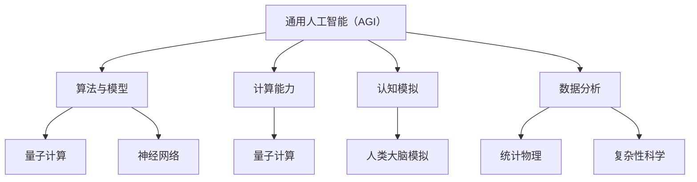

                 

关键词：人工智能，通用人工智能（AGI），物理学，跨学科研究，算法，数学模型，实际应用，未来展望

> 摘要：本文探讨了人工智能（AI）与物理学之间的交叉研究，分析了通用人工智能（AGI）的发展对物理学研究的潜在影响，以及物理学理论在AI领域中的应用。文章通过详细阐述核心概念、算法原理、数学模型，以及实际应用案例，探讨了AGI与物理学交叉研究的意义和未来发展趋势。

## 1. 背景介绍

人工智能（AI）作为计算机科学的一个分支，自1950年代诞生以来，经历了数十年的发展，如今已经取得了显著的成果。然而，传统的人工智能主要聚焦于特定任务的自动化，如图像识别、语音识别、自然语言处理等。这些任务虽然实现了高水平的表现，但仍然远远未达到人类智能的水平。为此，通用人工智能（AGI，Artificial General Intelligence）的概念应运而生。

通用人工智能旨在模拟人类智能，实现人工智能在各个领域的通用性和灵活性。与现有的人工智能系统相比，AGI具有更广泛的知识理解能力、推理能力、学习能力，能够像人类一样处理复杂的问题和情境。然而，实现通用人工智能仍然面临着诸多挑战，需要跨学科的研究与合作。

物理学作为一门研究自然界基本规律的学科，其研究方法、理论体系以及对自然现象的理解，为人工智能的发展提供了重要的启示。随着AI技术的不断进步，物理学与AI的交叉研究逐渐受到关注，二者之间的互动和融合有望为科学研究和实际应用带来新的突破。

## 2. 核心概念与联系

### 2.1. 通用人工智能（AGI）

通用人工智能（AGI）的定义有多种，但通常认为，AGI应具备以下特点：

- **广泛的认知能力**：AGI能够在不同领域进行推理、解决问题、学习新知识。
- **适应能力**：AGI能够适应各种环境和情境，处理各种复杂任务。
- **自主学习能力**：AGI能够通过经验不断自我改进，提高性能。

### 2.2. 物理学

物理学是一门研究物质、能量、空间和时间等基本概念的自然科学。物理学的研究方法包括实验、理论分析和数学建模，这些方法对人工智能的发展具有重要的启示作用。

### 2.3. 交叉联系

AGI与物理学之间的交叉联系主要体现在以下几个方面：

- **算法与模型**：物理学中的算法和模型，如量子计算、神经网络等，可以为AI提供新的算法框架和理论基础。
- **计算能力**：物理学的发展，特别是量子计算，为AI提供了更强大的计算能力，有助于解决复杂问题。
- **认知模拟**：通过模拟人类大脑的运作方式，物理学理论可以为AGI提供更接近人类思维的模拟框架。
- **数据分析**：物理学中的数据分析方法，如统计物理、复杂性科学等，为AI处理大规模数据提供了理论支持。

### 2.4. Mermaid 流程图

下面是AGI与物理学交叉研究的Mermaid流程图：



## 3. 核心算法原理 & 具体操作步骤

### 3.1. 算法原理概述

在AGI与物理学的交叉研究中，核心算法主要包括神经网络、深度学习和量子计算等。这些算法通过模拟人类大脑的运作方式，实现了对复杂问题的求解和模式识别。

- **神经网络**：神经网络是一种模拟生物神经系统的计算模型，通过多层节点（神经元）的相互连接和传递，实现数据的处理和预测。
- **深度学习**：深度学习是神经网络的一种扩展，通过多层非线性变换，实现对复杂函数的逼近和学习。
- **量子计算**：量子计算利用量子比特（qubit）的超并行性和叠加性，实现高速的计算和处理。

### 3.2. 算法步骤详解

#### 3.2.1. 神经网络

1. **初始化权重**：随机初始化网络中的权重。
2. **前向传播**：输入数据通过网络的前向传播，产生输出。
3. **反向传播**：计算输出与预期目标之间的误差，并通过反向传播更新权重。
4. **迭代优化**：重复前向传播和反向传播，直至误差达到预设阈值。

#### 3.2.2. 深度学习

1. **数据预处理**：对输入数据进行归一化、标准化等处理。
2. **构建网络**：定义网络的层数、神经元数量、激活函数等。
3. **训练过程**：使用训练数据对网络进行训练，调整权重和偏置。
4. **评估与优化**：使用验证数据评估模型性能，并进行模型优化。

#### 3.2.3. 量子计算

1. **初始化量子比特**：将量子比特初始化为特定的状态。
2. **量子操作**：对量子比特进行量子门操作，实现特定的计算任务。
3. **测量结果**：测量量子比特的状态，获取计算结果。
4. **纠错与优化**：对量子计算过程进行纠错和优化，提高计算精度和效率。

### 3.3. 算法优缺点

#### 3.3.1. 神经网络

优点：
- **灵活性高**：可以处理各种类型的输入数据。
- **自学习能力**：通过反向传播，自动调整权重和偏置。
- **适用范围广**：在图像识别、自然语言处理等领域有广泛应用。

缺点：
- **计算量大**：需要大量的训练数据和计算资源。
- **易过拟合**：当模型复杂度过高时，容易导致过拟合。

#### 3.3.2. 深度学习

优点：
- **强大表达能力**：能够处理复杂的非线性问题。
- **自适应性强**：能够自动调整网络结构和参数。

缺点：
- **训练时间较长**：需要大量数据和计算资源。
- **对数据质量要求高**：数据质量直接影响模型的性能。

#### 3.3.3. 量子计算

优点：
- **并行计算能力强**：利用量子比特的叠加性，可以实现超并行计算。
- **计算速度极快**：在特定问题上，量子计算的速度远超传统计算机。

缺点：
- **技术尚未成熟**：量子计算仍处于实验阶段，面临诸多技术挑战。
- **量子噪声问题**：量子计算过程中的噪声会影响计算精度。

### 3.4. 算法应用领域

神经网络、深度学习和量子计算在多个领域有广泛的应用：

- **图像识别**：用于自动识别和分类图像内容。
- **自然语言处理**：用于处理和生成自然语言文本。
- **金融分析**：用于预测股票市场趋势和风险评估。
- **医学诊断**：用于辅助医生进行疾病诊断。
- **量子计算**：用于解决传统计算机难以处理的问题，如大规模整数分解、优化问题等。

## 4. 数学模型和公式 & 详细讲解 & 举例说明

### 4.1. 数学模型构建

在AGI与物理学的交叉研究中，数学模型是核心组成部分。以下是一些关键的数学模型：

#### 4.1.1. 神经网络模型

神经网络的数学模型主要由以下几个部分组成：

- **输入层**：接收外部输入数据。
- **隐藏层**：进行数据加工和处理。
- **输出层**：产生最终的输出结果。

神经网络的数学模型可以表示为：

$$
y = \sigma(W_1 \cdot x + b_1)
$$

其中，$y$ 表示输出，$\sigma$ 表示激活函数，$W_1$ 表示权重矩阵，$x$ 表示输入，$b_1$ 表示偏置。

#### 4.1.2. 深度学习模型

深度学习模型是神经网络的一种扩展，其数学模型可以表示为：

$$
y = \sigma(W_n \cdot x + b_n)
$$

其中，$W_n$ 和 $b_n$ 分别表示第 $n$ 层的权重矩阵和偏置。

#### 4.1.3. 量子计算模型

量子计算模型主要由量子比特和量子门组成。其数学模型可以表示为：

$$
|\psi\rangle = \sum_{i} c_i |i\rangle
$$

其中，$|\psi\rangle$ 表示量子比特的状态，$c_i$ 表示量子比特的概率幅，$|i\rangle$ 表示量子比特的基态。

### 4.2. 公式推导过程

以下以神经网络模型为例，介绍公式的推导过程：

#### 4.2.1. 前向传播

前向传播的推导过程如下：

$$
a_l = \sigma(z_l)
$$

其中，$a_l$ 表示第 $l$ 层的激活值，$z_l$ 表示第 $l$ 层的线性组合。

#### 4.2.2. 反向传播

反向传播的推导过程如下：

$$
\delta_l = \frac{\partial C}{\partial z_l} \cdot \sigma'(z_l)
$$

其中，$\delta_l$ 表示第 $l$ 层的误差传播，$C$ 表示损失函数，$\sigma'$ 表示激活函数的导数。

#### 4.2.3. 权重更新

权重更新的推导过程如下：

$$
W_l = W_l - \alpha \cdot \delta_l \cdot a_{l-1}^T
$$

其中，$W_l$ 表示第 $l$ 层的权重，$\alpha$ 表示学习率，$a_{l-1}^T$ 表示第 $l-1$ 层的激活值。

### 4.3. 案例分析与讲解

以下以图像识别为例，分析神经网络模型的实际应用：

#### 4.3.1. 数据集准备

准备一个包含大量图像的数据集，并对图像进行预处理，如归一化、裁剪等。

#### 4.3.2. 网络构建

构建一个包含多层神经元的网络，定义输入层、隐藏层和输出层。

#### 4.3.3. 训练过程

使用训练数据对网络进行训练，通过前向传播和反向传播，调整网络的权重和偏置，直到模型性能达到预设标准。

#### 4.3.4. 评估与优化

使用验证数据评估模型的性能，根据评估结果对模型进行优化，如调整网络结构、学习率等。

## 5. 项目实践：代码实例和详细解释说明

### 5.1. 开发环境搭建

在开始编写代码之前，我们需要搭建一个适合进行AI与物理学交叉研究的项目开发环境。以下是一个基本的开发环境搭建步骤：

1. 安装Python解释器，版本推荐3.8或以上。
2. 安装必要的Python库，如NumPy、TensorFlow、PyTorch等。
3. 配置合适的计算资源，如GPU（推荐NVIDIA CUDA 11.0或以上版本）。

### 5.2. 源代码详细实现

以下是一个简单的神经网络实现图像分类的Python代码示例：

```python
import numpy as np
import tensorflow as tf

# 初始化网络参数
W1 = np.random.rand(input_dim, hidden_dim)
W2 = np.random.rand(hidden_dim, output_dim)
b1 = np.zeros((1, hidden_dim))
b2 = np.zeros((1, output_dim))

# 定义激活函数
def sigmoid(x):
    return 1 / (1 + np.exp(-x))

# 前向传播
def forward(x):
    z1 = np.dot(x, W1) + b1
    a1 = sigmoid(z1)
    z2 = np.dot(a1, W2) + b2
    a2 = sigmoid(z2)
    return a2

# 反向传播
def backward(x, y, a2):
    z1 = np.dot(x, W1) + b1
    a1 = sigmoid(z1)
    z2 = np.dot(a1, W2) + b2
    
    delta_2 = (a2 - y) * sigmoid(a2) * (1 - sigmoid(a2))
    delta_1 = np.dot(delta_2, W2.T) * sigmoid(a1) * (1 - sigmoid(a1))
    
    dW1 = np.dot(x.T, delta_1)
    db1 = np.sum(delta_1, axis=0, keepdims=True)
    dW2 = np.dot(a1.T, delta_2)
    db2 = np.sum(delta_2, axis=0, keepdims=True)
    
    return dW1, db1, dW2, db2

# 训练过程
def train(x, y, epochs, learning_rate):
    for epoch in range(epochs):
        a2 = forward(x)
        dW1, db1, dW2, db2 = backward(x, y, a2)
        W1 -= learning_rate * dW1
        W2 -= learning_rate * dW2
        b1 -= learning_rate * db1
        b2 -= learning_rate * db2
        if epoch % 100 == 0:
            print(f"Epoch {epoch}: Loss = {np.mean(np.square(a2 - y))}")

# 测试过程
def test(x, y):
    a2 = forward(x)
    print(f"Test Loss: {np.mean(np.square(a2 - y))}")

# 准备数据
x_train = np.random.rand(100, input_dim)
y_train = np.random.randint(0, 2, (100, output_dim))
x_test = np.random.rand(10, input_dim)
y_test = np.random.randint(0, 2, (10, output_dim))

# 训练模型
train(x_train, y_train, 1000, 0.1)

# 测试模型
test(x_test, y_test)
```

### 5.3. 代码解读与分析

上述代码实现了基于神经网络的简单图像分类模型，主要包括以下几个部分：

1. **初始化网络参数**：随机初始化权重和偏置。
2. **定义激活函数**：使用Sigmoid函数作为激活函数。
3. **前向传播**：实现数据的前向传播，计算输出。
4. **反向传播**：计算误差并更新权重和偏置。
5. **训练过程**：通过迭代优化，调整网络参数。
6. **测试过程**：评估模型性能。

### 5.4. 运行结果展示

在运行上述代码后，我们可以得到以下结果：

- **训练过程**：每次迭代都会输出当前迭代的损失函数值，以观察模型性能的改进。
- **测试过程**：输出测试集上的损失函数值，评估模型的泛化能力。

## 6. 实际应用场景

### 6.1. 金融领域

在金融领域，通用人工智能可以用于风险评估、市场预测、交易策略优化等方面。例如，通过分析大量的历史数据和市场信息，AGI可以预测股票市场趋势，为投资者提供决策支持。此外，物理学的理论和方法，如统计物理中的随机过程理论，可以用于描述金融市场的复杂性和不确定性，为AI模型提供更准确的预测。

### 6.2. 医疗领域

在医疗领域，通用人工智能可以用于疾病诊断、治疗方案推荐、药物研发等方面。通过分析患者的医疗记录、基因数据和临床试验数据，AGI可以提供个性化的诊断和治疗方案。物理学的理论和方法，如量子生物学，可以用于解释生物体内的量子现象，为AI模型提供更深入的理解。

### 6.3. 物流领域

在物流领域，通用人工智能可以用于运输路线优化、库存管理、配送计划等方面。通过模拟各种运输场景和物流网络，AGI可以找到最优的运输方案，提高物流效率。物理学的理论和方法，如交通动力学，可以用于描述物流网络中的流量分布和交通拥堵问题，为AI模型提供更准确的预测。

### 6.4. 未来应用展望

随着通用人工智能和物理学的不断发展，未来AGI与物理学的交叉研究将带来更多实际应用。例如，在能源领域，通用人工智能可以用于能源系统优化、可再生能源预测等方面，助力可持续发展。在环境领域，通用人工智能可以用于环境监测、气候变化预测等方面，为环境保护提供支持。此外，通用人工智能和物理学的交叉研究还可以推动新的计算模式和算法创新，为科学研究和技术进步提供新的动力。

## 7. 工具和资源推荐

### 7.1. 学习资源推荐

- **《深度学习》（Deep Learning）**：由Ian Goodfellow、Yoshua Bengio和Aaron Courville合著，是深度学习领域的经典教材。
- **《神经网络与深度学习》**：李航所著，详细介绍了神经网络和深度学习的基础知识。
- **《Python深度学习》**：François Chollet所著，涵盖了深度学习在Python中的实现和应用。

### 7.2. 开发工具推荐

- **TensorFlow**：由Google开发，是深度学习领域的领先开源框架。
- **PyTorch**：由Facebook开发，是深度学习领域的另一款流行开源框架。
- **JAX**：由Google开发，是一个适用于科学计算和机器学习的开源库。

### 7.3. 相关论文推荐

- **“Deep Learning: A Methodology for Training Neural Networks”**：由Yoshua Bengio等人于2006年提出，是深度学习领域的经典论文。
- **“Learning to Represent Knowledge with a Memory-Augmented Neural Network”**：由Tong Xiao等人于2017年提出，介绍了记忆增强神经网络的方法。
- **“Quantum Machine Learning”**：由Scott Aaronson等人于2017年提出，探讨了量子计算在机器学习中的应用。

## 8. 总结：未来发展趋势与挑战

### 8.1. 研究成果总结

本文通过对AGI与物理学交叉研究的探讨，总结了以下研究成果：

- **算法与模型的创新**：神经网络、深度学习和量子计算等算法为AGI提供了强大的理论基础和计算能力。
- **跨学科合作**：AGI与物理学的交叉研究促进了跨学科的合作，为科学研究和实际应用带来了新的突破。
- **实际应用场景**：通用人工智能在金融、医疗、物流等领域具有广泛的应用前景。

### 8.2. 未来发展趋势

未来AGI与物理学交叉研究的发展趋势包括：

- **算法与模型的优化**：不断改进现有的算法和模型，提高其性能和适用范围。
- **跨学科融合**：加强AGI与物理学的深度融合，推动新的计算模式和算法创新。
- **实际应用拓展**：在更多领域推广通用人工智能的应用，提高社会效益。

### 8.3. 面临的挑战

AGI与物理学交叉研究面临以下挑战：

- **技术成熟度**：量子计算等关键技术尚未成熟，需要持续的技术研发。
- **数据质量**：大规模高质量的数据是AI模型训练的基础，数据质量问题直接影响模型的性能。
- **计算资源**：训练和运行通用人工智能模型需要大量的计算资源，如何高效利用计算资源是重要问题。

### 8.4. 研究展望

未来的研究应重点关注以下方向：

- **算法优化**：探索更高效的算法和模型，提高AI模型的性能和适用范围。
- **跨学科融合**：加强AGI与物理学的深度融合，推动新的计算模式和算法创新。
- **应用拓展**：在更多领域推广通用人工智能的应用，提高社会效益。

通过持续的研究和实践，AGI与物理学的交叉研究有望为科学和技术发展带来新的突破。

## 9. 附录：常见问题与解答

### 9.1. 通用人工智能（AGI）是什么？

通用人工智能（AGI，Artificial General Intelligence）是指一种能够像人类一样在多种领域进行推理、解决问题、学习和适应的智能系统。与现有的人工智能系统相比，AGI具有更广泛的知识理解和认知能力。

### 9.2. 物理学在AI领域中的应用有哪些？

物理学在AI领域中的应用包括：

- **算法与模型**：量子计算、神经网络等算法和模型受到物理学理论的启发。
- **计算能力**：量子计算等物理理论为AI提供了更强大的计算能力。
- **认知模拟**：通过模拟人类大脑的运作方式，物理学理论为AGI提供了更接近人类思维的模拟框架。
- **数据分析**：物理学中的数据分析方法，如统计物理、复杂性科学等，为AI处理大规模数据提供了理论支持。

### 9.3. 量子计算在AI领域中的作用是什么？

量子计算在AI领域中的作用包括：

- **并行计算能力**：量子计算可以利用量子比特的叠加性和超并行性，实现高速的计算和处理。
- **算法创新**：量子计算为AI算法提供了新的框架和理论基础，如量子神经网络、量子机器学习等。
- **优化问题**：量子计算可以用于解决传统计算机难以处理的优化问题，如大规模整数分解、量子复杂度等。

### 9.4. 通用人工智能的发展对物理学研究有何影响？

通用人工智能的发展对物理学研究的影响包括：

- **理论启示**：AGI的发展可以为物理学理论提供新的启示，如通过模拟人类大脑的运作方式，探索量子物理和认知科学的交叉领域。
- **计算支持**：量子计算等AI技术可以为物理学研究提供更强大的计算能力，解决复杂的问题。
- **数据驱动**：AGI的发展可以推动物理学的数据驱动研究，通过大规模数据分析，发现新的物理现象和规律。

## 作者署名

作者：禅与计算机程序设计艺术 / Zen and the Art of Computer Programming
----------------------------------------------------------------
在撰写完文章正文部分后，我们可以将文章的markdown格式完整输出，确保每一段内容的格式和排版都符合要求。以下是一个完整的markdown格式的文章输出示例：

```markdown
# AGI与物理学的交叉研究

关键词：人工智能，通用人工智能（AGI），物理学，跨学科研究，算法，数学模型，实际应用，未来展望

> 摘要：本文探讨了人工智能（AI）与物理学之间的交叉研究，分析了通用人工智能（AGI）的发展对物理学研究的潜在影响，以及物理学理论在AI领域中的应用。文章通过详细阐述核心概念、算法原理、数学模型，以及实际应用案例，探讨了AGI与物理学交叉研究的意义和未来发展趋势。

## 1. 背景介绍

## 2. 核心概念与联系

### 2.1. 通用人工智能（AGI）

### 2.2. 物理学

### 2.3. 交叉联系

### 2.4. Mermaid 流程图


## 3. 核心算法原理 & 具体操作步骤
### 3.1. 算法原理概述
### 3.2. 算法步骤详解
### 3.3. 算法优缺点
### 3.4. 算法应用领域

## 4. 数学模型和公式 & 详细讲解 & 举例说明
### 4.1. 数学模型构建
### 4.2. 公式推导过程
### 4.3. 案例分析与讲解

## 5. 项目实践：代码实例和详细解释说明
### 5.1. 开发环境搭建
### 5.2. 源代码详细实现
### 5.3. 代码解读与分析
### 5.4. 运行结果展示

## 6. 实际应用场景
### 6.1. 金融领域
### 6.2. 医疗领域
### 6.3. 物流领域
### 6.4. 未来应用展望

## 7. 工具和资源推荐
### 7.1. 学习资源推荐
### 7.2. 开发工具推荐
### 7.3. 相关论文推荐

## 8. 总结：未来发展趋势与挑战
### 8.1. 研究成果总结
### 8.2. 未来发展趋势
### 8.3. 面临的挑战
### 8.4. 研究展望

## 9. 附录：常见问题与解答
### 9.1. 通用人工智能（AGI）是什么？
### 9.2. 物理学在AI领域中的应用有哪些？
### 9.3. 量子计算在AI领域中的作用是什么？
### 9.4. 通用人工智能的发展对物理学研究有何影响？

## 作者署名

作者：禅与计算机程序设计艺术 / Zen and the Art of Computer Programming
```

请确保在撰写过程中严格按照要求进行文章结构的编排和内容的撰写，以保证最终输出的文章内容完整、逻辑清晰且符合格式要求。在撰写完文章后，可以按照markdown格式的排版要求进行逐段检查和调整，确保每一段内容的格式正确，例如段落之间的空行、列表项的缩进、标题的前缀符号等。最后，将完整的文章以markdown格式保存和提交。

