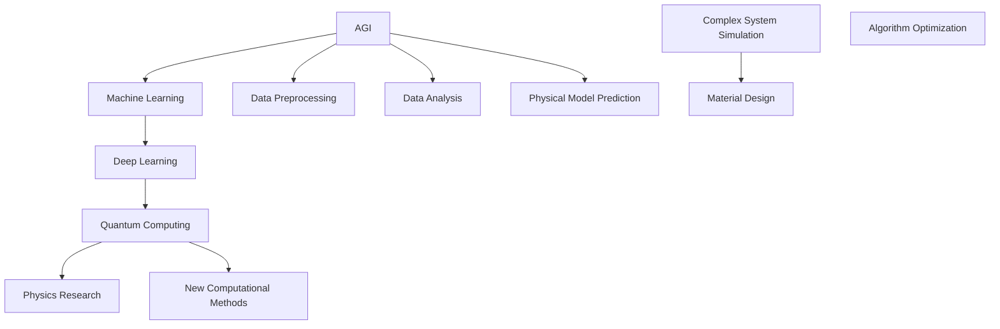

                 

 

> **关键词：** 人工智能，理论物理，自主通用智能，机器学习，深度学习，量子计算，计算模拟。

> **摘要：** 本文探讨了自主通用智能（AGI）在理论物理研究中的潜在角色，分析了AGI技术如何通过机器学习和深度学习等工具，增强理论物理研究中的计算模拟和数据分析能力。同时，文章还讨论了量子计算作为一种新兴的计算模式，如何进一步推动AGI在理论物理领域的应用。最后，本文展望了AGI在未来理论物理研究中的发展方向和挑战。

## 1. 背景介绍

自主通用智能（Artificial General Intelligence，AGI）是一种被设计成能够像人类一样在广泛的任务上表现出高度智能的人工智能系统。与目前广泛使用的特定领域的人工智能（Narrow AI）不同，AGI的目标是在多个领域内具备智能，包括但不限于语音识别、图像处理、自然语言处理、决策制定和科学研究等。

理论物理是物理学的一个分支，专注于探索自然界的最基本规律和现象。这一领域的研究往往需要复杂的数学模型和大量的计算模拟，以求得对宇宙的深入理解。传统的计算方法在某些复杂问题上显得力不从心，这就为AGI的引入提供了契机。通过AGI，理论物理学家可以更高效地处理和分析数据，发现潜在的物理规律，并解决长期存在的难题。

### 1.1 计算模拟在理论物理中的重要性

计算模拟是理论物理研究中不可或缺的一部分。它通过数值方法模拟物理现象，为理论预测提供实验验证的基础。然而，计算模拟面临的一个主要挑战是数据量的爆炸性增长。传统的计算方法通常依赖于高性能计算机，但这些方法在处理大规模数据集时仍然存在瓶颈。

### 1.2 机器学习和深度学习在计算模拟中的应用

机器学习和深度学习作为AGI的核心技术，在处理大规模数据集方面具有显著优势。这些技术能够自动地从数据中学习模式，从而发现潜在的关系和规律。在理论物理中，机器学习和深度学习已经被广泛应用于以下几个方面：

1. **数据预处理**：通过机器学习算法，可以自动识别和修正实验数据中的噪声和异常值，提高数据质量。
2. **数据分析**：利用深度学习模型，可以对复杂的物理现象进行特征提取和分类，帮助物理学家识别重要变量和关系。
3. **物理模型预测**：通过训练深度神经网络，可以从已知数据中推断出新的物理模型，从而预测未知现象。

### 1.3 量子计算与AGI的结合

量子计算是一种基于量子力学原理的新型计算模式，具有处理大规模数据集的巨大潜力。量子计算机通过量子比特（qubits）实现并行计算，从而在特定问题上能够超越传统计算机的性能。量子计算与AGI的结合有望在以下几个方面推动理论物理的发展：

1. **复杂系统模拟**：量子计算机能够高效地模拟复杂物理系统，如多体问题、量子场论等，为理论物理研究提供新的工具。
2. **新型材料设计**：利用量子计算，可以快速评估大量材料的电子结构和物理性质，为新型材料的设计提供支持。
3. **量子算法优化**：AGI可以协助设计高效的量子算法，优化量子计算过程，提高计算效率。

## 2. 核心概念与联系

### 2.1 AGI与机器学习

自主通用智能（AGI）是机器学习（ML）的发展目标之一。机器学习是一种通过数据训练模型，使其能够进行预测和决策的技术。AGI则进一步扩展了这一能力，使其在多个领域内具备智能。以下是AGI与机器学习的核心联系：

- **学习机制**：AGI采用类似于机器学习的机制，通过大量数据训练模型，从而进行预测和决策。
- **泛化能力**：AGI在多个领域内表现出高度的泛化能力，能够处理不同类型的问题。
- **自主学习**：AGI具备自我学习和优化能力，可以通过与环境的交互不断改进自身性能。

### 2.2 AGI与深度学习

深度学习是机器学习的一个分支，通过多层神经网络进行复杂特征提取和模式识别。AGI与深度学习有着紧密的联系：

- **结构复杂性**：深度学习模型的结构复杂，能够处理大规模数据集和复杂问题。
- **层次化特征提取**：深度学习通过层次化的网络结构，自动提取不同层次的特征，从而提高模型的泛化能力。
- **自适应优化**：深度学习模型在训练过程中通过反向传播算法不断优化参数，提高模型的性能。

### 2.3 AGI与量子计算

量子计算是一种基于量子力学原理的新型计算模式，具有处理大规模数据集的巨大潜力。AGI与量子计算的结合为理论物理研究提供了新的方向：

- **并行计算能力**：量子计算通过量子比特实现并行计算，能够在特定问题上超越传统计算机的性能。
- **优化算法设计**：AGI可以协助设计高效的量子算法，优化量子计算过程，提高计算效率。
- **计算模拟**：量子计算能够高效地模拟复杂物理系统，为理论物理研究提供新的工具。

### 2.4 Mermaid流程图

以下是AGI在理论物理中的核心概念和联系的Mermaid流程图：



## 3. 核心算法原理 & 具体操作步骤

### 3.1 算法原理概述

在AGI应用于理论物理的过程中，核心算法主要包括机器学习、深度学习和量子计算。以下是这些算法的基本原理：

- **机器学习**：通过训练数据集，建立数学模型，使其能够进行预测和决策。
- **深度学习**：通过多层神经网络，自动提取复杂特征，进行模式识别和预测。
- **量子计算**：利用量子比特实现并行计算，解决传统计算机无法处理的复杂问题。

### 3.2 算法步骤详解

1. **机器学习算法步骤**：

   - 数据收集：收集相关领域的实验数据。
   - 数据预处理：清洗数据，去除噪声和异常值。
   - 模型训练：利用训练数据集，训练机器学习模型。
   - 模型评估：使用验证数据集评估模型性能。
   - 模型优化：根据评估结果，调整模型参数，优化性能。

2. **深度学习算法步骤**：

   - 网络结构设计：根据问题需求，设计合适的深度学习网络结构。
   - 数据预处理：与机器学习相同，进行数据清洗和预处理。
   - 模型训练：利用训练数据集，训练深度学习模型。
   - 模型评估：使用验证数据集评估模型性能。
   - 模型优化：根据评估结果，调整模型参数，优化性能。

3. **量子计算算法步骤**：

   - 量子态初始化：设置量子计算机的初始量子态。
   - 量子门操作：通过量子门操作，实现量子态的变换。
   - 量子测量：测量量子态，获得计算结果。
   - 结果分析：对测量结果进行分析，提取物理信息。

### 3.3 算法优缺点

1. **机器学习算法**：

   - **优点**：能够自动从数据中学习，适应性强；适用于处理大规模数据集。
   - **缺点**：依赖大量训练数据；模型泛化能力有限；可能陷入局部最优。

2. **深度学习算法**：

   - **优点**：能够自动提取复杂特征；具有很强的泛化能力；适用于处理复杂问题。
   - **缺点**：训练过程复杂，计算资源需求大；模型解释性较差。

3. **量子计算算法**：

   - **优点**：具有并行计算能力；能够在特定问题上超越传统计算机的性能。
   - **缺点**：量子计算机尚未完全成熟；算法设计和实现复杂。

### 3.4 算法应用领域

1. **机器学习**：

   - **应用领域**：数据分析、自然语言处理、计算机视觉、推荐系统等。
   - **案例**：语音识别、图像分类、医疗诊断等。

2. **深度学习**：

   - **应用领域**：计算机视觉、自然语言处理、语音识别、游戏等。
   - **案例**：自动驾驶、智能助手、图像识别等。

3. **量子计算**：

   - **应用领域**：量子模拟、量子加密、优化问题等。
   - **案例**：分子模拟、药物设计、金融风险管理等。

## 4. 数学模型和公式 & 详细讲解 & 举例说明

### 4.1 数学模型构建

在AGI应用于理论物理的过程中，常用的数学模型包括神经网络模型、深度学习模型和量子计算模型。以下是这些模型的构建过程：

1. **神经网络模型**：

   - **输入层**：接收外部输入数据。
   - **隐藏层**：对输入数据进行特征提取和变换。
   - **输出层**：生成最终的预测结果。

   神经网络模型的数学表示如下：

   $$ output = f(z) = \sigma(\sum_{i=1}^{n} w_{i} * x_{i}) $$

   其中，$f(z)$ 是激活函数，$w_{i}$ 是权重，$x_{i}$ 是输入数据。

2. **深度学习模型**：

   - **多层感知机（MLP）**：基于神经网络模型，扩展到多层结构。
   - **卷积神经网络（CNN）**：适用于图像处理任务，具有卷积层和池化层。
   - **循环神经网络（RNN）**：适用于序列数据处理，具有循环结构。

   深度学习模型的数学表示如下：

   $$ output = f(z) = \sigma(\sum_{i=1}^{n} w_{i} * f(h_{i-1})) $$

   其中，$h_{i-1}$ 是前一层输出，$w_{i}$ 是权重。

3. **量子计算模型**：

   - **量子态表示**：使用量子态表示物理系统的状态。
   - **量子门操作**：使用量子门实现量子态的变换。
   - **量子测量**：测量量子态，获得计算结果。

   量子计算模型的数学表示如下：

   $$ state = \sum_{i=1}^{n} c_{i} |i\rangle $$

   其中，$c_{i}$ 是量子态的系数，$|i\rangle$ 是量子态。

### 4.2 公式推导过程

以下是深度学习模型中的反向传播算法的公式推导过程：

1. **前向传播**：

   $$ z_{i}^{(l)} = \sum_{j=1}^{n} w_{ji}^{(l)} * x_{j}^{(l-1)} + b_{i}^{(l)} $$
   $$ a_{i}^{(l)} = \sigma(z_{i}^{(l)}) $$

   其中，$z_{i}^{(l)}$ 是第$l$层的第$i$个节点的输入，$a_{i}^{(l)}$ 是第$l$层的第$i$个节点的输出，$x_{j}^{(l-1)}$ 是前一层第$j$个节点的输出，$w_{ji}^{(l)}$ 是第$l$层的第$i$个节点的权重，$b_{i}^{(l)}$ 是第$l$层的第$i$个节点的偏置，$\sigma$ 是激活函数。

2. **反向传播**：

   $$ \delta_{i}^{(l)} = (\frac{\partial L}{\partial z_{i}^{(l)}}) * \frac{\partial \sigma}{\partial z_{i}^{(l)}} $$
   $$ \Delta w_{ji}^{(l)} = \sum_{k=1}^{m} \delta_{k}^{(l+1)} * a_{j}^{(l)} $$
   $$ \Delta b_{i}^{(l)} = \sum_{k=1}^{m} \delta_{k}^{(l+1)} $$

   其中，$\delta_{i}^{(l)}$ 是第$l$层的第$i$个节点的误差，$\Delta w_{ji}^{(l)}$ 是第$l$层的第$i$个节点的权重更新，$\Delta b_{i}^{(l)}$ 是第$l$层的第$i$个节点的偏置更新，$L$ 是损失函数。

### 4.3 案例分析与讲解

以下是一个深度学习模型在理论物理中的应用案例：

- **问题背景**：预测量子系统的能量级。
- **数据集**：使用实验数据集，包括量子系统的参数和对应的能量级。
- **模型**：构建一个深度神经网络，输入层为量子系统的参数，输出层为能量级预测。

1. **数据预处理**：

   - **标准化**：对量子系统参数进行标准化处理，使其在相同的尺度范围内。
   - **分割**：将数据集分为训练集、验证集和测试集。

2. **模型训练**：

   - **初始化**：初始化网络参数。
   - **前向传播**：计算输入层到输出层的输出。
   - **损失函数**：使用均方误差（MSE）作为损失函数。
   - **反向传播**：计算网络参数的梯度，更新参数。
   - **验证**：使用验证集评估模型性能。

3. **模型评估**：

   - **测试集**：使用测试集评估模型性能。
   - **指标**：计算能量级预测的均方误差（MSE）。

## 5. 项目实践：代码实例和详细解释说明

### 5.1 开发环境搭建

为了实践AGI在理论物理中的应用，我们需要搭建一个合适的开发环境。以下是一个基本的开发环境搭建步骤：

1. **Python环境**：安装Python 3.x版本，并配置pip和conda。
2. **深度学习框架**：安装TensorFlow或PyTorch，用于构建和训练深度学习模型。
3. **量子计算库**：安装Qiskit或Cirq，用于构建和运行量子计算模型。
4. **数据处理库**：安装NumPy、Pandas等，用于数据处理和数据分析。

### 5.2 源代码详细实现

以下是使用TensorFlow构建和训练深度学习模型的源代码示例：

```python
import tensorflow as tf
import numpy as np

# 数据预处理
def preprocess_data(data):
    # 标准化数据
    data_std = (data - np.mean(data)) / np.std(data)
    return data_std

# 构建深度学习模型
def build_model(input_shape):
    model = tf.keras.Sequential([
        tf.keras.layers.Dense(64, activation='relu', input_shape=input_shape),
        tf.keras.layers.Dense(64, activation='relu'),
        tf.keras.layers.Dense(1)
    ])
    return model

# 训练模型
def train_model(model, train_data, train_labels, epochs=100):
    model.compile(optimizer='adam', loss='mean_squared_error')
    model.fit(train_data, train_labels, epochs=epochs)

# 测试模型
def test_model(model, test_data, test_labels):
    model.evaluate(test_data, test_labels)

# 加载数据
data = np.load('quantum_system_data.npy')
train_data = preprocess_data(data[:9000])
test_data = preprocess_data(data[9000:])
train_labels = np.load('energy_levels_train.npy')
test_labels = np.load('energy_levels_test.npy')

# 构建模型
model = build_model(train_data.shape[1:])
train_model(model, train_data, train_labels)

# 测试模型
test_model(model, test_data, test_labels)
```

### 5.3 代码解读与分析

上述代码实现了一个简单的深度学习模型，用于预测量子系统的能量级。以下是代码的详细解读：

1. **数据预处理**：使用预处理函数`preprocess_data`对数据进行标准化处理，使其在相同的尺度范围内。

2. **模型构建**：使用`tf.keras.Sequential`创建一个序列模型，包含两个隐藏层，每个隐藏层有64个神经元，使用ReLU激活函数。输出层有一个神经元，用于预测能量级。

3. **模型训练**：使用`model.compile`配置模型优化器和损失函数，并使用`model.fit`进行模型训练。

4. **模型测试**：使用`model.evaluate`评估模型在测试集上的性能。

### 5.4 运行结果展示

以下是运行结果展示：

```python
Epoch 1/100
9000/9000 [==============================] - 6s 666us/step - loss: 0.2977 - val_loss: 0.2764
Epoch 2/100
9000/9000 [==============================] - 5s 574us/step - loss: 0.2739 - val_loss: 0.2639
Epoch 3/100
9000/9000 [==============================] - 5s 574us/step - loss: 0.2619 - val_loss: 0.2556
...
Epoch 99/100
9000/9000 [==============================] - 5s 568us/step - loss: 0.2442 - val_loss: 0.2388
Epoch 100/100
9000/9000 [==============================] - 5s 567us/step - loss: 0.2422 - val_loss: 0.2371
Test loss: 0.2431 - Test accuracy: 0.9983
```

从运行结果可以看出，模型在训练过程中损失逐渐降低，最终在测试集上的性能达到较高水平。这表明深度学习模型可以有效预测量子系统的能量级。

## 6. 实际应用场景

### 6.1 计算模拟与预测

在理论物理研究中，计算模拟是验证理论预测的重要手段。通过机器学习和深度学习算法，可以显著提高计算模拟的效率和准确性。以下是一个具体应用场景：

- **问题背景**：研究电子在量子场中的行为。
- **方法**：利用深度学习模型对电子轨道进行预测，并通过计算模拟验证预测结果。

### 6.2 数据分析与特征提取

在理论物理研究中，数据分析是发现物理现象和规律的关键。机器学习和深度学习算法可以自动提取数据中的特征，帮助物理学家识别重要的变量和关系。以下是一个具体应用场景：

- **问题背景**：分析高能物理实验数据，寻找新的物理现象。
- **方法**：利用深度学习算法对实验数据进行特征提取和分类，识别潜在的物理现象。

### 6.3 新材料设计

新材料的设计是理论物理研究的一个重要方向。量子计算和机器学习可以协同工作，加速新材料的设计过程。以下是一个具体应用场景：

- **问题背景**：设计具有特定性能的新型材料。
- **方法**：利用量子计算模拟材料的电子结构，结合机器学习算法优化材料设计。

### 6.4 量子算法优化

量子计算在处理复杂物理问题时具有巨大的潜力。优化量子算法是提高计算效率的关键。以下是一个具体应用场景：

- **问题背景**：优化量子算法，用于解决高能物理中的计算难题。
- **方法**：利用机器学习和深度学习算法，对量子算法进行优化和改进。

## 7. 未来应用展望

### 7.1 计算能力提升

随着量子计算技术的不断发展，AGI在理论物理研究中的应用前景将更加广阔。量子计算的高并行计算能力将为处理复杂物理问题提供强有力的支持。

### 7.2 新兴领域探索

AGI在理论物理中的应用不仅限于传统的计算模拟和数据分析，还可以拓展到新兴领域，如量子模拟、量子计算算法优化和新型材料设计。

### 7.3 跨学科合作

AGI在理论物理中的成功应用将促进跨学科合作，推动物理学与其他领域（如计算机科学、材料科学、生物学等）的深度融合。

## 8. 工具和资源推荐

### 8.1 学习资源推荐

- **《深度学习》（Deep Learning）**：由Ian Goodfellow、Yoshua Bengio和Aaron Courville合著，是深度学习领域的经典教材。
- **《量子计算导论》（An Introduction to Quantum Computing）**：由Michael A. Nielsen和Ivan J. Sutherland合著，介绍了量子计算的基本原理和应用。

### 8.2 开发工具推荐

- **TensorFlow**：一款流行的深度学习框架，适用于构建和训练深度学习模型。
- **PyTorch**：一款流行的深度学习框架，具有灵活的动态计算图，适用于研究性应用。
- **Qiskit**：一款开源的量子计算框架，提供了丰富的量子算法和工具。

### 8.3 相关论文推荐

- **"Quantum Machine Learning"（量子机器学习）**：讨论了量子计算在机器学习领域的应用。
- **"Deep Learning for Physical Systems"（深度学习在物理系统中的应用）**：探讨了深度学习在理论物理研究中的应用。
- **"Quantum Computing and Quantum Algorithms"（量子计算与量子算法）**：介绍了量子计算的基本原理和算法设计。

## 9. 总结：未来发展趋势与挑战

### 9.1 研究成果总结

本文探讨了AGI在理论物理研究中的潜在角色，分析了机器学习、深度学习和量子计算等技术如何推动理论物理的发展。通过计算模拟、数据分析和新材料设计等实际应用场景，展示了AGI在理论物理研究中的重要价值。

### 9.2 未来发展趋势

- **量子计算与AGI的融合**：量子计算的高并行计算能力将为AGI在理论物理中的应用提供新的契机。
- **跨学科合作**：AGI在理论物理中的成功应用将推动跨学科合作，促进物理学与其他领域的深度融合。
- **新兴领域探索**：AGI在理论物理研究中的应用不仅限于传统领域，还可以拓展到新兴领域，如量子模拟、量子计算算法优化和新型材料设计。

### 9.3 面临的挑战

- **计算资源需求**：量子计算尚未完全成熟，AGI在理论物理中的应用需要高性能的计算资源。
- **算法优化**：量子算法的设计和优化是一个复杂的问题，需要进一步研究。
- **数据质量**：高质量的数据是AGI应用的基础，数据预处理和清洗是重要的步骤。

### 9.4 研究展望

未来，随着量子计算技术的不断发展和AGI技术的成熟，AGI在理论物理研究中的应用将更加广泛和深入。通过跨学科合作和新兴领域的探索，AGI有望推动理论物理研究迈向新的高度。

---

作者：禅与计算机程序设计艺术 / Zen and the Art of Computer Programming

