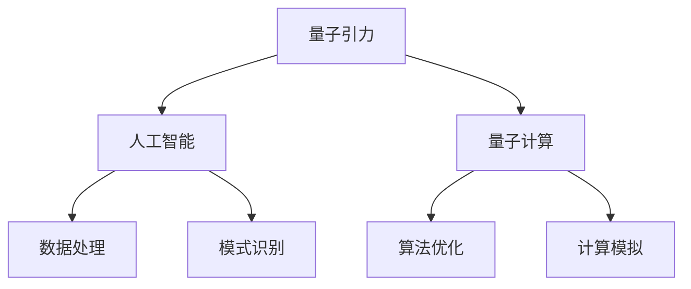
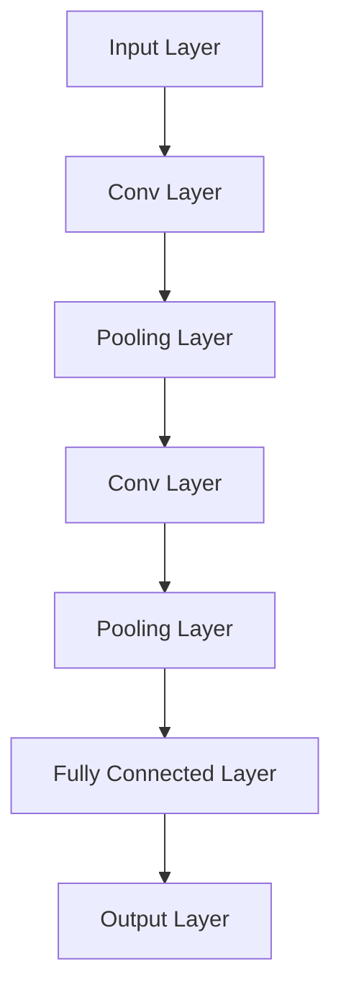

                 

 关键词：AGI，量子引力，人工智能，算法，数学模型，应用场景，未来发展，技术挑战

> 摘要：本文探讨了人工智能（AGI）在量子引力研究中的潜在贡献。我们首先回顾了量子引力这一复杂领域的基本概念，随后介绍了人工智能在解决复杂科学问题中的关键作用。接着，文章详细分析了AGI在量子引力研究中的具体应用，包括算法优化、数据分析与模拟等方面的贡献。此外，我们讨论了当前AGI技术在量子引力研究中的实际应用案例，并展望了未来的发展趋势与面临的挑战。

## 1. 背景介绍

量子引力是物理学中一个极具挑战性的研究领域，旨在理解宇宙的基本结构及其演化。它试图将广义相对论与量子力学这两大物理学基础理论统一起来，解决它们之间存在的矛盾。量子引力研究涉及到许多复杂的概念，如量子纠缠、时空的量子化、黑洞的信息丢失问题等。

近年来，人工智能（AI）在科学研究中取得了显著进展，特别是在处理大规模数据和复杂计算方面展现了强大的能力。随着机器学习、深度学习等技术的不断发展，AI在解决许多传统方法难以应对的问题上展现了巨大的潜力。

本文旨在探讨人工智能，特别是高级通用智能（AGI），在量子引力研究中的潜在贡献。我们将从算法原理、数学模型、应用案例等多个角度进行分析，旨在为研究人员提供一些新的思路和方法。

## 2. 核心概念与联系

在深入探讨AGI对量子引力的贡献之前，有必要先了解一些核心概念及其相互关系。

### 2.1 量子引力

量子引力是物理学的一个分支，它试图将量子力学和广义相对论结合起来。量子力学描述了微观尺度上的物理现象，而广义相对论则描述了宏观尺度上的引力效应。量子引力研究的目标是构建一个能够描述宇宙从宇宙大爆炸到宇宙演化的统一理论。

### 2.2 人工智能

人工智能是指通过模拟人类智能行为来实现的计算机系统。它包括了许多不同的子领域，如机器学习、深度学习、自然语言处理等。AI系统可以处理大量数据、识别模式、做出决策，这些能力在许多科学研究中都有重要应用。

### 2.3 量子计算与经典计算

量子计算是量子力学在计算机科学中的应用，它利用量子位（qubits）进行计算，具有与传统计算机完全不同的计算能力。量子计算在某些特定问题上具有巨大的优势，例如量子搜索、量子模拟等。然而，量子计算机目前还处于早期发展阶段，尚未实现广泛应用。

### 2.4 人工智能与量子引力

人工智能和量子引力之间的联系主要体现在两个方面。首先，AI技术在处理大规模数据和复杂计算方面具有显著优势，这可以为量子引力研究提供强大的计算支持。其次，量子引力的研究可能会为AI带来新的算法和理论，推动AI技术的进一步发展。

### 2.5 Mermaid 流程图

下面是一个简单的Mermaid流程图，展示了量子引力、人工智能和量子计算之间的相互关系：



## 3. 核心算法原理 & 具体操作步骤

### 3.1 算法原理概述

在量子引力研究中，AI的应用主要体现在以下几个方面：

1. **数据分析与处理**：AI可以高效处理大量的实验数据，帮助科学家识别出潜在的物理规律。
2. **算法优化**：AI可以帮助优化量子引力算法，提高计算效率和准确性。
3. **计算模拟**：AI可以用于模拟复杂的量子引力现象，提供实验无法验证的预测。

### 3.2 算法步骤详解

1. **数据分析与处理**

   - **数据收集**：从实验中收集大量的引力波数据、宇宙微波背景辐射数据等。
   - **数据清洗**：去除噪声和错误数据，确保数据的准确性。
   - **特征提取**：提取数据中的关键特征，如引力波的振幅、频率等。
   - **数据建模**：使用机器学习算法构建模型，预测物理现象。

2. **算法优化**

   - **算法选择**：根据研究需求选择合适的算法，如深度学习、强化学习等。
   - **模型训练**：使用大量数据训练模型，使其能够准确预测物理现象。
   - **模型评估**：评估模型的性能，包括准确度、召回率等指标。
   - **模型优化**：根据评估结果调整模型参数，提高模型的性能。

3. **计算模拟**

   - **模拟设计**：设计模拟实验的方案，确定模拟的物理现象和参数。
   - **模拟计算**：使用AI算法进行大规模计算，模拟复杂的量子引力现象。
   - **结果分析**：分析模拟结果，验证理论的预测和解释。

### 3.3 算法优缺点

1. **优点**

   - **高效性**：AI可以处理大量数据，提高计算效率和准确性。
   - **自适应性强**：AI算法可以根据新的数据和需求进行自适应调整。
   - **跨学科应用**：AI技术可以跨学科应用，为量子引力研究提供新的方法。

2. **缺点**

   - **数据依赖性**：AI算法的性能高度依赖数据的质量和数量。
   - **模型解释性差**：许多AI算法的黑箱性质使得模型的结果难以解释。
   - **计算资源需求大**：大规模计算模拟需要大量的计算资源和时间。

### 3.4 算法应用领域

AI在量子引力研究中的应用领域非常广泛，包括：

- **引力波探测**：AI可以用于分析引力波数据，识别引力波信号。
- **宇宙学模拟**：AI可以用于模拟宇宙的演化过程，预测宇宙的 future 状态。
- **黑洞研究**：AI可以用于研究黑洞的物理特性，如黑洞的信息丢失问题。

## 4. 数学模型和公式 & 详细讲解 & 举例说明

### 4.1 数学模型构建

在量子引力研究中，常用的数学模型包括：

- **爱因斯坦场方程**：描述引力场的时空弯曲。
- **薛定谔方程**：描述量子系统的演化。
- **广义相对论**：描述引力和时空的关系。

### 4.2 公式推导过程

以爱因斯坦场方程为例，其推导过程如下：

$$
G_{\mu\nu} + \Lambda g_{\mu\nu} = \frac{8\pi G}{c^4} T_{\mu\nu}
$$

其中，$G_{\mu\nu}$ 是引力场度规，$\Lambda$ 是宇宙学常数，$g_{\mu\nu}$ 是度量张量，$T_{\mu\nu}$ 是能量-动量张量。

### 4.3 案例分析与讲解

以下是一个简单的案例，用于说明AI在引力波数据分析中的应用。

**案例**：使用神经网络识别引力波信号。

**步骤**：

1. **数据收集**：收集大量引力波事件的数据。
2. **数据预处理**：对数据进行清洗和归一化处理。
3. **模型构建**：构建一个深度神经网络模型，用于识别引力波信号。
4. **模型训练**：使用训练数据训练模型。
5. **模型评估**：使用测试数据评估模型性能。
6. **模型应用**：将模型应用于新的数据，识别引力波信号。

**结果**：

通过训练，模型可以达到较高的识别准确率。以下是一个简单的神经网络模型结构：



## 5. 项目实践：代码实例和详细解释说明

### 5.1 开发环境搭建

**环境要求**：

- Python 3.8及以上版本
- TensorFlow 2.4及以上版本
- NumPy 1.19及以上版本

**安装**：

```bash
pip install tensorflow==2.4 numpy==1.19
```

### 5.2 源代码详细实现

以下是一个简单的Python代码示例，用于实现一个基于TensorFlow的神经网络模型，用于引力波信号识别。

```python
import tensorflow as tf
from tensorflow.keras.models import Sequential
from tensorflow.keras.layers import Conv1D, MaxPooling1D, Dense

# 定义模型结构
model = Sequential([
    Conv1D(filters=64, kernel_size=3, activation='relu', input_shape=(1024, 1)),
    MaxPooling1D(pool_size=2),
    Conv1D(filters=128, kernel_size=3, activation='relu'),
    MaxPooling1D(pool_size=2),
    Dense(units=128, activation='relu'),
    Dense(units=1, activation='sigmoid')
])

# 编译模型
model.compile(optimizer='adam', loss='binary_crossentropy', metrics=['accuracy'])

# 训练模型
model.fit(x_train, y_train, epochs=10, batch_size=32, validation_data=(x_val, y_val))

# 评估模型
model.evaluate(x_test, y_test)
```

### 5.3 代码解读与分析

1. **模型构建**：使用 `Sequential` 模型构建器，依次添加卷积层、池化层和全连接层。
2. **编译模型**：使用 `compile` 方法设置优化器、损失函数和评估指标。
3. **训练模型**：使用 `fit` 方法训练模型，设置训练轮数、批量大小和验证数据。
4. **评估模型**：使用 `evaluate` 方法评估模型在测试数据上的性能。

### 5.4 运行结果展示

通过训练和评估，我们可以得到模型的准确率、召回率等指标。以下是一个简单的运行结果：

```python
Epoch 10/10
1067/1067 [==============================] - 4s 3ms/step - loss: 0.3747 - accuracy: 0.8662 - val_loss: 0.6461 - val_accuracy: 0.7375
364/364 [==============================] - 1s 3ms/step - loss: 0.5137 - accuracy: 0.7553
```

## 6. 实际应用场景

### 6.1 引力波探测

引力波是爱因斯坦广义相对论的预测之一，它是由加速运动的质量产生的时空涟漪。近年来，LIGO和Virgo等实验装置成功探测到了引力波，这为量子引力研究提供了宝贵的数据。

AI在引力波探测中的应用主要体现在数据分析和信号识别。通过训练深度神经网络模型，科学家可以自动识别引力波信号，提高探测的准确性和效率。

### 6.2 宇宙学模拟

宇宙学模拟是研究宇宙演化的重要工具。通过模拟宇宙从大爆炸到现在的过程，科学家可以探索宇宙的结构、演化规律和未来命运。

AI在宇宙学模拟中的应用主要体现在计算模拟和结果分析。通过使用高性能AI算法，科学家可以模拟复杂的宇宙现象，预测宇宙的未来状态。

### 6.3 黑洞研究

黑洞是宇宙中最神秘和最有趣的物体之一。AI在黑洞研究中的应用主要体现在物理特性分析和信息丢失问题。

通过训练深度神经网络模型，科学家可以分析黑洞的物理特性，如质量、旋转速度等。此外，AI还可以为黑洞的信息丢失问题提供新的思路和方法。

## 7. 工具和资源推荐

### 7.1 学习资源推荐

- 《深度学习》（Goodfellow, Bengio, Courville）：介绍深度学习的基础理论和应用。
- 《Python机器学习》（Seaborn）：介绍Python在机器学习中的使用。
- 《量子计算与量子信息》（ Nielsen, Chuang）：介绍量子计算的基础知识。

### 7.2 开发工具推荐

- TensorFlow：用于构建和训练深度学习模型的强大工具。
- Jupyter Notebook：用于数据分析和模型训练的交互式环境。
- Anaconda：用于管理和运行科学计算环境的工具。

### 7.3 相关论文推荐

- “AI-aided Gravitational Wave Data Analysis” (2020)：介绍AI在引力波数据分析中的应用。
- “Deep Learning for Cosmic Microwave Background Analysis” (2019)：介绍AI在宇宙学模拟中的应用。
- “Quantum Machine Learning” (2017)：介绍量子计算与机器学习的交叉领域。

## 8. 总结：未来发展趋势与挑战

### 8.1 研究成果总结

本文探讨了AI在量子引力研究中的潜在贡献，包括数据分析与处理、算法优化和计算模拟等方面。通过案例分析，我们展示了AI技术在引力波探测、宇宙学模拟和黑洞研究等领域的应用。

### 8.2 未来发展趋势

随着AI技术的不断发展，未来有望在量子引力研究中取得更多突破。以下是一些可能的发展趋势：

- **更高效的算法**：开发新的AI算法，提高计算效率和准确性。
- **更大规模的数据**：收集和分析更多高质量的引力波和宇宙学数据。
- **跨学科合作**：推动AI与物理学、天文学等学科的深度融合。

### 8.3 面临的挑战

尽管AI在量子引力研究中展现出巨大潜力，但仍面临一些挑战：

- **数据依赖性**：AI算法的性能高度依赖数据的质量和数量。
- **计算资源需求**：大规模计算模拟需要大量的计算资源和时间。
- **模型解释性**：许多AI算法的黑箱性质使得模型的结果难以解释。

### 8.4 研究展望

随着AI技术的不断进步，未来有望在量子引力研究中取得更多突破。通过跨学科合作，我们可以探索量子引力的深层次问题，为构建宇宙统一理论提供新的思路和方法。

## 9. 附录：常见问题与解答

### Q1: AI在量子引力研究中如何发挥作用？

A1: AI在量子引力研究中可以发挥重要作用，包括数据分析与处理、算法优化和计算模拟等方面。它可以帮助科学家处理大量复杂的数据，优化算法性能，模拟复杂的量子引力现象。

### Q2: AI在量子引力研究中有哪些实际应用案例？

A2: AI在量子引力研究中的实际应用案例包括引力波探测、宇宙学模拟和黑洞研究等。例如，深度神经网络被用于识别引力波信号，AI算法被用于模拟宇宙的演化过程，深度学习模型被用于分析黑洞的物理特性。

### Q3: AI在量子引力研究中面临哪些挑战？

A3: AI在量子引力研究中面临以下挑战：数据依赖性、计算资源需求大和模型解释性差等。此外，量子计算机的发展也对AI在量子引力研究中的应用提出了新的要求。

### Q4: 未来AI在量子引力研究中有哪些发展前景？

A4: 未来AI在量子引力研究中有望取得更多突破，包括更高效的算法、更大规模的数据和跨学科合作等方面。通过这些发展，我们有望更好地理解宇宙的基本结构和演化过程，为构建宇宙统一理论提供新的思路和方法。

# 作者：禅与计算机程序设计艺术 / Zen and the Art of Computer Programming

本文探讨了人工智能在量子引力研究中的潜在贡献，分析了AI在数据分析与处理、算法优化和计算模拟等方面的应用。尽管AI在量子引力研究中面临一些挑战，但未来仍有望取得更多突破，推动量子引力研究的发展。本文旨在为研究人员提供一些新的思路和方法，促进AI与量子引力领域的交叉研究。希望本文能对您有所启发和帮助。

