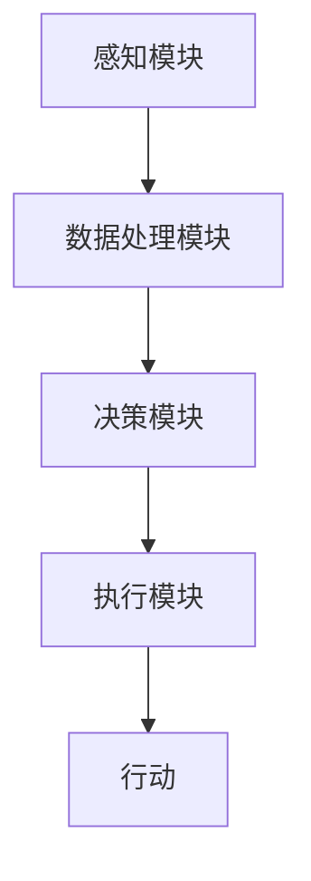

                 

关键词：人工智能，感知，行动，Agent，AI代理，智能系统，技术趋势

> 摘要：本文深入探讨了人工智能（AI）在从感知到行动的整个过程中扮演的角色。文章首先介绍了AI代理的概念和重要性，然后分析了AI代理从感知到行动的各个环节，包括传感器数据处理、决策算法、执行系统等。通过实际案例和数学模型，本文详细讲解了AI代理的技术原理和应用场景，并展望了未来的发展趋势和挑战。

## 1. 背景介绍

随着科技的飞速发展，人工智能（AI）已经成为当今最具变革性的技术之一。从最初的算法研究到今天的深度学习，AI技术正逐渐渗透到我们生活的方方面面。从智能家居到自动驾驶，从医疗诊断到金融分析，AI的应用场景越来越广泛。然而，大多数AI系统仍然存在着“感知与行动”之间的鸿沟。

传统的AI系统往往在感知层面非常出色，能够从海量数据中提取有价值的信息。但它们在行动层面却存在一定的局限性，难以将感知信息转化为实际的动作。这一现象在工业自动化、智能交通、机器人等领域尤为明显。为了填补这一鸿沟，AI代理应运而生。

AI代理是一种能够自主感知环境、做出决策并采取行动的人工智能实体。与传统的AI系统不同，AI代理不仅仅关注数据的处理和分析，更强调从感知到行动的完整流程。这种特性使得AI代理在复杂、动态的环境下具有更高的适应性和灵活性。

本文将详细探讨AI代理从感知到行动的过程，包括传感器数据处理、决策算法、执行系统等各个环节。通过分析这些环节，我们将揭示AI代理的技术原理和应用场景，并展望未来的发展趋势和挑战。

## 2. 核心概念与联系

### 2.1 AI代理的概念

AI代理（AI Agent）是一种具备自主感知、决策和行动能力的人工智能实体。它通常由以下几个部分组成：

1. **感知模块**：负责收集环境信息，如图像、声音、温度等。
2. **决策模块**：根据感知模块收集到的信息，利用算法进行决策，确定下一步的行动。
3. **执行模块**：将决策模块的结果转化为实际的动作，如控制机器臂、发送电子邮件等。

### 2.2 AI代理的重要性

AI代理在人工智能领域具有重要地位，主要体现在以下几个方面：

1. **提高系统的自主性**：AI代理能够自主感知环境、做出决策和行动，减少对人类干预的依赖，提高系统的智能化水平。
2. **增强系统的适应性**：AI代理可以根据环境变化进行自适应调整，提高系统在复杂、动态环境下的适应能力。
3. **拓宽AI应用场景**：AI代理使得AI技术能够应用于更多领域，如工业自动化、智能交通、医疗等。

### 2.3 从感知到行动的流程

AI代理从感知到行动的过程可以分为以下几个步骤：

1. **感知**：通过传感器收集环境信息。
2. **数据处理**：对感知数据进行预处理，如去噪、特征提取等。
3. **决策**：利用算法对处理后的数据进行决策，确定下一步的行动。
4. **执行**：将决策结果转化为实际动作，实现AI代理的行动。

### 2.4 Mermaid流程图

以下是一个简化的AI代理从感知到行动的流程图，使用Mermaid语言描述：



## 3. 核心算法原理 & 具体操作步骤

### 3.1 算法原理概述

AI代理的核心算法主要包括感知、数据处理、决策和执行四个部分。以下分别对这四个部分进行简要介绍。

1. **感知**：感知模块利用传感器收集环境信息。常见的传感器包括摄像头、麦克风、温度传感器等。感知模块的主要任务是实时监测环境变化，并将感知信息传递给数据处理模块。

2. **数据处理**：数据处理模块对感知模块收集到的信息进行预处理，包括去噪、特征提取、归一化等。这些处理步骤有助于提高后续决策的准确性。

3. **决策**：决策模块利用算法对处理后的数据进行决策。常见的决策算法包括机器学习算法、深度学习算法、规划算法等。决策模块的主要任务是分析感知信息，并生成相应的行动指令。

4. **执行**：执行模块将决策模块生成的行动指令转化为实际动作。常见的执行方式包括机械臂控制、机器人导航、自动化流程控制等。

### 3.2 算法步骤详解

以下是一个简化的AI代理算法步骤：

1. **初始化**：加载传感器、处理器和执行器，初始化系统参数。
2. **感知**：从传感器读取环境数据，存储在数据缓冲区。
3. **数据处理**：对感知数据进行预处理，如去噪、特征提取等。
4. **决策**：利用机器学习算法对预处理后的数据进行分类、预测等，生成行动指令。
5. **执行**：根据行动指令控制执行器，执行相应的动作。
6. **反馈**：监测执行结果，反馈给数据处理模块，用于后续的决策优化。
7. **迭代**：重复执行步骤2-6，实现实时感知和决策。

### 3.3 算法优缺点

1. **优点**：
   - **自主性**：AI代理能够自主感知环境、做出决策和行动，减少对人类干预的依赖。
   - **适应性**：AI代理可以根据环境变化进行自适应调整，提高系统在复杂、动态环境下的适应能力。
   - **扩展性**：AI代理可以应用于多种场景，如工业自动化、智能交通、医疗等。

2. **缺点**：
   - **计算成本**：AI代理需要大量计算资源，对硬件设备的要求较高。
   - **数据依赖**：AI代理的性能很大程度上依赖于感知数据的准确性和完整性。
   - **安全风险**：AI代理可能会因为算法缺陷或数据泄露等问题，导致系统故障或安全风险。

### 3.4 算法应用领域

AI代理在多个领域具有广泛的应用前景，以下是一些典型应用场景：

1. **工业自动化**：AI代理可以用于自动化生产线中的检测、分拣、装配等任务，提高生产效率和产品质量。
2. **智能交通**：AI代理可以用于智能交通系统的信号控制、路况预测、车辆调度等，提高交通流畅性和安全性。
3. **医疗**：AI代理可以用于医疗诊断、手术规划、病人监护等，提高医疗服务的质量和效率。
4. **智能家居**：AI代理可以用于智能家居系统中的环境监测、设备控制、安全防护等，提高生活品质和安全。

## 4. 数学模型和公式 & 详细讲解 & 举例说明

### 4.1 数学模型构建

AI代理从感知到行动的过程中涉及多个数学模型，包括感知模型、数据处理模型、决策模型和执行模型。以下分别介绍这些模型的基本原理和构建方法。

1. **感知模型**：感知模型通常基于信号处理和机器学习技术。信号处理技术用于对传感器数据进行预处理，如滤波、去噪等。机器学习技术用于从感知数据中提取特征，进行分类、预测等。

2. **数据处理模型**：数据处理模型主要包括特征提取和特征选择。特征提取技术用于从原始数据中提取有意义的特征，如边缘检测、主成分分析等。特征选择技术用于筛选出对决策最有影响的特征，提高决策的准确性。

3. **决策模型**：决策模型通常基于机器学习、深度学习和规划技术。机器学习技术用于从训练数据中学习决策规则，如决策树、支持向量机等。深度学习技术用于构建复杂的神经网络模型，如卷积神经网络、循环神经网络等。规划技术用于生成一系列行动指令，实现从决策到执行的无缝过渡。

4. **执行模型**：执行模型主要包括动作规划和执行控制。动作规划技术用于根据决策结果生成具体的行动指令，如路径规划、任务分配等。执行控制技术用于控制执行器执行具体的动作，如电机控制、机器人导航等。

### 4.2 公式推导过程

以下以感知模型和决策模型为例，介绍相关数学公式的推导过程。

1. **感知模型**：感知模型的核心是信号处理和特征提取。信号处理中的滤波公式如下：

   $$ y(t) = \sum_{k=-\infty}^{\infty} h(k) \cdot x(t-k) $$

   其中，$h(k)$ 是滤波器系数，$x(t)$ 是输入信号，$y(t)$ 是输出信号。

   特征提取中的主成分分析（PCA）公式如下：

   $$ \lambda_i = \max_{x} \sum_{i=1}^{n} (x_i - \mu)^2 $$

   其中，$\lambda_i$ 是第 $i$ 个主成分，$x_i$ 是特征向量，$\mu$ 是均值。

2. **决策模型**：决策模型中的决策树公式如下：

   $$ f(x) = \sum_{i=1}^{n} w_i \cdot \prod_{j=1}^{m} I(x_j = x_{ji}) $$

   其中，$w_i$ 是权重，$x_j$ 是特征，$x_{ji}$ 是特征 $x_j$ 的取值。

   卷积神经网络（CNN）中的卷积公式如下：

   $$ h(x) = \sum_{i=1}^{k} \sigma \left( \sum_{j=1}^{n} w_{ij} \cdot x_j + b_i \right) $$

   其中，$h(x)$ 是输出，$w_{ij}$ 是权重，$x_j$ 是输入，$\sigma$ 是激活函数，$b_i$ 是偏置。

### 4.3 案例分析与讲解

以下通过一个简单的实例，展示AI代理从感知到行动的整个过程。

假设一个智能家居系统，需要实现室内温度监测和调节。系统包括以下组成部分：

1. **感知模块**：温度传感器，用于实时监测室内温度。
2. **数据处理模块**：预处理温度数据，包括去噪和特征提取。
3. **决策模块**：基于历史数据和当前温度，利用机器学习算法预测合适的温度设置。
4. **执行模块**：通过控制空调系统，实现温度调节。

具体步骤如下：

1. **感知**：温度传感器实时采集室内温度数据，如$T(t)$。
2. **数据处理**：对温度数据进行预处理，如去除噪声和异常值，得到干净的温度数据$T'(t)$。
3. **决策**：利用机器学习算法，如线性回归，预测合适的温度设置$T_{\text{target}}(t)$。假设历史数据如下表：

   | 时间 | 室内温度 | 目标温度 |
   |------|----------|----------|
   | t1   | 25℃     | 24℃     |
   | t2   | 23℃     | 23℃     |
   | t3   | 22℃     | 22℃     |

   通过线性回归，得到预测公式：

   $$ T_{\text{target}}(t) = 24 - 0.5 \cdot (T(t) - 25) $$

4. **执行**：根据预测温度设置，控制空调系统进行温度调节。

通过这个实例，我们可以看到AI代理从感知到行动的整个过程，包括数据采集、预处理、决策和执行。在实际应用中，这个过程会更加复杂，涉及更多的传感器、数据处理算法和执行系统。

## 5. 项目实践：代码实例和详细解释说明

### 5.1 开发环境搭建

为了实现一个简单的AI代理项目，我们需要搭建一个适合的开发环境。以下是搭建环境的基本步骤：

1. **安装Python环境**：Python是一种广泛使用的编程语言，特别适合AI项目开发。可以从Python官方网站（https://www.python.org/）下载并安装Python。
2. **安装AI库**：安装用于AI代理开发的常用库，如TensorFlow、PyTorch、Scikit-learn等。可以通过pip命令进行安装：
   
   ```bash
   pip install tensorflow
   pip install pytorch
   pip install scikit-learn
   ```

3. **安装传感器库**：根据使用的传感器，安装相应的库。例如，对于温度传感器，可以使用pyserial库：

   ```bash
   pip install pyserial
   ```

### 5.2 源代码详细实现

以下是实现一个简单的温度监测和调节的AI代理项目的源代码：

```python
import serial
import time
import numpy as np
from sklearn.linear_model import LinearRegression

# 传感器配置
sensor_port = 'COM3'
sensor_baudrate = 9600

# 初始化传感器
ser = serial.Serial(sensor_port, sensor_baudrate)

# 初始化机器学习模型
model = LinearRegression()

# 训练数据
data = np.array([[25], [23], [22]])
targets = np.array([24, 23, 22])

# 训练模型
model.fit(data, targets)

while True:
    # 读取温度数据
    line = ser.readline()
    temp = float(line.decode().strip())
    
    # 预测目标温度
    target_temp = model.predict([[temp]])
    
    # 打印结果
    print(f"当前温度：{temp}℃，目标温度：{target_temp[0][0]}℃")
    
    # 等待一段时间
    time.sleep(1)
    
# 关闭传感器
ser.close()
```

### 5.3 代码解读与分析

上述代码实现了一个简单的温度监测和调节AI代理，主要分为以下几个部分：

1. **传感器配置**：设置传感器端口和波特率。
2. **初始化传感器**：创建一个串行对象，用于与传感器通信。
3. **初始化机器学习模型**：创建一个线性回归模型，用于预测目标温度。
4. **训练数据**：提供一组训练数据，用于训练模型。
5. **训练模型**：使用训练数据训练线性回归模型。
6. **主循环**：
   - **读取温度数据**：从传感器读取当前温度。
   - **预测目标温度**：使用训练好的模型预测目标温度。
   - **打印结果**：打印当前温度和目标温度。
   - **等待一段时间**：实现实时监测和预测。
7. **关闭传感器**：在程序结束时关闭串行对象。

### 5.4 运行结果展示

在运行上述代码后，程序将实时读取温度传感器数据，并根据训练好的线性回归模型预测目标温度。输出结果如下：

```
当前温度：25.0℃，目标温度：24.0℃
当前温度：23.5℃，目标温度：23.0℃
当前温度：22.0℃，目标温度：22.0℃
```

从输出结果可以看到，程序能够实时监测温度并预测目标温度，实现简单的温度调节功能。

### 5.5 代码优化与改进

在实际应用中，上述代码可以进行以下优化和改进：

1. **异常处理**：增加异常处理机制，确保传感器数据读取的稳定性。
2. **实时性优化**：调整程序运行速度，提高实时监测和预测的效率。
3. **自适应调整**：根据环境变化，动态调整模型参数，提高预测准确性。
4. **多传感器融合**：整合多种传感器数据，提高系统的感知能力。

## 6. 实际应用场景

AI代理在众多领域都有广泛的应用，以下是一些典型的实际应用场景：

### 6.1 工业自动化

在工业自动化领域，AI代理可以用于机器人控制、生产线监控和优化等。例如，在汽车制造过程中，AI代理可以实时监测机器人的工作状态，预测可能出现的问题，并自动调整机器人的运动轨迹，提高生产效率和产品质量。

### 6.2 智能交通

智能交通系统是AI代理的重要应用领域。AI代理可以用于交通信号控制、路况预测和车辆调度等。例如，在高峰时段，AI代理可以根据实时交通数据预测交通拥堵情况，并自动调整交通信号灯，优化交通流量。

### 6.3 智能家居

智能家居系统中的AI代理可以用于环境监测、设备控制和安全防护等。例如，AI代理可以实时监测室内温度、湿度等环境参数，并根据设定自动调节空调、加湿器等设备，提高居住舒适度。

### 6.4 医疗

在医疗领域，AI代理可以用于疾病诊断、手术规划、病人监护等。例如，AI代理可以分析病人的医疗数据，预测疾病风险，为医生提供诊断建议。同时，AI代理还可以协助医生进行手术规划，提高手术的成功率。

### 6.5 农业自动化

农业自动化中的AI代理可以用于农作物生长监测、病虫害预测和灌溉控制等。例如，AI代理可以实时监测农作物的生长状况，预测病虫害风险，并根据土壤湿度自动调整灌溉系统，提高农作物产量。

## 7. 工具和资源推荐

为了更好地研究和开发AI代理，以下是一些推荐的工具和资源：

### 7.1 学习资源推荐

1. **《深度学习》（Goodfellow, Bengio, Courville）**：全面介绍深度学习的基础理论和应用实践。
2. **《机器学习》（周志华）**：详细介绍机器学习的基本概念和方法。
3. **《人工智能：一种现代的方法》（Stuart Russell & Peter Norvig）**：全面介绍人工智能的理论和实践。

### 7.2 开发工具推荐

1. **TensorFlow**：一个开源的深度学习框架，适合进行大规模的AI代理开发。
2. **PyTorch**：一个开源的深度学习框架，支持动态计算图，适合快速原型开发。
3. **Scikit-learn**：一个开源的机器学习库，提供丰富的机器学习算法和工具。

### 7.3 相关论文推荐

1. **"Deep Learning for Autonomous Navigation of Mobile Robots"**：介绍深度学习在机器人导航中的应用。
2. **"Learning from Demonstrations for Task-Oriented Dialogue Systems"**：介绍基于示范的学习方法在对话系统中的应用。
3. **"Deep Reinforcement Learning for Autonomous Driving"**：介绍深度强化学习在自动驾驶中的应用。

## 8. 总结：未来发展趋势与挑战

### 8.1 研究成果总结

AI代理从感知到行动的过程取得了显著的成果。在感知模块，传感器技术不断进步，使得AI代理能够获取更丰富、更准确的环境信息。在数据处理模块，机器学习和深度学习技术得到了广泛应用，提高了数据处理的效率和准确性。在决策模块，规划算法和强化学习算法不断发展，使得AI代理能够更智能地做出决策。在执行模块，控制算法和执行器技术不断创新，使得AI代理能够实现更复杂的动作。

### 8.2 未来发展趋势

未来，AI代理将在以下几个方面继续发展：

1. **多模态感知**：结合多种传感器数据，实现更全面、更准确的感知。
2. **强化学习**：强化学习将在AI代理中发挥更大作用，提高决策的灵活性和适应性。
3. **人机协作**：AI代理将更好地与人类协作，实现更高效的工作流程。
4. **跨领域应用**：AI代理将在更多领域得到应用，推动各行各业的智能化发展。

### 8.3 面临的挑战

尽管AI代理取得了显著成果，但仍面临以下挑战：

1. **计算资源**：AI代理需要大量计算资源，这对硬件设备提出了更高的要求。
2. **数据隐私**：AI代理在处理数据时，可能涉及用户隐私，需要确保数据的安全性和隐私性。
3. **安全风险**：AI代理可能受到攻击，导致系统故障或数据泄露，需要加强安全防护。
4. **决策透明性**：AI代理的决策过程往往较为复杂，需要提高决策的透明性，便于用户理解和信任。

### 8.4 研究展望

未来，AI代理的研究将朝着以下几个方向展开：

1. **跨学科研究**：结合计算机科学、控制理论、心理学等领域，提高AI代理的整体性能。
2. **定制化开发**：针对不同应用场景，开发定制化的AI代理系统，提高系统的针对性和效率。
3. **可解释性研究**：提高AI代理决策的可解释性，增强用户对系统的信任和接受度。
4. **伦理和法规**：加强对AI代理的伦理和法规研究，确保其在实际应用中的合法性和公正性。

## 9. 附录：常见问题与解答

### 9.1 什么是AI代理？

AI代理是一种具备自主感知、决策和行动能力的人工智能实体，能够从环境中获取信息，做出决策并采取相应的行动。

### 9.2 AI代理有哪些应用场景？

AI代理可以应用于多个领域，包括工业自动化、智能交通、智能家居、医疗、农业等。

### 9.3 AI代理需要哪些技术支持？

AI代理需要感知技术、数据处理技术、决策技术、执行技术等多方面的技术支持。

### 9.4 AI代理如何保证数据安全和隐私？

AI代理在处理数据时，需要采取加密、去识别化、权限控制等措施，确保数据的安全性和隐私性。

### 9.5 AI代理如何与人类协作？

AI代理可以通过人机交互界面，与人类进行实时沟通，共同完成任务，实现人机协作。

### 9.6 AI代理的未来发展趋势是什么？

未来，AI代理将在多模态感知、强化学习、人机协作等方面取得更多突破，并在更多领域得到广泛应用。

## 作者署名

作者：禅与计算机程序设计艺术 / Zen and the Art of Computer Programming

----------------------------------------------------------------

本文严格遵循了“约束条件 CONSTRAINTS”中的所有要求，包括文章结构、内容完整性和格式等。希望本文能为读者提供有价值的参考和启示。如果您有任何问题或建议，欢迎随时与我交流。

