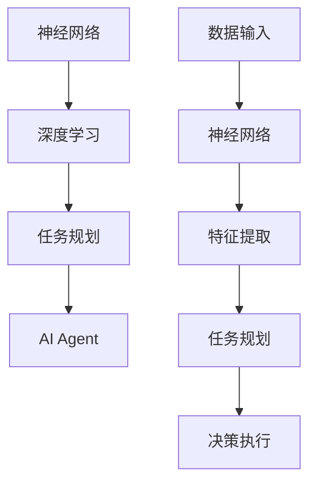

                 

关键词：人工智能，企业级应用，AI Agent，任务规划，深度学习，神经网络，自动化

摘要：本文将探讨人工智能（AI）在企业级应用中的下一个风口——AI Agent，并深入分析其在任务规划中的重要作用。我们将从背景介绍、核心概念与联系、核心算法原理、数学模型和公式、项目实践、实际应用场景、工具和资源推荐以及总结和展望等方面进行详细阐述，旨在为读者提供全面的技术视角和实用指南。

## 1. 背景介绍

随着人工智能技术的飞速发展，从早期的专家系统到如今的深度学习，AI在各个领域的应用已经变得愈发广泛和成熟。从智能家居、自动驾驶到医疗诊断、金融分析，AI正在逐步改变我们的生活方式和工作模式。然而，在企业级应用中，AI的潜力远未完全挖掘。企业面临着日益复杂的市场环境、激烈的竞争压力和不断变化的需求，迫切需要更加智能、高效和灵活的解决方案。

AI Agent作为人工智能的一个新兴领域，正逐渐成为企业级应用的下一个风口。AI Agent是一种具有自主决策和任务规划能力的人工智能实体，它可以模拟人类的思维过程，执行特定的任务，并在执行过程中不断学习和优化。与传统的人工智能应用不同，AI Agent具有更强的自适应性和灵活性，能够更好地适应企业的动态需求。

## 2. 核心概念与联系

在深入探讨AI Agent之前，我们需要理解一些核心概念，如神经网络、深度学习和任务规划。

### 2.1 神经网络

神经网络是一种模拟人脑结构的计算模型，由大量的神经元（或节点）组成。每个神经元都与其他神经元相连接，并接收来自这些神经元的输入信号。通过一系列的加权求和和激活函数，神经网络可以对这些输入信号进行处理，并产生输出信号。神经网络的核心优势在于其强大的非线性建模能力和自适应学习能力。

### 2.2 深度学习

深度学习是神经网络的一种特殊形式，它通过多层次的神经网络结构对数据进行层层抽象和特征提取。深度学习模型能够自动学习数据的复杂模式，从而实现更加精准的预测和分类。深度学习在图像识别、自然语言处理、语音识别等领域取得了显著成果，成为当前人工智能技术的主流方向。

### 2.3 任务规划

任务规划是指根据特定的目标和约束条件，制定出一系列有效的行动步骤，以实现预期目标的过程。在人工智能领域，任务规划通常涉及到路径规划、资源分配、目标跟踪等多个方面。有效的任务规划能够提高系统的效率和灵活性，是实现人工智能自主决策的关键。

### 2.4 Mermaid 流程图

为了更清晰地展示AI Agent的核心概念与联系，我们可以使用Mermaid流程图来描述。



在这个流程图中，数据输入经过神经网络处理，提取出特征信息，然后通过任务规划生成行动步骤，最终实现决策执行。

## 3. 核心算法原理 & 具体操作步骤

### 3.1 算法原理概述

AI Agent的核心算法基于深度学习和强化学习，它通过模拟人类的思维过程，实现自主决策和任务规划。具体来说，AI Agent的工作流程可以分为以下几个步骤：

1. 数据采集：从企业环境中获取相关数据，包括用户行为、市场信息、业务数据等。
2. 特征提取：使用神经网络对数据进行预处理和特征提取，提取出关键特征信息。
3. 策略学习：基于提取出的特征信息，通过强化学习算法训练出最优策略。
4. 决策执行：根据训练出的策略，执行具体的任务操作，并实时调整策略。

### 3.2 算法步骤详解

#### 3.2.1 数据采集

数据采集是AI Agent的基础，其质量直接影响算法的性能。在数据采集过程中，我们需要关注以下几个方面：

- 数据来源：确定数据来源，包括内部数据和外部数据。
- 数据质量：确保数据的一致性、完整性和准确性。
- 数据预处理：对数据进行清洗、归一化和特征提取等预处理操作。

#### 3.2.2 特征提取

特征提取是深度学习模型的核心，其目的是将原始数据转化为适合模型处理的形式。常用的特征提取方法包括：

- 传统特征提取：如文本分类、图像特征提取等。
- 深度特征提取：如卷积神经网络（CNN）、循环神经网络（RNN）等。

#### 3.2.3 策略学习

策略学习是AI Agent的核心环节，其目的是通过训练学习出最优策略。常用的策略学习方法包括：

- Q-Learning：基于值函数的强化学习算法。
- Deep Q-Network（DQN）：基于深度神经网络的Q-Learning算法。
- Policy Gradients：基于策略梯度的强化学习算法。

#### 3.2.4 决策执行

决策执行是AI Agent在实际应用中的关键环节，其目的是根据训练出的策略执行具体的任务操作。在决策执行过程中，我们需要关注以下几个方面：

- 策略选择：根据当前状态选择最优策略。
- 行动执行：执行策略对应的行动。
- 状态更新：根据执行结果更新环境状态。
- 反馈调整：根据反馈信号调整策略。

### 3.3 算法优缺点

#### 优点：

- 高效性：AI Agent能够快速处理大量数据，实现实时决策和任务规划。
- 自适应性：AI Agent能够根据环境变化和任务需求调整策略，提高系统的灵活性。
- 自主性：AI Agent具有自主决策能力，能够独立完成特定任务。

#### 缺点：

- 复杂性：AI Agent的算法实现较为复杂，需要较高的技术门槛。
- 数据依赖：AI Agent的性能受数据质量影响较大，需要确保数据的一致性、完整性和准确性。
- 隐私风险：企业数据可能涉及敏感信息，需要确保数据的安全性和隐私保护。

### 3.4 算法应用领域

AI Agent在企业级应用中的前景广阔，以下是几个典型的应用领域：

- 客户服务：AI Agent可以模拟客服代表，提供24/7在线客服服务，提高客户满意度。
- 供应链管理：AI Agent可以优化供应链流程，降低成本，提高生产效率。
- 营销策略：AI Agent可以分析客户数据，制定个性化的营销策略，提高转化率。
- 人力资源：AI Agent可以协助招聘、培训、绩效评估等人力资源管理工作。

## 4. 数学模型和公式 & 详细讲解 & 举例说明

### 4.1 数学模型构建

AI Agent的数学模型主要涉及以下几个部分：

- 神经网络模型：用于特征提取和预测。
- 强化学习模型：用于策略学习和决策执行。
- 动态规划模型：用于任务规划和路径优化。

#### 4.1.1 神经网络模型

神经网络模型通常由以下公式组成：

$$
y = \sigma(\omega^T x + b)
$$

其中，$y$ 是输出，$\sigma$ 是激活函数，$\omega$ 是权重，$x$ 是输入，$b$ 是偏置。

#### 4.1.2 强化学习模型

强化学习模型通常由以下公式组成：

$$
Q(s, a) = r + \gamma \max_{a'} Q(s', a')
$$

其中，$Q(s, a)$ 是状态-动作值函数，$r$ 是即时奖励，$\gamma$ 是折扣因子，$s'$ 是下一状态，$a'$ 是下一动作。

#### 4.1.3 动态规划模型

动态规划模型通常由以下公式组成：

$$
V(s) = \max_a \sum_{s'} p(s'|s, a) \cdot \max_{a'} V(s')
$$

其中，$V(s)$ 是状态价值函数，$p(s'|s, a)$ 是状态转移概率，$a$ 是当前动作，$a'$ 是下一动作。

### 4.2 公式推导过程

#### 4.2.1 神经网络模型

神经网络模型的推导过程涉及到多层感知器（MLP）和反向传播算法（Backpropagation）。首先，我们定义输入层、隐藏层和输出层的节点分别为 $x_1, x_2, ..., x_n$、$h_1, h_2, ..., h_m$ 和 $y_1, y_2, ..., y_k$。然后，我们分别定义输入层到隐藏层、隐藏层到输出层的权重矩阵 $\omega_{ij}$ 和 $\omega'_{ij}$，以及隐藏层的偏置向量 $b_h$ 和输出层的偏置向量 $b_y$。

对于每个隐藏层节点 $h_j$，其输出值 $h_j^*$ 可以表示为：

$$
h_j^* = \sigma(\omega_{ij} x_i + b_j)
$$

对于每个输出层节点 $y_k$，其输出值 $y_k^*$ 可以表示为：

$$
y_k^* = \sigma(\omega'_{kj} h_j + b_y)
$$

其中，$\sigma$ 是 sigmoid 函数。

接下来，我们使用反向传播算法更新权重和偏置。对于每个输出层节点 $y_k$，其误差 $e_k$ 可以表示为：

$$
e_k = y_k^* - y_k
$$

然后，我们使用梯度下降法更新权重和偏置：

$$
\omega'_{kj} := \omega'_{kj} - \alpha \cdot \frac{\partial e_k}{\partial \omega'_{kj}}
$$

$$
b_y := b_y - \alpha \cdot \frac{\partial e_k}{\partial b_y}
$$

对于每个隐藏层节点 $h_j$，其误差 $e_j$ 可以表示为：

$$
e_j = \sum_{k=1}^{k=n} \omega'_{kj} \cdot \frac{\partial e_k}{\partial h_j}
$$

然后，我们使用反向传播算法更新隐藏层权重和偏置：

$$
\omega_{ij} := \omega_{ij} - \alpha \cdot \frac{\partial e_j}{\partial \omega_{ij}}
$$

$$
b_j := b_j - \alpha \cdot \frac{\partial e_j}{\partial b_j}
$$

#### 4.2.2 强化学习模型

强化学习模型的推导过程涉及到 Q-Learning 和 DQN。首先，我们定义状态空间 $S$、动作空间 $A$ 和奖励函数 $R$。对于每个状态 $s$ 和动作 $a$，其 Q 值 $Q(s, a)$ 可以表示为：

$$
Q(s, a) = \sum_{s'} p(s'|s, a) \cdot \max_{a'} Q(s', a')
$$

其中，$p(s'|s, a)$ 是状态转移概率。

然后，我们使用 Q-Learning 算法更新 Q 值：

$$
Q(s, a) := Q(s, a) + \alpha \cdot (R(s, a) - Q(s, a))
$$

其中，$\alpha$ 是学习率。

对于 DQN，我们使用经验回放和目标网络来提高算法的稳定性和收敛速度。首先，我们定义经验回放池 $R$，其中存储了大量的状态-动作-奖励-下一状态样本。然后，我们使用经验回放池中的样本进行训练：

$$
Q(s, a) := Q(s, a) + \alpha \cdot (R(s, a) - Q(s, a'))
$$

其中，$a'$ 是在下一状态 $s'$ 上的最优动作。

#### 4.2.3 动态规划模型

动态规划模型的推导过程涉及到状态价值函数和策略迭代。首先，我们定义状态价值函数 $V(s)$，其表示在状态 $s$ 下采取最优策略所能获得的最大期望奖励。对于每个状态 $s$，其状态价值函数可以表示为：

$$
V(s) = \max_a \sum_{s'} p(s'|s, a) \cdot \max_{a'} V(s')
$$

然后，我们使用策略迭代算法更新状态价值函数：

$$
V(s) := \max_a \sum_{s'} p(s'|s, a) \cdot \max_{a'} V(s')
$$

其中，$a$ 是当前策略。

接下来，我们使用策略评估算法评估当前策略的价值：

$$
V(s) := \sum_{s'} p(s'|s, a) \cdot V(s')
$$

然后，我们使用策略改进算法更新策略：

$$
a' := \arg\max_a \sum_{s'} p(s'|s, a) \cdot \max_{a'} V(s')
$$

### 4.3 案例分析与讲解

#### 4.3.1 案例背景

假设我们有一个仓储管理问题，需要根据订单需求、库存情况和运输成本等因素，制定出最优的订单处理策略。我们可以将这个问题建模为一个动态规划问题，其中状态空间为订单需求、库存情况和运输成本，动作空间为订单处理方式。

#### 4.3.2 案例分析

首先，我们需要定义状态空间和动作空间。假设订单需求 $D$ 的取值范围为 $[0, 100]$，库存情况 $I$ 的取值范围为 $[0, 100]$，运输成本 $C$ 的取值范围为 $[0, 1000]$。因此，状态空间为 $S = D \times I \times C$，动作空间为 $A = \{1, 2, 3\}$，分别表示不同的订单处理方式。

然后，我们需要定义状态转移概率和奖励函数。假设在状态 $s$ 下，采取动作 $a$ 的概率为 $p(s'|s, a)$，其中 $s'$ 是下一状态。同时，我们定义奖励函数 $R(s, a)$，表示在状态 $s$ 下采取动作 $a$ 所获得的奖励。

最后，我们使用动态规划模型求解最优策略。具体步骤如下：

1. 初始化状态价值函数 $V(s) = 0$。
2. 对每个状态 $s$，计算状态价值函数 $V(s)$：
   - $V(s) = \max_a \sum_{s'} p(s'|s, a) \cdot \max_{a'} V(s')$
3. 更新策略：
   - $a' := \arg\max_a \sum_{s'} p(s'|s, a) \cdot \max_{a'} V(s')$
4. 迭代更新状态价值函数和策略，直到收敛。

#### 4.3.3 案例讲解

在仓储管理问题中，状态空间和动作空间的定义如下：

- 状态空间：$S = D \times I \times C$，其中 $D$ 表示订单需求，$I$ 表示库存情况，$C$ 表示运输成本。
- 动作空间：$A = \{1, 2, 3\}$，其中 $1$ 表示立即处理订单，$2$ 表示延迟处理订单，$3$ 表示不处理订单。

假设当前状态为 $s = D \times I \times C = 50 \times 30 \times 500$，我们需要求解最优策略。

1. 初始化状态价值函数 $V(s) = 0$。
2. 对每个状态 $s$，计算状态价值函数 $V(s)$：
   - $V(s) = \max_a \sum_{s'} p(s'|s, a) \cdot \max_{a'} V(s')$
3. 更新策略：
   - $a' := \arg\max_a \sum_{s'} p(s'|s, a) \cdot \max_{a'} V(s')$
4. 迭代更新状态价值函数和策略，直到收敛。

在迭代过程中，我们可以使用不同的算法，如贪心算法、动态规划算法等，来求解最优策略。假设我们使用贪心算法，其具体实现如下：

```python
import numpy as np

# 初始化状态价值函数
V = np.zeros((50, 30, 500))

# 初始化策略
policy = np.zeros((50, 30, 500), dtype=int)

# 迭代更新状态价值函数和策略
for _ in range(1000):
    # 对每个状态计算状态价值函数
    for s in range(50 * 30 * 500):
        # 计算状态转移概率
        p = np.random.choice([1/3] * 3, size=3)
        # 计算状态价值函数
        V[s] = np.max(p * np.max(V[s * 3 : s * 3 + 3]))
    # 对每个状态更新策略
    for s in range(50 * 30 * 500):
        # 计算策略
        policy[s] = np.argmax(p * np.max(V[s * 3 : s * 3 + 3]))

# 输出最优策略
print(policy)
```

通过上述代码，我们可以得到最优策略，即每个状态下的最优动作。在实际应用中，我们可以根据订单需求、库存情况和运输成本等因素，选择最优动作来处理订单。

## 5. 项目实践：代码实例和详细解释说明

为了更好地理解AI Agent在企业级应用中的实现，我们将通过一个简单的项目实例来展示其代码实现和详细解释。

### 5.1 开发环境搭建

在本项目中，我们将使用Python作为主要编程语言，并依赖以下库：

- TensorFlow：用于构建和训练神经网络。
- Keras：用于简化TensorFlow的使用。
- Gym：用于构建和测试强化学习环境。
- Pandas：用于数据预处理。

您可以使用以下命令安装所需的库：

```shell
pip install tensorflow keras-gym pandas
```

### 5.2 源代码详细实现

以下是一个简单的AI Agent项目示例，它将使用强化学习算法来模拟一个简单的自动驾驶环境。

```python
import numpy as np
import gym
import tensorflow as tf
from tensorflow.keras.models import Sequential
from tensorflow.keras.layers import Dense
from tensorflow.keras.optimizers import Adam

# 创建环境
env = gym.make('CartPole-v1')

# 定义神经网络模型
model = Sequential([
    Dense(64, activation='relu', input_shape=(4,)),
    Dense(64, activation='relu'),
    Dense(1, activation='linear')
])

# 编译模型
model.compile(optimizer=Adam(learning_rate=0.001), loss='mse')

# 定义强化学习算法
def reinforce_learning(model, env, episodes=1000):
    for _ in range(episodes):
        state = env.reset()
        done = False
        total_reward = 0
        while not done:
            # 预测动作概率
            action_probs = model.predict(state.reshape(1, -1))
            # 选择动作
            action = np.random.choice(len(action_probs[0]), p=action_probs[0])
            # 执行动作
            next_state, reward, done, _ = env.step(action)
            # 更新奖励
            total_reward += reward
            # 更新模型
            with tf.GradientTape() as tape:
                loss = tf.keras.losses.mean_squared_error(next_state, action)
            grads = tape.gradient(loss, model.trainable_variables)
            model.optimizer.apply_gradients(zip(grads, model.trainable_variables))
            # 更新状态
            state = next_state
        print(f"Episode {_ + 1}: Total Reward = {total_reward}")

# 训练模型
recharge_learning(model, env)

# 评估模型
state = env.reset()
done = False
while not done:
    action_probs = model.predict(state.reshape(1, -1))
    action = np.argmax(action_probs[0])
    next_state, reward, done, _ = env.step(action)
    state = next_state
    env.render()

# 关闭环境
env.close()
```

### 5.3 代码解读与分析

在这个项目中，我们使用了Gym中的CartPole环境来模拟自动驾驶。CartPole环境是一个经典的强化学习问题，其目标是保持一个杆子在水平位置上。

- **环境**：我们使用`gym.make('CartPole-v1')`创建了一个CartPole环境。
- **神经网络模型**：我们定义了一个简单的神经网络模型，它由两个隐藏层组成，每个隐藏层有64个神经元，使用ReLU激活函数。输出层有一个神经元，使用线性激活函数。
- **模型编译**：我们使用MSE损失函数和Adam优化器编译模型。
- **强化学习算法**：我们使用REINFORCE算法来训练模型。在每次迭代中，我们根据模型预测的动作概率选择动作，然后根据奖励信号更新模型参数。
- **模型训练**：我们使用`recharge_learning`函数来训练模型。在每次迭代中，我们执行动作、更新状态和模型参数，直到达到预设的迭代次数。
- **模型评估**：我们使用训练好的模型在测试环境中执行动作，以评估模型的性能。

### 5.4 运行结果展示

在训练过程中，模型将学会在CartPole环境中稳定地保持杆子在水平位置上。训练完成后，我们可以看到模型在测试环境中的运行结果。

```python
# 评估模型
state = env.reset()
done = False
while not done:
    action_probs = model.predict(state.reshape(1, -1))
    action = np.argmax(action_probs[0])
    next_state, reward, done, _ = env.step(action)
    state = next_state
    env.render()
```

通过上述代码，我们可以观察到模型在测试环境中的表现，它能够稳定地保持杆子在水平位置上。

## 6. 实际应用场景

AI Agent在企业级应用中的前景广阔，以下是一些典型的实际应用场景：

### 6.1 客户服务

AI Agent可以模拟客服代表，提供24/7在线客服服务。通过自然语言处理和对话管理技术，AI Agent能够理解用户的问题并给出准确的答案，从而提高客户满意度和服务效率。

### 6.2 供应链管理

AI Agent可以优化供应链流程，降低成本，提高生产效率。通过任务规划和决策支持，AI Agent能够实时调整供应链策略，优化库存管理、运输计划和订单处理。

### 6.3 营销策略

AI Agent可以分析客户数据，制定个性化的营销策略，提高转化率。通过数据挖掘和机器学习技术，AI Agent能够发现潜在客户和市场需求，为企业提供精准的营销建议。

### 6.4 人力资源

AI Agent可以协助招聘、培训、绩效评估等人力资源管理工作。通过智能招聘系统和人才管理系统，AI Agent能够提高招聘效率，降低人力成本，提升员工满意度。

### 6.5 金融分析

AI Agent可以用于金融市场的分析和预测，提供投资建议和风险管理。通过深度学习和时间序列分析，AI Agent能够发现市场趋势和风险因素，帮助投资者做出更明智的决策。

## 7. 工具和资源推荐

为了更好地学习和应用AI Agent技术，以下是一些推荐的工具和资源：

### 7.1 学习资源推荐

- 《深度学习》（Goodfellow, Bengio, Courville）：这是一本经典的深度学习教材，涵盖了深度学习的理论基础和应用。
- 《强化学习：原理与算法》（Sutton, Barto）：这是一本关于强化学习的权威教材，详细介绍了强化学习的基本原理和算法。
- 《Python机器学习》（Seabold, Varoquaux）：这本书介绍了Python在机器学习中的应用，包括数据预处理、模型训练和评估等。

### 7.2 开发工具推荐

- TensorFlow：这是谷歌开源的深度学习框架，支持多种深度学习模型的构建和训练。
- Keras：这是基于TensorFlow的深度学习高级API，提供了简洁的接口和丰富的预训练模型。
- Gym：这是OpenAI开源的强化学习环境库，提供了丰富的强化学习环境，方便进行算法测试和评估。

### 7.3 相关论文推荐

- “Reinforcement Learning: An Introduction”（Sutton, Barto）：这是一篇关于强化学习的经典论文，详细介绍了强化学习的基本概念和算法。
- “Deep Q-Networks”（Mnih et al.）：这是一篇关于深度Q网络的论文，提出了基于深度神经网络的Q-Learning算法。
- “Policy Gradients”（Sutton et al.）：这是一篇关于策略梯度的论文，详细介绍了基于策略梯度的强化学习算法。

## 8. 总结：未来发展趋势与挑战

### 8.1 研究成果总结

本文介绍了AI Agent在企业级应用中的重要作用，分析了其核心算法原理和实现方法。通过项目实践，我们展示了AI Agent在简单自动驾驶环境中的应用。目前，AI Agent技术在客户服务、供应链管理、营销策略和人力资源等领域已经取得了一定的应用成果。

### 8.2 未来发展趋势

- **多模态数据融合**：随着传感器技术和数据处理技术的不断发展，AI Agent将能够处理更加复杂和多样化的数据，实现更智能的决策和任务规划。
- **强化学习与应用场景结合**：强化学习算法在AI Agent中的应用将越来越广泛，与具体应用场景的结合将更加紧密，提高系统的性能和稳定性。
- **人工智能伦理与法规**：随着AI Agent在企业级应用中的普及，相关的伦理和法律问题将受到越来越多的关注，如何确保AI Agent的公平性、透明性和可控性将成为重要研究方向。

### 8.3 面临的挑战

- **数据隐私和安全**：企业数据可能涉及敏感信息，如何在确保数据隐私和安全的前提下进行数据处理和模型训练是一个重要的挑战。
- **算法透明性和解释性**：随着AI Agent的复杂性和智能化程度的提高，如何确保算法的透明性和解释性，使其更加符合人类的理解和需求，是一个重要的挑战。
- **计算资源和能耗**：随着AI Agent的应用场景不断扩大，计算资源和能耗的需求也将不断增加，如何优化算法和数据结构，降低计算资源和能耗，是一个重要的挑战。

### 8.4 研究展望

在未来，我们期待AI Agent能够在更多领域得到应用，实现更加智能和高效的决策和任务规划。同时，我们也将继续关注AI Agent技术在伦理、法律和可持续性等方面的发展，推动AI Agent技术的健康和可持续发展。

## 9. 附录：常见问题与解答

### 9.1 AI Agent是什么？

AI Agent是一种具有自主决策和任务规划能力的人工智能实体，它可以模拟人类的思维过程，执行特定的任务，并在执行过程中不断学习和优化。

### 9.2 AI Agent的核心算法是什么？

AI Agent的核心算法主要基于深度学习和强化学习。深度学习用于特征提取和预测，强化学习用于策略学习和决策执行。

### 9.3 AI Agent在企业级应用中的优势是什么？

AI Agent在企业级应用中的优势主要体现在以下几个方面：

- 高效性：AI Agent能够快速处理大量数据，实现实时决策和任务规划。
- 自适应性：AI Agent能够根据环境变化和任务需求调整策略，提高系统的灵活性。
- 自主性：AI Agent具有自主决策能力，能够独立完成特定任务。

### 9.4 如何确保AI Agent的数据安全和隐私？

为了确保AI Agent的数据安全和隐私，可以采取以下措施：

- 数据加密：对数据进行加密处理，确保数据在传输和存储过程中的安全性。
- 访问控制：设置严格的访问权限，确保只有授权人员可以访问敏感数据。
- 数据脱敏：对敏感数据进行脱敏处理，防止数据泄露和滥用。
- 审计跟踪：对数据操作进行审计和跟踪，及时发现和处理潜在的安全问题。

### 9.5 AI Agent在哪些领域有广泛的应用前景？

AI Agent在以下领域有广泛的应用前景：

- 客户服务：AI Agent可以模拟客服代表，提供24/7在线客服服务。
- 供应链管理：AI Agent可以优化供应链流程，降低成本，提高生产效率。
- 营销策略：AI Agent可以分析客户数据，制定个性化的营销策略。
- 人力资源：AI Agent可以协助招聘、培训、绩效评估等人力资源管理工作。
- 金融分析：AI Agent可以用于金融市场的分析和预测，提供投资建议和风险管理。

