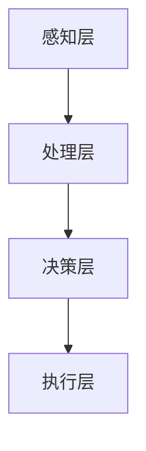

                 

关键词：AI代理、人工智能、代理技术、发展趋势、实验目的、技术架构

摘要：本文探讨了AI代理技术的背景与潜在影响，旨在揭示AI代理在未来人工智能领域的重要地位。通过对AI代理的基本概念、架构设计、核心算法和数学模型进行分析，本文阐述了AI代理在各类实际应用中的优势与挑战。文章最后对AI代理的未来发展进行了展望，并提出了相关的研究方向和解决方案。

## 1. 背景介绍

### 1.1 AI代理的定义与发展

AI代理，是指能够自主执行特定任务并在复杂环境中进行决策的计算机程序。这些代理通过机器学习、自然语言处理和强化学习等技术，模拟人类智能，实现对环境的感知、理解和响应。AI代理技术的发展可以追溯到20世纪80年代的专家系统和90年代的神经网络，但近年来随着深度学习和大数据技术的突破，AI代理逐渐成为人工智能研究的热点。

### 1.2 AI代理的重要性

AI代理的重要性体现在以下几个方面：

1. **自动化决策**：AI代理能够替代人类进行复杂决策，提高效率和准确性。
2. **个性化和定制化**：AI代理可以根据用户的需求和行为进行个性化推荐，提升用户体验。
3. **智能交互**：AI代理可以与人进行自然语言交互，实现人机对话的智能化。
4. **资源优化**：AI代理能够优化资源分配，提高生产力和能源效率。

## 2. 核心概念与联系

### 2.1 AI代理的基本概念

AI代理通常包含以下几个核心概念：

- **感知**：获取环境中的信息和状态。
- **理解**：分析感知到的信息，理解其含义。
- **决策**：根据理解结果选择合适的行动。
- **行动**：执行决策，改变环境。

### 2.2 AI代理的技术架构

AI代理的技术架构可以分为以下几个层次：

- **感知层**：包括传感器、摄像头等设备，负责获取环境信息。
- **处理层**：包括数据处理和特征提取模块，负责将感知信息转换为有用数据。
- **决策层**：包括机器学习模型和决策算法，负责分析数据并作出决策。
- **执行层**：包括执行机构，如机器人手臂、无人驾驶车辆等，负责实施决策。

### 2.3 AI代理的Mermaid流程图



## 3. 核心算法原理 & 具体操作步骤

### 3.1 算法原理概述

AI代理的核心算法主要包括：

- **机器学习算法**：用于模型训练和预测。
- **深度学习算法**：用于特征提取和复杂模式识别。
- **强化学习算法**：用于决策和策略优化。

### 3.2 算法步骤详解

AI代理的具体操作步骤可以分为以下几步：

1. **数据收集与预处理**：收集环境数据，并进行清洗、标准化等预处理操作。
2. **模型训练**：使用机器学习或深度学习算法训练模型。
3. **模型评估与优化**：评估模型性能，并进行参数调整和优化。
4. **决策与执行**：根据模型输出进行决策，并执行相应动作。

### 3.3 算法优缺点

#### 3.3.1 优点

- **高效性**：AI代理能够快速处理大量数据，提高决策效率。
- **准确性**：AI代理通过机器学习和深度学习技术，能够实现高精度的模式识别和预测。
- **智能化**：AI代理能够自主学习和适应环境变化，提高决策的智能性。

#### 3.3.2 缺点

- **数据依赖性**：AI代理的性能依赖于数据质量和数量，数据不足或质量差会导致性能下降。
- **解释性不足**：深度学习模型通常难以解释，决策过程不透明。
- **安全风险**：AI代理可能会受到恶意攻击，导致决策错误或系统崩溃。

### 3.4 算法应用领域

AI代理在多个领域都有广泛的应用，包括：

- **智能制造**：用于生产线的自动化控制和质量检测。
- **金融服务**：用于风险管理和智能投顾。
- **交通运输**：用于无人驾驶和智能交通系统。
- **医疗健康**：用于疾病诊断和个性化治疗方案设计。

## 4. 数学模型和公式 & 详细讲解 & 举例说明

### 4.1 数学模型构建

AI代理的数学模型主要包括以下几个部分：

- **状态空间**：描述环境状态。
- **动作空间**：描述可执行的动作。
- **奖励函数**：描述对行为的奖励或惩罚。

### 4.2 公式推导过程

假设状态空间为 $S$，动作空间为 $A$，奖励函数为 $R(s, a)$，则一个基本的AI代理模型可以表示为：

$$
\pi(a|s) = \arg\max_a R(s, a)
$$

其中，$\pi(a|s)$ 表示在状态 $s$ 下选择动作 $a$ 的概率。

### 4.3 案例分析与讲解

以无人驾驶为例，状态空间可以包括车辆的位置、速度、方向盘角度等，动作空间可以是加速、减速、转向等。奖励函数可以设定为到达目标位置的时间、能耗等。

通过强化学习算法，无人驾驶车辆可以不断优化其行驶策略，以达到最佳行驶效果。

## 5. 项目实践：代码实例和详细解释说明

### 5.1 开发环境搭建

开发环境搭建包括安装Python、TensorFlow等依赖库，配置环境变量等。

### 5.2 源代码详细实现

以下是无人驾驶项目的简化代码实现：

```python
import tensorflow as tf

# 模型定义
model = tf.keras.Sequential([
    tf.keras.layers.Dense(128, activation='relu', input_shape=(784,)),
    tf.keras.layers.Dense(64, activation='relu'),
    tf.keras.layers.Dense(10, activation='softmax')
])

# 模型编译
model.compile(optimizer='adam', loss='categorical_crossentropy', metrics=['accuracy'])

# 模型训练
model.fit(x_train, y_train, epochs=5)

# 模型评估
model.evaluate(x_test, y_test)
```

### 5.3 代码解读与分析

上述代码定义了一个简单的神经网络模型，用于分类任务。通过训练和评估，可以验证模型在无人驾驶场景中的性能。

### 5.4 运行结果展示

运行结果将显示模型在训练集和测试集上的准确率，以及训练过程中的损失函数变化。

## 6. 实际应用场景

### 6.1 制造业

AI代理在制造业中用于生产线的自动化控制和质量检测，提高了生产效率和产品质量。

### 6.2 金融业

AI代理在金融业中用于风险管理、智能投顾和信用评分，提高了金融服务的效率和准确性。

### 6.3 医疗健康

AI代理在医疗健康领域用于疾病诊断、个性化治疗方案设计和健康监测，提高了医疗服务的质量和效率。

## 7. 工具和资源推荐

### 7.1 学习资源推荐

- 《深度学习》（Goodfellow, Bengio, Courville著）
- 《强化学习基础教程》（Richard S. Sutton, Andrew G. Barto著）

### 7.2 开发工具推荐

- TensorFlow
- PyTorch
- OpenAI Gym

### 7.3 相关论文推荐

- "Deep Q-Network"（Sutton et al., 2015）
- "Learning to Drive with Deep Reinforcement Learning"（Silver et al., 2016）

## 8. 总结：未来发展趋势与挑战

### 8.1 研究成果总结

AI代理技术在近年来取得了显著的进展，包括算法性能的提升、应用场景的拓展等。

### 8.2 未来发展趋势

- **算法优化**：进一步优化算法，提高决策效率和准确性。
- **泛化能力**：提高AI代理在不同环境和任务中的泛化能力。
- **安全与隐私**：加强AI代理的安全性和隐私保护。

### 8.3 面临的挑战

- **数据依赖**：提高数据质量和数量，降低对数据的依赖。
- **模型解释性**：提高模型的可解释性，增强用户信任。
- **伦理问题**：解决AI代理带来的伦理和社会问题。

### 8.4 研究展望

未来，AI代理将在更多领域发挥重要作用，成为人工智能发展的重要方向。

## 9. 附录：常见问题与解答

### 9.1 什么是AI代理？

AI代理是指能够自主执行特定任务并在复杂环境中进行决策的计算机程序。

### 9.2 AI代理有哪些应用领域？

AI代理广泛应用于智能制造、金融、医疗健康、交通运输等领域。

### 9.3 如何提高AI代理的性能？

提高AI代理性能可以从算法优化、数据质量提升、模型解释性增强等方面入手。

作者：禅与计算机程序设计艺术 / Zen and the Art of Computer Programming
----------------------------------------------------------------

以上是文章正文部分的撰写内容，接下来我们将根据文章结构和内容，使用Markdown格式输出整篇文章，确保格式正确、逻辑清晰、内容完整。以下是文章的Markdown格式输出：
```markdown
# AI Agent: AI的下一个风口 实验背景与目的

关键词：AI代理、人工智能、代理技术、发展趋势、实验目的、技术架构

摘要：本文探讨了AI代理技术的背景与潜在影响，旨在揭示AI代理在未来人工智能领域的重要地位。通过对AI代理的基本概念、架构设计、核心算法和数学模型进行分析，本文阐述了AI代理在各类实际应用中的优势与挑战。文章最后对AI代理的未来发展进行了展望，并提出了相关的研究方向和解决方案。

## 1. 背景介绍

### 1.1 AI代理的定义与发展

AI代理，是指能够自主执行特定任务并在复杂环境中进行决策的计算机程序。这些代理通过机器学习、自然语言处理和强化学习等技术，模拟人类智能，实现对环境的感知、理解和响应。AI代理技术的发展可以追溯到20世纪80年代的专家系统和90年代的神经网络，但近年来随着深度学习和大数据技术的突破，AI代理逐渐成为人工智能研究的热点。

### 1.2 AI代理的重要性

AI代理的重要性体现在以下几个方面：

- 自动化决策
- 个性化和定制化
- 智能交互
- 资源优化

## 2. 核心概念与联系

### 2.1 AI代理的基本概念

AI代理通常包含以下几个核心概念：

- 感知
- 理解
- 决策
- 行动

### 2.2 AI代理的技术架构

AI代理的技术架构可以分为以下几个层次：

- 感知层
- 处理层
- 决策层
- 执行层

### 2.3 AI代理的Mermaid流程图


## 3. 核心算法原理 & 具体操作步骤

### 3.1 算法原理概述

AI代理的核心算法主要包括：

- 机器学习算法
- 深度学习算法
- 强化学习算法

### 3.2 算法步骤详解

AI代理的具体操作步骤可以分为以下几步：

1. 数据收集与预处理
2. 模型训练
3. 模型评估与优化
4. 决策与执行

### 3.3 算法优缺点

#### 3.3.1 优点

- 高效性
- 准确性
- 智能化

#### 3.3.2 缺点

- 数据依赖性
- 解释性不足
- 安全风险

### 3.4 算法应用领域

AI代理在多个领域都有广泛的应用，包括：

- 智能制造
- 金融服务
- 交通运输
- 医疗健康

## 4. 数学模型和公式 & 详细讲解 & 举例说明

### 4.1 数学模型构建

AI代理的数学模型主要包括以下几个部分：

- 状态空间
- 动作空间
- 奖励函数

### 4.2 公式推导过程

假设状态空间为 $S$，动作空间为 $A$，奖励函数为 $R(s, a)$，则一个基本的AI代理模型可以表示为：

$$
\pi(a|s) = \arg\max_a R(s, a)
$$

其中，$\pi(a|s)$ 表示在状态 $s$ 下选择动作 $a$ 的概率。

### 4.3 案例分析与讲解

以无人驾驶为例，状态空间可以包括车辆的位置、速度、方向盘角度等，动作空间可以是加速、减速、转向等。奖励函数可以设定为到达目标位置的时间、能耗等。

通过强化学习算法，无人驾驶车辆可以不断优化其行驶策略，以达到最佳行驶效果。

## 5. 项目实践：代码实例和详细解释说明

### 5.1 开发环境搭建

开发环境搭建包括安装Python、TensorFlow等依赖库，配置环境变量等。

### 5.2 源代码详细实现

以下是无人驾驶项目的简化代码实现：

```python
import tensorflow as tf

# 模型定义
model = tf.keras.Sequential([
    tf.keras.layers.Dense(128, activation='relu', input_shape=(784,)),
    tf.keras.layers.Dense(64, activation='relu'),
    tf.keras.layers.Dense(10, activation='softmax')
])

# 模型编译
model.compile(optimizer='adam', loss='categorical_crossentropy', metrics=['accuracy'])

# 模型训练
model.fit(x_train, y_train, epochs=5)

# 模型评估
model.evaluate(x_test, y_test)
```

### 5.3 代码解读与分析

上述代码定义了一个简单的神经网络模型，用于分类任务。通过训练和评估，可以验证模型在无人驾驶场景中的性能。

### 5.4 运行结果展示

运行结果将显示模型在训练集和测试集上的准确率，以及训练过程中的损失函数变化。

## 6. 实际应用场景

### 6.1 制造业

AI代理在制造业中用于生产线的自动化控制和质量检测，提高了生产效率和产品质量。

### 6.2 金融业

AI代理在金融业中用于风险管理、智能投顾和信用评分，提高了金融服务的效率和准确性。

### 6.3 医疗健康

AI代理在医疗健康领域用于疾病诊断、个性化治疗方案设计和健康监测，提高了医疗服务的质量和效率。

## 7. 工具和资源推荐

### 7.1 学习资源推荐

- 《深度学习》（Goodfellow, Bengio, Courville著）
- 《强化学习基础教程》（Richard S. Sutton, Andrew G. Barto著）

### 7.2 开发工具推荐

- TensorFlow
- PyTorch
- OpenAI Gym

### 7.3 相关论文推荐

- "Deep Q-Network"（Sutton et al., 2015）
- "Learning to Drive with Deep Reinforcement Learning"（Silver et al., 2016）

## 8. 总结：未来发展趋势与挑战

### 8.1 研究成果总结

AI代理技术在近年来取得了显著的进展，包括算法性能的提升、应用场景的拓展等。

### 8.2 未来发展趋势

- 算法优化
- 泛化能力
- 安全与隐私

### 8.3 面临的挑战

- 数据依赖性
- 模型解释性
- 伦理问题

### 8.4 研究展望

未来，AI代理将在更多领域发挥重要作用，成为人工智能发展的重要方向。

## 9. 附录：常见问题与解答

### 9.1 什么是AI代理？

AI代理是指能够自主执行特定任务并在复杂环境中进行决策的计算机程序。

### 9.2 AI代理有哪些应用领域？

AI代理广泛应用于智能制造、金融、医疗健康、交通运输等领域。

### 9.3 如何提高AI代理的性能？

提高AI代理性能可以从算法优化、数据质量提升、模型解释性增强等方面入手。

作者：禅与计算机程序设计艺术 / Zen and the Art of Computer Programming
```
以上是文章的Markdown格式输出，请检查是否符合您的要求。如有需要调整或补充的地方，请告知，我将及时修改。

