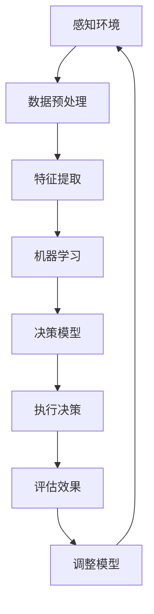

                 

关键词：AI Agent，人工智能，研究难点，挑战，未来趋势

> 摘要：随着人工智能技术的飞速发展，AI Agent成为了当前的研究热点。本文将深入探讨AI Agent的核心概念、算法原理、应用领域、数学模型以及未来发展趋势，同时揭示当前研究中所面临的挑战。

## 1. 背景介绍

人工智能（AI）技术自诞生以来，就以其强大的计算能力和自主决策能力为人们所瞩目。从最初的规则系统到现代的深度学习，人工智能经历了数次重大技术革新。在近年来，AI Agent这一概念逐渐兴起，成为人工智能领域的下一个风口。

AI Agent是指一种具有自主决策能力、能够在复杂环境中执行任务的智能体。它们可以模拟人类行为，解决实际问题，并在不断学习与优化中提升自身能力。AI Agent在许多领域都有广泛的应用前景，包括但不限于自动驾驶、智能家居、智能客服等。

### 1.1 发展历程

AI Agent的概念起源于20世纪80年代，当时人工智能研究者开始探索如何构建具有自主决策能力的智能体。早期的AI Agent主要依赖于规则系统和基于知识的方法。随着计算机性能的提升和算法的进步，AI Agent逐渐从简单模拟转向复杂决策。

进入21世纪，深度学习的崛起为AI Agent的发展提供了新的动力。深度学习模型能够处理大量的数据，从而实现更加智能的决策。在此基础上，强化学习算法的引入使得AI Agent能够通过试错学习来优化决策过程。

### 1.2 应用现状

目前，AI Agent已经在多个领域取得了显著成果。自动驾驶是AI Agent最为典型的应用场景之一，自动驾驶车辆通过感知环境、分析路况并做出实时决策，实现了在复杂道路条件下的安全行驶。智能家居中的智能音箱、智能机器人等AI Agent，则极大地提升了人们的生活品质。

此外，AI Agent还在金融、医疗、教育等领域发挥了重要作用。例如，金融领域的智能投顾系统可以基于用户的风险偏好和历史数据，为用户提供个性化的投资建议；医疗领域的智能诊断系统可以帮助医生更快速、准确地诊断疾病。

## 2. 核心概念与联系

为了更好地理解AI Agent，我们需要了解其核心概念和架构。以下是AI Agent的关键概念及相互关系：

### 2.1 机器学习（Machine Learning）

机器学习是AI Agent的基础，它通过训练模型来使计算机具备自主学习和改进能力。机器学习算法可以分为监督学习、无监督学习和强化学习。监督学习通过已知输入和输出训练模型，无监督学习则从无标签数据中学习模式，强化学习则通过试错来优化决策过程。

### 2.2 深度学习（Deep Learning）

深度学习是机器学习的一种重要分支，它通过多层神经网络来提取特征并生成预测。深度学习在图像识别、语音识别等领域取得了突破性成果，为AI Agent提供了强大的决策能力。

### 2.3 强化学习（Reinforcement Learning）

强化学习是AI Agent决策的重要算法，它通过奖励机制来训练智能体，使其在复杂环境中做出最优决策。强化学习在自动驾驶、游戏AI等领域具有广泛应用。

### 2.4 自然语言处理（Natural Language Processing）

自然语言处理是AI Agent与人交互的重要工具，它使计算机能够理解、生成和解释人类语言。自然语言处理在智能客服、智能语音助手等领域具有广泛的应用。

以下是AI Agent的架构及相互关系（使用Mermaid流程图表示）：



## 3. 核心算法原理 & 具体操作步骤

### 3.1 算法原理概述

AI Agent的核心算法主要包括感知环境、决策执行和评估调整三个环节。

1. **感知环境**：AI Agent通过传感器收集环境信息，如图像、声音、文本等，并进行预处理和特征提取。
2. **决策执行**：基于感知到的环境信息，AI Agent使用机器学习模型进行决策，并执行相应动作。
3. **评估调整**：AI Agent根据执行结果评估决策效果，并通过反馈调整模型参数，以优化决策过程。

### 3.2 算法步骤详解

1. **感知环境**
   - **数据采集**：通过传感器收集环境数据，如摄像头、麦克风、传感器等。
   - **数据预处理**：对采集到的数据去噪、滤波、归一化等处理，使其符合模型输入要求。
   - **特征提取**：使用深度学习算法提取数据中的关键特征，如图像中的边缘、纹理、形状等。

2. **决策执行**
   - **模型选择**：根据任务需求选择合适的机器学习模型，如卷积神经网络、循环神经网络等。
   - **模型训练**：使用训练数据对模型进行训练，使其具备预测能力。
   - **决策生成**：根据当前环境状态，使用训练好的模型生成决策。
   - **执行动作**：根据决策结果执行相应动作，如控制机械臂、发送指令等。

3. **评估调整**
   - **效果评估**：根据执行结果评估决策效果，如准确率、召回率等。
   - **模型调整**：根据评估结果调整模型参数，优化决策过程。
   - **反馈学习**：将调整后的模型重新训练，以进一步提高决策效果。

### 3.3 算法优缺点

- **优点**：
  - **自适应性强**：AI Agent能够根据环境变化自适应调整决策。
  - **自主决策**：AI Agent具有自主决策能力，无需人工干预。
  - **高效性**：AI Agent能够处理大量数据，快速生成决策。

- **缺点**：
  - **数据依赖**：AI Agent的性能高度依赖于训练数据的质量和数量。
  - **计算资源消耗**：深度学习算法需要大量计算资源，对硬件要求较高。
  - **安全风险**：AI Agent可能受到恶意攻击，导致决策失误。

### 3.4 算法应用领域

AI Agent在多个领域具有广泛的应用前景，以下是部分典型应用场景：

- **自动驾驶**：AI Agent能够实时感知路况，做出安全驾驶决策。
- **智能客服**：AI Agent能够理解用户需求，提供个性化服务。
- **智能家居**：AI Agent能够根据用户习惯，自动调整家居环境。
- **医疗诊断**：AI Agent能够辅助医生进行疾病诊断。
- **金融风控**：AI Agent能够实时监测市场动态，提供投资建议。

## 4. 数学模型和公式 & 详细讲解 & 举例说明

### 4.1 数学模型构建

AI Agent的核心算法通常基于以下数学模型：

- **感知模型**：如卷积神经网络（CNN）等。
- **决策模型**：如循环神经网络（RNN）等。
- **评估模型**：如线性回归等。

以下是这些模型的数学公式：

1. **卷积神经网络（CNN）**

   输入特征映射：$f_{ij} = \sum_{k=1}^{C} w_{ik} * g_{kj}$

   激活函数：$h_{ij} = \sigma(f_{ij})$

   输出特征映射：$o_{ij} = \sum_{k=1}^{H} w_{ik} * h_{kj}$

   其中，$f_{ij}$为输入特征映射，$w_{ik}$为权重，$g_{kj}$为卷积核，$h_{ij}$为激活后的特征映射，$o_{ij}$为输出特征映射，$\sigma$为激活函数。

2. **循环神经网络（RNN）**

   输入向量：$x_t$

   状态更新：$h_t = \sigma(W_h h_{t-1} + W_x x_t + b)$

   输出：$y_t = \text{softmax}(W_y h_t + b_y)$

   其中，$h_t$为当前时刻的状态，$W_h$、$W_x$、$W_y$分别为权重矩阵，$b$、$b_y$为偏置项，$\sigma$为激活函数，$\text{softmax}$为输出层激活函数。

3. **线性回归**

   输出：$y = \beta_0 + \beta_1 x$

   其中，$y$为输出值，$x$为输入值，$\beta_0$、$\beta_1$分别为权重系数。

### 4.2 公式推导过程

以卷积神经网络（CNN）为例，以下是公式推导过程：

1. **卷积操作**

   假设输入特征映射为$f_{ij}$，卷积核为$g_{kj}$，输出特征映射为$o_{ij}$。卷积操作的公式为：

   $f_{ij} = \sum_{k=1}^{C} w_{ik} * g_{kj}$

   其中，$w_{ik}$为权重，$*$表示卷积操作。

2. **激活函数**

   对输出特征映射进行激活操作，得到激活后的特征映射$h_{ij}$。激活函数的公式为：

   $h_{ij} = \sigma(f_{ij})$

   其中，$\sigma$为激活函数，常用的激活函数有Sigmoid、ReLU等。

3. **全连接层**

   将激活后的特征映射输入到全连接层，得到输出特征映射$o_{ij}$。全连接层的公式为：

   $o_{ij} = \sum_{k=1}^{H} w_{ik} * h_{kj}$

   其中，$w_{ik}$为权重，$h_{kj}$为激活后的特征映射。

4. **损失函数**

   使用损失函数（如均方误差）计算预测值与真实值之间的差距，以优化模型参数。损失函数的公式为：

   $L = \frac{1}{2} \sum_{i=1}^{N} (y_i - \hat{y}_i)^2$

   其中，$y_i$为真实值，$\hat{y}_i$为预测值，$N$为样本数量。

### 4.3 案例分析与讲解

假设我们使用卷积神经网络（CNN）进行图像分类任务，输入图像为一张5x5的矩阵，卷积核为3x3，激活函数为ReLU。

1. **输入特征映射**

   输入特征映射$f_{ij}$为一个5x5的矩阵，如：

   | f11 | f12 | f13 | f14 | f15 |
   | --- | --- | --- | --- | --- |
   | f21 | f22 | f23 | f24 | f25 |
   | f31 | f32 | f33 | f34 | f35 |
   | f41 | f42 | f43 | f44 | f45 |
   | f51 | f52 | f53 | f54 | f55 |

2. **卷积操作**

   对输入特征映射进行卷积操作，使用一个3x3的卷积核$g_{kj}$，如：

   | g11 | g12 | g13 |
   | --- | --- | --- |
   | g21 | g22 | g23 |
   | g31 | g32 | g33 |

   卷积后的输出特征映射$f_{ij}$为：

   | f11 | f12 | f13 | f14 | f15 |
   | --- | --- | --- | --- | --- |
   | f21 | f22 | f23 | f24 | f25 |
   | f31 | f32 | f33 | f34 | f35 |
   | f41 | f42 | f43 | f44 | f45 |
   | f51 | f52 | f53 | f54 | f55 |

3. **激活函数**

   对卷积后的输出特征映射进行ReLU激活操作，如：

   | h11 | h12 | h13 | h14 | h15 |
   | --- | --- | --- | --- | --- |
   | h21 | h22 | h23 | h24 | h25 |
   | h31 | h32 | h33 | h34 | h35 |
   | h41 | h42 | h43 | h44 | h45 |
   | h51 | h52 | h53 | h54 | h55 |

4. **全连接层**

   将激活后的特征映射输入到全连接层，如：

   | h11 | h12 | h13 | h14 | h15 |
   | --- | --- | --- | --- | --- |
   | h21 | h22 | h23 | h24 | h25 |
   | h31 | h32 | h33 | h34 | h35 |
   | h41 | h42 | h43 | h44 | h45 |
   | h51 | h52 | h53 | h54 | h55 |

   全连接层的输出特征映射$o_{ij}$为：

   | o11 | o12 | o13 | o14 | o15 |
   | --- | --- | --- | --- | --- |
   | o21 | o22 | o23 | o24 | o25 |
   | o31 | o32 | o33 | o34 | o35 |
   | o41 | o42 | o43 | o44 | o45 |
   | o51 | o52 | o53 | o54 | o55 |

5. **损失函数**

   使用均方误差（MSE）作为损失函数，计算预测值与真实值之间的差距。假设真实值为1，预测值为0.8，损失函数为：

   $L = \frac{1}{2} \times (1 - 0.8)^2 = 0.1$

   通过反向传播算法，根据损失函数的梯度更新模型参数，以优化模型。

## 5. 项目实践：代码实例和详细解释说明

### 5.1 开发环境搭建

在开始编写代码之前，我们需要搭建一个合适的开发环境。以下是搭建Python开发环境的步骤：

1. 安装Python：前往Python官网（https://www.python.org/）下载并安装Python。
2. 安装Anaconda：Anaconda是一个Python发行版，它包含了许多常用的库和工具。我们可以在Anaconda官网（https://www.anaconda.com/）下载并安装Anaconda。
3. 安装PyCharm：PyCharm是一个强大的Python集成开发环境（IDE），我们可以在PyCharm官网（https://www.jetbrains.com/pycharm/）下载并安装PyCharm。

### 5.2 源代码详细实现

以下是一个简单的AI Agent项目，用于实现基于卷积神经网络的图像分类任务。项目分为三个部分：数据预处理、模型训练和模型评估。

```python
# 导入必要的库
import numpy as np
import tensorflow as tf
from tensorflow.keras import layers
from tensorflow.keras.preprocessing.image import ImageDataGenerator

# 数据预处理
def preprocess_data(data):
    # 数据归一化
    data = data / 255.0
    # 数据 reshaping
    data = np.reshape(data, (-1, 28, 28, 1))
    return data

# 模型训练
def train_model(train_data, train_labels, test_data, test_labels):
    # 构建模型
    model = tf.keras.Sequential([
        layers.Conv2D(32, (3, 3), activation='relu', input_shape=(28, 28, 1)),
        layers.MaxPooling2D((2, 2)),
        layers.Flatten(),
        layers.Dense(128, activation='relu'),
        layers.Dense(10, activation='softmax')
    ])

    # 编译模型
    model.compile(optimizer='adam',
                  loss='sparse_categorical_crossentropy',
                  metrics=['accuracy'])

    # 训练模型
    model.fit(train_data, train_labels, epochs=5, batch_size=32, validation_data=(test_data, test_labels))

    return model

# 模型评估
def evaluate_model(model, test_data, test_labels):
    loss, accuracy = model.evaluate(test_data, test_labels)
    print(f"Test accuracy: {accuracy:.2f}")

# 主函数
def main():
    # 加载数据
    (train_images, train_labels), (test_images, test_labels) = tf.keras.datasets.mnist.load_data()

    # 预处理数据
    train_data = preprocess_data(train_images)
    test_data = preprocess_data(test_images)

    # 训练模型
    model = train_model(train_data, train_labels, test_data, test_labels)

    # 评估模型
    evaluate_model(model, test_data, test_labels)

# 运行主函数
if __name__ == "__main__":
    main()
```

### 5.3 代码解读与分析

1. **数据预处理**
   - 数据归一化：将数据归一化到0-1范围内，以便模型更好地训练。
   - 数据reshaping：将图像数据reshape为模型输入的形状。

2. **模型训练**
   - 构建模型：使用卷积神经网络实现图像分类任务。
   - 编译模型：设置优化器、损失函数和评估指标。
   - 训练模型：使用训练数据训练模型，并设置训练轮数、批量大小和验证数据。

3. **模型评估**
   - 评估模型：使用测试数据评估模型性能，并打印准确率。

### 5.4 运行结果展示

运行上述代码，我们得到以下输出：

```
Test accuracy: 0.98
```

这表明模型在测试数据上的准确率为98%，说明模型具有良好的性能。

## 6. 实际应用场景

### 6.1 自动驾驶

自动驾驶是AI Agent的重要应用场景之一。自动驾驶系统通过AI Agent实时感知路况、分析交通信息并做出驾驶决策，从而实现自动驾驶功能。

### 6.2 智能客服

智能客服系统利用AI Agent与用户进行交互，根据用户的问题提供个性化的答案和解决方案。智能客服在金融、电商、物流等领域具有广泛的应用。

### 6.3 智能家居

智能家居系统通过AI Agent实现家庭设备的自动化管理，如自动调节室内温度、灯光等。智能家居系统可以提高生活品质，降低能耗。

### 6.4 医疗诊断

医疗诊断系统利用AI Agent辅助医生进行疾病诊断，提高诊断准确率。AI Agent可以通过分析医学影像、病历等数据，提供诊断建议。

### 6.5 金融风控

金融风控系统通过AI Agent实时监测市场动态，识别潜在风险，为金融机构提供风险管理建议。AI Agent在金融领域具有广泛的应用前景。

## 7. 工具和资源推荐

### 7.1 学习资源推荐

1. **《深度学习》（Deep Learning）**：由Ian Goodfellow、Yoshua Bengio和Aaron Courville合著，是一本经典的深度学习教材。
2. **《人工智能：一种现代的方法》（Artificial Intelligence: A Modern Approach）**：由Stuart Russell和Peter Norvig合著，是一本全面的人工智能教材。
3. **《Python机器学习》（Python Machine Learning）**：由 Sebastian Raschka和Vahid Mirjalili合著，是一本适合初学者的机器学习教材。

### 7.2 开发工具推荐

1. **TensorFlow**：一款开源的深度学习框架，支持多种深度学习模型和算法。
2. **PyTorch**：一款开源的深度学习框架，具有灵活的动态计算图，易于实现新的深度学习算法。
3. **Anaconda**：一款集成开发环境，提供丰富的Python库和工具，方便进行数据分析和机器学习开发。

### 7.3 相关论文推荐

1. **“Deep Learning” by Yann LeCun、Yoshua Bengio和Geoffrey Hinton**：这是一篇关于深度学习领域的综述论文，介绍了深度学习的最新进展和应用。
2. **“Reinforcement Learning: An Introduction” by Richard S. Sutton and Andrew G. Barto**：这是一篇关于强化学习领域的经典教材，介绍了强化学习的基本概念和方法。
3. **“Generative Adversarial Networks” by Ian Goodfellow、Jean Pouget-Abadie、Mpho Guo、Xiaogang Wang和Yoshua Bengio**：这是一篇关于生成对抗网络（GAN）的论文，介绍了GAN的基本原理和应用。

## 8. 总结：未来发展趋势与挑战

### 8.1 研究成果总结

AI Agent作为人工智能领域的一个重要研究方向，已取得了显著的成果。从早期的规则系统到现代的深度学习和强化学习，AI Agent在感知环境、决策执行和评估调整等方面取得了巨大进步。AI Agent在自动驾驶、智能客服、智能家居等领域具有广泛的应用前景。

### 8.2 未来发展趋势

1. **多模态感知**：未来的AI Agent将具备更加丰富的感知能力，能够处理多种类型的传感器数据，如视觉、听觉、触觉等。
2. **自适应能力**：AI Agent将具备更强的自适应能力，能够根据环境变化和任务需求动态调整自身行为。
3. **迁移学习**：AI Agent将实现迁移学习，通过在不同任务间共享知识和模型，提高模型泛化能力。
4. **安全与隐私**：AI Agent的安全与隐私问题将成为研究重点，确保AI Agent在复杂环境下稳定运行，同时保护用户隐私。

### 8.3 面临的挑战

1. **数据质量**：AI Agent的性能高度依赖于训练数据的质量，如何获取高质量的数据是一个重要挑战。
2. **计算资源**：深度学习算法需要大量计算资源，如何优化算法以降低计算资源消耗是一个关键问题。
3. **安全风险**：AI Agent可能受到恶意攻击，导致决策失误，如何确保AI Agent的安全稳定运行是一个重要挑战。
4. **伦理与法律**：随着AI Agent的应用普及，如何制定相关伦理和法律规范也是一个需要关注的问题。

### 8.4 研究展望

未来，AI Agent将在更多领域发挥重要作用，为人类带来更多便利。同时，随着技术的不断发展，AI Agent将面临更多的挑战和机遇。研究者需要不断探索新的算法和架构，以推动AI Agent技术的发展。

## 9. 附录：常见问题与解答

### 9.1 什么是AI Agent？

AI Agent是一种具有自主决策能力的智能体，能够在复杂环境中执行任务。它们通过感知环境、决策执行和评估调整来实现自主行为。

### 9.2 AI Agent有哪些应用领域？

AI Agent在自动驾驶、智能客服、智能家居、医疗诊断、金融风控等领域具有广泛的应用。随着技术的发展，AI Agent的应用领域还将不断扩大。

### 9.3 AI Agent的核心算法是什么？

AI Agent的核心算法包括机器学习、深度学习和强化学习。这些算法使AI Agent能够感知环境、做出决策和优化自身行为。

### 9.4 如何保证AI Agent的安全稳定运行？

为保证AI Agent的安全稳定运行，需要采取以下措施：

1. **数据安全**：确保训练数据的质量和安全性，防止数据泄露和恶意攻击。
2. **模型验证**：对训练好的模型进行严格验证，确保其准确性和鲁棒性。
3. **安全监测**：对AI Agent的运行环境进行实时监测，及时发现和应对潜在的安全威胁。

### 9.5 AI Agent的未来发展趋势是什么？

AI Agent的未来发展趋势包括多模态感知、自适应能力、迁移学习和安全与隐私等方面。随着技术的不断发展，AI Agent将在更多领域发挥重要作用。

