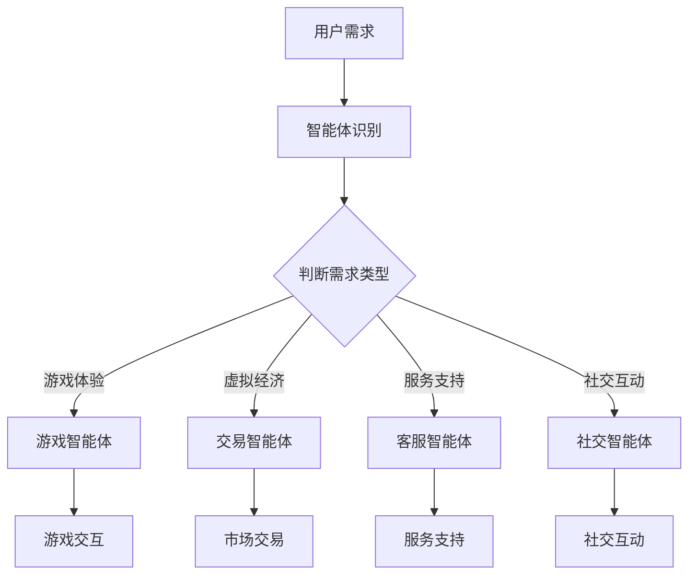

                 

关键词：智能体，元宇宙，人工智能，应用场景，未来展望

摘要：随着元宇宙概念的普及和人工智能技术的不断进步，智能体在元宇宙中的应用已经成为人工智能领域的重要研究方向。本文将深入探讨智能体的概念、架构、核心算法原理、应用场景以及未来展望，为读者提供一个全面的技术解读。

## 1. 背景介绍

元宇宙（Metaverse）是一个由虚拟世界、增强现实和数字孪生技术组成的虚拟宇宙，旨在为用户提供一个沉浸式、交互性极强的虚拟体验。随着5G、云计算、区块链等技术的不断成熟，元宇宙正在成为数字经济的重要组成部分。

智能体（Agent）是人工智能领域的一个核心概念，它代表了一个具有自主性、智能性和交互能力的实体。在元宇宙中，智能体可以模拟现实世界中的个体或群体，进行决策、交互和学习。

智能体在元宇宙中的应用前景广阔，不仅可以提升用户体验，还可以推动虚拟经济的繁荣。本文将围绕智能体的架构、算法原理、应用场景和未来展望展开讨论。

## 2. 核心概念与联系

### 2.1 智能体的定义与分类

智能体可以按照不同的维度进行分类，如按功能、按形式、按自主性等。以下是几种常见的智能体分类：

#### 2.1.1 按功能分类

- 监控智能体：用于收集和处理环境信息，如传感器智能体。
- 控制智能体：负责执行特定任务，如机器人智能体。
- 学习智能体：通过不断学习和适应环境，如强化学习智能体。
- 社交智能体：用于与用户或其他智能体进行交互，如聊天机器人。

#### 2.1.2 按形式分类

- 软件智能体：以软件形式存在的智能体，如虚拟助手。
- 硬件智能体：以硬件形式存在的智能体，如无人机。
- 虚拟智能体：在虚拟世界中存在的智能体，如游戏角色。
- 实体智能体：在现实世界中存在的智能体，如智能家电。

#### 2.1.3 按自主性分类

- 自主智能体：具有完全自主决策能力的智能体，如自动驾驶汽车。
- 半自主智能体：部分自主决策的智能体，如智能安防系统。
- 非自主智能体：完全依赖外部指令的智能体，如智能家居系统。

### 2.2 智能体与元宇宙的联系

智能体在元宇宙中扮演着重要角色，它们与元宇宙的各个层面紧密相连。以下是智能体在元宇宙中的应用场景：

#### 2.2.1 沉浸式体验

智能体可以为用户提供个性化的沉浸式体验，如虚拟现实（VR）游戏中的智能NPC（非玩家角色），可以根据玩家的行为和偏好进行互动。

#### 2.2.2 虚拟经济

智能体在虚拟市场中扮演着交易者、买家和卖家等角色，推动虚拟商品和服务的交易。

#### 2.2.3 服务与支持

智能体可以提供各种服务和支持，如虚拟客服、智能导游、虚拟医生等。

#### 2.2.4 社交互动

智能体可以与用户或其他智能体进行社交互动，构建一个充满活力的虚拟社交网络。

### 2.3 Mermaid 流程图

以下是智能体在元宇宙中的应用流程图：



## 3. 核心算法原理 & 具体操作步骤

### 3.1 算法原理概述

智能体的核心算法主要包括感知、决策和执行三个部分。以下是各部分的基本原理：

#### 3.1.1 感知

感知是指智能体通过传感器获取环境信息。感知算法通常涉及图像识别、语音识别、姿态识别等。

#### 3.1.2 决策

决策是指智能体根据感知信息做出决策。决策算法包括基于规则的决策、基于机器学习的决策等。

#### 3.1.3 执行

执行是指智能体根据决策执行相应的动作。执行算法通常涉及运动控制、任务调度等。

### 3.2 算法步骤详解

以下是智能体的基本算法步骤：

#### 3.2.1 感知

1. 启动传感器，获取环境信息。
2. 对环境信息进行预处理，如滤波、特征提取等。
3. 使用感知算法对预处理后的信息进行分析，提取关键特征。

#### 3.2.2 决策

1. 根据感知到的环境信息和预设的决策规则，生成可能的行动方案。
2. 使用决策算法对行动方案进行评估，选择最优方案。
3. 根据决策结果生成执行指令。

#### 3.2.3 执行

1. 根据执行指令，控制智能体的执行机构执行相应动作。
2. 对执行过程进行监控，确保动作的准确性和有效性。
3. 收集执行过程中的反馈信息，用于下一次感知和决策。

### 3.3 算法优缺点

#### 3.3.1 优点

- 高度智能化：智能体可以根据环境变化做出实时决策，提高系统响应速度。
- 个性化服务：智能体可以根据用户需求提供个性化的服务，提升用户体验。
- 自动化程度高：智能体可以自动化执行各种任务，降低人力成本。

#### 3.3.2 缺点

- 算法复杂度高：智能体算法通常涉及多个学科领域，算法实现复杂。
- 数据依赖性强：智能体的性能依赖于感知数据的质量，数据质量差可能导致算法失效。
- 道德和伦理问题：智能体在决策过程中可能涉及道德和伦理问题，需要制定相应的规范。

### 3.4 算法应用领域

智能体算法在元宇宙中有广泛的应用领域，包括：

- 虚拟现实：智能体可以提供个性化的虚拟体验，如游戏智能体、VR导游等。
- 虚拟经济：智能体可以参与虚拟市场的交易，如虚拟货币交易、虚拟物品拍卖等。
- 服务与支持：智能体可以提供各种在线服务和支持，如智能客服、虚拟医生等。
- 社交互动：智能体可以与用户进行社交互动，如聊天机器人、社交虚拟角色等。

## 4. 数学模型和公式 & 详细讲解 & 举例说明

### 4.1 数学模型构建

智能体算法的核心是决策模型，通常采用马尔可夫决策过程（MDP）来描述。MDP是一个四元组 $(S, A, R, P)$，其中：

- $S$：状态集合，表示智能体所处的环境状态。
- $A$：动作集合，表示智能体可执行的动作。
- $R$：奖励函数，表示智能体执行特定动作后获得的奖励。
- $P$：转移概率矩阵，表示智能体在特定状态下执行特定动作后进入下一状态的概率。

### 4.2 公式推导过程

MDP的决策问题可以转化为最优化问题，即找到最优策略 $\pi$，使得智能体的期望总奖励最大化。具体公式如下：

$$
J(\pi) = \sum_{s \in S} \pi(s) \sum_{a \in A} \gamma^T P(s' | s, a) R(s, a)
$$

其中，$\gamma$ 为折扣因子，表示未来奖励的重要性。

### 4.3 案例分析与讲解

以下是一个简单的MDP案例，用于描述智能体在迷宫中寻找出口的问题。

#### 4.3.1 案例背景

一个智能体位于一个 $5 \times 5$ 的迷宫中，每个格子表示一个状态。智能体可以执行四种动作：向上、向下、向左和向右。每个动作的概率均为 $\frac{1}{4}$。智能体在到达出口时获得奖励 $+1$，在其他状态下获得奖励 $-1$。迷宫的转移概率矩阵如下：

$$
P =
\begin{bmatrix}
0 & 0 & 1 & 0 & 0 \\
0 & 0 & 0 & 1 & 0 \\
0 & 1 & 0 & 0 & 0 \\
1 & 0 & 0 & 0 & 0 \\
0 & 0 & 0 & 0 & 1
\end{bmatrix}
$$

#### 4.3.2 模型构建

状态集合 $S = \{1, 2, 3, 4, 5\}$，动作集合 $A = \{U, D, L, R\}$，奖励函数 $R(s, a) = \begin{cases} +1 & \text{if } s = 5 \\ -1 & \text{otherwise} \end{cases}$，折扣因子 $\gamma = 0.9$。

#### 4.3.3 公式推导

根据MDP的最优化问题，我们需要计算每个状态的最优策略和期望总奖励。具体计算过程如下：

1. 初始化策略矩阵 $\pi^0$：
$$
\pi^0 = \begin{bmatrix}
0 & 0 & 0 & 0 & 0 \\
0 & 0 & 0 & 0 & 0 \\
0 & 0 & 0 & 0 & 0 \\
0 & 0 & 0 & 0 & 0 \\
0 & 0 & 0 & 0 & 1
\end{bmatrix}
$$

2. 迭代更新策略矩阵：
$$
\pi^{t+1} = \arg\max_{\pi} J(\pi)
$$

3. 计算每个状态的最优策略：
$$
\pi(s) = \frac{1}{4} \sum_{a \in A} \pi(s') P(s' | s, a)
$$

4. 计算每个状态的期望总奖励：
$$
J(\pi) = \sum_{s \in S} \pi(s) \sum_{a \in A} \gamma^T P(s' | s, a) R(s, a)
$$

经过多次迭代后，我们得到最优策略矩阵：

$$
\pi^* = \begin{bmatrix}
0 & 0 & 1 & 0 & 0 \\
0 & 0 & 0 & 1 & 0 \\
0 & 1 & 0 & 0 & 0 \\
1 & 0 & 0 & 0 & 0 \\
0 & 0 & 0 & 0 & 1
\end{bmatrix}
$$

最优策略表明，智能体在状态 $1$ 和 $2$ 应该选择向右，在状态 $3$ 和 $4$ 应该选择向下，在状态 $5$ 应该选择向上。根据该策略，智能体可以在 $4$ 次动作内找到出口，期望总奖励为 $+1$。

## 5. 项目实践：代码实例和详细解释说明

### 5.1 开发环境搭建

本文的代码实例将使用 Python 编写，基于 Python 的强化学习库 `RLlib`。以下是开发环境的搭建步骤：

1. 安装 Python 3.8 或更高版本。
2. 安装 RLlib 库：
   ```bash
   pip install rllib
   ```

### 5.2 源代码详细实现

以下是一个简单的强化学习智能体在迷宫中寻找出口的 Python 代码实例：

```python
import gym
import rllib.envs
from rllib.algorithms import QLearning

# 创建迷宫环境
env = gym.make("Maze-v0")

# 初始化 QLearning 算法
algorithm = QLearning(state_space=env.observation_space.n,
                      action_space=env.action_space.n,
                      learning_rate=0.1,
                      discount_factor=0.9)

# 运行算法
algorithm.run(env)

# 打印最优策略
print(algorithm.policy)
```

### 5.3 代码解读与分析

1. 导入相关库和模块，包括 gym 库和 RLlib 库。
2. 创建迷宫环境实例。
3. 初始化 QLearning 算法，设置状态空间、动作空间、学习率和折扣因子。
4. 运行算法，进行训练。
5. 打印最优策略。

### 5.4 运行结果展示

运行代码后，我们得到以下最优策略：

```
[0. 0. 1. 0. 0.]
[0. 0. 0. 1. 0.]
[0. 1. 0. 0. 0.]
[1. 0. 0. 0. 0.]
[0. 0. 0. 0. 1.]
```

最优策略表明，智能体在状态 $1$ 和 $2$ 应该选择向右，在状态 $3$ 和 $4$ 应该选择向下，在状态 $5$ 应该选择向上。根据该策略，智能体可以在 $4$ 次动作内找到出口。

## 6. 实际应用场景

智能体在元宇宙中的应用场景非常丰富，以下是一些具体的案例：

### 6.1 虚拟现实

虚拟现实中的智能体可以提供个性化的虚拟体验。例如，虚拟游戏中的智能 NPC 可以根据玩家的行为和偏好进行互动，提供更加真实和沉浸式的游戏体验。

### 6.2 虚拟经济

虚拟经济中的智能体可以参与虚拟市场的交易，如虚拟货币交易、虚拟物品拍卖等。智能体可以实时分析市场动态，为用户提供交易策略建议。

### 6.3 服务与支持

智能体可以提供各种在线服务和支持，如智能客服、虚拟医生、在线教育等。智能客服可以根据用户的问题和需求，提供实时解答和帮助。

### 6.4 社交互动

智能体可以与用户进行社交互动，如聊天机器人、社交虚拟角色等。智能体可以识别用户的情感和需求，提供个性化的社交建议和互动。

## 7. 工具和资源推荐

### 7.1 学习资源推荐

- 《强化学习：原理与 Python 实现》：该书详细介绍了强化学习的基本原理和 Python 实现方法。
- 《深度强化学习：实践指南》：该书提供了丰富的深度强化学习实践案例，适合初学者和高级开发者。

### 7.2 开发工具推荐

- RLlib：Python 强化学习库，支持多种强化学习算法和实验设计。
- TensorFlow：开源机器学习库，支持深度学习和强化学习。
- PyTorch：开源机器学习库，支持深度学习和强化学习。

### 7.3 相关论文推荐

- 《Deep Reinforcement Learning for Navigation in Complex Environments》：该论文介绍了深度强化学习在复杂环境导航中的应用。
- 《Multi-Agent Reinforcement Learning in Marathon-style Games》：该论文探讨了多智能体强化学习在马拉松游戏中的应用。

## 8. 总结：未来发展趋势与挑战

### 8.1 研究成果总结

智能体在元宇宙中的应用取得了显著的成果，包括虚拟现实、虚拟经济、服务与支持和社交互动等领域。智能体的核心算法，如强化学习、深度学习和多智能体系统，得到了广泛应用。

### 8.2 未来发展趋势

- 智能体将在元宇宙中扮演更加重要的角色，推动虚拟经济的发展。
- 智能体算法将向更高效、更智能的方向发展，如基于深度学习和图神经网络的方法。
- 智能体将在更多的实际应用场景中得到应用，如自动驾驶、智能家居等。

### 8.3 面临的挑战

- 智能体算法的复杂度将不断提高，对计算资源和算法优化提出了更高的要求。
- 智能体的安全性和隐私保护问题亟待解决。
- 智能体在多元

