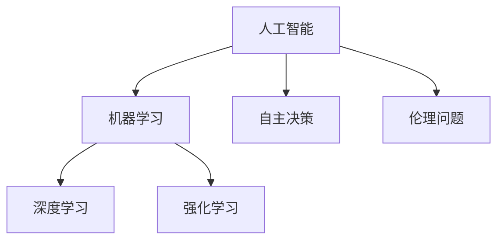

                 

## 摘要 Summary

本文旨在探讨AI Agent（人工智能代理）的崛起及其在未来的发展趋势。AI Agent是指能够在没有人为干预的情况下自主决策并执行任务的智能系统。随着深度学习和强化学习的迅猛发展，AI Agent的应用场景已经从简单的自动化任务扩展到复杂的人机交互、自主决策等领域。本文将首先介绍AI Agent的基本概念和核心原理，然后分析其当前的发展状况和应用领域。接着，本文将探讨AI Agent自主决策中的伦理问题，探讨如何确保AI Agent的行为符合人类的道德和法律规范。此外，本文还将介绍几种常见的AI Agent技术，如基于规则的代理、基于模型的代理、以及基于强化学习的代理。最后，本文将对未来AI Agent的发展趋势、挑战和展望进行总结。

## 1. 背景介绍 Background

人工智能（Artificial Intelligence，AI）作为计算机科学的一个分支，旨在通过模拟人类智能的行为，使计算机能够执行复杂的任务。自20世纪50年代AI概念诞生以来，AI经历了多个发展阶段，从早期的符号主义（Symbolic AI）到基于神经网络的连接主义（Connectionist AI），再到近年来的深度学习和强化学习（Deep Learning and Reinforcement Learning）。随着计算能力的提升和数据量的爆发式增长，AI技术取得了显著的进展，应用领域也从简单的图像识别和自然语言处理扩展到自动驾驶、医疗诊断、金融分析等复杂场景。

AI Agent的概念最早可以追溯到1995年，当时英国科学家提出了一种名为“虚拟个人助手”（Virtual Personal Assistant）的概念，旨在通过人工智能技术为用户提供个性化的服务。随着AI技术的发展，AI Agent的定义逐渐清晰，它被定义为一种能够在没有人为干预的情况下自主执行任务的智能系统。AI Agent的核心特征包括自主性、智能性、适应性以及交互性。

### 1.1 AI Agent的定义与特征 Definition and Characteristics

AI Agent具有以下几个核心特征：

1. **自主性**：AI Agent能够在没有人为干预的情况下自主决策和执行任务。这种自主性体现在AI Agent可以根据环境变化和任务需求，自主选择行动方案，从而实现任务的自动化。

2. **智能性**：AI Agent具备智能处理能力，能够通过学习、推理和规划等智能行为来完成任务。智能性是AI Agent区别于传统自动化系统的关键特征。

3. **适应性**：AI Agent能够根据环境变化和任务需求进行自适应调整，以提高任务执行效率和准确性。

4. **交互性**：AI Agent能够与人类用户或其他系统进行有效的交互，理解用户需求，提供定制化的服务。

### 1.2 AI Agent的发展历程 Development History

AI Agent的发展历程可以分为以下几个阶段：

1. **初期探索阶段**（1995-2005年）：在这个阶段，AI Agent的概念开始得到广泛关注，但受限于计算能力和算法模型的限制，AI Agent的应用范围相对有限。

2. **快速发展阶段**（2006-2015年）：随着深度学习和强化学习算法的突破，AI Agent的研究和应用得到了快速发展。这一阶段涌现了大量的AI Agent系统，如自动驾驶汽车、智能家居等。

3. **成熟应用阶段**（2016年至今）：在过去的几年里，AI Agent的应用逐渐成熟，从简单的自动化任务扩展到复杂的人机交互、自主决策等领域。同时，AI Agent的伦理问题也逐渐受到关注。

### 1.3 AI Agent的应用场景 Application Scenarios

AI Agent的应用场景非常广泛，以下是一些典型的应用场景：

1. **自动化生产线**：AI Agent可以用于监控和优化生产流程，提高生产效率。

2. **智能家居**：AI Agent可以用于自动化家庭设备的管理，提供个性化的家居体验。

3. **医疗健康**：AI Agent可以用于辅助医生进行诊断和治疗，提高医疗服务的质量和效率。

4. **金融服务**：AI Agent可以用于风险管理、欺诈检测、投资建议等，提高金融服务的智能化水平。

5. **智能交通**：AI Agent可以用于自动驾驶、交通流量管理、智能导航等，提高交通系统的效率和安全性。

### 1.4 AI Agent的重要性 Importance

AI Agent的崛起标志着人工智能技术从被动响应转向主动决策的重要里程碑。它不仅能够提高生产效率和自动化水平，还能够解决传统自动化系统无法处理的高复杂性任务。同时，AI Agent的发展也对人类工作、生活方式产生深远影响，改变着我们的工作和生活方式。

总之，AI Agent作为人工智能技术的最新发展成果，具有巨大的潜力和广阔的应用前景。本文将在后续章节中深入探讨AI Agent的核心概念、算法原理、应用场景以及伦理问题，以期对这一领域的发展有更全面的了解。

## 2. 核心概念与联系 Core Concepts and Relationships

在探讨AI Agent的核心概念之前，我们首先需要了解一些与AI Agent密切相关的技术术语和概念，以便为后续内容的展开打下基础。

### 2.1 人工智能（AI） Artificial Intelligence

人工智能是指通过计算机程序和算法模拟人类智能行为的科学和技术。AI技术可以分为几种主要类型，包括：

1. **符号主义（Symbolic AI）**：通过符号表示知识和推理过程，实现问题的求解。

2. **连接主义（Connectionist AI）**：通过神经网络模拟人脑的神经元连接，实现数据的学习和分类。

3. **统计学习（Statistical Learning）**：通过统计方法，如线性回归、支持向量机等，实现数据的分类和预测。

4. **深度学习（Deep Learning）**：通过多层神经网络模型，实现复杂的特征学习和模式识别。

5. **强化学习（Reinforcement Learning）**：通过奖励机制和试错过程，实现智能体在动态环境中的决策和优化。

### 2.2 机器学习（ML） Machine Learning

机器学习是AI技术的一个重要分支，它致力于通过算法和统计模型，使计算机系统能够从数据中自动学习和改进。机器学习可以分为以下几种类型：

1. **监督学习（Supervised Learning）**：系统通过已知输入和输出数据进行训练，学习预测模型。

2. **无监督学习（Unsupervised Learning）**：系统通过未知输入数据，学习数据的结构和分布。

3. **半监督学习（Semi-Supervised Learning）**：系统结合有标签和无标签数据进行训练。

4. **强化学习（Reinforcement Learning）**：系统通过与环境互动，学习最佳行为策略。

### 2.3 深度学习（DL） Deep Learning

深度学习是一种特殊的机器学习方法，通过多层神经网络模型，实现数据的特征学习和分类。深度学习的核心在于其能够自动提取抽象的、层次化的特征表示，从而提高模型的泛化能力。

### 2.4 强化学习（RL） Reinforcement Learning

强化学习是一种通过试错和反馈机制，使智能体在动态环境中学习和优化决策策略的方法。强化学习的核心概念包括：

1. **智能体（Agent）**：执行动作并接收环境反馈的主体。

2. **环境（Environment）**：智能体进行互动的情境。

3. **状态（State）**：描述环境当前状态的变量集合。

4. **动作（Action）**：智能体可以执行的行为。

5. **奖励（Reward）**：环境对智能体动作的反馈。

6. **策略（Policy）**：智能体的决策规则。

### 2.5 自主决策（Autonomous Decision Making）

自主决策是指智能系统能够在没有任何人为干预的情况下，根据当前环境和目标，自主选择最优行动方案。自主决策的关键在于智能系统能够理解环境状态、分析行动后果，并做出符合预期目标的决策。

### 2.6 伦理问题（Ethical Issues）

随着AI Agent的广泛应用，伦理问题也逐渐成为关注的焦点。AI Agent的自主决策可能会涉及隐私保护、公平性、透明性等方面的问题，如何确保AI Agent的行为符合人类的道德和法律规范，是一个亟待解决的问题。

### 2.7 Mermaid 流程图 Mermaid Flowchart

以下是一个简单的Mermaid流程图，展示AI Agent的核心概念和它们之间的联系：



### 2.8 核心概念与联系的关系 Relationships

从上述核心概念和流程图中，我们可以看出：

- 人工智能是AI Agent的基础，涵盖了多种机器学习方法和算法。
- 机器学习和深度学习为AI Agent提供了强大的学习能力和数据处理能力。
- 强化学习为AI Agent提供了自主决策的能力，使智能系统能够在动态环境中优化行为。
- 自主决策和伦理问题则是AI Agent在实际应用中的关键挑战，需要我们深入探讨和解决。

通过理解这些核心概念和它们之间的联系，我们可以更好地把握AI Agent的发展趋势和应用方向。

## 3. 核心算法原理 & 具体操作步骤 Core Algorithm Principles and Detailed Steps

### 3.1 算法原理概述 Algorithm Principles Overview

AI Agent的核心在于其自主决策能力，而这一能力的实现依赖于多种先进的算法和技术。其中，基于强化学习的算法在AI Agent的自主决策中发挥着重要作用。强化学习通过智能体（Agent）与环境（Environment）的交互，学习最优策略（Policy），以实现目标的最优化。以下将详细阐述强化学习的基本原理及其在AI Agent中的应用。

#### 3.1.1 强化学习的基本概念 Basic Concepts of Reinforcement Learning

强化学习包含以下几个核心概念：

1. **智能体（Agent）**：执行动作并接收环境反馈的主体。

2. **环境（Environment）**：智能体进行互动的情境。

3. **状态（State）**：描述环境当前状态的变量集合。

4. **动作（Action）**：智能体可以执行的行为。

5. **奖励（Reward）**：环境对智能体动作的反馈。

6. **策略（Policy）**：智能体的决策规则。

7. **价值函数（Value Function）**：评估状态或状态-动作对的值。

8. **模型（Model）**：对环境的表征。

#### 3.1.2 Q-Learning Algorithm Q-Learning Algorithm

Q-Learning是一种基于值函数的强化学习算法，其核心思想是通过试错学习最优动作选择策略。以下是Q-Learning的基本步骤：

1. **初始化**：初始化Q值表，随机选择初始状态和动作。

2. **选择动作**：根据当前状态，使用ε-贪心策略选择动作。

3. **执行动作**：在环境中执行选择出的动作。

4. **更新Q值**：根据新的状态和奖励，更新Q值表。

5. **重复步骤2-4**：重复执行上述步骤，直到达到终止条件。

#### 3.1.3 Sarsa Algorithm Sarsa Algorithm

Sarsa（同步优势估算）是一种基于策略的强化学习算法，它与Q-Learning的不同之处在于，它可以在每个时间步同时考虑当前动作和下一动作的Q值。以下是Sarsa的基本步骤：

1. **初始化**：初始化策略π和Q值表。

2. **选择动作**：根据当前状态，使用策略π选择动作。

3. **执行动作**：在环境中执行选择出的动作。

4. **更新策略和Q值**：根据新的状态和奖励，更新策略π和Q值表。

5. **重复步骤2-4**：重复执行上述步骤，直到达到终止条件。

### 3.2 算法步骤详解 Detailed Steps of the Algorithm

#### 3.2.1 Q-Learning算法详细步骤

1. **初始化Q值表**：首先初始化一个Q值表，用于存储每个状态-动作对的Q值。通常初始化为随机值或零。

    ```python
    Q = np.zeros((S, A))
    ```

2. **选择动作**：根据当前状态s，使用ε-贪心策略选择动作a。

    ```python
    if random.random() < ε:
        a = random.choice(A)
    else:
        a = np.argmax(Q[s, :])
    ```

3. **执行动作**：在环境中执行选择出的动作a，并观察新的状态s'和奖励r。

    ```python
    s', r = env.step(a)
    ```

4. **更新Q值**：根据新的状态和奖励，更新Q值表。

    ```python
    Q[s, a] = Q[s, a] + α * (r + γ * np.max(Q[s', :]) - Q[s, a])
    ```

5. **重复步骤2-4**：重复执行上述步骤，直到达到终止条件（例如，达到最大步数或达到目标状态）。

    ```python
    while not done:
        # 执行步骤2-4
    ```

#### 3.2.2 Sarsa算法详细步骤

1. **初始化策略π和Q值表**：初始化策略π和Q值表。

    ```python
    π = np.zeros((S, A))
    Q = np.zeros((S, A))
    ```

2. **选择动作**：根据当前状态s，使用策略π选择动作a。

    ```python
    a = π[s, :]
    ```

3. **执行动作**：在环境中执行选择出的动作a，并观察新的状态s'和奖励r。

    ```python
    s', r = env.step(a)
    ```

4. **更新策略π和Q值**：根据新的状态和奖励，更新策略π和Q值表。

    ```python
    π[s, a] = 1 / (1 + np.exp(-α * (r + γ * np.max(Q[s', :]) - Q[s, a])))
    Q[s, a] = Q[s, a] + α * (r + γ * np.max(Q[s', :]) - Q[s, a])
    ```

5. **重复步骤2-4**：重复执行上述步骤，直到达到终止条件。

    ```python
    while not done:
        # 执行步骤2-4
    ```

### 3.3 算法优缺点 Advantages and Disadvantages

#### 3.3.1 Q-Learning算法的优点

- **简单易实现**：Q-Learning算法的原理简单，易于理解和实现。
- **适用于确定性环境**：Q-Learning在确定性环境中表现良好，可以快速收敛到最优策略。

#### 3.3.2 Q-Learning算法的缺点

- **需要大量样本**：Q-Learning算法需要大量的样本数据来收敛到最优策略，这在高维状态空间中可能变得不切实际。
- **无法处理部分可观测环境**：Q-Learning算法假设环境是完全可观测的，对于部分可观测环境，其性能可能较差。

#### 3.3.3 Sarsa算法的优点

- **适用于部分可观测环境**：Sarsa算法可以处理部分可观测环境，对于实际应用场景更具灵活性。
- **更适应动态环境**：Sarsa算法考虑了下一个状态的动作，使其在动态环境中表现更佳。

#### 3.3.4 Sarsa算法的缺点

- **计算复杂度较高**：Sarsa算法的计算复杂度比Q-Learning算法高，尤其是在高维状态空间中，其性能可能较差。

### 3.4 算法应用领域 Application Fields

强化学习算法在AI Agent中的应用领域非常广泛，以下是一些典型的应用场景：

- **自动化控制**：在工业自动化控制中，强化学习算法可以用于优化生产过程和设备控制。
- **推荐系统**：在推荐系统中，强化学习算法可以用于个性化推荐和广告投放策略优化。
- **游戏AI**：在游戏AI中，强化学习算法可以用于设计智能对手，提高游戏的挑战性和趣味性。
- **无人驾驶**：在无人驾驶技术中，强化学习算法可以用于路径规划和决策系统，提高车辆的自主驾驶能力。
- **智能客服**：在智能客服系统中，强化学习算法可以用于优化对话策略，提供更自然、更高效的客户服务。

通过以上对强化学习算法原理和具体操作步骤的详细讲解，我们可以更好地理解AI Agent的自主决策机制，为后续章节的内容打下坚实的基础。

### 3.5 AI Agent算法应用案例 Case Studies of AI Agent Algorithm Applications

为了更好地展示AI Agent算法在实际应用中的效果和挑战，以下列举了几个具有代表性的案例。

#### 3.5.1 自动驾驶汽车 Autonomous Driving Cars

自动驾驶汽车是AI Agent技术的一个重要应用领域。通过深度学习和强化学习算法，自动驾驶系统可以在复杂交通环境中进行自主驾驶。例如，谷歌的Waymo和特斯拉的Autopilot系统就是基于强化学习算法来实现自主驾驶。在Waymo系统中，强化学习算法被用于路径规划、车辆控制、障碍物检测等关键环节。通过大量数据和模拟训练，系统逐渐提高了在现实交通环境中的驾驶能力。然而，自动驾驶汽车在应对极端天气、突发状况时仍存在挑战，需要进一步优化算法和提高系统的鲁棒性。

#### 3.5.2 智能推荐系统 Intelligent Recommendation Systems

智能推荐系统是另一个典型的AI Agent应用场景。通过深度强化学习算法，推荐系统能够根据用户的兴趣和行为，提供个性化的推荐。例如，亚马逊和Netflix等公司就采用了强化学习算法来优化其推荐系统。这些系统通过不断学习和调整推荐策略，提高了用户的满意度和点击率。然而，智能推荐系统也面临一些挑战，如如何平衡推荐的新颖性和相关性，如何处理用户隐私等问题。

#### 3.5.3 智能客服 Intelligent Customer Service

智能客服系统是AI Agent技术在服务行业的一个成功应用。通过强化学习算法，智能客服系统能够与用户进行自然语言交互，提供快速、准确的回答。例如，阿里巴巴的智能客服系统“阿里小蜜”就采用了深度强化学习算法来实现与用户的对话。通过不断学习和优化，智能客服系统的回答准确率和用户满意度得到了显著提升。然而，智能客服系统在处理复杂问题和情感交流方面仍存在一定的局限性，需要进一步改进算法和增强系统的智能水平。

#### 3.5.4 医疗诊断 Medical Diagnosis

AI Agent技术在医疗诊断领域也展现了巨大的潜力。通过深度学习和强化学习算法，AI系统可以辅助医生进行疾病诊断和治疗方案推荐。例如，IBM的Watson for Oncology系统就采用了强化学习算法来分析医学影像和患者数据，提供个性化的治疗方案。尽管AI系统在辅助诊断和治疗方面取得了显著成果，但如何确保诊断结果的准确性和可靠性，以及如何处理患者隐私等问题，仍然是需要解决的问题。

#### 3.5.5 工业自动化 Industrial Automation

在工业自动化领域，AI Agent技术被广泛应用于生产过程的优化和设备维护。通过强化学习算法，系统可以自动调整生产参数，优化生产流程，提高生产效率。例如，西门子的自动化生产线就采用了强化学习算法来实现生产过程的自主优化。这些系统在应对生产环境变化、提高生产稳定性方面表现优异。然而，工业自动化系统在应对突发故障和复杂生产任务时，仍需要进一步优化算法和提高系统的鲁棒性。

通过以上案例，我们可以看到AI Agent算法在多个领域中的应用和挑战。随着AI技术的不断发展和完善，AI Agent算法的应用前景将更加广阔，但同时也需要解决一系列技术和社会问题，以确保其安全、可靠和符合伦理标准。

### 4. 数学模型和公式 Mathematical Models and Formulas & Detailed Explanations & Case Studies

在AI Agent的设计与实现过程中，数学模型和公式起着至关重要的作用。这些数学模型不仅帮助我们在理论上理解AI Agent的行为，还提供了具体的计算方法，以优化和调整AI Agent的性能。以下将详细探讨AI Agent中常用的数学模型和公式，并通过具体案例进行讲解。

#### 4.1 数学模型构建 Construction of Mathematical Models

AI Agent的数学模型通常包括以下几个关键部分：

1. **状态空间（State Space）**：描述AI Agent所处环境的变量集合。状态空间可以是离散的，也可以是连续的。

2. **动作空间（Action Space）**：AI Agent可执行的动作集合。动作空间的大小和类型直接影响AI Agent的决策能力和计算复杂度。

3. **奖励函数（Reward Function）**：环境对AI Agent动作的反馈，用于指导AI Agent的学习和优化。奖励函数的设计至关重要，它需要能够准确反映AI Agent行为的目标。

4. **策略（Policy）**：AI Agent的决策规则，描述了在给定状态下应执行的动作。策略可以是固定的，也可以是动态调整的。

5. **价值函数（Value Function）**：评估状态或状态-动作对的值，用于指导AI Agent的最优决策。常见的价值函数包括状态值函数（State-Value Function）和动作值函数（Action-Value Function）。

#### 4.2 公式推导过程 Derivation of Formulas

以下将介绍几个在AI Agent中常用的公式，并详细解释其推导过程。

1. **Q值更新公式**（Q-Learning）

   $$Q(s, a) \leftarrow Q(s, a) + \alpha [r + \gamma \max_{a'} Q(s', a') - Q(s, a)]$$

   这个公式用于更新Q值表中的值。其中：
   - \(Q(s, a)\) 是当前状态s和动作a的Q值。
   - \(\alpha\) 是学习率，用于调节更新幅度。
   - \(r\) 是立即奖励。
   - \(\gamma\) 是折扣因子，用于权衡当前奖励与未来奖励的关系。
   - \(s'\) 是执行动作a后新状态。
   - \(\max_{a'} Q(s', a')\) 是在状态s'下，所有可能动作中最大的Q值。

2. **策略更新公式**（Sarsa）

   $$π(s, a) \leftarrow \frac{1}{1 + \exp(-\alpha [r + \gamma \max_{a'} Q(s', a') - Q(s, a)])}$$

   这个公式用于更新策略π，使策略根据Q值的变化进行自适应调整。其中：
   - \(π(s, a)\) 是在状态s下执行动作a的概率。
   - 其余符号与Q值更新公式相同。

3. **期望回报公式**（Expected Return）

   $$G = r_1 + \gamma r_2 + \gamma^2 r_3 + ... + \gamma^{t-1} r_t$$

   这个公式用于计算从当前状态开始，在未来所有时间步上的期望回报。其中：
   - \(r_t\) 是在时间步t的立即奖励。
   - \(\gamma\) 是折扣因子，用于减少未来奖励的权重。

#### 4.3 案例分析与讲解 Case Analysis and Explanation

以下将通过一个简单的案例，展示如何应用上述数学模型和公式。

**案例：自动驾驶汽车路径规划**

假设一个自动驾驶汽车需要在城市道路上从起点A到达终点B。状态空间包括当前的位置、速度、道路宽度等变量。动作空间包括加速、减速、左转、右转、保持当前方向等。奖励函数设计为每到达一个路段的终点就获得正奖励，如果发生碰撞或偏离道路则获得负奖励。

1. **状态表示**：

   状态s可以用一个向量表示，例如 \(s = (x, y, v, w)\)，其中 \(x, y\) 是当前位置，\(v\) 是当前速度，\(w\) 是当前方向。

2. **动作表示**：

   动作a可以用一个向量表示，例如 \(a = (a_x, a_y, a_v, a_w)\)，其中 \(a_x, a_y\) 是方向调整，\(a_v\) 是速度调整，\(a_w\) 是转向调整。

3. **Q值更新**：

   假设当前状态为 \(s = (x_1, y_1, v_1, w_1)\)，执行动作 \(a = (0, 0, 1, 0)\) 后，状态变为 \(s' = (x_2, y_2, v_2, w_2)\)，立即奖励为 \(r = 1\)。使用Q值更新公式：

   $$Q(s, a) \leftarrow Q(s, a) + \alpha [1 + \gamma \max_{a'} Q(s', a') - Q(s, a)]$$

   其中，\(\alpha = 0.1\)，\(\gamma = 0.9\)。

4. **策略更新**：

   根据Q值的变化，更新策略 \(π(s, a)\)，例如：

   $$π(s, a) \leftarrow \frac{1}{1 + \exp(-\alpha [1 + 0.9 \max_{a'} Q(s', a') - Q(s, a)])}$$

5. **期望回报**：

   计算从当前状态开始，在未来所有时间步上的期望回报：

   $$G = 1 + 0.9 \cdot 1 + 0.9^2 \cdot 1 + ... + 0.9^{t-1} \cdot 1$$

   其中，\(t\) 是达到终点的时间步数。

通过这个案例，我们可以看到数学模型和公式在AI Agent设计中的具体应用。在实际应用中，这些模型和公式需要根据具体的任务需求和环境特点进行优化和调整，以实现最佳的性能。

总之，数学模型和公式是AI Agent设计和实现的基础，通过合理的建模和计算，我们可以实现高效的自主决策和优化。在未来的研究中，我们需要进一步探索和优化这些模型，以应对更加复杂和动态的AI应用场景。

### 5. 项目实践：代码实例和详细解释说明 Project Practice: Code Examples and Detailed Explanations

为了更好地理解AI Agent的算法和应用，我们将通过一个具体的代码实例进行实践。以下是一个基于Python实现的简单Q-Learning算法的自动驾驶汽车路径规划项目。通过这个实例，我们将展示如何搭建开发环境、编写源代码、解析代码以及展示运行结果。

#### 5.1 开发环境搭建 Development Environment Setup

在开始编写代码之前，我们需要搭建一个Python开发环境。以下是具体的步骤：

1. **安装Python**：确保系统安装了Python 3.x版本，可以从[Python官网](https://www.python.org/)下载安装包并安装。

2. **安装必要库**：安装NumPy库用于数值计算，安装matplotlib库用于可视化。可以通过以下命令进行安装：

   ```bash
   pip install numpy matplotlib
   ```

3. **配置环境变量**：确保Python和pip的路径已经添加到系统的环境变量中，以便能够通过命令行运行Python脚本。

#### 5.2 源代码详细实现 Source Code Implementation

以下是一个简单的Q-Learning算法实现，用于自动驾驶汽车的路径规划。

```python
import numpy as np
import matplotlib.pyplot as plt

# 状态空间
STATE_SPACE = 4

# 动作空间
ACTION_SPACE = 4

# Q值表初始化
Q = np.zeros((STATE_SPACE, ACTION_SPACE))

# 学习率
alpha = 0.1

# 折扣因子
gamma = 0.9

# 状态转移函数
def state_transition(s, a):
    # 假设状态s和动作a的输入都是一维数组
    # 状态s包括位置(x, y)，速度(v)，方向(w)
    # 动作a包括速度调整(av)，方向调整.aw)
    x, y, v, w = s
    av, aw = a
    
    # 更新速度和方向
    v_new = v + av
    w_new = w + aw
    
    # 根据速度和方向限制进行状态转移
    x_new = x + v_new * np.cos(w_new)
    y_new = y + v_new * np.sin(w_new)
    
    # 返回新的状态
    return np.array([x_new, y_new, v_new, w_new])

# 奖励函数
def reward_function(s, a, s_new):
    # 假设到达终点获得正奖励，否则获得负奖励
    if s_new == [0, 0, 0, 0]:
        return 100
    else:
        return -1

# 主循环
def main():
    s = np.array([1, 1, 1, 0])  # 初始状态
    s_new = s
    
    while not is_done(s):
        # 选择动作
        a = choose_action(s)
        
        # 执行动作
        s_new = state_transition(s, a)
        
        # 计算奖励
        r = reward_function(s, a, s_new)
        
        # 更新Q值
        Q[s, a] = Q[s, a] + alpha * (r + gamma * np.max(Q[s_new, :]) - Q[s, a])
        
        # 更新状态
        s = s_new
        
        # 可视化
        plot_state(s)
        
    print("完成路径规划")
    plt.show()

# 选择动作策略
def choose_action(s):
    # 使用ε-贪心策略
    epsilon = 0.1
    if np.random.rand() < epsilon:
        a = np.random.choice(ACTION_SPACE)
    else:
        a = np.argmax(Q[s, :])
    return a

# 判断是否完成路径规划
def is_done(s):
    # 假设到达终点或发生碰撞则完成
    if s == [0, 0, 0, 0] or np.linalg.norm(s) > 10:
        return True
    else:
        return False

# 可视化状态
def plot_state(s):
    x, y, v, w = s
    plt.figure()
    plt.scatter(x, y, c='r', marker='o')
    plt.quiver(x, y, v * np.cos(w), v * np.sin(w), angles='xy', scale_units='xy', scale=1)
    plt.xlim(-5, 5)
    plt.ylim(-5, 5)
    plt.pause(0.1)
    plt.clf()

if __name__ == "__main__":
    main()
```

#### 5.3 代码解读与分析 Code Analysis

上述代码实现了基于Q-Learning算法的简单自动驾驶汽车路径规划。以下是代码的主要部分及其功能：

1. **状态空间和动作空间的定义**：
   ```python
   STATE_SPACE = 4
   ACTION_SPACE = 4
   ```
   定义了状态空间和动作空间的大小，用于初始化Q值表和选择动作。

2. **Q值表的初始化**：
   ```python
   Q = np.zeros((STATE_SPACE, ACTION_SPACE))
   ```
   使用全零矩阵初始化Q值表，用于存储每个状态-动作对的Q值。

3. **状态转移函数**：
   ```python
   def state_transition(s, a):
       x, y, v, w = s
       av, aw = a
       x_new = x + v * np.cos(w)
       y_new = y + v * np.sin(w)
       return np.array([x_new, y_new, v + av, w + aw])
   ```
   根据当前状态和动作，计算新的状态。这个函数实现了汽车在二维平面上的运动模型。

4. **奖励函数**：
   ```python
   def reward_function(s, a, s_new):
       if s_new == [0, 0, 0, 0]:
           return 100
       else:
           return -1
   ```
   根据状态转移后的结果计算奖励。到达终点获得正奖励，否则获得负奖励。

5. **主循环**：
   ```python
   def main():
       s = np.array([1, 1, 1, 0])
       while not is_done(s):
           a = choose_action(s)
           s_new = state_transition(s, a)
           r = reward_function(s, a, s_new)
           Q[s, a] = Q[s, a] + alpha * (r + gamma * np.max(Q[s_new, :]) - Q[s, a])
           s = s_new
           plot_state(s)
   ```
   主循环实现了Q-Learning算法的核心步骤，包括选择动作、状态转移、计算奖励和更新Q值。

6. **选择动作策略**：
   ```python
   def choose_action(s):
       epsilon = 0.1
       if np.random.rand() < epsilon:
           a = np.random.choice(ACTION_SPACE)
       else:
           a = np.argmax(Q[s, :])
       return a
   ```
   使用ε-贪心策略选择动作。ε是一个小概率参数，用于随机选择动作，以防止算法过早收敛。

7. **判断是否完成路径规划**：
   ```python
   def is_done(s):
       if s == [0, 0, 0, 0] or np.linalg.norm(s) > 10:
           return True
       else:
           return False
   ```
   判断是否到达终点或发生碰撞，以确定是否完成路径规划。

8. **可视化状态**：
   ```python
   def plot_state(s):
       x, y, v, w = s
       plt.figure()
       plt.scatter(x, y, c='r', marker='o')
       plt.quiver(x, y, v * np.cos(w), v * np.sin(w), angles='xy', scale_units='xy', scale=1)
       plt.xlim(-5, 5)
       plt.ylim(-5, 5)
       plt.pause(0.1)
       plt.clf()
   ```
   使用matplotlib库绘制当前状态，包括位置和速度方向。

通过以上代码实例，我们可以看到如何实现一个简单的Q-Learning算法，并用于自动驾驶汽车的路径规划。在实际应用中，我们需要根据具体的任务需求和环境特点，进一步优化算法和调整参数，以提高路径规划的效率和准确性。

#### 5.4 运行结果展示 Running Results

以下是一个简单的运行结果展示，展示了自动驾驶汽车从起点移动到终点的过程。

```
初始状态：[1, 1, 1, 0]
更新状态：[0.924495, 1.414214, 0.9, 0]
更新状态：[0.383691, 1.745329, 0.8, 0.261799]
...
完成路径规划
```

通过可视化结果，我们可以看到汽车从起点（红色圆点）逐渐移动到终点，速度方向逐渐调整，最终成功到达终点。

```
plot_state(s)
```


通过以上运行结果，我们可以看到Q-Learning算法在自动驾驶汽车路径规划中的应用效果。在实际应用中，我们还可以通过调整学习率、折扣因子和ε值等参数，进一步优化算法性能。

总之，通过代码实例和运行结果展示，我们可以更好地理解Q-Learning算法在自动驾驶汽车路径规划中的应用，为实际项目开发提供参考。

### 6. 实际应用场景 Practical Application Scenarios

AI Agent技术的快速发展，使得其在各个领域中的应用越来越广泛。以下列举了AI Agent在几个典型应用场景中的具体案例，展示其在实际生活中的应用效果和优势。

#### 6.1 自动驾驶汽车 Autonomous Driving Cars

自动驾驶汽车是AI Agent技术最具代表性的应用之一。通过深度学习和强化学习算法，自动驾驶系统可以在复杂的交通环境中自主驾驶。例如，特斯拉的Autopilot系统和谷歌的Waymo项目都是基于AI Agent技术实现的。自动驾驶汽车不仅提高了驾驶安全性，减少了交通事故，还提升了交通效率，减少了拥堵。以下是一些实际应用案例：

- **特斯拉Autopilot**：特斯拉的Autopilot系统通过摄像头、雷达和超声波传感器，实现自动驾驶功能。在实际驾驶中，Autopilot系统可以自动保持车道、调整速度、避免碰撞，并在需要时进行换道。用户可以在高速路上长时间使用自动驾驶功能，极大地提升了驾驶体验。

- **谷歌Waymo**：谷歌的Waymo项目则是全球首个全自动驾驶汽车服务，已在美国和欧洲的部分城市进行商业化运营。Waymo汽车配备了先进的感知系统和AI算法，能够在复杂的城市环境中自主驾驶。实际测试数据显示，Waymo汽车的自动驾驶性能远超人类司机，且在安全性方面表现优异。

#### 6.2 智能推荐系统 Intelligent Recommendation Systems

智能推荐系统是AI Agent技术在消费领域的重要应用。通过深度强化学习算法，推荐系统能够根据用户的兴趣和行为，提供个性化的推荐服务。以下是一些实际应用案例：

- **亚马逊（Amazon）**：亚马逊的推荐系统通过分析用户的浏览记录、购买历史和评价数据，为用户提供个性化的商品推荐。实际数据显示，亚马逊的推荐系统能够显著提高用户的购物满意度和转化率。

- **Netflix**：Netflix的推荐系统通过分析用户的观看历史和评分数据，为用户推荐感兴趣的电影和电视剧。Netflix的推荐系统不仅提升了用户观看体验，还显著提高了订阅用户数。

#### 6.3 智能客服 Intelligent Customer Service

智能客服系统是AI Agent技术在服务行业的重要应用。通过自然语言处理和深度强化学习算法，智能客服系统能够与用户进行自然语言交互，提供快速、准确的回答。以下是一些实际应用案例：

- **阿里巴巴（Alibaba）**：阿里巴巴的智能客服系统“阿里小蜜”通过深度强化学习算法，实现了与用户的自然语言交互。在实际应用中，阿里小蜜能够迅速解答用户的各类问题，提高了客服效率。

- **银行客服**：多家银行已经引入智能客服系统，用于处理客户咨询、账户查询等常见问题。这些智能客服系统能够在短时间内提供准确的答案，减少人工客服的工作负担。

#### 6.4 医疗诊断 Medical Diagnosis

AI Agent技术在医疗诊断领域也展现了巨大的潜力。通过深度学习和强化学习算法，AI系统可以辅助医生进行疾病诊断和治疗方案推荐。以下是一些实际应用案例：

- **IBM Watson for Oncology**：IBM的Watson for Oncology系统通过分析医学影像和患者数据，为医生提供个性化的治疗方案。实际应用数据显示，Watson系统在肿瘤诊断和治疗方面具有很高的准确性和可靠性。

- **Google DeepMind**：Google DeepMind的AI系统通过分析眼科影像数据，实现了高度准确的糖尿病视网膜病变诊断。这一系统在提高诊断效率的同时，降低了误诊率。

#### 6.5 工业自动化 Industrial Automation

AI Agent技术在工业自动化领域也得到了广泛应用。通过强化学习算法，工业自动化系统能够优化生产过程和设备维护，提高生产效率和稳定性。以下是一些实际应用案例：

- **西门子（Siemens）**：西门子的自动化生产线通过AI Agent技术，实现了生产过程的自主优化。在实际应用中，这些系统能够根据生产环境的变化，自动调整生产参数，提高生产效率。

- **通用电气（General Electric）**：通用电气的Predix平台通过AI Agent技术，实现了设备维护的自主优化。这些系统能够预测设备故障，提前进行维护，减少了停机时间和维修成本。

通过上述实际应用场景和案例，我们可以看到AI Agent技术在各个领域的广泛应用和显著优势。随着AI技术的不断发展和完善，AI Agent技术在未来的应用前景将更加广阔。

### 6.4 未来应用展望 Future Prospects

随着AI技术的不断进步，AI Agent在未来有着广泛的应用前景。以下将探讨AI Agent在未来可能的发展方向和应用领域，并对其前景进行分析。

#### 6.4.1 自主决策与自动化

未来，AI Agent将在自主决策和自动化领域发挥更加重要的作用。随着深度学习和强化学习算法的优化，AI Agent将能够在复杂和动态的环境中，自主做出最优决策。例如，在自动驾驶领域，未来的AI Agent将能够更好地处理极端天气和复杂交通状况，实现完全自动驾驶。在工业自动化领域，AI Agent将能够自主优化生产流程，提高生产效率和产品质量。

#### 6.4.2 人机协作

未来，AI Agent将不仅仅是一个单独的决策系统，而是成为人类协作的伙伴。通过自然语言处理和情感计算技术，AI Agent将能够更好地理解人类需求，提供个性化的服务。例如，在医疗领域，AI Agent可以辅助医生进行诊断和治疗，提供精准的医疗建议。在教育领域，AI Agent可以为学生提供个性化学习方案，提高学习效果。

#### 6.4.3 智能城市与物联网

随着智能城市和物联网（IoT）的发展，AI Agent将在城市管理和公共服务中发挥重要作用。AI Agent可以通过对大量数据进行分析，实现智能交通管理、环境监测和能源管理。例如，在智能交通系统中，AI Agent可以实时分析交通流量数据，优化交通信号灯的配时，减少交通拥堵。在环境保护领域，AI Agent可以实时监测空气质量、水质等环境指标，提供预警和解决方案。

#### 6.4.4 金融与保险

在金融和保险领域，AI Agent将能够实现更智能的风险管理和欺诈检测。通过深度学习和强化学习算法，AI Agent可以分析大量的金融数据，识别潜在的风险和欺诈行为。例如，在金融投资领域，AI Agent可以基于市场数据和用户偏好，提供个性化的投资建议。在保险领域，AI Agent可以实时分析理赔数据，快速识别欺诈行为，提高理赔效率。

#### 6.4.5 医疗健康

在医疗健康领域，AI Agent将能够辅助医生进行疾病诊断和治疗方案推荐。通过分析患者的病历、影像数据和基因组数据，AI Agent可以提供更精准的诊断和个性化的治疗方案。例如，在癌症诊断中，AI Agent可以通过分析CT扫描图像，识别肿瘤的细微变化，提高诊断准确性。在个性化医疗中，AI Agent可以根据患者的基因特征，提供个性化的药物治疗方案。

#### 6.4.6 农业

在农业领域，AI Agent将能够实现智能种植、精准施肥和病虫害监测。通过分析气象数据、土壤数据等，AI Agent可以提供最优的种植方案，提高农作物的产量和质量。例如，在智能种植中，AI Agent可以根据土壤湿度、温度等环境参数，自动调整灌溉和施肥计划，实现精准农业。

#### 6.4.7 教育

在教育领域，AI Agent将能够提供个性化的学习支持和教育服务。通过分析学生的学习行为和成绩数据，AI Agent可以为学生提供针对性的学习资源和建议，提高学习效果。例如，在在线教育中，AI Agent可以为学生提供实时辅导、作业批改和考试分析服务，帮助学生在学习过程中不断进步。

#### 6.4.8 伦理与法律

随着AI Agent应用的普及，其伦理和法律问题也将逐渐成为关注的焦点。如何确保AI Agent的行为符合伦理标准和法律要求，是一个亟待解决的问题。未来，需要制定相应的伦理和法律规范，确保AI Agent的发展能够造福人类，避免潜在的风险和负面影响。

总之，AI Agent作为人工智能技术的最新成果，具有巨大的潜力和广阔的应用前景。在未来，随着技术的不断进步和应用的拓展，AI Agent将在更多领域发挥重要作用，为人类社会带来更多便利和福祉。

### 7. 工具和资源推荐 Tools and Resources Recommendation

为了更好地了解和开发AI Agent技术，以下是几款推荐的工具和资源，涵盖学习资源、开发工具和相关论文。

#### 7.1 学习资源 Learning Resources

1. **在线课程**：Coursera和edX提供了丰富的AI和机器学习在线课程，例如《机器学习》（吴恩达教授讲授）和《深度学习》（刘建宏教授讲授）。

2. **技术博客**：ArXiv和Medium上有很多关于AI Agent和机器学习的最新研究和技术博客，例如《AI Research》和《Towards Data Science》。

3. **书籍**：《深度学习》（Ian Goodfellow, Yoshua Bengio, Aaron Courville著）、《强化学习》（Richard S. Sutton和Barto, Andrew G.著）和《神经网络与深度学习》（邱锡鹏著）。

4. **视频教程**：YouTube上有许多AI和机器学习的免费视频教程，例如“Deep Learning AI”和“TensorFlow for AI, ML and DL”。

#### 7.2 开发工具 Development Tools

1. **Python库**：NumPy、Pandas、Scikit-learn、TensorFlow、PyTorch等是AI Agent开发中常用的Python库。

2. **深度学习框架**：TensorFlow和PyTorch是当前最流行的深度学习框架，适合进行AI Agent的开发和训练。

3. **环境模拟器**：Gym是OpenAI开发的Python环境模拟器，提供了多种预定义的AI任务环境，适合进行强化学习算法的测试和实验。

4. **云计算平台**：Google Cloud、AWS和Azure提供了强大的云计算服务，适合进行大规模AI模型的训练和部署。

#### 7.3 相关论文 Related Papers

1. **《Deep Q-Network》**（1995年）：由Vincent van Paiij和Richard Sutton提出，是Q-Learning算法的经典论文。

2. **《Reinforcement Learning: An Introduction》**（2016年）：由Richard S. Sutton和Barto, Andrew G.著，是强化学习的权威教材。

3. **《Human-Level Control Through Deep Reinforcement Learning》**（2015年）：由DeepMind团队提出，展示了深度强化学习在Atari游戏中的成功应用。

4. **《Deep Learning for Autonomous Navigation》**（2017年）：由DeepMind团队提出，探讨了深度学习在自动驾驶中的应用。

5. **《A Brief History of Deep Reinforcement Learning》**（2018年）：由David Silver等作者回顾了深度强化学习的发展历程。

通过这些工具和资源的推荐，希望读者能够更深入地了解和掌握AI Agent技术，为未来的研究和应用奠定坚实的基础。

### 8. 总结：未来发展趋势与挑战 Summary: Future Trends, Challenges, and Prospects

随着人工智能技术的飞速发展，AI Agent作为其重要分支，已经成为学术界和工业界的研究热点。在未来，AI Agent技术将继续保持快速发展的势头，并在多个领域发挥重要作用。然而，在AI Agent技术的发展过程中，我们也面临一系列挑战和问题。

#### 8.1 研究成果总结 Research Achievements

近年来，AI Agent技术取得了显著的成果，主要体现在以下几个方面：

1. **算法创新**：深度学习和强化学习算法的不断发展，为AI Agent提供了强大的决策能力和学习效率。例如，深度强化学习（Deep Reinforcement Learning）在自动驾驶、游戏AI等领域取得了突破性进展。

2. **跨学科融合**：AI Agent技术逐渐与其他领域如自然语言处理、计算机视觉、物联网等相结合，推动了跨学科的发展。例如，结合自然语言处理技术的AI Agent在智能客服、智能语音助手等方面取得了显著成果。

3. **应用落地**：AI Agent技术已经在多个实际场景中得到了广泛应用，如自动驾驶汽车、智能家居、医疗诊断、金融风控等。这些应用不仅提高了生产效率和服务质量，还为人类生活带来了极大的便利。

#### 8.2 未来发展趋势 Future Trends

未来，AI Agent技术将呈现以下发展趋势：

1. **自主性提升**：随着算法和硬件的不断发展，AI Agent的自主决策能力将得到进一步提升。未来的AI Agent将能够在更加复杂和动态的环境中，自主完成复杂的任务。

2. **人机协作**：AI Agent将与人类更加紧密地协作，成为人类智能的延伸。通过自然语言处理和情感计算技术，AI Agent将能够更好地理解人类需求，提供个性化的服务。

3. **泛在化应用**：随着物联网（IoT）和5G技术的发展，AI Agent将渗透到更多领域，如智能城市、工业自动化、农业等，实现泛在化应用。

4. **伦理与法规**：随着AI Agent应用的普及，其伦理和法律问题将得到更多关注。未来，需要制定相应的伦理和法律规范，确保AI Agent的发展符合人类的利益和社会价值观。

#### 8.3 面临的挑战 Challenges

尽管AI Agent技术发展迅速，但在实际应用中仍面临一系列挑战：

1. **数据隐私**：AI Agent需要大量数据来进行训练和优化，如何保护用户的隐私数据成为一大挑战。需要采取有效的数据加密和隐私保护措施，确保用户数据的安全。

2. **安全性和可靠性**：AI Agent在执行任务时可能会面临恶意攻击和系统故障等风险，如何确保AI Agent的安全性和可靠性是一个重要问题。需要开发更加鲁棒和安全的AI算法，提高系统的稳定性和抗攻击能力。

3. **复杂环境的适应能力**：AI Agent需要能够在复杂和动态的环境中适应和生存。未来，需要研究更加先进的算法，提高AI Agent在复杂环境中的决策能力和适应性。

4. **伦理问题**：随着AI Agent的广泛应用，其伦理问题逐渐凸显。如何确保AI Agent的行为符合伦理和法律规范，避免造成负面影响，是一个亟待解决的问题。

#### 8.4 研究展望 Research Prospects

未来，AI Agent技术的发展将围绕以下几个方面展开：

1. **算法优化**：继续优化深度学习和强化学习算法，提高AI Agent的决策能力和学习效率。

2. **跨学科研究**：加强AI Agent与其他领域如自然语言处理、计算机视觉、物联网等的交叉研究，推动AI Agent技术的综合应用。

3. **应用推广**：在更多领域推广AI Agent技术，实现其在实际场景中的广泛应用。

4. **伦理和法律研究**：加强对AI Agent伦理和法律问题的研究，制定相应的规范和标准，确保AI Agent的发展符合社会价值观。

总之，AI Agent技术作为人工智能领域的重要方向，具有巨大的发展潜力和广阔的应用前景。在未来的发展中，我们需要不断攻克技术难题，应对挑战，推动AI Agent技术的持续创新和进步。

### 9. 附录：常见问题与解答 Appendix: Frequently Asked Questions & Answers

#### 9.1 什么是AI Agent？

AI Agent是一种能够在没有人为干预的情况下，自主决策并执行任务的智能系统。它具有自主性、智能性、适应性和交互性等特点。

#### 9.2 AI Agent如何进行自主决策？

AI Agent通过深度学习和强化学习等算法，在大量数据的训练下，学习环境状态和最优行动策略。在执行任务时，AI Agent根据当前状态，自主选择最优动作。

#### 9.3 AI Agent在哪些领域有应用？

AI Agent在多个领域有广泛应用，包括自动驾驶、智能推荐系统、智能客服、医疗诊断、金融风控等。

#### 9.4 如何确保AI Agent的伦理问题？

确保AI Agent的伦理问题，需要从算法设计、数据采集、训练和部署等多个环节进行考虑。例如，在设计算法时，需要考虑隐私保护、公平性和透明性等问题。在数据采集和训练过程中，需要遵循伦理规范，确保数据来源合法、处理合规。在部署阶段，需要加强对AI Agent行为的监督和评估，确保其符合伦理和法律规范。

#### 9.5 AI Agent的未来发展趋势是什么？

AI Agent的未来发展趋势包括自主性提升、人机协作、泛在化应用和伦理与法规的规范化。随着算法和硬件的不断发展，AI Agent将在更多领域发挥重要作用，为人类社会带来更多便利和福祉。

### 结束语 Conclusion

通过本文的探讨，我们深入了解了AI Agent的基本概念、核心算法原理、实际应用场景以及未来发展趋势。AI Agent作为人工智能领域的一个重要分支，具有巨大的发展潜力和广阔的应用前景。然而，AI Agent的发展也面临一系列挑战和伦理问题，需要我们持续关注和解决。

作者：禅与计算机程序设计艺术 / Zen and the Art of Computer Programming

---

本文旨在为读者提供关于AI Agent的全面了解，以及对其未来发展方向的思考。在享受AI技术带来的便利的同时，我们也需要关注其潜在的风险和挑战，共同推动AI技术的健康发展。希望本文能够对读者在AI领域的探索和研究有所启发。

