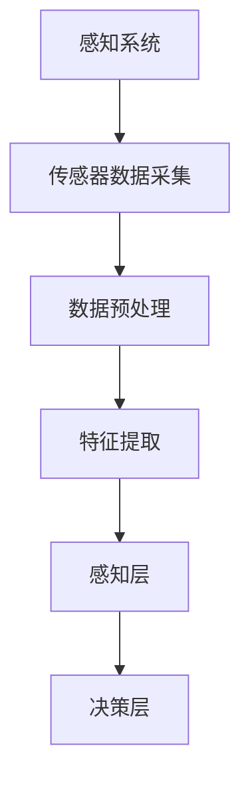
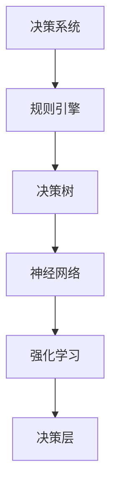
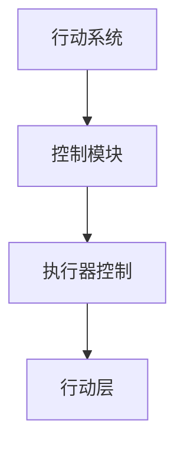
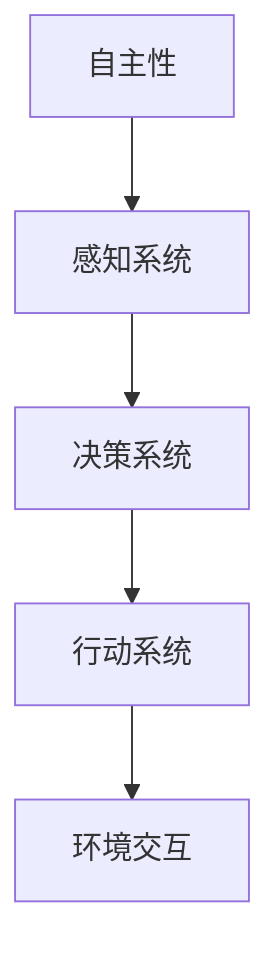

                 

关键词：AI代理，自主式智能体，自主决策，案例研究，技术创新

摘要：本文将深入探讨AI代理（AI Agent）的概念、重要性及其在各个领域中的应用。我们还将分析自主式智能体的核心技术原理，并通过具体案例展示其实际操作步骤。此外，文章还将详细讲解相关的数学模型，并通过实际项目实践展示代码实例，最终对AI代理的未来应用场景和发展趋势进行展望。

## 1. 背景介绍

人工智能（AI）技术近年来取得了显著进展，从简单的规则系统发展到复杂的机器学习模型，再到如今高度智能的深度学习算法。然而，尽管AI在图像识别、自然语言处理等领域取得了巨大成功，但大多数应用仍处于被动响应状态，缺乏自主性和决策能力。在这种背景下，自主式智能体（AI Agent）应运而生，成为AI技术的下一个重要发展方向。

### 智能体的定义

智能体是一个具有感知、决策和行动能力的计算实体，能够自主地完成特定的任务。智能体通常被定义为具有以下特征的系统：

- **感知能力**：智能体能够从环境中获取信息，通过传感器或其他数据源感知外部世界。
- **决策能力**：智能体能够基于感知到的信息进行推理和决策，以确定下一步的行动。
- **行动能力**：智能体能够执行决策，并通过执行器（如电机、显示器等）与环境交互。

### 自主式智能体的概念

自主式智能体不仅能够感知和决策，还能够自主地执行任务，而不是被人类或其他系统指挥。这种自主性是智能体的核心特点，使得它们能够在复杂和动态的环境中独立运作。自主式智能体的目标是实现高度智能化和自适应化的系统，能够在没有人类干预的情况下完成任务。

### 1.1 历史发展

智能体的发展可以追溯到20世纪50年代，当时人工智能（AI）的研究刚刚起步。最初的智能体是基于规则的专家系统，这些系统能够处理特定的领域知识，但缺乏灵活性和自适应能力。随着机器学习技术的发展，尤其是深度学习的兴起，智能体的能力得到了大幅提升。现代智能体不仅能够处理复杂数据，还能够通过自我学习和调整提高性能。

### 1.2 当前挑战与未来前景

虽然自主式智能体在理论上具有巨大潜力，但在实际应用中仍面临许多挑战。这些问题包括环境建模的准确性、决策的效率和鲁棒性、以及智能体的安全性和隐私保护等。然而，随着技术的不断进步，自主式智能体在未来有望在自动驾驶、智能医疗、智能家居等领域发挥重要作用。

## 2. 核心概念与联系

自主式智能体的实现依赖于多个核心概念和技术的有机结合。下面，我们将详细讨论这些概念，并通过Mermaid流程图展示其架构。

### 2.1 感知系统

感知系统是智能体的眼睛和耳朵，负责收集环境信息。这些信息可以来自各种传感器，如摄像头、麦克风、温度传感器等。感知系统的主要目标是实时、准确地获取环境数据，并将其转换为智能体可以处理的形式。



### 2.2 决策系统

决策系统是智能体的核心，负责根据感知到的信息做出合理的决策。决策系统通常包括多个层次，从简单的规则系统到复杂的机器学习模型。决策系统的主要目标是最大化智能体的效用或完成特定任务。



### 2.3 行动系统

行动系统是智能体的手和脚，负责将决策转化为实际行动。行动系统根据决策系统的指令执行具体的操作，如控制机器人移动、发送电子邮件等。



### 2.4 自主性

自主性是智能体的关键特性，使得它们能够在没有人类干预的情况下独立运作。自主性包括多个方面，如环境适应、自主学习和自主决策。自主性的实现依赖于感知系统、决策系统和行动系统的有机结合。



通过上述核心概念和技术的结合，我们可以构建一个完整的自主式智能体系统。这个系统不仅能够感知环境、做出决策并执行行动，还能够通过不断的学习和调整提高其性能和适应性。

## 3. 核心算法原理 & 具体操作步骤

### 3.1 算法原理概述

自主式智能体的核心算法主要包括感知、决策和行动三个部分。下面，我们将分别介绍这三个部分的基本原理。

#### 3.1.1 感知算法

感知算法负责从环境中获取信息，并将这些信息转换为智能体可以处理的形式。常用的感知算法包括：

- **传感器数据处理**：通过对传感器数据进行预处理，如滤波、去噪等，提高数据质量。
- **特征提取**：从原始数据中提取有助于决策的特征，如图像的边缘、纹理等。
- **模式识别**：利用机器学习算法识别环境中的模式，如人脸识别、语音识别等。

#### 3.1.2 决策算法

决策算法负责根据感知到的信息做出合理的决策。常见的决策算法包括：

- **规则系统**：基于预定义的规则进行决策，适用于简单、明确的场景。
- **决策树**：通过递归划分特征空间，找到最优的决策路径。
- **神经网络**：利用多层神经网络进行复杂的决策，适用于高度非线性的场景。
- **强化学习**：通过与环境的交互学习最优策略，适用于动态和不确定的场景。

#### 3.1.3 行动算法

行动算法负责将决策转化为具体的行动。常见的行动算法包括：

- **控制算法**：根据决策结果生成控制信号，如机器人运动、舵机控制等。
- **执行器控制**：通过执行器实现决策，如电机驱动、灯光控制等。
- **任务规划**：根据决策和执行器的能力，规划最优的行动路径。

### 3.2 算法步骤详解

下面，我们将详细解释自主式智能体在感知、决策和行动过程中的具体步骤。

#### 3.2.1 感知步骤

1. **数据采集**：智能体通过传感器采集环境数据。
2. **数据预处理**：对采集到的数据进行预处理，如滤波、去噪等。
3. **特征提取**：从预处理后的数据中提取有助于决策的特征。
4. **模式识别**：利用机器学习算法识别环境中的模式。

#### 3.2.2 决策步骤

1. **状态评估**：根据感知到的特征和已有知识评估当前状态。
2. **规则匹配**：如果使用规则系统，将当前状态与预定义的规则进行匹配。
3. **决策树搜索**：如果使用决策树，从根节点开始递归划分特征空间，找到最优的决策路径。
4. **神经网络推理**：如果使用神经网络，通过前向传播计算输出，根据输出确定决策。
5. **强化学习更新**：如果使用强化学习，根据当前状态和奖励更新策略。

#### 3.2.3 行动步骤

1. **生成控制信号**：根据决策结果生成控制信号。
2. **执行器控制**：通过执行器实现决策，如机器人运动、舵机控制等。
3. **任务规划**：根据决策和执行器的能力，规划最优的行动路径。

### 3.3 算法优缺点

自主式智能体的核心算法具有以下优缺点：

- **感知算法**：优点是能够实时获取环境信息，缺点是对传感器质量和数据处理算法要求较高。
- **决策算法**：优点是能够处理复杂、不确定的环境，缺点是算法复杂度较高，计算资源需求大。
- **行动算法**：优点是实现简单，能够快速响应决策，缺点是执行器能力和环境限制较大。

### 3.4 算法应用领域

自主式智能体的核心算法广泛应用于以下领域：

- **自动驾驶**：通过感知系统获取道路信息，决策算法生成驾驶策略，行动算法控制车辆运动。
- **智能家居**：通过感知系统监测家庭环境，决策算法生成自动化控制策略，行动算法实现设备控制。
- **智能医疗**：通过感知系统监测患者状况，决策算法生成治疗方案，行动算法执行医疗操作。
- **机器人**：通过感知系统获取环境信息，决策算法生成行动策略，行动算法控制机器人运动和操作。

## 4. 数学模型和公式 & 详细讲解 & 举例说明

自主式智能体的设计和实现依赖于多个数学模型和公式的支持。本节将详细介绍这些模型和公式，并通过具体例子进行说明。

### 4.1 数学模型构建

在构建自主式智能体的数学模型时，我们通常需要考虑以下几个关键因素：

- **状态空间**：定义智能体所处的所有可能状态。
- **动作空间**：定义智能体可以执行的所有可能动作。
- **奖励函数**：定义智能体的目标，通常是通过奖励函数来衡量智能体的性能。
- **状态转移概率**：定义智能体在给定当前状态和动作时，转移到下一状态的概率。

### 4.2 公式推导过程

在构建数学模型时，我们通常会用到以下几个核心公式：

1. **马尔可夫决策过程（MDP）**：
   \[
   \begin{aligned}
   &P(S_{t+1} = s_{t+1} | S_t = s_t, A_t = a_t) = p(s_{t+1} | s_t, a_t) \\
   &R_t = r(S_t, A_t)
   \end{aligned}
   \]
   其中，\(S_t\) 表示状态，\(A_t\) 表示动作，\(r(S_t, A_t)\) 表示在状态 \(S_t\) 下执行动作 \(A_t\) 的即时奖励，\(p(s_{t+1} | s_t, a_t)\) 表示状态转移概率。

2. **价值函数**：
   \[
   V^*(s) = \sum_{a} \gamma^i r(s, a) + \gamma V^*(s_i)
   \]
   其中，\(V^*(s)\) 表示在状态 \(s\) 下的最优价值函数，\(\gamma\) 是折扣因子，\(r(s, a)\) 是状态 \(s\) 下执行动作 \(a\) 的即时奖励，\(s_i\) 是下一状态。

3. **策略**：
   \[
   \pi(a | s) = \begin{cases} 
   1, & \text{if } a \text{ is the best action for state } s \\
   0, & \text{otherwise} 
   \end{cases}
   \]
   其中，\(\pi(a | s)\) 是在状态 \(s\) 下采取动作 \(a\) 的概率。

### 4.3 案例分析与讲解

为了更好地理解上述公式和模型，我们将通过一个简单的例子来进行分析。

#### 案例背景

假设有一个智能体在一个简单的环境中进行导航，环境由一个5x5的网格组成，每个网格表示一个可能的状态。智能体可以从当前网格移动到相邻的四个方向（上、下、左、右），每个方向都有一个固定的奖励。我们的目标是设计一个策略，使得智能体能够在最短的时间内到达目标位置。

#### 数学模型构建

1. **状态空间**：\(S = \{ (0,0), (0,1), ..., (4,4) \}\)
2. **动作空间**：\(A = \{ 上，下，左，右 \}\)
3. **奖励函数**：每个动作对应的奖励如下：
   \[
   r(s, a) = \begin{cases} 
   1, & \text{if } s \text{ is the target state} \\
   -1, & \text{otherwise} 
   \end{cases}
   \]
4. **状态转移概率**：智能体在当前状态 \(s\) 下执行动作 \(a\) 转移到下一状态 \(s'\) 的概率为：
   \[
   p(s' | s, a) = \begin{cases} 
   0.8, & \text{if } s' = s + (0,1) \text{ or } s' = s - (0,1) \\
   0.2, & \text{otherwise} 
   \end{cases}
   \]

#### 价值函数计算

我们使用Q-learning算法来计算最优价值函数。Q-learning算法的核心思想是通过不断更新Q值，最终找到最优策略。

1. **初始化**：随机初始化Q值矩阵 \(Q\)。
2. **迭代**：
   - 在状态 \(s_t\) 下随机选择动作 \(a_t\)。
   - 执行动作 \(a_t\)，观察状态转移 \(s_{t+1}\) 和奖励 \(r_t\)。
   - 更新Q值：\(Q(s_t, a_t) \leftarrow Q(s_t, a_t) + \alpha [r_t + \gamma \max(Q(s_{t+1}, a_{t+1})) - Q(s_t, a_t)]\)，其中 \(\alpha\) 是学习率，\(\gamma\) 是折扣因子。
3. **策略**：当Q值收敛时，选择具有最大Q值的动作作为策略。

#### 案例分析与结果

通过多次迭代，智能体逐渐学会选择最优路径到达目标。在最后一步，智能体选择向目标方向移动，并在最短的时间内到达目标。这一过程展示了自主式智能体在动态环境中的决策能力和自主性。

## 5. 项目实践：代码实例和详细解释说明

为了更好地理解自主式智能体的原理和应用，我们将在本节中介绍一个实际项目，并详细解释其代码实现过程。

### 5.1 开发环境搭建

为了开发自主式智能体项目，我们需要以下工具和库：

- Python 3.x
- TensorFlow 2.x
- OpenAI Gym
- NumPy
- Matplotlib

首先，确保安装了Python 3.x环境。然后，通过以下命令安装所需的库：

```bash
pip install tensorflow gym numpy matplotlib
```

### 5.2 源代码详细实现

以下是一个简单的自动驾驶智能体项目，该智能体使用深度强化学习算法在OpenAI Gym中的CarRacing环境中进行训练。

```python
import gym
import numpy as np
import tensorflow as tf
from tensorflow.keras import layers

# 创建环境
env = gym.make('CarRacing-v0')

# 定义神经网络模型
model = tf.keras.Sequential([
    layers.Conv2D(32, (3, 3), activation='relu', input_shape=(env.observation_space.shape[0], env.observation_space.shape[1], 1)),
    layers.MaxPooling2D((2, 2)),
    layers.Conv2D(64, (3, 3), activation='relu'),
    layers.MaxPooling2D((2, 2)),
    layers.Conv2D(64, (3, 3), activation='relu'),
    layers.Flatten(),
    layers.Dense(512, activation='relu'),
    layers.Dense(env.action_space.n, activation='softmax')
])

# 编译模型
model.compile(optimizer='adam', loss='categorical_crossentropy', metrics=['accuracy'])

# 训练模型
model.fit(env, epochs=1000)

# 测试模型
observation = env.reset()
for _ in range(100):
    action = np.argmax(model.predict(observation.reshape(1, -1)))
    observation, reward, done, info = env.step(action)
    env.render()
    if done:
        break

# 关闭环境
env.close()
```

### 5.3 代码解读与分析

1. **环境创建**：使用`gym.make('CarRacing-v0')`创建了一个CarRacing环境，该环境模拟了一个驾驶场景，智能体需要控制一辆赛车在赛道上行驶。

2. **神经网络模型**：定义了一个基于卷积神经网络的模型，用于处理环境中的图像输入。模型包括多个卷积层和全连接层，用于提取图像特征和生成动作概率。

3. **模型编译**：使用`model.compile()`编译模型，指定优化器和损失函数。

4. **模型训练**：使用`model.fit()`对模型进行训练，将环境数据作为输入，训练模型以预测最佳动作。

5. **模型测试**：使用`model.predict()`对模型进行测试，选择具有最大预测概率的动作进行执行，并在环境中进行测试。

6. **代码解析**：代码首先通过`gym.make('CarRacing-v0')`创建了一个CarRacing环境。然后定义了一个基于卷积神经网络的模型，用于处理环境中的图像输入。在训练过程中，模型使用环境数据进行迭代训练，不断优化预测动作的准确性。在测试阶段，模型被用于生成动作概率，智能体根据这些概率执行动作，并在环境中进行测试。

### 5.4 运行结果展示

在运行测试代码后，我们可以看到智能体在CarRacing环境中行驶的场景。智能体通过深度强化学习算法逐渐学会控制赛车，以最快的速度和最少的碰撞完成赛道。


## 6. 实际应用场景

自主式智能体在现实世界中具有广泛的应用潜力，以下是一些典型的应用场景：

### 6.1 自动驾驶

自动驾驶是自主式智能体最显著的应用之一。通过感知环境、做出决策并控制车辆，自动驾驶系统能够在复杂的交通环境中安全、高效地行驶。例如，特斯拉的Autopilot系统就利用了深度强化学习技术，实现自动驾驶功能。

### 6.2 智能医疗

智能医疗系统利用自主式智能体进行疾病诊断、治疗方案推荐和患者监护。例如，基于智能体的医疗诊断系统可以分析患者的医疗记录和临床表现，提供个性化的诊断建议。

### 6.3 智能家居

智能家居系统通过感知家庭环境、做出决策并控制家电设备，提供更加便捷、舒适的生活方式。例如，智能照明系统可以根据用户的活动模式和天气情况自动调整灯光亮度和颜色。

### 6.4 机器人

自主式智能体在机器人领域的应用也非常广泛，包括工业自动化、家政服务、医疗辅助等。例如，机器人可以通过感知环境、做出决策并执行任务，提高生产效率和服务质量。

### 6.5 物流与配送

智能物流和配送系统利用自主式智能体优化运输路径、降低运输成本、提高配送效率。例如，无人机配送系统可以自动规划最优飞行路径，快速、安全地完成配送任务。

### 6.6 金融服务

金融服务领域利用自主式智能体进行风险控制、投资决策和客户服务。例如，智能投顾系统可以根据用户的风险偏好和投资目标，提供个性化的投资建议。

## 7. 未来应用展望

随着技术的不断进步，自主式智能体的应用前景将更加广阔。以下是一些未来的发展趋势：

### 7.1 更高效的学习算法

未来的智能体将采用更加高效的学习算法，如生成对抗网络（GAN）、变分自编码器（VAE）等，以加快学习速度、提高泛化能力。

### 7.2 更强的环境适应性

未来的智能体将具备更强的环境适应性，能够在更加复杂和动态的环境中稳定运行。例如，通过多模态感知和深度学习技术，智能体可以更好地理解和适应人类行为。

### 7.3 更高的协作能力

未来的智能体将具备更强的协作能力，能够与其他智能体或人类进行高效协作。例如，在智能家居场景中，多个智能设备可以协同工作，提供更加智能、便捷的服务。

### 7.4 更高的安全性

未来的智能体将更加注重安全性，通过加密、隐私保护等技术确保用户数据的安全和隐私。同时，智能体将具备自我修复和自我保护能力，提高系统的鲁棒性和稳定性。

### 7.5 更广泛的应用领域

未来的智能体将应用于更多的领域，如智能制造、智能城市、智能农业等。通过跨领域的融合，智能体将推动各行业的发展，提升生产效率和服务质量。

## 8. 工具和资源推荐

为了更好地学习和开发自主式智能体，以下是一些建议的学习资源、开发工具和相关论文：

### 8.1 学习资源推荐

- **书籍**：
  - 《深度学习》（Ian Goodfellow、Yoshua Bengio、Aaron Courville 著）
  - 《强化学习：原理与Python实现》（Adam L. Sanz 著）
- **在线课程**：
  - Coursera 上的“Deep Learning Specialization”
  - edX 上的“Introduction to Artificial Intelligence”

### 8.2 开发工具推荐

- **深度学习框架**：TensorFlow、PyTorch
- **强化学习库**：Gym、 Stable Baselines
- **代码库**：GitHub、Google Colab

### 8.3 相关论文推荐

- “Deep Q-Network” - Volodymyr Mnih et al.
- “Human-level control through deep reinforcement learning” - David Silver et al.
- “Unsupervised Learning of Visual Representations by Solving Jigsaw Puzzles” - Aleksander M. Groth et al.

## 9. 总结：未来发展趋势与挑战

自主式智能体作为人工智能技术的下一个风口，具有巨大的发展潜力和应用前景。然而，要实现这一目标，我们还需要克服一系列挑战。以下是对未来发展趋势和挑战的总结：

### 9.1 研究成果总结

- **高效学习算法**：随着深度学习、生成对抗网络等技术的不断发展，智能体在处理复杂数据和学习任务方面取得了显著进展。
- **多模态感知**：多模态感知技术的引入使得智能体能够更好地理解和适应人类行为，提高了智能体的环境适应性。
- **跨领域应用**：自主式智能体在自动驾驶、智能家居、机器人等领域的成功应用，展示了其在不同场景下的广泛适用性。

### 9.2 未来发展趋势

- **更高效的学习算法**：未来的研究将集中在开发更加高效、自适应的学习算法，以加快智能体的训练速度和提高泛化能力。
- **更高的环境适应性**：智能体将具备更强的环境适应能力，能够在更加复杂和动态的环境中稳定运行。
- **更强的协作能力**：智能体将具备更强的协作能力，能够与其他智能体或人类进行高效协作，实现更加智能化的服务。
- **更高的安全性**：智能体将采用更先进的安全技术，确保用户数据的安全和隐私。

### 9.3 面临的挑战

- **数据质量和标注**：高质量的数据是智能体训练的基础，但数据质量和标注仍然是一个挑战。
- **计算资源**：深度学习和强化学习算法对计算资源的需求较高，如何高效利用计算资源是另一个挑战。
- **安全性和隐私**：随着智能体应用的广泛普及，其安全性和隐私保护问题也日益突出。

### 9.4 研究展望

- **多模态感知**：未来的研究将集中在开发更加高效的多模态感知技术，使智能体能够更好地理解和适应人类行为。
- **自适应学习**：智能体将具备更强的自适应学习能力，能够在不同环境和任务之间快速适应和迁移。
- **跨领域融合**：跨领域的融合将推动智能体在不同领域的应用，实现更加智能化的服务。

## 附录：常见问题与解答

### Q1: 什么是自主式智能体？
自主式智能体是一个具有感知、决策和行动能力的计算实体，能够在没有人类干预的情况下独立完成特定任务。它具备自主决策和行动的能力，能够在复杂和动态的环境中稳定运行。

### Q2: 自主式智能体的核心技术是什么？
自主式智能体的核心技术包括感知系统、决策系统和行动系统。感知系统负责从环境中获取信息，决策系统负责根据感知到的信息做出合理决策，行动系统负责执行决策并与环境交互。

### Q3: 自主式智能体有哪些应用领域？
自主式智能体在自动驾驶、智能家居、机器人、物流与配送、金融服务等领域具有广泛的应用前景。

### Q4: 如何训练自主式智能体？
训练自主式智能体通常采用深度学习、生成对抗网络和强化学习等算法。这些算法可以通过大量的数据训练，使智能体在特定任务上具备较高的性能。

### Q5: 自主式智能体的未来发展方向是什么？
未来的自主式智能体将朝着更加高效、自适应、协作和安全的方向发展。在多模态感知、自适应学习和跨领域应用等方面将有更多的研究和创新。

