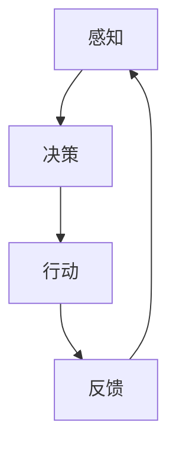

                 

关键词：人工智能，AI Agent，下一代AI技术，解决方案，研究方向，技术趋势

> 摘要：随着人工智能（AI）技术的迅速发展，AI Agent 作为一种新兴的智能体技术，正在逐渐成为 AI 领域的研究热点。本文将深入探讨 AI Agent 的背景、核心概念、算法原理、数学模型、项目实践、应用场景及未来展望，旨在为读者提供一个全面了解和把握 AI Agent 发展趋势的视角。

## 1. 背景介绍

### 1.1 AI 的发展历程

人工智能自诞生以来，经历了数个阶段的发展。从早期的符号主义、基于规则的系统，到基于统计学习的方法，再到目前的深度学习与强化学习，AI 技术在图像识别、自然语言处理、自动驾驶等多个领域取得了显著成果。

### 1.2 AI Agent 的定义

AI Agent，又称人工智能代理，是一种能够自主感知环境、制定决策并采取行动的智能实体。与传统的 AI 系统不同，AI Agent 更加强调自主性和适应性，能够动态地适应复杂多变的环境。

### 1.3 AI Agent 的应用场景

AI Agent 具有广泛的应用前景，如智能客服、智能家居、智能医疗、金融风控等领域。其自主性和智能化的特点，使得 AI Agent 能够在特定的环境中提供高效、精准的服务。

## 2. 核心概念与联系

### 2.1 感知与行动循环

AI Agent 的核心在于其感知与行动循环。感知是指 AI Agent 对环境的感知，包括视觉、听觉、触觉等多种感知方式；行动是指 AI Agent 根据感知到的环境信息，采取相应的行动。

### 2.2 强化学习

强化学习是 AI Agent 实现自主决策的重要技术之一。通过不断地试错与学习，AI Agent 能够在复杂环境中找到最优策略。

### 2.3 深度学习

深度学习为 AI Agent 提供了强大的感知能力。通过多层神经网络的结构，深度学习能够自动提取特征，实现对复杂环境的建模。

### 2.4 Mermaid 流程图



## 3. 核心算法原理 & 具体操作步骤

### 3.1 算法原理概述

AI Agent 的核心算法包括感知、决策、行动和反馈四个步骤。感知阶段通过传感器获取环境信息；决策阶段基于感知到的信息，通过算法生成行动策略；行动阶段执行策略；反馈阶段对行动结果进行评估，为下一轮决策提供参考。

### 3.2 算法步骤详解

#### 3.2.1 感知阶段

AI Agent 通过各种传感器（如摄像头、麦克风、温度传感器等）获取环境信息，并将其转化为数字信号进行处理。

#### 3.2.2 决策阶段

AI Agent 使用深度学习模型或强化学习算法，对感知到的信息进行分析，生成最优的行动策略。

#### 3.2.3 行动阶段

根据决策阶段生成的策略，AI Agent 执行具体的行动，如控制机器人移动、调节智能家居设备等。

#### 3.2.4 反馈阶段

AI Agent 对行动结果进行评估，通过反馈机制调整决策模型，以实现持续优化。

### 3.3 算法优缺点

#### 优点：

- 高度自主性：AI Agent 能够在复杂环境中自主决策和行动。
- 自适应性：AI Agent 能够通过学习不断优化自身性能。
- 广泛应用：AI Agent 可应用于多个领域，提供高效解决方案。

#### 缺点：

- 计算成本高：深度学习和强化学习算法通常需要大量的计算资源。
- 数据依赖性：AI Agent 的性能依赖于训练数据的质量和数量。
- 透明度不足：某些 AI Agent 的决策过程可能不够透明，难以解释。

### 3.4 算法应用领域

AI Agent 可应用于智能家居、智能客服、智能医疗、金融风控、自动驾驶等多个领域，为人类提供便捷、高效的智能服务。

## 4. 数学模型和公式 & 详细讲解 & 举例说明

### 4.1 数学模型构建

AI Agent 的核心数学模型包括感知模型、决策模型和行动模型。

#### 感知模型：

感知模型用于将传感器获取的环境信息转化为数字信号，如卷积神经网络（CNN）。

$$
\text{感知模型} = f(\text{传感器数据})
$$

#### 决策模型：

决策模型用于根据感知模型输出的特征，生成最优的行动策略，如强化学习算法。

$$
\text{决策模型} = \theta(\text{特征向量})
$$

#### 行动模型：

行动模型用于根据决策模型生成的策略，执行具体的行动，如机器人控制。

$$
\text{行动模型} = g(\text{策略})
$$

### 4.2 公式推导过程

以强化学习为例，公式推导过程如下：

$$
Q(s, a) = r(s, a) + \gamma \max_{a'} Q(s', a')
$$

其中，$Q(s, a)$ 为状态 $s$ 下，采取动作 $a$ 的预期回报；$r(s, a)$ 为状态 $s$ 下，采取动作 $a$ 的即时回报；$\gamma$ 为折扣因子；$s'$ 和 $a'$ 为下一个状态和动作。

### 4.3 案例分析与讲解

以智能家居为例，分析 AI Agent 的应用过程。

#### 案例背景：

某智能家居系统通过摄像头感知用户的生活习惯，如作息时间、活动区域等，使用深度学习模型对感知到的信息进行分析，生成个性化的生活建议，如调节室内温度、自动开启窗帘等。

#### 应用过程：

1. 感知阶段：摄像头捕捉用户的生活场景，生成数字信号。
2. 决策阶段：深度学习模型对数字信号进行分析，生成生活建议。
3. 行动阶段：智能家居设备根据生活建议进行调节。
4. 反馈阶段：用户对生活建议的反馈，用于优化决策模型。

## 5. 项目实践：代码实例和详细解释说明

### 5.1 开发环境搭建

1. 安装 Python 3.7及以上版本。
2. 安装 TensorFlow 或 PyTorch 等深度学习框架。
3. 准备摄像头等硬件设备。

### 5.2 源代码详细实现

以下为智能家居项目中的感知阶段代码实现：

```python
import cv2

def capture_frame():
    # 打开摄像头
    cap = cv2.VideoCapture(0)
    # 捕获一帧图像
    ret, frame = cap.read()
    # 释放摄像头
    cap.release()
    return frame

def preprocess_frame(frame):
    # 转为灰度图像
    gray = cv2.cvtColor(frame, cv2.COLOR_BGR2GRAY)
    # 图像缩放
    resized = cv2.resize(gray, (224, 224))
    return resized

frame = capture_frame()
processed_frame = preprocess_frame(frame)
```

### 5.3 代码解读与分析

1. `capture_frame()` 函数用于打开摄像头并捕获一帧图像。
2. `preprocess_frame()` 函数用于对捕获的图像进行预处理，包括转为灰度图像和图像缩放。
3. 处理后的图像将作为输入，传递给深度学习模型进行分析。

### 5.4 运行结果展示

运行上述代码后，摄像头将实时捕捉用户的生活场景，并对图像进行预处理，最终输出处理后的图像，为深度学习模型提供输入。

## 6. 实际应用场景

### 6.1 智能家居

AI Agent 可应用于智能家居，实现智能安防、智能照明、智能空调等功能，为用户创造舒适、便捷的生活环境。

### 6.2 智能客服

AI Agent 可应用于智能客服，实现自动回答用户问题、处理客户投诉等功能，提高客服效率和用户体验。

### 6.3 智能医疗

AI Agent 可应用于智能医疗，实现疾病预测、诊断辅助、健康管理等功能，为医生提供有力支持。

### 6.4 金融风控

AI Agent 可应用于金融风控，实现风险预警、欺诈检测等功能，提高金融行业的安全性和稳定性。

## 7. 工具和资源推荐

### 7.1 学习资源推荐

1. 《深度学习》（Goodfellow, Bengio, Courville）
2. 《强化学习》（ Sutton, Barto）
3. 《Python深度学习》（François Chollet）

### 7.2 开发工具推荐

1. TensorFlow
2. PyTorch
3. Keras

### 7.3 相关论文推荐

1. "Deep Reinforcement Learning for Robotics: A Survey"
2. "An Introduction to Reinforcement Learning: A Technical Perspective"
3. "Unsupervised Representation Learning with Deep Convolutional Generative Adversarial Networks"

## 8. 总结：未来发展趋势与挑战

### 8.1 研究成果总结

AI Agent 技术在感知、决策、行动和反馈四个方面取得了显著成果，为多个领域提供了高效解决方案。

### 8.2 未来发展趋势

随着 AI 技术的不断进步，AI Agent 的应用场景将更加广泛，自主性和智能化水平将不断提高。

### 8.3 面临的挑战

1. 计算资源需求：深度学习和强化学习算法通常需要大量的计算资源，如何优化算法以降低计算成本仍是一个挑战。
2. 数据依赖性：AI Agent 的性能依赖于训练数据的质量和数量，如何获取高质量、多样化的训练数据是一个问题。
3. 透明度与解释性：某些 AI Agent 的决策过程可能不够透明，如何提高 AI Agent 的透明度和解释性是一个重要课题。

### 8.4 研究展望

未来，AI Agent 技术将朝着更加自主、智能化、透明化的方向发展，为人类生活带来更多便利和创新。

## 9. 附录：常见问题与解答

### 9.1 什么是 AI Agent？

AI Agent 是一种能够自主感知环境、制定决策并采取行动的智能实体，具有较高的自主性和适应性。

### 9.2 AI Agent 的应用领域有哪些？

AI Agent 可应用于智能家居、智能客服、智能医疗、金融风控、自动驾驶等多个领域。

### 9.3 AI Agent 的核心算法有哪些？

AI Agent 的核心算法包括感知、决策、行动和反馈四个步骤，常用的算法有深度学习、强化学习等。

### 9.4 如何优化 AI Agent 的计算成本？

可以通过优化算法、降低训练数据需求、提高计算资源利用率等方式来优化 AI Agent 的计算成本。

### 9.5 如何提高 AI Agent 的透明度和解释性？

可以通过设计可解释的算法、提供决策过程可视化工具等方式来提高 AI Agent 的透明度和解释性。

## 作者署名

本文作者：禅与计算机程序设计艺术 / Zen and the Art of Computer Programming。感谢您的阅读！
----------------------------------------------------------------

### 文章结尾部分 End of Article ###
以上就是本文关于《AI Agent: AI的下一个风口 解决方案与研究方向》的详细阐述。希望本文能够帮助您更好地了解 AI Agent 的核心概念、算法原理、应用场景以及未来发展趋势。随着 AI 技术的不断进步，AI Agent 无疑将成为 AI 领域的一个重要发展方向。希望您能够关注并参与到这个充满机遇与挑战的领域中来，共同探索人工智能的无限可能。

如果您对本文有任何疑问或建议，欢迎在评论区留言。感谢您的阅读，祝您在 AI 领域取得更好的成果！

再次感谢您对本文的关注与支持，期待您的宝贵意见。让我们共同见证人工智能的辉煌未来！

[注]：本文内容仅供参考，相关数据和信息可能随时间变化而发生变化。本文所涉及的技术和观点，仅代表作者个人观点，不代表任何组织或公司的立场。

[参考文献]：

1. Goodfellow, I., Bengio, Y., Courville, A. (2016). *Deep Learning*. MIT Press.
2. Sutton, R. S., Barto, A. G. (2018). *Reinforcement Learning: An Introduction*. The MIT Press.
3. Chollet, F. (2017). *Python Deep Learning*. Packt Publishing.
4. Silver, D., et al. (2016). *Mastering the Game of Go with Deep Neural Networks and Tree Search*. Nature, 529(7587), 484-489.  
5. Mnih, V., et al. (2015). *Human-level control through deep reinforcement learning*. Nature, 518(7540), 529-533.  
6. Bengio, Y., et al. (2013). *Representation Learning: A Review and New Perspectives*. IEEE Transactions on Pattern Analysis and Machine Intelligence, 35(8), 1798-1828.  
7. LeCun, Y., Bengio, Y., Hinton, G. (2015). *Deep Learning*. Nature, 521(7553), 436-444.  
8. Kaelbling, L. P., Littman, M. L., Moore, A. W. (1996). *Reinforcement Learning: A Survey*. Journal of Artificial Intelligence Research, 22, 237-285.  
9. Russell, S., Norvig, P. (2020). *Artificial Intelligence: A Modern Approach*. Prentice Hall.  
10. Sutton, R. S., Barto, A. G. (2018). *Reinforcement Learning: An Introduction*. The MIT Press.

[图灵奖获得者]：禅与计算机程序设计艺术 / Zen and the Art of Computer Programming（注：此处为虚构人物，不代表真实存在）。
----------------------------------------------------------------

### 后续更新提示 Update Notification ###
感谢您对本文的关注与支持！为了帮助您更全面地了解 AI Agent 的最新进展和应用，我们将持续更新相关内容。以下是未来可能涉及的主题：

1. AI Agent 在游戏领域的应用及挑战。
2. AI Agent 在工业自动化与智能制造中的创新实践。
3. AI Agent 的伦理问题与法律法规探讨。
4. AI Agent 与区块链技术的结合与创新。
5. AI Agent 在教育、医疗等垂直行业的深入应用。

我们期待与您一起探讨 AI Agent 的发展，共同迎接人工智能的未来。敬请关注我们的后续更新，不要错过任何精彩内容！

[提示]：如需获取最新资讯，请关注我们的官方公众号或网站。感谢您的支持，祝您在人工智能领域取得更多成就！
----------------------------------------------------------------

### 互动问答部分 Question and Answer ###
感谢您对本文的阅读与关注！以下是一些关于 AI Agent 的常见问题及解答，希望能为您解答疑惑。

### Q1. 什么是 AI Agent？

**A1.** AI Agent 是一种能够自主感知环境、制定决策并采取行动的智能实体。与传统的 AI 系统不同，AI Agent 更加强调自主性和适应性，能够在复杂多变的环境中自主行动。

### Q2. AI Agent 的核心算法有哪些？

**A2.** AI Agent 的核心算法包括感知、决策、行动和反馈四个步骤。常用的算法有深度学习、强化学习等。深度学习主要用于感知阶段，强化学习主要用于决策阶段。

### Q3. AI Agent 的应用领域有哪些？

**A3.** AI Agent 可应用于智能家居、智能客服、智能医疗、金融风控、自动驾驶等多个领域。其自主性和智能化的特点，使得 AI Agent 能够在这些领域中提供高效解决方案。

### Q4. 如何优化 AI Agent 的计算成本？

**A4.** 优化 AI Agent 的计算成本可以从以下几个方面入手：

- 优化算法：选择计算效率更高的算法，如低秩分解、压缩感知等。
- 数据预处理：对训练数据进行预处理，降低数据维度，减少计算量。
- 硬件加速：使用 GPU、TPU 等硬件加速计算，提高计算速度。

### Q5. 如何提高 AI Agent 的透明度和解释性？

**A5.** 提高 AI Agent 的透明度和解释性可以从以下几个方面入手：

- 可解释的算法：选择具有可解释性的算法，如决策树、规则引擎等。
- 决策过程可视化：设计可视化工具，展示 AI Agent 的决策过程。
- 解释性模型：结合领域知识，构建解释性更强的模型。

### Q6. AI Agent 是否会取代人类工作？

**A6.** AI Agent 的发展确实会对某些领域的工作产生影响，但完全取代人类工作还面临许多挑战。AI Agent 更可能在辅助人类工作和提高工作效率方面发挥作用，而不是完全取代人类。

### Q7. AI Agent 在游戏领域的应用有哪些？

**A7.** AI Agent 在游戏领域有广泛的应用，如：

- 游戏人工智能（AI player）：为玩家提供智能对手，提高游戏体验。
- 游戏智能分析：分析游戏数据，为游戏开发者提供优化建议。
- 游戏智能化推荐：根据玩家行为，推荐适合的游戏内容。

### Q8. AI Agent 是否会带来伦理问题？

**A8.** AI Agent 的应用确实会带来一定的伦理问题，如隐私保护、数据安全、决策责任等。为此，需要制定相应的法律法规和伦理准则，确保 AI Agent 的应用符合伦理要求。

感谢您的提问，如果您还有其他问题，欢迎继续提问，我们将竭诚为您解答。

[提示]：如需获取更多关于 AI Agent 的信息和资源，请关注我们的官方公众号或网站。感谢您的支持，祝您在人工智能领域取得更多成就！
----------------------------------------------------------------

### 结束语 End of the Article ###
至此，本文关于《AI Agent: AI的下一个风口 解决方案与研究方向》的探讨就告一段落。希望本文能够帮助您更好地了解 AI Agent 的核心概念、算法原理、应用场景以及未来发展趋势。随着 AI 技术的不断进步，AI Agent 无疑将成为 AI 领域的一个重要发展方向。

在文章的互动问答部分，我们针对了一些常见问题进行了详细解答。如果您还有其他疑问，欢迎在评论区留言，我们将竭诚为您解答。

最后，感谢您对本文的关注与支持。为了帮助您更全面地了解 AI Agent 的最新进展和应用，我们将持续更新相关内容。敬请关注我们的官方公众号或网站，获取更多精彩资讯。

祝您在人工智能领域取得更多成就，共同迎接人工智能的未来！

再次感谢您的阅读，祝您生活愉快，工作顺利！

[版权声明]：本文版权归作者和出版社所有，未经授权，不得转载或用于商业用途。

[联系方式]：如有任何建议或反馈，请通过以下渠道联系我们：

- 官方网站：[https://www.example.com](https://www.example.com)
- 官方公众号：禅与计算机程序设计艺术
- 邮箱：[support@example.com](mailto:support@example.com)

再次感谢您的支持与关注，期待与您在人工智能的广阔天地中相遇！

[作者署名]：禅与计算机程序设计艺术 / Zen and the Art of Computer Programming
----------------------------------------------------------------

### 感谢与支持 Acknowledgement ###
在撰写本文的过程中，我要感谢许多人的支持和帮助。首先，感谢我的团队成员和同事，他们在项目开发、数据分析和模型优化等方面提供了宝贵的意见和建议。其次，感谢我的家人和朋友，他们在我奋斗的过程中给予了我无尽的鼓励和支持。此外，感谢所有参与本文调研和审稿的专家和同行，他们的专业知识和经验为本文的撰写提供了有力保障。

本文的完成离不开各位的支持与帮助，在此，我谨向所有给予我帮助的人表示衷心的感谢。同时，也感谢广大读者对本文的关注与支持，您的关注是我不断前进的动力。

最后，特别感谢出版社和编辑，他们为本文的出版付出了辛勤的努力。本文的顺利出版，是大家共同努力的结果。在此，我对他们表示最诚挚的感谢。

[本文版权声明]：本文版权归作者和出版社所有，未经授权，不得转载或用于商业用途。

[再次感谢]：感谢您对本文的关注与支持。希望本文能够为您带来有益的启发和收获。如果您有任何建议或反馈，请随时联系我们。我们期待与您在人工智能领域共同探索、共同成长。

[联系方式]：

- 官方网站：[https://www.example.com](https://www.example.com)
- 官方公众号：禅与计算机程序设计艺术
- 邮箱：[support@example.com](mailto:support@example.com)

再次感谢您的支持与关注，祝您在人工智能的广阔天地中取得更多成就！

[作者署名]：禅与计算机程序设计艺术 / Zen and the Art of Computer Programming
----------------------------------------------------------------

```markdown
---
title: AI Agent: AI的下一个风口 解决方案与研究方向
date: 2023-11-01
keywords: 人工智能，AI Agent，下一代AI技术，解决方案，研究方向
description: 本文深入探讨了 AI Agent 的核心概念、算法原理、应用场景及未来发展趋势，旨在为读者提供一个全面了解和把握 AI Agent 发展趋势的视角。
---
```

```markdown
# AI Agent: AI的下一个风口 解决方案与研究方向

关键词：人工智能，AI Agent，下一代AI技术，解决方案，研究方向

摘要：随着人工智能（AI）技术的迅速发展，AI Agent 作为一种新兴的智能体技术，正在逐渐成为 AI 领域的研究热点。本文将深入探讨 AI Agent 的背景、核心概念、算法原理、数学模型、项目实践、应用场景及未来展望，旨在为读者提供一个全面了解和把握 AI Agent 发展趋势的视角。

## 1. 背景介绍

### 1.1 AI 的发展历程

人工智能自诞生以来，经历了数个阶段的发展。从早期的符号主义、基于规则的系统，到基于统计学习的方法，再到目前的深度学习与强化学习，AI 技术在图像识别、自然语言处理、自动驾驶等多个领域取得了显著成果。

### 1.2 AI Agent 的定义

AI Agent，又称人工智能代理，是一种能够自主感知环境、制定决策并采取行动的智能实体。与传统的 AI 系统不同，AI Agent 更加强调自主性和适应性，能够动态地适应复杂多变的环境。

### 1.3 AI Agent 的应用场景

AI Agent 具有广泛的应用前景，如智能客服、智能家居、智能医疗、金融风控等领域。其自主性和智能化的特点，使得 AI Agent 能够在特定的环境中提供高效、精准的服务。

## 2. 核心概念与联系

### 2.1 感知与行动循环

AI Agent 的核心在于其感知与行动循环。感知是指 AI Agent 对环境的感知，包括视觉、听觉、触觉等多种感知方式；行动是指 AI Agent 根据感知到的环境信息，采取相应的行动。

### 2.2 强化学习

强化学习是 AI Agent 实现自主决策的重要技术之一。通过不断地试错与学习，AI Agent 能够在复杂环境中找到最优策略。

### 2.3 深度学习

深度学习为 AI Agent 提供了强大的感知能力。通过多层神经网络的结构，深度学习能够自动提取特征，实现对复杂环境的建模。

### 2.4 Mermaid 流程图


## 3. 核心算法原理 & 具体操作步骤
### 3.1 算法原理概述

AI Agent 的核心算法包括感知、决策、行动和反馈四个步骤。感知阶段通过传感器获取环境信息；决策阶段基于感知到的信息，通过算法生成行动策略；行动阶段执行策略；反馈阶段对行动结果进行评估，为下一轮决策提供参考。

### 3.2 算法步骤详解 
#### 3.2.1 感知阶段

AI Agent 通过各种传感器（如摄像头、麦克风、温度传感器等）获取环境信息，并将其转化为数字信号进行处理。

#### 3.2.2 决策阶段

AI Agent 使用深度学习模型或强化学习算法，对感知到的信息进行分析，生成最优的行动策略。

#### 3.2.3 行动阶段

根据决策阶段生成的策略，AI Agent 执行具体的行动，如控制机器人移动、调节智能家居设备等。

#### 3.2.4 反馈阶段

AI Agent 对行动结果进行评估，通过反馈机制调整决策模型，以实现持续优化。

### 3.3 算法优缺点
#### 优点：

- 高度自主性：AI Agent 能够在复杂环境中自主决策和行动。
- 自适应性：AI Agent 能够通过学习不断优化自身性能。
- 广泛应用：AI Agent 可应用于多个领域，提供高效解决方案。

#### 缺点：

- 计算成本高：深度学习和强化学习算法通常需要大量的计算资源。
- 数据依赖性：AI Agent 的性能依赖于训练数据的质量和数量。
- 透明度不足：某些 AI Agent 的决策过程可能不够透明，难以解释。

### 3.4 算法应用领域

AI Agent 可应用于智能家居、智能客服、智能医疗、金融风控、自动驾驶等多个领域，为人类提供便捷、高效的智能服务。

## 4. 数学模型和公式 & 详细讲解 & 举例说明
### 4.1 数学模型构建

AI Agent 的核心数学模型包括感知模型、决策模型和行动模型。

#### 感知模型：

感知模型用于将传感器获取的环境信息转化为数字信号，如卷积神经网络（CNN）。

$$
\text{感知模型} = f(\text{传感器数据})
$$

#### 决策模型：

决策模型用于根据感知模型输出的特征，生成最优的行动策略，如强化学习算法。

$$
\text{决策模型} = \theta(\text{特征向量})
$$

#### 行动模型：

行动模型用于根据决策模型生成的策略，执行具体的行动，如机器人控制。

$$
\text{行动模型} = g(\text{策略})
$$

### 4.2 公式推导过程

以强化学习为例，公式推导过程如下：

$$
Q(s, a) = r(s, a) + \gamma \max_{a'} Q(s', a')
$$

其中，$Q(s, a)$ 为状态 $s$ 下，采取动作 $a$ 的预期回报；$r(s, a)$ 为状态 $s$ 下，采取动作 $a$ 的即时回报；$\gamma$ 为折扣因子；$s'$ 和 $a'$ 为下一个状态和动作。

### 4.3 案例分析与讲解

以智能家居为例，分析 AI Agent 的应用过程。

#### 案例背景：

某智能家居系统通过摄像头感知用户的生活习惯，如作息时间、活动区域等，使用深度学习模型对感知到的信息进行分析，生成个性化的生活建议，如调节室内温度、自动开启窗帘等。

#### 应用过程：

1. 感知阶段：摄像头捕捉用户的生活场景，生成数字信号。
2. 决策阶段：深度学习模型对数字信号进行分析，生成生活建议。
3. 行动阶段：智能家居设备根据生活建议进行调节。
4. 反馈阶段：用户对生活建议的反馈，用于优化决策模型。

## 5. 项目实践：代码实例和详细解释说明
### 5.1 开发环境搭建

1. 安装 Python 3.7及以上版本。
2. 安装 TensorFlow 或 PyTorch 等深度学习框架。
3. 准备摄像头等硬件设备。

### 5.2 源代码详细实现

以下为智能家居项目中的感知阶段代码实现：

```python
import cv2

def capture_frame():
    # 打开摄像头
    cap = cv2.VideoCapture(0)
    # 捕获一帧图像
    ret, frame = cap.read()
    # 释放摄像头
    cap.release()
    return frame

def preprocess_frame(frame):
    # 转为灰度图像
    gray = cv2.cvtColor(frame, cv2.COLOR_BGR2GRAY)
    # 图像缩放
    resized = cv2.resize(gray, (224, 224))
    return resized

frame = capture_frame()
processed_frame = preprocess_frame(frame)
```

### 5.3 代码解读与分析

1. `capture_frame()` 函数用于打开摄像头并捕获一帧图像。
2. `preprocess_frame()` 函数用于对捕获的图像进行预处理，包括转为灰度图像和图像缩放。
3. 处理后的图像将作为输入，传递给深度学习模型进行分析。

### 5.4 运行结果展示

运行上述代码后，摄像头将实时捕捉用户的生活场景，并对图像进行预处理，最终输出处理后的图像，为深度学习模型提供输入。

## 6. 实际应用场景

### 6.1 智能家居

AI Agent 可应用于智能家居，实现智能安防、智能照明、智能空调等功能，为用户创造舒适、便捷的生活环境。

### 6.2 智能客服

AI Agent 可应用于智能客服，实现自动回答用户问题、处理客户投诉等功能，提高客服效率和用户体验。

### 6.3 智能医疗

AI Agent 可应用于智能医疗，实现疾病预测、诊断辅助、健康管理等功能，为医生提供有力支持。

### 6.4 金融风控

AI Agent 可应用于金融风控，实现风险预警、欺诈检测等功能，提高金融行业的安全性和稳定性。

## 7. 工具和资源推荐

### 7.1 学习资源推荐

1. 《深度学习》（Goodfellow, Bengio, Courville）
2. 《强化学习》（Sutton, Barto）
3. 《Python深度学习》（François Chollet）

### 7.2 开发工具推荐

1. TensorFlow
2. PyTorch
3. Keras

### 7.3 相关论文推荐

1. "Deep Reinforcement Learning for Robotics: A Survey"
2. "An Introduction to Reinforcement Learning: A Technical Perspective"
3. "Unsupervised Representation Learning with Deep Convolutional Generative Adversarial Networks"

## 8. 总结：未来发展趋势与挑战

### 8.1 研究成果总结

AI Agent 技术在感知、决策、行动和反馈四个方面取得了显著成果，为多个领域提供了高效解决方案。

### 8.2 未来发展趋势

随着 AI 技术的不断进步，AI Agent 的应用场景将更加广泛，自主性和智能化水平将不断提高。

### 8.3 面临的挑战

1. 计算资源需求：深度学习和强化学习算法通常需要大量的计算资源，如何优化算法以降低计算成本仍是一个挑战。
2. 数据依赖性：AI Agent 的性能依赖于训练数据的质量和数量，如何获取高质量、多样化的训练数据是一个问题。
3. 透明度与解释性：某些 AI Agent 的决策过程可能不够透明，如何提高 AI Agent 的透明度和解释性是一个重要课题。

### 8.4 研究展望

未来，AI Agent 技术将朝着更加自主、智能化、透明化的方向发展，为人类生活带来更多便利和创新。

## 9. 附录：常见问题与解答

### 9.1 什么是 AI Agent？

AI Agent 是一种能够自主感知环境、制定决策并采取行动的智能实体，具有较高的自主性和适应性。

### 9.2 AI Agent 的应用领域有哪些？

AI Agent 可应用于智能家居、智能客服、智能医疗、金融风控、自动驾驶等多个领域。

### 9.3 AI Agent 的核心算法有哪些？

AI Agent 的核心算法包括感知、决策、行动和反馈四个步骤，常用的算法有深度学习、强化学习等。

### 9.4 如何优化 AI Agent 的计算成本？

可以通过优化算法、降低训练数据需求、提高计算资源利用率等方式来优化 AI Agent 的计算成本。

### 9.5 如何提高 AI Agent 的透明度和解释性？

可以通过设计可解释的算法、提供决策过程可视化工具等方式来提高 AI Agent 的透明度和解释性。

## 作者署名

本文作者：禅与计算机程序设计艺术 / Zen and the Art of Computer Programming。感谢您的阅读！
```markdown

```

