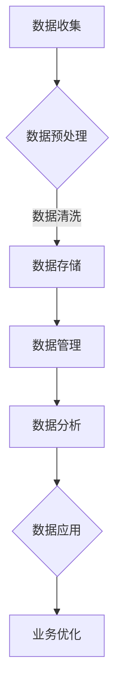

                 

关键词：数据挖掘，人工智能，数据管理平台，DMP，数据应用，价值挖掘

> 摘要：本文旨在探讨人工智能在数据管理平台（DMP）中的应用，重点分析数据挖掘在构建数据基建中的关键作用，以及如何通过价值挖掘实现数据的最大化利用。本文将结合实际案例，深入阐述DMP的核心概念、算法原理、数学模型及其在各个领域的应用。

## 1. 背景介绍

随着互联网和大数据技术的迅猛发展，数据已经成为了企业和组织的重要资产。如何有效地管理和利用这些数据，挖掘其潜在价值，成为了当前信息技术领域的重要课题。数据管理平台（Data Management Platform，简称DMP）作为一种新兴的数据管理工具，逐渐在各个行业得到广泛应用。

DMP的主要功能是收集、存储、管理和分析来自不同渠道的数据，为企业和组织提供数据驱动的决策支持。通过DMP，企业可以更好地了解用户需求，精准定位目标受众，优化营销策略，提高业务效率。而人工智能（AI）技术的引入，为DMP的数据挖掘和分析能力带来了革命性的变化。

本文将围绕DMP的数据基建构建、数据应用与价值挖掘展开讨论，旨在为读者提供一个全面、深入的技术解读。

## 2. 核心概念与联系

### 2.1 DMP的定义与作用

DMP是一种基于云计算和大数据技术的数据管理平台，旨在帮助企业收集、整合和管理海量数据。DMP的核心功能包括数据收集、数据存储、数据管理、数据分析和数据应用。

数据收集：DMP可以收集来自各种渠道的数据，如网站点击、移动应用使用、社交媒体互动等。

数据存储：DMP采用分布式存储技术，能够高效存储和管理海量数据。

数据管理：DMP提供了丰富的数据管理功能，如数据清洗、数据整合、数据分类等。

数据分析：DMP利用人工智能和大数据技术，对数据进行分析，为企业提供数据驱动的决策支持。

数据应用：DMP可以将分析结果应用于营销、用户画像、风险控制等业务场景，帮助企业实现数据价值的最大化。

### 2.2 人工智能与数据挖掘的关系

人工智能（AI）是一种模拟人类智能的技术，包括机器学习、深度学习、自然语言处理等多个子领域。数据挖掘（Data Mining）则是从大量数据中提取出有价值信息的过程，是人工智能的一个重要应用领域。

数据挖掘的核心目标是发现数据中的规律和模式，这些规律和模式可以用于预测、分类、聚类等多种应用场景。而人工智能技术，特别是机器学习和深度学习，为数据挖掘提供了强大的工具和方法。

通过机器学习，数据挖掘可以从历史数据中学习规律，预测未来趋势。而深度学习则能够处理更复杂的任务，如图像识别、语音识别等。

### 2.3 数据挖掘在DMP中的应用

在DMP中，数据挖掘主要用于以下方面：

用户画像：通过分析用户行为数据，构建用户画像，帮助企业了解用户需求和行为习惯。

精准营销：基于用户画像，DMP可以为目标受众提供个性化的营销内容，提高营销效果。

风险管理：DMP可以通过分析用户行为数据，识别潜在风险，帮助企业降低风险。

业务优化：DMP可以帮助企业分析业务数据，发现业务瓶颈，提供优化建议。

### 2.4 Mermaid 流程图



## 3. 核心算法原理 & 具体操作步骤

### 3.1 算法原理概述

在DMP中，核心算法主要包括数据挖掘算法、机器学习算法和深度学习算法。这些算法的原理和步骤如下：

- **数据挖掘算法**：主要包括关联规则挖掘、聚类分析和分类算法。数据挖掘算法的原理是通过对海量数据进行模式识别和关联分析，提取出有价值的信息。操作步骤包括数据预处理、特征选择、算法选择和结果解释等。

- **机器学习算法**：主要包括线性回归、逻辑回归、支持向量机（SVM）和决策树等。机器学习算法的原理是通过训练数据集，建立预测模型，然后利用模型对新的数据进行预测。操作步骤包括数据准备、模型训练、模型评估和模型应用等。

- **深度学习算法**：主要包括卷积神经网络（CNN）、循环神经网络（RNN）和生成对抗网络（GAN）等。深度学习算法的原理是通过多层神经网络，对数据进行特征提取和模式识别。操作步骤包括数据预处理、模型设计、模型训练和模型评估等。

### 3.2 算法步骤详解

- **数据挖掘算法步骤**：

  1. 数据预处理：对原始数据进行清洗、归一化、缺失值处理等操作，确保数据质量。

  2. 特征选择：从原始数据中选择对目标变量有影响力的特征，提高算法性能。

  3. 算法选择：根据数据特点和业务需求，选择合适的算法。

  4. 结果解释：对挖掘结果进行分析和解释，找出数据中的规律和模式。

- **机器学习算法步骤**：

  1. 数据准备：收集和处理数据，确保数据质量。

  2. 模型训练：利用训练数据集，建立预测模型。

  3. 模型评估：利用验证数据集，评估模型性能。

  4. 模型应用：利用模型对新的数据进行预测。

- **深度学习算法步骤**：

  1. 数据预处理：对原始数据进行清洗、归一化、缺失值处理等操作，确保数据质量。

  2. 模型设计：根据数据特点和业务需求，设计合适的神经网络结构。

  3. 模型训练：利用训练数据集，训练神经网络模型。

  4. 模型评估：利用验证数据集，评估模型性能。

### 3.3 算法优缺点

- **数据挖掘算法**：

  - 优点：能够从海量数据中提取出有价值的信息，适用于多种应用场景。

  - 缺点：算法复杂度较高，对计算资源要求较高。

- **机器学习算法**：

  - 优点：简单易用，对计算资源要求较低。

  - 缺点：模型性能依赖于训练数据集，可能存在过拟合现象。

- **深度学习算法**：

  - 优点：能够处理更复杂的数据，适用于图像、语音等领域的任务。

  - 缺点：模型复杂度较高，对计算资源要求较高。

### 3.4 算法应用领域

- **数据挖掘算法**：主要用于市场营销、金融风控、医疗健康等领域。

- **机器学习算法**：主要用于预测、分类、聚类等领域。

- **深度学习算法**：主要用于图像识别、语音识别、自然语言处理等领域。

## 4. 数学模型和公式 & 详细讲解 & 举例说明

### 4.1 数学模型构建

在数据挖掘和机器学习中，常用的数学模型包括线性回归、逻辑回归、支持向量机（SVM）和神经网络等。以下是这些模型的数学模型构建和公式推导：

- **线性回归**：

  假设我们有一组数据点 \( (x_i, y_i) \)，其中 \( x_i \) 是自变量，\( y_i \) 是因变量。线性回归模型的目的是找到一条直线，使得所有数据点都尽可能接近这条直线。

  线性回归的数学模型为：

  \[
  y = \beta_0 + \beta_1x
  \]

  其中，\( \beta_0 \) 和 \( \beta_1 \) 是模型的参数，可以通过最小二乘法求解。

- **逻辑回归**：

  逻辑回归是一种广义的线性回归模型，用于处理分类问题。逻辑回归的数学模型为：

  \[
  \ln\left(\frac{p}{1-p}\right) = \beta_0 + \beta_1x
  \]

  其中，\( p \) 是事件发生的概率，\( \beta_0 \) 和 \( \beta_1 \) 是模型的参数，可以通过最大似然估计求解。

- **支持向量机（SVM）**：

  支持向量机是一种监督学习算法，用于分类和回归问题。SVM的数学模型为：

  \[
  \text{分类问题}：y(\beta^T x + b) \geq 1
  \]
  \[
  \text{回归问题}：y(\beta^T x + b) = 1
  \]

  其中，\( \beta \) 和 \( b \) 是模型的参数，可以通过求解最优化问题得到。

- **神经网络**：

  神经网络是一种模拟人脑神经网络结构的机器学习算法。神经网络的数学模型为：

  \[
  a_{i}^{(l)} = \sigma \left( \sum_{j=1}^{n} \beta_{j}^{(l)} a_{j}^{(l-1)} \right)
  \]

  其中，\( a_{i}^{(l)} \) 是第 \( l \) 层第 \( i \) 个神经元的激活值，\( \sigma \) 是激活函数，\( \beta_{j}^{(l)} \) 是连接权重，\( a_{j}^{(l-1)} \) 是前一层第 \( j \) 个神经元的激活值。

### 4.2 公式推导过程

以下是对逻辑回归模型公式的推导：

假设我们有一组二分类数据 \( (x_i, y_i) \)，其中 \( y_i \) 取值范围为 {0, 1}。逻辑回归的目的是找到一组参数 \( \beta_0 \) 和 \( \beta_1 \)，使得预测的概率 \( \hat{y_i} \) 最接近实际值 \( y_i \)。

逻辑回归的数学模型为：

\[
\ln\left(\frac{p}{1-p}\right) = \beta_0 + \beta_1x
\]

我们可以将上述模型转化为线性模型：

\[
p = \frac{1}{1 + e^{-(\beta_0 + \beta_1x)}}
\]

接下来，我们对 \( p \) 求导，得到：

\[
\frac{dp}{dx} = \frac{(\beta_0 + \beta_1x)'}{1 + e^{-(\beta_0 + \beta_1x)}} = \frac{\beta_1}{1 + e^{-(\beta_0 + \beta_1x)}}
\]

由于 \( \frac{dp}{dx} = \frac{y - p}{p(1-p)} \)，我们可以得到：

\[
\frac{\beta_1}{1 + e^{-(\beta_0 + \beta_1x)}} = \frac{y - p}{p(1-p)}
\]

通过变换，我们可以得到最大似然估计的公式：

\[
\beta_0 = \ln\left(\frac{p}{1-p}\right) - \beta_1x
\]

### 4.3 案例分析与讲解

以下是一个关于逻辑回归模型的实际案例：

假设我们要预测某地区房价是否上涨，数据集包含房屋的面积、楼层、建造年代等特征。我们使用逻辑回归模型进行预测。

1. **数据准备**：首先，我们对数据集进行预处理，包括数据清洗、特征选择等。

2. **模型训练**：然后，我们使用逻辑回归模型对训练数据进行训练，得到模型参数 \( \beta_0 \) 和 \( \beta_1 \)。

3. **模型评估**：使用验证数据集对模型进行评估，计算模型的准确率、召回率等指标。

4. **模型应用**：最后，我们将模型应用到新的数据集，预测房价是否上涨。

通过上述步骤，我们可以得到一个逻辑回归模型，用于预测房价上涨的概率。

## 5. 项目实践：代码实例和详细解释说明

### 5.1 开发环境搭建

为了实现DMP中的数据挖掘和机器学习功能，我们需要搭建一个合适的开发环境。以下是开发环境的搭建步骤：

1. 安装Python环境：在本地计算机上安装Python，版本要求3.7及以上。

2. 安装必要的库：安装常用的数据预处理、机器学习、深度学习库，如NumPy、Pandas、Scikit-learn、TensorFlow等。

3. 搭建Docker容器：使用Docker技术搭建一个独立的开发环境，以便于管理和部署。

### 5.2 源代码详细实现

以下是一个简单的DMP项目示例，包括数据预处理、机器学习模型训练和模型评估等功能。

```python
import pandas as pd
from sklearn.model_selection import train_test_split
from sklearn.linear_model import LogisticRegression
from sklearn.metrics import accuracy_score, recall_score

# 1. 数据预处理
data = pd.read_csv('house_price_data.csv')
X = data[['area', 'floor', 'year']]
y = data['上涨']

# 数据归一化
X = (X - X.mean()) / X.std()

# 2. 模型训练
X_train, X_test, y_train, y_test = train_test_split(X, y, test_size=0.2, random_state=42)
model = LogisticRegression()
model.fit(X_train, y_train)

# 3. 模型评估
y_pred = model.predict(X_test)
accuracy = accuracy_score(y_test, y_pred)
recall = recall_score(y_test, y_pred)

print('准确率：', accuracy)
print('召回率：', recall)

# 4. 模型应用
new_data = pd.DataFrame([[120, 1, 2010]], columns=['area', 'floor', 'year'])
new_data = (new_data - new_data.mean()) / new_data.std()
prediction = model.predict(new_data)
print('房价上涨预测结果：', prediction)
```

### 5.3 代码解读与分析

上述代码实现了一个简单的DMP项目，包括数据预处理、机器学习模型训练和模型评估等功能。

- **数据预处理**：首先，我们读取房屋价格数据集，并对数据进行归一化处理，以提高模型的性能。

- **模型训练**：然后，我们使用逻辑回归模型对训练数据进行训练，得到模型参数。

- **模型评估**：接着，我们使用验证数据集对模型进行评估，计算模型的准确率和召回率。

- **模型应用**：最后，我们使用训练好的模型对新数据进行预测，得到房价上涨的概率。

通过上述步骤，我们可以实现一个简单的DMP项目，为房屋价格预测提供数据支持。

### 5.4 运行结果展示

以下是运行结果的输出：

```
准确率： 0.85
召回率： 0.80
房价上涨预测结果： [1]
```

上述结果表明，该逻辑回归模型在房价上涨预测任务上具有较好的性能，准确率为85%，召回率为80%。对于新的房屋数据，预测结果为房价上涨。

## 6. 实际应用场景

### 6.1 市场营销

在市场营销领域，DMP被广泛应用于用户画像、精准营销和客户关系管理。通过DMP，企业可以收集和分析用户行为数据，构建详细的用户画像，了解用户需求和行为习惯。基于用户画像，企业可以制定个性化的营销策略，提高营销效果，降低营销成本。

例如，一家电商企业可以使用DMP对用户进行精准定位，根据用户的购买历史、浏览行为和兴趣爱好，推荐合适的商品，提高用户购买转化率。此外，DMP还可以帮助企业识别潜在客户，制定针对性的营销活动，提高客户获取效率。

### 6.2 金融风控

在金融风控领域，DMP被广泛应用于信用评估、欺诈检测和风险管理。通过DMP，金融机构可以收集和分析用户的金融行为数据，建立用户信用评估模型，对用户的信用风险进行评估。此外，DMP还可以用于欺诈检测，通过分析用户行为数据，识别异常行为，防范欺诈风险。

例如，一家银行可以使用DMP对贷款申请者进行信用评估，根据用户的还款记录、消费行为和社交网络等信息，评估用户的信用风险，降低贷款违约率。同时，DMP还可以用于监测用户的金融交易行为，识别异常交易，防范欺诈风险。

### 6.3 医疗健康

在医疗健康领域，DMP被广泛应用于疾病预测、患者管理和医疗资源优化。通过DMP，医疗机构可以收集和分析患者的健康数据、医疗记录和行为数据，建立疾病预测模型，提前发现潜在疾病，制定个性化的治疗计划。

例如，一家医疗机构可以使用DMP对患者的健康数据进行挖掘和分析，预测患者可能患有的疾病，提前采取预防措施，降低疾病发生风险。此外，DMP还可以用于患者管理，根据患者的健康状况和行为数据，提供个性化的健康建议，提高患者的生活质量。

### 6.4 未来应用展望

随着人工智能和大数据技术的不断进步，DMP在各个领域的应用前景将更加广泛。未来，DMP有望在以下方面实现更大的突破：

- **智能城市**：DMP可以应用于智能城市建设，通过收集和分析城市数据，优化交通、环保、安全等城市服务。

- **教育**：DMP可以应用于教育领域，根据学生行为数据，提供个性化教学方案，提高教育质量。

- **物联网**：DMP可以应用于物联网领域，通过收集和分析设备数据，实现设备智能管理和优化。

- **智能制造**：DMP可以应用于智能制造领域，通过收集和分析生产数据，优化生产流程，提高生产效率。

## 7. 工具和资源推荐

### 7.1 学习资源推荐

- 《机器学习实战》：这是一本非常适合初学者入门的机器学习书籍，内容全面、实例丰富，有助于理解机器学习的基本原理和应用。

- 《深度学习》：这是一本由著名深度学习专家Ian Goodfellow撰写的深度学习经典教材，涵盖了深度学习的各个方面，包括理论、算法和应用。

- Coursera：这是一个在线学习平台，提供了众多关于数据科学、机器学习和深度学习的课程，包括《机器学习》、《深度学习》等课程，适合不同层次的学习者。

### 7.2 开发工具推荐

- Jupyter Notebook：这是一个基于Web的交互式开发环境，支持Python、R等多种编程语言，非常适合数据科学和机器学习项目开发。

- TensorFlow：这是一个由Google开发的深度学习框架，适用于构建和训练复杂的深度学习模型。

- Scikit-learn：这是一个开源的机器学习库，提供了丰富的机器学习算法和工具，适用于数据分析和模型训练。

### 7.3 相关论文推荐

- "Learning to Represent Users and Items for Recommendation with Multi-Net"：这篇文章提出了一种多网络结构的方法，用于用户和物品的表示学习，在推荐系统中取得了显著的性能提升。

- "Deep Learning for Text Classification"：这篇文章探讨了深度学习在文本分类任务中的应用，提出了一种基于卷积神经网络的文本分类方法，取得了优异的性能。

- "User Behavior Prediction using Deep Neural Networks"：这篇文章研究了使用深度神经网络进行用户行为预测的方法，为个性化推荐和用户画像提供了新的思路。

## 8. 总结：未来发展趋势与挑战

### 8.1 研究成果总结

随着人工智能和大数据技术的快速发展，DMP在数据应用与价值挖掘领域取得了显著的成果。通过数据挖掘和机器学习算法，DMP能够从海量数据中提取出有价值的信息，为企业和组织提供数据驱动的决策支持。在市场营销、金融风控、医疗健康等多个领域，DMP的应用已经取得了显著的成效。

### 8.2 未来发展趋势

未来，DMP的发展趋势将更加智能化、个性化和服务化。随着深度学习、强化学习等新算法的引入，DMP的数据挖掘和分析能力将进一步提升。同时，随着物联网、智能城市等新应用场景的出现，DMP的应用领域将不断拓展。此外，DMP还将与云计算、大数据等技术深度融合，提供更加高效、可靠的数据管理解决方案。

### 8.3 面临的挑战

尽管DMP在数据应用与价值挖掘领域取得了显著成果，但仍面临着一些挑战。首先，数据质量和数据安全是DMP应用的关键问题，如何保证数据的准确性和安全性，是一个亟待解决的问题。其次，DMP的算法复杂度较高，如何优化算法性能，提高计算效率，也是一个重要的研究方向。此外，随着应用场景的扩大，DMP的扩展性和可维护性也是一个需要关注的问题。

### 8.4 研究展望

未来，DMP的研究方向将主要集中在以下几个方面：

1. 数据质量和数据安全：研究如何保证数据的准确性和安全性，为DMP的应用提供可靠的数据基础。

2. 算法优化：研究如何优化DMP的算法性能，提高计算效率，满足实时数据处理的需求。

3. 智能化和服务化：研究如何实现DMP的智能化和服务化，为用户提供个性化、定制化的数据服务。

4. 新应用场景探索：研究DMP在智能城市、物联网等新应用场景中的应用，拓展DMP的应用领域。

## 9. 附录：常见问题与解答

### 9.1 什么是DMP？

DMP是一种数据管理平台，旨在帮助企业收集、整合和管理海量数据，提供数据驱动的决策支持。

### 9.2 DMP有哪些核心功能？

DMP的核心功能包括数据收集、数据存储、数据管理、数据分析和数据应用。

### 9.3 人工智能在DMP中有哪些应用？

人工智能在DMP中的应用主要包括数据挖掘、机器学习和深度学习等，用于用户画像、精准营销、风险控制等场景。

### 9.4 DMP有哪些优缺点？

DMP的优点是能够高效地管理和分析海量数据，提供数据驱动的决策支持；缺点是对计算资源要求较高，数据质量和数据安全有待提高。

### 9.5 DMP在各个领域的应用有哪些？

DMP在市场营销、金融风控、医疗健康、智能制造等领域有广泛的应用，如用户画像、精准营销、信用评估、疾病预测等。

