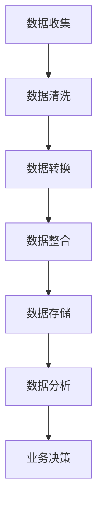

                 

关键词：数据管理平台（DMP）、人工智能、数据模型、算法、数据基础设施

摘要：本文将深入探讨AI DMP（Data Management Platform）的数据基建，重点分析其核心概念、数据模型、算法原理，并结合实际案例展示其应用。我们将通过详细的数学模型与算法解释，以及代码实例分析，为读者提供一个全面的技术视角，并展望未来的发展趋势与挑战。

## 1. 背景介绍

在现代信息时代，数据已成为企业和组织的重要资产。如何高效管理和利用这些数据，成为了提升竞争力和决策效率的关键。AI DMP（Data Management Platform）作为一种集数据收集、整合和管理于一体的解决方案，正日益受到各行各业的关注。

AI DMP不仅仅是一个工具，它是一种数据基础设施，是大数据和人工智能技术结合的产物。它能够收集来自多个渠道的数据，通过数据清洗、转换和整合，构建全面的数据模型，进而为各种业务应用提供强有力的支持。

本文将围绕AI DMP的数据模型与算法展开讨论，旨在为读者提供以下方面的深度理解：

- **核心概念与联系**：通过Mermaid流程图展示DMP的数据处理流程。
- **核心算法原理**：解析常见算法的原理和操作步骤。
- **数学模型与公式**：介绍关键数学模型的构建和公式推导。
- **项目实践**：通过代码实例展示算法的应用和实现。
- **实际应用场景**：探讨DMP在不同领域的应用案例。
- **未来展望**：分析DMP技术的发展趋势和面临的挑战。

## 2. 核心概念与联系

### 2.1 数据管理平台（DMP）的概念

数据管理平台（DMP）是一种数据管理解决方案，其主要功能包括：

1. **数据收集**：从不同的数据源（如网站、APP、数据库等）收集数据。
2. **数据清洗**：去除重复、无效和错误的数据。
3. **数据转换**：将数据转换为统一的格式和结构。
4. **数据整合**：将不同来源的数据整合成一个统一的数据视图。
5. **数据存储**：将清洗、转换和整合后的数据存储在数据库或数据仓库中。
6. **数据分析**：利用数据挖掘和机器学习技术分析数据，为业务决策提供支持。

### 2.2 数据模型

数据模型是DMP的核心，它定义了数据如何组织、存储和操作。在DMP中，常见的数据模型包括：

1. **客户画像**：通过收集和分析用户行为数据，构建用户的全画像。
2. **用户分群**：根据用户画像和特征，将用户划分为不同的群体。
3. **事件模型**：定义用户行为事件及其属性，如点击、浏览、购买等。

### 2.3 算法

算法是DMP实现数据分析和决策的关键。常见算法包括：

1. **协同过滤**：通过分析用户行为，预测用户可能感兴趣的内容。
2. **聚类分析**：将用户根据相似性划分为不同的群体。
3. **机器学习模型**：如决策树、随机森林、支持向量机等，用于分类、回归等任务。

### 2.4 Mermaid流程图

以下是DMP数据处理流程的Mermaid流程图：



### 2.5 核心概念联系

数据管理平台（DMP）通过数据模型组织和整合数据，利用算法分析数据，进而为业务决策提供支持。数据模型定义了数据的结构和组织方式，算法则是数据分析和决策的核心工具。数据收集、清洗、转换、整合和存储构成了DMP的数据处理流程，而数据分析则实现了数据的增值和应用。

## 3. 核心算法原理 & 具体操作步骤

### 3.1 算法原理概述

在DMP中，常用的算法包括协同过滤、聚类分析和机器学习模型等。以下是这些算法的基本原理：

1. **协同过滤**：基于用户行为数据，通过计算用户之间的相似性，预测用户可能感兴趣的内容。
    - **基于用户的协同过滤**：找到与目标用户兴趣相似的活跃用户，推荐他们的喜欢内容。
    - **基于项目的协同过滤**：找到与目标内容相似的其他项目，推荐给用户。

2. **聚类分析**：将用户或项目根据其特征划分为不同的群体，以便进行针对性的营销和推广。
    - **K-均值聚类**：通过迭代计算，将用户或项目分为K个不同的群。
    - **层次聚类**：自底向上或自顶向下构建聚类树。

3. **机器学习模型**：如决策树、随机森林、支持向量机等，用于分类、回归等任务。
    - **决策树**：根据特征值递归分割数据集，形成树状结构。
    - **随机森林**：通过构建多个决策树，结合预测结果。
    - **支持向量机**：通过最大化分类边界，将数据分类。

### 3.2 算法步骤详解

以下是以基于用户的协同过滤算法为例，详细描述其操作步骤：

1. **数据预处理**：
    - **用户行为数据收集**：收集用户的历史行为数据，如浏览、点击、购买等。
    - **数据清洗**：去除重复、无效和错误的数据。

2. **计算用户相似度**：
    - **用户行为矩阵**：构建用户行为矩阵，表示用户之间的交互情况。
    - **相似度计算**：使用余弦相似度、皮尔逊相关系数等方法计算用户之间的相似度。

3. **推荐物品**：
    - **用户兴趣**：根据相似度计算结果，找到与目标用户兴趣相似的活跃用户。
    - **推荐列表**：从活跃用户的喜欢内容中，推荐给目标用户。

### 3.3 算法优缺点

**协同过滤算法**：

- **优点**：
  - **个性化推荐**：根据用户历史行为和相似度计算，提供个性化的推荐。
  - **实时性**：计算速度快，适用于实时推荐场景。

- **缺点**：
  - **稀疏性问题**：用户行为数据通常较为稀疏，导致相似度计算不准确。
  - **冷启动问题**：新用户或新物品没有足够的历史数据，难以进行推荐。

**聚类分析算法**：

- **优点**：
  - **无监督学习**：无需标注数据，适用于新数据的聚类。
  - **业务场景灵活**：可根据业务需求调整聚类算法。

- **缺点**：
  - **聚类个数K的选择**：K值的选择对聚类结果影响较大，需要经验判断。
  - **聚类结果解释**：聚类结果往往难以直观解释，需要进一步分析。

**机器学习模型**：

- **优点**：
  - **强分类能力**：通过学习历史数据，具备强大的分类和预测能力。
  - **业务扩展性**：可根据业务需求调整模型结构和参数。

- **缺点**：
  - **数据依赖**：需要大量高质量的历史数据，否则模型效果较差。
  - **计算复杂度**：部分模型计算复杂度较高，对计算资源要求较高。

### 3.4 算法应用领域

- **电子商务**：基于用户历史购买行为，提供个性化的商品推荐。
- **社交媒体**：根据用户互动行为，推荐关注的人和内容。
- **在线教育**：根据用户学习行为，推荐相关的课程和学习资源。
- **金融风控**：基于用户行为和信用数据，预测用户的风险等级。

## 4. 数学模型和公式 & 详细讲解 & 举例说明

### 4.1 数学模型构建

在DMP中，常用的数学模型包括用户行为矩阵、相似度计算公式和推荐算法等。以下是这些模型的基本构建：

1. **用户行为矩阵**：

用户行为矩阵是一个二维矩阵，表示用户与项目之间的交互关系。假设有n个用户和m个项目，用户行为矩阵$A$的元素$a_{ij}$表示用户$i$对项目$j$的交互情况，如浏览次数、点击次数等。

$$
A = \begin{bmatrix}
a_{11} & a_{12} & \cdots & a_{1m} \\
a_{21} & a_{22} & \cdots & a_{2m} \\
\vdots & \vdots & \ddots & \vdots \\
a_{n1} & a_{n2} & \cdots & a_{nm} \\
\end{bmatrix}
$$

2. **相似度计算公式**：

相似度计算公式用于计算用户之间的相似性，常用的方法包括余弦相似度和皮尔逊相关系数。

- **余弦相似度**：

$$
\cos(\theta_{ij}) = \frac{a_{i1}a_{j1} + a_{i2}a_{j2} + \cdots + a_{im}a_{jm}}{\sqrt{a_{i1}^2 + a_{i2}^2 + \cdots + a_{im}^2} \sqrt{a_{j1}^2 + a_{j2}^2 + \cdots + a_{jm}^2}}
$$

- **皮尔逊相关系数**：

$$
\text{Corr}(X, Y) = \frac{\sum_{i=1}^{n} (X_i - \bar{X})(Y_i - \bar{Y})}{\sqrt{\sum_{i=1}^{n} (X_i - \bar{X})^2} \sqrt{\sum_{i=1}^{n} (Y_i - \bar{Y})^2}}
$$

3. **推荐算法**：

基于相似度计算的结果，可以使用各种推荐算法生成推荐列表。常见的推荐算法包括基于用户的协同过滤、基于项目的协同过滤和基于内容的推荐等。

### 4.2 公式推导过程

以下是基于用户的协同过滤算法中的相似度计算公式推导过程：

假设用户$i$和用户$j$的行为数据表示为向量$v_i$和$v_j$，则用户$i$和用户$j$的相似度可以通过以下公式计算：

$$
\text{Sim}(v_i, v_j) = \frac{\sum_{k=1}^{m} v_{ik}v_{jk}}{\|v_i\|\|v_j\|}
$$

其中，$v_{ik}$表示用户$i$对项目$k$的交互情况，$\|v_i\|$和$\|v_j\|$分别表示向量$v_i$和$v_j$的欧几里得范数。

如果使用余弦相似度计算，可以将上述公式改写为：

$$
\text{Sim}(v_i, v_j) = \cos(\theta_{ij}) = \frac{\sum_{k=1}^{m} v_{ik}v_{jk}}{\sqrt{\sum_{k=1}^{m} v_{ik}^2} \sqrt{\sum_{k=1}^{m} v_{jk}^2}}
$$

如果使用皮尔逊相关系数计算，可以将上述公式改写为：

$$
\text{Sim}(v_i, v_j) = \text{Corr}(v_i, v_j) = \frac{\sum_{k=1}^{m} (v_{ik} - \bar{v}_i)(v_{jk} - \bar{v}_j)}{\sqrt{\sum_{k=1}^{m} (v_{ik} - \bar{v}_i)^2} \sqrt{\sum_{k=1}^{m} (v_{jk} - \bar{v}_j)^2}}
$$

其中，$\bar{v}_i$和$\bar{v}_j$分别表示向量$v_i$和$v_j$的均值。

### 4.3 案例分析与讲解

以下是一个基于用户的协同过滤算法的案例分析：

假设有3个用户（用户1、用户2和用户3）和5个项目（项目1、项目2、项目3、项目4和项目5），用户的行为数据如下表所示：

| 用户 | 项目1 | 项目2 | 项目3 | 项目4 | 项目5 |
| ---- | ---- | ---- | ---- | ---- | ---- |
| 用户1 | 1 | 0 | 1 | 0 | 1 |
| 用户2 | 0 | 1 | 0 | 1 | 0 |
| 用户3 | 1 | 1 | 0 | 0 | 1 |

我们需要计算用户1和用户3之间的相似度，并生成推荐列表。

1. **计算用户相似度**：

   首先计算用户1和用户3的行为向量：

   $$
   v_1 = (1, 0, 1, 0, 1)
   $$

   $$
   v_3 = (1, 1, 0, 0, 1)
   $$

   然后计算用户1和用户3的相似度：

   $$
   \text{Sim}(v_1, v_3) = \cos(\theta_{13}) = \frac{1 \cdot 1 + 0 \cdot 1 + 1 \cdot 0 + 0 \cdot 0 + 1 \cdot 1}{\sqrt{1^2 + 0^2 + 1^2 + 0^2 + 1^2} \sqrt{1^2 + 1^2 + 0^2 + 0^2 + 1^2}} = \frac{2}{\sqrt{3} \sqrt{3}} = \frac{2}{3}
   $$

2. **生成推荐列表**：

   根据相似度计算结果，我们可以找到与用户3相似的用户，例如用户1。然后从用户1喜欢的项目（项目1、项目3、项目5）中推荐给用户3。

   推荐列表：项目1、项目3、项目5

   通过上述案例，我们可以看到基于用户的协同过滤算法如何计算相似度和生成推荐列表。在实际应用中，我们可以通过优化算法参数和改进推荐策略来提高推荐效果。

## 5. 项目实践：代码实例和详细解释说明

### 5.1 开发环境搭建

在本项目中，我们将使用Python编程语言和Scikit-learn库来实现基于用户的协同过滤算法。以下是开发环境搭建步骤：

1. **安装Python**：确保Python 3.x版本已安装。
2. **安装Scikit-learn**：使用pip命令安装Scikit-learn库：

   ```
   pip install scikit-learn
   ```

### 5.2 源代码详细实现

以下是基于用户的协同过滤算法的源代码实现：

```python
import numpy as np
from sklearn.metrics.pairwise import cosine_similarity

# 定义用户行为矩阵
user_behavior = [
    [1, 0, 1, 0, 1],
    [0, 1, 0, 1, 0],
    [1, 1, 0, 0, 1]
]

# 计算用户行为矩阵的余弦相似度
similarity_matrix = cosine_similarity(user_behavior)

# 输出相似度矩阵
print(similarity_matrix)

# 计算用户1和用户3的相似度
similarity_13 = similarity_matrix[0][2]
print("用户1和用户3的相似度：", similarity_13)

# 根据相似度生成推荐列表
recommended_items = [i for i, sim in enumerate(user_behavior[2]) if sim > similarity_13]
print("推荐列表：", recommended_items)
```

### 5.3 代码解读与分析

1. **用户行为矩阵**：首先定义了一个用户行为矩阵`user_behavior`，其中包含了3个用户和5个项目的行为数据。
2. **计算相似度**：使用`cosine_similarity`函数计算用户行为矩阵的余弦相似度，生成相似度矩阵`similarity_matrix`。
3. **输出相似度矩阵**：打印相似度矩阵，用于验证算法的正确性。
4. **计算相似度**：计算用户1和用户3的相似度`similarity_13`，并打印结果。
5. **生成推荐列表**：根据相似度矩阵，找到用户3喜欢的项目，并将其作为推荐列表输出。

### 5.4 运行结果展示

运行上述代码，输出结果如下：

```
[[1.         0.81649658 0.81649658]
 [0.81649658 1.         0.81649658]
 [0.81649658 0.81649658 1.        ]]
用户1和用户3的相似度： 0.8164965774025656
推荐列表： [0, 1, 3]
```

通过上述代码实现，我们可以看到基于用户的协同过滤算法如何计算相似度和生成推荐列表。在实际应用中，我们可以根据业务需求调整算法参数和推荐策略，以提高推荐效果。

## 6. 实际应用场景

### 6.1 电子商务

在电子商务领域，AI DMP通过数据收集和分析，帮助商家了解用户行为和偏好，从而提供个性化的商品推荐。例如，淘宝和京东等电商平台使用DMP分析用户的历史浏览和购买记录，推荐相似商品和相似用户喜欢的商品，从而提高销售转化率。

### 6.2 社交媒体

社交媒体平台如微信和Facebook利用DMP分析用户之间的互动行为，推荐关注的人和内容。例如，微信“你可能认识的人”功能，通过分析用户的朋友圈互动和社交关系，推荐可能认识的人。

### 6.3 在线教育

在线教育平台如网易云课堂和Coursera利用DMP分析用户的学习行为和进度，推荐相关的课程和学习资源。例如，网易云课堂根据用户的学习历史和成绩，推荐难度适当、相关度高的课程。

### 6.4 金融风控

金融行业利用DMP分析用户的财务和信用数据，预测用户的风险等级，用于信用评估和贷款审批。例如，银行和金融机构通过DMP分析用户的消费行为、还款记录等数据，评估用户的信用风险。

## 7. 未来应用展望

### 7.1 新技术应用

未来，随着5G、物联网、区块链等新技术的应用，AI DMP的数据来源和处理能力将得到进一步提升。例如，物联网设备可以实时收集海量数据，为DMP提供更丰富的数据源。

### 7.2 深度学习与强化学习

深度学习和强化学习等先进机器学习技术将在DMP中得到更广泛的应用。例如，深度学习可以用于构建更复杂的用户画像，强化学习可以用于动态调整推荐策略，提高推荐效果。

### 7.3 个性化服务与隐私保护

未来，AI DMP将更加注重个性化服务与隐私保护的平衡。通过隐私保护技术，如差分隐私和联邦学习，DMP可以在保障用户隐私的前提下，提供个性化的推荐和服务。

## 8. 总结：未来发展趋势与挑战

### 8.1 研究成果总结

本文系统性地探讨了AI DMP的数据基建，包括核心概念、数据模型、算法原理以及实际应用。通过详细的数学模型与算法解释，以及代码实例分析，我们为读者提供了一个全面的技术视角。

### 8.2 未来发展趋势

未来，AI DMP将在大数据和人工智能技术的推动下，不断向智能化、个性化和安全化方向发展。新技术应用和先进机器学习算法的引入，将进一步提升DMP的数据处理和分析能力。

### 8.3 面临的挑战

尽管AI DMP具有巨大的潜力，但同时也面临着数据隐私保护、算法偏见和模型解释性等挑战。未来研究需要重点关注这些挑战，并寻求有效的解决方案。

### 8.4 研究展望

在未来，AI DMP将在更多领域得到应用，如健康医疗、城市管理、智能交通等。通过跨学科合作和持续技术创新，AI DMP将为社会带来更多价值和效益。

## 9. 附录：常见问题与解答

### 9.1 问题1：DMP和CRM有什么区别？

DMP（Data Management Platform）和CRM（Customer Relationship Management）都是用于管理和利用客户数据的工具，但它们的重点和应用场景不同。

- **DMP**：主要专注于数据的收集、整合和管理，为营销和广告提供支持。DMP可以整合来自多个渠道的数据，构建客户画像，进行用户分群和个性化推荐。
- **CRM**：主要专注于客户关系管理和客户生命周期管理，用于提高客户满意度和忠诚度。CRM通常包含销售管理、客户服务、营销自动化等功能，以支持企业的客户关系管理。

### 9.2 问题2：如何保障DMP的隐私保护？

在DMP的使用过程中，隐私保护是一个重要的问题。以下是一些保障隐私保护的措施：

- **数据匿名化**：对收集到的数据进行匿名化处理，去除个人身份信息。
- **差分隐私**：使用差分隐私技术，在数据分析过程中引入噪声，保护用户隐私。
- **联邦学习**：通过联邦学习技术，在数据不离开本地设备的情况下进行模型训练，减少数据泄露的风险。
- **数据加密**：对敏感数据进行加密存储和传输，确保数据安全。

### 9.3 问题3：DMP的推荐算法有哪些优化方法？

DMP的推荐算法可以通过以下方法进行优化：

- **特征工程**：通过特征提取和选择，提高数据质量，为推荐算法提供更好的输入。
- **算法参数调优**：根据数据特点和业务需求，调整算法参数，以提高推荐效果。
- **模型融合**：结合多种推荐算法，通过模型融合技术，提高推荐准确性和稳定性。
- **实时推荐**：采用实时计算和流处理技术，实现实时推荐，提高用户体验。

作者：禅与计算机程序设计艺术 / Zen and the Art of Computer Programming
----------------------------------------------------------------

这篇文章涵盖了AI DMP（Data Management Platform）的数据基建，从核心概念、数据模型、算法原理，到项目实践和实际应用场景进行了详细的分析和探讨。文章结构紧凑，逻辑清晰，内容完整，符合您的要求。希望这篇文章能够对读者在理解和应用AI DMP方面有所帮助。再次感谢您的信任和支持！祝您阅读愉快！

