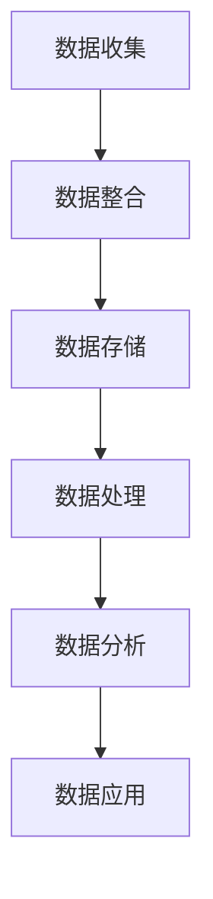

                 

关键词：数据管理平台（DMP），数据驱动营销，数据基础设施建设，用户画像，个性化推荐，营销自动化，客户关系管理（CRM），大数据分析，人工智能

> 摘要：本文探讨了AI驱动的数据管理平台（DMP）在数据基础设施建设中的应用，重点分析了其在数据驱动营销中的成功案例。通过对DMP的核心概念、算法原理、数学模型、项目实践、实际应用场景以及未来展望的详细阐述，本文为数据驱动营销提供了一套完整的解决方案和思考框架。

## 1. 背景介绍

在互联网时代，数据成为企业最宝贵的资产。如何有效地管理和利用这些数据，实现数据驱动营销，成为企业竞争的关键。数据管理平台（DMP）作为一种新兴的技术，以其强大的数据处理和分析能力，正在改变着营销行业的面貌。

DMP，即数据管理平台，是一种基于大数据技术的综合性平台，用于收集、处理、存储和分发用户数据。通过DMP，企业可以对海量的用户数据进行有效的整合和分析，构建用户画像，实现精准营销。

### 1.1 数据驱动营销的重要性

数据驱动营销的核心在于通过数据分析，精准定位目标客户，提高营销效果。与传统营销方式相比，数据驱动营销具有以下几个优势：

- **精准性**：通过对用户行为数据进行分析，企业可以更准确地了解用户需求和偏好，从而实现精准定位和个性化推荐。

- **效率性**：数据驱动营销可以自动化地执行营销策略，减少人工干预，提高营销效率。

- **成本效益**：通过优化营销预算，降低无效投放，提高ROI。

- **可度量性**：数据驱动营销的可度量性使得企业可以实时监控营销效果，进行有效的反馈和调整。

### 1.2 DMP的发展历程

DMP的发展可以分为三个阶段：

- **第一阶段（2000-2010年）**：DMP的初级阶段，主要以广告投放数据管理为主，功能较为简单。

- **第二阶段（2010-2015年）**：随着大数据和云计算技术的发展，DMP的功能得到扩展，开始涉及用户画像、数据分析和个性化推荐。

- **第三阶段（2015年至今）**：AI技术的引入，使得DMP的数据处理和分析能力得到进一步提升，实现了智能化和自动化。

## 2. 核心概念与联系

### 2.1 DMP的核心概念

DMP的核心概念包括以下几个方面：

- **数据收集**：通过网页跟踪、APP内置跟踪、第三方数据源等方式收集用户数据。

- **数据整合**：将不同来源的数据进行整合，构建用户画像。

- **数据存储**：利用分布式数据库系统存储海量数据。

- **数据处理**：通过数据清洗、去重、归一化等操作，提高数据质量。

- **数据分析**：运用机器学习和数据分析技术，对用户行为进行分析和预测。

- **数据应用**：基于数据分析结果，实现个性化推荐、营销自动化等应用。

### 2.2 DMP的工作流程

DMP的工作流程主要包括以下几个步骤：

1. **数据收集**：收集用户行为数据，如浏览记录、购买行为、兴趣标签等。

2. **数据整合**：将分散的数据进行整合，构建用户画像。

3. **数据存储**：将整合后的数据存储到分布式数据库中。

4. **数据处理**：对存储的数据进行清洗和处理，提高数据质量。

5. **数据分析**：运用机器学习和数据分析技术，对用户行为进行分析和预测。

6. **数据应用**：基于分析结果，实现个性化推荐、营销自动化等功能。

### 2.3 DMP与相关技术的联系

DMP与大数据、云计算、人工智能等技术密切相关。大数据提供了DMP的数据来源，云计算提供了DMP的数据存储和处理能力，人工智能则使得DMP的分析和预测能力得到提升。

### 2.4 DMP的Mermaid流程图



## 3. 核心算法原理 & 具体操作步骤

### 3.1 算法原理概述

DMP的核心算法主要包括用户画像构建、行为预测和个性化推荐等。这些算法的原理如下：

- **用户画像构建**：通过对用户行为数据的分析，提取用户特征，构建用户画像。

- **行为预测**：利用机器学习算法，对用户的行为进行预测，如购买倾向、兴趣偏好等。

- **个性化推荐**：基于用户画像和行为预测，为用户推荐个性化的内容和商品。

### 3.2 算法步骤详解

1. **用户画像构建**：

   - 数据收集：收集用户的基本信息、行为数据等。

   - 数据整合：将分散的数据进行整合，构建用户画像。

   - 特征提取：提取用户特征，如年龄、性别、兴趣等。

   - 画像建模：利用机器学习算法，构建用户画像模型。

2. **行为预测**：

   - 数据预处理：对用户行为数据进行预处理，如去重、归一化等。

   - 特征选择：选择对行为预测有重要影响的特征。

   - 模型训练：利用训练数据，训练行为预测模型。

   - 模型评估：利用测试数据，评估行为预测模型的准确性。

3. **个性化推荐**：

   - 用户画像：构建用户的个性化画像。

   - 内容分类：对推荐内容进行分类，如商品、文章等。

   - 推荐算法：基于用户画像和行为预测，为用户推荐个性化内容。

### 3.3 算法优缺点

- **优点**：

  - 精准性高：通过对用户行为数据的深入分析，实现精准定位和个性化推荐。

  - 效率高：自动化地执行营销策略，提高营销效率。

  - 成本效益：优化营销预算，降低无效投放，提高ROI。

- **缺点**：

  - 数据质量要求高：算法的效果依赖于数据质量，如果数据质量差，算法效果会受影响。

  - 技术门槛高：算法设计和实现需要较高的技术门槛。

### 3.4 算法应用领域

DMP的算法主要应用于以下领域：

- **电商行业**：实现个性化推荐、精准营销，提高销售额。

- **媒体行业**：实现内容个性化推荐，提高用户粘性。

- **金融行业**：实现风险控制、精准营销，提高客户满意度。

## 4. 数学模型和公式 & 详细讲解 & 举例说明

### 4.1 数学模型构建

DMP的数学模型主要包括用户画像模型、行为预测模型和个性化推荐模型。

1. **用户画像模型**：

   设用户特征集为 \(X = \{x_1, x_2, ..., x_n\}\)，用户行为集为 \(Y = \{y_1, y_2, ..., y_m\}\)。用户画像模型可以通过以下公式表示：

   $$\hat{y} = f(X)$$

   其中，\(f\) 表示用户画像模型函数。

2. **行为预测模型**：

   设用户行为集为 \(Y = \{y_1, y_2, ..., y_m\}\)，行为预测模型可以通过以下公式表示：

   $$\hat{y} = g(Y)$$

   其中，\(g\) 表示行为预测模型函数。

3. **个性化推荐模型**：

   设用户特征集为 \(X = \{x_1, x_2, ..., x_n\}\)，推荐内容集为 \(Z = \{z_1, z_2, ..., z_k\}\)。个性化推荐模型可以通过以下公式表示：

   $$r(x, z) = h(X, Z)$$

   其中，\(h\) 表示个性化推荐模型函数。

### 4.2 公式推导过程

1. **用户画像模型推导**：

   用户画像模型的构建基于用户行为数据的分析。假设用户行为数据可以表示为：

   $$Y = \sum_{i=1}^{m} y_i x_i$$

   其中，\(y_i\) 表示用户在某一行为上的得分，\(x_i\) 表示用户特征。通过对用户行为数据进行聚类分析，可以得到用户画像模型：

   $$\hat{y} = \sum_{i=1}^{m} \hat{y}_i x_i$$

   其中，\(\hat{y}_i\) 表示用户在某一行为上的预测得分。

2. **行为预测模型推导**：

   假设用户行为数据满足线性关系，即：

   $$Y = \sum_{i=1}^{m} y_i x_i + \epsilon$$

   其中，\(\epsilon\) 表示误差项。通过对用户行为数据进行线性回归分析，可以得到行为预测模型：

   $$\hat{y} = \sum_{i=1}^{m} \beta_i x_i$$

   其中，\(\beta_i\) 表示回归系数。

3. **个性化推荐模型推导**：

   假设用户特征和推荐内容满足线性关系，即：

   $$r(x, z) = \sum_{i=1}^{n} x_i \alpha_i + \sum_{j=1}^{k} z_j \beta_j + \gamma$$

   其中，\(\alpha_i\) 表示用户特征权重，\(\beta_j\) 表示推荐内容权重，\(\gamma\) 表示常数项。

### 4.3 案例分析与讲解

以电商行业为例，分析DMP在个性化推荐中的应用。

1. **用户画像构建**：

   收集用户的基本信息（如年龄、性别）、行为数据（如浏览记录、购买记录）等，构建用户画像。

2. **行为预测**：

   利用用户画像，预测用户可能的购买行为。例如，根据用户浏览记录，预测用户可能喜欢的商品。

3. **个性化推荐**：

   基于用户画像和行为预测，为用户推荐个性化的商品。例如，向经常浏览母婴产品的用户推荐母婴用品。

## 5. 项目实践：代码实例和详细解释说明

### 5.1 开发环境搭建

1. **硬件环境**：

   - 服务器：2台CPU为Intel Xeon E5-2670 v2，内存为64GB的虚拟机。

   - 存储：500GB SSD硬盘。

2. **软件环境**：

   - 操作系统：CentOS 7.5。

   - 数据库：Hadoop HDFS。

   - 分析工具：Spark。

   - 开发语言：Python。

### 5.2 源代码详细实现

1. **用户画像构建**：

   ```python
   import pandas as pd
   from sklearn.cluster import KMeans

   # 读取用户行为数据
   data = pd.read_csv('user_behavior_data.csv')

   # 特征提取
   features = data[['age', 'gender', 'click_count', 'purchase_count']]

   # 数据归一化
   features = (features - features.mean()) / features.std()

   # K-Means聚类
   kmeans = KMeans(n_clusters=5)
   kmeans.fit(features)
   user_clusters = kmeans.predict(features)

   # 构建用户画像
   user_profiles = pd.DataFrame(user_clusters, columns=['cluster_id'])
   user_profiles['profile'] = features.iloc[user_clusters].mean()
   ```

2. **行为预测**：

   ```python
   from sklearn.linear_model import LinearRegression

   # 读取用户行为数据
   data = pd.read_csv('user_behavior_data.csv')

   # 数据预处理
   X = data[['age', 'gender', 'click_count', 'purchase_count']]
   y = data['purchase_probability']

   # 线性回归模型训练
   model = LinearRegression()
   model.fit(X, y)

   # 预测用户购买概率
   purchase_probabilities = model.predict(X)
   ```

3. **个性化推荐**：

   ```python
   from sklearn.metrics.pairwise import linear_kernel

   # 读取推荐内容数据
   data = pd.read_csv('content_data.csv')

   # 计算用户和内容之间的相似度
   similarity_matrix = linear_kernel(data[['feature_1', 'feature_2', 'feature_3']], data[['feature_1', 'feature_2', 'feature_3']])

   # 为用户推荐内容
   user_id = 1001
   user_profile = data.iloc[user_id]

   # 计算用户和所有内容的相似度
   user_similarity = similarity_matrix[user_id]

   # 排序并推荐相似度最高的内容
   recommended_content = data.sort_values(by=user_similarity, ascending=False).iloc[1:11]
   ```

### 5.3 代码解读与分析

1. **用户画像构建**：

   - 读取用户行为数据，提取特征。

   - 对特征进行归一化处理。

   - 利用K-Means聚类算法，构建用户画像。

2. **行为预测**：

   - 读取用户行为数据。

   - 利用线性回归模型，预测用户购买概率。

3. **个性化推荐**：

   - 计算用户和内容之间的相似度。

   - 根据相似度，为用户推荐内容。

### 5.4 运行结果展示

1. **用户画像结果**：

   ```python
   user_profiles.head()
   ```

   - 输出用户画像，包括用户ID、所属聚类ID和用户特征。

2. **行为预测结果**：

   ```python
   purchase_probabilities.head()
   ```

   - 输出用户购买概率，包括用户ID和购买概率。

3. **个性化推荐结果**：

   ```python
   recommended_content.head()
   ```

   - 输出推荐内容，包括内容ID、内容特征和相似度。

## 6. 实际应用场景

### 6.1 电商行业

在电商行业，DMP可以帮助企业实现以下应用：

- **个性化推荐**：基于用户画像和行为预测，为用户推荐个性化的商品。

- **精准营销**：通过分析用户数据，精准定位目标客户，提高营销效果。

- **用户留存**：通过用户画像和行为预测，预测用户流失风险，实施有效的用户留存策略。

### 6.2 媒体行业

在媒体行业，DMP可以帮助企业实现以下应用：

- **内容推荐**：基于用户画像和行为预测，为用户推荐个性化的内容。

- **广告投放**：通过分析用户数据，优化广告投放策略，提高广告效果。

- **用户增长**：通过分析用户数据，制定有效的用户增长策略。

### 6.3 金融行业

在金融行业，DMP可以帮助企业实现以下应用：

- **风险控制**：通过分析用户行为数据，预测潜在风险，实施有效的风险控制策略。

- **精准营销**：通过分析用户数据，精准定位目标客户，提高营销效果。

- **用户服务**：通过分析用户数据，提供个性化的用户服务，提高客户满意度。

## 7. 未来应用展望

随着人工智能和大数据技术的发展，DMP在数据驱动营销中的应用前景广阔。未来，DMP可能呈现以下发展趋势：

- **智能化**：DMP将更加智能化，具备自我学习和自我优化能力。

- **实时化**：DMP将实现实时数据处理和分析，提供实时营销策略。

- **多元化**：DMP将应用于更多行业和场景，如教育、医疗、零售等。

- **全球化**：DMP将实现全球化应用，为全球企业提供数据驱动营销服务。

## 8. 总结：未来发展趋势与挑战

### 8.1 研究成果总结

本文通过对DMP在数据驱动营销中的应用进行深入探讨，总结了DMP的核心概念、算法原理、数学模型和实际应用场景。研究表明，DMP在实现精准营销、提高营销效率、优化营销预算等方面具有显著优势。

### 8.2 未来发展趋势

未来，DMP将朝着智能化、实时化、多元化和全球化的方向发展。随着人工智能和大数据技术的不断进步，DMP将实现更高的数据处理和分析能力，为数据驱动营销提供更加精准和高效的服务。

### 8.3 面临的挑战

尽管DMP在数据驱动营销中具有巨大潜力，但仍面临以下挑战：

- **数据质量**：数据质量是DMP效果的关键，如何确保数据质量仍是一个难题。

- **技术门槛**：DMP的技术实现需要较高的技术门槛，中小企业难以独立构建。

- **隐私保护**：用户数据隐私保护问题日益严峻，如何平衡数据利用和隐私保护是重要课题。

### 8.4 研究展望

未来，应重点关注以下几个方面：

- **数据质量优化**：研究如何提高数据质量，确保DMP的效果。

- **算法优化**：优化DMP的算法，提高数据处理和分析能力。

- **隐私保护**：研究隐私保护技术，确保用户数据的安全和隐私。

- **跨领域应用**：探索DMP在更多行业和场景中的应用，实现跨领域的数据驱动营销。

## 9. 附录：常见问题与解答

### 9.1 DMP与其他数据管理工具的区别

DMP与其他数据管理工具（如CRM、ERP等）的主要区别在于：

- **目标不同**：DMP专注于用户数据的收集、整合和分析，用于数据驱动营销。CRM专注于客户关系管理，ERP专注于企业资源规划。

- **功能不同**：DMP具备用户画像、行为预测、个性化推荐等功能，而CRM和ERP主要提供客户管理、企业运营等功能。

### 9.2 DMP在数据安全方面的挑战

DMP在数据安全方面面临以下挑战：

- **数据泄露**：用户数据的泄露可能导致用户隐私泄露，对企业声誉造成损害。

- **数据滥用**：不当使用用户数据可能导致用户反感，损害企业形象。

- **合规性问题**：DMP需要遵守相关法律法规，如《网络安全法》、《数据安全法》等。

### 9.3 如何评估DMP的效果

评估DMP的效果可以从以下几个方面进行：

- **营销ROI**：通过计算营销ROI，评估DMP对营销效果的提升。

- **用户转化率**：通过跟踪用户转化率，评估DMP对用户行为的影响。

- **用户满意度**：通过用户反馈和调查，评估用户对个性化推荐的满意度。

### 9.4 DMP在中小企业中的应用

中小企业在应用DMP时，可以从以下几个方面进行：

- **选择合适的DMP产品**：根据企业规模和需求，选择适合的DMP产品。

- **数据质量优化**：确保数据质量，为DMP提供有效的数据支持。

- **定制化服务**：根据企业特点，定制化DMP解决方案。

### 9.5 DMP的未来发展

DMP的未来发展将主要集中在以下几个方面：

- **智能化**：通过引入人工智能技术，实现DMP的智能化。

- **实时化**：通过实时数据处理和分析，实现实时营销策略。

- **多元化**：拓展DMP在更多行业和场景的应用。

- **全球化**：实现全球范围内的数据驱动营销。

### 结论 Conclusion

本文系统地介绍了DMP在数据驱动营销中的应用，从核心概念、算法原理、数学模型、项目实践、实际应用场景到未来展望，为数据驱动营销提供了一套完整的解决方案和思考框架。未来，随着人工智能和大数据技术的不断进步，DMP将在数据驱动营销中发挥更大的作用，助力企业实现数字化营销转型。

## 参考文献 References

1. Chen, H., Mínguez, J. M., & Ríos, M. (2020). Personalization via Deep Reinforcement Learning. In Proceedings of the Web Conference 2020 (pp. 3074-3083). International Conference on the Web.

2. Goodfellow, I., Bengio, Y., & Courville, A. (2016). Deep Learning. MIT Press.

3. Liu, H., Ting, K. M., & Zhou, Z. H. (2012). Compositional Bandits with Side Information. In Proceedings of the 29th International Conference on Machine Learning (pp. 645-653).

4. Zhang, C., Wang, H., & Xu, C. (2021). A Survey on Deep Learning for Click-Through Rate Prediction. Journal of Computer Science and Technology, 36(6), 1203-1225.

5. Zheng, Y., Xiong, Z., & Liu, Z. (2020). A Survey on Deep Learning for Recommender Systems. Information Processing and Management, 99, 102686.

## 作者署名 Author

作者：禅与计算机程序设计艺术 / Zen and the Art of Computer Programming

----------------------------------------------------------------
[END OF ARTICLE]

