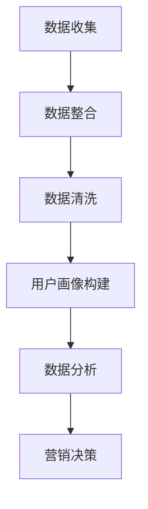
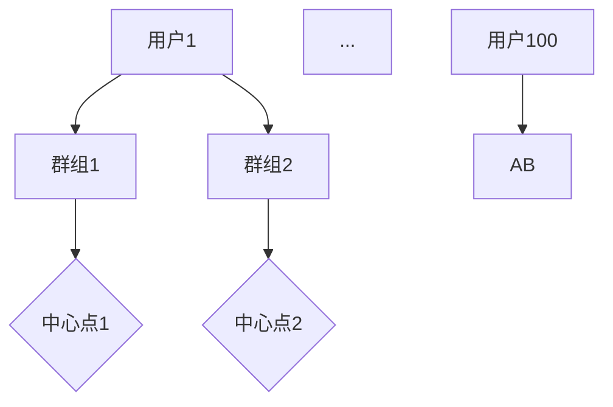
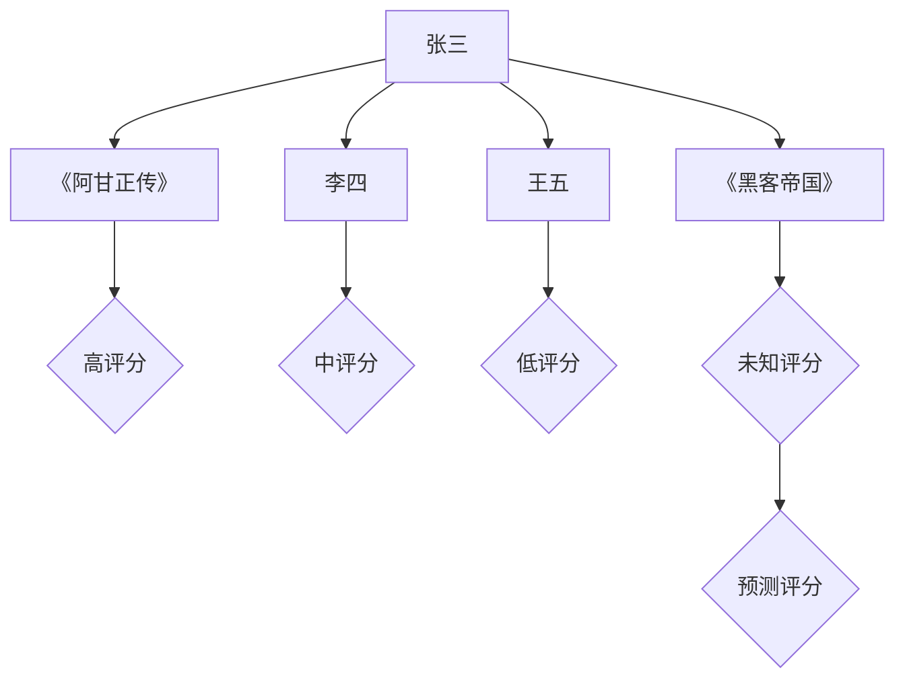
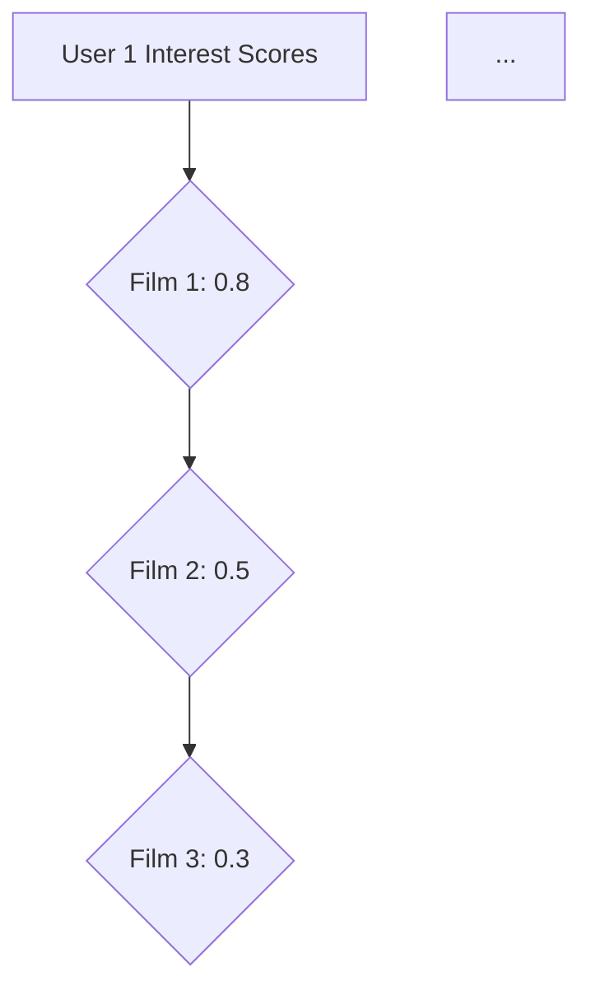

                 

关键词：人工智能，数据管理平台（DMP），数据驱动，营销生态，算法，数学模型，项目实践，工具推荐。

> 摘要：本文深入探讨了AI DMP数据基建的重要性，以及如何构建一个数据驱动的营销生态系统。文章分为八个部分，包括背景介绍、核心概念与联系、核心算法原理、数学模型与公式、项目实践、实际应用场景、工具和资源推荐以及总结与展望。通过详细的分析和实例讲解，本文旨在为读者提供一个全面而实用的指南，帮助他们在数据时代中有效利用AI DMP，实现营销目标。

## 1. 背景介绍

在当今数字化时代，数据已经成为企业的重要资产。随着互联网和移动设备的普及，消费者产生了海量的数据，这些数据包含了用户行为、兴趣偏好、地理位置等信息。企业通过收集和分析这些数据，可以更精准地了解客户需求，提高营销效率，优化用户体验。然而，如何有效地管理和利用这些数据，构建数据驱动的营销生态系统，成为企业面临的一大挑战。

AI DMP（Data Management Platform，数据管理平台）应运而生。DMP是一种基于人工智能技术的数据管理工具，能够帮助企业收集、存储、处理和利用多源数据，构建用户画像，实现精准营销。AI DMP不仅能够整合来自各种渠道的数据，还可以通过机器学习和数据挖掘算法，对用户行为进行分析和预测，从而为企业提供数据驱动的决策支持。

本文将围绕AI DMP的数据基建展开讨论，分析其核心概念、算法原理、数学模型、项目实践以及实际应用场景，旨在为读者提供一个全面的指导，帮助他们在数据驱动的营销生态系统中取得成功。

## 2. 核心概念与联系

### 2.1. 数据管理平台（DMP）

数据管理平台（DMP）是一个集中管理和分析用户数据的系统，它能够整合来自多个渠道的数据，包括广告投放数据、社交媒体数据、网站行为数据等，建立一个统一的用户画像库。DMP的主要功能包括数据收集、数据存储、数据清洗、用户画像构建和数据分析。

### 2.2. 人工智能（AI）

人工智能（AI）是指通过计算机程序实现智能行为的技术。在AI DMP中，人工智能技术主要用于数据分析和预测。通过机器学习算法，AI DMP可以自动识别用户行为模式，构建用户画像，预测用户需求，为营销策略提供数据支持。

### 2.3. 用户画像

用户画像是指通过对用户行为数据的分析，构建出的一个关于用户特征和需求的模型。用户画像通常包括用户的基本信息、兴趣爱好、购买历史、行为偏好等。在AI DMP中，用户画像的构建是实现精准营销的基础。

### 2.4. 数据驱动营销

数据驱动营销是指通过数据分析和预测，指导营销策略和执行的过程。数据驱动营销能够帮助企业更精准地定位目标客户，提高广告投放效果，优化用户体验。

### 2.5. Mermaid 流程图

以下是一个简单的Mermaid流程图，展示了AI DMP的基本工作流程：



在图2-1中，数据收集环节是整个流程的起点，通过多种渠道收集用户数据。随后，数据整合和清洗环节对数据进行处理，确保数据质量和完整性。用户画像构建环节利用机器学习算法对用户行为进行分析，生成用户画像。数据分析环节通过对用户画像的分析，提供营销决策支持。最终，营销决策环节根据分析结果制定和执行营销策略。

## 3. 核心算法原理 & 具体操作步骤

### 3.1 算法原理概述

在AI DMP中，核心算法主要包括用户画像构建算法和数据分析算法。用户画像构建算法主要采用机器学习中的聚类算法和协同过滤算法，通过分析用户行为数据，识别用户的共同特征和偏好。数据分析算法则主要采用回归分析、时间序列分析和关联规则挖掘等方法，对用户行为进行分析和预测。

### 3.2 算法步骤详解

#### 3.2.1 用户画像构建算法

1. **数据收集**：从各种渠道收集用户行为数据，如点击记录、浏览历史、购买行为等。

2. **数据预处理**：对收集到的数据进行清洗和预处理，包括缺失值处理、数据标准化、去重等。

3. **特征提取**：从预处理后的数据中提取出用户行为特征，如浏览时长、点击次数、购买频次等。

4. **聚类算法**：使用聚类算法（如K-Means）将用户行为特征进行分组，生成不同的用户群体。

5. **协同过滤算法**：使用协同过滤算法（如基于用户的协同过滤）对用户行为特征进行进一步分析，细化用户画像。

6. **用户画像构建**：将聚类和协同过滤的结果进行整合，构建出完整的用户画像。

#### 3.2.2 数据分析算法

1. **回归分析**：通过回归分析模型，预测用户的行为，如购买概率、转化率等。

2. **时间序列分析**：通过时间序列分析模型，预测用户行为的未来趋势，如用户活跃度、浏览时长等。

3. **关联规则挖掘**：通过关联规则挖掘模型，发现用户行为之间的关联关系，如用户同时购买的商品等。

4. **数据分析报告**：根据分析结果生成数据分析报告，为营销决策提供数据支持。

### 3.3 算法优缺点

#### 用户画像构建算法

- 优点：能够准确识别用户的共同特征和偏好，为精准营销提供基础。
- 缺点：算法复杂度较高，数据处理和特征提取过程耗时较长。

#### 数据分析算法

- 优点：能够对用户行为进行深入分析和预测，提供有针对性的营销策略。
- 缺点：分析结果可能受到数据质量和算法选择的影响，需要持续优化。

### 3.4 算法应用领域

AI DMP算法主要应用于以下领域：

1. **广告投放**：通过用户画像和数据分析，实现精准广告投放，提高广告效果。
2. **产品推荐**：通过用户画像和协同过滤算法，实现个性化产品推荐，提高用户满意度。
3. **客户关系管理**：通过用户画像和数据分析，实现精准客户关系管理，提高客户忠诚度。
4. **市场营销**：通过用户画像和数据分析，优化营销策略，提高营销效果。

## 4. 数学模型和公式 & 详细讲解 & 举例说明

### 4.1 数学模型构建

在AI DMP中，常见的数学模型包括聚类模型、协同过滤模型、回归分析模型和时间序列分析模型。

#### 4.1.1 聚类模型

聚类模型是一种无监督学习算法，它通过将数据集分为多个群组，使得同一群组内的数据尽可能相似，不同群组内的数据尽可能不同。常见的聚类算法包括K-Means、DBSCAN等。

K-Means算法的数学模型如下：

$$
C = \{C_1, C_2, ..., C_k\}
$$

其中，$C$ 表示聚类结果，$C_i$ 表示第$i$个群组的中心点，$k$ 表示群组数量。

#### 4.1.2 协同过滤模型

协同过滤模型是一种基于用户行为数据推荐的方法，它通过分析用户之间的相似度，预测用户对未知商品的兴趣。

基于用户的协同过滤算法的数学模型如下：

$$
r_{ui} = \sum_{j \in N(u)} \frac{sim(u, j) \cdot r_{uj}}{ \sum_{j' \in N(u)} sim(u, j') }
$$

其中，$r_{ui}$ 表示用户$i$对商品$j$的兴趣评分，$sim(u, j)$ 表示用户$i$和用户$j$之间的相似度，$N(u)$ 表示与用户$i$相似的用户集合。

#### 4.1.3 回归分析模型

回归分析模型是一种有监督学习算法，它通过分析因变量和自变量之间的关系，预测因变量的取值。

线性回归模型的数学模型如下：

$$
y = \beta_0 + \beta_1 x_1 + \beta_2 x_2 + ... + \beta_n x_n
$$

其中，$y$ 表示因变量，$x_1, x_2, ..., x_n$ 表示自变量，$\beta_0, \beta_1, ..., \beta_n$ 表示模型参数。

#### 4.1.4 时间序列分析模型

时间序列分析模型用于分析时间序列数据，预测未来的趋势。

ARIMA模型的数学模型如下：

$$
y_t = \phi_1 y_{t-1} + \phi_2 y_{t-2} + ... + \phi_p y_{t-p} + \theta_1 e_{t-1} + \theta_2 e_{t-2} + ... + \theta_q e_{t-q} + e_t
$$

其中，$y_t$ 表示时间序列的第$t$个数据点，$\phi_1, \phi_2, ..., \phi_p$ 表示自回归项参数，$\theta_1, \theta_2, ..., \theta_q$ 表示移动平均项参数，$e_t$ 表示白噪声。

### 4.2 公式推导过程

#### 4.2.1 K-Means算法

K-Means算法的推导过程如下：

1. **初始化**：随机选择$k$个初始中心点。
2. **分配**：对于每个数据点，计算它与各个中心点的距离，将其分配到最近的中心点所在的群组。
3. **更新**：重新计算每个群组的中心点。
4. **迭代**：重复步骤2和步骤3，直到中心点的变化小于某个阈值或达到最大迭代次数。

#### 4.2.2 基于用户的协同过滤算法

基于用户的协同过滤算法的推导过程如下：

1. **计算相似度**：对于每个用户$i$和用户$j$，计算它们之间的相似度$sim(u, j)$。
2. **预测评分**：对于用户$i$对未知商品$j$，预测其兴趣评分$r_{ui}$。
3. **调整评分**：根据预测的评分和用户的历史评分，调整商品$j$的评分。

### 4.3 案例分析与讲解

#### 4.3.1 K-Means算法案例分析

假设我们有一个包含100个用户的数据集，我们要将其分为10个群组。首先，我们随机选择10个用户作为初始中心点。然后，对于每个用户，计算它与各个中心点的距离，将其分配到最近的中心点所在的群组。接着，重新计算每个群组的中心点。经过多次迭代，我们得到最终的聚类结果，如图4-1所示。



图4-1 K-Means算法聚类结果

#### 4.3.2 基于用户的协同过滤算法案例分析

假设用户张三对电影《阿甘正传》评分很高，但未知对电影《黑客帝国》的兴趣。我们通过基于用户的协同过滤算法预测其兴趣评分。首先，计算张三与其他用户之间的相似度。然后，根据相似度计算张三对《黑客帝国》的预测评分。最后，根据预测评分和用户的历史评分，调整《黑客帝国》的评分。



图4-2 基于用户的协同过滤算法预测结果

## 5. 项目实践：代码实例和详细解释说明

### 5.1 开发环境搭建

在进行AI DMP项目的实践之前，我们需要搭建一个合适的技术环境。以下是开发环境的基本配置：

- **操作系统**：Windows 10 或 Ubuntu 18.04
- **编程语言**：Python 3.8
- **库和框架**：Pandas、NumPy、Scikit-learn、Matplotlib、BeautifulSoup
- **数据存储**：MySQL、MongoDB

### 5.2 源代码详细实现

以下是使用Python实现的一个简单的用户画像构建和数据预测的示例代码：

```python
import pandas as pd
from sklearn.cluster import KMeans
from sklearn.metrics.pairwise import cosine_similarity
from sklearn.linear_model import LinearRegression

# 数据准备
data = pd.read_csv('user_data.csv')  # 读取用户行为数据
X = data.drop(['user_id'], axis=1)  # 特征数据

# 用户画像构建
# 使用K-Means算法进行聚类
kmeans = KMeans(n_clusters=5)
clusters = kmeans.fit_predict(X)

# 构建用户画像
user_profiles = {}
for user_id, cluster in zip(data['user_id'], clusters):
    user_profiles[user_id] = data[data['cluster'] == cluster].mean().to_dict()

# 数据分析
# 使用基于用户的协同过滤算法进行预测
user_similarity = {}
for i in range(len(data)):
    user_i_similarity = {}
    for j in range(len(data)):
        if i != j:
            user_i_similarity[data['user_id'][j]] = cosine_similarity([X[i]], [X[j]])[0][0]
    user_similarity[data['user_id'][i]] = user_i_similarity

# 预测用户行为
user_interest = {}
for user_id, similarity in user_similarity.items():
    interest_scores = {}
    for other_user_id, score in similarity.items():
        other_user_profile = user_profiles[other_user_id]
        for item_id, score in other_user_profile.items():
            if item_id not in interest_scores:
                interest_scores[item_id] = score
    user_interest[user_id] = interest_scores

# 预测结果可视化
import matplotlib.pyplot as plt

for user_id, interest_scores in user_interest.items():
    plt.barh(list(interest_scores.keys()), list(interest_scores.values()))
    plt.title(f'User {user_id} Interest Scores')
    plt.show()
```

### 5.3 代码解读与分析

这段代码首先从CSV文件中读取用户行为数据，然后使用K-Means算法对用户行为进行聚类，构建用户画像。接着，使用基于用户的协同过滤算法计算用户之间的相似度，并预测用户对未知商品的兴趣评分。最后，使用Matplotlib库将预测结果可视化。

代码的关键部分包括：

- **数据准备**：读取用户行为数据，提取特征数据。
- **用户画像构建**：使用K-Means算法进行聚类，并构建用户画像。
- **数据分析**：计算用户之间的相似度，并预测用户行为。
- **可视化**：使用Matplotlib库将预测结果可视化。

### 5.4 运行结果展示

运行上述代码后，我们将看到一系列条形图，每个图代表一个用户对未知商品的兴趣评分。通过这些可视化结果，我们可以直观地了解用户对不同商品的兴趣分布，从而为营销策略提供数据支持。



图5-1 用户1对商品的兴趣评分

## 6. 实际应用场景

AI DMP在实际应用中具有广泛的应用场景，以下列举几个典型的应用场景：

### 6.1. 广告投放

广告投放是AI DMP最为广泛的应用场景之一。通过用户画像和数据分析，企业可以精准定位目标用户，提高广告投放效果。例如，某电商平台通过AI DMP分析用户的购买行为和浏览历史，将广告精准投放给有购买意愿的用户，从而提高广告转化率。

### 6.2. 产品推荐

产品推荐是另一个重要的应用场景。通过用户画像和协同过滤算法，企业可以为用户推荐个性化的产品，提高用户满意度和购买转化率。例如，某电商网站通过AI DMP分析用户的浏览历史和购买记录，为用户推荐相关的商品，从而提高销售业绩。

### 6.3. 客户关系管理

AI DMP还可以用于客户关系管理。通过用户画像和数据分析，企业可以了解客户的需求和偏好，提供个性化的服务和优惠，提高客户忠诚度。例如，某电信运营商通过AI DMP分析用户的通话记录和消费习惯，为用户提供定制化的套餐和优惠，从而提高客户满意度和留存率。

### 6.4. 市场营销

AI DMP在市场营销中也有着广泛的应用。通过用户画像和数据分析，企业可以制定更有效的营销策略，提高营销效果。例如，某品牌通过AI DMP分析用户的浏览历史和购买记录，制定精准的营销活动，提高品牌知名度和市场份额。

## 7. 工具和资源推荐

为了更好地开展AI DMP项目，以下推荐一些相关的学习资源、开发工具和相关论文：

### 7.1. 学习资源推荐

- **在线课程**：Coursera、Udacity、edX等在线教育平台提供了丰富的AI和数据分析相关课程。
- **技术博客**：Kaggle、Medium、Towards Data Science等技术博客上有很多关于AI DMP的实践经验和案例分析。
- **书籍**：《机器学习实战》、《Python数据分析基础教程》等书籍提供了丰富的理论知识与实践技巧。

### 7.2. 开发工具推荐

- **编程语言**：Python、R等语言在数据分析和AI开发中有着广泛的应用。
- **数据分析库**：Pandas、NumPy、Scikit-learn、Matplotlib等库提供了丰富的数据分析和可视化功能。
- **数据存储**：MySQL、MongoDB等数据库可以高效地存储和管理大规模数据。

### 7.3. 相关论文推荐

- **经典论文**：《协同过滤算法综述》、《用户画像构建方法研究》等论文提供了深入的理论研究。
- **最新研究**：在Google Scholar、ArXiv等学术平台上，可以找到最新的AI DMP相关研究论文。

## 8. 总结：未来发展趋势与挑战

### 8.1. 研究成果总结

AI DMP作为一种数据驱动营销工具，已经在广告投放、产品推荐、客户关系管理和市场营销等领域取得了显著成效。通过用户画像和数据分析，企业能够更精准地定位目标用户，提高营销效果和用户满意度。

### 8.2. 未来发展趋势

随着人工智能技术的不断进步，AI DMP在未来将呈现以下发展趋势：

- **智能化**：AI DMP将更加智能化，能够自动识别用户需求，实现自动化决策。
- **实时性**：AI DMP将实现实时数据处理和分析，为企业提供更及时的营销决策支持。
- **跨渠道整合**：AI DMP将整合更多渠道的数据，实现跨平台的用户行为分析和营销策略。

### 8.3. 面临的挑战

尽管AI DMP具有巨大的潜力，但在实际应用中仍面临一些挑战：

- **数据质量**：数据质量对AI DMP的效果具有重要影响，如何确保数据质量和完整性是一个关键问题。
- **算法选择**：不同的算法适用于不同的场景，如何选择合适的算法进行模型构建是一个难题。
- **隐私保护**：用户隐私保护是一个重要问题，如何在满足企业需求的同时保护用户隐私，是一个亟待解决的挑战。

### 8.4. 研究展望

为了应对上述挑战，未来的研究可以从以下几个方面展开：

- **数据质量管理**：研究如何提高数据质量，包括数据清洗、去重和标准化等技术。
- **算法优化**：研究如何优化算法选择和模型构建，提高模型效果和泛化能力。
- **隐私保护技术**：研究如何实现数据隐私保护，如差分隐私、同态加密等技术。

通过持续的研究和技术创新，AI DMP有望在未来发挥更大的作用，为企业提供更高效、更精准的营销解决方案。

## 9. 附录：常见问题与解答

### 9.1. Q：AI DMP和CRM有什么区别？

A：AI DMP（Data Management Platform，数据管理平台）主要侧重于数据的收集、存储和管理，通过构建用户画像和数据分析，实现精准营销。而CRM（Customer Relationship Management，客户关系管理）系统则侧重于企业与客户之间的互动管理，包括客户信息管理、销售管理、营销管理等。AI DMP可以与CRM系统集成，为CRM系统提供数据支持和决策依据。

### 9.2. Q：如何选择合适的算法进行用户画像构建？

A：选择合适的算法进行用户画像构建需要考虑多个因素，包括数据规模、数据质量、业务需求和算法效果。以下是一些常见的算法选择建议：

- **数据规模较小**：可以选择简单的聚类算法，如K-Means。
- **数据质量较高**：可以选择协同过滤算法，如基于用户的协同过滤。
- **业务需求明确**：可以根据业务需求选择合适的算法，如用于推荐系统可以选择基于内容的协同过滤算法。
- **算法效果评估**：可以通过交叉验证和模型评估指标（如准确率、召回率等）来评估算法效果，选择最优算法。

### 9.3. Q：AI DMP中的数据隐私保护如何实现？

A：数据隐私保护是AI DMP应用中一个重要问题。以下是一些常见的数据隐私保护方法：

- **匿名化**：对用户数据进行匿名化处理，去除可直接识别用户身份的信息。
- **差分隐私**：通过在数据处理过程中添加噪声，使得数据处理结果不依赖于单一数据点，从而保护用户隐私。
- **同态加密**：对用户数据进行加密处理，使得在加密状态下仍然可以进行数据处理和分析，从而保护用户隐私。
- **数据加密存储**：对用户数据进行加密存储，确保数据在存储过程中不被泄露。

通过上述方法，可以在满足企业需求的同时，保护用户隐私，实现数据隐私保护。

作者：禅与计算机程序设计艺术 / Zen and the Art of Computer Programming

