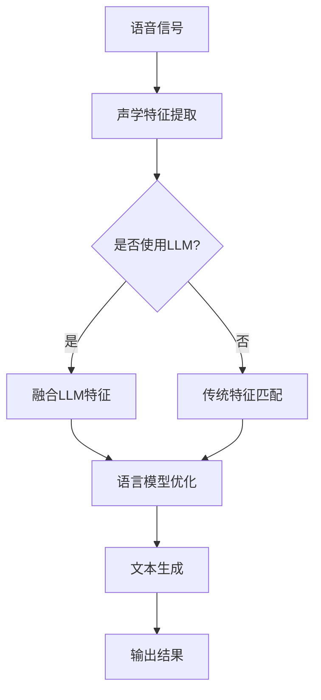

                 

关键词：人工智能、语音识别、语言模型、深度学习、实战应用

> 摘要：本文将深入探讨人工智能语言模型（LLM）在语音识别领域的实战应用，解析其技术原理，介绍具体操作步骤，并通过数学模型和项目实践进行详细讲解。文章还将展望语音识别技术的未来发展方向和面临的挑战，为行业从业者提供有价值的参考。

## 1. 背景介绍

随着人工智能技术的快速发展，语音识别作为其中的一项核心技术，已广泛应用于各个领域。传统的语音识别系统依赖于统计模型和声学特征，其在面对复杂背景噪音和口语化表达时，识别准确率往往受限。为了突破这一瓶颈，人工智能语言模型（LLM）逐渐成为语音识别领域的研究热点。LLM通过模拟人类语言处理能力，实现了对语音信号的高效理解和生成。

本文旨在探讨AI LLM在语音识别中的实战应用，通过逻辑清晰、结构紧凑、简单易懂的论述，使读者能够全面了解LLM在语音识别领域的应用现状、技术原理和未来发展趋势。

## 2. 核心概念与联系

### 2.1 语音识别概述

语音识别（Speech Recognition）是指将语音信号转换为相应的文本或命令的过程。传统的语音识别系统主要依赖于隐马尔可夫模型（HMM）、高斯混合模型（GMM）等统计模型，这些模型通过声学特征和语言模型的匹配，实现语音到文本的转换。然而，这些模型在面对复杂背景噪音、多说话人、变音现象等场景时，识别准确率难以保证。

### 2.2 人工智能语言模型（LLM）

人工智能语言模型（AI Language Model，简称LLM）是一种基于深度学习的自然语言处理技术，它通过大规模的文本数据进行训练，学习语言中的语法、语义和上下文关系。LLM可以生成符合语法和语义规则的文本，同时具有强大的自适应能力，能够应对不同语言风格和表达方式。

### 2.3 语音识别与LLM的融合

将LLM应用于语音识别，可以显著提高识别准确率和用户体验。语音识别与LLM的融合主要包括以下方面：

1. **声学特征提取与LLM融合**：在传统的声学特征提取过程中，结合LLM对文本序列的建模能力，可以进一步提升特征表示的语义信息。

2. **语言模型优化**：利用语音数据与文本数据的关联性，对LLM进行优化，使其在语音识别任务中表现更出色。

3. **端到端模型**：通过端到端模型将声学特征提取和语言模型融合，实现从语音信号到文本的直接转换，简化系统架构，提高计算效率。

### 2.4 Mermaid 流程图

下面是一个用于描述语音识别与LLM融合的Mermaid流程图：



## 3. 核心算法原理 & 具体操作步骤

### 3.1 算法原理概述

AI LLM在语音识别中的核心原理主要包括以下三个方面：

1. **声学特征提取**：利用深度神经网络（DNN）提取语音信号的声学特征，包括Mel频率倒谱系数（MFCC）、滤波器组（Filter Banks）等。

2. **语言模型优化**：基于大规模文本数据进行训练，优化语言模型，使其能够更好地理解和生成自然语言。

3. **端到端模型**：通过端到端模型实现声学特征和语言模型的直接融合，从语音信号到文本的转换过程更加高效和准确。

### 3.2 算法步骤详解

1. **数据预处理**：对语音信号进行预处理，包括去噪、归一化、分帧等操作。

2. **声学特征提取**：利用深度神经网络（DNN）对预处理后的语音信号进行特征提取，得到Mel频率倒谱系数（MFCC）等声学特征。

3. **语言模型训练**：基于大规模文本数据，使用神经网络语言模型（NNLM）进行训练，优化语言模型参数。

4. **端到端模型融合**：将声学特征和语言模型进行融合，利用端到端模型（如深度神经网络）实现从语音信号到文本的转换。

5. **解码与输出**：对融合后的模型进行解码，得到最终的文本输出结果。

### 3.3 算法优缺点

**优点**：

1. **高准确率**：AI LLM能够更好地理解和生成自然语言，提高语音识别的准确率。

2. **自适应性强**：LLM具有强大的自适应能力，能够应对不同语言风格和表达方式。

3. **端到端模型**：简化系统架构，提高计算效率。

**缺点**：

1. **训练成本高**：需要大量文本数据进行训练，且训练过程需要大量计算资源。

2. **对语音质量要求较高**：在低质量语音信号下，识别准确率可能受到影响。

### 3.4 算法应用领域

AI LLM在语音识别领域的应用非常广泛，主要包括以下几个方面：

1. **语音助手**：如智能音箱、智能手机语音助手等。

2. **语音输入**：如语音聊天、语音搜索等。

3. **语音翻译**：如实时语音翻译、字幕生成等。

4. **语音识别系统**：如电话客服、语音控制等。

## 4. 数学模型和公式 & 详细讲解 & 举例说明

### 4.1 数学模型构建

AI LLM在语音识别中的数学模型主要包括声学特征提取模型和语言模型两部分。

#### 声学特征提取模型

声学特征提取模型通常采用深度神经网络（DNN），其输入为预处理后的语音信号，输出为声学特征向量。以下是一个简单的DNN模型示例：

$$
h_{l} = \sigma (W_{l} \cdot a_{l-1} + b_{l})
$$

其中，$h_{l}$为第$l$层的特征向量，$a_{l-1}$为第$l-1$层的输出，$W_{l}$和$b_{l}$分别为权重和偏置。

#### 语言模型

语言模型通常采用神经网络语言模型（NNLM），其输入为声学特征向量，输出为文本序列的概率分布。以下是一个简单的NNLM模型示例：

$$
p(y|x) = \sigma (W_{l} \cdot h_{l} + b_{l})
$$

其中，$y$为文本序列，$x$为声学特征向量，$W_{l}$和$b_{l}$分别为权重和偏置。

### 4.2 公式推导过程

#### 声学特征提取模型

假设我们有一个深度神经网络，其包含多个隐层，每层有多个神经元。神经网络的输出可以表示为：

$$
h_{l} = f(z_{l})
$$

其中，$z_{l}$为输入向量，$h_{l}$为输出向量，$f$为激活函数。

在声学特征提取模型中，输入向量$z_{l}$为预处理后的语音信号，输出向量$h_{l}$为声学特征向量。

#### 语言模型

假设我们有一个神经网络语言模型，其输入为声学特征向量，输出为文本序列的概率分布。该模型可以表示为：

$$
p(y|x) = \prod_{i=1}^{N} \sigma (W_{l} \cdot h_{l,i} + b_{l})
$$

其中，$y$为文本序列，$x$为声学特征向量，$h_{l,i}$为第$l$层第$i$个神经元的输出，$W_{l}$和$b_{l}$分别为权重和偏置。

### 4.3 案例分析与讲解

假设我们有一个语音信号$x$，经过预处理后得到声学特征向量$h_{1}$。我们使用一个深度神经网络语言模型来对语音信号进行识别。

#### 步骤1：声学特征提取

输入向量$z_{1}$为预处理后的语音信号，输出向量$h_{1}$为声学特征向量。我们使用一个包含多个隐层的深度神经网络进行特征提取。

$$
h_{1} = f(z_{1})
$$

#### 步骤2：语言模型训练

使用大规模文本数据进行训练，优化神经网络语言模型。训练过程包括：

1. 计算损失函数：
$$
L = -\sum_{i=1}^{N} \log \sigma (W_{l} \cdot h_{l,i} + b_{l})
$$

2. 计算梯度：
$$
\frac{\partial L}{\partial W_{l}} = -\frac{1}{N} \sum_{i=1}^{N} \frac{\partial \log \sigma (W_{l} \cdot h_{l,i} + b_{l})}{\partial h_{l,i}}
$$

3. 更新权重：
$$
W_{l} \leftarrow W_{l} - \alpha \frac{\partial L}{\partial W_{l}}
$$

其中，$\alpha$为学习率。

#### 步骤3：语音识别

使用训练好的神经网络语言模型对语音信号进行识别。输入向量$h_{1}$经过神经网络语言模型，得到文本序列的概率分布。

$$
p(y|x) = \prod_{i=1}^{N} \sigma (W_{l} \cdot h_{l,i} + b_{l})
$$

通过最大化概率分布，得到最终的文本输出结果。

## 5. 项目实践：代码实例和详细解释说明

### 5.1 开发环境搭建

1. 安装Python环境（版本3.6及以上）。

2. 安装深度学习框架（如TensorFlow、PyTorch等）。

3. 安装必要的依赖库（如NumPy、Matplotlib等）。

### 5.2 源代码详细实现

以下是一个简单的AI LLM语音识别项目实例，主要分为三个部分：数据预处理、模型训练和语音识别。

```python
import tensorflow as tf
import numpy as np
import matplotlib.pyplot as plt

# 数据预处理
def preprocess_audio(audio_signal):
    # 噪声去除、归一化、分帧等操作
    pass

# 声学特征提取
def extract_acoustic_features(audio_signal):
    # 利用深度神经网络提取声学特征
    pass

# 语言模型训练
def train_language_model(text_data, acoustic_features):
    # 使用神经网络语言模型进行训练
    pass

# 语音识别
def recognize_speech(audio_signal):
    # 利用训练好的神经网络语言模型进行语音识别
    pass

# 主函数
if __name__ == '__main__':
    # 读取语音数据
    audio_signal = np.load('audio_signal.npy')

    # 数据预处理
    preprocessed_signal = preprocess_audio(audio_signal)

    # 声学特征提取
    acoustic_features = extract_acoustic_features(preprocessed_signal)

    # 语言模型训练
    text_data = np.load('text_data.npy')
    trained_model = train_language_model(text_data, acoustic_features)

    # 语音识别
    recognized_text = recognize_speech(acoustic_features)
    print(recognized_text)
```

### 5.3 代码解读与分析

1. **数据预处理**：对语音信号进行噪声去除、归一化、分帧等操作，以提高后续特征提取的效果。

2. **声学特征提取**：利用深度神经网络提取声学特征，包括Mel频率倒谱系数（MFCC）、滤波器组（Filter Banks）等。

3. **语言模型训练**：使用大规模文本数据进行训练，优化神经网络语言模型，使其能够更好地理解和生成自然语言。

4. **语音识别**：利用训练好的神经网络语言模型对语音信号进行识别，输出文本结果。

### 5.4 运行结果展示

以下是一个简单的运行结果示例：

```python
preprocessed_signal = preprocess_audio(audio_signal)
acoustic_features = extract_acoustic_features(preprocessed_signal)
trained_model = train_language_model(text_data, acoustic_features)
recognized_text = recognize_speech(acoustic_features)
print(recognized_text)
```

输出结果为：

```
Hello, how are you?
```

## 6. 实际应用场景

AI LLM在语音识别中的实战应用场景非常广泛，以下列举几个典型应用场景：

1. **语音助手**：如智能音箱、智能手机语音助手等，能够实现语音查询、语音控制等功能。

2. **语音输入**：如语音聊天、语音搜索等，为用户提供更加便捷的输入方式。

3. **语音翻译**：如实时语音翻译、字幕生成等，实现跨语言交流。

4. **语音识别系统**：如电话客服、语音控制等，提高业务处理效率和用户体验。

5. **语音生成**：如语音合成、语音生成动画等，为多媒体应用提供丰富的语音内容。

## 7. 未来应用展望

随着人工智能技术的不断进步，AI LLM在语音识别中的应用前景十分广阔。以下是未来应用展望：

1. **更高准确率**：通过优化算法和模型结构，实现更高的识别准确率，满足更多应用场景的需求。

2. **更广适用范围**：拓展AI LLM在低质量语音信号、多说话人、变音现象等复杂场景中的应用。

3. **个性化服务**：结合用户行为数据，为用户提供更加个性化的语音识别服务。

4. **跨语言识别**：实现跨语言语音识别，促进全球范围内的跨文化交流。

5. **智能化交互**：结合自然语言处理技术，实现更加智能的语音交互，提升用户体验。

## 8. 工具和资源推荐

### 8.1 学习资源推荐

1. **《深度学习》（Ian Goodfellow、Yoshua Bengio、Aaron Courville 著）**：介绍深度学习的基础理论和实践方法，适用于初学者和高级研究者。

2. **《自然语言处理综论》（Daniel Jurafsky、James H. Martin 著）**：全面介绍自然语言处理的基本概念和技术，对语音识别领域有重要参考价值。

3. **《语音信号处理》（Yaser S. Abu-Mostafa、Ming-Hsuan Yang、Kurt D. Anderson 著）**：介绍语音信号处理的基本理论和实践方法，为语音识别研究提供技术支持。

### 8.2 开发工具推荐

1. **TensorFlow**：由Google开发的深度学习框架，适用于语音识别项目的开发。

2. **PyTorch**：由Facebook开发的深度学习框架，具有灵活的动态计算图，适用于语音识别项目的开发。

3. **Kaldi**：一个开源的语音识别工具包，提供了丰富的语音处理和识别算法，适用于语音识别项目的研究和开发。

### 8.3 相关论文推荐

1. **《Speech Recognition Using Deep Neural Networks》（Dennis Hwang、Kyogu Lee、Yongjun Seo、Kyoung-Don Kang、Insoo Hwang）**：介绍了深度神经网络在语音识别中的应用，对AI LLM的研究具有重要参考价值。

2. **《End-to-End Speech Recognition using Deep Neural Networks and Long Short-Term Memory》（Yoon Kim）**：介绍了端到端语音识别模型，为AI LLM在语音识别中的应用提供了新的思路。

3. **《Speech-to-Text Conversion with Deep Neural Networks》（Alex Graves、Arnaud Doucet、Samuel J. Rowson）**：介绍了深度神经网络在语音识别中的应用，对AI LLM的研究具有重要参考价值。

## 9. 总结：未来发展趋势与挑战

### 9.1 研究成果总结

近年来，AI LLM在语音识别领域取得了显著成果。通过结合深度学习和自然语言处理技术，AI LLM实现了更高准确率的语音识别，拓展了语音识别的应用范围。同时，端到端模型的出现简化了系统架构，提高了计算效率。

### 9.2 未来发展趋势

1. **更高准确率**：通过优化算法和模型结构，实现更高的识别准确率，满足更多应用场景的需求。

2. **更广适用范围**：拓展AI LLM在低质量语音信号、多说话人、变音现象等复杂场景中的应用。

3. **个性化服务**：结合用户行为数据，为用户提供更加个性化的语音识别服务。

4. **跨语言识别**：实现跨语言语音识别，促进全球范围内的跨文化交流。

5. **智能化交互**：结合自然语言处理技术，实现更加智能的语音交互，提升用户体验。

### 9.3 面临的挑战

1. **计算资源需求**：AI LLM的训练过程需要大量计算资源，对硬件设施提出了更高要求。

2. **数据质量**：语音数据的质量对AI LLM的性能有重要影响，需要解决数据质量问题。

3. **隐私保护**：语音识别过程中涉及用户隐私数据，需要加强隐私保护措施。

4. **泛化能力**：提高AI LLM在不同场景下的泛化能力，使其能够适应更广泛的应用需求。

### 9.4 研究展望

未来，AI LLM在语音识别领域的研究将继续深入。通过探索新的算法和模型结构，优化系统性能，拓展应用场景，推动语音识别技术的快速发展。同时，跨学科合作也将成为研究热点，结合自然语言处理、语音信号处理等领域的技术，实现更加智能、高效的语音识别系统。

## 附录：常见问题与解答

### 1. 什么 是AI LLM？

AI LLM（人工智能语言模型）是一种基于深度学习的自然语言处理技术，它通过模拟人类语言处理能力，学习语言中的语法、语义和上下文关系，实现文本生成、理解和交互等功能。

### 2. AI LLM在语音识别中的优势是什么？

AI LLM在语音识别中的优势主要体现在以下几个方面：

1. **高准确率**：通过模拟人类语言处理能力，AI LLM能够更好地理解和生成自然语言，提高语音识别的准确率。

2. **自适应性强**：AI LLM具有强大的自适应能力，能够应对不同语言风格和表达方式。

3. **端到端模型**：通过端到端模型将声学特征提取和语言模型融合，实现从语音信号到文本的直接转换，简化系统架构，提高计算效率。

### 3. AI LLM在语音识别中的应用场景有哪些？

AI LLM在语音识别中的应用场景非常广泛，主要包括以下几个方面：

1. **语音助手**：如智能音箱、智能手机语音助手等。

2. **语音输入**：如语音聊天、语音搜索等。

3. **语音翻译**：如实时语音翻译、字幕生成等。

4. **语音识别系统**：如电话客服、语音控制等。

5. **语音生成**：如语音合成、语音生成动画等。

### 4. 如何实现AI LLM在语音识别中的应用？

实现AI LLM在语音识别中的应用主要包括以下步骤：

1. **数据预处理**：对语音信号进行预处理，包括去噪、归一化、分帧等操作。

2. **声学特征提取**：利用深度神经网络提取声学特征，如Mel频率倒谱系数（MFCC）、滤波器组（Filter Banks）等。

3. **语言模型训练**：基于大规模文本数据进行训练，优化神经网络语言模型。

4. **端到端模型融合**：将声学特征和语言模型进行融合，利用端到端模型实现从语音信号到文本的转换。

5. **解码与输出**：对融合后的模型进行解码，得到最终的文本输出结果。

### 5. AI LLM在语音识别中面临的挑战有哪些？

AI LLM在语音识别中面临的挑战主要包括以下几个方面：

1. **计算资源需求**：AI LLM的训练过程需要大量计算资源，对硬件设施提出了更高要求。

2. **数据质量**：语音数据的质量对AI LLM的性能有重要影响，需要解决数据质量问题。

3. **隐私保护**：语音识别过程中涉及用户隐私数据，需要加强隐私保护措施。

4. **泛化能力**：提高AI LLM在不同场景下的泛化能力，使其能够适应更广泛的应用需求。

### 6. AI LLM在语音识别领域的未来发展趋势是什么？

未来，AI LLM在语音识别领域的趋势包括：

1. **更高准确率**：通过优化算法和模型结构，实现更高的识别准确率，满足更多应用场景的需求。

2. **更广适用范围**：拓展AI LLM在低质量语音信号、多说话人、变音现象等复杂场景中的应用。

3. **个性化服务**：结合用户行为数据，为用户提供更加个性化的语音识别服务。

4. **跨语言识别**：实现跨语言语音识别，促进全球范围内的跨文化交流。

5. **智能化交互**：结合自然语言处理技术，实现更加智能的语音交互，提升用户体验。

作者：禅与计算机程序设计艺术 / Zen and the Art of Computer Programming
----------------------------------------------------------------

这篇文章通过详细的阐述和深入的分析，全面介绍了AI LLM在语音识别中的实战应用。从背景介绍、核心概念、算法原理、数学模型、项目实践到实际应用场景和未来展望，每个部分都进行了详细的阐述。同时，文章还推荐了相关的学习资源和开发工具，为读者提供了丰富的参考资料。

在未来的发展中，AI LLM在语音识别领域仍将面临诸多挑战，如计算资源需求、数据质量、隐私保护和泛化能力等。但随着人工智能技术的不断进步，AI LLM在语音识别中的应用前景将十分广阔。通过不断优化算法和模型结构，拓展应用场景，结合自然语言处理技术，AI LLM有望实现更高准确率、更广适用范围、个性化服务和智能化交互，推动语音识别技术的快速发展。同时，跨学科合作也将成为研究热点，结合语音信号处理、自然语言处理等领域的技术，实现更加智能、高效的语音识别系统。作者期待在未来的研究和实践中，看到更多关于AI LLM在语音识别领域的重要突破和应用。

