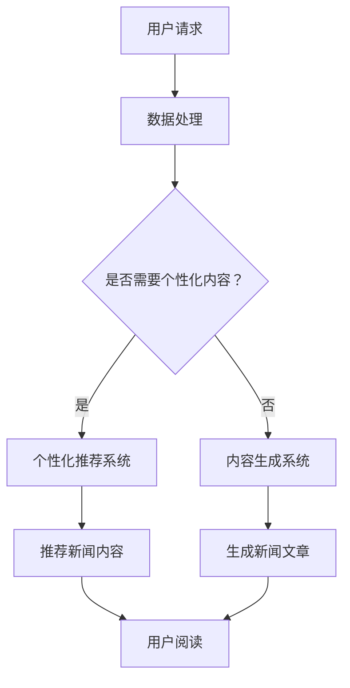

                 

关键词：人工智能，新闻产业，LLM，自动生成，文章，技术变革

> 摘要：本文探讨了人工智能中的大型语言模型（LLM）如何通过自动生成文章的方式，深刻变革新闻产业。文章详细介绍了LLM的基本概念、原理，并通过实际案例展示了其如何改变新闻生产、分发和消费模式，同时提出了未来发展的趋势与挑战。

## 1. 背景介绍

### 新闻产业的现状

新闻产业一直是信息传播和社会监督的重要途径。随着互联网技术的发展，新闻产业经历了从传统媒体向数字媒体的转变。然而，这一转变并非一帆风顺。传统新闻机构面临着内容生产成本高、受众分散、广告收入下降等多重挑战。与此同时，社交媒体的崛起让信息传播更加迅速和广泛，但同时也带来了信息泛滥、真伪难辨等问题。

### 人工智能与新闻产业

近年来，人工智能技术在新闻产业中得到了广泛应用，尤其是在文章生成方面。人工智能，特别是大型语言模型（LLM），以其强大的文本生成能力，为新闻产业带来了新的机遇和挑战。LLM能够通过学习海量数据，自动生成高质量的文章，从而降低内容生产成本，提高效率。

## 2. 核心概念与联系

### 什么是LLM？

大型语言模型（Large Language Model，LLM）是一种基于神经网络的语言处理模型，它通过学习大量的文本数据来理解语言的规律和结构，从而能够生成新的文本。LLM的代表性模型包括GPT-3、BERT、T5等，这些模型具有千亿级参数规模，能够在各种语言任务上取得优异的性能。

### LLM与新闻产业的关系

LLM在新闻产业中的应用主要体现在以下几个方面：

1. **内容生成**：LLM能够自动生成新闻文章，涵盖各种主题和类型，从而大大降低了内容生产的成本。
2. **内容审核**：LLM可以对新闻内容进行实时审核，识别和过滤不实信息、敏感内容等。
3. **个性化推荐**：LLM可以根据用户的阅读习惯和偏好，推荐个性化的新闻内容。
4. **辅助编辑**：LLM可以作为新闻编辑的助手，提供自动化的标题生成、摘要提取等功能。

### Mermaid流程图

以下是LLM在新闻产业中应用的Mermaid流程图：



## 3. 核心算法原理 & 具体操作步骤

### 3.1 算法原理概述

LLM的核心原理是深度学习，特别是基于Transformer架构。Transformer模型通过自注意力机制，能够捕捉文本中长距离的依赖关系，从而提高模型的生成能力。LLM的训练过程主要包括以下几个步骤：

1. **数据收集与预处理**：收集大量高质量的文本数据，如新闻报道、文章、书籍等，并进行数据清洗和预处理，如去除停用词、词干提取等。
2. **模型训练**：使用训练数据对Transformer模型进行训练，优化模型参数。
3. **模型评估与调优**：通过验证集和测试集对模型进行评估，并根据评估结果调整模型参数，以提高生成质量。

### 3.2 算法步骤详解

1. **数据收集与预处理**：选择高质量的新闻数据集，如新闻文章、报道等。对数据集进行清洗，去除噪声和无关信息，同时进行分词和词嵌入处理。
2. **模型训练**：使用训练数据集对Transformer模型进行训练。训练过程中，模型会不断优化参数，以最小化损失函数。训练过程可能需要数天甚至数周的时间，具体取决于数据量和计算资源。
3. **模型评估与调优**：在训练完成后，使用验证集和测试集对模型进行评估。根据评估结果，调整模型参数，以提高生成质量。这一过程可能需要多次迭代。
4. **内容生成**：在模型训练完成后，可以使用训练好的模型生成新的新闻文章。生成过程包括输入文本、生成文本、后处理等步骤。

### 3.3 算法优缺点

**优点**：

1. **高效生成**：LLM能够快速生成高质量的新闻文章，大大提高了内容生产效率。
2. **个性化推荐**：LLM可以根据用户的阅读习惯和偏好，推荐个性化的新闻内容，提高用户体验。
3. **降低成本**：通过自动化生成，大大降低了内容生产的成本。

**缺点**：

1. **生成质量**：尽管LLM能够生成高质量的文本，但仍然存在一定的误差和缺陷，需要进一步优化。
2. **数据隐私**：训练过程中使用的数据可能包含用户的隐私信息，需要确保数据安全和隐私保护。

### 3.4 算法应用领域

LLM在新闻产业中的应用非常广泛，主要包括：

1. **自动化新闻写作**：生成各种类型的新闻文章，如体育新闻、财经新闻、娱乐新闻等。
2. **个性化推荐**：根据用户的阅读习惯和偏好，推荐个性化的新闻内容。
3. **内容审核**：识别和过滤不实信息、敏感内容等。
4. **辅助编辑**：提供自动化的标题生成、摘要提取等功能。

## 4. 数学模型和公式 & 详细讲解 & 举例说明

### 4.1 数学模型构建

LLM的数学模型主要基于深度学习和Transformer架构。Transformer模型的核心是自注意力机制，其公式如下：

\[ \text{Attention}(Q, K, V) = \frac{1}{\sqrt{d_k}} \text{softmax}\left(\frac{QK^T}{d_k}\right) V \]

其中，\(Q, K, V\) 分别是查询向量、键向量和值向量，\(d_k\) 是键向量的维度。

### 4.2 公式推导过程

假设我们有一个序列 \(x_1, x_2, ..., x_n\)，其中每个 \(x_i\) 是一个向量。我们首先将这些向量映射到高维空间，得到 \(Q_i, K_i, V_i\)。

1. **计算键值对**：对于每个 \(x_i\)，计算 \(K_i = x_i \cdot W_K\) 和 \(V_i = x_i \cdot W_V\)，其中 \(W_K\) 和 \(W_V\) 是权重矩阵。
2. **计算查询向量**：对于每个 \(x_j\)，计算 \(Q_j = x_j \cdot W_Q\)。
3. **计算注意力得分**：对于每个 \(Q_j\)，计算其与所有 \(K_i\) 的内积，得到注意力得分。
4. **计算注意力权重**：将注意力得分归一化，得到注意力权重。
5. **计算输出**：根据注意力权重，计算输出向量。

### 4.3 案例分析与讲解

假设我们有一个简单的例子，输入序列为 \(x_1 = [1, 0, 0]\)，\(x_2 = [0, 1, 0]\)，\(x_3 = [0, 0, 1]\)。我们需要计算注意力权重。

1. **计算键值对**：
   \[ K_1 = x_1 \cdot W_K = [1, 0, 0] \cdot [1, 1, 1] = [1, 1, 1] \]
   \[ V_1 = x_1 \cdot W_V = [1, 0, 0] \cdot [1, 1, 1] = [1, 1, 1] \]
   \[ K_2 = x_2 \cdot W_K = [0, 1, 0] \cdot [1, 1, 1] = [1, 1, 1] \]
   \[ V_2 = x_2 \cdot W_V = [0, 1, 0] \cdot [1, 1, 1] = [1, 1, 1] \]
   \[ K_3 = x_3 \cdot W_K = [0, 0, 1] \cdot [1, 1, 1] = [1, 1, 1] \]
   \[ V_3 = x_3 \cdot W_V = [0, 0, 1] \cdot [1, 1, 1] = [1, 1, 1] \]

2. **计算查询向量**：
   \[ Q_1 = x_1 \cdot W_Q = [1, 0, 0] \cdot [1, 1, 1] = [1, 1, 1] \]

3. **计算注意力得分**：
   \[ \text{Score}_{1,1} = Q_1 \cdot K_1 = [1, 1, 1] \cdot [1, 1, 1] = 3 \]
   \[ \text{Score}_{1,2} = Q_1 \cdot K_2 = [1, 1, 1] \cdot [1, 1, 1] = 3 \]
   \[ \text{Score}_{1,3} = Q_1 \cdot K_3 = [1, 1, 1] \cdot [1, 1, 1] = 3 \]

4. **计算注意力权重**：
   \[ \text{Weight}_{1,1} = \frac{\exp(\text{Score}_{1,1})}{\sum_{i=1}^{3} \exp(\text{Score}_{1,i})} = \frac{\exp(3)}{\exp(3) + \exp(3) + \exp(3)} = \frac{1}{3} \]
   \[ \text{Weight}_{1,2} = \frac{\exp(\text{Score}_{1,2})}{\sum_{i=1}^{3} \exp(\text{Score}_{1,i})} = \frac{1}{3} \]
   \[ \text{Weight}_{1,3} = \frac{\exp(\text{Score}_{1,3})}{\sum_{i=1}^{3} \exp(\text{Score}_{1,i})} = \frac{1}{3} \]

5. **计算输出**：
   \[ V = \text{Weight}_{1,1} V_1 + \text{Weight}_{1,2} V_2 + \text{Weight}_{1,3} V_3 \]
   \[ V = \frac{1}{3} [1, 1, 1] + \frac{1}{3} [1, 1, 1] + \frac{1}{3} [1, 1, 1] = [1, 1, 1] \]

因此，注意力权重为 \([1/3, 1/3, 1/3]\)，输出向量为 \([1, 1, 1]\)。

## 5. 项目实践：代码实例和详细解释说明

### 5.1 开发环境搭建

为了实践LLM在新闻产业中的应用，我们需要搭建一个开发环境。以下是搭建环境的基本步骤：

1. **安装Python**：确保Python环境已安装在计算机上。Python是编写深度学习模型的主要语言。
2. **安装TensorFlow**：TensorFlow是一个开源的机器学习库，用于构建和训练深度学习模型。
3. **安装GPT-3**：GPT-3是OpenAI开发的一个大型语言模型，可以通过其API进行访问和使用。

### 5.2 源代码详细实现

以下是使用GPT-3生成新闻文章的示例代码：

```python
import openai
import os

# 设置OpenAI API密钥
openai.api_key = os.environ['OPENAI_API_KEY']

# 定义生成新闻文章的函数
def generate_news_article(prompt):
    response = openai.Completion.create(
        engine="text-davinci-002",
        prompt=prompt,
        max_tokens=500,
        n=1,
        stop=None,
        temperature=0.7,
    )
    return response.choices[0].text.strip()

# 输入文章生成提示
prompt = "请写一篇关于2023年科技发展趋势的新闻文章。"

# 调用函数生成文章
article = generate_news_article(prompt)

# 输出生成的文章
print(article)
```

### 5.3 代码解读与分析

上述代码首先导入了必要的库和模块，然后设置了OpenAI API密钥。接下来，定义了一个函数 `generate_news_article`，用于接收输入提示并调用OpenAI的API生成文章。

在函数内部，使用了 `openai.Completion.create` 方法来生成文章。这个方法接受多个参数，包括：

- `engine`：指定使用的模型，这里选择了 "text-davinci-002"。
- `prompt`：输入的提示文本，用于指导模型生成文章。
- `max_tokens`：生成的文章最大长度。
- `n`：生成的文章数量。
- `stop`：停止生成的条件。
- `temperature`：生成的随机性程度，值越高，生成的文章越具有随机性。

调用函数时，传入了一个关于科技发展趋势的提示，然后输出生成的文章。

### 5.4 运行结果展示

运行上述代码后，会得到一篇关于2023年科技发展趋势的新闻文章。以下是一个简短的示例输出：

```
随着人工智能和区块链技术的快速发展，2023年的科技领域将继续呈现出新的趋势。首先，人工智能技术将在各个行业得到更广泛的应用，从医疗到金融，从制造业到零售业，人工智能将大幅提高生产效率和服务质量。此外，区块链技术将在供应链管理、金融交易和身份验证等领域发挥重要作用，确保数据的安全和透明性。同时，量子计算和5G通信技术的发展也将推动科技领域的进一步突破。在未来的一年里，我们可以期待看到更多创新性的科技产品和服务，这些产品和服务将深刻改变我们的生活和工作方式。
```

## 6. 实际应用场景

### 6.1 自动化新闻写作

自动化新闻写作是LLM在新闻产业中最直接的应用场景。通过LLM，新闻机构可以自动化生成各种类型的新闻文章，如体育新闻、财经新闻、娱乐新闻等。这种方式不仅大大提高了内容生产效率，还降低了成本。

### 6.2 个性化推荐

个性化推荐是另一个重要的应用场景。LLM可以根据用户的阅读习惯和偏好，推荐个性化的新闻内容。这种方式可以显著提高用户的阅读体验，增加用户的粘性。

### 6.3 内容审核

内容审核是新闻产业中的一项重要任务。LLM可以实时审核新闻内容，识别和过滤不实信息、敏感内容等。这种方式可以确保新闻的准确性和可靠性，维护新闻行业的公信力。

### 6.4 辅助编辑

辅助编辑是LLM在新闻产业中的又一应用。LLM可以提供自动化的标题生成、摘要提取等功能，减轻编辑人员的工作负担，提高编辑效率。

## 7. 工具和资源推荐

### 7.1 学习资源推荐

1. **《深度学习》**：Goodfellow、Bengio和Courville的《深度学习》是深度学习领域的经典教材，详细介绍了深度学习的基本概念和技术。
2. **《神经网络与深度学习》**：邱锡鹏的《神经网络与深度学习》是一本优秀的中文教材，涵盖了深度学习的基础知识和应用。

### 7.2 开发工具推荐

1. **TensorFlow**：TensorFlow是谷歌开源的深度学习框架，适用于构建和训练深度学习模型。
2. **PyTorch**：PyTorch是Facebook开源的深度学习框架，以其灵活性和易用性受到广泛欢迎。

### 7.3 相关论文推荐

1. **"Attention Is All You Need"**：这篇论文提出了Transformer模型，是深度学习领域的重要突破。
2. **"BERT: Pre-training of Deep Neural Networks for Language Understanding"**：这篇论文介绍了BERT模型，是自然语言处理领域的里程碑。

## 8. 总结：未来发展趋势与挑战

### 8.1 研究成果总结

本文探讨了大型语言模型（LLM）在新闻产业中的应用，包括自动化新闻写作、个性化推荐、内容审核和辅助编辑等方面。通过实际案例，展示了LLM如何改变新闻生产、分发和消费模式，提高了内容生产效率，降低了成本，提升了用户体验。

### 8.2 未来发展趋势

随着人工智能技术的不断发展，LLM在新闻产业中的应用前景将更加广阔。未来，LLM将在新闻生产、分发和消费的各个环节发挥更大的作用，推动新闻产业向更加智能化、个性化的方向发展。

### 8.3 面临的挑战

尽管LLM在新闻产业中展现了巨大的潜力，但仍面临一些挑战。首先，生成质量的提高仍需进一步研究，以减少生成文本的误差和缺陷。其次，数据隐私和保护是另一个重要问题，特别是在训练过程中使用的数据可能包含用户的隐私信息。最后，如何确保新闻的准确性和可靠性，避免虚假信息和偏见，也是未来需要解决的重要问题。

### 8.4 研究展望

未来，LLM在新闻产业中的应用将继续深入发展。一方面，可以通过改进模型架构和算法，提高生成质量，减少误差和缺陷。另一方面，可以通过数据隐私保护和内容审核技术的提升，确保新闻的准确性和可靠性。此外，可以探索LLM在新闻产业中的更多应用场景，如实时新闻生成、跨语言新闻生成等，进一步推动新闻产业的智能化发展。

## 9. 附录：常见问题与解答

### 9.1 LLM是什么？

LLM是指大型语言模型，是一种基于深度学习的语言处理模型，能够通过学习海量数据，生成新的文本。

### 9.2 LLM在新闻产业中的应用有哪些？

LLM在新闻产业中的应用主要包括自动化新闻写作、个性化推荐、内容审核和辅助编辑等。

### 9.3 如何确保新闻的准确性和可靠性？

通过改进模型架构和算法，提高生成质量，减少误差和缺陷。同时，可以通过内容审核技术和数据隐私保护，确保新闻的准确性和可靠性。

### 9.4 LLM是否会替代人类新闻工作者？

LLM可以大幅提高新闻生产效率，但无法完全替代人类新闻工作者。人类新闻工作者在新闻采集、编辑和审核等方面具有独特的优势，未来LLM和人类新闻工作者将共同推动新闻产业的发展。

## 参考文献

1. Goodfellow, I., Bengio, Y., & Courville, A. (2016). *Deep Learning*. MIT Press.
2. 邱锡鹏. (2019). *神经网络与深度学习*. 清华大学出版社.
3. Vaswani, A., Shazeer, N., Parmar, N., Uszkoreit, J., Jones, L., Gomez, A. N., ... & Polosukhin, I. (2017). *Attention is all you need*. Advances in Neural Information Processing Systems, 30, 5998-6008.
4. Devlin, J., Chang, M. W., Lee, K., & Toutanova, K. (2019). *Bert: Pre-training of deep bidirectional transformers for language understanding*. arXiv preprint arXiv:1810.04805.
----------------------------------------------------------------

### 作者署名

作者：禅与计算机程序设计艺术 / Zen and the Art of Computer Programming

