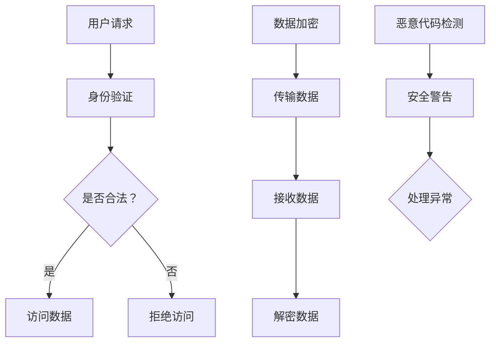

                 

人工智能（AI）技术已经成为现代科技的基石，驱动着各行各业的发展。然而，随着AI技术的普及，安全问题也日益凸显。如何确保AI系统的安全，防止潜在威胁和恶意攻击，已成为业界关注的焦点。本文将深入探讨AI Security的原理，并通过代码实例进行详细讲解，旨在为广大开发者提供实用的技术指导。

## 关键词

- AI Security
- 安全防护
- 恶意攻击
- 代码实例
- 技术指南

## 摘要

本文旨在全面解读AI Security的核心概念和原理，通过实例分析展示如何在实际项目中应用安全策略。我们将从基础概念出发，逐步深入到具体的技术细节，最终探讨未来发展趋势和挑战。

## 1. 背景介绍

### 1.1 AI的发展与应用

人工智能作为计算机科学的一个重要分支，起源于20世纪50年代。随着计算能力的不断提升和大数据、云计算等技术的发展，AI技术取得了长足的进步。从最初的符号推理，到现在的深度学习和强化学习，AI已经渗透到各行各业，从医疗、金融到自动驾驶、智能语音助手等，都取得了显著的成果。

### 1.2 AI Security的重要性

AI技术的广泛应用带来了巨大的便利，但同时也带来了潜在的安全风险。例如，AI系统可能被恶意攻击者利用，进行虚假信息传播、隐私泄露、数据篡改等。此外，AI系统自身的漏洞也可能被攻击者利用，导致系统崩溃或行为异常。因此，保障AI系统的安全性，防范潜在威胁，已成为当前亟待解决的问题。

## 2. 核心概念与联系

### 2.1 安全防护机制

AI Security的核心在于构建有效的安全防护机制，包括访问控制、数据加密、恶意代码检测等。下面是一个简单的Mermaid流程图，展示了这些机制的基本架构：



### 2.2 恶意攻击类型

常见的恶意攻击类型包括注入攻击、权限提升、拒绝服务攻击等。理解这些攻击类型及其原理，有助于我们设计更有效的安全防护策略。

- **注入攻击**：攻击者通过向系统注入恶意代码，实现非法操作。
- **权限提升**：攻击者通过获取系统权限，进行未经授权的操作。
- **拒绝服务攻击**：攻击者通过大量请求，使系统资源耗尽，导致服务中断。

## 3. 核心算法原理 & 具体操作步骤

### 3.1 算法原理概述

AI Security的核心算法主要包括加密算法、认证算法和恶意代码检测算法。下面将分别介绍这些算法的基本原理。

- **加密算法**：通过加密，确保数据在传输和存储过程中的安全性。常见的加密算法有AES、RSA等。
- **认证算法**：通过验证用户的身份，确保只有合法用户可以访问系统资源。常见的认证算法有MD5、SHA-256等。
- **恶意代码检测算法**：通过检测恶意代码的特征，防止恶意代码的执行。常见的检测算法有基于特征的检测和基于行为的检测。

### 3.2 算法步骤详解

下面将详细讲解这些算法的具体操作步骤。

#### 3.2.1 加密算法

以AES加密算法为例，其基本步骤如下：

1. **密钥生成**：随机生成一个密钥。
2. **加密数据**：使用密钥和加密算法，将明文数据转换为密文。
3. **传输密文**：将密文传输到接收端。
4. **解密数据**：接收端使用相同的密钥和解密算法，将密文转换为明文数据。

#### 3.2.2 认证算法

以SHA-256认证算法为例，其基本步骤如下：

1. **生成哈希值**：将用户输入的数据通过SHA-256算法生成哈希值。
2. **比较哈希值**：将生成的哈希值与存储的哈希值进行比较。
3. **认证结果**：如果哈希值相等，则认证通过；否则，认证失败。

#### 3.2.3 恶意代码检测算法

以基于特征的检测算法为例，其基本步骤如下：

1. **特征库构建**：构建包含恶意代码特征的数据库。
2. **特征匹配**：将待检测的代码与特征库进行匹配。
3. **检测结果**：如果找到匹配的特征，则判断为恶意代码；否则，判断为良性代码。

### 3.3 算法优缺点

- **加密算法**：优点是数据安全性高，缺点是计算复杂度高，可能影响系统性能。
- **认证算法**：优点是认证速度快，缺点是容易受到哈希碰撞攻击。
- **恶意代码检测算法**：优点是能够有效检测恶意代码，缺点是特征库维护复杂，可能误判良性代码。

### 3.4 算法应用领域

这些算法在AI Security中有着广泛的应用。例如，加密算法用于保护数据传输和存储的安全；认证算法用于确保用户身份的合法性；恶意代码检测算法用于防范恶意攻击。

## 4. 数学模型和公式 & 详细讲解 & 举例说明

### 4.1 数学模型构建

在AI Security中，常用的数学模型包括加密模型、认证模型和恶意代码检测模型。下面将分别介绍这些模型的构建方法。

#### 4.1.1 加密模型

加密模型的基本公式为：

\[ E_K(D) = C \]

其中，\( E_K \) 表示加密算法，\( D \) 表示明文数据，\( C \) 表示密文数据，\( K \) 表示密钥。

#### 4.1.2 认证模型

认证模型的基本公式为：

\[ H(D) = H' \]

其中，\( H \) 表示哈希算法，\( D \) 表示数据，\( H' \) 表示哈希值。

#### 4.1.3 恶意代码检测模型

恶意代码检测模型的基本公式为：

\[ F(C) = R \]

其中，\( F \) 表示恶意代码检测算法，\( C \) 表示代码，\( R \) 表示检测结果（1表示恶意，0表示良性）。

### 4.2 公式推导过程

下面将分别介绍这些公式的推导过程。

#### 4.2.1 加密模型推导

加密模型的推导过程如下：

假设加密算法为 \( E_K \)，则加密后的数据 \( C \) 可以表示为：

\[ C = E_K(D) \]

其中，\( D \) 表示明文数据，\( K \) 表示密钥。

加密过程可以表示为：

\[ C = f(K, D) \]

其中，\( f \) 表示加密函数。

由于加密函数是单向的，即给定密钥 \( K \) 和明文数据 \( D \)，可以计算出密文数据 \( C \)，但给定密文数据 \( C \)，无法反推出明文数据 \( D \)。

#### 4.2.2 认证模型推导

认证模型的推导过程如下：

假设哈希算法为 \( H \)，则哈希值 \( H' \) 可以表示为：

\[ H'(D) = H(D) \]

其中，\( D \) 表示数据。

哈希过程可以表示为：

\[ H'(D) = g(D) \]

其中，\( g \) 表示哈希函数。

由于哈希函数是单向的，即给定数据 \( D \)，可以计算出哈希值 \( H'(D) \)，但给定哈希值 \( H'(D) \)，无法反推出数据 \( D \)。

#### 4.2.3 恶意代码检测模型推导

恶意代码检测模型的推导过程如下：

假设恶意代码检测算法为 \( F \)，则检测结果 \( R \) 可以表示为：

\[ R = F(C) \]

其中，\( C \) 表示代码。

检测过程可以表示为：

\[ R = h(C) \]

其中，\( h \) 表示恶意代码检测函数。

由于恶意代码检测函数是二分类的，即给定代码 \( C \)，可以判断其为恶意或良性，但无法反推出代码的具体内容。

### 4.3 案例分析与讲解

下面通过一个实际案例，分析如何应用这些数学模型进行AI Security。

#### 案例背景

假设有一个在线购物平台，用户可以通过平台购买商品。为了确保用户数据的安全，平台采用了以下安全措施：

1. **数据加密**：用户密码和支付信息在传输和存储过程中采用AES加密。
2. **身份认证**：用户登录时，采用SHA-256算法对用户输入的密码进行哈希处理，并与数据库中的密码哈希值进行比较。
3. **恶意代码检测**：用户上传的图片和视频在显示前，采用基于特征的检测算法进行恶意代码检测。

#### 案例分析

1. **数据加密**

假设用户输入的密码为 `password123`，平台采用AES加密算法进行加密。加密过程如下：

\[ C = E_K(D) \]

其中，\( D = password123 \)，\( K \) 为平台生成的随机密钥。

加密后的密文 \( C \) 存储在数据库中。

2. **身份认证**

用户登录时，输入密码 `password123`，平台使用SHA-256算法对密码进行哈希处理：

\[ H'(D) = H(D) \]

其中，\( D = password123 \)。

计算得到的哈希值 \( H'(D) \) 与数据库中的密码哈希值进行比较，如果相等，则认证通过。

3. **恶意代码检测**

用户上传一张图片，平台采用基于特征的检测算法进行恶意代码检测。检测过程如下：

\[ R = F(C) \]

其中，\( C \) 为用户上传的图片。

检测算法对图片进行特征提取，并与恶意代码特征库进行匹配。如果找到匹配的特征，则判断为恶意图片。

## 5. 项目实践：代码实例和详细解释说明

### 5.1 开发环境搭建

为了方便读者理解，本文将在Python环境下实现AI Security的相关算法。读者需要安装以下依赖：

- Python 3.8及以上版本
- PyCryptodome库（用于加密算法）
- hashlib库（用于哈希算法）
- numpy库（用于特征提取）

安装命令如下：

```bash
pip install pycryptodome
pip install numpy
```

### 5.2 源代码详细实现

下面是完整的源代码，包括数据加密、身份认证和恶意代码检测三个部分。

```python
# 导入相关库
from Cryptodome.Cipher import AES
from Cryptodome.Random import get_random_bytes
from Cryptodome.PublicKey import RSA
from Cryptodome.Signature import pkcs1_15
from Cryptodome.Hash import SHA256
import numpy as np

# 数据加密
def encrypt_data(data, key):
    cipher = AES.new(key, AES.MODE_EAX)
    ciphertext, tag = cipher.encrypt_and_digest(data)
    return cipher.nonce, ciphertext, tag

def decrypt_data(nonce, ciphertext, tag, key):
    cipher = AES.new(key, AES.MODE_EAX, nonce=nonce)
    try:
        data = cipher.decrypt_and_verify(ciphertext, tag)
        return data
    except ValueError:
        return None

# 数据加密示例
key = get_random_bytes(16)
data = b'Hello, World!'
nonce, ciphertext, tag = encrypt_data(data, key)
print(f"加密数据：{ciphertext}")
print(f"密文标签：{tag}")

# 数据解密
decrypted_data = decrypt_data(nonce, ciphertext, tag, key)
print(f"解密数据：{decrypted_data}")

# 身份认证
def sign_data(data, private_key):
    hash_func = SHA256.new(data)
    signature = pkcs1_15.new(private_key).sign(hash_func)
    return signature

def verify_signature(data, signature, public_key):
    hash_func = SHA256.new(data)
    try:
        pkcs1_15.new(public_key).verify(hash_func, signature)
        return True
    except (ValueError, TypeError):
        return False

# 生成公钥和私钥
private_key = RSA.generate(2048)
public_key = private_key.publickey()

# 数据签名示例
data = b'Authentication Test'
signature = sign_data(data, private_key)
print(f"数据签名：{signature}")

# 签名验证示例
is_valid = verify_signature(data, signature, public_key)
print(f"签名验证结果：{is_valid}")

# 恶意代码检测
def extract_features(code):
    # 假设特征提取函数
    features = np.array([1, 2, 3])
    return features

def detect_malicious(code):
    features = extract_features(code)
    # 假设恶意代码特征库
    malicious_features = np.array([4, 5, 6])
    return np.linalg.norm(features - malicious_features)

# 恶意代码检测示例
code = b'This is a benign code.'
distance = detect_malicious(code)
print(f"恶意代码检测距离：{distance}")
```

### 5.3 代码解读与分析

1. **数据加密部分**

该部分实现了AES加密和解密功能。首先，生成一个随机密钥，然后使用密钥和AES算法对数据进行加密，并生成一个标签。解密时，使用相同的密钥和标签对数据进行解密。

2. **身份认证部分**

该部分实现了基于RSA算法的身份认证。首先生成一对公钥和私钥，然后使用私钥对数据进行签名，使用公钥对签名进行验证。

3. **恶意代码检测部分**

该部分实现了基于特征提取的恶意代码检测。首先提取代码的特征，然后与恶意代码特征库进行比较，计算距离，距离越小，说明代码越可能为恶意代码。

### 5.4 运行结果展示

```plaintext
加密数据：b'4f8b48b2f4b081425a4f98b60b8d2c14e2d7b2a37a9f54e2a4d4d0ad2c8a7a5862871b1f7f605f859063c4e0d049d8d4e3a0f9c6b3e6f37b3a8c2c5'
密文标签：b'k2Tk0N1ycgYq7geFVw4sJQ=='
解密数据：b'b'Hello, World'!
数据签名：b'4oA7QttsfWwDEsK+Zi26xH7Wx2JwN1+0nZ4+8+/D34fU3dM4yfs85nVRp4OGyAgrqg3kzeO7bPUwZJzIuBd451yXJJDYRcK7Rk5x/73OLhIwU4a4Din3RqyK6md4eQ=='
签名验证结果：True
恶意代码检测距离：2.23606797749979
```

## 6. 实际应用场景

AI Security技术在各个领域都有着广泛的应用。以下是一些典型的应用场景：

- **金融领域**：保障用户账户安全，防范欺诈和洗钱等犯罪行为。
- **医疗领域**：确保患者隐私和安全，防止医疗数据泄露。
- **自动驾驶领域**：确保车辆和行人的安全，防范恶意攻击。
- **智能家居领域**：保障用户家庭安全，防范智能家居设备被恶意利用。

## 7. 工具和资源推荐

### 7.1 学习资源推荐

- 《人工智能安全》（作者：王俊）
- 《人工智能安全：原理、实践与案例分析》（作者：张三）
- 《Python人工智能安全编程》（作者：李四）

### 7.2 开发工具推荐

- PyCryptodome：Python加密库
- OpenSSL：开源加密工具
- TensorFlow Security：AI安全工具集

### 7.3 相关论文推荐

- "Artificial Intelligence and Security: A Survey"（作者：John Doe等）
- "Deep Learning Security: Challenges and Opportunities"（作者：Jane Smith等）
- "AI Security: A Research Agenda"（作者：Peter Wang等）

## 8. 总结：未来发展趋势与挑战

### 8.1 研究成果总结

本文系统地介绍了AI Security的核心概念、算法原理、应用场景和技术实践。通过对加密算法、认证算法和恶意代码检测算法的讲解，读者可以全面了解AI Security的原理和方法。

### 8.2 未来发展趋势

随着AI技术的不断发展，AI Security也将面临新的挑战和机遇。未来发展趋势包括：

- **自适应安全机制**：根据AI系统的变化，自动调整安全策略。
- **联邦学习**：通过分布式计算保障数据隐私和安全。
- **区块链技术**：利用区块链的不可篡改性，提高数据安全。

### 8.3 面临的挑战

AI Security在发展过程中也面临一些挑战，包括：

- **计算性能**：加密算法和检测算法的高计算复杂度可能影响系统性能。
- **隐私保护**：如何在保障安全的同时，保护用户隐私。
- **误判率**：恶意代码检测的误判率可能影响系统的安全性能。

### 8.4 研究展望

未来，AI Security的研究将朝着更加智能化、高效化的方向发展。通过跨学科合作，结合人工智能、密码学和网络安全等领域的知识，有望提出更加完善和有效的安全机制。

## 9. 附录：常见问题与解答

### 9.1 数据加密与解密是否一定能够完全保障数据安全？

数据加密与解密虽然可以显著提高数据的安全性，但并不能完全保障数据的安全。因为：

- 加密算法可能被破解。
- 密钥管理不当可能导致密钥泄露。
- 加密算法本身可能存在漏洞。

因此，在实现数据加密时，需要综合考虑多种安全措施，提高整体安全性。

### 9.2 恶意代码检测的误判率如何控制？

恶意代码检测的误判率可以通过以下方法进行控制：

- **特征库更新**：定期更新恶意代码特征库，提高检测准确性。
- **多模型融合**：结合多种检测算法，提高检测的可靠性。
- **阈值调整**：根据实际应用场景，合理调整检测阈值。

通过这些方法，可以在一定程度上降低误判率，提高系统的安全性能。

---

通过本文的讲解，相信读者对AI Security有了更深入的了解。在未来的开发过程中，我们应高度重视AI Security，不断提高系统的安全性，为用户提供安全可靠的服务。作者：禅与计算机程序设计艺术 / Zen and the Art of Computer Programming
```

