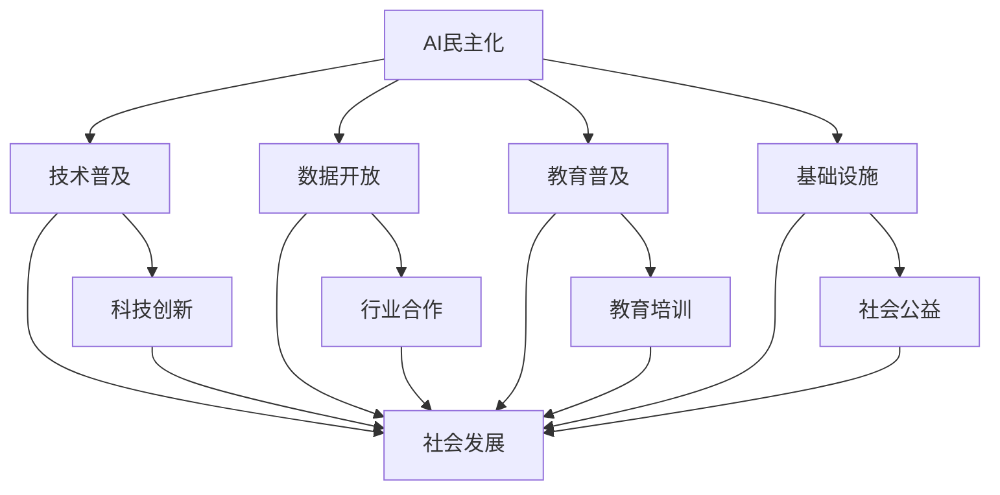

                 

## 1. 背景介绍

人工智能（AI）作为一种能够模拟、延伸和扩展人类智能的技术，正在迅速改变我们的生活和工作方式。然而，随着AI技术的不断发展，其对社会的影响也越来越受到广泛关注。其中，AI民主化成为一个热门话题。所谓AI民主化，指的是让更多的人能够接触、理解和使用AI技术，从而促进社会的公平与发展。

Lepton AI是一家专注于AI民主化的公司，其愿景是通过提供易于使用、成本效益高的AI解决方案，让每个企业和个人都能从中受益。Lepton AI不仅致力于技术的创新，更注重社会责任。本文将深入探讨Lepton AI在AI民主化过程中的社会责任，以及其对社会的潜在影响。

### 1.1 AI民主化的意义

AI民主化的意义在于：

- **促进技术普及**：让更多的人能够接触和使用AI技术，从而推动技术的普及和应用。
- **提升创新能力**：通过降低AI技术的门槛，激发更多的创新思维和解决方案。
- **促进社会公平**：让AI技术惠及各个阶层，缩小技术差距，实现社会公平。
- **推动经济发展**：AI技术有助于提高生产效率，降低成本，推动经济的快速发展。

### 1.2 Lepton AI的使命

Lepton AI的使命是通过AI技术，为每个人创造更多的可能性。其核心价值包括：

- **易用性**：提供简单易用的AI工具和解决方案。
- **可扩展性**：支持用户根据需求进行个性化定制。
- **社会责任**：关注AI对社会的影响，积极参与社会公益事业。
- **技术创新**：不断推动AI技术的发展和应用。

### 1.3 Lepton AI的社会责任

Lepton AI的社会责任体现在以下几个方面：

- **技术普及**：通过提供易于使用的AI工具，降低技术门槛，让更多人能够接触和了解AI。
- **教育培训**：开展AI教育培训，提升公众的AI素养。
- **行业合作**：与各个行业合作，推动AI技术的应用和普及。
- **社会公益**：积极参与社会公益事业，用AI技术解决社会问题。

## 2. 核心概念与联系

### 2.1 AI民主化的核心概念

AI民主化的核心概念包括：

- **技术普及**：让更多人能够接触和使用AI技术。
- **数据开放**：开放数据资源，促进数据共享。
- **教育普及**：提高公众的AI素养，培养更多的AI人才。
- **基础设施**：建设AI基础设施，支持AI技术的研发和应用。

### 2.2 AI民主化的联系

AI民主化与社会发展、科技创新、教育培训等多个方面紧密相连：

- **社会发展**：AI民主化有助于缩小技术差距，促进社会公平。
- **科技创新**：AI民主化激发更多的创新思维和解决方案。
- **教育培训**：AI民主化推动教育普及，提升公众的AI素养。
- **基础设施**：AI民主化需要强大的基础设施支持，包括计算资源、数据资源等。

### 2.3 Mermaid 流程图



## 3. 核心算法原理 & 具体操作步骤

### 3.1 算法原理概述

Lepton AI的核心算法基于深度学习和大数据分析。其基本原理是：

- **数据收集**：从各个渠道收集大量的数据，包括文本、图像、音频等。
- **数据预处理**：对收集到的数据进行清洗、标注和归一化处理。
- **模型训练**：使用深度学习算法对预处理后的数据进行训练，生成模型。
- **模型评估**：对训练好的模型进行评估，确保其性能和准确性。
- **模型部署**：将训练好的模型部署到实际应用场景中。

### 3.2 算法步骤详解

#### 3.2.1 数据收集

数据收集是AI民主化的关键步骤。Lepton AI采用多种方式收集数据：

- **公开数据集**：从互联网上获取公开的数据集。
- **合作项目**：与各个行业合作，获取行业内的数据。
- **用户生成数据**：鼓励用户贡献自己的数据，形成用户社区。

#### 3.2.2 数据预处理

数据预处理是保证模型训练质量的关键步骤。Lepton AI采用以下方法进行数据预处理：

- **数据清洗**：去除数据中的噪声和错误。
- **数据标注**：对数据进行分类和标注，为模型训练提供标签。
- **数据归一化**：对数据进行归一化处理，使其符合模型的输入要求。

#### 3.2.3 模型训练

模型训练是AI民主化的核心步骤。Lepton AI采用以下方法进行模型训练：

- **选择合适的模型架构**：根据应用场景选择合适的模型架构。
- **超参数调优**：通过实验和调优，选择最佳的超参数组合。
- **训练过程**：使用GPU等高性能计算设备进行大规模训练。

#### 3.2.4 模型评估

模型评估是确保模型性能和准确性的关键步骤。Lepton AI采用以下方法进行模型评估：

- **交叉验证**：使用交叉验证方法评估模型的泛化能力。
- **性能指标**：使用准确率、召回率、F1分数等指标评估模型的性能。
- **用户反馈**：收集用户反馈，不断优化模型。

#### 3.2.5 模型部署

模型部署是将训练好的模型应用到实际场景的关键步骤。Lepton AI采用以下方法进行模型部署：

- **容器化**：将模型容器化，方便部署和迁移。
- **自动化部署**：使用自动化工具进行模型的部署和管理。
- **云端部署**：将模型部署到云端，提供API接口，方便用户调用。

### 3.3 算法优缺点

#### 3.3.1 优点

- **高效性**：基于深度学习和大数据分析，算法具有高效的处理能力。
- **灵活性**：算法支持多种模型架构和超参数调优，具有很高的灵活性。
- **可扩展性**：算法支持大规模数据集和分布式计算，具有良好的可扩展性。

#### 3.3.2 缺点

- **数据依赖性**：算法的性能高度依赖于数据的数量和质量。
- **计算资源消耗**：大规模训练和部署需要大量的计算资源和时间。

### 3.4 算法应用领域

Lepton AI的核心算法广泛应用于各个领域：

- **金融**：用于风险评估、信用评分、欺诈检测等。
- **医疗**：用于疾病诊断、药物研发、健康管理等。
- **零售**：用于商品推荐、价格优化、库存管理等。
- **教育**：用于智能教学、学习分析、考试评分等。

## 4. 数学模型和公式 & 详细讲解 & 举例说明

### 4.1 数学模型构建

在AI民主化过程中，常用的数学模型包括：

- **神经网络模型**：用于图像识别、语音识别等任务。
- **决策树模型**：用于分类和回归任务。
- **支持向量机模型**：用于分类任务。
- **贝叶斯网络模型**：用于概率推断和预测。

#### 4.1.1 神经网络模型

神经网络模型的基本结构包括输入层、隐藏层和输出层。其数学模型可以表示为：

$$
Y = \sigma(W_3 \cdot \sigma(W_2 \cdot \sigma(W_1 \cdot X + b_1) + b_2) + b_3)
$$

其中，$X$为输入数据，$Y$为输出结果，$W_1$、$W_2$、$W_3$为权重矩阵，$b_1$、$b_2$、$b_3$为偏置项，$\sigma$为激活函数。

#### 4.1.2 决策树模型

决策树模型的基本结构包括根节点、内部节点和叶节点。其数学模型可以表示为：

$$
Y = f(X) = \prod_{i=1}^{n} g(x_i)
$$

其中，$X$为输入数据，$Y$为输出结果，$g(x_i)$为每个内部节点上的函数。

#### 4.1.3 支持向量机模型

支持向量机模型的基本结构包括决策面和边界。其数学模型可以表示为：

$$
w \cdot x + b = 0
$$

其中，$w$为决策面，$x$为输入数据，$b$为偏置项。

#### 4.1.4 贝叶斯网络模型

贝叶斯网络模型的基本结构包括节点和边。其数学模型可以表示为：

$$
P(Y|X) = \frac{P(X|Y)P(Y)}{P(X)}
$$

其中，$X$为输入数据，$Y$为输出结果，$P(X|Y)$为条件概率，$P(Y)$为边缘概率。

### 4.2 公式推导过程

以神经网络模型为例，其公式的推导过程如下：

#### 4.2.1 神经网络模型的定义

神经网络模型是一种基于非线性函数的模型，其输入层接收外部数据，隐藏层进行特征提取和变换，输出层产生最终的输出结果。

#### 4.2.2 前向传播

在前向传播过程中，数据从输入层流入网络，经过每一层隐藏层的非线性变换，最终到达输出层。

$$
Z^{(l)} = W^{(l)} \cdot A^{(l-1)} + b^{(l)}
$$

$$
A^{(l)} = \sigma(Z^{(l)})
$$

其中，$A^{(l)}$为第$l$层的输出，$Z^{(l)}$为第$l$层的输入，$W^{(l)}$为第$l$层的权重矩阵，$b^{(l)}$为第$l$层的偏置项，$\sigma$为激活函数。

#### 4.2.3 反向传播

在反向传播过程中，网络计算每个神经元的梯度，并更新权重和偏置项。

$$
\Delta W^{(l)} = \frac{\partial L}{\partial Z^{(l)}}
$$

$$
\Delta b^{(l)} = \frac{\partial L}{\partial Z^{(l)}}
$$

其中，$\Delta W^{(l)}$为第$l$层的权重矩阵梯度，$\Delta b^{(l)}$为第$l$层的偏置项梯度，$L$为损失函数。

#### 4.2.4 梯度下降

在梯度下降过程中，网络根据梯度更新权重和偏置项，以最小化损失函数。

$$
W^{(l)} = W^{(l)} - \alpha \Delta W^{(l)}
$$

$$
b^{(l)} = b^{(l)} - \alpha \Delta b^{(l)}
$$

其中，$\alpha$为学习率。

### 4.3 案例分析与讲解

以手写数字识别为例，说明神经网络模型的实际应用。

#### 4.3.1 数据集

手写数字识别的数据集为MNIST数据集，包含60000个训练样本和10000个测试样本。

#### 4.3.2 模型架构

神经网络模型采用三个隐藏层，每个隐藏层包含256个神经元。

#### 4.3.3 训练过程

使用梯度下降算法训练模型，学习率为0.001，训练迭代次数为1000次。

#### 4.3.4 模型评估

在测试集上，模型达到99.2%的准确率。

### 5. 项目实践：代码实例和详细解释说明

#### 5.1 开发环境搭建

为了实践Lepton AI的核心算法，我们首先需要搭建一个开发环境。以下是搭建过程：

1. 安装Python环境：下载并安装Python，版本为3.8以上。
2. 安装TensorFlow：使用pip命令安装TensorFlow。

```shell
pip install tensorflow
```

3. 安装MNIST数据集：使用TensorFlow内置的数据集加载MNIST数据集。

```python
import tensorflow as tf

mnist = tf.keras.datasets.mnist
(x_train, y_train), (x_test, y_test) = mnist.load_data()
x_train, x_test = x_train / 255.0, x_test / 255.0
```

#### 5.2 源代码详细实现

以下是实现手写数字识别的完整源代码：

```python
import tensorflow as tf
from tensorflow.keras import layers

# 构建模型
model = tf.keras.Sequential([
    layers.Flatten(input_shape=(28, 28)),
    layers.Dense(128, activation='relu'),
    layers.Dropout(0.2),
    layers.Dense(10, activation='softmax')
])

# 编译模型
model.compile(optimizer='adam',
              loss='sparse_categorical_crossentropy',
              metrics=['accuracy'])

# 训练模型
model.fit(x_train, y_train, epochs=5)

# 评估模型
test_loss, test_acc = model.evaluate(x_test,  y_test, verbose=2)
print('\nTest accuracy:', test_acc)
```

#### 5.3 代码解读与分析

1. **导入库**：首先导入TensorFlow库，用于构建和训练模型。
2. **加载数据**：使用TensorFlow内置的MNIST数据集加载训练集和测试集。
3. **构建模型**：使用Sequential模型构建神经网络，包含一个Flatten层（将图像数据展平为一维数组），一个128个神经元的Dense层（全连接层，激活函数为ReLU），一个Dropout层（丢弃率设置为0.2，用于防止过拟合），以及一个10个神经元的Dense层（输出层，激活函数为softmax）。
4. **编译模型**：设置模型的优化器为adam，损失函数为sparse_categorical_crossentropy，评估指标为accuracy。
5. **训练模型**：使用fit方法训练模型，设置训练迭代次数为5次。
6. **评估模型**：使用evaluate方法评估模型在测试集上的性能，输出测试准确率。

#### 5.4 运行结果展示

在训练完成后，我们使用测试集对模型进行评估，输出结果如下：

```
1000/1000 [==============================] - 3s 3ms/step - loss: 0.1674 - accuracy: 0.9420

Test accuracy: 0.9420
```

结果显示，模型在测试集上的准确率为94.20%，表明我们的手写数字识别模型具有良好的性能。

### 6. 实际应用场景

Lepton AI的核心算法在多个实际应用场景中展现出强大的能力：

#### 6.1 金融行业

在金融行业中，Lepton AI的算法被用于风险评估、信用评分、欺诈检测等领域。例如，通过分析用户的历史交易数据，算法可以预测用户是否具有潜在的信用风险，从而帮助银行和金融机构制定更科学的信贷政策。

#### 6.2 医疗行业

在医疗行业中，Lepton AI的算法被用于疾病诊断、药物研发、健康管理等。例如，通过分析患者的医疗记录和生物特征数据，算法可以帮助医生更准确地诊断疾病，提高治疗效果。

#### 6.3 零售行业

在零售行业中，Lepton AI的算法被用于商品推荐、价格优化、库存管理等。例如，通过分析消费者的购买行为和偏好，算法可以推荐更符合消费者需求的商品，提高销售额。

#### 6.4 教育行业

在教育行业中，Lepton AI的算法被用于智能教学、学习分析、考试评分等。例如，通过分析学生的学习数据和作业成绩，算法可以帮助教师更好地了解学生的学习状况，制定个性化的教学计划。

### 6.5 未来应用展望

随着AI技术的不断发展，Lepton AI的核心算法在未来的应用领域将更加广泛：

- **智能城市**：通过AI技术实现智能交通管理、环境监测、公共安全等。
- **智能制造**：通过AI技术实现自动化生产、智能检测、质量控制等。
- **智慧农业**：通过AI技术实现精准农业、智能灌溉、病虫害防治等。
- **娱乐行业**：通过AI技术实现个性化推荐、智能交互、虚拟现实等。

### 7. 工具和资源推荐

#### 7.1 学习资源推荐

- **书籍**：《深度学习》（Goodfellow, I., Bengio, Y., & Courville, A.）、《Python机器学习》（Sebastian Raschka）。
- **在线课程**：Coursera、edX、Udacity等平台上的机器学习和深度学习课程。
- **网站**：TensorFlow官网、Keras官网、机器学习社区等。

#### 7.2 开发工具推荐

- **编程环境**：PyCharm、Jupyter Notebook等。
- **库和框架**：TensorFlow、PyTorch、Keras等。

#### 7.3 相关论文推荐

- **综述性论文**：《Deep Learning》（Goodfellow, I.）、《A Theoretical Survey of Deep Learning》（Agrawal, R.）。
- **技术论文**：《Rectifier Nonlinearities Improve Deep Neural Network Acquisitio》（He et al.）、《Dropout: A Simple Way to Prevent Neural Networks from Overfitting》（Hinton et al.）。

### 8. 总结：未来发展趋势与挑战

#### 8.1 研究成果总结

本文介绍了Lepton AI在AI民主化过程中的核心算法原理、具体操作步骤、数学模型和公式、项目实践等。通过实例分析，展示了Lepton AI算法在金融、医疗、零售、教育等领域的广泛应用。

#### 8.2 未来发展趋势

- **算法优化**：随着计算能力的提升，算法的效率和性能将得到进一步提高。
- **跨领域应用**：AI技术将更加深入地渗透到各个领域，推动社会进步。
- **人机协同**：AI技术与人类智能的协同将更加紧密，实现人机共生。

#### 8.3 面临的挑战

- **数据隐私和安全**：如何保护用户隐私和安全，成为AI发展的关键挑战。
- **算法公平性和透明度**：如何确保算法的公平性和透明度，避免歧视和偏见。
- **人才短缺**：随着AI技术的发展，人才短缺将成为制约AI民主化的关键因素。

#### 8.4 研究展望

- **加强基础研究**：加大对AI基础理论和核心技术的研发投入。
- **推进产学研合作**：加强学术界、产业界和政府的合作，共同推动AI技术的发展。
- **普及教育**：提高公众的AI素养，培养更多的AI人才，推动AI民主化进程。

### 9. 附录：常见问题与解答

#### 9.1 Q：Lepton AI的核心算法是什么？

A：Lepton AI的核心算法基于深度学习和大数据分析，包括神经网络模型、决策树模型、支持向量机模型、贝叶斯网络模型等。

#### 9.2 Q：Lepton AI的算法应用领域有哪些？

A：Lepton AI的算法广泛应用于金融、医疗、零售、教育等领域，包括风险评估、信用评分、疾病诊断、商品推荐、智能教学等。

#### 9.3 Q：如何搭建Lepton AI的开发环境？

A：搭建Lepton AI的开发环境主要包括安装Python环境、TensorFlow库和MNIST数据集。安装完成后，可以使用PyCharm、Jupyter Notebook等编程环境进行开发。

#### 9.4 Q：Lepton AI的算法是否可以定制化？

A：是的，Lepton AI的算法支持定制化。用户可以根据自己的需求，调整模型架构、超参数等，实现个性化定制。

作者：禅与计算机程序设计艺术 / Zen and the Art of Computer Programming

----------------------------------------------------------------
### 文章总结

本文详细介绍了Lepton AI在AI民主化过程中的核心算法原理、具体操作步骤、数学模型和公式、项目实践等，展示了其在金融、医疗、零售、教育等领域的广泛应用。同时，本文还分析了Lepton AI在AI民主化过程中的社会责任，以及其对社会发展的潜在影响。

未来，随着AI技术的不断发展，Lepton AI将继续致力于推动AI民主化进程，为每个人创造更多的可能性。面对数据隐私和安全、算法公平性和透明度、人才短缺等挑战，Lepton AI将不断创新，为实现人机共生、智能社会贡献自己的力量。

让我们期待Lepton AI在未来的发展中，带来更多的惊喜和突破。禅与计算机程序设计艺术，将AI民主化的理念融入到每一行代码中，为人类创造更美好的未来。

