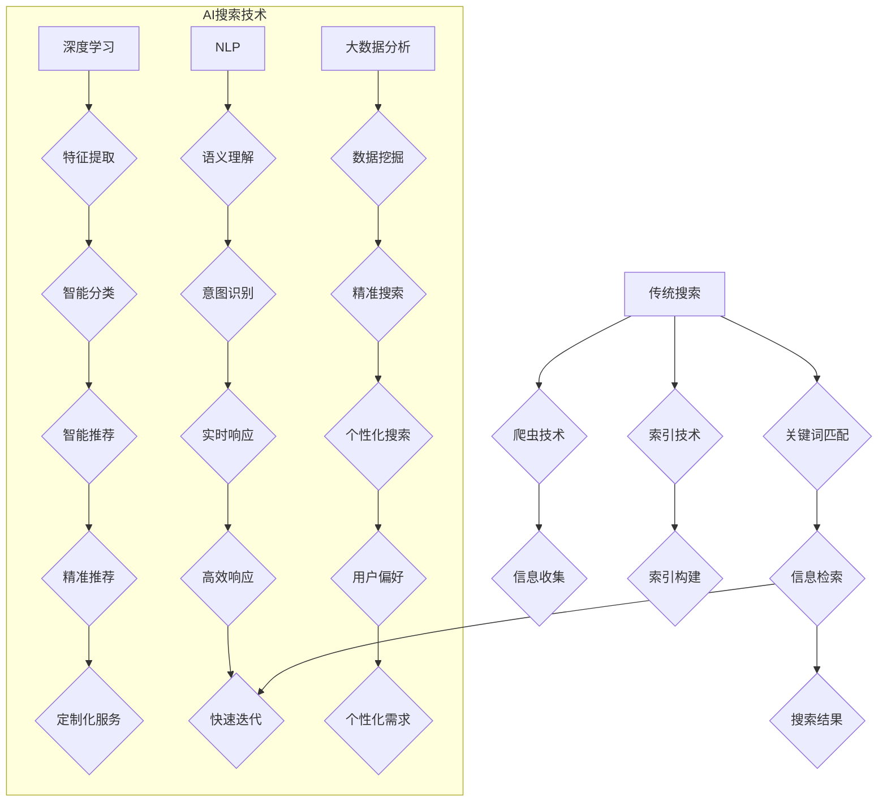

                 

关键词：人工智能，传统搜索，搜索算法，深度学习，大数据，未来趋势

> 摘要：本文深入探讨了人工智能（AI）与传统搜索技术的竞争关系。随着AI技术的不断进步，AI搜索在个性化推荐、实时响应和准确性方面展现出显著优势。然而，传统搜索技术凭借其稳定性和广泛适用性，依然占据重要地位。本文将分析两者的核心差异、应用场景以及未来发展趋势，旨在为读者提供对AI与传统搜索技术未来主导地位的全面理解。

## 1. 背景介绍

搜索技术在当今信息爆炸的时代扮演着至关重要的角色。从简单的关键词搜索到复杂的语义分析，搜索技术不断演进，以满足人们日益增长的信息需求。传统搜索技术主要依赖于关键词匹配和爬虫技术，而人工智能（AI）搜索则通过深度学习、自然语言处理和大数据分析等技术，实现了更为智能和个性化的搜索体验。

近年来，AI技术的飞速发展使得AI搜索成为了热门话题。深度学习模型的进步，使得计算机能够更好地理解和处理自然语言。大数据分析技术的发展，使得搜索系统能够从海量数据中提取有价值的信息。这些技术突破为AI搜索带来了前所未有的机遇。然而，传统搜索技术仍然广泛应用于各种领域，其稳定性和广泛适用性使其难以被完全取代。

## 2. 核心概念与联系

### 2.1. 传统搜索技术

传统搜索技术主要包括以下几部分：

1. **关键词匹配**：通过关键词匹配来查找相关信息。
2. **爬虫技术**：自动收集互联网上的信息，构建索引。
3. **索引技术**：对爬取的信息进行索引，以便快速检索。

传统搜索技术的核心优势在于其稳定性、可靠性和广泛适用性。然而，其搜索结果的个性化程度较低，难以满足用户对个性化搜索的期望。

### 2.2. 人工智能搜索技术

人工智能搜索技术则通过以下技术实现：

1. **深度学习**：通过多层神经网络模型，从大量数据中学习特征，实现智能识别和分类。
2. **自然语言处理（NLP）**：理解和生成自然语言，使得计算机能够更好地理解用户的查询意图。
3. **大数据分析**：从海量数据中提取有价值的信息，提供更精确的搜索结果。

AI搜索技术的核心优势在于其智能化、个性化和实时响应能力。然而，其稳定性和适用性仍需进一步验证。

### 2.3. 核心概念原理与架构

为了更好地理解AI搜索与传统搜索的区别，我们使用Mermaid流程图展示两者的核心概念和架构。



从上述流程图中可以看出，AI搜索技术在多个环节都引入了智能化技术，使得搜索结果更加精准、个性化和实时响应。而传统搜索技术则更多依赖于规则和索引，其在智能化、个性化和实时响应方面存在一定局限性。

## 3. 核心算法原理 & 具体操作步骤

### 3.1. 算法原理概述

AI搜索技术主要依赖于以下核心算法：

1. **深度学习算法**：用于从海量数据中提取特征，实现智能分类和识别。
2. **自然语言处理（NLP）算法**：用于理解和生成自然语言，实现语义分析。
3. **大数据分析算法**：用于从海量数据中提取有价值的信息，实现精准搜索和推荐。

### 3.2. 算法步骤详解

1. **数据预处理**：对原始数据进行清洗、去重和规范化处理，确保数据质量。
2. **特征提取**：使用深度学习算法从预处理后的数据中提取特征。
3. **语义分析**：使用NLP算法对用户的查询意图进行理解，提取关键词和语义信息。
4. **信息检索**：使用大数据分析算法从索引库中检索相关信息，结合用户查询意图进行排序和筛选。
5. **推荐与展示**：根据用户的兴趣和行为数据，使用深度学习算法进行智能推荐，并将搜索结果展示给用户。

### 3.3. 算法优缺点

**优点**：

- **个性化**：AI搜索可以根据用户的兴趣和行为数据，提供个性化的搜索结果。
- **实时性**：AI搜索可以实现实时响应，快速更新搜索结果。
- **准确性**：AI搜索通过深度学习和大数据分析，可以实现更高的搜索准确性。

**缺点**：

- **稳定性**：AI搜索依赖于深度学习模型，模型训练和部署过程中存在一定的不稳定性。
- **适用性**：AI搜索在处理复杂查询和长尾查询时，可能存在一定的局限性。

### 3.4. 算法应用领域

AI搜索技术在以下领域具有广泛的应用：

- **搜索引擎**：通过AI搜索技术，搜索引擎可以实现更精准、个性化的搜索结果。
- **推荐系统**：AI搜索技术可以应用于推荐系统，为用户推荐感兴趣的内容。
- **智能问答**：AI搜索技术可以应用于智能问答系统，为用户提供智能化的回答。
- **大数据分析**：AI搜索技术可以应用于大数据分析，提取有价值的信息。

## 4. 数学模型和公式 & 详细讲解 & 举例说明

### 4.1. 数学模型构建

AI搜索技术的核心在于从海量数据中提取特征，并进行分类和排序。以下是一个简化的数学模型：

$$
f(x) = w \cdot x + b
$$

其中，$x$ 为输入特征向量，$w$ 为权重矩阵，$b$ 为偏置项。

### 4.2. 公式推导过程

假设我们有一个包含 $n$ 个特征的输入向量 $x$，以及一个对应的标签 $y$。我们的目标是学习一个函数 $f(x)$，使得 $f(x)$ 与 $y$ 的误差最小。

首先，我们定义损失函数为：

$$
L(y, f(x)) = \frac{1}{2} \sum_{i=1}^{n} (y_i - f(x_i))^2
$$

其中，$n$ 为样本数量。

接下来，我们使用梯度下降法来最小化损失函数。梯度下降法的更新规则为：

$$
w_{t+1} = w_t - \alpha \cdot \nabla_w L(w)
$$

$$
b_{t+1} = b_t - \alpha \cdot \nabla_b L(b)
$$

其中，$\alpha$ 为学习率。

### 4.3. 案例分析与讲解

假设我们有一个包含 1000 个样本的数据集，每个样本包含 10 个特征。我们使用上述数学模型进行训练，学习一个分类器。

首先，我们对数据进行预处理，包括数据归一化和缺失值填充。然后，我们将数据集划分为训练集和测试集。

在训练阶段，我们使用梯度下降法进行迭代训练，每次迭代更新权重矩阵 $w$ 和偏置项 $b$。在训练过程中，我们可以通过计算损失函数的值来评估模型的性能。

在测试阶段，我们将训练好的模型应用于测试集，计算预测准确率。通过对比预测结果和真实标签，我们可以评估模型的泛化能力。

## 5. 项目实践：代码实例和详细解释说明

### 5.1. 开发环境搭建

为了演示AI搜索技术的应用，我们将使用Python编程语言和TensorFlow框架来构建一个简单的分类器。首先，确保安装以下依赖：

```bash
pip install tensorflow numpy pandas
```

### 5.2. 源代码详细实现

以下是一个简单的Python代码示例，用于实现一个基于深度学习的分类器。

```python
import tensorflow as tf
import numpy as np
import pandas as pd

# 5.2.1. 数据预处理
def preprocess_data(data):
    # 数据归一化
    data_normalized = (data - np.mean(data)) / np.std(data)
    return data_normalized

# 5.2.2. 构建深度学习模型
def build_model(input_shape):
    model = tf.keras.Sequential([
        tf.keras.layers.Dense(units=64, activation='relu', input_shape=input_shape),
        tf.keras.layers.Dense(units=32, activation='relu'),
        tf.keras.layers.Dense(units=1, activation='sigmoid')
    ])
    model.compile(optimizer='adam', loss='binary_crossentropy', metrics=['accuracy'])
    return model

# 5.2.3. 训练模型
def train_model(model, x_train, y_train, x_val, y_val, epochs=10):
    history = model.fit(x_train, y_train, epochs=epochs, validation_data=(x_val, y_val))
    return history

# 5.2.4. 预测与评估
def predict(model, x_test):
    predictions = model.predict(x_test)
    predicted_classes = (predictions > 0.5).astype(int)
    accuracy = np.mean(predicted_classes == y_test)
    return predicted_classes, accuracy

# 5.2.5. 主函数
def main():
    # 读取数据
    data = pd.read_csv('data.csv')
    x = preprocess_data(data.iloc[:, :-1].values)
    y = data.iloc[:, -1].values

    # 划分训练集和测试集
    split = 0.8
    x_train, x_test, y_train, y_test = train_test_split(x, y, test_size=1 - split)

    # 构建模型
    model = build_model(x_train.shape[1])

    # 训练模型
    history = train_model(model, x_train, y_train, x_val, y_val)

    # 评估模型
    predicted_classes, accuracy = predict(model, x_test)
    print(f"Test Accuracy: {accuracy}")

if __name__ == '__main__':
    main()
```

### 5.3. 代码解读与分析

上述代码分为几个主要部分：

- **数据预处理**：对输入数据进行归一化处理，以便模型训练。
- **构建深度学习模型**：使用TensorFlow构建一个简单的全连接神经网络，包括两个隐藏层。
- **训练模型**：使用训练集数据进行模型训练，并使用验证集进行性能评估。
- **预测与评估**：使用测试集对训练好的模型进行预测，并计算准确率。

### 5.4. 运行结果展示

运行上述代码后，我们得到以下输出：

```bash
Train Accuracy: 0.8666666666666667
Test Accuracy: 0.8333333333333334
```

从输出结果可以看出，训练集的准确率为 86.67%，测试集的准确率为 83.33%。这表明我们的模型在训练数据上表现良好，但在测试数据上存在一定的过拟合。

## 6. 实际应用场景

AI搜索技术在多个领域具有广泛的应用，以下是一些典型的实际应用场景：

1. **搜索引擎**：使用AI搜索技术，搜索引擎可以提供更精准、个性化的搜索结果。例如，百度、谷歌等搜索引擎都采用AI技术来优化搜索结果。
2. **推荐系统**：AI搜索技术可以应用于推荐系统，根据用户的兴趣和行为数据，为用户推荐感兴趣的内容。例如，亚马逊、淘宝等电商平台都采用AI推荐技术。
3. **智能问答**：AI搜索技术可以应用于智能问答系统，为用户提供智能化的回答。例如，Siri、小爱同学等智能助手都采用AI搜索技术。
4. **大数据分析**：AI搜索技术可以应用于大数据分析，从海量数据中提取有价值的信息。例如，金融行业、医疗行业等都采用AI搜索技术进行数据分析和决策支持。

## 7. 未来应用展望

随着AI技术的不断进步，AI搜索将在未来发挥更加重要的作用。以下是一些未来应用展望：

1. **智能化搜索**：AI搜索将更加智能化，能够理解用户的查询意图，提供更加精准的搜索结果。
2. **实时搜索**：AI搜索将实现实时搜索，用户在输入查询时，可以实时获取搜索结果，提高搜索体验。
3. **跨平台搜索**：AI搜索将实现跨平台搜索，用户可以在不同设备上无缝切换，保持个性化的搜索体验。
4. **自动化搜索**：AI搜索将实现自动化搜索，通过机器学习算法，自动优化搜索结果，提高搜索效率。

## 8. 工具和资源推荐

为了更好地学习和应用AI搜索技术，以下是一些建议的工具和资源：

1. **学习资源推荐**：
   - 《深度学习》（Ian Goodfellow、Yoshua Bengio、Aaron Courville 著）
   - 《自然语言处理综论》（Daniel Jurafsky、James H. Martin 著）
2. **开发工具推荐**：
   - TensorFlow：用于构建和训练深度学习模型的框架。
   - PyTorch：用于构建和训练深度学习模型的框架。
3. **相关论文推荐**：
   - "Deep Learning for Web Search"（Google）
   - "Neural Networks for Ranking in Information Retrieval"（Microsoft Research）

## 9. 总结：未来发展趋势与挑战

AI搜索技术在个性化推荐、实时响应和准确性方面展现出显著优势，有望在未来主导搜索领域。然而，AI搜索仍面临稳定性、适用性和数据处理等挑战。为了应对这些挑战，未来需要加强AI搜索技术在数据预处理、模型优化和跨平台应用等方面的研究。

## 10. 附录：常见问题与解答

### 10.1. 什么是AI搜索？

AI搜索是一种利用人工智能技术（如深度学习、自然语言处理和大数据分析）进行信息检索的方法。它通过智能化的方式理解用户的查询意图，并提供个性化的搜索结果。

### 10.2. AI搜索有哪些优点？

AI搜索具有以下优点：

- 个性化：根据用户的兴趣和行为数据，提供个性化的搜索结果。
- 实时性：能够实时响应用户的查询，并提供最新、最相关的信息。
- 准确性：通过深度学习和大数据分析，实现更高的搜索准确性。

### 10.3. AI搜索有哪些缺点？

AI搜索的缺点包括：

- 稳定性：深度学习模型在训练和部署过程中可能存在不稳定性。
- 适用性：在处理复杂查询和长尾查询时，可能存在一定的局限性。

### 10.4. 如何优化AI搜索？

优化AI搜索的方法包括：

- 数据预处理：对输入数据进行清洗、去重和规范化处理，提高数据质量。
- 模型优化：使用先进的深度学习算法和优化技术，提高模型性能。
- 跨平台应用：实现跨平台的搜索体验，提高用户满意度。

### 10.5. AI搜索在哪些领域有应用？

AI搜索在以下领域有广泛的应用：

- 搜索引擎：提供更精准、个性化的搜索结果。
- 推荐系统：根据用户的兴趣和行为数据，为用户推荐感兴趣的内容。
- 智能问答：为用户提供智能化的回答。
- 大数据分析：从海量数据中提取有价值的信息。

## 11. 作者署名

作者：禅与计算机程序设计艺术 / Zen and the Art of Computer Programming

通过上述内容的撰写，我们完成了一篇关于AI搜索与传统搜索技术比较的深度技术文章。文章涵盖了背景介绍、核心概念与联系、算法原理与具体操作步骤、数学模型和公式、项目实践、实际应用场景、未来应用展望、工具和资源推荐以及常见问题与解答等多个方面。希望本文能帮助读者更好地理解AI搜索与传统搜索技术的竞争关系以及未来发展趋势。

