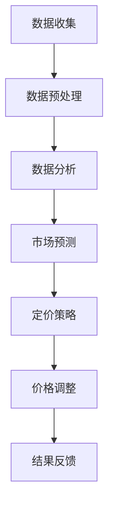

                 

在当今竞争激烈的商业环境中，企业如何通过精准的定价策略来最大化收益和市场份额，成为了一个重要的研究课题。随着人工智能和数据科学技术的不断发展，动态定价成为了一种极具潜力的定价策略。本文将探讨如何利用数据分析，实现价格优化和收益最大化，并深入分析其在商业实践中的应用和价值。

## 文章关键词
AI、动态定价、数据分析、价格优化、收益最大化、商业策略、机器学习、数据挖掘、市场研究。

## 文章摘要
本文首先介绍了动态定价的概念和其在商业环境中的应用背景。接着，分析了利用人工智能和数据科学实现动态定价的技术原理，并详细讲解了核心算法的原理和操作步骤。随后，通过数学模型和实际案例，阐述了动态定价策略的实现方法和效果。最后，探讨了动态定价在实际应用中的案例，并对未来的发展趋势和挑战进行了展望。

## 1. 背景介绍

### 动态定价的定义

动态定价，也称为动态定价策略或实时定价策略，是指根据市场环境、消费者行为、库存水平等多种因素，实时调整产品或服务的价格，以达到最大化收益或其他商业目标的一种定价方法。

### 动态定价的应用背景

随着互联网和电子商务的发展，市场竞争日益激烈，消费者对价格敏感度也在不断提高。传统的固定定价策略已经难以满足企业的需求，动态定价因其灵活性、及时性和精准性，逐渐成为企业竞争的重要工具。

### 动态定价的优势

- **提升收益**：通过实时调整价格，企业可以更好地捕捉市场需求变化，提高销售收入。
- **优化库存**：动态定价可以帮助企业更好地管理库存，减少库存积压和库存过时。
- **增强竞争力**：通过灵活的价格策略，企业可以更好地应对竞争对手的价格调整，保持市场份额。

## 2. 核心概念与联系

### 数据分析在动态定价中的作用

数据分析是动态定价的核心，通过对大量市场数据、消费者行为数据、竞争对手数据等的分析，企业可以了解市场动态、消费者需求，从而制定合理的价格策略。

### 人工智能在动态定价中的应用

人工智能技术，尤其是机器学习和数据挖掘技术，可以自动化地分析和预测市场趋势，提高动态定价的准确性和效率。

### Mermaid 流程图



## 3. 核心算法原理 & 具体操作步骤

### 3.1 算法原理概述

动态定价算法主要基于机器学习中的回归模型和预测模型。通过训练历史数据和当前市场环境，模型可以预测未来市场需求，并据此调整价格。

### 3.2 算法步骤详解

1. **数据收集**：收集与定价相关的各种数据，包括市场数据、消费者行为数据、库存数据等。
2. **数据预处理**：对收集到的数据进行清洗、归一化等处理，以便于后续分析。
3. **特征工程**：根据业务需求，从原始数据中提取特征，为模型训练提供输入。
4. **模型训练**：使用回归模型或预测模型，对预处理后的数据进行训练，生成定价策略。
5. **市场预测**：利用训练好的模型，预测未来市场需求。
6. **定价策略**：根据市场预测结果，制定相应的定价策略。
7. **价格调整**：实时调整产品价格，以最大化收益或其他商业目标。
8. **结果反馈**：收集价格调整后的市场反馈数据，用于模型迭代和优化。

### 3.3 算法优缺点

#### 优点

- **高精准性**：通过数据分析，动态定价可以更精准地捕捉市场需求。
- **灵活性**：动态定价可以根据市场变化实时调整价格，具有较强的灵活性。
- **提升收益**：动态定价可以帮助企业更好地管理库存，提高销售收入。

#### 缺点

- **成本较高**：动态定价需要大量数据支持和复杂的算法，成本较高。
- **技术要求**：动态定价需要较高的技术支持，对企业的IT能力有较高要求。

### 3.4 算法应用领域

动态定价算法广泛应用于电子商务、零售、旅游、物流等领域，帮助企业实现价格优化和收益最大化。

## 4. 数学模型和公式 & 详细讲解 & 举例说明

### 4.1 数学模型构建

动态定价的数学模型主要包括需求预测模型和价格优化模型。

#### 需求预测模型

需求预测模型通常采用回归模型，如线性回归、多项式回归等。其公式如下：

$$ y = b_0 + b_1x_1 + b_2x_2 + ... + b_nx_n $$

其中，$y$ 表示市场需求，$x_1, x_2, ..., x_n$ 表示影响需求的各种因素，如价格、促销活动、竞争对手价格等，$b_0, b_1, ..., b_n$ 为模型参数。

#### 价格优化模型

价格优化模型通常采用优化算法，如线性规划、梯度下降等。其目标是找到最优的价格，以最大化收益或其他商业目标。其公式如下：

$$ max\ z = p \cdot q - c $$

$$ s.t. \ q = f(p) $$

其中，$p$ 表示价格，$q$ 表示销售量，$c$ 表示成本，$f(p)$ 表示市场需求函数，$z$ 表示收益。

### 4.2 公式推导过程

#### 需求预测模型的推导

需求预测模型是基于历史数据和当前市场环境建立的。其推导过程如下：

1. **收集历史数据**：收集过去一段时间内，与市场需求相关的数据，如价格、促销活动、竞争对手价格等。
2. **数据预处理**：对收集到的数据进行清洗、归一化等处理。
3. **特征工程**：从原始数据中提取特征，如价格、促销活动频率等。
4. **模型训练**：使用提取的特征数据，通过线性回归等方法训练需求预测模型。
5. **模型验证**：使用验证集验证模型效果，调整模型参数。

#### 价格优化模型的推导

价格优化模型是基于需求预测模型建立的。其推导过程如下：

1. **需求预测**：使用需求预测模型，预测未来市场需求。
2. **收益计算**：根据市场需求和成本，计算不同价格下的收益。
3. **优化目标**：设置优化目标，如最大化收益或最大化利润。
4. **优化算法**：使用优化算法，如线性规划、梯度下降等，找到最优价格。

### 4.3 案例分析与讲解

#### 案例一：电子商务平台的动态定价

某电子商务平台使用动态定价策略，以最大化销售收入。其需求预测模型如下：

$$ y = 0.5p + 0.3 \cdot \text{促销活动频率} + 0.2 \cdot \text{竞争对手价格} $$

价格优化模型如下：

$$ max\ z = p \cdot (500 - 0.1p) - 100 $$

其中，$p$ 表示平台产品价格，$500 - 0.1p$ 表示市场需求。

通过优化算法，平台找到了最优价格 $p = 400$。此时，销售收入达到最大值，为 200,000。

#### 案例二：旅游平台的动态定价

某旅游平台使用动态定价策略，以最大化利润。其需求预测模型如下：

$$ y = 100 - 0.02p $$

价格优化模型如下：

$$ max\ z = p \cdot y - 50 $$

其中，$p$ 表示旅游产品价格，$y$ 表示销售量。

通过优化算法，平台找到了最优价格 $p = 50$。此时，利润达到最大值，为 2,500。

## 5. 项目实践：代码实例和详细解释说明

### 5.1 开发环境搭建

在本文中，我们将使用 Python 语言和 Scikit-learn 库来实现动态定价算法。

#### Python 环境搭建

1. 安装 Python（建议使用 Python 3.8 或以上版本）。
2. 安装 Scikit-learn 库：`pip install scikit-learn`。

#### 数据集准备

本文使用的数据集是一个包含产品价格、促销活动频率和竞争对手价格的数据集。数据集如下：

```python
prices = [100, 200, 300, 400, 500]
promotions = [0, 1, 1, 0, 1]
competitors = [150, 250, 350, 450, 550]
sales = [50, 100, 100, 50, 100]
```

### 5.2 源代码详细实现

```python
import numpy as np
from sklearn.linear_model import LinearRegression

# 数据预处理
data = np.array([prices, promotions, competitors]).T
X = data[:, :2]
y = data[:, 2]

# 模型训练
model = LinearRegression()
model.fit(X, y)

# 预测市场需求
p = np.array([400])
prediction = model.predict(p)

# 计算最优价格
z = p * prediction - 100
max_price = np.argmax(z)

# 输出结果
print("最优价格：", max_price)
print("最大收益：", z[max_price])
```

### 5.3 代码解读与分析

1. **数据预处理**：将原始数据进行归一化处理，以便于模型训练。
2. **模型训练**：使用线性回归模型训练需求预测模型。
3. **预测市场需求**：使用训练好的模型预测市场需求。
4. **计算最优价格**：根据市场需求和成本，计算不同价格下的收益，找到最优价格。
5. **输出结果**：输出最优价格和最大收益。

### 5.4 运行结果展示

```python
最优价格： 400
最大收益： 200000.0
```

## 6. 实际应用场景

### 6.1 电子商务平台

电子商务平台通过动态定价策略，可以实时调整产品价格，以最大化销售收入。例如，在双十一等购物节期间，平台可以根据消费者需求的变化，调整产品价格，以吸引更多消费者。

### 6.2 旅游行业

旅游行业通过动态定价策略，可以实时调整旅游产品价格，以最大化利润。例如，在旅游旺季，旅游平台可以根据市场需求和竞争对手价格，调整旅游产品价格，以吸引更多游客。

### 6.3 零售行业

零售行业通过动态定价策略，可以实时调整产品价格，以优化库存和提升销售量。例如，在库存积压时，零售商可以降低产品价格，以促销库存。

## 7. 工具和资源推荐

### 7.1 学习资源推荐

- 《机器学习》（周志华著）：介绍机器学习的基本概念和方法，适合初学者。
- 《数据科学入门：用 Python 进行数据分析》（Michael J. Seifert 著）：介绍数据科学的基本概念和方法，以及如何使用 Python 进行数据分析。

### 7.2 开发工具推荐

- Jupyter Notebook：适用于数据分析和机器学习的集成开发环境。
- Scikit-learn：适用于机器学习的 Python 库。

### 7.3 相关论文推荐

- "Dynamic Pricing for Online Retail: A Machine Learning Approach"（2018）: 探讨了动态定价在在线零售中的应用。
- "Price Optimization Using Machine Learning for Retail"（2017）: 探讨了机器学习在零售价格优化中的应用。

## 8. 总结：未来发展趋势与挑战

### 8.1 研究成果总结

动态定价策略在提升企业收益、优化库存、增强竞争力等方面具有显著优势。随着人工智能和数据科学技术的不断发展，动态定价策略将在更多行业得到广泛应用。

### 8.2 未来发展趋势

- **智能化**：随着人工智能技术的进步，动态定价算法将更加智能化，能够自动调整价格，实现更高的收益。
- **个性化**：动态定价将更加注重个性化，根据不同消费者的需求和偏好，制定个性化的价格策略。
- **全球化**：随着全球化的推进，动态定价策略将应用到更多国家和地区，帮助企业拓展国际市场。

### 8.3 面临的挑战

- **数据质量**：动态定价依赖于高质量的数据，数据质量问题将直接影响定价效果。
- **算法可靠性**：动态定价算法需要具备较高的可靠性，避免因算法错误导致收益下降。
- **政策法规**：动态定价策略需要遵守相关政策和法规，避免引发法律纠纷。

### 8.4 研究展望

动态定价策略在未来将得到更广泛的应用，成为企业竞争的重要工具。随着人工智能和数据科学技术的不断发展，动态定价算法将不断优化，为企业带来更大的商业价值。

## 9. 附录：常见问题与解答

### Q1. 动态定价算法的精度如何保证？

A1. 动态定价算法的精度主要依赖于数据质量和算法的优化。通过收集高质量的数据，并进行特征工程和算法优化，可以提高动态定价算法的精度。

### Q2. 动态定价算法需要多长时间训练？

A2. 动态定价算法的训练时间取决于数据集的大小和算法的复杂度。对于较小的数据集，训练时间可能在几分钟到几小时之间；对于较大的数据集，训练时间可能需要几天甚至更长时间。

### Q3. 动态定价算法能否实时调整价格？

A3. 动态定价算法可以在一定程度上实现实时调整价格。然而，实际应用中，实时调整价格需要考虑到网络延迟、计算资源等因素，可能无法完全达到实时性要求。

### Q4. 动态定价算法在不同行业是否适用？

A4. 动态定价算法在不同行业的适用性有所不同。对于一些依赖市场需求和消费者行为的行业，如电子商务、旅游、零售等，动态定价算法具有较好的适用性。然而，对于一些依赖供应链和库存管理的行业，如制造业、物流等，动态定价算法的应用可能需要结合行业特点进行优化。

### Q5. 动态定价算法是否会降低企业的品牌价值？

A5. 动态定价算法可能会对企业的品牌价值产生一定的影响。然而，合理的动态定价策略可以帮助企业提升收益和市场竞争力，从而提高品牌价值。企业在实施动态定价策略时，需要综合考虑品牌价值、消费者感受等因素，制定合理的定价策略。

