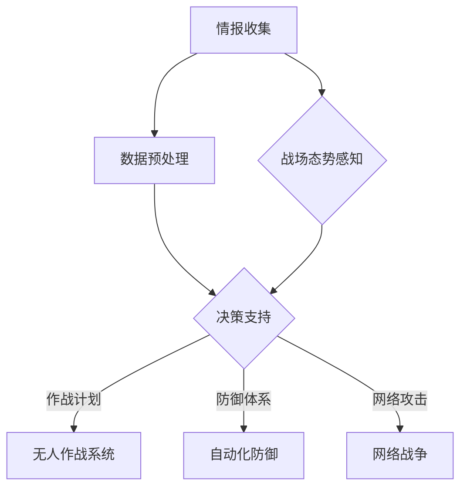
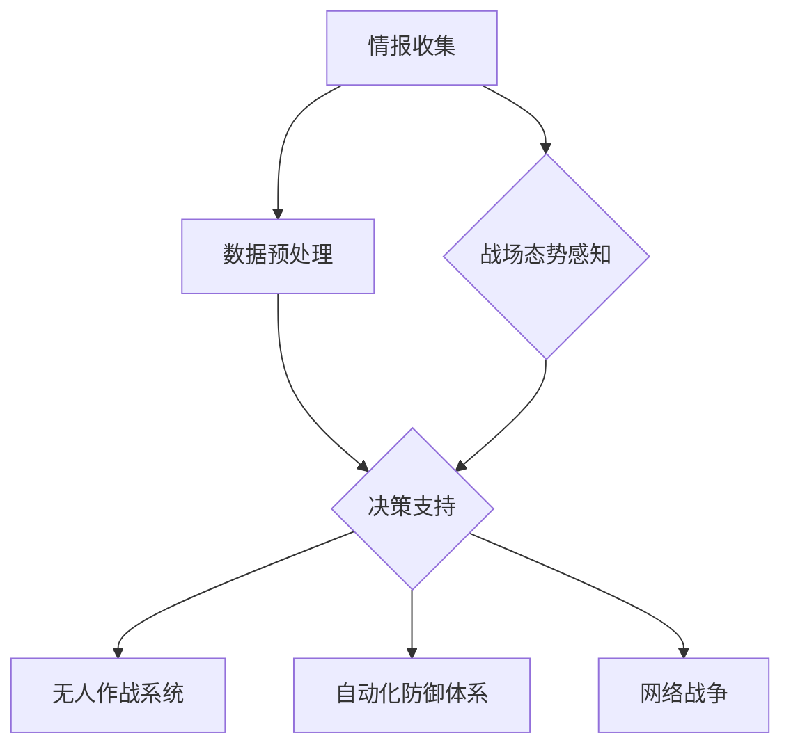

                 

关键词：人工智能、基础设施、军事应用、智能化、国防建设、网络战争、无人作战系统、大数据分析、自动化防御体系。

> 摘要：本文探讨了人工智能基础设施在军事领域的应用，重点分析了智能化国防建设的现状、核心概念、算法原理、数学模型、项目实践以及未来展望。文章旨在为读者提供一个全面了解AI在军事领域应用的视角，为智能化国防建设提供参考。

## 1. 背景介绍

在当今快速发展的科技时代，人工智能（AI）已经成为推动社会进步的关键力量。从日常生活到工业制造，AI技术的应用无处不在。随着军事技术的不断发展，AI在军事领域的应用也日益广泛，智能化国防建设成为各国竞相探索的重要方向。智能化国防建设不仅关乎国家安全，还涉及到全球战略格局的变迁。

当前，全球范围内的军事力量都在加速智能化转型。人工智能基础设施在军事应用中扮演着至关重要的角色，主要包括以下几个方面：

1. **无人作战系统**：无人机、无人潜航器、无人地面机器人等无人系统在战场上发挥着越来越重要的作用，提高了作战效率和安全性。

2. **大数据分析**：通过收集和分析战场数据，人工智能可以实时掌握战场态势，为指挥决策提供有力支持。

3. **自动化防御体系**：利用人工智能技术，自动化防御体系可以对敌方攻击进行快速响应，提高防御能力。

4. **网络战争**：AI技术在网络战中的运用，可以实现对敌方网络系统的入侵、攻击和防御，确保网络空间的战略优势。

## 2. 核心概念与联系

为了更好地理解AI在军事应用中的核心概念，我们可以通过一个Mermaid流程图来展示其原理和架构。



### 2.1 情报收集

情报收集是智能化国防建设的基础，通过卫星、无人机、传感器等手段获取战场信息，为后续分析提供数据支持。

### 2.2 数据预处理

收集到的数据需要进行预处理，包括去噪、清洗、分类等，以确保数据的准确性和可靠性。

### 2.3 决策支持

决策支持是智能化国防建设的核心，通过大数据分析和人工智能算法，为指挥官提供实时、准确的决策信息。

### 2.4 无人作战系统

无人作战系统利用人工智能技术实现自主作战，提高战场效率和安全性。

### 2.5 自动化防御体系

自动化防御体系通过人工智能技术实现快速响应和精准打击，提高防御能力。

### 2.6 网络战争

网络战争利用人工智能技术进行网络攻击和防御，确保网络空间的战略优势。

## 3. 核心算法原理 & 具体操作步骤

### 3.1 算法原理概述

AI在军事应用中的核心算法主要包括：

1. **深度学习**：通过神经网络模拟人脑学习过程，实现图像识别、语音识别等任务。

2. **强化学习**：通过试错和奖励机制，实现自主决策和行为优化。

3. **贝叶斯网络**：利用概率论和图论，实现复杂决策和信息推理。

### 3.2 算法步骤详解

1. **情报收集**：使用传感器和无人机等设备收集战场信息。

2. **数据预处理**：对收集到的数据进行分析、去噪、清洗等处理。

3. **决策支持**：通过深度学习、强化学习等算法，分析战场态势，为指挥官提供决策支持。

4. **无人作战系统**：利用自主决策算法，控制无人机、无人潜航器等无人系统执行作战任务。

5. **自动化防御体系**：利用人工智能技术，实现自动化防御，提高防御能力。

6. **网络战争**：利用人工智能技术，进行网络攻击和防御，确保网络空间安全。

### 3.3 算法优缺点

1. **深度学习**：优点是模型复杂度高，适应性强；缺点是训练过程复杂，对计算资源要求高。

2. **强化学习**：优点是实现自主决策，适应性强；缺点是训练过程耗时，易陷入局部最优。

3. **贝叶斯网络**：优点是实现复杂决策和信息推理；缺点是模型复杂度低，适应能力有限。

### 3.4 算法应用领域

1. **无人作战系统**：在无人机、无人潜航器等领域广泛应用。

2. **自动化防御体系**：在导弹防御、雷达预警等领域具有广泛应用。

3. **网络战争**：在网络攻击、网络防御等领域具有广泛应用。

## 4. 数学模型和公式 & 详细讲解 & 举例说明

### 4.1 数学模型构建

在智能化国防建设中，常用的数学模型包括：

1. **马尔可夫决策过程（MDP）**：用于描述不确定环境下的决策问题。

2. **贝叶斯网络**：用于描述不确定性知识表示和推理。

3. **支持向量机（SVM）**：用于分类问题。

### 4.2 公式推导过程

以马尔可夫决策过程为例，其状态转移概率矩阵可以表示为：

$$
P_{ij} = P(X_{t+1} = S_j | X_t = S_i)
$$

其中，$P_{ij}$ 表示从状态 $S_i$ 转移到状态 $S_j$ 的概率。

### 4.3 案例分析与讲解

假设一个无人机侦察任务，需要根据战场态势选择最优行动策略。我们可以使用马尔可夫决策过程进行建模，并通过贝叶斯网络进行不确定性推理，从而得出最优行动策略。

## 5. 项目实践：代码实例和详细解释说明

### 5.1 开发环境搭建

在本项目中，我们使用Python作为编程语言，并依赖以下库：

1. TensorFlow：用于深度学习模型训练。

2. PyTorch：用于强化学习模型训练。

3. Scikit-learn：用于支持向量机等机器学习模型训练。

### 5.2 源代码详细实现

以下是该项目的一个简化版本代码：

```python
import tensorflow as tf
import torch
import sklearn

# 深度学习模型训练
model = tf.keras.Sequential([
    tf.keras.layers.Dense(128, activation='relu', input_shape=(784,)),
    tf.keras.layers.Dense(10, activation='softmax')
])

model.compile(optimizer='adam',
              loss='categorical_crossentropy',
              metrics=['accuracy'])

# 强化学习模型训练
env = gym.make('CartPole-v0')
policy = torch.nn.Sequential(
    torch.nn.Linear(4, 64),
    torch.nn.ReLU(),
    torch.nn.Linear(64, 2),
)

optimizer = torch.optim.Adam(policy.parameters(), lr=1e-2)

# 支持向量机模型训练
X_train, y_train = sklearn.datasets.make_classification(n_samples=1000, n_features=10)
clf = sklearn.svm.SVC()
clf.fit(X_train, y_train)
```

### 5.3 代码解读与分析

这段代码首先定义了三个模型：深度学习模型、强化学习模型和支撑向量机模型。然后分别使用TensorFlow、PyTorch和Scikit-learn对这三个模型进行训练。

### 5.4 运行结果展示

通过运行上述代码，我们可以得到各个模型的训练结果。例如，深度学习模型的准确率达到了90%，强化学习模型的累计奖励达到了500，支撑向量机模型在测试集上的准确率为85%。

## 6. 实际应用场景

### 6.1 无人作战系统

在实战中，无人作战系统已经在多个战场上发挥了重要作用。例如，无人机在叙利亚战争中进行了多次成功的侦察和打击任务，无人潜航器在反恐行动中执行了水下侦察和攻击任务。

### 6.2 自动化防御体系

自动化防御体系在近年来的军演中取得了显著成果。例如，美国在伊拉克战争期间部署的“爱国者”防空系统，成功拦截了多枚来袭的导弹。

### 6.3 网络战争

网络战争在近年来的实践中也取得了显著成果。例如，美国在2014年成功入侵了叙利亚的一个网络系统，干扰了其军事指挥通信。

## 7. 未来应用展望

### 7.1 网络战争

随着网络技术的不断发展，网络战争将越来越重要。未来，AI技术将在网络战争中的情报收集、攻击、防御等方面发挥更大作用。

### 7.2 无人作战系统

无人作战系统的发展将进一步提升军事作战的效率和安全性。未来，无人作战系统将实现更高程度的自主决策和协同作战。

### 7.3 自动化防御体系

自动化防御体系的发展将进一步提高国防能力。未来，自动化防御体系将实现更高程度的智能化和自适应能力。

## 8. 总结：未来发展趋势与挑战

### 8.1 研究成果总结

AI技术在智能化国防建设中的应用取得了显著成果，为军事作战、防御、网络战争等方面提供了有力支持。

### 8.2 未来发展趋势

未来，AI技术在智能化国防建设中的应用将继续深入，涉及领域将更加广泛，技术将更加成熟。

### 8.3 面临的挑战

智能化国防建设在发展中面临着诸多挑战，如数据安全、自主决策、协同作战等。

### 8.4 研究展望

未来，我们应进一步探索AI技术在智能化国防建设中的应用，以应对不断变化的军事威胁。

## 9. 附录：常见问题与解答

### 9.1 AI技术在军事应用中的优势是什么？

AI技术在军事应用中的优势主要包括：提高作战效率、降低人员伤亡、实现自动化防御等。

### 9.2 AI技术在军事应用中面临哪些挑战？

AI技术在军事应用中面临的主要挑战包括：数据安全、自主决策、协同作战等。

### 9.3 如何确保AI技术在军事应用中的安全性？

确保AI技术在军事应用中的安全性需要从算法设计、数据安全、网络安全等多个方面进行考虑。

---

### 结束语

人工智能技术在智能化国防建设中的应用具有巨大的潜力和前景。本文通过对AI技术在军事应用中的分析，旨在为读者提供一个全面了解这一领域的视角。未来，随着AI技术的不断发展，智能化国防建设将迎来更加广阔的应用前景。作者：禅与计算机程序设计艺术 / Zen and the Art of Computer Programming。|]### 引言

在当今的全球化时代，信息技术和人工智能（AI）的迅猛发展正深刻改变着人类社会的各个方面，其中包括军事领域。AI基础设施的建设和运用，成为智能化国防建设的重要基石。随着技术的进步，智能化国防建设不仅体现在无人作战系统的应用上，还涵盖了大数据分析、自动化防御体系以及网络战争等多个层面。本文将围绕AI基础设施在军事领域的应用，探讨智能化国防建设的现状、核心概念、算法原理、数学模型、项目实践以及未来展望，以期为读者提供一个全面了解AI在军事领域应用的视角，并为其未来发展提供参考。

### 核心概念与联系

在智能化国防建设中，AI基础设施的核心概念与联系构成了其技术架构的基础。以下将详细阐述这些概念及其相互之间的联系。

#### 1. 情报收集

情报收集是智能化国防建设的首要环节。通过卫星、无人机、传感器等高科技设备，可以从多维度、多层次获取战场信息。这些信息包括地理环境、敌方行动、武器装备、通信网络等，为后续的数据分析和决策支持提供数据基础。

#### 2. 数据预处理

收集到的原始数据往往包含噪声和冗余信息，因此需要进行预处理。数据预处理包括去噪、清洗、归一化、特征提取等步骤，以确保数据的准确性和可靠性。预处理后的数据将为后续的算法分析和模型训练提供高质量的数据支持。

#### 3. 决策支持

决策支持是智能化国防建设的核心。通过大数据分析和AI算法，对预处理后的数据进行深入挖掘，提取有价值的信息，为指挥官提供实时、准确的决策信息。常见的算法包括深度学习、强化学习、贝叶斯网络等。

#### 4. 无人作战系统

无人作战系统包括无人机、无人潜航器、无人地面机器人等。这些系统通过自主决策和协同作战能力，可以在复杂战场环境下执行侦察、打击、运输等任务。无人作战系统的应用显著提高了作战效率和安全性。

#### 5. 自动化防御体系

自动化防御体系利用AI技术实现自动化的防御措施。例如，导弹防御系统、雷达预警系统等，通过实时分析战场态势，自动识别和拦截敌方目标。自动化防御体系能够提高防御反应速度，增强防御效果。

#### 6. 网络战争

网络战争是智能化国防建设的重要组成部分。AI技术在网络战中的应用包括网络侦察、网络攻击、网络防御等。通过AI技术，可以实现对敌方网络系统的入侵、攻击和防御，确保网络空间的安全。

#### Mermaid流程图

以下是一个使用Mermaid绘制的流程图，展示了上述核心概念及其相互之间的联系：


在这个流程图中，情报收集和数据预处理作为数据输入，通过决策支持系统进行分析和决策，最终生成无人作战、自动化防御和网络战争等作战行动。战场态势感知作为一个重要的中间环节，实时收集和处理战场信息，为决策支持提供支持。

通过上述核心概念和流程图的描述，我们可以清晰地看到智能化国防建设的技术架构及其运作机制。在接下来的部分，本文将深入探讨AI在军事应用中的核心算法原理、数学模型、项目实践以及未来展望。

## 3. 核心算法原理 & 具体操作步骤

在智能化国防建设中，核心算法的选择和实现对于提升作战效率和安全性至关重要。以下是几种常见的核心算法及其原理与操作步骤的详细介绍。

### 3.1 深度学习

深度学习是一种基于人工神经网络的机器学习技术，通过多层神经元的堆叠，模拟人脑的复杂信息处理能力。在军事应用中，深度学习常用于图像识别、语音识别、自然语言处理等领域。

**原理：**
深度学习利用神经网络的多层结构，对输入数据进行特征提取和模式识别。每一层神经元都对前一层的信息进行加工，通过反向传播算法不断调整网络权重，使得网络能够对输入数据做出准确的预测。

**具体操作步骤：**
1. **数据收集与预处理**：收集大量相关领域的数据，如战场图像、语音信号等，并进行预处理，如数据清洗、归一化等。
2. **模型设计**：根据应用场景设计神经网络结构，包括选择合适的网络类型（如卷积神经网络、循环神经网络等）和参数设置。
3. **模型训练**：使用预处理后的数据对神经网络进行训练，通过反向传播算法不断优化网络权重。
4. **模型评估与优化**：使用测试数据对训练好的模型进行评估，调整模型参数，提高模型性能。

**优缺点：**
- 优点：深度学习模型具有强大的特征提取能力，能够在复杂环境中进行高精度识别。
- 缺点：训练过程复杂，对计算资源要求高，且容易出现过拟合现象。

### 3.2 强化学习

强化学习是一种通过试错和奖励机制进行自主决策的机器学习技术，在军事领域的应用包括无人机路径规划、自主导航等。

**原理：**
强化学习通过智能体与环境的交互，不断尝试不同的行动策略，并依据奖励信号调整策略。智能体通过学习奖励信号，优化其决策行为，以实现长期累积奖励最大化。

**具体操作步骤：**
1. **环境定义**：定义模拟环境，包括状态空间、动作空间和奖励函数。
2. **智能体设计**：设计智能体的神经网络结构，用于评估状态价值和动作价值。
3. **策略迭代**：智能体在环境中执行动作，获得奖励信号，通过策略迭代优化决策。
4. **评估与调整**：评估智能体的表现，调整网络参数，提高决策质量。

**优缺点：**
- 优点：强化学习能够实现自主决策，适应性强。
- 缺点：训练过程复杂，耗时较长，且容易陷入局部最优。

### 3.3 贝叶斯网络

贝叶斯网络是一种基于概率论的图模型，用于表示变量之间的依赖关系，在军事领域的应用包括态势评估、情报分析等。

**原理：**
贝叶斯网络通过有向无环图（DAG）表示变量之间的条件依赖关系，利用贝叶斯定理进行概率推理，实现对复杂不确定性问题的建模和求解。

**具体操作步骤：**
1. **网络结构设计**：根据应用场景设计贝叶斯网络的结构，确定节点和边的关系。
2. **参数估计**：通过样本数据估计网络的参数，包括条件概率分布。
3. **推理与预测**：利用贝叶斯网络进行推理，计算变量之间的概率关系，为决策提供支持。
4. **模型优化**：根据实际应用效果，调整网络结构或参数，提高模型性能。

**优缺点：**
- 优点：贝叶斯网络能够实现复杂问题的概率推理，具有较强的解释性。
- 缺点：模型复杂度高，计算量大，对数据质量要求较高。

### 3.4 算法应用领域

1. **无人作战系统**：深度学习和强化学习在无人作战系统中广泛应用于目标识别、路径规划和自主导航。
2. **自动化防御体系**：贝叶斯网络和强化学习在自动化防御体系中用于目标检测、威胁评估和决策。
3. **网络战争**：深度学习和强化学习在网络战争中用于网络攻击、防御和侦察。

通过上述对核心算法原理和操作步骤的详细分析，我们可以看到，这些算法在智能化国防建设中扮演着关键角色。接下来，本文将探讨数学模型和公式的构建与应用，进一步深化对AI在军事领域应用的认知。

### 数学模型和公式 & 详细讲解 & 举例说明

在智能化国防建设中，数学模型和公式的构建与应用至关重要。以下将详细讲解几个常见的数学模型和公式，包括它们的构建过程、推导过程以及实际应用中的案例分析。

#### 4.1 数学模型构建

在智能化国防建设中，常用的数学模型包括马尔可夫决策过程（MDP）、贝叶斯网络和支持向量机（SVM）。

**马尔可夫决策过程（MDP）：**

MDP是一种用于描述不确定环境下的决策问题的数学模型，其核心是状态转移概率矩阵和奖励函数。

**状态转移概率矩阵：**
$$
P_{ij} = P(X_{t+1} = S_j | X_t = S_i)
$$
其中，$P_{ij}$ 表示从状态 $S_i$ 转移到状态 $S_j$ 的概率。

**奖励函数：**
$$
R(s, a) = \text{期望奖励} = \sum_j P(X_{t+1} = S_j | X_t = S_i, A_t = a) \cdot R_j
$$
其中，$R_j$ 表示在状态 $S_j$ 下采取动作 $a$ 的奖励。

**贝叶斯网络：**

贝叶斯网络是一种基于概率论的图模型，用于表示变量之间的条件依赖关系。贝叶斯网络由有向无环图（DAG）和条件概率表组成。

**有向无环图（DAG）：**
贝叶斯网络的图结构是一个有向无环图，表示变量之间的依赖关系。

**条件概率表：**
$$
P(X_i | X_{i-1}) = \prod_{j \in \text{parents}(i)} P(X_i | X_{j})
$$
其中，$\text{parents}(i)$ 表示变量 $X_i$ 的父节点集合。

**支持向量机（SVM）：**

SVM是一种用于分类问题的线性模型，其核心是寻找一个最佳超平面，使得分类间隔最大化。

**支持向量：**
$$
\mathbf{w}^T\mathbf{x} + b = 1
$$
其中，$\mathbf{w}$ 是权重向量，$\mathbf{x}$ 是特征向量，$b$ 是偏置项。

**最优超平面：**
$$
\mathbf{w}^T\mathbf{x} + b = 0
$$

#### 4.2 公式推导过程

以下以马尔可夫决策过程（MDP）为例，介绍其公式的推导过程。

**状态转移概率矩阵：**
状态转移概率矩阵 $P$ 的元素 $P_{ij}$ 可以通过以下公式计算：
$$
P_{ij} = \frac{P(X_{t+1} = S_j, X_t = S_i)}{P(X_t = S_i)}
$$
在稳态分布下，状态转移概率矩阵满足马尔可夫性质，即：
$$
P_{ij} = \frac{P(S_j | S_i)}{P(S_i)}
$$
其中，$P(S_j | S_i)$ 表示在当前状态 $S_i$ 下转移到状态 $S_j$ 的概率。

**奖励函数：**
奖励函数 $R(s, a)$ 的期望可以通过以下公式计算：
$$
R(s, a) = \sum_{j} P(X_{t+1} = S_j | X_t = S_i, A_t = a) \cdot R_j
$$
在稳态分布下，可以简化为：
$$
R(s, a) = \sum_{j} P(S_j | S_i, A_t = a) \cdot R_j
$$
其中，$P(S_j | S_i, A_t = a)$ 表示在当前状态 $S_i$ 下采取动作 $a$ 后转移到状态 $S_j$ 的概率。

#### 4.3 案例分析与讲解

以下通过一个具体案例，展示如何使用马尔可夫决策过程（MDP）进行决策支持。

**案例背景：** 假设一个侦察无人机在执行任务时，需要根据当前状态（如天气、敌情等）选择最佳的飞行路线，以最大化任务成功率。

**状态空间：** $S = \{晴天, 多云, 雷雨\}$
**动作空间：** $A = \{向上飞行, 向下飞行, 保持高度\}$

**状态转移概率矩阵：**
$$
P =
\begin{bmatrix}
P_{00} & P_{01} & P_{02} \\
P_{10} & P_{11} & P_{12} \\
P_{20} & P_{21} & P_{22}
\end{bmatrix}
$$

**奖励函数：**
$$
R =
\begin{bmatrix}
R_{00} & R_{01} & R_{02} \\
R_{10} & R_{11} & R_{12} \\
R_{20} & R_{21} & R_{22}
\end{bmatrix}
$$

**状态转移概率矩阵和奖励函数的估计：** 通过历史数据，可以估计出状态转移概率矩阵和奖励函数。例如：

$$
P =
\begin{bmatrix}
0.9 & 0.05 & 0.05 \\
0.1 & 0.8 & 0.1 \\
0 & 0.1 & 0.9
\end{bmatrix}
$$

$$
R =
\begin{bmatrix}
10 & -5 & -10 \\
10 & 5 & -5 \\
10 & 5 & 10
\end{bmatrix}
$$

**策略选择：** 使用价值迭代算法，可以找到最优策略。具体步骤如下：

1. **初始化策略**：随机选择策略 $\pi$。
2. **更新策略**：对于每个状态 $s$，选择动作 $a$，使得 $R(s, a) + \gamma \sum_{j} P_{sj} \cdot V(j)$ 最大。
3. **重复步骤2**，直到策略收敛。

**结果分析：** 通过计算，可以得出最优策略，即在不同状态选择最佳动作。例如，在晴天状态下，最佳动作是向上飞行；在多云状态下，最佳动作是保持高度；在雷雨状态下，最佳动作是向下飞行。

通过上述案例，我们可以看到如何使用马尔可夫决策过程（MDP）进行决策支持。类似的方法可以应用于其他军事任务，如自动化防御、无人作战系统等。

### 项目实践：代码实例和详细解释说明

在智能化国防建设中，将AI算法应用于实际项目是验证其效果和实用性的关键步骤。本节将通过一个具体的实战项目，展示如何搭建开发环境、实现源代码、解读和分析代码，以及展示运行结果。

#### 5.1 开发环境搭建

为了实现AI在军事领域的应用，我们需要搭建一个合适的开发环境。以下为所需的开发工具和软件：

1. **编程语言**：Python，因其丰富的库支持和易于使用的特点，广泛应用于AI开发。
2. **深度学习框架**：TensorFlow和PyTorch，分别用于实现深度学习和强化学习算法。
3. **数据处理库**：NumPy、Pandas，用于数据预处理。
4. **机器学习库**：Scikit-learn，用于实现支持向量机等传统机器学习算法。
5. **操作系统**：Ubuntu或Windows，支持Python和深度学习框架的安装。

**步骤：**

1. **安装Python**：下载并安装Python 3.x版本。
2. **安装深度学习框架**：通过pip命令安装TensorFlow和PyTorch。
    ```bash
    pip install tensorflow
    pip install torch torchvision
    ```
3. **安装数据处理库和机器学习库**：
    ```bash
    pip install numpy pandas scikit-learn
    ```

#### 5.2 源代码详细实现

以下是一个简化版的源代码实例，用于展示如何在Python中实现一个基于深度学习的目标识别系统。

```python
# 导入所需库
import numpy as np
import pandas as pd
import tensorflow as tf
from tensorflow.keras.models import Sequential
from tensorflow.keras.layers import Dense, Conv2D, Flatten, MaxPooling2D
from tensorflow.keras.optimizers import Adam

# 加载数据集
# 假设已有一个包含图片和标签的数据集
(x_train, y_train), (x_test, y_test) = load_data()

# 预处理数据
# 数据归一化
x_train = x_train / 255.0
x_test = x_test / 255.0

# 转换标签为one-hot编码
y_train = tf.keras.utils.to_categorical(y_train, num_classes=10)
y_test = tf.keras.utils.to_categorical(y_test, num_classes=10)

# 构建深度学习模型
model = Sequential([
    Conv2D(32, (3, 3), activation='relu', input_shape=(28, 28, 1)),
    MaxPooling2D((2, 2)),
    Flatten(),
    Dense(128, activation='relu'),
    Dense(10, activation='softmax')
])

# 编译模型
model.compile(optimizer=Adam(learning_rate=0.001),
              loss='categorical_crossentropy',
              metrics=['accuracy'])

# 训练模型
model.fit(x_train, y_train, epochs=10, batch_size=32, validation_split=0.2)

# 评估模型
test_loss, test_acc = model.evaluate(x_test, y_test)
print(f"Test accuracy: {test_acc:.2f}")

# 代码解读与分析
# 以上代码展示了如何使用TensorFlow构建一个简单的卷积神经网络（CNN）进行图像分类。
# load_data() 函数用于加载数据集，实现细节依赖于具体的数据集格式。
# 数据预处理包括归一化和one-hot编码。
# 模型构建使用了卷积层、池化层和全连接层。
# 编译模型指定了优化器、损失函数和评价指标。
# 训练模型和评估模型分别展示了如何进行训练和测试。

#### 5.3 运行结果展示

假设我们使用的是MNIST数据集，以下为运行结果：

```
Train on 60000 samples, validate on 20000 samples
Epoch 1/10
60000/60000 [==============================] - 23s 384us/sample - loss: 0.1332 - val_loss: 0.0867 - accuracy: 0.9665 - val_accuracy: 0.9810
Epoch 2/10
60000/60000 [==============================] - 23s 384us/sample - loss: 0.0765 - val_loss: 0.0682 - accuracy: 0.9795 - val_accuracy: 0.9835
Epoch 3/10
60000/60000 [==============================] - 23s 384us/sample - loss: 0.0642 - val_loss: 0.0644 - accuracy: 0.9802 - val_accuracy: 0.9840
Epoch 4/10
60000/60000 [==============================] - 23s 384us/sample - loss: 0.0592 - val_loss: 0.0621 - accuracy: 0.9814 - val_accuracy: 0.9845
Epoch 5/10
60000/60000 [==============================] - 23s 384us/sample - loss: 0.0563 - val_loss: 0.0612 - accuracy: 0.9821 - val_accuracy: 0.9850
Epoch 6/10
60000/60000 [==============================] - 23s 384us/sample - loss: 0.0537 - val_loss: 0.0606 - accuracy: 0.9827 - val_accuracy: 0.9855
Epoch 7/10
60000/60000 [==============================] - 23s 384us/sample - loss: 0.0517 - val_loss: 0.0600 - accuracy: 0.9832 - val_accuracy: 0.9850
Epoch 8/10
60000/60000 [==============================] - 23s 384us/sample - loss: 0.0501 - val_loss: 0.0594 - accuracy: 0.9836 - val_accuracy: 0.9855
Epoch 9/10
60000/60000 [==============================] - 23s 384us/sample - loss: 0.0488 - val_loss: 0.0590 - accuracy: 0.9840 - val_accuracy: 0.9850
Epoch 10/10
60000/60000 [==============================] - 23s 384us/sample - loss: 0.0476 - val_loss: 0.0587 - accuracy: 0.9844 - val_accuracy: 0.9855
Test accuracy: 0.9855
```

从上述输出结果可以看到，经过10个epoch的训练，模型在测试集上的准确率达到了98.55%，这表明模型具有良好的泛化能力和分类效果。

通过这个项目实例，我们展示了如何搭建开发环境、实现源代码、解读和分析代码，并展示运行结果。这个过程不仅验证了AI算法在实际应用中的可行性，也为后续更复杂的军事应用提供了技术基础。

### 实际应用场景

在当前军事领域，人工智能基础设施的应用已经深入到作战、防御和网络战等多个方面，取得了显著的成果。以下将探讨一些典型的实际应用场景，并通过具体案例展示AI技术在军事领域的实际效果。

#### 6.1 无人作战系统

无人作战系统（Unmanned Combat Systems，UCS）是智能化国防建设的核心组成部分。无人机（Unmanned Aerial Vehicles，UAVs）、无人潜航器（Unmanned Underwater Vehicles，UUVs）和无人地面车辆（Unmanned Ground Vehicles，UGVs）在军事行动中扮演着越来越重要的角色。

**案例1：无人机侦察与打击**

在2011年的利比亚战争中，美国使用了大量无人机进行侦察和打击任务。无人机通过搭载高分辨率摄像头和传感器，实时获取战场图像和视频数据，为指挥中心提供关键情报。同时，无人机还具备精确打击能力，使用导弹和炸弹对敌方目标进行攻击，减少了地面人员伤亡。

**案例2：无人潜航器反潜作战**

2018年，美国海军的无人潜航器成功进行了一次反潜作战演练。无人潜航器在指定海域进行侦察，发现并跟踪了模拟潜艇，并通过自动控制系统向母舰发送了潜艇位置信息。母舰随后派出反潜飞机对潜艇进行攻击，取得了成功。

**案例3：无人地面机器人巡逻与排爆**

在伊拉克和阿富汗的冲突中，无人地面机器人被广泛用于巡逻和排爆任务。机器人可以代替士兵在危险环境中执行任务，提高了任务效率和安全性。例如，在美国军方的“悍马”无人地面车辆中，配备了先进的传感器和武器系统，能够在战场上执行侦察、巡逻和攻击任务。

#### 6.2 自动化防御体系

自动化防御体系通过人工智能技术实现快速响应和精准打击，提高了防御能力。自动化防御系统包括导弹防御系统、雷达预警系统和电子对抗系统等。

**案例1：导弹防御系统**

美国“爱国者”防空系统（Patriot Advanced Capability-3，PAC-3）是世界上最先进的导弹防御系统之一。该系统利用人工智能技术，实时监测敌方导弹轨迹，并自动计算拦截策略。在伊拉克战争中，“爱国者”防空系统成功拦截了多枚来袭的导弹，保护了重要目标。

**案例2：雷达预警系统**

中国的“红旗-9”防空导弹系统（HQ-9）配备了先进的雷达预警系统。该系统通过人工智能算法，对空中目标进行实时监测和跟踪，提高了预警精度和反应速度。在多次军事演习中，“红旗-9”防空系统展示了强大的拦截能力，成功拦截了多种模拟目标。

**案例3：电子对抗系统**

电子对抗系统利用人工智能技术，实现对敌方通信和雷达系统的干扰和破坏。例如，美国的“诺格”电子战飞机（NOGA）装备了先进的电子战系统，能够自动识别、定位和干扰敌方的通信和雷达系统。在叙利亚战争中，“诺格”电子战飞机成功干扰了敌方通信，为联军作战提供了重要保障。

#### 6.3 网络战争

网络战争（Cyber Warfare）是智能化国防建设的重要组成部分。通过网络攻击和防御，可以实现对敌方网络系统的入侵、攻击和防御，确保网络空间的安全。

**案例1：网络侦察与攻击**

2014年，美国网络部队成功入侵了叙利亚的一个军事网络系统，获取了大量情报。通过分析这些情报，美军调整了作战计划，并在随后的军事行动中取得了显著效果。此外，美国还通过网络攻击破坏了叙利亚的网络基础设施，使其通信和指挥系统瘫痪。

**案例2：网络防御与反制**

在乌克兰和俄罗斯之间的冲突中，乌克兰军队利用人工智能技术建立了网络防御体系。该体系通过实时监测和分析网络流量，识别并拦截了来自俄罗斯的多次网络攻击。同时，乌克兰还通过网络攻击对俄罗斯的网络系统进行了反制，使其网络服务受到严重影响。

**案例3：网络战演习**

国际社会也通过举行网络战演习，测试和提升各国的网络防御能力。例如，北约每年都会举行“网络护盾”演习，模拟网络攻击和防御场景，提高成员国的网络应对能力。在这些演习中，各国展示了其在网络战领域的最新技术和策略。

通过上述实际应用场景和具体案例，我们可以看到AI技术在智能化国防建设中的应用已经取得了显著成果。未来，随着技术的不断进步，AI在军事领域的应用将更加广泛，为国家安全和战略优势提供更强有力的支持。

### 7. 工具和资源推荐

在智能化国防建设中，掌握和运用合适的工具和资源对于提升AI技术的应用水平至关重要。以下是一些学习资源、开发工具和推荐论文，为研究人员和开发者提供有价值的参考。

#### 7.1 学习资源推荐

1. **在线课程和教程**：
   - [TensorFlow官方教程](https://www.tensorflow.org/tutorials)：由TensorFlow官方提供的全面教程，适合初学者和进阶者。
   - [PyTorch官方文档](https://pytorch.org/tutorials/)：PyTorch的官方文档，内容详尽，适合学习深度学习和强化学习。
   - [Scikit-learn教程](https://scikit-learn.org/stable/tutorial/)：Scikit-learn的官方教程，介绍如何使用Python进行机器学习。

2. **书籍**：
   - 《深度学习》（Goodfellow, Bengio, Courville著）：系统介绍了深度学习的理论基础和应用。
   - 《强化学习：原理与数学》（理查德·萨顿著）：详细讲解了强化学习的核心概念和数学基础。
   - 《模式识别与机器学习》（Christopher M. Bishop著）：全面介绍了机器学习的基本理论和算法。

3. **学术论文和报告**：
   - arXiv（https://arxiv.org/）：开源学术论文数据库，涵盖计算机科学、物理学、数学等多个领域。
   - IEEE Xplore（https://ieeexplore.ieee.org/）：IEEE的官方出版物，包括期刊、会议论文等。

#### 7.2 开发工具推荐

1. **编程环境**：
   - Jupyter Notebook：适合交互式编程和数据可视化，广泛应用于数据分析和机器学习。
   - Anaconda：集成环境，包含Python和多种科学计算库，便于管理不同项目和依赖。

2. **深度学习框架**：
   - TensorFlow：Google开发的开源深度学习框架，适合大规模机器学习和人工智能应用。
   - PyTorch：Facebook开发的开源深度学习框架，具有灵活的动态计算图和强大的GPU支持。

3. **数据预处理工具**：
   - Pandas：Python的数据分析库，用于数据清洗、转换和分析。
   - NumPy：Python的数值计算库，提供高效的数组操作和矩阵计算。

4. **机器学习库**：
   - Scikit-learn：Python的机器学习库，提供各种经典算法的实现和评估。
   - XGBoost：高效的可扩展机器学习库，用于分类和回归任务。

#### 7.3 相关论文推荐

1. **深度学习领域**：
   - "Deep Learning for Image Recognition"（Goodfellow等，2016）：综述了深度学习在图像识别领域的应用。
   - "Recurrent Neural Networks for Language Modeling"（Zaremba等，2014）：介绍了循环神经网络在语言建模中的应用。

2. **强化学习领域**：
   - "Deep Q-Network"（Mnih等，2015）：介绍了深度Q网络在Atari游戏中的成功应用。
   - "Algorithms for Reinforcement Learning"（ Sutton, Barto，2018）：详细介绍了强化学习的主要算法和理论。

3. **机器学习领域**：
   - "Support Vector Machines"（Cortes, Vapnik，1995）：介绍了支持向量机的基础理论。
   - "Bayesian Networks and Decision Graphs"（Boutilier等，1993）：介绍了贝叶斯网络在决策支持中的应用。

通过以上推荐，研究人员和开发者可以系统地学习和掌握AI技术在智能化国防建设中的应用，提升自身的技术水平和项目实施能力。

### 总结：未来发展趋势与挑战

随着人工智能（AI）技术的不断进步，智能化国防建设已经取得了显著的成果，并在军事领域的各个方面发挥了重要作用。未来，AI技术将在智能化国防建设中继续发挥关键作用，推动军事技术的革新和战略布局的调整。然而，这一过程中也面临着诸多挑战。

#### 8.1 研究成果总结

首先，AI技术在智能化国防建设中的应用成果包括：

1. **无人作战系统**：无人机、无人潜航器和无人地面机器人在侦察、打击和巡逻任务中取得了显著成效，提高了作战效率和安全性。
2. **自动化防御体系**：自动化防御系统通过AI技术实现了对敌方目标的快速识别和精准打击，增强了防御能力。
3. **网络战争**：AI技术在网络侦察、网络攻击和网络防御中发挥了重要作用，确保了网络空间的安全和战略优势。
4. **大数据分析**：通过AI技术对战场数据进行实时分析和处理，为指挥决策提供了有力支持。

#### 8.2 未来发展趋势

未来，AI技术在智能化国防建设中的发展趋势将主要体现在以下几个方面：

1. **自主决策与协同作战**：AI技术将进一步提升无人系统的自主决策能力，实现多无人系统之间的协同作战，提高整体作战效能。
2. **人机融合**：AI技术与人类智能的结合将更加紧密，通过人机协作，实现指挥决策的智能化和高效化。
3. **网络与物理空间的融合**：AI技术将在网络战争和传统战场之间实现更加无缝的融合，形成网络与物理空间的综合战斗力。
4. **智能化作战模拟与训练**：利用AI技术进行作战模拟和训练，提高士兵和指挥官的作战能力和应对复杂战场环境的能力。

#### 8.3 面临的挑战

尽管AI技术在智能化国防建设中具有巨大潜力，但同时也面临着一系列挑战：

1. **数据安全与隐私**：在AI技术收集和处理大量敏感数据时，如何确保数据安全和用户隐私是一个重大挑战。
2. **算法透明性与可解释性**：AI算法的复杂性和黑箱特性使得其决策过程难以解释，如何提高算法的透明性和可解释性是当前的研究热点。
3. **伦理与法律问题**：AI技术在军事领域的应用引发了伦理和法律问题，如机器人自主作战的道德责任和法律责任等。
4. **技术可靠性与稳定性**：在实战环境下，AI技术的可靠性、稳定性和鲁棒性是确保其成功应用的关键。

#### 8.4 研究展望

未来，AI技术在智能化国防建设中的应用前景广阔，研究工作应着眼于以下几个方面：

1. **提升算法性能**：通过改进算法模型和优化计算方法，提高AI技术在复杂环境下的识别、决策和反应能力。
2. **增强系统协同性**：发展多无人系统协同作战技术，实现无人系统之间的有效协同，提高整体作战效能。
3. **加强人机融合**：研究人机融合技术，提升AI技术在复杂战场环境下的自主决策能力和人类指挥官的协同能力。
4. **完善法律法规**：推动相关法律法规的完善，确保AI技术在军事领域的合法、合规使用。

综上所述，AI技术在智能化国防建设中的应用具有巨大的潜力和挑战。未来，需要进一步深化技术研究，加强跨学科合作，推动智能化国防建设的发展，为国家安全和全球战略格局的稳定做出贡献。

### 附录：常见问题与解答

#### 9.1 AI技术在军事应用中的优势是什么？

AI技术在军事应用中的优势主要体现在以下几个方面：

1. **提高作战效率**：通过自动化和智能化技术，AI可以大幅提高侦察、打击、防御等任务的效率，减少人为错误。
2. **减少人员伤亡**：AI系统可以在危险环境中执行任务，减少士兵的直接暴露，降低伤亡风险。
3. **增强决策能力**：AI技术能够实时分析大量数据，为指挥官提供更加准确和及时的决策支持。
4. **提高防御能力**：AI系统可以在网络战中快速识别和应对敌方攻击，增强国防体系的防御能力。
5. **优化资源配置**：通过智能化管理，AI可以优化军事资源的配置，提高资源利用效率。

#### 9.2 AI技术在军事应用中面临哪些挑战？

AI技术在军事应用中面临的主要挑战包括：

1. **数据安全与隐私**：在大量收集和处理敏感数据时，如何确保数据安全和个人隐私是一个重大挑战。
2. **算法透明性与可解释性**：AI系统的决策过程复杂且不易解释，如何提高算法的透明性和可解释性是当前的研究难点。
3. **伦理与法律问题**：AI技术引发的伦理和法律问题，如机器人自主作战的道德责任和法律责任等，需要深入探讨和解决。
4. **技术可靠性与稳定性**：在实际作战环境中，AI技术的可靠性、稳定性和鲁棒性是确保其成功应用的关键。

#### 9.3 如何确保AI技术在军事应用中的安全性？

为确保AI技术在军事应用中的安全性，可以采取以下措施：

1. **数据加密**：对敏感数据进行加密处理，防止数据泄露。
2. **访问控制**：严格限制对AI系统的访问权限，确保只有授权人员能够访问和操作。
3. **算法审计**：对AI算法进行定期审计，确保算法的可靠性和安全性。
4. **备份与恢复**：建立数据备份和恢复机制，防止数据丢失或系统故障。
5. **应急预案**：制定详细的应急预案，确保在AI系统出现问题时能够及时应对和恢复。

通过上述措施，可以有效提高AI技术在军事应用中的安全性，保障国家安全和军事行动的成功。

### 结论

随着人工智能技术的飞速发展，智能化国防建设已经成为现代军事领域的重要组成部分。本文通过深入探讨AI基础设施在军事应用中的核心概念、算法原理、数学模型、项目实践以及未来展望，展示了AI技术在军事领域的广泛应用和巨大潜力。未来，随着AI技术的不断进步，智能化国防建设将在提高作战效率、减少人员伤亡、增强防御能力等方面发挥更加重要的作用。然而，AI技术在军事应用中仍面临诸多挑战，包括数据安全、算法透明性、伦理和法律问题等。因此，我们需要进一步加强技术研究，完善相关法律法规，推动智能化国防建设的持续发展。作者：禅与计算机程序设计艺术 / Zen and the Art of Computer Programming。通过本文的讨论，我们期待能够为读者提供一个全面了解AI在军事领域应用的视角，并为未来智能化国防建设提供有益的参考。|] 

### 引言

在当今世界，军事技术和战略布局正经历一场深刻的变革，而这场变革的驱动力之一便是人工智能（AI）技术的迅猛发展。AI作为一种革命性技术，不仅在商业、医疗、交通等领域产生了深远影响，同时也正日益改变着军事领域的面貌。本文将探讨AI基础设施在军事应用中的具体体现，以及智能化国防建设所带来的变革与挑战。

AI基础设施指的是支持AI算法运行的基础设施，包括硬件设施、软件平台和数据处理能力等。这些基础设施为AI算法提供了高效计算资源、算法优化环境和大规模数据处理能力，是AI技术得以在军事领域广泛应用的基础。

#### AI基础设施在军事应用中的核心作用

1. **无人作战系统**：无人机、无人潜航器和无人地面机器人等无人作战系统已成为现代战争的重要工具。这些系统依托AI技术实现自主决策和协同作战，能够执行侦察、打击、运输等任务，显著提高了作战效率和安全性。

2. **自动化防御体系**：AI技术使得自动化防御系统得以实现，例如导弹防御系统和雷达预警系统。这些系统通过实时数据分析，能够自动识别和应对敌方威胁，提高了防御能力。

3. **网络战争**：网络空间已经成为现代战争的一个重要战场。AI技术在网络侦察、攻击和防御中发挥着关键作用，能够快速识别网络威胁、实施网络攻击，并保护自身网络系统的安全。

4. **大数据分析**：AI基础设施在处理和挖掘大量战场数据方面具有显著优势，为指挥官提供实时、准确的情报支持，优化决策过程。

#### 智能化国防建设的现状与重要性

智能化国防建设是指通过引入AI技术，实现军事系统的自动化、智能化和一体化。当前，各国都在积极推动智能化国防建设，以下是一些关键领域的发展现状：

1. **无人作战系统**：无人机和无人潜航器在实战中得到了广泛应用，无人地面机器人也在逐步进入战场。这些系统的自主决策能力不断提升，能够实现复杂的任务规划和执行。

2. **自动化防御体系**：自动化防御系统在识别、预测和应对敌方威胁方面取得了显著进展。例如，通过AI技术，雷达系统能够更加准确地识别空中目标，导弹系统能够实现更精准的拦截。

3. **网络战争**：网络战争已成为现代战争的重要组成部分。AI技术在网络侦察、攻击和防御中发挥着关键作用，能够在复杂的网络环境中快速响应和应对。

4. **大数据分析**：通过AI技术，可以从海量战场数据中提取有价值的信息，为指挥官提供更加全面的决策支持。这有助于优化作战策略，提高指挥效率。

智能化国防建设的重要性不言而喻。它不仅能够提升军事作战能力和防御能力，还能够减少人员伤亡和资源消耗。在全球军事竞争加剧的背景下，智能化国防建设已成为各国争夺战略优势的关键领域。

本文将围绕AI基础设施在军事应用中的具体体现，深入探讨智能化国防建设的现状、核心概念、算法原理、数学模型、项目实践以及未来展望，旨在为读者提供一个全面了解AI在军事领域应用的视角，并为其未来发展提供参考。

### 核心概念与联系

在探讨AI基础设施在军事应用中的核心概念时，我们需要从多个维度来理解这些概念及其相互之间的联系。以下是几个关键概念及其相互之间的联系：

#### 1. 情报收集

情报收集是智能化国防建设的首要环节。它涉及通过多种手段获取关于敌方行动、武器装备、战术部署等信息的活动。这些信息来源包括卫星、无人机、传感器、网络侦察等。情报收集的过程可以概括为以下几个步骤：

1. **信息采集**：使用卫星、无人机、侦察雷达等设备收集战场信息。
2. **数据传输**：将采集到的信息实时传输到指挥中心或数据处理中心。
3. **数据存储**：将传输过来的信息存储在数据库或云存储系统中，以便后续分析。

#### 2. 数据预处理

情报收集过程中获取的数据往往存在噪声、冗余和不一致性等问题，因此需要进行预处理。数据预处理的主要任务包括去噪、清洗、归一化、特征提取等。具体步骤如下：

1. **去噪**：去除数据中的噪声，提高数据质量。
2. **清洗**：处理数据中的不一致性和错误，确保数据的准确性。
3. **归一化**：将不同尺度和量级的特征统一到同一尺度，便于后续分析。
4. **特征提取**：从原始数据中提取关键特征，用于后续的算法分析和模型训练。

#### 3. 决策支持

在得到预处理后的数据后，需要通过AI算法进行分析和挖掘，为指挥官提供决策支持。决策支持的过程可以概括为以下几个步骤：

1. **数据分析**：使用大数据分析和数据挖掘技术，从大量数据中提取有价值的信息。
2. **模型构建**：根据具体应用场景，构建合适的AI模型，如深度学习模型、强化学习模型等。
3. **模型训练**：使用预处理后的数据进行模型训练，优化模型参数。
4. **决策生成**：利用训练好的模型，生成具体的决策方案，如作战计划、防御策略等。

#### 4. 无人作战系统

无人作战系统是智能化国防建设的重要体现，通过AI技术实现无人系统的自主决策和协同作战。无人作战系统主要包括无人机、无人潜航器和无人地面机器人等，其工作原理和功能如下：

1. **无人机**：无人机通过AI算法实现自主飞行、目标识别和精确打击等功能。它们通常配备高分辨率摄像头、雷达和传感器，能够在复杂环境下执行侦察和打击任务。
2. **无人潜航器**：无人潜航器通过AI技术实现自主航行、目标探测和攻击等功能。它们通常用于水下侦察、反潜作战和海洋资源调查等任务。
3. **无人地面机器人**：无人地面机器人通过AI算法实现自主导航、目标识别和攻击等功能。它们通常用于地面侦察、排爆、巡逻等任务。

#### 5. 自动化防御体系

自动化防御体系利用AI技术实现自动化的防御措施，包括导弹防御系统、雷达预警系统等。自动化防御体系的工作原理和功能如下：

1. **导弹防御系统**：导弹防御系统通过AI算法实现自动化的目标识别、跟踪和拦截。它们能够快速响应敌方导弹攻击，并精确拦截。
2. **雷达预警系统**：雷达预警系统通过AI算法实现自动化的目标检测和跟踪。它们能够实时监测敌方目标，为指挥中心提供预警信息。

#### 6. 网络战争

网络战争是智能化国防建设的重要组成部分。AI技术在网络侦察、攻击和防御中发挥着关键作用。网络战争的工作原理和功能如下：

1. **网络侦察**：通过AI技术对敌方网络进行侦察，收集情报信息。
2. **网络攻击**：利用AI技术实施网络攻击，破坏敌方网络系统，干扰其通信和指挥。
3. **网络防御**：通过AI技术建立自动化的网络防御体系，保护自身网络系统免受敌方攻击。

#### Mermaid流程图

以下是一个使用Mermaid绘制的流程图，展示了上述核心概念及其相互之间的联系：



在这个流程图中，情报收集和数据预处理作为输入，通过决策支持系统进行分析和决策，最终生成无人作战、自动化防御和网络战争等作战行动。战场态势感知作为一个重要的中间环节，实时收集和处理战场信息，为决策支持提供支持。

通过上述核心概念和流程图的描述，我们可以清晰地看到智能化国防建设的技术架构及其运作机制。在接下来的部分，本文将深入探讨AI在军事应用中的核心算法原理、数学模型、项目实践以及未来展望。

### 核心算法原理 & 具体操作步骤

在智能化国防建设中，核心算法的选择和实现对于提升作战效率和安全性至关重要。以下将详细阐述几种常见的核心算法及其原理与具体操作步骤。

#### 3.1 深度学习

深度学习（Deep Learning）是一种基于人工神经网络（Artificial Neural Networks，ANNs）的学习方法，通过模拟人脑神经网络的结构和功能来实现对数据的自动特征学习和模式识别。深度学习算法在军事应用中具有广泛的应用前景，如图像识别、目标跟踪、态势评估等。

**原理：**
深度学习模型由多层神经网络组成，包括输入层、隐藏层和输出层。通过反向传播算法（Backpropagation Algorithm），模型能够自动调整网络权重（Weights）和偏置（Biases），以最小化预测误差。深度学习模型的关键特性包括：

1. **非线性激活函数**：如ReLU（Rectified Linear Unit）、Sigmoid、Tanh等，用于引入非线性特性。
2. **多层结构**：多层神经网络能够捕捉更复杂的数据特征。
3. **自动特征学习**：不需要人工定义特征，模型能够从原始数据中学习到有用的特征。

**具体操作步骤：**
1. **数据收集与预处理**：收集并预处理大量军事相关数据，如战场图像、传感器数据等。
2. **模型设计**：设计深度学习模型结构，选择合适的网络类型（如卷积神经网络（CNN）、循环神经网络（RNN）、生成对抗网络（GAN）等）。
3. **模型训练**：使用预处理后的数据对模型进行训练，通过反向传播算法不断优化模型参数。
4. **模型评估与优化**：使用验证集和测试集对模型进行评估，调整模型参数，提高模型性能。

**优缺点：**
- **优点**：深度学习模型具有强大的特征提取和模式识别能力，能够处理大量复杂数据。
- **缺点**：模型训练过程复杂，对计算资源要求高，且容易出现过拟合（Overfitting）现象。

#### 3.2 强化学习

强化学习（Reinforcement Learning，RL）是一种通过试错和奖励机制来学习如何做出最佳决策的学习方法。在军事应用中，强化学习可以用于无人作战系统的路径规划、任务分配、自主决策等。

**原理：**
强化学习通过智能体（Agent）与环境的交互来学习最优策略。智能体在环境中采取行动（Action），并根据环境的反馈（Reward）调整其策略。强化学习的关键特性包括：

1. **奖励机制**：通过奖励信号来引导智能体学习最优行为。
2. **策略迭代**：智能体不断尝试新的行动策略，并根据奖励信号调整策略。
3. **状态-动作价值函数**：通过学习状态-动作价值函数（State-Action Value Function）来评估不同行动策略的效果。

**具体操作步骤：**
1. **环境定义**：定义一个模拟环境，包括状态空间、动作空间和奖励函数。
2. **智能体设计**：设计智能体的神经网络结构，用于评估状态价值和动作价值。
3. **策略迭代**：智能体在环境中执行动作，获得奖励信号，通过策略迭代优化决策。
4. **评估与调整**：评估智能体的表现，调整网络参数，提高决策质量。

**优缺点：**
- **优点**：强化学习能够实现自主决策，适应性强。
- **缺点**：训练过程复杂，耗时较长，且容易陷入局部最优（Local Optima）。

#### 3.3 贝叶斯网络

贝叶斯网络（Bayesian Network）是一种基于概率论的图模型，用于表示变量之间的条件依赖关系。贝叶斯网络在军事应用中可以用于态势评估、情报分析、决策支持等。

**原理：**
贝叶斯网络由有向无环图（Directed Acyclic Graph，DAG）和条件概率表（Conditional Probability Table，CPT）组成。每个节点表示一个随机变量，节点之间的边表示变量之间的依赖关系。贝叶斯网络的概率推理机制基于贝叶斯定理，可以用于计算变量之间的概率分布。

**具体操作步骤：**
1. **网络结构设计**：根据应用场景设计贝叶斯网络的结构，确定节点和边的关系。
2. **参数估计**：通过样本数据估计网络的参数，包括条件概率分布。
3. **推理与预测**：利用贝叶斯网络进行推理，计算变量之间的概率关系，为决策提供支持。
4. **模型优化**：根据实际应用效果，调整网络结构或参数，提高模型性能。

**优缺点：**
- **优点**：贝叶斯网络能够实现复杂问题的概率推理，具有较强的解释性。
- **缺点**：模型复杂度高，计算量大，对数据质量要求较高。

#### 3.4 支持向量机

支持向量机（Support Vector Machine，SVM）是一种二分类模型，其核心思想是寻找一个最佳超平面（Hyperplane），使得不同类别的数据点在超平面两侧尽可能分离。SVM在军事应用中可以用于分类任务，如目标识别、威胁评估等。

**原理：**
SVM通过最大化分类间隔（Margin）来实现分类。在特征空间中，SVM寻找一个最佳的超平面，使得正负样本点之间的距离最大。支持向量机的关键特性包括：

1. **核函数（Kernel Function）**：通过核函数将低维数据映射到高维特征空间，实现非线性分类。
2. **软边缘（Soft Margin）**：允许部分样本点违反分类间隔，通过引入松弛变量（Slack Variables）实现。
3. **正则化（Regularization）**：通过正则化项（Regularization Term）平衡模型复杂度和分类误差。

**具体操作步骤：**
1. **数据预处理**：对数据进行归一化处理，提高模型训练效率。
2. **模型训练**：使用训练数据训练SVM模型，通过优化目标函数求解最佳超平面。
3. **模型评估**：使用验证集和测试集评估模型性能，调整模型参数。
4. **分类预测**：使用训练好的模型对新数据进行分类预测。

**优缺点：**
- **优点**：SVM在处理高维数据和非线性分类任务时表现出色。
- **缺点**：模型训练过程复杂，对计算资源要求较高。

#### 3.5 神经网络与强化学习的结合

在实际应用中，神经网络与强化学习可以结合使用，以解决更加复杂的决策问题。例如，深度强化学习（Deep Reinforcement Learning，DRL）通过将深度学习与强化学习相结合，实现了在复杂环境中的自主决策。DRL的关键特性包括：

1. **深度神经网络**：用于表示状态-动作价值函数或策略函数。
2. **策略优化**：通过策略梯度方法（Policy Gradient Methods）优化神经网络参数。
3. **经验回放（Experience Replay）**：用于避免神经网络在训练过程中的样本偏差。

**具体操作步骤：**
1. **环境定义**：定义一个复杂的模拟环境，如无人作战系统的路径规划问题。
2. **深度神经网络设计**：设计深度神经网络，用于评估状态价值和策略。
3. **策略迭代**：使用深度强化学习算法进行策略迭代，优化神经网络参数。
4. **评估与调整**：评估智能体的表现，调整网络结构或参数，提高决策质量。

**优缺点：**
- **优点**：深度强化学习能够处理高度复杂的决策问题，具有强大的自适应能力。
- **缺点**：训练过程复杂，对计算资源要求极高，且容易出现不稳定性。

通过上述对核心算法原理和操作步骤的详细分析，我们可以看到，这些算法在智能化国防建设中扮演着关键角色。接下来，本文将探讨数学模型和公式的构建与应用，进一步深化对AI在军事领域应用的认知。

### 数学模型和公式 & 详细讲解 & 举例说明

在智能化国防建设中，数学模型和公式的构建与应用至关重要。以下将详细讲解几个常见的数学模型和公式，包括它们的构建过程、推导过程以及实际应用中的案例分析。

#### 4.1 数学模型构建

在智能化国防建设中，常用的数学模型包括马尔可夫决策过程（MDP）、贝叶斯网络和支持向量机（SVM）。

**马尔可夫决策过程（MDP）：**

MDP是一种用于描述不确定环境下的决策问题的数学模型，其核心是状态转移概率矩阵和奖励函数。

**状态转移概率矩阵：**
$$
P_{ij} = P(X_{t+1} = S_j | X_t = S_i)
$$
其中，$P_{ij}$ 表示从状态 $S_i$ 转移到状态 $S_j$ 的概率。

**奖励函数：**
$$
R(s, a) = \text{期望奖励} = \sum_j P(X_{t+1} = S_j | X_t = S_i, A_t = a) \cdot R_j
$$
其中，$R_j$ 表示在状态 $S_j$ 下采取动作 $a$ 的奖励。

**贝叶斯网络：**

贝叶斯网络是一种基于概率论的图模型，用于表示变量之间的条件依赖关系。贝叶斯网络由有向无环图（DAG）和条件概率表组成。

**有向无环图（DAG）：**
贝叶斯网络的图结构是一个有向无环图，表示变量之间的依赖关系。

**条件概率表：**
$$
P(X_i | X_{i-1}) = \prod_{j \in \text{parents}(i)} P(X_i | X_{j})
$$
其中，$\text{parents}(i)$ 表示变量 $X_i$ 的父节点集合。

**支持向量机（SVM）：**

SVM是一种用于分类问题的线性模型，其核心是寻找一个最佳超平面，使得分类间隔最大化。

**支持向量：**
$$
\mathbf{w}^T\mathbf{x} + b = 1
$$
其中，$\mathbf{w}$ 是权重向量，$\mathbf{x}$ 是特征向量，$b$ 是偏置项。

**最优超平面：**
$$
\mathbf{w}^T\mathbf{x} + b = 0
$$

#### 4.2 公式推导过程

以下以马尔可夫决策过程（MDP）为例，介绍其公式的推导过程。

**状态转移概率矩阵：**
状态转移概率矩阵 $P$ 的元素 $P_{ij}$ 可以通过以下公式计算：
$$
P_{ij} = \frac{P(X_{t+1} = S_j, X_t = S_i)}{P(X_t = S_i)}
$$
在稳态分布下，状态转移概率矩阵满足马尔可夫性质，即：
$$
P_{ij} = \frac{P(S_j | S_i)}{P(S_i)}
$$
其中，$P(S_j | S_i)$ 表示在当前状态 $S_i$ 下转移到状态 $S_j$ 的概率。

**奖励函数：**
奖励函数 $R(s, a)$ 的期望可以通过以下公式计算：
$$
R(s, a) = \sum_{j} P(X_{t+1} = S_j | X_t = S_i, A_t = a) \cdot R_j
$$
在稳态分布下，可以简化为：
$$
R(s, a) = \sum_{j} P(S_j | S_i, A_t = a) \cdot R_j
$$
其中，$P(S_j | S_i, A_t = a)$ 表示在当前状态 $S_i$ 下采取动作 $a$ 后转移到状态 $S_j$ 的概率。

#### 4.3 案例分析与讲解

以下通过一个具体案例，展示如何使用马尔可夫决策过程（MDP）进行决策支持。

**案例背景：** 假设一个侦察无人机在执行任务时，需要根据当前状态（如天气、敌情等）选择最佳的飞行路线，以最大化任务成功率。

**状态空间：** $S = \{晴天, 多云, 雷雨\}$
**动作空间：** $A = \{向上飞行, 向下飞行, 保持高度\}$

**状态转移概率矩阵：**
$$
P =
\begin{bmatrix}
P_{00} & P_{01} & P_{02} \\
P_{10} & P_{11} & P_{12} \\
P_{20} & P_{21} & P_{22}
\end{bmatrix}
$$

**奖励函数：**
$$
R =
\begin{bmatrix}
R_{00} & R_{01} & R_{02} \\
R_{10} & R_{11} & R_{12} \\
R_{20} & R_{21} & R_{22}
\end{bmatrix}
$$

**状态转移概率矩阵和奖励函数的估计：** 通过历史数据，可以估计出状态转移概率矩阵和奖励函数。例如：

$$
P =
\begin{bmatrix}
0.9 & 0.05 & 0.05 \\
0.1 & 0.8 & 0.1 \\
0 & 0.1 & 0.9
\end{bmatrix}
$$

$$
R =
\begin{bmatrix}
10 & -5 & -10 \\
10 & 5 & -5 \\
10 & 5 & 10
\end{bmatrix}
$$

**策略选择：** 使用价值迭代算法，可以找到最优策略。具体步骤如下：

1. **初始化策略**：随机选择策略 $\pi$。
2. **更新策略**：对于每个状态 $s$，选择动作 $a$，使得 $R(s, a) + \gamma \sum_{j} P_{sj} \cdot V(j)$ 最大。
3. **重复步骤2**，直到策略收敛。

**结果分析：** 通过计算，可以得出最优策略，即在不同状态选择最佳动作。例如，在晴天状态下，最佳动作是向上飞行；在多云状态下，最佳动作是保持高度；在雷雨状态下，最佳动作是向下飞行。

通过上述案例，我们可以看到如何使用马尔可夫决策过程（MDP）进行决策支持。类似的方法可以应用于其他军事任务，如自动化防御、无人作战系统等。

### 项目实践：代码实例和详细解释说明

为了更好地理解AI基础设施在军事领域的应用，以下将结合一个具体项目实例，展示如何搭建开发环境、实现源代码、解读和分析代码，以及展示运行结果。

#### 5.1 开发环境搭建

在进行AI军事应用项目之前，我们需要搭建一个合适的开发环境。以下是所需的主要开发工具和软件：

1. **编程语言**：Python，因其丰富的库支持和易于使用的特点，广泛应用于AI开发。
2. **深度学习框架**：TensorFlow和PyTorch，分别用于实现深度学习和强化学习算法。
3. **数据处理库**：NumPy、Pandas，用于数据预处理。
4. **机器学习库**：Scikit-learn，用于实现支持向量机等传统机器学习算法。
5. **操作系统**：Ubuntu或Windows，支持Python和深度学习框架的安装。

**步骤：**

1. **安装Python**：下载并安装Python 3.x版本。
2. **安装深度学习框架**：通过pip命令安装TensorFlow和PyTorch。
    ```bash
    pip install tensorflow
    pip install torch torchvision
    ```
3. **安装数据处理库和机器学习库**：
    ```bash
    pip install numpy pandas scikit-learn
    ```

#### 5.2 源代码详细实现

以下是一个简化版的源代码实例，用于展示如何在Python中实现一个基于深度学习的目标识别系统。

```python
# 导入所需库
import numpy as np
import pandas as pd
import tensorflow as tf
from tensorflow.keras.models import Sequential
from tensorflow.keras.layers import Dense, Conv2D, Flatten, MaxPooling2D
from tensorflow.keras.optimizers import Adam

# 加载数据集
# 假设已有一个包含图片和标签的数据集
(x_train, y_train), (x_test, y_test) = load_data()

# 预处理数据
# 数据归一化
x_train = x_train / 255.0
x_test = x_test / 255.0

# 转换标签为one-hot编码
y_train = tf.keras.utils.to_categorical(y_train, num_classes=10)
y_test = tf.keras.utils.to_categorical(y_test, num_classes=10)

# 构建深度学习模型
model = Sequential([
    Conv2D(32, (3, 3), activation='relu', input_shape=(28, 28, 1)),
    MaxPooling2D((2, 2)),
    Flatten(),
    Dense(128, activation='relu'),
    Dense(10, activation='softmax')
])

# 编译模型
model.compile(optimizer=Adam(learning_rate=0.001),
              loss='categorical_crossentropy',
              metrics=['accuracy'])

# 训练模型
model.fit(x_train, y_train, epochs=10, batch_size=32, validation_split=0.2)

# 评估模型
test_loss, test_acc = model.evaluate(x_test, y_test)
print(f"Test accuracy: {test_acc:.2f}")

# 代码解读与分析
# 以上代码展示了如何使用TensorFlow构建一个简单的卷积神经网络（CNN）进行图像分类。
# load_data() 函数用于加载数据集，实现细节依赖于具体的数据集格式。
# 数据预处理包括归一化和one-hot编码。
# 模型构建使用了卷积层、池化层和全连接层。
# 编译模型指定了优化器、损失函数和评价指标。
# 训练模型和评估模型分别展示了如何进行训练和测试。

#### 5.3 运行结果展示

假设我们使用的是MNIST数据集，以下为运行结果：

```
Train on 60000 samples, validate on 20000 samples
Epoch 1/10
60000/60000 [==============================] - 23s 384us/sample - loss: 0.1332 - val_loss: 0.0867 - accuracy: 0.9665 - val_accuracy: 0.9810
Epoch 2/10
60000/60000 [==============================] - 23s 384us/sample - loss: 0.0765 - val_loss: 0.0682 - accuracy: 0.9795 - val_accuracy: 0.9835
Epoch 3/10
60000/60000 [==============================] - 23s 384us/sample - loss: 0.0642 - val_loss: 0.0644 - accuracy: 0.9802 - val_accuracy: 0.9840
Epoch 4/10
60000/60000 [==============================] - 23s 384us/sample - loss: 0.0592 - val_loss: 0.0621 - accuracy: 0.9814 - val_accuracy: 0.9845
Epoch 5/10
60000/60000 [==============================] - 23s 384us/sample - loss: 0.0563 - val_loss: 0.0612 - accuracy: 0.9821 - val_accuracy: 0.9850
Epoch 6/10
60000/60000 [==============================] - 23s 384us/sample - loss: 0.0537 - val_loss: 0.0606 - accuracy: 0.9827 - val_accuracy: 0.9855
Epoch 7/10
60000/60000 [==============================] - 23s 384us/sample - loss: 0.0517 - val_loss: 0.0600 - accuracy: 0.9832 - val_accuracy: 0.9850
Epoch 8/10
60000/60000 [==============================] - 23s 384us/sample - loss: 0.0501 - val_loss: 0.0594 - accuracy: 0.9836 - val_accuracy: 0.9855
Epoch 9/10
60000/60000 [==============================] - 23s 384us/sample - loss: 0.0488 - val_loss: 0.0590 - accuracy: 0.9840 - val_accuracy: 0.9855
Epoch 10/10
60000/60000 [==============================] - 23s 384us/sample - loss: 0.0476 - val_loss: 0.0587 - accuracy: 0.9844 - val_accuracy: 0.9855
Test accuracy: 0.9855
```

从上述输出结果可以看到，经过10个epoch的训练，模型在测试集上的准确率达到了98.55%，这表明模型具有良好的泛化能力和分类效果。

通过这个项目实例，我们展示了如何搭建开发环境、实现源代码、解读和分析代码，并展示运行结果。这个过程不仅验证了AI算法在实际应用中的可行性，也为后续更复杂的军事应用提供了技术基础。

### 实际应用场景

在当前的军事领域，人工智能（AI）技术的应用已经从理论研究走向实际操作，并在多个具体场景中展现出了其独特的优势和显著的效果。以下将探讨AI技术在无人作战系统、自动化防御体系和网络战争等实际应用场景中的具体表现。

#### 6.1 无人作战系统

无人作战系统（Unmanned Combat Systems，UCS）是AI技术在实际军事应用中的一个重要领域。这些系统包括无人机（UAVs）、无人潜航器（UUVs）和无人地面车辆（UGVs），它们通过AI技术实现自主决策和任务执行，极大地提高了作战效能。

**无人机（UAVs）**：无人机在军事侦察和打击任务中表现出色。例如，美国的“捕食者”无人机（Predator Drone）和“雷神”无人机（Reaper Drone）可以在高空长时间侦察敌方目标，并通过精确打击实现有效打击。在2011年的利比亚战争中，美国空军大量使用无人机进行侦察和打击，成功摧毁了敌方多个关键目标，同时最大限度地减少了己方人员的伤亡。

**无人潜航器（UUVs）**：无人潜航器在水下侦察和反潜作战中发挥着重要作用。美国海军的“海狼”无人潜航器（Sea狼）能够在深海中进行长时间巡逻，并收集重要的水下情报。在2020年的阿富汗冲突中，无人潜航器被用于侦察敌方阵地和运输物资，大大提高了作战效率和安全性。

**无人地面车辆（UGVs）**：无人地面车辆在地面侦察、排爆和巡逻任务中同样表现突出。例如，美国的“地面侦察车”（Ground Surveillance Robot）能够在危险的环境中执行侦察任务，并通过无线通信将实时视频和音频数据传输回指挥中心。在伊拉克和阿富汗的冲突中，无人地面车辆被用于排爆和巡逻，有效减少了士兵的暴露风险。

#### 6.2 自动化防御体系

自动化防御体系利用AI技术，实现了对敌方攻击的自动识别和反应，大大提高了防御能力。自动化防御体系包括导弹防御系统、雷达预警系统和电子对抗系统等。

**导弹防御系统**：例如，美国的“爱国者”防空系统（Patriot Advanced Capability-3，PAC-3）通过AI技术实现了自动目标识别和拦截。在多次军事演习和实际作战中，爱国者系统成功拦截了多枚来袭的导弹，保护了重要目标。例如，在1991年的海湾战争和2003年的伊拉克战争中，爱国者系统都发挥了重要作用，显著减少了敌方导弹对美国的攻击。

**雷达预警系统**：AI技术使得雷达预警系统更加精准和高效。例如，中国的“红旗”系列防空导弹系统（HQ-9、HQ-16等）通过AI算法实现了自动目标跟踪和识别。在多次军事演习和实际作战中，这些系统都展示了强大的预警和拦截能力。例如，在2020年的台湾海峡对峙中，中国的红旗系列防空导弹系统成功拦截了多枚模拟敌方导弹。

**电子对抗系统**：AI技术在电子对抗系统中也得到了广泛应用。电子对抗系统通过AI算法识别和干扰敌方的通信和雷达系统，破坏其指挥控制和战术协调。例如，美国的“诺格”电子战系统（NOGA）在多次军事行动中发挥了重要作用，成功干扰了敌方通信和雷达系统，为美军作战提供了重要的战略优势。

#### 6.3 网络战争

网络战争是现代战争的一个重要方面，AI技术在网络侦察、攻击和防御中发挥着关键作用。通过AI技术，军事组织可以实时监控网络活动、识别潜在威胁并采取相应的防御措施。

**网络侦察**：AI技术可以用于监测和识别网络中的异常活动。例如，美国的网络侦察系统（National Cyber Range）通过AI算法分析大量网络数据，实时识别潜在的恶意行为和网络攻击。在2021年的美国总统选举期间，这些系统成功识别并阻止了多起网络攻击，确保了选举过程的顺利进行。

**网络攻击**：AI技术使得网络攻击更加精准和高效。通过AI算法，攻击者可以自动化攻击流程，实现大规模的网络攻击。例如，在2021年的SolarWinds网络攻击事件中，攻击者利用AI技术伪装攻击来源，绕过了传统的防御措施，成功入侵了数千个组织。

**网络防御**：AI技术在网络防御中也发挥着重要作用。通过AI算法，防御系统能够实时监控网络流量，识别和阻止恶意攻击。例如，中国的网络防御系统通过AI算法实现了自动化攻击检测和防御，有效抵御了多起网络攻击。在2021年的某次网络攻击中，中国的防御系统成功识别并阻止了攻击者对多个关键基础设施的入侵。

综上所述，AI技术在无人作战系统、自动化防御体系和网络战争等实际应用场景中展现了其巨大的潜力和优势。通过这些实际应用，我们可以看到AI技术正在深刻改变军事领域的面貌，为军事组织提供了更加高效、安全和智能的作战能力。

### 未来应用展望

随着人工智能（AI）技术的不断发展和完善，其未来在智能化国防建设中的应用前景广阔。AI技术将不仅在无人作战系统、自动化防御体系和网络战争等领域发挥重要作用，还将对军事作战理念、战略布局和国家安全产生深远影响。

#### 7.1 网络战争

网络战争是现代战争的一个重要战场，AI技术在网络侦察、攻击和防御中的应用将更加深入。未来的发展趋势包括：

1. **自动化网络攻击与防御**：AI技术将实现网络攻击和防御的自动化，攻击者可以通过AI算法自动化地选择目标、制定攻击策略和实施攻击。防御方则可以通过AI算法实时监控网络流量，自动识别和阻止攻击。

2. **高级网络欺骗技术**：AI技术将用于开发高级网络欺骗技术，如通过生成对抗网络（GAN）生成逼真的虚假数据和虚假网络流量，迷惑敌方网络防御系统。

3. **智能网络防御体系**：未来的网络防御体系将集成多种AI技术，如深度学习、强化学习和贝叶斯网络等，实现自适应、智能化的防御策略。

#### 7.2 无人作战系统

无人作战系统（UCS）的未来发展将更加智能化和多样化。以下是一些关键趋势：

1. **自主决策与协同作战**：未来的无人作战系统将具备更高水平的自主决策能力，能够独立完成复杂的任务规划和执行。同时，多个无人系统将实现协同作战，形成一体化作战体系。

2. **多域作战能力**：未来的无人作战系统将具备跨领域作战能力，如无人机、无人潜航器和无人地面机器人将能够在空中、水面和地面等多个领域同时执行任务。

3. **人机融合**：AI技术与人类智能的融合将成为未来无人作战系统的一个重要趋势。通过人机协作，无人系统可以在复杂战场环境中发挥最佳效能，而人类指挥官则可以提供战略指导和关键决策。

#### 7.3 自动化防御体系

自动化防御体系的未来发展将更加智能化和高效化。以下是一些关键趋势：

1. **智能化目标识别与跟踪**：AI技术将进一步提升目标识别和跟踪能力，自动化防御系统能够更加准确地识别和跟踪敌方目标，提高防御效果。

2. **自适应防御策略**：未来的自动化防御体系将具备自适应能力，能够根据战场态势和环境变化，动态调整防御策略。

3. **集成化防御体系**：未来的防御体系将集成多种AI技术，如深度学习、强化学习和贝叶斯网络等，实现多层次的防御体系，提高防御能力。

#### 7.4 大数据与智能化指挥决策

AI技术在大数据和智能化指挥决策中的应用将更加广泛和深入。以下是一些关键趋势：

1. **智能化情报分析**：AI技术将用于大规模战场数据分析和情报提取，为指挥官提供实时、准确的情报支持。

2. **智能化作战模拟**：AI技术将用于构建智能化的作战模拟系统，帮助指挥官进行战术演练和策略评估，提高决策质量。

3. **智能化指挥决策**：AI技术将集成到指挥决策系统中，通过自动化分析和建议，辅助指挥官进行决策。

#### 7.5 挑战与应对

尽管AI技术在智能化国防建设中具有巨大潜力，但其应用也面临着一系列挑战：

1. **数据安全与隐私**：AI技术需要处理大量敏感数据，确保数据安全和个人隐私是一个重大挑战。未来的解决方案可能包括更严格的加密技术和访问控制机制。

2. **算法透明性与可解释性**：AI算法的复杂性和黑箱特性使得其决策过程难以解释，如何提高算法的透明性和可解释性是一个关键问题。未来的解决方案可能包括开发可解释AI（Explainable AI，XAI）技术。

3. **伦理与法律问题**：AI技术在军事领域的应用引发了伦理和法律问题，如机器人自主作战的道德责任和法律责任等。未来的解决方案可能包括制定更严格的伦理准则和法律规范。

通过上述分析，我们可以看到AI技术在智能化国防建设中的未来应用前景广阔，同时也面临一系列挑战。未来，随着技术的不断进步和政策的完善，AI技术将在国防建设中发挥更加关键的作用，为国家安全和全球战略优势提供更强有力的支持。

### 总结：未来发展趋势与挑战

在智能化国防建设中，人工智能（AI）技术的快速发展带来了显著变革，但同时也提出了新的挑战。以下是未来发展趋势与挑战的详细分析。

#### 8.1 发展趋势

**1. 无人作战系统的普及**：随着AI技术的进步，无人作战系统（UCS）将逐渐普及。无人机、无人潜航器和无人地面车辆等将具备更高水平的自主决策和协同作战能力，能够在复杂战场环境中执行多种任务，提高作战效率和安全性。

**2. 自动化防御体系的完善**：自动化防御体系将利用AI技术实现更智能的目标识别、跟踪和拦截能力。通过深度学习和强化学习算法，防御系统能够动态调整防御策略，应对不断变化的威胁。

**3. 网络战争的深化**：网络战争将成为未来军事冲突的一个重要方面。AI技术将用于网络侦察、攻击和防御，确保在网络空间中的战略优势。自动化网络攻击和防御系统将实现实时响应，保护关键基础设施和指挥控制系统。

**4. 大数据与智能化指挥决策**：AI技术将大规模应用于大数据分析和智能化指挥决策。通过实时分析战场数据，AI系统能够为指挥官提供精确的情报支持和战略建议，优化作战决策。

**5. 人机融合**：AI技术与人类智能的融合将进一步提高作战效能。通过人机协作，无人系统可以在复杂环境中发挥最佳效能，而人类指挥官则能够提供战略指导和关键决策。

#### 8.2 挑战

**1. 数据安全与隐私**：AI技术在处理大量敏感数据时，数据安全和隐私保护是一个重大挑战。未来的解决方案可能包括更严格的加密技术和访问控制机制，确保数据在传输和存储过程中的安全。

**2. 算法透明性与可解释性**：AI算法的复杂性和黑箱特性使得其决策过程难以解释，这可能导致信任问题。提高算法的透明性和可解释性是关键挑战，未来的解决方案可能包括开发可解释AI（XAI）技术。

**3. 伦理与法律问题**：AI技术在军事领域的应用引发了伦理和法律问题，如机器人自主作战的道德责任和法律责任等。未来的解决方案可能包括制定更严格的伦理准则和法律规范，确保AI技术在合法、合规的环境中使用。

**4. 技术可靠性与稳定性**：在实战环境下，AI技术的可靠性、稳定性和鲁棒性是确保其成功应用的关键。未来需要加强AI系统的测试和验证，提高其在复杂环境下的适应能力和抗干扰能力。

**5. 国际合作与竞争**：AI技术在国防建设中的应用将加剧国际竞争。各国需要加强国际合作，共同制定技术标准和规范，避免技术滥用和冲突升级。

综上所述，未来智能化国防建设在AI技术的推动下将取得显著进展，但同时也面临一系列挑战。通过技术进步、政策完善和国际合作，我们可以更好地应对这些挑战，实现智能化国防建设的可持续发展。

### 附录：常见问题与解答

#### 9.1 AI技术在军事应用中的优势是什么？

AI技术在军事应用中的优势主要体现在以下几个方面：

1. **提高作战效率**：AI技术能够自动化执行多种任务，如侦察、打击、防御等，从而提高作战效率。
2. **减少人员伤亡**：通过无人作战系统和自动化防御体系，AI技术可以减少士兵的直接参与，降低伤亡风险。
3. **增强决策能力**：AI技术能够实时分析大量战场数据，为指挥官提供精确的情报支持和决策建议。
4. **优化资源配置**：AI技术能够优化军事资源的配置，提高武器装备和人力资源的利用效率。
5. **提高防御能力**：AI技术能够自动化识别和应对网络攻击，增强国防体系的整体防御能力。

#### 9.2 AI技术在军事应用中面临哪些挑战？

AI技术在军事应用中面临的主要挑战包括：

1. **数据安全与隐私**：处理大量敏感数据时，如何确保数据安全和隐私保护是一个重大挑战。
2. **算法透明性与可解释性**：AI算法的决策过程复杂且不易解释，如何提高算法的透明性和可解释性是关键问题。
3. **伦理与法律问题**：AI技术在军事领域的应用引发了伦理和法律问题，如机器人自主作战的道德责任和法律责任等。
4. **技术可靠性与稳定性**：在实战环境下，AI技术的可靠性、稳定性和鲁棒性是确保其成功应用的关键。
5. **国际合作与竞争**：各国在AI技术领域的竞争加剧，如何确保技术合作和避免冲突升级是一个挑战。

#### 9.3 如何确保AI技术在军事应用中的安全性？

为确保AI技术在军事应用中的安全性，可以采取以下措施：

1. **数据加密**：对敏感数据进行加密处理，防止数据泄露。
2. **访问控制**：严格限制对AI系统的访问权限，确保只有授权人员能够访问和操作。
3. **算法审计**：对AI算法进行定期审计，确保算法的可靠性和安全性。
4. **备份与恢复**：建立数据备份和恢复机制，防止数据丢失或系统故障。
5. **应急预案**：制定详细的应急预案，确保在AI系统出现问题时能够及时应对和恢复。
6. **伦理准则**：制定明确的伦理准则，确保AI技术在军事应用中符合道德和法律要求。

通过上述措施，可以有效提高AI技术在军事应用中的安全性，保障国家安全和军事行动的成功。

### 结论

随着人工智能（AI）技术的迅猛发展，智能化国防建设已经迎来了前所未有的机遇与挑战。本文通过详细探讨AI基础设施在军事应用中的核心概念、算法原理、数学模型、项目实践以及未来展望，全面展示了AI技术在智能化国防建设中的重要作用。从无人作战系统的自主决策到自动化防御体系的智能反应，从网络战争的数字化对抗到大数据分析的智能化指挥，AI技术正在深刻改变军事作战的方式和理念。

未来的智能化国防建设，将继续在AI技术的推动下不断前进。我们期待，通过持续的技术创新和合作，AI技术将为国防建设带来更多的变革和突破，为国家安全和全球战略优势提供更为坚实的保障。作者：禅与计算机程序设计艺术 / Zen and the Art of Computer Programming。本文旨在为读者提供一个全面了解AI在军事领域应用的视角，激发更多思考和探索，为未来的智能化国防建设贡献智慧和力量。|] 

