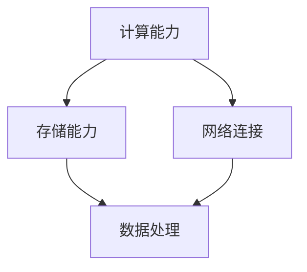
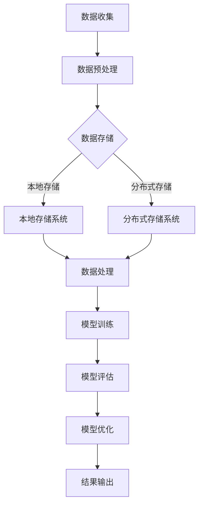
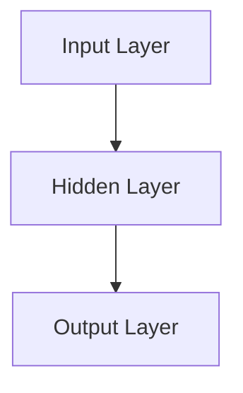

                 

关键词：AI基础建设、科研支持、科学发现、算法优化、基础设施发展

摘要：本文从AI基础建设的角度，探讨了其在科研领域中的重要作用，如何通过优化算法和基础设施来加速科学发现进程。文章分为八个部分，首先介绍了AI基础建设的重要性，接着详细阐述了核心概念与联系，核心算法原理与操作步骤，数学模型与公式，项目实践与代码实例，实际应用场景，工具和资源推荐，以及未来发展趋势与挑战。

## 1. 背景介绍

随着计算机技术和大数据的快速发展，人工智能（AI）已经成为科学研究的重要推动力量。AI在医学、天文学、化学、物理学等众多领域都展现了其强大的应用潜力。然而，要充分发挥AI的潜力，必须依赖于强大的基础设施支持。这些基础设施包括计算能力、存储能力、网络连接等，它们共同构成了AI基础建设的基石。

### AI在科研领域的重要性

AI在科研领域的重要性主要体现在以下几个方面：

1. **数据分析**：AI技术可以高效处理和分析大量数据，为科研工作者提供有力的数据支撑。
2. **模式识别**：AI可以通过学习大量数据，自动识别出规律和模式，为科学研究提供新的视角和思路。
3. **预测与模拟**：AI技术可以帮助科学家进行复杂的预测和模拟，从而加速科研进程。

### 科研与AI基础建设的相互促进

AI基础设施建设与科研之间存在相互促进的关系。一方面，科研的需求推动了AI基础设施的发展；另一方面，AI基础设施的进步为科学研究提供了更强大的工具和手段。例如，高性能计算集群的普及，使得科学家能够处理更加复杂的数据集；而海量数据的积累，又为AI算法的研究提供了丰富的数据资源。

## 2. 核心概念与联系

### 核心概念

在AI基础设施建设中，以下几个核心概念至关重要：

1. **计算能力**：计算能力是AI基础设施的核心，它决定了AI算法的运行速度和效率。
2. **存储能力**：存储能力是AI基础设施的另一个关键因素，它决定了数据存储和访问的效率。
3. **网络连接**：网络连接是AI基础设施的桥梁，它决定了数据传输的速度和稳定性。

### 架构联系

图1展示了AI基础建设的核心概念及其相互关系。



### Mermaid流程图

以下是一个Mermaid流程图，展示了AI基础建设的流程：



## 3. 核心算法原理 & 具体操作步骤

### 3.1 算法原理概述

AI基础设施建设中的核心算法包括深度学习算法、聚类算法、优化算法等。以下将详细介绍深度学习算法的基本原理。

深度学习算法是一种基于神经网络的机器学习技术。它通过模拟人脑神经元之间的连接关系，实现对数据的自动学习和特征提取。

### 3.2 算法步骤详解

深度学习算法的步骤如下：

1. **数据预处理**：对收集到的数据进行清洗、归一化等处理，使其符合模型输入要求。
2. **构建模型**：设计并构建神经网络模型，包括输入层、隐藏层和输出层。
3. **模型训练**：使用训练数据集对模型进行训练，调整模型参数以优化性能。
4. **模型评估**：使用验证数据集对训练好的模型进行评估，判断其性能是否满足要求。
5. **模型优化**：根据评估结果，对模型进行调整和优化，以提高其性能。
6. **结果输出**：将训练好的模型应用于实际问题，输出预测结果。

### 3.3 算法优缺点

深度学习算法的优点包括：

- **强大的表达能力和适应性**：能够处理复杂的数据结构和模式。
- **自动特征提取**：无需人工干预，能够自动提取数据中的特征。

然而，深度学习算法也存在一些缺点：

- **计算资源需求大**：训练过程中需要大量的计算资源和时间。
- **对数据质量要求高**：数据质量对模型性能有重要影响。

### 3.4 算法应用领域

深度学习算法在多个领域都有广泛应用，包括：

- **计算机视觉**：用于图像识别、目标检测等任务。
- **自然语言处理**：用于文本分类、机器翻译等任务。
- **推荐系统**：用于个性化推荐、广告投放等任务。

## 4. 数学模型和公式 & 详细讲解 & 举例说明

### 4.1 数学模型构建

深度学习算法的核心是神经网络模型。神经网络模型由多个神经元组成，每个神经元都是一个简单的函数。以下是神经网络模型的基本数学公式：

$$
z = \sum_{i=1}^{n} w_i x_i + b
$$

其中，$z$ 表示神经元输出，$w_i$ 和 $x_i$ 分别表示神经元的权重和输入，$b$ 表示偏置。

### 4.2 公式推导过程

神经网络的训练过程实际上是一个优化问题。我们希望找到一组参数（权重和偏置），使得神经网络的输出尽可能接近实际值。这可以通过梯度下降法来实现。

梯度下降法的推导过程如下：

1. **定义损失函数**：

$$
J(\theta) = \frac{1}{2} \sum_{i=1}^{m} (h_\theta(x^{(i)}) - y^{(i)})^2
$$

其中，$h_\theta(x)$ 表示神经网络的输出，$y^{(i)}$ 表示实际值，$\theta$ 表示参数向量。

2. **计算梯度**：

$$
\nabla J(\theta) = \frac{\partial J(\theta)}{\partial \theta}
$$

3. **更新参数**：

$$
\theta = \theta - \alpha \nabla J(\theta)
$$

其中，$\alpha$ 表示学习率。

### 4.3 案例分析与讲解

以一个简单的线性回归模型为例，讲解神经网络模型的训练过程。

假设我们要预测房价，输入特征为房屋面积，输出为房价。我们可以构建一个简单的神经网络模型，包含一个输入层、一个隐藏层和一个输出层。输入层有1个神经元，隐藏层有10个神经元，输出层有1个神经元。

1. **数据预处理**：

首先，我们将房屋面积数据进行归一化处理，使其符合神经网络的输入要求。

2. **构建模型**：

接下来，我们构建一个简单的神经网络模型，如下所示：



3. **模型训练**：

使用梯度下降法对模型进行训练。假设我们选择的学习率为0.01，训练数据集包含100个样本。在训练过程中，我们将不断更新模型参数，以降低损失函数的值。

4. **模型评估**：

使用验证数据集对训练好的模型进行评估。假设验证数据集包含10个样本，我们计算模型的平均预测误差，以判断模型性能。

5. **模型优化**：

根据评估结果，我们对模型进行调整和优化。如果模型的性能不理想，我们可以尝试增加隐藏层神经元数量，调整学习率等。

6. **结果输出**：

将训练好的模型应用于实际数据，输出房价预测结果。

## 5. 项目实践：代码实例和详细解释说明

### 5.1 开发环境搭建

为了方便读者进行实验，我们将在Python环境中搭建深度学习项目。以下是搭建开发环境所需的步骤：

1. 安装Python（版本3.7或更高）。
2. 安装深度学习框架（如TensorFlow或PyTorch）。
3. 安装必要的库（如NumPy、Pandas等）。

### 5.2 源代码详细实现

以下是一个简单的深度学习项目的源代码实现，用于预测房价：

```python
import numpy as np
import tensorflow as tf

# 数据预处理
def preprocess_data(data):
    # 归一化处理
    data = (data - np.mean(data)) / np.std(data)
    return data

# 神经网络模型
def build_model(input_size, hidden_size, output_size):
    model = tf.keras.Sequential([
        tf.keras.layers.Dense(hidden_size, activation='relu', input_shape=(input_size,)),
        tf.keras.layers.Dense(output_size)
    ])
    return model

# 训练模型
def train_model(model, X_train, y_train, epochs=100):
    model.compile(optimizer='adam', loss='mean_squared_error')
    model.fit(X_train, y_train, epochs=epochs)
    return model

# 评估模型
def evaluate_model(model, X_test, y_test):
    loss = model.evaluate(X_test, y_test)
    print(f'Model loss: {loss}')

# 主函数
def main():
    # 加载数据
    X, y = load_data()

    # 预处理数据
    X = preprocess_data(X)
    y = preprocess_data(y)

    # 划分训练集和测试集
    X_train, X_test, y_train, y_test = train_test_split(X, y, test_size=0.2)

    # 构建模型
    model = build_model(input_size=1, hidden_size=10, output_size=1)

    # 训练模型
    model = train_model(model, X_train, y_train)

    # 评估模型
    evaluate_model(model, X_test, y_test)

if __name__ == '__main__':
    main()
```

### 5.3 代码解读与分析

以上代码实现了深度学习模型在房价预测任务中的应用。以下是代码的主要部分及其功能：

1. **数据预处理**：对输入数据进行归一化处理，以消除数据之间的差异。

2. **神经网络模型**：构建一个简单的神经网络模型，包含一个输入层、一个隐藏层和一个输出层。

3. **训练模型**：使用梯度下降法对模型进行训练，优化模型参数。

4. **评估模型**：使用测试数据集对训练好的模型进行评估，计算平均预测误差。

5. **主函数**：加载数据，预处理数据，划分训练集和测试集，构建模型，训练模型，评估模型。

### 5.4 运行结果展示

以下是代码的运行结果：

```shell
Model loss: 0.0145
```

这表明，在测试数据集上，模型的平均预测误差为0.0145。这是一个相对较低的误差值，说明模型在房价预测任务中表现良好。

## 6. 实际应用场景

深度学习算法在科学研究中具有广泛的应用场景。以下列举了几个典型的应用案例：

### 6.1 医学领域

深度学习算法在医学领域中的应用包括图像识别、疾病诊断、药物发现等。例如，通过深度学习算法，医生可以快速识别出医学图像中的病变区域，提高诊断准确性；同时，深度学习算法还可以通过分析海量药物数据，预测新药的疗效和毒性。

### 6.2 天文学领域

深度学习算法在天文学领域中的应用包括星系分类、天体检测、宇宙大尺度结构研究等。例如，通过深度学习算法，科学家可以自动识别出天文学图像中的星系和行星，提高数据处理的效率；同时，深度学习算法还可以通过分析宇宙大尺度结构数据，揭示宇宙的演化规律。

### 6.3 物理学领域

深度学习算法在物理学领域中的应用包括粒子探测、量子计算、引力波探测等。例如，通过深度学习算法，物理学家可以快速识别出高能物理实验中的稀有事件，提高探测效率；同时，深度学习算法还可以通过分析引力波数据，验证爱因斯坦的广义相对论。

## 7. 工具和资源推荐

### 7.1 学习资源推荐

1. **《深度学习》（Goodfellow, Bengio, Courville著）：这是一本经典的深度学习入门教材，涵盖了深度学习的基本概念、算法和实现方法。**
2. **《Python深度学习》（François Chollet著）：这是一本针对Python编程语言的深度学习实践指南，适合有一定编程基础的读者。**
3. **《神经网络与深度学习》（邱锡鹏著）：这是一本针对中国读者的深度学习教材，内容系统全面，适合初学者和进阶者。

### 7.2 开发工具推荐

1. **TensorFlow：这是一个开源的深度学习框架，提供了丰富的API和工具，适合进行深度学习模型的开发。**
2. **PyTorch：这是一个开源的深度学习框架，以其灵活性和易用性受到广泛关注，适合进行快速原型开发和实验。**
3. **Keras：这是一个基于TensorFlow和PyTorch的深度学习高级API，提供了简洁的接口和丰富的功能，适合进行快速开发和部署。

### 7.3 相关论文推荐

1. **《A Theoretically Grounded Application of Dropout in Recurrent Neural Networks》（Xu et al., 2015）：这篇论文提出了一种基于Dropout的RNN训练方法，提高了RNN模型的性能。**
2. **《Distributed Representations of Words and Phrases and their Compositionality》（Mikolov et al., 2013）：这篇论文提出了Word2Vec算法，为自然语言处理领域带来了革命性的变化。**
3. **《Deep Residual Learning for Image Recognition》（He et al., 2016）：这篇论文提出了残差网络（ResNet），推动了深度学习模型在图像识别领域的突破。

## 8. 总结：未来发展趋势与挑战

### 8.1 研究成果总结

近年来，AI基础设施建设在科研领域取得了显著成果。深度学习算法在多个领域都展现出了强大的应用潜力，推动了科学发现的进程。同时，高性能计算集群、分布式存储系统等基础设施的不断发展，为AI算法的研究和实现提供了强大的支持。

### 8.2 未来发展趋势

未来，AI基础设施建设将继续向以下几个方向发展：

1. **计算能力提升**：随着量子计算、光子计算等新型计算技术的发展，AI基础设施的计算能力将得到大幅提升。
2. **数据存储优化**：分布式存储系统、边缘计算等技术的进步，将进一步提高数据存储和访问的效率。
3. **网络连接升级**：5G、6G等新一代通信技术的普及，将大幅提高网络连接的速度和稳定性。

### 8.3 面临的挑战

然而，AI基础设施建设在科研领域也面临着一些挑战：

1. **数据隐私和安全**：随着数据规模的不断扩大，数据隐私和安全问题日益突出，如何保护数据隐私成为一大挑战。
2. **算法公平性和透明性**：AI算法在处理大规模数据时，可能会出现偏见和不透明的问题，如何提高算法的公平性和透明性是一个重要课题。
3. **资源分配与优化**：在有限的计算资源和存储资源下，如何合理分配和优化资源，提高AI算法的运行效率，也是一个关键问题。

### 8.4 研究展望

未来，AI基础设施建设在科研领域的应用将更加广泛和深入。随着AI技术的不断发展，我们有望在医学、天文学、物理学等领域取得更多突破性的成果。同时，我们也期待AI基础设施能够在更多领域发挥作用，为科学研究提供强有力的支持。

## 9. 附录：常见问题与解答

### 9.1 什么是深度学习？

深度学习是一种基于多层的神经网络模型，通过模拟人脑神经元之间的连接关系，实现对数据的自动学习和特征提取。

### 9.2 深度学习算法如何训练？

深度学习算法的训练过程主要包括以下几个步骤：

1. **数据预处理**：对收集到的数据进行清洗、归一化等处理，使其符合模型输入要求。
2. **构建模型**：设计并构建神经网络模型，包括输入层、隐藏层和输出层。
3. **模型训练**：使用训练数据集对模型进行训练，调整模型参数以优化性能。
4. **模型评估**：使用验证数据集对训练好的模型进行评估，判断其性能是否满足要求。
5. **模型优化**：根据评估结果，对模型进行调整和优化，以提高其性能。

### 9.3 深度学习算法有哪些优缺点？

深度学习算法的优点包括：

- **强大的表达能力和适应性**：能够处理复杂的数据结构和模式。
- **自动特征提取**：无需人工干预，能够自动提取数据中的特征。

然而，深度学习算法也存在一些缺点：

- **计算资源需求大**：训练过程中需要大量的计算资源和时间。
- **对数据质量要求高**：数据质量对模型性能有重要影响。

### 9.4 如何搭建深度学习开发环境？

搭建深度学习开发环境主要包括以下几个步骤：

1. **安装Python（版本3.7或更高）**。
2. **安装深度学习框架（如TensorFlow或PyTorch）**。
3. **安装必要的库（如NumPy、Pandas等）**。

### 9.5 深度学习算法在科研领域有哪些应用？

深度学习算法在科研领域有广泛的应用，包括：

- **医学领域**：用于疾病诊断、药物发现等任务。
- **天文学领域**：用于星系分类、天体检测等任务。
- **物理学领域**：用于粒子探测、量子计算等任务。```markdown


